# Phân Phối
<a id="sec_distributions"></a>

Bây giờ khi đã học cách làm việc với xác suất trong cả bối cảnh rời rạc và liên tục, hãy làm quen với một số phân phối phổ biến thường gặp. Tùy vào lĩnh vực của machine learning, ta có thể cần quen thuộc với nhiều phân phối hơn rất nhiều, hoặc trong một số mảng của deep learning thì có thể hầu như không cần phân phối nào. Tuy nhiên, đây là một danh sách cơ bản tốt để nắm được. Trước hết hãy nhập một số thư viện thường dùng.

```python
#@tab mxnet
%matplotlib inline
from d2l import mxnet as d2l
from IPython import display
from math import erf, factorial
import numpy as np
```

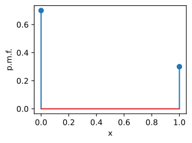


```python
#@tab pytorch
%matplotlib inline
from d2l import torch as d2l
from IPython import display
from math import erf, factorial
import torch

torch.pi = torch.acos(torch.zeros(1)) * 2  # Define pi in torch
```

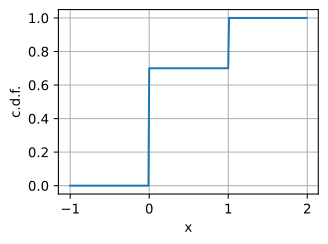


```python
#@tab tensorflow
%matplotlib inline
from d2l import tensorflow as d2l
from IPython import display
from math import erf, factorial
import tensorflow as tf
import tensorflow_probability as tfp

tf.pi = tf.acos(tf.zeros(1)) * 2  # Define pi in TensorFlow
```

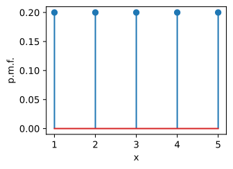


## Bernoulli

Đây là biến ngẫu nhiên đơn giản nhất thường gặp. Biến ngẫu nhiên này mã hóa một lần tung đồng xu ra giá trị $1$ với xác suất $p$ và $0$ với xác suất $1-p$. Nếu ta có một biến ngẫu nhiên $X$ với phân phối này, ta sẽ viết

$$
X \sim \textrm{Bernoulli}(p).
$$

Hàm phân phối tích lũy là

$$F(x) = \begin{cases} 0 & x < 0, \\ 1-p & 0 \le x < 1, \\ 1 & x >= 1 . \end{cases}$$

Hàm khối xác suất được vẽ bên dưới.

```python
#@tab all
p = 0.3

d2l.set_figsize()
d2l.plt.stem([0, 1], [1 - p, p], use_line_collection=True)
d2l.plt.xlabel('x')
d2l.plt.ylabel('p.m.f.')
d2l.plt.show()
```

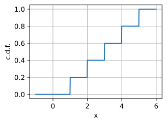


Bây giờ, hãy vẽ hàm phân phối tích lũy :eqref:`eq_bernoulli_cdf`.

```python
#@tab mxnet
x = np.arange(-1, 2, 0.01)

def F(x):
    return 0 if x < 0 else 1 if x > 1 else 1 - p

d2l.plot(x, np.array([F(y) for y in x]), 'x', 'c.d.f.')
```

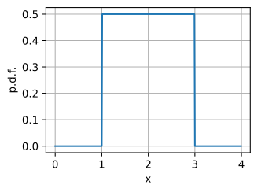


```python
#@tab pytorch
x = torch.arange(-1, 2, 0.01)

def F(x):
    return 0 if x < 0 else 1 if x > 1 else 1 - p

d2l.plot(x, torch.tensor([F(y) for y in x]), 'x', 'c.d.f.')
```

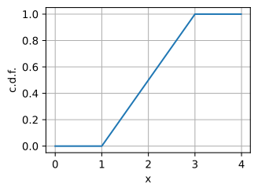


```python
#@tab tensorflow
x = tf.range(-1, 2, 0.01)

def F(x):
    return 0 if x < 0 else 1 if x > 1 else 1 - p

d2l.plot(x, tf.constant([F(y) for y in x]), 'x', 'c.d.f.')
```

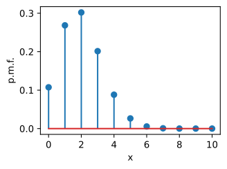


Nếu $X \sim \textrm{Bernoulli}(p)$, thì:

* $\mu_X = p$,
* $\sigma_X^2 = p(1-p)$.

Ta có thể lấy mẫu một mảng với hình dạng tùy ý từ một biến ngẫu nhiên Bernoulli như sau.

```python
#@tab mxnet
1*(np.random.rand(10, 10) < p)
```

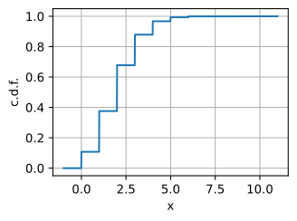


```python
#@tab pytorch
1*(torch.rand(10, 10) < p)
```

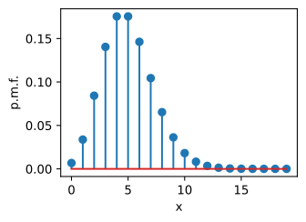


```python
#@tab tensorflow
tf.cast(tf.random.uniform((10, 10)) < p, dtype=tf.float32)
```

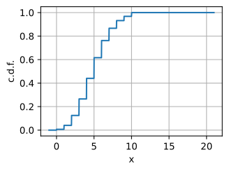


## Đều Rời Rạc

Biến ngẫu nhiên phổ biến tiếp theo là phân phối đều rời rạc. Trong phần thảo luận này, ta sẽ giả định nó có giá trên các số nguyên $\{1, 2, \ldots, n\}$, tuy nhiên có thể tự do chọn bất kỳ tập giá trị nào khác. Ý nghĩa của từ *đều* trong ngữ cảnh này là mọi giá trị có thể đều có xác suất như nhau. Xác suất cho mỗi giá trị $i \in \{1, 2, 3, \ldots, n\}$ là $p_i = \frac{1}{n}$. Ta sẽ ký hiệu một biến ngẫu nhiên $X$ với phân phối này là

$$
X \sim U(n).
$$

Hàm phân phối tích lũy là

$$F(x) = \begin{cases} 0 & x < 1, \\ \frac{k}{n} & k \le x < k+1 \textrm{ with } 1 \le k < n, \\ 1 & x >= n . \end{cases}$$

Trước hết hãy vẽ hàm khối xác suất.

```python
#@tab all
n = 5

d2l.plt.stem([i+1 for i in range(n)], n*[1 / n], use_line_collection=True)
d2l.plt.xlabel('x')
d2l.plt.ylabel('p.m.f.')
d2l.plt.show()
```

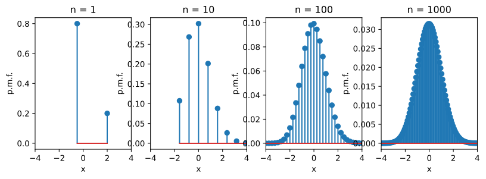


Bây giờ, hãy vẽ hàm phân phối tích lũy :eqref:`eq_discrete_uniform_cdf`.

```python
#@tab mxnet
x = np.arange(-1, 6, 0.01)

def F(x):
    return 0 if x < 1 else 1 if x > n else np.floor(x) / n

d2l.plot(x, np.array([F(y) for y in x]), 'x', 'c.d.f.')
```

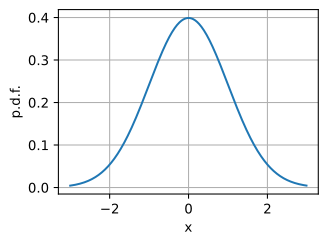


```python
#@tab pytorch
x = torch.arange(-1, 6, 0.01)

def F(x):
    return 0 if x < 1 else 1 if x > n else torch.floor(x) / n

d2l.plot(x, torch.tensor([F(y) for y in x]), 'x', 'c.d.f.')
```

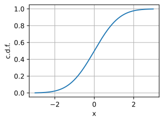


```python
#@tab tensorflow
x = tf.range(-1, 6, 0.01)

def F(x):
    return 0 if x < 1 else 1 if x > n else tf.floor(x) / n

d2l.plot(x, [F(y) for y in x], 'x', 'c.d.f.')
```

Nếu $X \sim U(n)$, thì:

* $\mu_X = \frac{1+n}{2}$,
* $\sigma_X^2 = \frac{n^2-1}{12}$.

Ta có thể lấy mẫu một mảng với hình dạng tùy ý từ một biến ngẫu nhiên đều rời rạc như sau.

```python
#@tab mxnet
np.random.randint(1, n, size=(10, 10))
```

```python
#@tab pytorch
torch.randint(1, n, size=(10, 10))
```

```python
#@tab tensorflow
tf.random.uniform((10, 10), 1, n, dtype=tf.int32)
```

## Đều Liên Tục

Tiếp theo, hãy thảo luận về phân phối đều liên tục. Ý tưởng đằng sau biến ngẫu nhiên này là nếu ta tăng $n$ trong phân phối đều rời rạc, rồi co giãn nó để nằm trong khoảng $[a, b]$, ta sẽ tiến đến một biến ngẫu nhiên liên tục chỉ chọn một giá trị tùy ý trong $[a, b]$ với xác suất như nhau. Ta sẽ ký hiệu phân phối này là

$$
X \sim U(a, b).
$$

Hàm mật độ xác suất là

$$p(x) = \begin{cases} \frac{1}{b-a} & x \in [a, b], \\ 0 & x \not\in [a, b].\end{cases}$$

Hàm phân phối tích lũy là

$$F(x) = \begin{cases} 0 & x < a, \\ \frac{x-a}{b-a} & x \in [a, b], \\ 1 & x >= b . \end{cases}$$

Trước hết hãy vẽ hàm mật độ xác suất :eqref:`eq_cont_uniform_pdf`.

```python
#@tab mxnet
a, b = 1, 3

x = np.arange(0, 4, 0.01)
p = (x > a)*(x < b)/(b - a)

d2l.plot(x, p, 'x', 'p.d.f.')
```

```python
#@tab pytorch
a, b = 1, 3

x = torch.arange(0, 4, 0.01)
p = (x > a).type(torch.float32)*(x < b).type(torch.float32)/(b-a)
d2l.plot(x, p, 'x', 'p.d.f.')
```

```python
#@tab tensorflow
a, b = 1, 3

x = tf.range(0, 4, 0.01)
p = tf.cast(x > a, tf.float32) * tf.cast(x < b, tf.float32) / (b - a)
d2l.plot(x, p, 'x', 'p.d.f.')
```

Bây giờ, hãy vẽ hàm phân phối tích lũy :eqref:`eq_cont_uniform_cdf`.

```python
#@tab mxnet
def F(x):
    return 0 if x < a else 1 if x > b else (x - a) / (b - a)

d2l.plot(x, np.array([F(y) for y in x]), 'x', 'c.d.f.')
```

```python
#@tab pytorch
def F(x):
    return 0 if x < a else 1 if x > b else (x - a) / (b - a)

d2l.plot(x, torch.tensor([F(y) for y in x]), 'x', 'c.d.f.')
```

```python
#@tab tensorflow
def F(x):
    return 0 if x < a else 1 if x > b else (x - a) / (b - a)

d2l.plot(x, [F(y) for y in x], 'x', 'c.d.f.')
```

Nếu $X \sim U(a, b)$, thì:

* $\mu_X = \frac{a+b}{2}$,
* $\sigma_X^2 = \frac{(b-a)^2}{12}$.

Ta có thể lấy mẫu một mảng với hình dạng tùy ý từ một biến ngẫu nhiên đều như sau. Lưu ý rằng mặc định nó lấy mẫu từ $U(0,1)$, nên nếu muốn một khoảng khác, ta cần co giãn nó.

```python
#@tab mxnet
(b - a) * np.random.rand(10, 10) + a
```

```python
#@tab pytorch
(b - a) * torch.rand(10, 10) + a
```

```python
#@tab tensorflow
(b - a) * tf.random.uniform((10, 10)) + a
```

## Nhị Thức

Hãy làm mọi thứ phức tạp hơn một chút và khảo sát biến ngẫu nhiên *nhị thức*. Biến ngẫu nhiên này bắt nguồn từ việc thực hiện một chuỗi $n$ thí nghiệm độc lập, mỗi thí nghiệm có xác suất thành công $p$, và hỏi ta kỳ vọng thấy bao nhiêu lần thành công.

Hãy biểu diễn điều này bằng toán học. Mỗi thí nghiệm là một biến ngẫu nhiên độc lập $X_i$, trong đó ta dùng $1$ để mã hóa thành công, và $0$ để mã hóa thất bại. Vì mỗi thí nghiệm là một lần tung đồng xu độc lập thành công với xác suất $p$, ta có thể nói rằng $X_i \sim \textrm{Bernoulli}(p)$. Khi đó, biến ngẫu nhiên nhị thức là

$$
X = \sum_{i=1}^n X_i.
$$

Trong trường hợp này, ta sẽ viết

$$
X \sim \textrm{Binomial}(n, p).
$$

Để thu được hàm phân phối tích lũy, ta cần lưu ý rằng việc có đúng $k$ lần thành công có thể xảy ra theo $\binom{n}{k} = \frac{n!}{k!(n-k)!}$ cách, mỗi cách có xác suất xảy ra là $p^k(1-p)^{n-k}$. Do đó hàm phân phối tích lũy là

$$F(x) = \begin{cases} 0 & x < 0, \\ \sum_{m \le k} \binom{n}{m} p^m(1-p)^{n-m}  & k \le x < k+1 \textrm{ with } 0 \le k < n, \\ 1 & x >= n . \end{cases}$$

Trước hết hãy vẽ hàm khối xác suất.

```python
#@tab mxnet
n, p = 10, 0.2

# Compute binomial coefficient
def binom(n, k):
    comb = 1
    for i in range(min(k, n - k)):
        comb = comb * (n - i) // (i + 1)
    return comb

pmf = np.array([p**i * (1-p)**(n - i) * binom(n, i) for i in range(n + 1)])

d2l.plt.stem([i for i in range(n + 1)], pmf, use_line_collection=True)
d2l.plt.xlabel('x')
d2l.plt.ylabel('p.m.f.')
d2l.plt.show()
```

```python
#@tab pytorch
n, p = 10, 0.2

# Compute binomial coefficient
def binom(n, k):
    comb = 1
    for i in range(min(k, n - k)):
        comb = comb * (n - i) // (i + 1)
    return comb

pmf = d2l.tensor([p**i * (1-p)**(n - i) * binom(n, i) for i in range(n + 1)])

d2l.plt.stem([i for i in range(n + 1)], pmf, use_line_collection=True)
d2l.plt.xlabel('x')
d2l.plt.ylabel('p.m.f.')
d2l.plt.show()
```

```python
#@tab tensorflow
n, p = 10, 0.2

# Compute binomial coefficient
def binom(n, k):
    comb = 1
    for i in range(min(k, n - k)):
        comb = comb * (n - i) // (i + 1)
    return comb

pmf = tf.constant([p**i * (1-p)**(n - i) * binom(n, i) for i in range(n + 1)])

d2l.plt.stem([i for i in range(n + 1)], pmf, use_line_collection=True)
d2l.plt.xlabel('x')
d2l.plt.ylabel('p.m.f.')
d2l.plt.show()
```

Bây giờ, hãy vẽ hàm phân phối tích lũy :eqref:`eq_binomial_cdf`.

```python
#@tab mxnet
x = np.arange(-1, 11, 0.01)
cmf = np.cumsum(pmf)

def F(x):
    return 0 if x < 0 else 1 if x > n else cmf[int(x)]

d2l.plot(x, np.array([F(y) for y in x.tolist()]), 'x', 'c.d.f.')
```

```python
#@tab pytorch
x = torch.arange(-1, 11, 0.01)
cmf = torch.cumsum(pmf, dim=0)

def F(x):
    return 0 if x < 0 else 1 if x > n else cmf[int(x)]

d2l.plot(x, torch.tensor([F(y) for y in x.tolist()]), 'x', 'c.d.f.')
```

```python
#@tab tensorflow
x = tf.range(-1, 11, 0.01)
cmf = tf.cumsum(pmf)

def F(x):
    return 0 if x < 0 else 1 if x > n else cmf[int(x)]

d2l.plot(x, [F(y) for y in x.numpy().tolist()], 'x', 'c.d.f.')
```

Nếu $X \sim \textrm{Binomial}(n, p)$, thì:

* $\mu_X = np$,
* $\sigma_X^2 = np(1-p)$.

Điều này suy ra từ tính tuyến tính của kỳ vọng trên tổng của $n$ biến ngẫu nhiên Bernoulli, và thực tế rằng phương sai của tổng các biến ngẫu nhiên độc lập là tổng các phương sai. Ta có thể lấy mẫu như sau.

```python
#@tab mxnet
np.random.binomial(n, p, size=(10, 10))
```

```python
#@tab pytorch
m = torch.distributions.binomial.Binomial(n, p)
m.sample(sample_shape=(10, 10))
```

```python
#@tab tensorflow
m = tfp.distributions.Binomial(n, p)
m.sample(sample_shape=(10, 10))
```

## Poisson
Giờ hãy thực hiện một thí nghiệm tưởng tượng. Ta đang đứng ở trạm xe buýt và muốn biết sẽ có bao nhiêu xe buýt đến trong phút tiếp theo. Hãy bắt đầu bằng cách xét $X^{(1)} \sim \textrm{Bernoulli}(p)$, đơn giản là xác suất một xe buýt đến trong cửa sổ một phút. Với các trạm xe buýt xa trung tâm đô thị, đây có thể là một xấp xỉ khá tốt. Có thể ta sẽ không bao giờ thấy nhiều hơn một xe buýt trong một phút.

Tuy nhiên, nếu ta ở một khu vực đông đúc, có thể hoặc thậm chí rất có khả năng hai xe buýt sẽ đến. Ta có thể mô hình hóa điều này bằng cách chia biến ngẫu nhiên của mình thành hai phần cho 30 giây đầu hoặc 30 giây sau. Trong trường hợp này, ta có thể viết

$$
X^{(2)} \sim X^{(2)}_1 + X^{(2)}_2,
$$

trong đó $X^{(2)}$ là tổng, và $X^{(2)}_i \sim \textrm{Bernoulli}(p/2)$. Phân phối tổng khi đó là $X^{(2)} \sim \textrm{Binomial}(2, p/2)$.

Tại sao dừng ở đây? Hãy tiếp tục chia phút đó thành $n$ phần. Với cùng lập luận như trên, ta thấy rằng

$$X^{(n)} \sim \textrm{Binomial}(n, p/n).$$

Hãy xét các biến ngẫu nhiên này. Theo phần trước, ta biết rằng :eqref:`eq_eq_poisson_approx` có trung bình $\mu_{X^{(n)}} = n(p/n) = p$, và phương sai $\sigma_{X^{(n)}}^2 = n(p/n)(1-(p/n)) = p(1-p/n)$. Nếu lấy $n \rightarrow \infty$, ta có thể thấy các con số này ổn định về $\mu_{X^{(\infty)}} = p$, và phương sai $\sigma_{X^{(\infty)}}^2 = p$. Điều này chỉ ra rằng *có thể có* một biến ngẫu nhiên nào đó mà ta có thể định nghĩa trong giới hạn chia nhỏ vô hạn này.

Điều này không nên quá bất ngờ, vì trong thế giới thực ta chỉ việc đếm số lượt xe buýt đến, tuy nhiên thật tốt khi thấy mô hình toán học của ta được định nghĩa tốt. Thảo luận này có thể được hình thức hóa thành *định luật các biến cố hiếm*.

Theo sát lập luận này một cách cẩn thận, ta có thể đi đến mô hình sau. Ta sẽ nói rằng $X \sim \textrm{Poisson}(\lambda)$ nếu nó là một biến ngẫu nhiên nhận các giá trị $\{0,1,2, \ldots\}$ với xác suất

$$p_k = \frac{\lambda^ke^{-\lambda}}{k!}.$$

Giá trị $\lambda > 0$ được gọi là *tốc độ* (hoặc tham số *hình dạng*), và biểu thị số lượt đến trung bình mà ta kỳ vọng trong một đơn vị thời gian.

Ta có thể cộng hàm khối xác suất này để thu được hàm phân phối tích lũy.

$$F(x) = \begin{cases} 0 & x < 0, \\ e^{-\lambda}\sum_{m = 0}^k \frac{\lambda^m}{m!} & k \le x < k+1 \textrm{ with } 0 \le k. \end{cases}$$

Trước hết hãy vẽ hàm khối xác suất :eqref:`eq_poisson_mass`.

```python
#@tab mxnet
lam = 5.0

xs = [i for i in range(20)]
pmf = np.array([np.exp(-lam) * lam**k / factorial(k) for k in xs])

d2l.plt.stem(xs, pmf, use_line_collection=True)
d2l.plt.xlabel('x')
d2l.plt.ylabel('p.m.f.')
d2l.plt.show()
```

```python
#@tab pytorch
lam = 5.0

xs = [i for i in range(20)]
pmf = torch.tensor([torch.exp(torch.tensor(-lam)) * lam**k
                    / factorial(k) for k in xs])

d2l.plt.stem(xs, pmf, use_line_collection=True)
d2l.plt.xlabel('x')
d2l.plt.ylabel('p.m.f.')
d2l.plt.show()
```

```python
#@tab tensorflow
lam = 5.0

xs = [i for i in range(20)]
pmf = tf.constant([tf.exp(tf.constant(-lam)).numpy() * lam**k
                    / factorial(k) for k in xs])

d2l.plt.stem(xs, pmf, use_line_collection=True)
d2l.plt.xlabel('x')
d2l.plt.ylabel('p.m.f.')
d2l.plt.show()
```

Bây giờ, hãy vẽ hàm phân phối tích lũy :eqref:`eq_poisson_cdf`.

```python
#@tab mxnet
x = np.arange(-1, 21, 0.01)
cmf = np.cumsum(pmf)
def F(x):
    return 0 if x < 0 else 1 if x > n else cmf[int(x)]

d2l.plot(x, np.array([F(y) for y in x.tolist()]), 'x', 'c.d.f.')
```

```python
#@tab pytorch
x = torch.arange(-1, 21, 0.01)
cmf = torch.cumsum(pmf, dim=0)
def F(x):
    return 0 if x < 0 else 1 if x > n else cmf[int(x)]

d2l.plot(x, torch.tensor([F(y) for y in x.tolist()]), 'x', 'c.d.f.')
```

```python
#@tab tensorflow
x = tf.range(-1, 21, 0.01)
cmf = tf.cumsum(pmf)
def F(x):
    return 0 if x < 0 else 1 if x > n else cmf[int(x)]

d2l.plot(x, [F(y) for y in x.numpy().tolist()], 'x', 'c.d.f.')
```

Như ta đã thấy ở trên, trung bình và phương sai đặc biệt ngắn gọn. Nếu $X \sim \textrm{Poisson}(\lambda)$, thì:

* $\mu_X = \lambda$,
* $\sigma_X^2 = \lambda$.

Ta có thể lấy mẫu như sau.

```python
#@tab mxnet
np.random.poisson(lam, size=(10, 10))
```

```python
#@tab pytorch
m = torch.distributions.poisson.Poisson(lam)
m.sample((10, 10))
```

```python
#@tab tensorflow
m = tfp.distributions.Poisson(lam)
m.sample((10, 10))
```

## Gaussian
Bây giờ hãy thử một thí nghiệm khác nhưng có liên quan. Giả sử ta lại thực hiện $n$ phép đo độc lập $\textrm{Bernoulli}(p)$, ký hiệu $X_i$. Phân phối của tổng các biến này là $X^{(n)} \sim \textrm{Binomial}(n, p)$. Thay vì lấy giới hạn khi $n$ tăng và $p$ giảm, hãy cố định $p$, rồi cho $n \rightarrow \infty$. Trong trường hợp này $\mu_{X^{(n)}} = np \rightarrow \infty$ và $\sigma_{X^{(n)}}^2 = np(1-p) \rightarrow \infty$, nên không có lý do gì để nghĩ rằng giới hạn này sẽ được định nghĩa tốt.

Tuy nhiên, chưa phải mọi hy vọng đã mất! Hãy chỉ làm cho trung bình và phương sai có hành vi tốt bằng cách định nghĩa

$$
Y^{(n)} = \frac{X^{(n)} - \mu_{X^{(n)}}}{\sigma_{X^{(n)}}}.
$$

Có thể thấy biến này có trung bình bằng không và phương sai bằng một, nên hợp lý khi tin rằng nó sẽ hội tụ về một phân phối giới hạn nào đó. Nếu ta vẽ các phân phối này trông như thế nào, ta sẽ càng tin rằng điều đó đúng.

```python
#@tab mxnet
p = 0.2
ns = [1, 10, 100, 1000]
d2l.plt.figure(figsize=(10, 3))
for i in range(4):
    n = ns[i]
    pmf = np.array([p**i * (1-p)**(n-i) * binom(n, i) for i in range(n + 1)])
    d2l.plt.subplot(1, 4, i + 1)
    d2l.plt.stem([(i - n*p)/np.sqrt(n*p*(1 - p)) for i in range(n + 1)], pmf,
                 use_line_collection=True)
    d2l.plt.xlim([-4, 4])
    d2l.plt.xlabel('x')
    d2l.plt.ylabel('p.m.f.')
    d2l.plt.title("n = {}".format(n))
d2l.plt.show()
```

```python
#@tab pytorch
p = 0.2
ns = [1, 10, 100, 1000]
d2l.plt.figure(figsize=(10, 3))
for i in range(4):
    n = ns[i]
    pmf = torch.tensor([p**i * (1-p)**(n-i) * binom(n, i)
                        for i in range(n + 1)])
    d2l.plt.subplot(1, 4, i + 1)
    d2l.plt.stem([(i - n*p)/torch.sqrt(torch.tensor(n*p*(1 - p)))
                  for i in range(n + 1)], pmf,
                 use_line_collection=True)
    d2l.plt.xlim([-4, 4])
    d2l.plt.xlabel('x')
    d2l.plt.ylabel('p.m.f.')
    d2l.plt.title("n = {}".format(n))
d2l.plt.show()
```

```python
#@tab tensorflow
p = 0.2
ns = [1, 10, 100, 1000]
d2l.plt.figure(figsize=(10, 3))
for i in range(4):
    n = ns[i]
    pmf = tf.constant([p**i * (1-p)**(n-i) * binom(n, i)
                        for i in range(n + 1)])
    d2l.plt.subplot(1, 4, i + 1)
    d2l.plt.stem([(i - n*p)/tf.sqrt(tf.constant(n*p*(1 - p)))
                  for i in range(n + 1)], pmf,
                 use_line_collection=True)
    d2l.plt.xlim([-4, 4])
    d2l.plt.xlabel('x')
    d2l.plt.ylabel('p.m.f.')
    d2l.plt.title("n = {}".format(n))
d2l.plt.show()
```

Một điều cần lưu ý: so với trường hợp Poisson, giờ ta đang chia cho độ lệch chuẩn, nghĩa là ta đang nén các kết quả có thể vào những vùng ngày càng nhỏ hơn. Đây là một dấu hiệu cho thấy giới hạn của ta sẽ không còn rời rạc nữa, mà là liên tục.

Việc suy ra điều gì xảy ra nằm ngoài phạm vi tài liệu này, nhưng *định lý giới hạn trung tâm* phát biểu rằng khi $n \rightarrow \infty$, điều này sẽ cho phân phối Gaussian (hoặc đôi khi gọi là phân phối chuẩn). Cụ thể hơn, với mọi $a, b$:

$$
\lim_{n \rightarrow \infty} P(Y^{(n)} \in [a, b]) = P(\mathcal{N}(0,1) \in [a, b]),
$$

trong đó ta nói một biến ngẫu nhiên có phân phối chuẩn với trung bình $\mu$ và phương sai $\sigma^2$, viết là $X \sim \mathcal{N}(\mu, \sigma^2)$, nếu $X$ có mật độ

$$p_X(x) = \frac{1}{\sqrt{2\pi\sigma^2}}e^{-\frac{(x-\mu)^2}{2\sigma^2}}.$$

Trước hết hãy vẽ hàm mật độ xác suất :eqref:`eq_gaussian_pdf`.

```python
#@tab mxnet
mu, sigma = 0, 1

x = np.arange(-3, 3, 0.01)
p = 1 / np.sqrt(2 * np.pi * sigma**2) * np.exp(-(x - mu)**2 / (2 * sigma**2))

d2l.plot(x, p, 'x', 'p.d.f.')
```

```python
#@tab pytorch
mu, sigma = 0, 1

x = torch.arange(-3, 3, 0.01)
p = 1 / torch.sqrt(2 * torch.pi * sigma**2) * torch.exp(
    -(x - mu)**2 / (2 * sigma**2))

d2l.plot(x, p, 'x', 'p.d.f.')
```

```python
#@tab tensorflow
mu, sigma = 0, 1

x = tf.range(-3, 3, 0.01)
p = 1 / tf.sqrt(2 * tf.pi * sigma**2) * tf.exp(
    -(x - mu)**2 / (2 * sigma**2))

d2l.plot(x, p, 'x', 'p.d.f.')
```

Bây giờ, hãy vẽ hàm phân phối tích lũy. Điều này nằm ngoài phạm vi phụ lục này, nhưng c.d.f. Gaussian không có công thức dạng đóng theo các hàm sơ cấp hơn. Ta sẽ dùng `erf`, cung cấp một cách tính tích phân này bằng số.

```python
#@tab mxnet
def phi(x):
    return (1.0 + erf((x - mu) / (sigma * np.sqrt(2)))) / 2.0

d2l.plot(x, np.array([phi(y) for y in x.tolist()]), 'x', 'c.d.f.')
```

```python
#@tab pytorch
def phi(x):
    return (1.0 + erf((x - mu) / (sigma * torch.sqrt(d2l.tensor(2.))))) / 2.0

d2l.plot(x, torch.tensor([phi(y) for y in x.tolist()]), 'x', 'c.d.f.')
```

```python
#@tab tensorflow
def phi(x):
    return (1.0 + erf((x - mu) / (sigma * tf.sqrt(tf.constant(2.))))) / 2.0

d2l.plot(x, [phi(y) for y in x.numpy().tolist()], 'x', 'c.d.f.')
```

Những độc giả tinh ý sẽ nhận ra một số hạng tử này. Thật vậy, ta đã gặp tích phân này trong [sec_integral_calculus](#sec_integral_calculus). Và chính xác phép tính đó là điều ta cần để thấy rằng $p_X(x)$ này có tổng diện tích bằng một, do đó là một mật độ hợp lệ.

Việc chọn làm việc với các lần tung đồng xu khiến phép tính ngắn hơn, nhưng không có gì căn bản trong lựa chọn đó. Thật vậy, nếu ta lấy bất kỳ tập hợp các biến ngẫu nhiên độc lập cùng phân phối $X_i$ nào, và lập

$$
X^{(N)} = \sum_{i=1}^N X_i.
$$

Khi đó

$$
\frac{X^{(N)} - \mu_{X^{(N)}}}{\sigma_{X^{(N)}}}
$$

sẽ xấp xỉ Gaussian. Có thêm các yêu cầu cần thiết để điều này hoạt động, phổ biến nhất là $E[X^4] < \infty$, nhưng triết lý thì rõ ràng.

Định lý giới hạn trung tâm là lý do Gaussian có vai trò nền tảng trong xác suất, thống kê và machine learning. Bất cứ khi nào ta có thể nói rằng một thứ ta đo được là tổng của nhiều đóng góp nhỏ độc lập, ta có thể giả định rằng thứ được đo sẽ gần với Gaussian.

Còn nhiều tính chất hấp dẫn khác của Gaussian, và ở đây ta muốn thảo luận thêm một tính chất nữa. Gaussian là thứ được gọi là *phân phối entropy cực đại*. Chúng ta sẽ đi sâu hơn vào entropy trong [sec_information_theory](#sec_information_theory), tuy nhiên điều cần biết ở thời điểm này là nó là một thước đo tính ngẫu nhiên. Theo nghĩa toán học chặt chẽ, ta có thể nghĩ Gaussian là lựa chọn biến ngẫu nhiên *ngẫu nhiên nhất* với trung bình và phương sai cố định. Vì vậy, nếu biết biến ngẫu nhiên của mình có một trung bình và phương sai nào đó, Gaussian theo một nghĩa nào đó là lựa chọn phân phối thận trọng nhất mà ta có thể đưa ra.

Để kết thúc phần này, hãy nhớ rằng nếu $X \sim \mathcal{N}(\mu, \sigma^2)$, thì:

* $\mu_X = \mu$,
* $\sigma_X^2 = \sigma^2$.

Ta có thể lấy mẫu từ phân phối Gaussian (hoặc chuẩn tắc) như minh họa bên dưới.

```python
#@tab mxnet
np.random.normal(mu, sigma, size=(10, 10))
```

```python
#@tab pytorch
torch.normal(mu, sigma, size=(10, 10))
```

```python
#@tab tensorflow
tf.random.normal((10, 10), mu, sigma)
```

## Họ Hàm Mũ
<a id="subsec_exponential_family"></a>

Một tính chất chung của tất cả các phân phối được liệt kê ở trên là chúng đều thuộc về thứ được gọi là *họ hàm mũ*. Họ hàm mũ là một tập các phân phối mà mật độ của chúng có thể được biểu diễn dưới dạng sau:

$$p(\mathbf{x} \mid \boldsymbol{\eta}) = h(\mathbf{x}) \cdot \exp \left( \boldsymbol{\eta}^{\top} \cdot T(\mathbf{x}) - A(\boldsymbol{\eta}) \right)$$

Vì định nghĩa này có thể hơi tinh tế, hãy khảo sát nó thật kỹ.

Thứ nhất, $h(\mathbf{x})$ được gọi là *độ đo nền* hoặc *độ đo cơ sở*. Có thể xem đây là lựa chọn độ đo ban đầu mà ta đang điều chỉnh bằng trọng số hàm mũ của mình.

Thứ hai, ta có vector $\boldsymbol{\eta} = (\eta_1, \eta_2, ..., \eta_l) \in
\mathbb{R}^l$ được gọi là *tham số tự nhiên* hoặc *tham số chính tắc*. Chúng định nghĩa cách độ đo cơ sở sẽ được điều chỉnh. Các tham số tự nhiên đi vào độ đo mới bằng cách lấy tích vô hướng giữa các tham số này với một hàm nào đó $T(\cdot)$ của $\mathbf{x}= (x_1, x_2, ..., x_n) \in
\mathbb{R}^n$ rồi lấy hàm mũ. Vector $T(\mathbf{x})= (T_1(\mathbf{x}),
T_2(\mathbf{x}), ..., T_l(\mathbf{x}))$ được gọi là *thống kê đủ* cho $\boldsymbol{\eta}$. Tên này được dùng vì thông tin được biểu diễn bởi $T(\mathbf{x})$ là đủ để tính mật độ xác suất, và không cần thông tin nào khác từ các mẫu $\mathbf{x}$.

Thứ ba, ta có $A(\boldsymbol{\eta})$, được gọi là *hàm tích lũy*, bảo đảm rằng phân phối ở trên :eqref:`eq_exp_pdf` tích phân thành một, tức là

$$A(\boldsymbol{\eta})  = \log \left[\int h(\mathbf{x}) \cdot \exp
\left(\boldsymbol{\eta}^{\top} \cdot T(\mathbf{x}) \right) d\mathbf{x} \right].$$

Để cụ thể, hãy xét Gaussian. Giả sử $\mathbf{x}$ là một biến đơn biến, ta đã thấy rằng nó có mật độ

$$
\begin{aligned}
p(x \mid \mu, \sigma) &= \frac{1}{\sqrt{2 \pi \sigma^2}} \cdot \exp 
\left\{ \frac{-(x-\mu)^2}{2 \sigma^2} \right\} \\
&= \frac{1}{\sqrt{2 \pi}} \cdot \exp \left\{ \frac{\mu}{\sigma^2}x
-\frac{1}{2 \sigma^2} x^2 - \left( \frac{1}{2 \sigma^2} \mu^2
+\log(\sigma) \right) \right\}.
\end{aligned}
$$

Điều này khớp với định nghĩa của họ hàm mũ với:

* *độ đo nền*: $h(x) = \frac{1}{\sqrt{2 \pi}}$,
* *tham số tự nhiên*: $\boldsymbol{\eta} = \begin{bmatrix} \eta_1 \\ \eta_2
\end{bmatrix} = \begin{bmatrix} \frac{\mu}{\sigma^2} \\
\frac{1}{2 \sigma^2} \end{bmatrix}$,
* *thống kê đủ*: $T(x) = \begin{bmatrix}x\\-x^2\end{bmatrix}$, và
* *hàm tích lũy*: $A({\boldsymbol\eta}) = \frac{1}{2 \sigma^2} \mu^2 + \log(\sigma)
= \frac{\eta_1^2}{4 \eta_2} - \frac{1}{2}\log(2 \eta_2)$.

Đáng lưu ý rằng lựa chọn chính xác của từng hạng tử ở trên có phần tùy ý. Thật vậy, đặc điểm quan trọng là phân phối có thể được biểu diễn dưới dạng này, chứ không phải chính dạng chính xác đó.

Như ta đã ám chỉ trong [subsec_softmax_and_derivatives](#subsec_softmax_and_derivatives), một kỹ thuật được sử dụng rộng rãi là giả định đầu ra cuối cùng $\mathbf{y}$ tuân theo một phân phối thuộc họ hàm mũ. Họ hàm mũ là một họ phân phối phổ biến và mạnh mẽ thường gặp trong machine learning.


## Tóm Tắt
* Biến ngẫu nhiên Bernoulli có thể được dùng để mô hình hóa các biến cố có kết quả có/không.
* Phân phối đều rời rạc mô hình hóa việc chọn từ một tập hữu hạn các khả năng.
* Phân phối đều liên tục chọn từ một khoảng.
* Phân phối nhị thức mô hình hóa một chuỗi các biến ngẫu nhiên Bernoulli và đếm số lần thành công.
* Biến ngẫu nhiên Poisson mô hình hóa sự xuất hiện của các biến cố hiếm.
* Biến ngẫu nhiên Gaussian mô hình hóa kết quả của việc cộng một số lượng lớn các biến ngẫu nhiên độc lập lại với nhau.
* Tất cả các phân phối ở trên đều thuộc họ hàm mũ.

## Bài Tập

1. Độ lệch chuẩn của một biến ngẫu nhiên là hiệu $X-Y$ của hai biến ngẫu nhiên nhị thức độc lập $X, Y \sim \textrm{Binomial}(16, 1/2)$ là bao nhiêu?
2. Nếu ta lấy một biến ngẫu nhiên Poisson $X \sim \textrm{Poisson}(\lambda)$ và xét $(X - \lambda)/\sqrt{\lambda}$ khi $\lambda \rightarrow \infty$, ta có thể chứng minh rằng nó trở nên xấp xỉ Gaussian. Vì sao điều này hợp lý?
3. Hàm khối xác suất cho tổng của hai biến ngẫu nhiên đều rời rạc trên $n$ phần tử là gì?


[Thảo luận](https://discuss.d2l.ai/t/1098)
