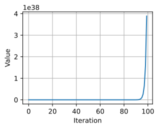
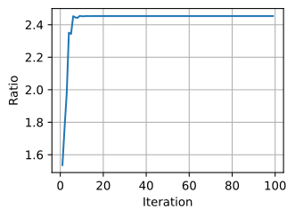
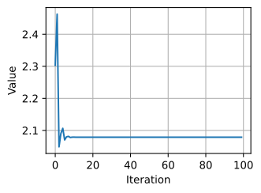
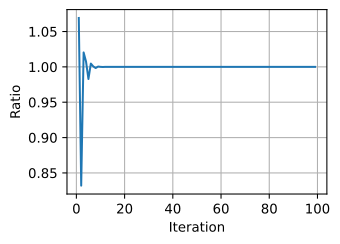

# Phân rã trị riêng
<a id="sec_eigendecompositions"></a>

Trị riêng thường là một trong những khái niệm hữu ích nhất mà ta sẽ gặp khi học đại số tuyến tính, tuy nhiên với người mới bắt đầu, rất dễ bỏ qua tầm quan trọng của chúng. Dưới đây, chúng ta giới thiệu phân rã trị riêng và cố gắng truyền tải một phần lý do vì sao nó quan trọng đến vậy.

Giả sử ta có một ma trận $A$ với các phần tử sau:

$$
\mathbf{A} = \begin{bmatrix}
2 & 0 \\
0 & -1
\end{bmatrix}.
$$

Nếu áp dụng $A$ cho bất kỳ vector nào $\mathbf{v} = [x, y]^\top$, ta thu được vector $\mathbf{A}\mathbf{v} = [2x, -y]^\top$. Điều này có một diễn giải trực giác: kéo giãn vector để rộng gấp đôi theo hướng $x$, rồi lật nó theo hướng $y$.

Tuy nhiên, có *một số* vector mà với chúng, điều gì đó vẫn không đổi. Cụ thể, $[1, 0]^\top$ được gửi tới $[2, 0]^\top$ và $[0, 1]^\top$ được gửi tới $[0, -1]^\top$. Những vector này vẫn nằm trên cùng một đường thẳng, và thay đổi duy nhất là ma trận kéo giãn chúng lần lượt theo hệ số $2$ và $-1$. Ta gọi các vector như vậy là *vector riêng*, và hệ số mà chúng bị kéo giãn là *trị riêng*.

Nói chung, nếu ta có thể tìm một số $\lambda$ và một vector $\mathbf{v}$ sao cho

$$
\mathbf{A}\mathbf{v} = \lambda \mathbf{v}.
$$

Ta nói rằng $\mathbf{v}$ là một vector riêng của $A$ và $\lambda$ là một trị riêng.

## Tìm trị riêng
Hãy tìm cách xác định chúng. Bằng cách trừ $\lambda \mathbf{v}$ khỏi hai vế, rồi đặt vector ra ngoài, ta thấy biểu thức trên tương đương với:

$$(\mathbf{A} - \lambda \mathbf{I})\mathbf{v} = 0.$$

Để :eqref:`eq_eigvalue_der` xảy ra, ta thấy $(\mathbf{A} - \lambda \mathbf{I})$ phải nén một hướng nào đó xuống không, do đó nó không khả nghịch, và vì vậy định thức bằng không. Do đó, ta có thể tìm các *trị riêng* bằng cách tìm những $\lambda$ sao cho $\det(\mathbf{A}-\lambda \mathbf{I}) = 0$. Sau khi tìm được trị riêng, ta có thể giải $\mathbf{A}\mathbf{v} = \lambda \mathbf{v}$ để tìm các *vector riêng* tương ứng.

### Một ví dụ
Hãy xem điều này với một ma trận khó hơn

$$
\mathbf{A} = \begin{bmatrix}
2 & 1\\
2 & 3
\end{bmatrix}.
$$

Nếu xét $\det(\mathbf{A}-\lambda \mathbf{I}) = 0$, ta thấy điều này tương đương với phương trình đa thức $0 = (2-\lambda)(3-\lambda)-2 = (4-\lambda)(1-\lambda)$. Vì vậy, hai trị riêng là $4$ và $1$. Để tìm các vector tương ứng, ta cần giải

$$
\begin{bmatrix}
2 & 1\\
2 & 3
\end{bmatrix}\begin{bmatrix}x \\ y\end{bmatrix} = \begin{bmatrix}x \\ y\end{bmatrix}  \; \textrm{and} \;
\begin{bmatrix}
2 & 1\\
2 & 3
\end{bmatrix}\begin{bmatrix}x \\ y\end{bmatrix}  = \begin{bmatrix}4x \\ 4y\end{bmatrix} .
$$

Ta có thể giải được các vector lần lượt là $[1, -1]^\top$ và $[1, 2]^\top$.

Ta có thể kiểm tra điều này trong mã bằng routine dựng sẵn `numpy.linalg.eig`.

```python
#@tab mxnet
%matplotlib inline
from d2l import mxnet as d2l
from IPython import display
import numpy as np

np.linalg.eig(np.array([[2, 1], [2, 3]]))
```




```python
#@tab pytorch
%matplotlib inline
from d2l import torch as d2l
from IPython import display
import torch

torch.linalg.eig(torch.tensor([[2, 1], [2, 3]], dtype=torch.float64))
```




```python
#@tab tensorflow
%matplotlib inline
from d2l import tensorflow as d2l
from IPython import display
import tensorflow as tf

tf.linalg.eig(tf.constant([[2, 1], [2, 3]], dtype=tf.float64))
```




Lưu ý rằng `numpy` chuẩn hóa các vector riêng để có độ dài bằng một, trong khi ta đã lấy chúng với độ dài tùy ý. Ngoài ra, lựa chọn dấu là tùy ý. Tuy nhiên, các vector được tính song song với những vector ta tìm bằng tay với cùng các trị riêng.

## Phân rã ma trận
Hãy tiếp tục ví dụ trước thêm một bước. Gọi

$$
\mathbf{W} = \begin{bmatrix}
1 & 1 \\
-1 & 2
\end{bmatrix},
$$

là ma trận mà các cột là các vector riêng của ma trận $\mathbf{A}$. Gọi

$$
\boldsymbol{\Sigma} = \begin{bmatrix}
1 & 0 \\
0 & 4
\end{bmatrix},
$$

là ma trận có các trị riêng tương ứng trên đường chéo. Khi đó, định nghĩa của trị riêng và vector riêng cho ta biết rằng

$$
\mathbf{A}\mathbf{W} =\mathbf{W} \boldsymbol{\Sigma} .
$$

Ma trận $W$ khả nghịch, vì vậy ta có thể nhân cả hai vế với $W^{-1}$ ở bên phải, và thấy rằng ta có thể viết

$$\mathbf{A} = \mathbf{W} \boldsymbol{\Sigma} \mathbf{W}^{-1}.$$

Trong phần tiếp theo, ta sẽ thấy một số hệ quả đẹp của điều này, nhưng hiện tại chỉ cần biết rằng một phân rã như vậy sẽ tồn tại miễn là ta có thể tìm được một tập đầy đủ các vector riêng độc lập tuyến tính (để $W$ khả nghịch).

## Các phép toán trên phân rã trị riêng
Một điều hay về phân rã trị riêng :eqref:`eq_eig_decomp` là ta có thể viết sạch sẽ nhiều phép toán thường gặp theo phân rã trị riêng. Như một ví dụ đầu tiên, xét:

$$
\mathbf{A}^n = \overbrace{\mathbf{A}\cdots \mathbf{A}}^{\textrm{$n$ times}} = \overbrace{(\mathbf{W}\boldsymbol{\Sigma} \mathbf{W}^{-1})\cdots(\mathbf{W}\boldsymbol{\Sigma} \mathbf{W}^{-1})}^{\textrm{$n$ times}} =  \mathbf{W}\overbrace{\boldsymbol{\Sigma}\cdots\boldsymbol{\Sigma}}^{\textrm{$n$ times}}\mathbf{W}^{-1} = \mathbf{W}\boldsymbol{\Sigma}^n \mathbf{W}^{-1}.
$$

Điều này cho ta biết rằng với bất kỳ lũy thừa dương nào của một ma trận, phân rã trị riêng thu được chỉ bằng cách nâng các trị riêng lên cùng lũy thừa. Điều tương tự có thể được chứng minh cho lũy thừa âm, nên nếu muốn nghịch đảo một ma trận, ta chỉ cần xét

$$
\mathbf{A}^{-1} = \mathbf{W}\boldsymbol{\Sigma}^{-1} \mathbf{W}^{-1},
$$

hay nói cách khác, chỉ cần nghịch đảo từng trị riêng. Điều này hoạt động miễn là mỗi trị riêng khác không, nên ta thấy khả nghịch tương đương với việc không có trị riêng bằng không.

Thật vậy, với thêm một chút công sức, ta có thể chỉ ra rằng nếu $\lambda_1, \ldots, \lambda_n$ là các trị riêng của một ma trận, thì định thức của ma trận đó là

$$
\det(\mathbf{A}) = \lambda_1 \cdots \lambda_n,
$$

tức là tích của tất cả các trị riêng. Điều này hợp lý về mặt trực giác vì bất kỳ sự kéo giãn nào mà $\mathbf{W}$ tạo ra đều được $W^{-1}$ đảo ngược, nên cuối cùng sự kéo giãn duy nhất xảy ra là phép nhân với ma trận đường chéo $\boldsymbol{\Sigma}$, vốn kéo giãn thể tích theo tích các phần tử đường chéo.

Cuối cùng, nhớ rằng hạng là số lượng tối đa các cột độc lập tuyến tính của ma trận. Bằng cách xem xét kỹ phân rã trị riêng, ta có thể thấy rằng hạng bằng số trị riêng khác không của $\mathbf{A}$.

Các ví dụ có thể tiếp tục, nhưng hy vọng điểm chính đã rõ: phân rã trị riêng có thể đơn giản hóa nhiều phép tính đại số tuyến tính và là một phép toán nền tảng nằm dưới nhiều thuật toán số cũng như phần lớn phân tích mà ta thực hiện trong đại số tuyến tính.

## Phân rã trị riêng của ma trận đối xứng
Không phải lúc nào cũng có thể tìm đủ vector riêng độc lập tuyến tính để quy trình trên hoạt động. Chẳng hạn ma trận

$$
\mathbf{A} = \begin{bmatrix}
1 & 1 \\
0 & 1
\end{bmatrix},
$$

chỉ có một vector riêng duy nhất, cụ thể là $(1, 0)^\top$. Để xử lý các ma trận như vậy, ta cần các kỹ thuật nâng cao hơn mức có thể trình bày ở đây (như dạng chuẩn Jordan hoặc phân rã giá trị suy biến). Ta thường cần giới hạn sự chú ý vào những ma trận mà ta có thể đảm bảo sự tồn tại của một tập đầy đủ các vector riêng.

Họ thường gặp nhất là các *ma trận đối xứng*, tức là các ma trận thỏa $\mathbf{A} = \mathbf{A}^\top$. Trong trường hợp này, ta có thể lấy $W$ là một *ma trận trực giao*, một ma trận mà các cột đều là vector độ dài một và vuông góc với nhau, trong đó $\mathbf{W}^\top = \mathbf{W}^{-1}$, và tất cả trị riêng sẽ là số thực. Do đó, trong trường hợp đặc biệt này, ta có thể viết :eqref:`eq_eig_decomp` là

$$
\mathbf{A} = \mathbf{W}\boldsymbol{\Sigma}\mathbf{W}^\top .
$$

## Định lý vòng tròn Gershgorin
Trị riêng thường khó suy luận bằng trực giác. Nếu được đưa một ma trận tùy ý, ta hầu như không thể nói gì về các trị riêng nếu không tính chúng. Tuy nhiên, có một định lý có thể giúp xấp xỉ khá dễ nếu các giá trị lớn nhất nằm trên đường chéo.

Gọi $\mathbf{A} = (a_{ij})$ là một ma trận vuông bất kỳ ($n\times n$). Ta định nghĩa $r_i = \sum_{j \neq i} |a_{ij}|$. Gọi $\mathcal{D}_i$ là đĩa trong mặt phẳng phức có tâm $a_{ii}$ và bán kính $r_i$. Khi đó, mọi trị riêng của $\mathbf{A}$ đều nằm trong một trong các $\mathcal{D}_i$.

Điều này cần được unpack một chút, nên hãy xem một ví dụ. Xét ma trận:

$$
\mathbf{A} = \begin{bmatrix}
1.0 & 0.1 & 0.1 & 0.1 \\
0.1 & 3.0 & 0.2 & 0.3 \\
0.1 & 0.2 & 5.0 & 0.5 \\
0.1 & 0.3 & 0.5 & 9.0
\end{bmatrix}.
$$

Ta có $r_1 = 0.3$, $r_2 = 0.6$, $r_3 = 0.8$ và $r_4 = 0.9$. Ma trận đối xứng, nên tất cả trị riêng đều là số thực. Điều này có nghĩa là tất cả trị riêng sẽ nằm trong một trong các khoảng

$$[a_{11}-r_1, a_{11}+r_1] = [0.7, 1.3], $$

$$[a_{22}-r_2, a_{22}+r_2] = [2.4, 3.6], $$

$$[a_{33}-r_3, a_{33}+r_3] = [4.2, 5.8], $$

$$[a_{44}-r_4, a_{44}+r_4] = [8.1, 9.9]. $$


Thực hiện tính toán số cho thấy các trị riêng xấp xỉ $0.99$, $2.97$, $4.95$, $9.08$, đều nằm thoải mái trong các khoảng đã cho.

```python
#@tab mxnet
A = np.array([[1.0, 0.1, 0.1, 0.1],
              [0.1, 3.0, 0.2, 0.3],
              [0.1, 0.2, 5.0, 0.5],
              [0.1, 0.3, 0.5, 9.0]])

v, _ = np.linalg.eig(A)
v
```




```python
#@tab pytorch
A = torch.tensor([[1.0, 0.1, 0.1, 0.1],
              [0.1, 3.0, 0.2, 0.3],
              [0.1, 0.2, 5.0, 0.5],
              [0.1, 0.3, 0.5, 9.0]])

v, _ = torch.linalg.eig(A)
v
```

```python
#@tab tensorflow
A = tf.constant([[1.0, 0.1, 0.1, 0.1],
                [0.1, 3.0, 0.2, 0.3],
                [0.1, 0.2, 5.0, 0.5],
                [0.1, 0.3, 0.5, 9.0]])

v, _ = tf.linalg.eigh(A)
v
```

Theo cách này, trị riêng có thể được xấp xỉ, và các xấp xỉ sẽ khá chính xác trong trường hợp đường chéo lớn hơn đáng kể so với tất cả phần tử khác.

Đây là một điều nhỏ, nhưng với một chủ đề phức tạp và tinh tế như phân rã trị riêng, có được bất kỳ nắm bắt trực giác nào cũng là điều tốt.

## Một ứng dụng hữu ích: sự tăng trưởng của các ánh xạ lặp

Bây giờ khi đã hiểu về nguyên tắc vector riêng là gì, hãy xem chúng có thể được dùng thế nào để cung cấp hiểu biết sâu về một vấn đề trung tâm trong hành vi mạng nơ-ron: khởi tạo trọng số đúng.

### Vector riêng như hành vi dài hạn

Khảo sát toán học đầy đủ về khởi tạo mạng nơ-ron sâu nằm ngoài phạm vi văn bản này, nhưng ta có thể xem một phiên bản đồ chơi ở đây để hiểu cách trị riêng có thể giúp ta thấy những mô hình này hoạt động như thế nào. Như ta biết, mạng nơ-ron hoạt động bằng cách xen kẽ các tầng biến đổi tuyến tính với các phép toán phi tuyến. Để đơn giản ở đây, ta sẽ giả định không có phi tuyến, và phép biến đổi là một phép toán ma trận đơn lặp lại $A$, sao cho đầu ra của mô hình là

$$
\mathbf{v}_{out} = \mathbf{A}\cdot \mathbf{A}\cdots \mathbf{A} \mathbf{v}_{in} = \mathbf{A}^N \mathbf{v}_{in}.
$$

Khi các mô hình này được khởi tạo, $A$ được lấy là một ma trận ngẫu nhiên với các phần tử Gaussian, vậy hãy tạo một ma trận như vậy. Cụ thể, ta bắt đầu với một ma trận $5 \times 5$ có các phần tử phân phối Gaussian trung bình không, phương sai một.

```python
#@tab mxnet
np.random.seed(8675309)

k = 5
A = np.random.randn(k, k)
A
```

```python
#@tab pytorch
torch.manual_seed(42)

k = 5
A = torch.randn(k, k, dtype=torch.float64)
A
```

```python
#@tab tensorflow
k = 5
A = tf.random.normal((k, k), dtype=tf.float64)
A
```

### Hành vi trên dữ liệu ngẫu nhiên
Để đơn giản trong mô hình đồ chơi của mình, ta sẽ giả định vector dữ liệu đầu vào $\mathbf{v}_{in}$ là một vector Gaussian ngẫu nhiên năm chiều. Hãy nghĩ về điều ta muốn xảy ra. Để có bối cảnh, hãy nghĩ về một bài toán ML tổng quát, nơi ta cố biến dữ liệu đầu vào, như một ảnh, thành một dự đoán, như xác suất ảnh đó là ảnh một con mèo. Nếu việc áp dụng lặp lại $\mathbf{A}$ kéo giãn một vector ngẫu nhiên thành rất dài, thì các thay đổi nhỏ trong đầu vào sẽ được khuếch đại thành các thay đổi lớn trong đầu ra, tức những chỉnh sửa rất nhỏ của ảnh đầu vào sẽ dẫn đến các dự đoán rất khác nhau. Điều này có vẻ không đúng!

Ngược lại, nếu $\mathbf{A}$ làm các vector ngẫu nhiên ngắn lại, thì sau khi chạy qua nhiều tầng, vector về cơ bản sẽ co lại gần như không còn gì, và đầu ra sẽ không phụ thuộc vào đầu vào. Điều này cũng rõ ràng là không đúng!

Ta cần đi trên đường ranh hẹp giữa tăng trưởng và suy giảm để đảm bảo đầu ra thay đổi phụ thuộc vào đầu vào, nhưng không quá nhiều!

Hãy xem điều gì xảy ra khi ta liên tục nhân ma trận $\mathbf{A}$ với một vector đầu vào ngẫu nhiên, và theo dõi chuẩn.

```python
#@tab mxnet
# Calculate the sequence of norms after repeatedly applying `A`
v_in = np.random.randn(k, 1)

norm_list = [np.linalg.norm(v_in)]
for i in range(1, 100):
    v_in = A.dot(v_in)
    norm_list.append(np.linalg.norm(v_in))

d2l.plot(np.arange(0, 100), norm_list, 'Iteration', 'Value')
```

```python
#@tab pytorch
# Calculate the sequence of norms after repeatedly applying `A`
v_in = torch.randn(k, 1, dtype=torch.float64)

norm_list = [torch.norm(v_in).item()]
for i in range(1, 100):
    v_in = A @ v_in
    norm_list.append(torch.norm(v_in).item())

d2l.plot(torch.arange(0, 100), norm_list, 'Iteration', 'Value')
```

```python
#@tab tensorflow
# Calculate the sequence of norms after repeatedly applying `A`
v_in = tf.random.normal((k, 1), dtype=tf.float64)

norm_list = [tf.norm(v_in).numpy()]
for i in range(1, 100):
    v_in = tf.matmul(A, v_in)
    norm_list.append(tf.norm(v_in).numpy())

d2l.plot(tf.range(0, 100), norm_list, 'Iteration', 'Value')
```

Chuẩn đang tăng ngoài kiểm soát! Thật vậy, nếu lấy danh sách các thương số, ta sẽ thấy một mẫu.

```python
#@tab mxnet
# Compute the scaling factor of the norms
norm_ratio_list = []
for i in range(1, 100):
    norm_ratio_list.append(norm_list[i]/norm_list[i - 1])

d2l.plot(np.arange(1, 100), norm_ratio_list, 'Iteration', 'Ratio')
```

```python
#@tab pytorch
# Compute the scaling factor of the norms
norm_ratio_list = []
for i in range(1, 100):
    norm_ratio_list.append(norm_list[i]/norm_list[i - 1])

d2l.plot(torch.arange(1, 100), norm_ratio_list, 'Iteration', 'Ratio')
```

```python
#@tab tensorflow
# Compute the scaling factor of the norms
norm_ratio_list = []
for i in range(1, 100):
    norm_ratio_list.append(norm_list[i]/norm_list[i - 1])

d2l.plot(tf.range(1, 100), norm_ratio_list, 'Iteration', 'Ratio')
```

Nếu nhìn vào phần cuối của phép tính trên, ta thấy vector ngẫu nhiên bị kéo giãn theo hệ số `1.974459321485[...]`, trong đó phần cuối thay đổi một chút, nhưng hệ số kéo giãn là ổn định.

### Liên hệ lại với vector riêng

Ta đã thấy vector riêng và trị riêng tương ứng với lượng mà một thứ bị kéo giãn, nhưng đó là với các vector cụ thể và các độ kéo giãn cụ thể. Hãy xem chúng là gì đối với $\mathbf{A}$. Có một lưu ý nhỏ ở đây: hóa ra để thấy tất cả chúng, ta sẽ cần đi vào số phức. Bạn có thể nghĩ về chúng như các phép kéo giãn và xoay. Bằng cách lấy chuẩn của số phức (căn bậc hai của tổng bình phương phần thực và phần ảo), ta có thể đo hệ số kéo giãn đó. Hãy cũng sắp xếp chúng.

```python
#@tab mxnet
# Compute the eigenvalues
eigs = np.linalg.eigvals(A).tolist()
norm_eigs = [np.absolute(x) for x in eigs]
norm_eigs.sort()
print(f'norms of eigenvalues: {norm_eigs}')
```

```python
#@tab pytorch
# Compute the eigenvalues
eigs = torch.linalg.eig(A).eigenvalues.tolist()
norm_eigs = [torch.abs(torch.tensor(x)) for x in eigs]
norm_eigs.sort()
print(f'norms of eigenvalues: {norm_eigs}')
```

```python
#@tab tensorflow
# Compute the eigenvalues
eigs = tf.linalg.eigh(A)[0].numpy().tolist()
norm_eigs = [tf.abs(tf.constant(x, dtype=tf.float64)) for x in eigs]
norm_eigs.sort()
print(f'norms of eigenvalues: {norm_eigs}')
```

### Một quan sát

Ta thấy có một điều hơi bất ngờ xảy ra ở đây: con số mà ta đã nhận diện trước đó cho độ kéo giãn dài hạn của ma trận $\mathbf{A}$ khi áp dụng lên một vector ngẫu nhiên *chính xác* (đúng tới mười ba chữ số thập phân!) là trị riêng lớn nhất của $\mathbf{A}$. Điều này rõ ràng không phải ngẫu nhiên!

Nhưng nếu bây giờ suy nghĩ về điều đang xảy ra theo hình học, nó bắt đầu hợp lý. Xét một vector ngẫu nhiên. Vector ngẫu nhiên này chỉ một chút theo mọi hướng, nên đặc biệt nó chỉ ít nhất một chút theo cùng hướng với vector riêng của $\mathbf{A}$ gắn với trị riêng lớn nhất. Điều này quan trọng đến mức nó được gọi là *trị riêng chính* và *vector riêng chính*. Sau khi áp dụng $\mathbf{A}$, vector ngẫu nhiên của ta bị kéo giãn theo mọi hướng có thể, tương ứng với mọi vector riêng có thể, nhưng nó bị kéo giãn nhiều nhất theo hướng gắn với vector riêng chính này. Điều này có nghĩa là sau khi áp dụng $A$, vector ngẫu nhiên của ta dài hơn, và chỉ theo một hướng gần thẳng hàng hơn với vector riêng chính. Sau khi áp dụng ma trận nhiều lần, sự thẳng hàng với vector riêng chính trở nên ngày càng gần, cho tới khi trên thực tế vector ngẫu nhiên đã được biến đổi thành vector riêng chính! Thật vậy, thuật toán này là cơ sở cho thứ được gọi là *lặp lũy thừa* để tìm trị riêng và vector riêng lớn nhất của một ma trận. Xem chi tiết, chẳng hạn, trong [Golub.Van-Loan.1996].

### Sửa chuẩn hóa

Bây giờ, từ các thảo luận trên, ta kết luận rằng ta không muốn một vector ngẫu nhiên bị kéo giãn hay nén lại chút nào; ta muốn các vector ngẫu nhiên giữ kích thước xấp xỉ như nhau trong toàn bộ quá trình. Để làm vậy, bây giờ ta co giãn lại ma trận bằng trị riêng chính này sao cho trị riêng lớn nhất giờ chỉ bằng một. Hãy xem điều gì xảy ra trong trường hợp này.

```python
#@tab mxnet
# Rescale the matrix `A`
A /= norm_eigs[-1]

# Do the same experiment again
v_in = np.random.randn(k, 1)

norm_list = [np.linalg.norm(v_in)]
for i in range(1, 100):
    v_in = A.dot(v_in)
    norm_list.append(np.linalg.norm(v_in))

d2l.plot(np.arange(0, 100), norm_list, 'Iteration', 'Value')
```

```python
#@tab pytorch
# Rescale the matrix `A`
A /= norm_eigs[-1]

# Do the same experiment again
v_in = torch.randn(k, 1, dtype=torch.float64)

norm_list = [torch.norm(v_in).item()]
for i in range(1, 100):
    v_in = A @ v_in
    norm_list.append(torch.norm(v_in).item())

d2l.plot(torch.arange(0, 100), norm_list, 'Iteration', 'Value')
```

```python
#@tab tensorflow
# Rescale the matrix `A`
A /= norm_eigs[-1]

# Do the same experiment again
v_in = tf.random.normal((k, 1), dtype=tf.float64)

norm_list = [tf.norm(v_in).numpy()]
for i in range(1, 100):
    v_in = tf.matmul(A, v_in)
    norm_list.append(tf.norm(v_in).numpy())

d2l.plot(tf.range(0, 100), norm_list, 'Iteration', 'Value')
```

Ta cũng có thể vẽ tỷ lệ giữa các chuẩn liên tiếp như trước và thấy rằng nó thật sự ổn định.

```python
#@tab mxnet
# Also plot the ratio
norm_ratio_list = []
for i in range(1, 100):
    norm_ratio_list.append(norm_list[i]/norm_list[i-1])

d2l.plot(np.arange(1, 100), norm_ratio_list, 'Iteration', 'Ratio')
```

```python
#@tab pytorch
# Also plot the ratio
norm_ratio_list = []
for i in range(1, 100):
    norm_ratio_list.append(norm_list[i]/norm_list[i-1])

d2l.plot(torch.arange(1, 100), norm_ratio_list, 'Iteration', 'Ratio')
```

```python
#@tab tensorflow
# Also plot the ratio
norm_ratio_list = []
for i in range(1, 100):
    norm_ratio_list.append(norm_list[i]/norm_list[i-1])

d2l.plot(tf.range(1, 100), norm_ratio_list, 'Iteration', 'Ratio')
```

## Thảo luận

Bây giờ ta thấy đúng điều mình mong đợi! Sau khi chuẩn hóa các ma trận bằng trị riêng chính, ta thấy dữ liệu ngẫu nhiên không bùng nổ như trước, mà cuối cùng cân bằng về một giá trị cụ thể. Sẽ rất tốt nếu có thể làm những điều này từ các nguyên lý đầu tiên, và hóa ra nếu nhìn sâu vào toán học của nó, ta có thể thấy rằng trị riêng lớn nhất của một ma trận ngẫu nhiên lớn với các phần tử Gaussian độc lập trung bình không, phương sai một, trung bình khoảng $\sqrt{n}$, hoặc trong trường hợp của chúng ta là $\sqrt{5} \approx 2.2$, do một sự thật thú vị gọi là *luật tròn* [Ginibre.1965]. Mối quan hệ giữa các trị riêng (và một đối tượng liên quan gọi là giá trị suy biến) của ma trận ngẫu nhiên đã được chứng minh là có các kết nối sâu sắc với khởi tạo đúng mạng nơ-ron, như đã thảo luận trong Pennington.Schoenholz.Ganguli.2017 và các công trình sau đó.

## Tóm tắt
* Vector riêng là các vector bị ma trận kéo giãn mà không đổi hướng.
* Trị riêng là lượng mà các vector riêng bị kéo giãn bởi việc áp dụng ma trận.
* Phân rã trị riêng của một ma trận có thể cho phép nhiều phép toán được rút gọn thành các phép toán trên trị riêng.
* Định lý vòng tròn Gershgorin có thể cung cấp các giá trị xấp xỉ cho trị riêng của một ma trận.
* Hành vi của các lũy thừa ma trận lặp phụ thuộc chủ yếu vào kích thước của trị riêng lớn nhất. Cách hiểu này có nhiều ứng dụng trong lý thuyết khởi tạo mạng nơ-ron.

## Bài tập
1. Trị riêng và vector riêng của ma trận sau là gì?
$$
\mathbf{A} = \begin{bmatrix}
2 & 1 \\
1 & 2
\end{bmatrix}?
$$
1. Trị riêng và vector riêng của ma trận sau là gì, và điều gì kỳ lạ ở ví dụ này so với ví dụ trước?
$$
\mathbf{A} = \begin{bmatrix}
2 & 1 \\
0 & 2
\end{bmatrix}.
$$
1. Không tính trị riêng, liệu trị riêng nhỏ nhất của ma trận sau có thể nhỏ hơn $0.5$ không? *Lưu ý*: bài này có thể làm nhẩm.
$$
\mathbf{A} = \begin{bmatrix}
3.0 & 0.1 & 0.3 & 1.0 \\
0.1 & 1.0 & 0.1 & 0.2 \\
0.3 & 0.1 & 5.0 & 0.0 \\
1.0 & 0.2 & 0.0 & 1.8
\end{bmatrix}.
$$


[Thảo luận](https://discuss.d2l.ai/t/1086)
