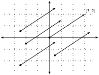
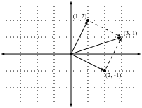
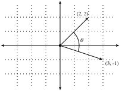
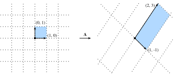

# Hình học và các phép toán đại số tuyến tính
<a id="sec_geometry-linear-algebraic-ops"></a>

Trong [sec_linear-algebra](#sec_linear-algebra), chúng ta đã gặp các kiến thức cơ bản của đại số tuyến tính và thấy cách nó có thể được dùng để biểu diễn những phép toán phổ biến nhằm biến đổi dữ liệu. Đại số tuyến tính là một trong những trụ cột toán học then chốt nằm dưới phần lớn công việc chúng ta làm trong học sâu và rộng hơn là trong học máy. Mặc dù [sec_linear-algebra](#sec_linear-algebra) đã chứa đủ công cụ để truyền đạt cơ chế của các mô hình học sâu hiện đại, chủ đề này còn nhiều điều hơn thế. Trong phần này, chúng ta sẽ đi sâu hơn, làm nổi bật một số diễn giải hình học của các phép toán đại số tuyến tính, và giới thiệu vài khái niệm nền tảng, bao gồm trị riêng và vector riêng.

## Hình học của vector
Trước hết, chúng ta cần thảo luận hai cách diễn giải hình học phổ biến của vector: hoặc là điểm, hoặc là hướng trong không gian. Về cơ bản, một vector là một danh sách các số, chẳng hạn danh sách Python dưới đây.

```python
#@tab all
v = [1, 7, 0, 1]
```

Các nhà toán học thường viết nó dưới dạng vector *cột* hoặc vector *hàng*, tức là một trong hai dạng

$$
\mathbf{x} = \begin{bmatrix}1\\7\\0\\1\end{bmatrix},
$$

hoặc

$$
\mathbf{x}^\top = \begin{bmatrix}1 & 7 & 0 & 1\end{bmatrix}.
$$

Những dạng này thường có các diễn giải khác nhau, trong đó ví dụ dữ liệu là vector cột, còn trọng số dùng để tạo tổng có trọng số là vector hàng. Tuy nhiên, linh hoạt trong cách nhìn là có lợi. Như đã mô tả trong [sec_linear-algebra](#sec_linear-algebra), mặc dù hướng mặc định của một vector riêng lẻ là vector cột, với bất kỳ ma trận nào biểu diễn một bộ dữ liệu dạng bảng, cách quy ước phổ biến hơn là xem mỗi ví dụ dữ liệu như một vector hàng trong ma trận.

Với một vector, diễn giải đầu tiên mà chúng ta nên gán cho nó là một điểm trong không gian. Trong hai hoặc ba chiều, chúng ta có thể trực quan hóa các điểm này bằng cách dùng các thành phần của vector để xác định vị trí của điểm trong không gian so với một mốc cố định gọi là *gốc tọa độ*. Điều này được minh họa trong [fig_grid](#fig_grid).


<a id="fig_grid"></a>

Quan điểm hình học này cho phép chúng ta xem xét vấn đề ở một mức trừu tượng hơn. Thay vì đối mặt với một bài toán có vẻ không thể vượt qua như phân loại ảnh là mèo hay chó, chúng ta có thể bắt đầu xem xét các tác vụ một cách trừu tượng như những tập điểm trong không gian, và hình dung tác vụ là khám phá cách tách hai cụm điểm khác nhau.

Song song với đó, có một góc nhìn thứ hai mà mọi người thường dùng đối với vector: xem chúng như các hướng trong không gian. Ta không chỉ có thể nghĩ về vector $\mathbf{v} = [3,2]^\top$ như vị trí cách gốc tọa độ $3$ đơn vị sang phải và $2$ đơn vị lên trên, mà còn có thể nghĩ về chính nó như hướng để đi $3$ bước sang phải và $2$ bước lên. Theo cách này, chúng ta xem tất cả vector trong hình [fig_arrow](#fig_arrow) là như nhau.


<a id="fig_arrow"></a>

Một lợi ích của sự thay đổi góc nhìn này là chúng ta có thể hiểu trực quan phép cộng vector. Cụ thể, ta đi theo hướng được cho bởi một vector, rồi tiếp tục đi theo hướng được cho bởi vector còn lại, như trong [fig_add-vec](#fig_add-vec).


<a id="fig_add-vec"></a>

Phép trừ vector có một diễn giải tương tự. Bằng cách xét đồng nhất thức $\mathbf{u} = \mathbf{v} + (\mathbf{u}-\mathbf{v})$, ta thấy vector $\mathbf{u}-\mathbf{v}$ là hướng đưa ta từ điểm $\mathbf{v}$ đến điểm $\mathbf{u}$.


## Tích vô hướng và góc
Như đã thấy trong [sec_linear-algebra](#sec_linear-algebra), nếu lấy hai vector cột $\mathbf{u}$ và $\mathbf{v}$, ta có thể tạo tích vô hướng của chúng bằng cách tính:

$$\mathbf{u}^\top\mathbf{v} = \sum_i u_i\cdot v_i.$$

Vì :eqref:`eq_dot_def` có tính đối xứng, chúng ta sẽ mô phỏng ký hiệu của phép nhân cổ điển và viết

$$
\mathbf{u}\cdot\mathbf{v} = \mathbf{u}^\top\mathbf{v} = \mathbf{v}^\top\mathbf{u},
$$

để nhấn mạnh rằng đổi thứ tự hai vector vẫn cho cùng một kết quả.

Tích vô hướng :eqref:`eq_dot_def` cũng có một diễn giải hình học: nó liên hệ chặt chẽ với góc giữa hai vector. Hãy xét góc được minh họa trong [fig_angle](#fig_angle).


<a id="fig_angle"></a>

Để bắt đầu, hãy xét hai vector cụ thể:

$$
\mathbf{v} = (r,0) \; \textrm{and} \; \mathbf{w} = (s\cos(\theta), s \sin(\theta)).
$$

Vector $\mathbf{v}$ có độ dài $r$ và song song với trục $x$, còn vector $\mathbf{w}$ có độ dài $s$ và tạo góc $\theta$ với trục $x$. Nếu tính tích vô hướng của hai vector này, ta thấy

$$
\mathbf{v}\cdot\mathbf{w} = rs\cos(\theta) = \|\mathbf{v}\|\|\mathbf{w}\|\cos(\theta).
$$

Với một chút biến đổi đại số đơn giản, ta có thể sắp xếp lại các hạng để thu được

$$
\theta = \arccos\left(\frac{\mathbf{v}\cdot\mathbf{w}}{\|\mathbf{v}\|\|\mathbf{w}\|}\right).
$$

Tóm lại, với hai vector cụ thể này, tích vô hướng kết hợp với các chuẩn cho ta góc giữa hai vector. Sự thật tương tự cũng đúng nói chung. Ở đây chúng ta sẽ không suy ra biểu thức này, tuy nhiên nếu xét cách viết $\|\mathbf{v} - \mathbf{w}\|^2$ theo hai cách: một cách dùng tích vô hướng, và cách kia dùng định luật cosin theo hình học, ta có thể thu được quan hệ đầy đủ. Thật vậy, với bất kỳ hai vector $\mathbf{v}$ và $\mathbf{w}$ nào, góc giữa hai vector là

$$\theta = \arccos\left(\frac{\mathbf{v}\cdot\mathbf{w}}{\|\mathbf{v}\|\|\mathbf{w}\|}\right).$$

Đây là một kết quả đẹp vì không có gì trong phép tính tham chiếu đến không gian hai chiều. Thật vậy, ta có thể dùng nó trong ba chiều hoặc ba triệu chiều mà không gặp vấn đề.

Như một ví dụ đơn giản, hãy xem cách tính góc giữa một cặp vector:

```python
#@tab mxnet
%matplotlib inline
from d2l import mxnet as d2l
from IPython import display
from mxnet import gluon, np, npx
npx.set_np()

def angle(v, w):
    return np.arccos(v.dot(w) / (np.linalg.norm(v) * np.linalg.norm(w)))

angle(np.array([0, 1, 2]), np.array([2, 3, 4]))
```

```python
#@tab pytorch
%matplotlib inline
from d2l import torch as d2l
from IPython import display
import torch
from torchvision import transforms
import torchvision

def angle(v, w):
    return torch.acos(v.dot(w) / (torch.norm(v) * torch.norm(w)))

angle(torch.tensor([0, 1, 2], dtype=torch.float32), torch.tensor([2.0, 3, 4]))
```

```python
#@tab tensorflow
%matplotlib inline
from d2l import tensorflow as d2l
from IPython import display
import tensorflow as tf

def angle(v, w):
    return tf.acos(tf.tensordot(v, w, axes=1) / (tf.norm(v) * tf.norm(w)))

angle(tf.constant([0, 1, 2], dtype=tf.float32), tf.constant([2.0, 3, 4]))
```

Hiện tại chúng ta chưa dùng đến nó, nhưng cần biết rằng ta sẽ gọi các vector có góc bằng $\pi/2$ (hoặc tương đương $90^{\circ}$) là *trực giao*. Bằng cách xem phương trình trên, ta thấy điều này xảy ra khi $\theta = \pi/2$, cũng chính là $\cos(\theta) = 0$. Cách duy nhất để điều này xảy ra là bản thân tích vô hướng bằng không, và hai vector trực giao khi và chỉ khi $\mathbf{v}\cdot\mathbf{w} = 0$. Đây sẽ là một công thức hữu ích khi hiểu các đối tượng theo hình học.

Một câu hỏi hợp lý là: tại sao tính góc lại hữu ích? Câu trả lời nằm ở kiểu bất biến mà ta kỳ vọng dữ liệu có. Hãy xét một ảnh và một bản sao của ảnh đó, trong đó mọi giá trị pixel đều giống nhau nhưng độ sáng chỉ bằng $10\%$. Các giá trị của từng pixel nhìn chung khác xa giá trị ban đầu. Vì vậy, nếu tính khoảng cách giữa ảnh gốc và ảnh tối hơn, khoảng cách có thể lớn. Tuy nhiên, với hầu hết ứng dụng ML, *nội dung* là như nhau, nó vẫn là ảnh một con mèo xét theo bộ phân loại mèo/chó. Nếu xét góc, không khó để thấy rằng với bất kỳ vector $\mathbf{v}$ nào, góc giữa $\mathbf{v}$ và $0.1\cdot\mathbf{v}$ bằng không. Điều này tương ứng với việc co giãn vector giữ nguyên hướng và chỉ thay đổi độ dài. Góc xem ảnh tối hơn là giống hệt.

Các ví dụ như vậy xuất hiện khắp nơi. Trong văn bản, ta có thể muốn chủ đề đang được thảo luận không thay đổi nếu ta viết một tài liệu dài gấp đôi nhưng nói cùng một điều. Với một số cách mã hóa (chẳng hạn đếm số lần xuất hiện của các từ trong một từ vựng), điều này tương ứng với việc nhân đôi vector mã hóa tài liệu, nên một lần nữa ta có thể dùng góc.

### Độ tương đồng cosin
Trong các ngữ cảnh ML nơi góc được dùng để đo độ gần nhau của hai vector, người thực hành dùng thuật ngữ *độ tương đồng cosin* để chỉ phần
$$
\cos(\theta) = \frac{\mathbf{v}\cdot\mathbf{w}}{\|\mathbf{v}\|\|\mathbf{w}\|}.
$$

Cosin đạt giá trị lớn nhất là $1$ khi hai vector chỉ cùng hướng, giá trị nhỏ nhất là $-1$ khi chúng chỉ theo hai hướng đối nhau, và bằng $0$ khi hai vector trực giao. Lưu ý rằng nếu các thành phần của vector số chiều cao được lấy mẫu ngẫu nhiên với trung bình $0$, cosin của chúng gần như luôn gần $0$.


## Siêu phẳng

Bên cạnh làm việc với vector, một đối tượng then chốt khác mà bạn phải hiểu để tiến xa trong đại số tuyến tính là *siêu phẳng*, một tổng quát hóa lên chiều cao hơn của đường thẳng (hai chiều) hoặc mặt phẳng (ba chiều). Trong một không gian vector $d$ chiều, một siêu phẳng có $d-1$ chiều và chia không gian thành hai nửa không gian.

Hãy bắt đầu bằng một ví dụ. Giả sử ta có một vector cột $\mathbf{w}=[2,1]^\top$. Ta muốn biết: "các điểm $\mathbf{v}$ nào thỏa $\mathbf{w}\cdot\mathbf{v} = 1$?" Nhớ lại mối liên hệ giữa tích vô hướng và góc ở trên :eqref:`eq_angle_forumla`, ta có thể thấy điều này tương đương với
$$
\|\mathbf{v}\|\|\mathbf{w}\|\cos(\theta) = 1 \; \iff \; \|\mathbf{v}\|\cos(\theta) = \frac{1}{\|\mathbf{w}\|} = \frac{1}{\sqrt{5}}.
$$


<a id="fig_vector-project"></a>

Nếu xét ý nghĩa hình học của biểu thức này, ta thấy nó tương đương với việc nói rằng độ dài hình chiếu của $\mathbf{v}$ lên hướng của $\mathbf{w}$ đúng bằng $1/\|\mathbf{w}\|$, như trong [fig_vector-project](#fig_vector-project). Tập tất cả các điểm mà điều này đúng là một đường thẳng vuông góc với vector $\mathbf{w}$. Nếu muốn, ta có thể tìm phương trình của đường thẳng này và thấy nó là $2x + y = 1$ hoặc tương đương $y = 1 - 2x$.

Nếu bây giờ xét điều gì xảy ra khi hỏi về tập các điểm có $\mathbf{w}\cdot\mathbf{v} > 1$ hoặc $\mathbf{w}\cdot\mathbf{v} < 1$, ta thấy đây là các trường hợp mà hình chiếu lần lượt dài hơn hoặc ngắn hơn $1/\|\mathbf{w}\|$. Vì vậy, hai bất đẳng thức này xác định hai phía của đường thẳng. Theo cách này, ta đã tìm được một cách cắt không gian thành hai nửa, trong đó mọi điểm ở một phía có tích vô hướng dưới một ngưỡng, còn phía kia thì trên ngưỡng, như trong [fig_space-division](#fig_space-division).


<a id="fig_space-division"></a>

Câu chuyện trong chiều cao hơn cũng tương tự. Nếu bây giờ lấy $\mathbf{w} = [1,2,3]^\top$ và hỏi về các điểm trong ba chiều có $\mathbf{w}\cdot\mathbf{v} = 1$, ta thu được một mặt phẳng vuông góc với vector đã cho $\mathbf{w}$. Hai bất đẳng thức lại xác định hai phía của mặt phẳng như trong [fig_higher-division](#fig_higher-division).


<a id="fig_higher-division"></a>

Dù khả năng trực quan hóa của chúng ta dừng lại ở đây, không có gì ngăn ta thực hiện điều này trong hàng chục, hàng trăm hoặc hàng tỷ chiều. Điều này thường xảy ra khi suy nghĩ về các mô hình học máy. Ví dụ, ta có thể hiểu các mô hình phân loại tuyến tính như trong [sec_softmax](#sec_softmax) là các phương pháp tìm siêu phẳng tách các lớp mục tiêu khác nhau. Trong ngữ cảnh này, các siêu phẳng như vậy thường được gọi là *mặt phẳng quyết định*. Phần lớn các mô hình phân loại học sâu kết thúc bằng một tầng tuyến tính đưa vào softmax, vì vậy ta có thể diễn giải vai trò của mạng nơ-ron sâu là tìm một embedding phi tuyến sao cho các lớp mục tiêu có thể được tách rõ ràng bằng các siêu phẳng.

Để đưa ra một ví dụ tự xây dựng, hãy lưu ý rằng ta có thể tạo một mô hình hợp lý để phân loại các ảnh nhỏ của áo phông và quần dài từ bộ dữ liệu Fashion-MNIST (xem [sec_fashion_mnist](#sec_fashion_mnist)) chỉ bằng cách lấy vector giữa các trung bình của chúng để định nghĩa mặt phẳng quyết định và ước lượng thô một ngưỡng bằng mắt. Trước tiên, ta sẽ nạp dữ liệu và tính các trung bình.

```python
#@tab mxnet
# Load in the dataset
train = gluon.data.vision.FashionMNIST(train=True)
test = gluon.data.vision.FashionMNIST(train=False)

X_train_0 = np.stack([x[0] for x in train if x[1] == 0]).astype(float)
X_train_1 = np.stack([x[0] for x in train if x[1] == 1]).astype(float)
X_test = np.stack(
    [x[0] for x in test if x[1] == 0 or x[1] == 1]).astype(float)
y_test = np.stack(
    [x[1] for x in test if x[1] == 0 or x[1] == 1]).astype(float)

# Compute averages
ave_0 = np.mean(X_train_0, axis=0)
ave_1 = np.mean(X_train_1, axis=0)
```

```python
#@tab pytorch
# Load in the dataset
trans = []
trans.append(transforms.ToTensor())
trans = transforms.Compose(trans)
train = torchvision.datasets.FashionMNIST(root="../data", transform=trans,
                                          train=True, download=True)
test = torchvision.datasets.FashionMNIST(root="../data", transform=trans,
                                         train=False, download=True)

X_train_0 = torch.stack(
    [x[0] * 256 for x in train if x[1] == 0]).type(torch.float32)
X_train_1 = torch.stack(
    [x[0] * 256 for x in train if x[1] == 1]).type(torch.float32)
X_test = torch.stack(
    [x[0] * 256 for x in test if x[1] == 0 or x[1] == 1]).type(torch.float32)
y_test = torch.stack([torch.tensor(x[1]) for x in test
                      if x[1] == 0 or x[1] == 1]).type(torch.float32)

# Compute averages
ave_0 = torch.mean(X_train_0, axis=0)
ave_1 = torch.mean(X_train_1, axis=0)
```

```python
#@tab tensorflow
# Load in the dataset
((train_images, train_labels), (
    test_images, test_labels)) = tf.keras.datasets.fashion_mnist.load_data()


X_train_0 = tf.cast(tf.stack(train_images[[i for i, label in enumerate(
    train_labels) if label == 0]] * 256), dtype=tf.float32)
X_train_1 = tf.cast(tf.stack(train_images[[i for i, label in enumerate(
    train_labels) if label == 1]] * 256), dtype=tf.float32)
X_test = tf.cast(tf.stack(test_images[[i for i, label in enumerate(
    test_labels) if label == 0]] * 256), dtype=tf.float32)
y_test = tf.cast(tf.stack(test_images[[i for i, label in enumerate(
    test_labels) if label == 1]] * 256), dtype=tf.float32)

# Compute averages
ave_0 = tf.reduce_mean(X_train_0, axis=0)
ave_1 = tf.reduce_mean(X_train_1, axis=0)
```

Việc xem xét chi tiết các trung bình này có thể hữu ích, nên hãy vẽ chúng trông như thế nào. Trong trường hợp này, ta thấy trung bình quả thật giống một ảnh áo phông bị làm mờ.

```python
#@tab mxnet, pytorch
# Plot average t-shirt
d2l.set_figsize()
d2l.plt.imshow(ave_0.reshape(28, 28).tolist(), cmap='Greys')
d2l.plt.show()
```

```python
#@tab tensorflow
# Plot average t-shirt
d2l.set_figsize()
d2l.plt.imshow(tf.reshape(ave_0, (28, 28)), cmap='Greys')
d2l.plt.show()
```

Trong trường hợp thứ hai, ta lại thấy trung bình giống một ảnh quần dài bị làm mờ.

```python
#@tab mxnet, pytorch
# Plot average trousers
d2l.plt.imshow(ave_1.reshape(28, 28).tolist(), cmap='Greys')
d2l.plt.show()
```

```python
#@tab tensorflow
# Plot average trousers
d2l.plt.imshow(tf.reshape(ave_1, (28, 28)), cmap='Greys')
d2l.plt.show()
```

Trong một nghiệm học máy đầy đủ, ta sẽ học ngưỡng từ bộ dữ liệu. Ở đây, tôi chỉ ước lượng bằng mắt một ngưỡng trông hợp lý trên dữ liệu huấn luyện.

```python
#@tab mxnet
# Print test set accuracy with eyeballed threshold
w = (ave_1 - ave_0).T
predictions = X_test.reshape(2000, -1).dot(w.flatten()) > -1500000

# Accuracy
np.mean(predictions.astype(y_test.dtype) == y_test, dtype=np.float64)
```

```python
#@tab pytorch
# Print test set accuracy with eyeballed threshold
w = (ave_1 - ave_0).T
# '@' is Matrix Multiplication operator in pytorch.
predictions = X_test.reshape(2000, -1) @ (w.flatten()) > -1500000

# Accuracy
torch.mean((predictions.type(y_test.dtype) == y_test).float(), dtype=torch.float64)
```

```python
#@tab tensorflow
# Print test set accuracy with eyeballed threshold
w = tf.transpose(ave_1 - ave_0)
predictions = tf.reduce_sum(X_test * tf.nest.flatten(w), axis=0) > -1500000

# Accuracy
tf.reduce_mean(
    tf.cast(tf.cast(predictions, y_test.dtype) == y_test, tf.float32))
```

## Hình học của các phép biến đổi tuyến tính

Thông qua [sec_linear-algebra](#sec_linear-algebra) và các thảo luận ở trên, chúng ta đã có hiểu biết vững chắc về hình học của vector, độ dài và góc. Tuy nhiên, có một đối tượng quan trọng mà ta đã bỏ qua, đó là cách hiểu hình học về các phép biến đổi tuyến tính được biểu diễn bởi ma trận. Việc thực sự thấm nhuần những gì ma trận có thể làm để biến đổi dữ liệu giữa hai không gian số chiều cao có thể khác nhau đòi hỏi nhiều luyện tập, và nằm ngoài phạm vi phụ lục này. Tuy vậy, ta có thể bắt đầu xây dựng trực giác trong hai chiều.

Giả sử ta có một ma trận:

$$
\mathbf{A} = \begin{bmatrix}
a & b \\ c & d
\end{bmatrix}.
$$

Nếu muốn áp dụng nó cho một vector tùy ý $\mathbf{v} = [x, y]^\top$, ta nhân và thấy rằng

$$
\begin{aligned}
\mathbf{A}\mathbf{v} & = \begin{bmatrix}a & b \\ c & d\end{bmatrix}\begin{bmatrix}x \\ y\end{bmatrix} \\
& = \begin{bmatrix}ax+by\\ cx+dy\end{bmatrix} \\
& = x\begin{bmatrix}a \\ c\end{bmatrix} + y\begin{bmatrix}b \\d\end{bmatrix} \\
& = x\left\{\mathbf{A}\begin{bmatrix}1\\0\end{bmatrix}\right\} + y\left\{\mathbf{A}\begin{bmatrix}0\\1\end{bmatrix}\right\}.
\end{aligned}
$$

Phép tính này có thể trông kỳ lạ, nơi một điều rõ ràng trở nên hơi khó hiểu. Tuy nhiên, nó cho ta biết rằng ta có thể viết cách một ma trận biến đổi *bất kỳ* vector nào theo cách nó biến đổi *hai vector cụ thể*: $[1,0]^\top$ và $[0,1]^\top$. Điều này đáng để suy nghĩ một lát. Về cơ bản, ta đã giảm một bài toán vô hạn (điều gì xảy ra với bất kỳ cặp số thực nào) thành một bài toán hữu hạn (điều gì xảy ra với các vector cụ thể này). Các vector này là một ví dụ về *cơ sở*, trong đó ta có thể viết bất kỳ vector nào trong không gian của mình như một tổng có trọng số của các *vector cơ sở* này.

Hãy vẽ điều gì xảy ra khi ta dùng ma trận cụ thể

$$
\mathbf{A} = \begin{bmatrix}
1 & 2 \\
-1 & 3
\end{bmatrix}.
$$

Nếu nhìn vào vector cụ thể $\mathbf{v} = [2, -1]^\top$, ta thấy nó là $2\cdot[1,0]^\top + -1\cdot[0,1]^\top$, và do đó biết rằng ma trận $A$ sẽ gửi nó tới $2(\mathbf{A}[1,0]^\top) + -1(\mathbf{A}[0,1])^\top = 2[1, -1]^\top - [2,3]^\top = [0, -5]^\top$. Nếu theo dõi logic này cẩn thận, chẳng hạn bằng cách xét lưới của tất cả các cặp điểm nguyên, ta thấy phép nhân ma trận có thể làm nghiêng, xoay và co giãn lưới, nhưng cấu trúc lưới phải vẫn giữ như trong [fig_grid-transform](#fig_grid-transform).


<a id="fig_grid-transform"></a>

Đây là điểm trực giác quan trọng nhất cần thấm nhuần về các phép biến đổi tuyến tính được biểu diễn bởi ma trận. Ma trận không có khả năng làm biến dạng một số phần của không gian khác với những phần khác. Tất cả những gì chúng có thể làm là lấy các tọa độ ban đầu trên không gian của ta và làm nghiêng, xoay, co giãn chúng.

Một số biến dạng có thể rất mạnh. Chẳng hạn ma trận

$$
\mathbf{B} = \begin{bmatrix}
2 & -1 \\ 4 & -2
\end{bmatrix},
$$

nén toàn bộ mặt phẳng hai chiều xuống một đường thẳng duy nhất. Nhận diện và làm việc với các phép biến đổi như vậy là chủ đề của một phần sau, nhưng về mặt hình học ta có thể thấy điều này khác về bản chất với các kiểu biến đổi đã thấy ở trên. Ví dụ, kết quả từ ma trận $\mathbf{A}$ có thể được "uốn trở lại" lưới ban đầu. Kết quả từ ma trận $\mathbf{B}$ thì không thể, vì ta sẽ không bao giờ biết vector $[1,2]^\top$ đến từ đâu, là $[1,1]^\top$ hay $[0, -1]^\top$?

Mặc dù hình ảnh này dành cho một ma trận $2\times2$, không có gì ngăn ta mang các bài học đã học lên chiều cao hơn. Nếu lấy các vector cơ sở tương tự như $[1,0, \ldots,0]$ và xem ma trận gửi chúng tới đâu, ta có thể bắt đầu cảm nhận cách phép nhân ma trận làm biến dạng toàn bộ không gian ở bất kỳ số chiều nào mà ta đang xử lý.

## Phụ thuộc tuyến tính

Xét lại ma trận

$$
\mathbf{B} = \begin{bmatrix}
2 & -1 \\ 4 & -2
\end{bmatrix}.
$$

Ma trận này nén toàn bộ mặt phẳng xuống nằm trên đường thẳng duy nhất $y = 2x$. Câu hỏi lúc này là: có cách nào phát hiện điều này chỉ bằng cách nhìn vào chính ma trận không? Câu trả lời là có. Hãy lấy $\mathbf{b}_1 = [2,4]^\top$ và $\mathbf{b}_2 = [-1, -2]^\top$ là hai cột của $\mathbf{B}$. Nhớ rằng ta có thể viết mọi thứ được biến đổi bởi ma trận $\mathbf{B}$ như một tổng có trọng số của các cột của ma trận, chẳng hạn $a_1\mathbf{b}_1 + a_2\mathbf{b}_2$. Ta gọi đây là một *tổ hợp tuyến tính*. Sự thật rằng $\mathbf{b}_1 = -2\cdot\mathbf{b}_2$ có nghĩa là ta có thể viết bất kỳ tổ hợp tuyến tính nào của hai cột đó hoàn toàn theo $\mathbf{b}_2$, vì

$$
a_1\mathbf{b}_1 + a_2\mathbf{b}_2 = -2a_1\mathbf{b}_2 + a_2\mathbf{b}_2 = (a_2-2a_1)\mathbf{b}_2.
$$

Điều này có nghĩa là một trong các cột, theo một nghĩa nào đó, là dư thừa vì nó không xác định một hướng duy nhất trong không gian. Điều này không nên làm ta quá ngạc nhiên, vì ta đã thấy ma trận này làm sụp toàn bộ mặt phẳng xuống một đường thẳng duy nhất. Hơn nữa, ta thấy rằng phụ thuộc tuyến tính $\mathbf{b}_1 = -2\cdot\mathbf{b}_2$ nắm bắt điều này. Để làm nó đối xứng hơn giữa hai vector, ta sẽ viết là

$$
\mathbf{b}_1  + 2\cdot\mathbf{b}_2 = 0.
$$

Nói chung, ta sẽ nói rằng một tập vector $\mathbf{v}_1, \ldots, \mathbf{v}_k$ là *phụ thuộc tuyến tính* nếu tồn tại các hệ số $a_1, \ldots, a_k$ *không phải tất cả đều bằng không* sao cho

$$
\sum_{i=1}^k a_i\mathbf{v_i} = 0.
$$

Trong trường hợp này, ta có thể giải một trong các vector theo một tổ hợp nào đó của các vector còn lại, và về mặt hiệu quả khiến nó trở nên dư thừa. Vì vậy, một phụ thuộc tuyến tính trong các cột của ma trận là bằng chứng cho việc ma trận của ta đang nén không gian xuống một chiều thấp hơn nào đó. Nếu không có phụ thuộc tuyến tính, ta nói các vector là *độc lập tuyến tính*. Nếu các cột của một ma trận độc lập tuyến tính, không có sự nén nào xảy ra và phép toán có thể được đảo ngược.

## Hạng

Nếu có một ma trận tổng quát $n\times m$, câu hỏi hợp lý là ma trận ánh xạ vào không gian có số chiều bao nhiêu. Một khái niệm gọi là *hạng* sẽ là câu trả lời của ta. Trong phần trước, ta lưu ý rằng phụ thuộc tuyến tính làm chứng cho sự nén không gian xuống chiều thấp hơn, và vì vậy ta có thể dùng điều này để định nghĩa khái niệm hạng. Cụ thể, hạng của một ma trận $\mathbf{A}$ là số lượng lớn nhất các cột độc lập tuyến tính trong tất cả các tập con của các cột. Ví dụ, ma trận

$$
\mathbf{B} = \begin{bmatrix}
2 & 4 \\ -1 & -2
\end{bmatrix},
$$

có $\textrm{rank}(B)=1$, vì hai cột phụ thuộc tuyến tính, nhưng bất kỳ cột riêng lẻ nào cũng không phụ thuộc tuyến tính. Với một ví dụ khó hơn, ta có thể xét

$$
\mathbf{C} = \begin{bmatrix}
1& 3 & 0 & -1 & 0 \\
-1 & 0 & 1 & 1 & -1 \\
0 & 3 & 1 & 0 & -1 \\
2 & 3 & -1 & -2 & 1
\end{bmatrix},
$$

và chỉ ra rằng $\mathbf{C}$ có hạng hai vì, chẳng hạn, hai cột đầu tiên độc lập tuyến tính, nhưng bất kỳ tập nào trong bốn tập gồm ba cột đều phụ thuộc.

Thủ tục như mô tả ở trên rất kém hiệu quả. Nó đòi hỏi xem xét mọi tập con của các cột trong ma trận đã cho, và do đó có thể tăng theo hàm mũ theo số cột. Sau này ta sẽ thấy một cách hiệu quả hơn về mặt tính toán để tính hạng của một ma trận, nhưng hiện tại điều này đủ để thấy khái niệm được định nghĩa tốt và hiểu ý nghĩa của nó.

## Khả nghịch

Ở trên, ta đã thấy rằng nhân với một ma trận có các cột phụ thuộc tuyến tính không thể được đảo ngược, tức là không có phép toán nghịch đảo nào luôn khôi phục được đầu vào. Tuy nhiên, với phép nhân bởi một ma trận hạng đầy đủ (tức một $\mathbf{A}$ nào đó là ma trận $n \times n$ có hạng $n$), ta luôn nên có thể đảo ngược nó. Xét ma trận

$$
\mathbf{I} = \begin{bmatrix}
1 & 0 & \cdots & 0 \\
0 & 1 & \cdots & 0 \\
\vdots & \vdots & \ddots & \vdots \\
0 & 0 & \cdots & 1
\end{bmatrix}.
$$

đó là ma trận có các số một trên đường chéo và số không ở nơi khác. Ta gọi đây là ma trận *đơn vị*. Đây là ma trận giữ dữ liệu của ta không đổi khi được áp dụng. Để tìm một ma trận đảo ngược những gì ma trận $\mathbf{A}$ đã làm, ta muốn tìm một ma trận $\mathbf{A}^{-1}$ sao cho

$$
\mathbf{A}^{-1}\mathbf{A} = \mathbf{A}\mathbf{A}^{-1} =  \mathbf{I}.
$$

Nếu xem đây như một hệ, ta có $n \times n$ ẩn (các phần tử của $\mathbf{A}^{-1}$) và $n \times n$ phương trình (đẳng thức cần đúng giữa mọi phần tử của tích $\mathbf{A}^{-1}\mathbf{A}$ và mọi phần tử của $\mathbf{I}$), nên nói chung ta kỳ vọng có nghiệm. Thật vậy, trong phần tiếp theo ta sẽ thấy một đại lượng gọi là *định thức*, có tính chất rằng miễn là định thức khác không, ta có thể tìm được nghiệm. Ta gọi ma trận $\mathbf{A}^{-1}$ như vậy là ma trận *nghịch đảo*. Ví dụ, nếu $\mathbf{A}$ là ma trận $2 \times 2$ tổng quát

$$
\mathbf{A} = \begin{bmatrix}
a & b \\
c & d
\end{bmatrix},
$$

thì ta có thể thấy nghịch đảo là

$$
 \frac{1}{ad-bc}  \begin{bmatrix}
d & -b \\
-c & a
\end{bmatrix}.
$$

Ta có thể kiểm tra điều này bằng cách thấy rằng nhân với nghịch đảo được cho bởi công thức trên hoạt động trong thực tế.

```python
#@tab mxnet
M = np.array([[1, 2], [1, 4]])
M_inv = np.array([[2, -1], [-0.5, 0.5]])
M_inv.dot(M)
```

```python
#@tab pytorch
M = torch.tensor([[1, 2], [1, 4]], dtype=torch.float32)
M_inv = torch.tensor([[2, -1], [-0.5, 0.5]])
M_inv @ M
```

```python
#@tab tensorflow
M = tf.constant([[1, 2], [1, 4]], dtype=tf.float32)
M_inv = tf.constant([[2, -1], [-0.5, 0.5]])
tf.matmul(M_inv, M)
```

### Vấn đề số học
Mặc dù nghịch đảo của một ma trận hữu ích về mặt lý thuyết, ta phải nói rằng phần lớn thời gian trong thực tế ta không muốn *dùng* ma trận nghịch đảo để giải một bài toán. Nói chung, có những thuật toán ổn định số hơn nhiều để giải các phương trình tuyến tính như

$$
\mathbf{A}\mathbf{x} = \mathbf{b},
$$

so với việc tính nghịch đảo rồi nhân để thu được

$$
\mathbf{x} = \mathbf{A}^{-1}\mathbf{b}.
$$

Cũng như chia cho một số nhỏ có thể dẫn đến bất ổn định số, nghịch đảo một ma trận gần hạng thấp cũng có thể như vậy.

Hơn nữa, ma trận $\mathbf{A}$ thường là *thưa*, nghĩa là nó chỉ chứa một số nhỏ các giá trị khác không. Nếu khám phá các ví dụ, ta sẽ thấy điều này không có nghĩa là nghịch đảo cũng thưa. Ngay cả khi $\mathbf{A}$ là một ma trận $1$ triệu nhân $1$ triệu với chỉ $5$ triệu phần tử khác không (và do đó ta chỉ cần lưu trữ $5$ triệu phần tử đó), nghịch đảo thường sẽ có gần như mọi phần tử khác không, đòi hỏi ta lưu trữ toàn bộ $1\textrm{M}^2$ phần tử, tức $1$ nghìn tỷ phần tử!

Dù chúng ta không có thời gian đi sâu hoàn toàn vào các vấn đề số học gai góc thường gặp khi làm việc với đại số tuyến tính, chúng ta muốn cung cấp một số trực giác về thời điểm cần thận trọng, và nhìn chung tránh nghịch đảo trong thực tế là một quy tắc kinh nghiệm tốt.

## Định thức
Góc nhìn hình học của đại số tuyến tính cho ta một cách trực giác để diễn giải một đại lượng nền tảng gọi là *định thức*. Xét ảnh lưới ở trên, nhưng giờ với một vùng được tô nổi bật ([fig_grid-filled](#fig_grid-filled)).


<a id="fig_grid-filled"></a>

Hãy nhìn vào hình vuông được tô nổi bật. Đây là một hình vuông có các cạnh cho bởi $(0, 1)$ và $(1, 0)$, nên có diện tích một. Sau khi $\mathbf{A}$ biến đổi hình vuông này, ta thấy nó trở thành một hình bình hành. Không có lý do gì để hình bình hành này có cùng diện tích với ban đầu, và thật vậy trong trường hợp cụ thể ở đây với

$$
\mathbf{A} = \begin{bmatrix}
1 & 2 \\
-1 & 3
\end{bmatrix},
$$

việc tính diện tích hình bình hành này là một bài tập hình học tọa độ và cho kết quả diện tích là $5$.

Nói chung, nếu có một ma trận

$$
\mathbf{A} = \begin{bmatrix}
a & b \\
c & d
\end{bmatrix},
$$

ta có thể thấy bằng một số phép tính rằng diện tích của hình bình hành thu được là $ad-bc$. Diện tích này được gọi là *định thức*.

Hãy kiểm tra nhanh điều này bằng một vài đoạn mã ví dụ.

```python
#@tab mxnet
import numpy as np
np.linalg.det(np.array([[1, -1], [2, 3]]))
```

```python
#@tab pytorch
torch.det(torch.tensor([[1, -1], [2, 3]], dtype=torch.float32))
```

```python
#@tab tensorflow
tf.linalg.det(tf.constant([[1, -1], [2, 3]], dtype=tf.float32))
```

Những người tinh mắt sẽ nhận thấy biểu thức này có thể bằng không hoặc thậm chí âm. Với hạng âm, đây là một vấn đề quy ước thường được dùng trong toán học: nếu ma trận lật hình, ta nói diện tích bị đổi dấu. Bây giờ hãy xem khi định thức bằng không thì ta học được thêm điều gì.

Hãy xét

$$
\mathbf{B} = \begin{bmatrix}
2 & 4 \\ -1 & -2
\end{bmatrix}.
$$

Nếu tính định thức của ma trận này, ta thu được $2\cdot(-2 ) - 4\cdot(-1) = 0$. Với hiểu biết ở trên, điều này hợp lý. $\mathbf{B}$ nén hình vuông từ ảnh ban đầu xuống một đoạn thẳng, có diện tích bằng không. Và thật vậy, bị nén vào một không gian chiều thấp hơn là cách duy nhất để có diện tích bằng không sau phép biến đổi. Vì vậy ta thấy kết quả sau là đúng: một ma trận $A$ khả nghịch khi và chỉ khi định thức khác không.

Như một nhận xét cuối, hãy tưởng tượng ta có một hình bất kỳ được vẽ trên mặt phẳng. Suy nghĩ như các nhà khoa học máy tính, ta có thể phân rã hình đó thành một tập các hình vuông nhỏ, sao cho diện tích của hình về bản chất chỉ là số hình vuông trong phân rã. Nếu bây giờ biến đổi hình đó bằng một ma trận, ta gửi từng hình vuông này thành các hình bình hành, mỗi hình có diện tích được cho bởi định thức. Ta thấy rằng với bất kỳ hình nào, định thức cho biết hệ số (có dấu) mà một ma trận dùng để co giãn diện tích của hình đó.

Tính định thức cho ma trận lớn hơn có thể vất vả, nhưng trực giác thì như nhau. Định thức vẫn là hệ số mà các ma trận $n\times n$ dùng để co giãn thể tích $n$ chiều.

## Tensor và các phép toán đại số tuyến tính phổ biến

Trong [sec_linear-algebra](#sec_linear-algebra), khái niệm tensor đã được giới thiệu. Trong phần này, chúng ta sẽ đi sâu hơn vào co tensor (tương đương của phép nhân ma trận đối với tensor), và thấy cách nó có thể cung cấp một góc nhìn thống nhất cho nhiều phép toán ma trận và vector.

Với ma trận và vector, ta đã biết cách nhân chúng để biến đổi dữ liệu. Ta cần có một định nghĩa tương tự cho tensor nếu chúng hữu ích với ta. Hãy nghĩ về phép nhân ma trận:

$$
\mathbf{C} = \mathbf{A}\mathbf{B},
$$

hoặc tương đương

$$ c_{i, j} = \sum_{k} a_{i, k}b_{k, j}.$$

Mẫu này là thứ ta có thể lặp lại cho tensor. Với tensor, không có một trường hợp duy nhất nào về việc tổng theo chỉ số nào có thể được chọn phổ quát, vì vậy ta cần chỉ rõ chính xác những chỉ số nào muốn lấy tổng. Chẳng hạn ta có thể xét

$$
y_{il} = \sum_{jk} x_{ijkl}a_{jk}.
$$

Một phép biến đổi như vậy được gọi là *co tensor*. Nó có thể biểu diễn một họ phép biến đổi linh hoạt hơn nhiều so với chỉ phép nhân ma trận.

Như một đơn giản hóa ký hiệu thường dùng, ta có thể nhận thấy tổng được lấy đúng trên những chỉ số xuất hiện nhiều hơn một lần trong biểu thức, vì vậy người ta thường làm việc với *ký hiệu Einstein*, trong đó phép lấy tổng được ngầm định trên mọi chỉ số lặp lại. Điều này cho biểu thức gọn:

$$
y_{il} = x_{ijkl}a_{jk}.
$$

### Các ví dụ phổ biến từ đại số tuyến tính

Hãy xem có bao nhiêu định nghĩa đại số tuyến tính đã gặp trước đây có thể được biểu diễn bằng ký hiệu tensor rút gọn này:

* $\mathbf{v} \cdot \mathbf{w} = \sum_i v_iw_i$
* $\|\mathbf{v}\|_2^{2} = \sum_i v_iv_i$
* $(\mathbf{A}\mathbf{v})_i = \sum_j a_{ij}v_j$
* $(\mathbf{A}\mathbf{B})_{ik} = \sum_j a_{ij}b_{jk}$
* $\textrm{tr}(\mathbf{A}) = \sum_i a_{ii}$

Theo cách này, ta có thể thay thế vô số ký hiệu chuyên biệt bằng các biểu thức tensor ngắn.

### Biểu diễn trong mã
Tensor cũng có thể được thao tác linh hoạt trong mã. Như đã thấy trong [sec_linear-algebra](#sec_linear-algebra), ta có thể tạo tensor như dưới đây.

```python
#@tab mxnet
# Define tensors
B = np.array([[[1, 2, 3], [4, 5, 6]], [[7, 8, 9], [10, 11, 12]]])
A = np.array([[1, 2], [3, 4]])
v = np.array([1, 2])

# Print out the shapes
A.shape, B.shape, v.shape
```

```python
#@tab pytorch
# Define tensors
B = torch.tensor([[[1, 2, 3], [4, 5, 6]], [[7, 8, 9], [10, 11, 12]]])
A = torch.tensor([[1, 2], [3, 4]])
v = torch.tensor([1, 2])

# Print out the shapes
A.shape, B.shape, v.shape
```

```python
#@tab tensorflow
# Define tensors
B = tf.constant([[[1, 2, 3], [4, 5, 6]], [[7, 8, 9], [10, 11, 12]]])
A = tf.constant([[1, 2], [3, 4]])
v = tf.constant([1, 2])

# Print out the shapes
A.shape, B.shape, v.shape
```

Phép tổng Einstein đã được triển khai trực tiếp. Các chỉ số xuất hiện trong tổng Einstein có thể được truyền dưới dạng một chuỗi, theo sau là các tensor được tác động. Chẳng hạn, để triển khai phép nhân ma trận, ta có thể xét tổng Einstein đã thấy ở trên ($\mathbf{A}\mathbf{v} = a_{ij}v_j$) và tách các chỉ số ra để có triển khai:

```python
#@tab mxnet
# Reimplement matrix multiplication
np.einsum("ij, j -> i", A, v), A.dot(v)
```

```python
#@tab pytorch
# Reimplement matrix multiplication
torch.einsum("ij, j -> i", A, v), A@v
```

```python
#@tab tensorflow
# Reimplement matrix multiplication
tf.einsum("ij, j -> i", A, v), tf.matmul(A, tf.reshape(v, (2, 1)))
```

Đây là một ký hiệu rất linh hoạt. Chẳng hạn nếu ta muốn tính thứ thường được viết là

$$
c_{kl} = \sum_{ij} \mathbf{b}_{ijk}\mathbf{a}_{il}v_j.
$$

nó có thể được triển khai thông qua tổng Einstein như sau:

```python
#@tab mxnet
np.einsum("ijk, il, j -> kl", B, A, v)
```

```python
#@tab pytorch
torch.einsum("ijk, il, j -> kl", B, A, v)
```

```python
#@tab tensorflow
tf.einsum("ijk, il, j -> kl", B, A, v)
```

Ký hiệu này dễ đọc và hiệu quả cho con người, tuy nhiên cồng kềnh nếu vì lý do nào đó ta cần sinh một phép co tensor theo chương trình. Vì lý do này, `einsum` cung cấp một ký hiệu thay thế bằng cách cung cấp các chỉ số nguyên cho từng tensor. Ví dụ, cùng phép co tensor này cũng có thể được viết là:

```python
#@tab mxnet
np.einsum(B, [0, 1, 2], A, [0, 3], v, [1], [2, 3])
```

```python
#@tab pytorch
# PyTorch does not support this type of notation.
```

```python
#@tab tensorflow
# TensorFlow does not support this type of notation.
```

Cả hai ký hiệu đều cho phép biểu diễn ngắn gọn và hiệu quả các phép co tensor trong mã.

## Tóm tắt
* Vector có thể được diễn giải hình học như điểm hoặc hướng trong không gian.
* Tích vô hướng định nghĩa khái niệm góc cho các không gian có số chiều tùy ý cao.
* Siêu phẳng là tổng quát hóa số chiều cao của đường thẳng và mặt phẳng. Chúng có thể được dùng để định nghĩa các mặt phẳng quyết định, thường được dùng như bước cuối trong một tác vụ phân loại.
* Phép nhân ma trận có thể được diễn giải hình học như các biến dạng đồng đều của các tọa độ nền. Chúng biểu diễn một cách rất hạn chế, nhưng sạch về mặt toán học, để biến đổi vector.
* Phụ thuộc tuyến tính là một cách để biết khi một tập vector nằm trong không gian chiều thấp hơn ta kỳ vọng (chẳng hạn bạn có $3$ vector sống trong không gian $2$ chiều). Hạng của một ma trận là kích thước của tập con lớn nhất trong các cột của nó mà độc lập tuyến tính.
* Khi nghịch đảo của một ma trận được định nghĩa, nghịch đảo ma trận cho phép ta tìm một ma trận khác đảo ngược tác động của ma trận đầu tiên. Nghịch đảo ma trận hữu ích về lý thuyết, nhưng cần cẩn trọng trong thực tế do bất ổn định số.
* Định thức cho phép ta đo một ma trận mở rộng hoặc co lại một không gian bao nhiêu. Định thức khác không ngụ ý một ma trận khả nghịch (không suy biến), còn định thức bằng không nghĩa là ma trận không khả nghịch (suy biến).
* Co tensor và tổng Einstein cung cấp một ký hiệu gọn gàng, sạch sẽ để biểu diễn nhiều phép tính thường thấy trong học máy.

## Bài tập
1. Góc giữa hai vector sau là bao nhiêu?
$$
\vec v_1 = \begin{bmatrix}
1 \\ 0 \\ -1 \\ 2
\end{bmatrix}, \qquad \vec v_2 = \begin{bmatrix}
3 \\ 1 \\ 0 \\ 1
\end{bmatrix}?
$$
2. Đúng hay sai: $\begin{bmatrix}1 & 2\\0&1\end{bmatrix}$ và $\begin{bmatrix}1 & -2\\0&1\end{bmatrix}$ là nghịch đảo của nhau?
3. Giả sử ta vẽ một hình trên mặt phẳng với diện tích $100\textrm{m}^2$. Diện tích sau khi biến đổi hình bằng ma trận sau là bao nhiêu?
$$
\begin{bmatrix}
2 & 3\\
1 & 2
\end{bmatrix}.
$$
4. Tập vector nào sau đây độc lập tuyến tính?
 * $\left\{\begin{pmatrix}1\\0\\-1\end{pmatrix}, \begin{pmatrix}2\\1\\-1\end{pmatrix}, \begin{pmatrix}3\\1\\1\end{pmatrix}\right\}$
 * $\left\{\begin{pmatrix}3\\1\\1\end{pmatrix}, \begin{pmatrix}1\\1\\1\end{pmatrix}, \begin{pmatrix}0\\0\\0\end{pmatrix}\right\}$
 * $\left\{\begin{pmatrix}1\\1\\0\end{pmatrix}, \begin{pmatrix}0\\1\\-1\end{pmatrix}, \begin{pmatrix}1\\0\\1\end{pmatrix}\right\}$
5. Giả sử bạn có một ma trận được viết là $A = \begin{bmatrix}c\\d\end{bmatrix}\cdot\begin{bmatrix}a & b\end{bmatrix}$ với một lựa chọn giá trị nào đó cho $a, b, c$ và $d$. Đúng hay sai: định thức của ma trận như vậy luôn bằng $0$?
6. Các vector $e_1 = \begin{bmatrix}1\\0\end{bmatrix}$ và $e_2 = \begin{bmatrix}0\\1\end{bmatrix}$ là trực giao. Điều kiện trên một ma trận $A$ là gì để $Ae_1$ và $Ae_2$ trực giao?
7. Bạn có thể viết $\textrm{tr}(\mathbf{A}^4)$ bằng ký hiệu Einstein cho một ma trận tùy ý $A$ như thế nào?


[Thảo luận](https://discuss.d2l.ai/t/1084)
