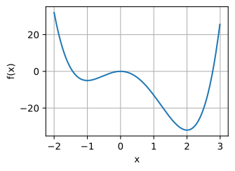
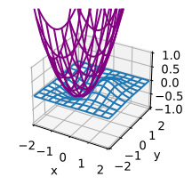
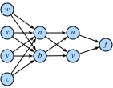
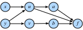

# Giải tích nhiều biến
<a id="sec_multivariable_calculus"></a>

Bây giờ khi đã có hiểu biết khá vững về đạo hàm của hàm một biến, hãy quay lại câu hỏi ban đầu, nơi ta xét một hàm mất mát có thể phụ thuộc vào hàng tỷ trọng số.

## Vi phân trong chiều cao hơn
Điều [sec_single_variable_calculus](#sec_single_variable_calculus) nói với ta là nếu thay đổi chỉ một trong hàng tỷ trọng số này và giữ tất cả trọng số khác cố định, ta biết điều gì sẽ xảy ra! Đây không gì hơn là một hàm một biến, nên ta có thể viết

$$L(w_1+\epsilon_1, w_2, \ldots, w_N) \approx L(w_1, w_2, \ldots, w_N) + \epsilon_1 \frac{d}{dw_1} L(w_1, w_2, \ldots, w_N).$$

Ta sẽ gọi đạo hàm theo một biến trong khi giữ cố định các biến còn lại là *đạo hàm riêng*, và sẽ dùng ký hiệu $\frac{\partial}{\partial w_1}$ cho đạo hàm trong :eqref:`eq_part_der`.

Bây giờ, hãy lấy điều này và thay đổi $w_2$ một chút thành $w_2 + \epsilon_2$:

$$
\begin{aligned}
L(w_1+\epsilon_1, w_2+\epsilon_2, \ldots, w_N) & \approx L(w_1, w_2+\epsilon_2, \ldots, w_N) + \epsilon_1 \frac{\partial}{\partial w_1} L(w_1, w_2+\epsilon_2, \ldots, w_N+\epsilon_N) \\
& \approx L(w_1, w_2, \ldots, w_N) \\
& \quad + \epsilon_2\frac{\partial}{\partial w_2} L(w_1, w_2, \ldots, w_N) \\
& \quad + \epsilon_1 \frac{\partial}{\partial w_1} L(w_1, w_2, \ldots, w_N) \\
& \quad + \epsilon_1\epsilon_2\frac{\partial}{\partial w_2}\frac{\partial}{\partial w_1} L(w_1, w_2, \ldots, w_N) \\
& \approx L(w_1, w_2, \ldots, w_N) \\
& \quad + \epsilon_2\frac{\partial}{\partial w_2} L(w_1, w_2, \ldots, w_N) \\
& \quad + \epsilon_1 \frac{\partial}{\partial w_1} L(w_1, w_2, \ldots, w_N).
\end{aligned}
$$

Ta lại dùng ý tưởng rằng $\epsilon_1\epsilon_2$ là một hạng bậc cao có thể loại bỏ giống như đã loại bỏ $\epsilon^{2}$ ở phần trước, cùng với điều đã thấy trong :eqref:`eq_part_der`. Tiếp tục theo cách này, ta có thể viết

$$
L(w_1+\epsilon_1, w_2+\epsilon_2, \ldots, w_N+\epsilon_N) \approx L(w_1, w_2, \ldots, w_N) + \sum_i \epsilon_i \frac{\partial}{\partial w_i} L(w_1, w_2, \ldots, w_N).
$$

Biểu thức này có thể trông rối, nhưng ta có thể làm nó quen thuộc hơn bằng cách lưu ý rằng tổng ở vế phải trông đúng như một tích vô hướng. Vì vậy, nếu đặt

$$
\boldsymbol{\epsilon} = [\epsilon_1, \ldots, \epsilon_N]^\top \; \textrm{and} \;
\nabla_{\mathbf{x}} L = \left[\frac{\partial L}{\partial x_1}, \ldots, \frac{\partial L}{\partial x_N}\right]^\top,
$$

thì

$$L(\mathbf{w} + \boldsymbol{\epsilon}) \approx L(\mathbf{w}) + \boldsymbol{\epsilon}\cdot \nabla_{\mathbf{w}} L(\mathbf{w}).$$

Ta sẽ gọi vector $\nabla_{\mathbf{w}} L$ là *gradient* của $L$.

Phương trình :eqref:`eq_nabla_use` đáng để suy ngẫm một chút. Nó có đúng dạng mà ta đã gặp trong một chiều, chỉ là mọi thứ đã được chuyển thành vector và tích vô hướng. Nó cho phép ta nói xấp xỉ hàm $L$ sẽ thay đổi thế nào với bất kỳ nhiễu nào lên đầu vào. Như sẽ thấy trong phần tiếp theo, điều này cung cấp một công cụ quan trọng để hiểu theo hình học cách ta có thể học bằng thông tin chứa trong gradient.

Nhưng trước hết, hãy xem phép xấp xỉ này hoạt động với một ví dụ. Giả sử ta làm việc với hàm

$$
f(x, y) = \log(e^x + e^y) \textrm{ with gradient } \nabla f (x, y) = \left[\frac{e^x}{e^x+e^y}, \frac{e^y}{e^x+e^y}\right].
$$

Nếu nhìn vào một điểm như $(0, \log(2))$, ta thấy rằng

$$
f(x, y) = \log(3) \textrm{ with gradient } \nabla f (x, y) = \left[\frac{1}{3}, \frac{2}{3}\right].
$$

Do đó, nếu muốn xấp xỉ $f$ tại $(\epsilon_1, \log(2) + \epsilon_2)$, ta thấy mình nên có trường hợp cụ thể sau của :eqref:`eq_nabla_use`:

$$
f(\epsilon_1, \log(2) + \epsilon_2) \approx \log(3) + \frac{1}{3}\epsilon_1 + \frac{2}{3}\epsilon_2.
$$

Ta có thể kiểm tra điều này trong mã để xem xấp xỉ tốt đến đâu.

```python
#@tab mxnet
%matplotlib inline
from d2l import mxnet as d2l
from IPython import display
from mpl_toolkits import mplot3d
from mxnet import autograd, np, npx
npx.set_np()

def f(x, y):
    return np.log(np.exp(x) + np.exp(y))
def grad_f(x, y):
    return np.array([np.exp(x) / (np.exp(x) + np.exp(y)),
                     np.exp(y) / (np.exp(x) + np.exp(y))])

epsilon = np.array([0.01, -0.03])
grad_approx = f(0, np.log(2)) + epsilon.dot(grad_f(0, np.log(2)))
true_value = f(0 + epsilon[0], np.log(2) + epsilon[1])
f'approximation: {grad_approx}, true Value: {true_value}'
```




```python
#@tab pytorch
%matplotlib inline
from d2l import torch as d2l
from IPython import display
from mpl_toolkits import mplot3d
import torch
import numpy as np

def f(x, y):
    return torch.log(torch.exp(x) + torch.exp(y))
def grad_f(x, y):
    return torch.tensor([torch.exp(x) / (torch.exp(x) + torch.exp(y)),
                     torch.exp(y) / (torch.exp(x) + torch.exp(y))])

epsilon = torch.tensor([0.01, -0.03])
grad_approx = f(torch.tensor([0.]), torch.log(
    torch.tensor([2.]))) + epsilon.dot(
    grad_f(torch.tensor([0.]), torch.log(torch.tensor(2.))))
true_value = f(torch.tensor([0.]) + epsilon[0], torch.log(
    torch.tensor([2.])) + epsilon[1])
f'approximation: {grad_approx}, true Value: {true_value}'
```




```python
#@tab tensorflow
%matplotlib inline
from d2l import tensorflow as d2l
from IPython import display
from mpl_toolkits import mplot3d
import tensorflow as tf
import numpy as np

def f(x, y):
    return tf.math.log(tf.exp(x) + tf.exp(y))
def grad_f(x, y):
    return tf.constant([(tf.exp(x) / (tf.exp(x) + tf.exp(y))).numpy(),
                        (tf.exp(y) / (tf.exp(x) + tf.exp(y))).numpy()])

epsilon = tf.constant([0.01, -0.03])
grad_approx = f(tf.constant([0.]), tf.math.log(
    tf.constant([2.]))) + tf.tensordot(
    epsilon, grad_f(tf.constant([0.]), tf.math.log(tf.constant(2.))), axes=1)
true_value = f(tf.constant([0.]) + epsilon[0], tf.math.log(
    tf.constant([2.])) + epsilon[1])
f'approximation: {grad_approx}, true Value: {true_value}'
```

## Hình học của gradient và gradient descent
Xét lại biểu thức từ :eqref:`eq_nabla_use`:

$$
L(\mathbf{w} + \boldsymbol{\epsilon}) \approx L(\mathbf{w}) + \boldsymbol{\epsilon}\cdot \nabla_{\mathbf{w}} L(\mathbf{w}).
$$

Giả sử tôi muốn dùng điều này để giúp cực tiểu hóa mất mát $L$. Trước hết, hãy hiểu theo hình học thuật toán gradient descent đã mô tả trong [sec_autograd](#sec_autograd). Điều ta sẽ làm là:

1. Bắt đầu với một lựa chọn ngẫu nhiên cho các tham số ban đầu $\mathbf{w}$.
2. Tìm hướng $\mathbf{v}$ khiến $L$ giảm nhanh nhất tại $\mathbf{w}$.
3. Đi một bước nhỏ theo hướng đó: $\mathbf{w} \rightarrow \mathbf{w} + \epsilon\mathbf{v}$.
4. Lặp lại.

Điều duy nhất ta chưa biết chính xác cách làm là tính vector $\mathbf{v}$ ở bước thứ hai. Ta sẽ gọi một hướng như vậy là *hướng giảm dốc nhất*. Dùng hiểu biết hình học về tích vô hướng từ [sec_geometry-linear-algebraic-ops](#sec_geometry-linear-algebraic-ops), ta thấy có thể viết lại :eqref:`eq_nabla_use` là

$$
L(\mathbf{w} + \mathbf{v}) \approx L(\mathbf{w}) + \mathbf{v}\cdot \nabla_{\mathbf{w}} L(\mathbf{w}) = L(\mathbf{w}) + \|\nabla_{\mathbf{w}} L(\mathbf{w})\|\cos(\theta).
$$

Lưu ý rằng để tiện, ta đã lấy hướng có độ dài một, và dùng $\theta$ cho góc giữa $\mathbf{v}$ và $\nabla_{\mathbf{w}} L(\mathbf{w})$. Nếu muốn tìm hướng làm $L$ giảm nhanh nhất có thể, ta muốn làm biểu thức này âm nhất có thể. Cách duy nhất hướng ta chọn đi vào phương trình này là thông qua $\cos(\theta)$, và do đó ta muốn làm cosin này âm nhất có thể. Bây giờ, nhớ lại hình dạng của cosin, ta có thể làm nó âm nhất bằng cách đặt $\cos(\theta) = -1$, hay tương đương làm góc giữa gradient và hướng đã chọn bằng $\pi$ radian, hoặc tương đương $180$ độ. Cách duy nhất để đạt điều này là đi đúng hướng ngược lại: chọn $\mathbf{v}$ chỉ đúng hướng đối diện với $\nabla_{\mathbf{w}} L(\mathbf{w})$!

Điều này đưa ta tới một trong những khái niệm toán học quan trọng nhất trong học máy: hướng giảm dốc nhất chỉ theo hướng $-\nabla_{\mathbf{w}}L(\mathbf{w})$. Vì vậy thuật toán không hình thức của ta có thể được viết lại như sau.

1. Bắt đầu với một lựa chọn ngẫu nhiên cho các tham số ban đầu $\mathbf{w}$.
2. Tính $\nabla_{\mathbf{w}} L(\mathbf{w})$.
3. Đi một bước nhỏ theo hướng ngược lại: $\mathbf{w} \leftarrow \mathbf{w} - \epsilon\nabla_{\mathbf{w}} L(\mathbf{w})$.
4. Lặp lại.


Thuật toán cơ bản này đã được nhiều nhà nghiên cứu sửa đổi và thích nghi theo nhiều cách, nhưng khái niệm cốt lõi vẫn giống nhau ở tất cả chúng. Dùng gradient để tìm hướng làm mất mát giảm nhanh nhất, rồi cập nhật tham số để đi một bước theo hướng đó.

## Ghi chú về tối ưu hóa toán học
Trong suốt cuốn sách này, chúng ta tập trung trực diện vào các kỹ thuật tối ưu hóa số vì lý do thực tiễn rằng mọi hàm ta gặp trong bối cảnh học sâu đều quá phức tạp để cực tiểu hóa tường minh.

Tuy nhiên, việc xét hiểu biết hình học thu được ở trên cho ta biết gì về tối ưu hóa hàm trực tiếp là một bài tập hữu ích.

Giả sử ta muốn tìm giá trị $\mathbf{x}_0$ cực tiểu hóa một hàm nào đó $L(\mathbf{x})$. Giả sử thêm rằng có người đưa cho ta một giá trị và nói rằng đó là giá trị cực tiểu hóa $L$. Có điều gì ta có thể kiểm tra để xem câu trả lời của họ thậm chí có hợp lý không?

Xét lại :eqref:`eq_nabla_use`:
$$
L(\mathbf{x}_0 + \boldsymbol{\epsilon}) \approx L(\mathbf{x}_0) + \boldsymbol{\epsilon}\cdot \nabla_{\mathbf{x}} L(\mathbf{x}_0).
$$

Nếu gradient khác không, ta biết rằng có thể đi một bước theo hướng $-\epsilon \nabla_{\mathbf{x}} L(\mathbf{x}_0)$ để tìm một giá trị $L$ nhỏ hơn. Vì vậy, nếu ta thật sự đang ở một cực tiểu, điều này không thể xảy ra! Ta có thể kết luận rằng nếu $\mathbf{x}_0$ là một cực tiểu, thì $\nabla_{\mathbf{x}} L(\mathbf{x}_0) = 0$. Ta gọi các điểm có $\nabla_{\mathbf{x}} L(\mathbf{x}_0) = 0$ là *điểm tới hạn*.

Điều này hay ở chỗ trong một số bối cảnh hiếm hoi, ta *có thể* tìm tường minh tất cả các điểm mà gradient bằng không và tìm điểm có giá trị nhỏ nhất.

Với một ví dụ cụ thể, xét hàm
$$
f(x) = 3x^4 - 4x^3 -12x^2.
$$

Hàm này có đạo hàm
$$
\frac{df}{dx} = 12x^3 - 12x^2 -24x = 12x(x-2)(x+1).
$$

Các vị trí cực tiểu khả dĩ duy nhất là $x = -1, 0, 2$, nơi hàm lần lượt nhận các giá trị $-5,0, -32$, và do đó ta có thể kết luận rằng hàm được cực tiểu hóa khi $x = 2$. Một đồ thị nhanh xác nhận điều này.

```python
#@tab mxnet
x = np.arange(-2, 3, 0.01)
f = (3 * x**4) - (4 * x**3) - (12 * x**2)

d2l.plot(x, f, 'x', 'f(x)')
```

```python
#@tab pytorch
x = torch.arange(-2, 3, 0.01)
f = (3 * x**4) - (4 * x**3) - (12 * x**2)

d2l.plot(x, f, 'x', 'f(x)')
```

```python
#@tab tensorflow
x = tf.range(-2, 3, 0.01)
f = (3 * x**4) - (4 * x**3) - (12 * x**2)

d2l.plot(x, f, 'x', 'f(x)')
```

Điều này làm nổi bật một sự thật quan trọng cần biết khi làm việc cả về lý thuyết lẫn số học: các điểm khả dĩ duy nhất nơi ta có thể cực tiểu hóa (hoặc cực đại hóa) một hàm sẽ có gradient bằng không, tuy nhiên không phải mọi điểm có gradient bằng không đều là cực tiểu (hoặc cực đại) *toàn cục* thật sự.

## Quy tắc dây chuyền nhiều biến
Giả sử ta có một hàm bốn biến ($w, x, y$ và $z$), được tạo bằng cách hợp thành nhiều hạng:

$$\begin{aligned}f(u, v) & = (u+v)^{2} \\u(a, b) & = (a+b)^{2}, \qquad v(a, b) = (a-b)^{2}, \\a(w, x, y, z) & = (w+x+y+z)^{2}, \qquad b(w, x, y, z) = (w+x-y-z)^2.\end{aligned}$$

Những chuỗi phương trình như vậy rất phổ biến khi làm việc với mạng nơ-ron, nên cố hiểu cách tính gradient của các hàm như vậy là điều then chốt. Ta có thể bắt đầu thấy gợi ý trực quan của mối liên hệ này trong [fig_chain-1](#fig_chain-1) nếu xem biến nào liên quan trực tiếp với biến nào.


<a id="fig_chain-1"></a>

Không có gì ngăn ta hợp thành mọi thứ từ :eqref:`eq_multi_func_def` và viết ra

$$
f(w, x, y, z) = \left(\left((w+x+y+z)^2+(w+x-y-z)^2\right)^2+\left((w+x+y+z)^2-(w+x-y-z)^2\right)^2\right)^2.
$$

Sau đó ta có thể lấy đạo hàm chỉ bằng các đạo hàm một biến, nhưng nếu làm vậy, ta sẽ nhanh chóng bị ngập trong các hạng, nhiều hạng trong số đó lặp lại! Thật vậy, có thể thấy, chẳng hạn:

$$
\begin{aligned}
\frac{\partial f}{\partial w} & = 2 \left(2 \left(2 (w + x + y + z) - 2 (w + x - y - z)\right) \left((w + x + y + z)^{2}- (w + x - y - z)^{2}\right) + \right.\\
& \left. \quad 2 \left(2 (w + x - y - z) + 2 (w + x + y + z)\right) \left((w + x - y - z)^{2}+ (w + x + y + z)^{2}\right)\right) \times \\
& \quad \left(\left((w + x + y + z)^{2}- (w + x - y - z)^2\right)^{2}+ \left((w + x - y - z)^{2}+ (w + x + y + z)^{2}\right)^{2}\right).
\end{aligned}
$$

Nếu sau đó ta cũng muốn tính $\frac{\partial f}{\partial x}$, ta sẽ lại có một phương trình tương tự với nhiều hạng lặp, và nhiều hạng lặp *được chia sẻ* giữa hai đạo hàm. Điều này đại diện cho một lượng lớn công việc lãng phí, và nếu ta phải tính đạo hàm theo cách này, toàn bộ cuộc cách mạng học sâu đã có thể bị đình trệ trước khi bắt đầu!


Hãy chia nhỏ bài toán. Ta sẽ bắt đầu bằng cách cố hiểu $f$ thay đổi thế nào khi ta thay đổi $a$, về cơ bản giả sử $w, x, y$ và $z$ đều không tồn tại. Ta sẽ lập luận như khi lần đầu làm việc với gradient. Hãy lấy $a$ và cộng thêm một lượng nhỏ $\epsilon$ vào nó.

$$
\begin{aligned}
& f(u(a+\epsilon, b), v(a+\epsilon, b)) \\
\approx & f\left(u(a, b) + \epsilon\frac{\partial u}{\partial a}(a, b), v(a, b) + \epsilon\frac{\partial v}{\partial a}(a, b)\right) \\
\approx & f(u(a, b), v(a, b)) + \epsilon\left[\frac{\partial f}{\partial u}(u(a, b), v(a, b))\frac{\partial u}{\partial a}(a, b) + \frac{\partial f}{\partial v}(u(a, b), v(a, b))\frac{\partial v}{\partial a}(a, b)\right].
\end{aligned}
$$

Dòng đầu theo từ định nghĩa đạo hàm riêng, và dòng thứ hai theo từ định nghĩa gradient. Việc theo dõi chính xác nơi ta đánh giá mọi đạo hàm, như trong biểu thức $\frac{\partial f}{\partial u}(u(a, b), v(a, b))$, gây nặng ký hiệu, nên ta thường viết tắt thành dạng dễ nhớ hơn nhiều

$$
\frac{\partial f}{\partial a} = \frac{\partial f}{\partial u}\frac{\partial u}{\partial a}+\frac{\partial f}{\partial v}\frac{\partial v}{\partial a}.
$$

Suy nghĩ về ý nghĩa của quá trình này là hữu ích. Ta đang cố hiểu một hàm dạng $f(u(a, b), v(a, b))$ thay đổi giá trị thế nào khi $a$ thay đổi. Có hai con đường điều này có thể xảy ra: con đường $a \rightarrow u \rightarrow f$ và con đường $a \rightarrow v \rightarrow f$. Ta có thể tính cả hai đóng góp này bằng quy tắc dây chuyền: lần lượt là $\frac{\partial w}{\partial u} \cdot \frac{\partial u}{\partial x}$ và $\frac{\partial w}{\partial v} \cdot \frac{\partial v}{\partial x}$, rồi cộng lại.

Hãy tưởng tượng ta có một mạng hàm khác, trong đó các hàm bên phải phụ thuộc vào các hàm được nối ở bên trái như trong [fig_chain-2](#fig_chain-2).


<a id="fig_chain-2"></a>

Để tính thứ như $\frac{\partial f}{\partial y}$, ta cần lấy tổng trên tất cả (trong trường hợp này là $3$) đường đi từ $y$ tới $f$, cho ta

$$
\frac{\partial f}{\partial y} = \frac{\partial f}{\partial a} \frac{\partial a}{\partial u} \frac{\partial u}{\partial y} + \frac{\partial f}{\partial u} \frac{\partial u}{\partial y} + \frac{\partial f}{\partial b} \frac{\partial b}{\partial v} \frac{\partial v}{\partial y}.
$$

Hiểu quy tắc dây chuyền theo cách này sẽ đem lại lợi ích lớn khi cố hiểu gradient chảy qua mạng như thế nào, và tại sao các lựa chọn kiến trúc khác nhau như trong LSTM ([sec_lstm](#sec_lstm)) hoặc tầng residual ([sec_resnet](#sec_resnet)) có thể giúp định hình quá trình học bằng cách kiểm soát dòng gradient.

## Thuật toán lan truyền ngược

Hãy quay lại ví dụ :eqref:`eq_multi_func_def` của phần trước, trong đó

$$
\begin{aligned}
f(u, v) & = (u+v)^{2} \\
u(a, b) & = (a+b)^{2}, \qquad v(a, b) = (a-b)^{2}, \\
a(w, x, y, z) & = (w+x+y+z)^{2}, \qquad b(w, x, y, z) = (w+x-y-z)^2.
\end{aligned}
$$

Nếu muốn tính chẳng hạn $\frac{\partial f}{\partial w}$, ta có thể áp dụng quy tắc dây chuyền nhiều biến để thấy:

$$
\begin{aligned}
\frac{\partial f}{\partial w} & = \frac{\partial f}{\partial u}\frac{\partial u}{\partial w} + \frac{\partial f}{\partial v}\frac{\partial v}{\partial w}, \\
\frac{\partial u}{\partial w} & = \frac{\partial u}{\partial a}\frac{\partial a}{\partial w}+\frac{\partial u}{\partial b}\frac{\partial b}{\partial w}, \\
\frac{\partial v}{\partial w} & = \frac{\partial v}{\partial a}\frac{\partial a}{\partial w}+\frac{\partial v}{\partial b}\frac{\partial b}{\partial w}.
\end{aligned}
$$

Hãy thử dùng phân rã này để tính $\frac{\partial f}{\partial w}$. Lưu ý rằng mọi thứ ta cần ở đây là các đạo hàm riêng một bước khác nhau:

$$
\begin{aligned}
\frac{\partial f}{\partial u} = 2(u+v), & \quad\frac{\partial f}{\partial v} = 2(u+v), \\
\frac{\partial u}{\partial a} = 2(a+b), & \quad\frac{\partial u}{\partial b} = 2(a+b), \\
\frac{\partial v}{\partial a} = 2(a-b), & \quad\frac{\partial v}{\partial b} = -2(a-b), \\
\frac{\partial a}{\partial w} = 2(w+x+y+z), & \quad\frac{\partial b}{\partial w} = 2(w+x-y-z).
\end{aligned}
$$

Nếu viết điều này thành mã, nó trở thành một biểu thức khá dễ quản lý.

```python
#@tab all
# Compute the value of the function from inputs to outputs
w, x, y, z = -1, 0, -2, 1
a, b = (w + x + y + z)**2, (w + x - y - z)**2
u, v = (a + b)**2, (a - b)**2
f = (u + v)**2
print(f'    f at {w}, {x}, {y}, {z} is {f}')

# Compute the single step partials
df_du, df_dv = 2*(u + v), 2*(u + v)
du_da, du_db, dv_da, dv_db = 2*(a + b), 2*(a + b), 2*(a - b), -2*(a - b)
da_dw, db_dw = 2*(w + x + y + z), 2*(w + x - y - z)

# Compute the final result from inputs to outputs
du_dw, dv_dw = du_da*da_dw + du_db*db_dw, dv_da*da_dw + dv_db*db_dw
df_dw = df_du*du_dw + df_dv*dv_dw
print(f'df/dw at {w}, {x}, {y}, {z} is {df_dw}')
```

Tuy nhiên, lưu ý rằng điều này vẫn không làm cho việc tính thứ như $\frac{\partial f}{\partial x}$ trở nên dễ dàng. Lý do là *cách* ta đã chọn áp dụng quy tắc dây chuyền. Nếu nhìn vào những gì đã làm ở trên, ta luôn giữ $\partial w$ ở mẫu số khi có thể. Theo cách này, ta chọn áp dụng quy tắc dây chuyền bằng cách xem $w$ thay đổi mọi biến khác như thế nào. Nếu đó là điều ta muốn, đây sẽ là một ý tưởng tốt. Tuy nhiên, hãy nhớ lại động cơ từ học sâu: ta muốn xem mọi tham số thay đổi *mất mát* như thế nào. Về bản chất, ta muốn áp dụng quy tắc dây chuyền bằng cách giữ $\partial f$ ở tử số bất cứ khi nào có thể!

Nói rõ hơn, lưu ý rằng ta có thể viết

$$
\begin{aligned}
\frac{\partial f}{\partial w} & = \frac{\partial f}{\partial a}\frac{\partial a}{\partial w} + \frac{\partial f}{\partial b}\frac{\partial b}{\partial w}, \\
\frac{\partial f}{\partial a} & = \frac{\partial f}{\partial u}\frac{\partial u}{\partial a}+\frac{\partial f}{\partial v}\frac{\partial v}{\partial a}, \\
\frac{\partial f}{\partial b} & = \frac{\partial f}{\partial u}\frac{\partial u}{\partial b}+\frac{\partial f}{\partial v}\frac{\partial v}{\partial b}.
\end{aligned}
$$

Lưu ý rằng cách áp dụng quy tắc dây chuyền này khiến ta tính tường minh $\frac{\partial f}{\partial u}, \frac{\partial f}{\partial v}, \frac{\partial f}{\partial a}, \frac{\partial f}{\partial b}, \; \textrm{and} \; \frac{\partial f}{\partial w}$. Không có gì ngăn ta cũng đưa vào các phương trình:

$$
\begin{aligned}
\frac{\partial f}{\partial x} & = \frac{\partial f}{\partial a}\frac{\partial a}{\partial x} + \frac{\partial f}{\partial b}\frac{\partial b}{\partial x}, \\
\frac{\partial f}{\partial y} & = \frac{\partial f}{\partial a}\frac{\partial a}{\partial y}+\frac{\partial f}{\partial b}\frac{\partial b}{\partial y}, \\
\frac{\partial f}{\partial z} & = \frac{\partial f}{\partial a}\frac{\partial a}{\partial z}+\frac{\partial f}{\partial b}\frac{\partial b}{\partial z}.
\end{aligned}
$$

rồi theo dõi $f$ thay đổi thế nào khi ta thay đổi *bất kỳ* nút nào trong toàn bộ mạng. Hãy triển khai nó.

```python
#@tab all
# Compute the value of the function from inputs to outputs
w, x, y, z = -1, 0, -2, 1
a, b = (w + x + y + z)**2, (w + x - y - z)**2
u, v = (a + b)**2, (a - b)**2
f = (u + v)**2
print(f'f at {w}, {x}, {y}, {z} is {f}')

# Compute the derivative using the decomposition above
# First compute the single step partials
df_du, df_dv = 2*(u + v), 2*(u + v)
du_da, du_db, dv_da, dv_db = 2*(a + b), 2*(a + b), 2*(a - b), -2*(a - b)
da_dw, db_dw = 2*(w + x + y + z), 2*(w + x - y - z)
da_dx, db_dx = 2*(w + x + y + z), 2*(w + x - y - z)
da_dy, db_dy = 2*(w + x + y + z), -2*(w + x - y - z)
da_dz, db_dz = 2*(w + x + y + z), -2*(w + x - y - z)

# Now compute how f changes when we change any value from output to input
df_da, df_db = df_du*du_da + df_dv*dv_da, df_du*du_db + df_dv*dv_db
df_dw, df_dx = df_da*da_dw + df_db*db_dw, df_da*da_dx + df_db*db_dx
df_dy, df_dz = df_da*da_dy + df_db*db_dy, df_da*da_dz + df_db*db_dz

print(f'df/dw at {w}, {x}, {y}, {z} is {df_dw}')
print(f'df/dx at {w}, {x}, {y}, {z} is {df_dx}')
print(f'df/dy at {w}, {x}, {y}, {z} is {df_dy}')
print(f'df/dz at {w}, {x}, {y}, {z} is {df_dz}')
```

Việc ta tính đạo hàm từ $f$ ngược về đầu vào thay vì từ đầu vào tiến tới đầu ra (như đã làm trong đoạn mã đầu tiên ở trên) chính là điều đặt tên cho thuật toán này: *lan truyền ngược*. Lưu ý rằng có hai bước:
1. Tính giá trị của hàm và các đạo hàm riêng một bước từ trước ra sau. Dù không làm ở trên, điều này có thể được kết hợp thành một *forward pass*.
2. Tính gradient của $f$ từ sau ra trước. Ta gọi đây là *backwards pass*.

Đây chính xác là điều mọi thuật toán học sâu triển khai để cho phép tính gradient của mất mát theo từng trọng số trong mạng chỉ trong một lượt. Việc ta có một phân rã như vậy là một sự thật đáng kinh ngạc.

Để xem cách đóng gói điều này, hãy nhìn nhanh ví dụ này.

```python
#@tab mxnet
# Initialize as ndarrays, then attach gradients
w, x, y, z = np.array(-1), np.array(0), np.array(-2), np.array(1)

w.attach_grad()
x.attach_grad()
y.attach_grad()
z.attach_grad()

# Do the computation like usual, tracking gradients
with autograd.record():
    a, b = (w + x + y + z)**2, (w + x - y - z)**2
    u, v = (a + b)**2, (a - b)**2
    f = (u + v)**2

# Execute backward pass
f.backward()

print(f'df/dw at {w}, {x}, {y}, {z} is {w.grad}')
print(f'df/dx at {w}, {x}, {y}, {z} is {x.grad}')
print(f'df/dy at {w}, {x}, {y}, {z} is {y.grad}')
print(f'df/dz at {w}, {x}, {y}, {z} is {z.grad}')
```

```python
#@tab pytorch
# Initialize as ndarrays, then attach gradients
w = torch.tensor([-1.], requires_grad=True)
x = torch.tensor([0.], requires_grad=True)
y = torch.tensor([-2.], requires_grad=True)
z = torch.tensor([1.], requires_grad=True)
# Do the computation like usual, tracking gradients
a, b = (w + x + y + z)**2, (w + x - y - z)**2
u, v = (a + b)**2, (a - b)**2
f = (u + v)**2

# Execute backward pass
f.backward()

print(f'df/dw at {w.data.item()}, {x.data.item()}, {y.data.item()}, '
      f'{z.data.item()} is {w.grad.data.item()}')
print(f'df/dx at {w.data.item()}, {x.data.item()}, {y.data.item()}, '
      f'{z.data.item()} is {x.grad.data.item()}')
print(f'df/dy at {w.data.item()}, {x.data.item()}, {y.data.item()}, '
      f'{z.data.item()} is {y.grad.data.item()}')
print(f'df/dz at {w.data.item()}, {x.data.item()}, {y.data.item()}, '
      f'{z.data.item()} is {z.grad.data.item()}')
```

```python
#@tab tensorflow
# Initialize as ndarrays, then attach gradients
w = tf.Variable(tf.constant([-1.]))
x = tf.Variable(tf.constant([0.]))
y = tf.Variable(tf.constant([-2.]))
z = tf.Variable(tf.constant([1.]))
# Do the computation like usual, tracking gradients
with tf.GradientTape(persistent=True) as t:
    a, b = (w + x + y + z)**2, (w + x - y - z)**2
    u, v = (a + b)**2, (a - b)**2
    f = (u + v)**2

# Execute backward pass
w_grad = t.gradient(f, w).numpy()
x_grad = t.gradient(f, x).numpy()
y_grad = t.gradient(f, y).numpy()
z_grad = t.gradient(f, z).numpy()

print(f'df/dw at {w.numpy()}, {x.numpy()}, {y.numpy()}, '
      f'{z.numpy()} is {w_grad}')
print(f'df/dx at {w.numpy()}, {x.numpy()}, {y.numpy()}, '
      f'{z.numpy()} is {x_grad}')
print(f'df/dy at {w.numpy()}, {x.numpy()}, {y.numpy()}, '
      f'{z.numpy()} is {y_grad}')
print(f'df/dz at {w.numpy()}, {x.numpy()}, {y.numpy()}, '
      f'{z.numpy()} is {z_grad}')
```

Mọi điều ta đã làm ở trên đều có thể được thực hiện tự động bằng cách gọi `f.backwards()`.


## Hessian
Như với giải tích một biến, việc xét các đạo hàm bậc cao là hữu ích để nắm được cách thu được xấp xỉ tốt hơn cho một hàm so với chỉ dùng gradient.

Có một vấn đề tức thì khi làm việc với đạo hàm bậc cao của hàm nhiều biến: có rất nhiều đạo hàm như vậy. Nếu ta có một hàm $f(x_1, \ldots, x_n)$ của $n$ biến, thì có thể lấy $n^{2}$ đạo hàm bậc hai, cụ thể là với bất kỳ lựa chọn $i$ và $j$ nào:

$$
\frac{d^2f}{dx_idx_j} = \frac{d}{dx_i}\left(\frac{d}{dx_j}f\right).
$$

Theo truyền thống, chúng được ghép thành một ma trận gọi là *Hessian*:

$$\mathbf{H}_f = \begin{bmatrix} \frac{d^2f}{dx_1dx_1} & \cdots & \frac{d^2f}{dx_1dx_n} \\ \vdots & \ddots & \vdots \\ \frac{d^2f}{dx_ndx_1} & \cdots & \frac{d^2f}{dx_ndx_n} \\ \end{bmatrix}.$$

Không phải mọi phần tử của ma trận này đều độc lập. Thật vậy, ta có thể chỉ ra rằng miễn là cả hai *đạo hàm riêng hỗn hợp* (đạo hàm riêng theo nhiều hơn một biến) tồn tại và liên tục, ta có thể nói rằng với bất kỳ $i$ và $j$ nào,

$$
\frac{d^2f}{dx_idx_j} = \frac{d^2f}{dx_jdx_i}.
$$

Điều này theo từ việc xét trước hết nhiễu một hàm theo hướng $x_i$, rồi nhiễu nó theo $x_j$, và sau đó so sánh kết quả đó với điều xảy ra nếu nhiễu trước theo $x_j$ rồi theo $x_i$, với hiểu biết rằng cả hai thứ tự đều dẫn tới cùng thay đổi cuối cùng trong đầu ra của $f$.

Như với một biến, ta có thể dùng các đạo hàm này để có ý tưởng tốt hơn nhiều về cách hàm ứng xử gần một điểm. Cụ thể, ta có thể dùng nó để tìm hàm bậc hai khớp tốt nhất gần một điểm $\mathbf{x}_0$, như đã thấy trong trường hợp một biến.

Hãy xem một ví dụ. Giả sử $f(x_1, x_2) = a + b_1x_1 + b_2x_2 + c_{11}x_1^{2} + c_{12}x_1x_2 + c_{22}x_2^{2}$. Đây là dạng tổng quát của một hàm bậc hai theo hai biến. Nếu nhìn vào giá trị của hàm, gradient của nó, và Hessian :eqref:`eq_hess_def`, tất cả tại điểm không:

$$
\begin{aligned}
f(0,0) & = a, \\
\nabla f (0,0) & = \begin{bmatrix}b_1 \\ b_2\end{bmatrix}, \\
\mathbf{H} f (0,0) & = \begin{bmatrix}2 c_{11} & c_{12} \\ c_{12} & 2c_{22}\end{bmatrix},
\end{aligned}
$$

ta có thể thu lại đa thức ban đầu bằng cách nói

$$
f(\mathbf{x}) = f(0) + \nabla f (0) \cdot \mathbf{x} + \frac{1}{2}\mathbf{x}^\top \mathbf{H} f (0) \mathbf{x}.
$$

Nói chung, nếu ta tính khai triển này tại bất kỳ điểm $\mathbf{x}_0$ nào, ta thấy rằng

$$
f(\mathbf{x}) = f(\mathbf{x}_0) + \nabla f (\mathbf{x}_0) \cdot (\mathbf{x}-\mathbf{x}_0) + \frac{1}{2}(\mathbf{x}-\mathbf{x}_0)^\top \mathbf{H} f (\mathbf{x}_0) (\mathbf{x}-\mathbf{x}_0).
$$

Điều này hoạt động cho đầu vào bất kỳ số chiều nào, và cung cấp xấp xỉ bậc hai tốt nhất cho bất kỳ hàm nào tại một điểm. Để đưa ra một ví dụ, hãy vẽ hàm

$$
f(x, y) = xe^{-x^2-y^2}.
$$

Ta có thể tính rằng gradient và Hessian là
$$
\nabla f(x, y) = e^{-x^2-y^2}\begin{pmatrix}1-2x^2 \\ -2xy\end{pmatrix} \; \textrm{and} \; \mathbf{H}f(x, y) = e^{-x^2-y^2}\begin{pmatrix} 4x^3 - 6x & 4x^2y - 2y \\ 4x^2y-2y &4xy^2-2x\end{pmatrix}.
$$

Và do đó, với một chút đại số, thấy rằng xấp xỉ bậc hai tại $[-1,0]^\top$ là

$$
f(x, y) \approx e^{-1}\left(-1 - (x+1) +(x+1)^2+y^2\right).
$$

```python
#@tab mxnet
# Construct grid and compute function
x, y = np.meshgrid(np.linspace(-2, 2, 101),
                   np.linspace(-2, 2, 101), indexing='ij')
z = x*np.exp(- x**2 - y**2)

# Compute approximating quadratic with gradient and Hessian at (1, 0)
w = np.exp(-1)*(-1 - (x + 1) + (x + 1)**2 + y**2)

# Plot function
ax = d2l.plt.figure().add_subplot(111, projection='3d')
ax.plot_wireframe(x.asnumpy(), y.asnumpy(), z.asnumpy(),
                  **{'rstride': 10, 'cstride': 10})
ax.plot_wireframe(x.asnumpy(), y.asnumpy(), w.asnumpy(),
                  **{'rstride': 10, 'cstride': 10}, color='purple')
d2l.plt.xlabel('x')
d2l.plt.ylabel('y')
d2l.set_figsize()
ax.set_xlim(-2, 2)
ax.set_ylim(-2, 2)
ax.set_zlim(-1, 1)
ax.dist = 12
```

```python
#@tab pytorch
# Construct grid and compute function
x, y = torch.meshgrid(torch.linspace(-2, 2, 101),
                   torch.linspace(-2, 2, 101))

z = x*torch.exp(- x**2 - y**2)

# Compute approximating quadratic with gradient and Hessian at (1, 0)
w = torch.exp(torch.tensor([-1.]))*(-1 - (x + 1) + 2 * (x + 1)**2 + 2 * y**2)

# Plot function
ax = d2l.plt.figure().add_subplot(111, projection='3d')
ax.plot_wireframe(x.numpy(), y.numpy(), z.numpy(),
                  **{'rstride': 10, 'cstride': 10})
ax.plot_wireframe(x.numpy(), y.numpy(), w.numpy(),
                  **{'rstride': 10, 'cstride': 10}, color='purple')
d2l.plt.xlabel('x')
d2l.plt.ylabel('y')
d2l.set_figsize()
ax.set_xlim(-2, 2)
ax.set_ylim(-2, 2)
ax.set_zlim(-1, 1)
ax.dist = 12
```

```python
#@tab tensorflow
# Construct grid and compute function
x, y = tf.meshgrid(tf.linspace(-2., 2., 101),
                   tf.linspace(-2., 2., 101))

z = x*tf.exp(- x**2 - y**2)

# Compute approximating quadratic with gradient and Hessian at (1, 0)
w = tf.exp(tf.constant([-1.]))*(-1 - (x + 1) + 2 * (x + 1)**2 + 2 * y**2)

# Plot function
ax = d2l.plt.figure().add_subplot(111, projection='3d')
ax.plot_wireframe(x.numpy(), y.numpy(), z.numpy(),
                  **{'rstride': 10, 'cstride': 10})
ax.plot_wireframe(x.numpy(), y.numpy(), w.numpy(),
                  **{'rstride': 10, 'cstride': 10}, color='purple')
d2l.plt.xlabel('x')
d2l.plt.ylabel('y')
d2l.set_figsize()
ax.set_xlim(-2, 2)
ax.set_ylim(-2, 2)
ax.set_zlim(-1, 1)
ax.dist = 12
```

Điều này tạo nền tảng cho thuật toán Newton được thảo luận trong [sec_gd](#sec_gd), nơi ta thực hiện tối ưu hóa số bằng cách lặp lại việc tìm hàm bậc hai khớp tốt nhất rồi cực tiểu hóa chính xác hàm bậc hai đó.

## Một chút giải tích ma trận
Đạo hàm của các hàm liên quan đến ma trận hóa ra đặc biệt đẹp. Phần này có thể trở nên nặng ký hiệu, nên có thể bỏ qua trong lần đọc đầu tiên, nhưng sẽ hữu ích khi biết rằng đạo hàm của các hàm liên quan đến những phép toán ma trận phổ biến thường sạch hơn nhiều so với dự đoán ban đầu, đặc biệt khi các phép toán ma trận rất trung tâm trong ứng dụng học sâu.

Hãy bắt đầu với một ví dụ. Giả sử ta có một vector cột cố định $\boldsymbol{\beta}$, và muốn lấy hàm tích $f(\mathbf{x}) = \boldsymbol{\beta}^\top\mathbf{x}$, rồi hiểu tích vô hướng thay đổi thế nào khi ta thay đổi $\mathbf{x}$.

Một chút ký hiệu hữu ích khi làm việc với đạo hàm ma trận trong ML được gọi là *đạo hàm ma trận theo bố cục mẫu số*, trong đó ta gom các đạo hàm riêng vào hình dạng của bất kỳ vector, ma trận hoặc tensor nào nằm ở mẫu số của vi phân. Trong trường hợp này, ta sẽ viết

$$
\frac{df}{d\mathbf{x}} = \begin{bmatrix}
\frac{df}{dx_1} \\
\vdots \\
\frac{df}{dx_n}
\end{bmatrix},
$$

trong đó ta khớp hình dạng của vector cột $\mathbf{x}$.

Nếu viết hàm của ta theo các thành phần, nó là

$$
f(\mathbf{x}) = \sum_{i = 1}^{n} \beta_ix_i = \beta_1x_1 + \cdots + \beta_nx_n.
$$

Nếu bây giờ lấy đạo hàm riêng theo, chẳng hạn, $\beta_1$, lưu ý rằng mọi thứ đều bằng không ngoại trừ hạng đầu tiên, chỉ là $x_1$ nhân với $\beta_1$, nên ta thu được

$$
\frac{df}{dx_1} = \beta_1,
$$

hoặc tổng quát hơn

$$
\frac{df}{dx_i} = \beta_i.
$$

Bây giờ ta có thể ghép lại thành một ma trận để thấy

$$
\frac{df}{d\mathbf{x}} = \begin{bmatrix}
\frac{df}{dx_1} \\
\vdots \\
\frac{df}{dx_n}
\end{bmatrix} = \begin{bmatrix}
\beta_1 \\
\vdots \\
\beta_n
\end{bmatrix} = \boldsymbol{\beta}.
$$

Điều này minh họa vài yếu tố về giải tích ma trận mà ta sẽ thường gặp trong suốt phần này:

* Thứ nhất, các phép tính sẽ trở nên khá phức tạp.
* Thứ hai, kết quả cuối cùng sạch hơn nhiều so với quá trình trung gian, và luôn trông tương tự trường hợp một biến. Trong trường hợp này, lưu ý rằng $\frac{d}{dx}(bx) = b$ và $\frac{d}{d\mathbf{x}} (\boldsymbol{\beta}^\top\mathbf{x}) = \boldsymbol{\beta}$ đều tương tự nhau.
* Thứ ba, chuyển vị thường có thể xuất hiện tưởng như từ hư không. Lý do cốt lõi là quy ước khớp hình dạng của mẫu số, nên khi nhân ma trận, ta sẽ cần lấy chuyển vị để khớp lại với hình dạng của hạng ban đầu.

Để tiếp tục xây dựng trực giác, hãy thử một phép tính khó hơn một chút. Giả sử ta có một vector cột $\mathbf{x}$ và một ma trận vuông $A$, và muốn tính

$$\frac{d}{d\mathbf{x}}(\mathbf{x}^\top A \mathbf{x}).$$

Để hướng tới ký hiệu dễ thao tác hơn, hãy xét bài toán này bằng ký hiệu Einstein. Trong trường hợp này, ta có thể viết hàm là

$$
\mathbf{x}^\top A \mathbf{x} = x_ia_{ij}x_j.
$$

Để tính đạo hàm, ta cần hiểu với mọi $k$, giá trị của

$$
\frac{d}{dx_k}(\mathbf{x}^\top A \mathbf{x}) = \frac{d}{dx_k}x_ia_{ij}x_j.
$$

Theo quy tắc tích, đây là

$$
\frac{d}{dx_k}x_ia_{ij}x_j = \frac{dx_i}{dx_k}a_{ij}x_j + x_ia_{ij}\frac{dx_j}{dx_k}.
$$

Với một hạng như $\frac{dx_i}{dx_k}$, không khó để thấy rằng nó bằng một khi $i=k$ và bằng không nếu không. Điều này có nghĩa là mọi hạng trong tổng mà $i$ và $k$ khác nhau đều biến mất, nên các hạng duy nhất còn lại trong tổng đầu tiên là những hạng có $i=k$. Lập luận tương tự đúng cho hạng thứ hai, nơi ta cần $j=k$. Điều này cho

$$
\frac{d}{dx_k}x_ia_{ij}x_j = a_{kj}x_j + x_ia_{ik}.
$$

Bây giờ, tên của các chỉ số trong ký hiệu Einstein là tùy ý, việc $i$ và $j$ khác nhau không còn quan trọng cho phép tính này tại điểm này, nên ta có thể đánh lại chỉ số để cả hai dùng $i$ và thấy rằng

$$
\frac{d}{dx_k}x_ia_{ij}x_j = a_{ki}x_i + x_ia_{ik} = (a_{ki} + a_{ik})x_i.
$$

Bây giờ là lúc ta bắt đầu cần luyện tập để đi xa hơn. Hãy thử nhận diện kết quả này dưới dạng các phép toán ma trận. $a_{ki} + a_{ik}$ là thành phần thứ $k, i$ của $\mathbf{A} + \mathbf{A}^\top$. Điều này cho

$$
\frac{d}{dx_k}x_ia_{ij}x_j = [\mathbf{A} + \mathbf{A}^\top]_{ki}x_i.
$$

Tương tự, hạng này giờ là tích của ma trận $\mathbf{A} + \mathbf{A}^\top$ với vector $\mathbf{x}$, nên ta thấy rằng

$$
\left[\frac{d}{d\mathbf{x}}(\mathbf{x}^\top A \mathbf{x})\right]_k = \frac{d}{dx_k}x_ia_{ij}x_j = [(\mathbf{A} + \mathbf{A}^\top)\mathbf{x}]_k.
$$

Do đó, ta thấy phần tử thứ $k$ của đạo hàm mong muốn từ :eqref:`eq_mat_goal_1` chỉ là phần tử thứ $k$ của vector ở vế phải, và vì vậy hai thứ giống nhau. Điều này cho

$$
\frac{d}{d\mathbf{x}}(\mathbf{x}^\top A \mathbf{x}) = (\mathbf{A} + \mathbf{A}^\top)\mathbf{x}.
$$

Việc này đòi hỏi nhiều công sức hơn đáng kể so với ví dụ trước, nhưng kết quả cuối cùng nhỏ gọn. Hơn thế, hãy xét phép tính sau với đạo hàm một biến truyền thống:

$$
\frac{d}{dx}(xax) = \frac{dx}{dx}ax + xa\frac{dx}{dx} = (a+a)x.
$$

Tương đương, $\frac{d}{dx}(ax^2) = 2ax = (a+a)x$. Một lần nữa, ta nhận được kết quả trông khá giống kết quả một biến nhưng có thêm một chuyển vị.

Tới đây, mẫu hình này hẳn trông khá đáng nghi, nên hãy thử tìm hiểu lý do. Khi lấy đạo hàm ma trận như thế này, trước hết hãy giả sử biểu thức ta nhận được sẽ là một biểu thức ma trận khác: một biểu thức có thể viết bằng các tích và tổng của ma trận cùng chuyển vị của chúng. Nếu một biểu thức như vậy tồn tại, nó cần đúng với mọi ma trận. Cụ thể, nó cần đúng với các ma trận $1 \times 1$, trong trường hợp đó tích ma trận chỉ là tích của các số, tổng ma trận chỉ là tổng, và chuyển vị không làm gì cả! Nói cách khác, bất kỳ biểu thức nào ta nhận được *phải* khớp với biểu thức một biến. Điều này có nghĩa là, với một chút luyện tập, ta thường có thể đoán đạo hàm ma trận chỉ bằng cách biết biểu thức một biến liên quan trông như thế nào!

Hãy thử điều này. Giả sử $\mathbf{X}$ là ma trận $n \times m$, $\mathbf{U}$ là $n \times r$ và $\mathbf{V}$ là $r \times m$. Hãy thử tính

$$\frac{d}{d\mathbf{V}} \|\mathbf{X} - \mathbf{U}\mathbf{V}\|_2^{2} = \;?$$

Phép tính này quan trọng trong một lĩnh vực gọi là phân rã ma trận. Tuy nhiên với chúng ta, nó chỉ là một đạo hàm cần tính. Hãy thử tưởng tượng nó sẽ là gì với các ma trận $1\times1$. Trong trường hợp đó, ta nhận được biểu thức

$$
\frac{d}{dv} (x-uv)^{2}= -2(x-uv)u,
$$

trong đó đạo hàm khá chuẩn. Nếu cố chuyển điều này trở lại thành một biểu thức ma trận, ta được

$$
\frac{d}{d\mathbf{V}} \|\mathbf{X} - \mathbf{U}\mathbf{V}\|_2^{2}= -2(\mathbf{X} - \mathbf{U}\mathbf{V})\mathbf{U}.
$$

Tuy nhiên, nếu nhìn vào biểu thức này, nó không hoàn toàn hoạt động. Nhớ rằng $\mathbf{X}$ là $n \times m$, cũng như $\mathbf{U}\mathbf{V}$, nên ma trận $2(\mathbf{X} - \mathbf{U}\mathbf{V})$ là $n \times m$. Mặt khác, $\mathbf{U}$ là $n \times r$, và ta không thể nhân một ma trận $n \times m$ với một ma trận $n \times r$ vì các chiều không khớp!

Ta muốn thu được $\frac{d}{d\mathbf{V}}$, có cùng hình dạng với $\mathbf{V}$, tức là $r \times m$. Vì vậy bằng cách nào đó ta cần lấy một ma trận $n \times m$ và một ma trận $n \times r$, nhân chúng với nhau (có thể với một số chuyển vị) để thu được một ma trận $r \times m$. Ta có thể làm điều này bằng cách nhân $U^\top$ với $(\mathbf{X} - \mathbf{U}\mathbf{V})$. Vì vậy, ta có thể đoán nghiệm của :eqref:`eq_mat_goal_2` là

$$
\frac{d}{d\mathbf{V}} \|\mathbf{X} - \mathbf{U}\mathbf{V}\|_2^{2}= -2\mathbf{U}^\top(\mathbf{X} - \mathbf{U}\mathbf{V}).
$$

Để chỉ ra rằng điều này hoạt động, sẽ là thiếu sót nếu không cung cấp một phép tính chi tiết. Nếu bạn đã tin rằng quy tắc kinh nghiệm này hoạt động, có thể bỏ qua phần suy luận này. Để tính

$$
\frac{d}{d\mathbf{V}} \|\mathbf{X} - \mathbf{U}\mathbf{V}\|_2^2,
$$

ta phải tìm với mọi $a$ và $b$

$$
\frac{d}{dv_{ab}} \|\mathbf{X} - \mathbf{U}\mathbf{V}\|_2^{2}= \frac{d}{dv_{ab}} \sum_{i, j}\left(x_{ij} - \sum_k u_{ik}v_{kj}\right)^2.
$$

Nhớ rằng mọi phần tử của $\mathbf{X}$ và $\mathbf{U}$ là hằng số xét theo $\frac{d}{dv_{ab}}$, ta có thể đẩy đạo hàm vào trong tổng, và áp dụng quy tắc dây chuyền cho bình phương để được

$$
\frac{d}{dv_{ab}} \|\mathbf{X} - \mathbf{U}\mathbf{V}\|_2^{2}= \sum_{i, j}2\left(x_{ij} - \sum_k u_{ik}v_{kj}\right)\left(-\sum_k u_{ik}\frac{dv_{kj}}{dv_{ab}} \right).
$$

Như trong suy luận trước, ta có thể lưu ý rằng $\frac{dv_{kj}}{dv_{ab}}$ chỉ khác không nếu $k=a$ và $j=b$. Nếu một trong hai điều kiện đó không đúng, hạng trong tổng bằng không, và ta có thể tự do loại bỏ nó. Ta thấy rằng

$$
\frac{d}{dv_{ab}} \|\mathbf{X} - \mathbf{U}\mathbf{V}\|_2^{2}= -2\sum_{i}\left(x_{ib} - \sum_k u_{ik}v_{kb}\right)u_{ia}.
$$

Một điểm tinh tế quan trọng ở đây là yêu cầu $k=a$ không xảy ra bên trong tổng trong cùng, vì $k$ đó là một biến giả mà ta đang lấy tổng trong hạng bên trong. Để có một ví dụ sạch hơn về ký hiệu, hãy xét tại sao

$$
\frac{d}{dx_1} \left(\sum_i x_i \right)^{2}= 2\left(\sum_i x_i \right).
$$

Từ đây, ta có thể bắt đầu nhận diện các thành phần của tổng. Trước hết,

$$
\sum_k u_{ik}v_{kb} = [\mathbf{U}\mathbf{V}]_{ib}.
$$

Vậy toàn bộ biểu thức bên trong tổng là

$$
x_{ib} - \sum_k u_{ik}v_{kb} = [\mathbf{X}-\mathbf{U}\mathbf{V}]_{ib}.
$$

Điều này nghĩa là ta có thể viết đạo hàm của mình là

$$
\frac{d}{dv_{ab}} \|\mathbf{X} - \mathbf{U}\mathbf{V}\|_2^{2}= -2\sum_{i}[\mathbf{X}-\mathbf{U}\mathbf{V}]_{ib}u_{ia}.
$$

Ta muốn điều này trông như phần tử $a, b$ của một ma trận để có thể dùng kỹ thuật như trong ví dụ trước nhằm thu được một biểu thức ma trận, nghĩa là ta cần đổi thứ tự các chỉ số trên $u_{ia}$. Nếu nhận thấy $u_{ia} = [\mathbf{U}^\top]_{ai}$, ta có thể viết

$$
\frac{d}{dv_{ab}} \|\mathbf{X} - \mathbf{U}\mathbf{V}\|_2^{2}= -2\sum_{i} [\mathbf{U}^\top]_{ai}[\mathbf{X}-\mathbf{U}\mathbf{V}]_{ib}.
$$

Đây là một tích ma trận, và vì vậy ta có thể kết luận rằng

$$
\frac{d}{dv_{ab}} \|\mathbf{X} - \mathbf{U}\mathbf{V}\|_2^{2}= -2[\mathbf{U}^\top(\mathbf{X}-\mathbf{U}\mathbf{V})]_{ab}.
$$

và do đó ta có thể viết nghiệm của :eqref:`eq_mat_goal_2`

$$
\frac{d}{d\mathbf{V}} \|\mathbf{X} - \mathbf{U}\mathbf{V}\|_2^{2}= -2\mathbf{U}^\top(\mathbf{X} - \mathbf{U}\mathbf{V}).
$$

Điều này khớp với nghiệm ta đã đoán ở trên!

Tới đây, câu hỏi hợp lý là: "Tại sao tôi không thể chỉ viết các phiên bản ma trận của mọi quy tắc giải tích đã học? Rõ ràng việc này vẫn cơ học. Tại sao không làm luôn cho xong!" Và thật vậy, có những quy tắc như vậy, và [Petersen.Pedersen.ea.2008] cung cấp một bản tóm tắt xuất sắc. Tuy nhiên, do có vô số cách các phép toán ma trận có thể được kết hợp so với các giá trị đơn lẻ, có nhiều quy tắc đạo hàm ma trận hơn nhiều so với quy tắc một biến. Thường thì tốt nhất là làm việc với các chỉ số, hoặc giao cho vi phân tự động khi phù hợp.

## Tóm tắt

* Trong chiều cao hơn, ta có thể định nghĩa gradient phục vụ cùng mục đích như đạo hàm trong một chiều. Chúng cho phép ta thấy một hàm nhiều biến thay đổi như thế nào khi ta tạo một thay đổi nhỏ tùy ý ở đầu vào.
* Thuật toán lan truyền ngược có thể được xem là một phương pháp tổ chức quy tắc dây chuyền nhiều biến để cho phép tính hiệu quả nhiều đạo hàm riêng.
* Giải tích ma trận cho phép ta viết đạo hàm của các biểu thức ma trận một cách ngắn gọn.

## Bài tập
1. Cho một vector cột $\boldsymbol{\beta}$, hãy tính đạo hàm của cả $f(\mathbf{x}) = \boldsymbol{\beta}^\top\mathbf{x}$ và $g(\mathbf{x}) = \mathbf{x}^\top\boldsymbol{\beta}$. Tại sao bạn nhận được cùng một đáp án?
2. Gọi $\mathbf{v}$ là một vector $n$ chiều. $\frac{\partial}{\partial\mathbf{v}}\|\mathbf{v}\|_2$ là gì?
3. Gọi $L(x, y) = \log(e^x + e^y)$. Hãy tính gradient. Tổng các thành phần của gradient là gì?
4. Gọi $f(x, y) = x^2y + xy^2$. Chứng minh rằng điểm tới hạn duy nhất là $(0,0)$. Bằng cách xét $f(x, x)$, hãy xác định $(0,0)$ là cực đại, cực tiểu, hay không phải cả hai.
5. Giả sử ta đang cực tiểu hóa một hàm $f(\mathbf{x}) = g(\mathbf{x}) + h(\mathbf{x})$. Ta có thể diễn giải hình học điều kiện $\nabla f = 0$ theo $g$ và $h$ như thế nào?


[Thảo luận](https://discuss.d2l.ai/t/1090)
