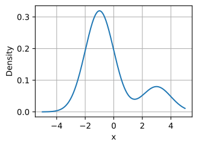
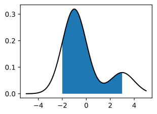
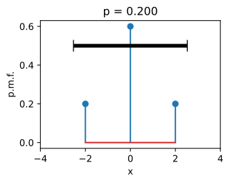
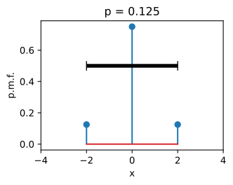
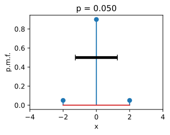
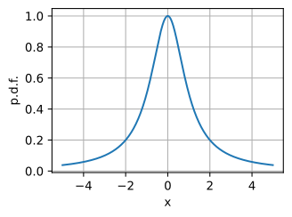
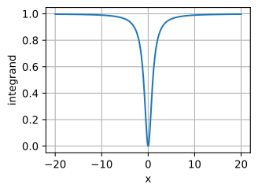
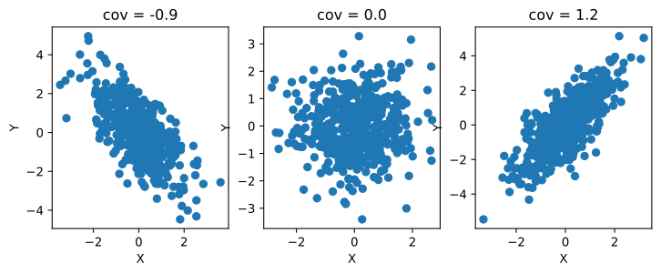
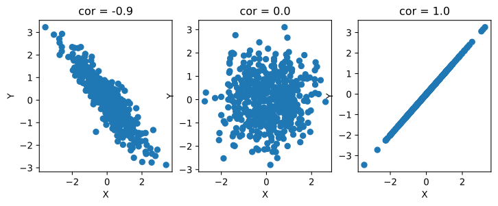
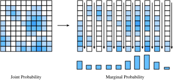

# Biến Ngẫu Nhiên
<a id="sec_random_variables"></a>

Trong [sec_prob](#sec_prob), chúng ta đã thấy những kiến thức cơ bản về cách làm việc với các biến ngẫu nhiên rời rạc, trong trường hợp của chúng ta là những biến ngẫu nhiên chỉ nhận một tập hữu hạn các giá trị có thể có, hoặc các số nguyên. Trong phần này, chúng ta phát triển lý thuyết về *biến ngẫu nhiên liên tục*, tức các biến ngẫu nhiên có thể nhận bất kỳ giá trị thực nào.

## Biến Ngẫu Nhiên Liên Tục

Biến ngẫu nhiên liên tục là một chủ đề tinh tế hơn đáng kể so với biến ngẫu nhiên rời rạc. Một phép tương tự khá công bằng là bước nhảy kỹ thuật ở đây có thể so sánh với bước nhảy từ việc cộng các danh sách số sang việc tích phân các hàm. Vì vậy, chúng ta sẽ cần dành chút thời gian để phát triển lý thuyết.

### Từ Rời Rạc Đến Liên Tục

Để hiểu những thách thức kỹ thuật bổ sung gặp phải khi làm việc với biến ngẫu nhiên liên tục, hãy thực hiện một thí nghiệm tưởng tượng. Giả sử chúng ta đang ném phi tiêu vào bảng phi tiêu, và muốn biết xác suất để mũi phi tiêu rơi đúng cách tâm bảng $2 \textrm{cm}$.

Trước hết, ta tưởng tượng mình đo với độ chính xác một chữ số, tức là dùng các khoảng cho $0 \textrm{cm}$, $1 \textrm{cm}$, $2 \textrm{cm}$, v.v. Ta ném chẳng hạn $100$ mũi phi tiêu vào bảng, và nếu $20$ mũi rơi vào khoảng ứng với $2\textrm{cm}$ thì ta kết luận rằng $20\%$ số mũi phi tiêu ta ném trúng bảng ở vị trí cách tâm $2 \textrm{cm}$.

Tuy nhiên, khi nhìn kỹ hơn, điều này không khớp với câu hỏi của ta! Ta muốn bằng đúng giá trị đó, trong khi các khoảng này chứa mọi mũi rơi vào giữa, chẳng hạn, $1.5\textrm{cm}$ và $2.5\textrm{cm}$.

Không nản chí, ta tiếp tục. Ta đo chính xác hơn nữa, chẳng hạn $1.9\textrm{cm}$, $2.0\textrm{cm}$, $2.1\textrm{cm}$, và giờ thấy có lẽ $3$ trong $100$ mũi phi tiêu trúng bảng trong nhóm $2.0\textrm{cm}$. Vì vậy ta kết luận xác suất là $3\%$.

Tuy nhiên, điều này cũng không giải quyết được gì! Ta chỉ đẩy vấn đề xuống thêm một chữ số. Hãy trừu tượng hóa một chút. Tưởng tượng ta biết xác suất để $k$ chữ số đầu tiên khớp với $2.00000\ldots$, và ta muốn biết xác suất để nó khớp ở $k+1$ chữ số đầu tiên. Khá hợp lý khi giả định rằng chữ số thứ ${k+1}^{\textrm{th}}$ về cơ bản là một lựa chọn ngẫu nhiên từ tập $\{0, 1, 2, \ldots, 9\}$. Ít nhất, ta khó hình dung một quá trình vật lý có ý nghĩa nào lại buộc số micromet cách tâm phải ưu tiên kết thúc bằng $7$ thay vì $3$.

Điều này có nghĩa là, về bản chất, mỗi chữ số chính xác bổ sung mà ta yêu cầu sẽ làm xác suất khớp giảm đi một hệ số $10$. Nói cách khác, ta kỳ vọng rằng

$$
P(\textrm{distance is}\; 2.00\ldots, \;\textrm{to}\; k \;\textrm{digits} ) \approx p\cdot10^{-k}.
$$

Giá trị $p$ về cơ bản mã hóa điều xảy ra với vài chữ số đầu, còn $10^{-k}$ xử lý phần còn lại.

Lưu ý rằng nếu ta biết vị trí chính xác đến $k=4$ chữ số sau dấu thập phân, điều đó có nghĩa là ta biết giá trị nằm trong khoảng, chẳng hạn, $[1.99995,2.00005]$, là một khoảng có độ dài $2.00005-1.99995 = 10^{-4}$. Vì vậy, nếu gọi độ dài của khoảng này là $\epsilon$, ta có thể nói

$$
P(\textrm{distance is in an}\; \epsilon\textrm{-sized interval around}\; 2 ) \approx \epsilon \cdot p.
$$

Hãy đi thêm một bước cuối cùng. Từ đầu đến giờ ta chỉ nghĩ về điểm $2$, mà chưa nghĩ đến các điểm khác. Về cơ bản không có gì khác, nhưng giá trị $p$ rất có thể sẽ khác. Ít nhất ta hy vọng rằng một người ném phi tiêu có khả năng trúng một điểm gần tâm, như $2\textrm{cm}$, hơn là $20\textrm{cm}$. Vì vậy, giá trị $p$ không cố định, mà nên phụ thuộc vào điểm $x$. Điều này cho ta biết rằng ta nên kỳ vọng

$$P(\textrm{distance is in an}\; \epsilon \textrm{-sized interval around}\; x ) \approx \epsilon \cdot p(x).$$

Thật vậy, :eqref:`eq_pdf_deriv` định nghĩa chính xác *hàm mật độ xác suất*. Đó là một hàm $p(x)$ mã hóa xác suất tương đối của việc rơi gần điểm này so với điểm khác. Hãy trực quan hóa xem một hàm như vậy có thể trông như thế nào.

```python
#@tab mxnet
%matplotlib inline
from d2l import mxnet as d2l
from IPython import display
from mxnet import np, npx
npx.set_np()

# Plot the probability density function for some random variable
x = np.arange(-5, 5, 0.01)
p = 0.2*np.exp(-(x - 3)**2 / 2)/np.sqrt(2 * np.pi) + \
    0.8*np.exp(-(x + 1)**2 / 2)/np.sqrt(2 * np.pi)

d2l.plot(x, p, 'x', 'Density')
```




```python
#@tab pytorch
%matplotlib inline
from d2l import torch as d2l
from IPython import display
import torch
torch.pi = torch.acos(torch.zeros(1)).item() * 2  # Define pi in torch

# Plot the probability density function for some random variable
x = torch.arange(-5, 5, 0.01)
p = 0.2*torch.exp(-(x - 3)**2 / 2)/torch.sqrt(2 * torch.tensor(torch.pi)) + \
    0.8*torch.exp(-(x + 1)**2 / 2)/torch.sqrt(2 * torch.tensor(torch.pi))

d2l.plot(x, p, 'x', 'Density')
```




```python
#@tab tensorflow
%matplotlib inline
from d2l import tensorflow as d2l
from IPython import display
import tensorflow as tf
tf.pi = tf.acos(tf.zeros(1)).numpy() * 2  # Define pi in TensorFlow

# Plot the probability density function for some random variable
x = tf.range(-5, 5, 0.01)
p = 0.2*tf.exp(-(x - 3)**2 / 2)/tf.sqrt(2 * tf.constant(tf.pi)) + \
    0.8*tf.exp(-(x + 1)**2 / 2)/tf.sqrt(2 * tf.constant(tf.pi))

d2l.plot(x, p, 'x', 'Density')
```




Những vị trí mà giá trị hàm lớn cho biết các vùng nơi ta có nhiều khả năng tìm thấy giá trị ngẫu nhiên hơn. Những phần thấp là các vùng nơi ta ít có khả năng tìm thấy giá trị ngẫu nhiên.

### Hàm Mật Độ Xác Suất

Bây giờ hãy khảo sát điều này kỹ hơn. Ta đã thấy trực giác về hàm mật độ xác suất của một biến ngẫu nhiên $X$: hàm mật độ là một hàm $p(x)$ sao cho

$$P(X \; \textrm{is in an}\; \epsilon \textrm{-sized interval around}\; x ) \approx \epsilon \cdot p(x).$$

Nhưng điều này hàm ý gì về các tính chất của $p(x)$?

Thứ nhất, xác suất không bao giờ âm, vì vậy ta cũng nên kỳ vọng rằng $p(x) \ge 0$.

Thứ hai, hãy tưởng tượng rằng ta cắt $\mathbb{R}$ thành vô số lát có bề rộng $\epsilon$, chẳng hạn các lát $(\epsilon\cdot i, \epsilon \cdot (i+1)]$. Với mỗi lát này, từ :eqref:`eq_pdf_def` ta biết xác suất xấp xỉ là

$$
P(X \; \textrm{is in an}\; \epsilon\textrm{-sized interval around}\; x ) \approx \epsilon \cdot p(\epsilon \cdot i),
$$

vì vậy khi cộng trên tất cả các lát, ta sẽ có

$$
P(X\in\mathbb{R}) \approx \sum_i \epsilon \cdot p(\epsilon\cdot i).
$$

Đây không gì khác hơn là phép xấp xỉ một tích phân đã thảo luận trong [sec_integral_calculus](#sec_integral_calculus), do đó ta có thể nói rằng

$$
P(X\in\mathbb{R}) = \int_{-\infty}^{\infty} p(x) \; dx.
$$

Ta biết rằng $P(X\in\mathbb{R}) = 1$, vì biến ngẫu nhiên phải nhận *một* số nào đó, nên ta có thể kết luận rằng với bất kỳ mật độ nào

$$
\int_{-\infty}^{\infty} p(x) \; dx = 1.
$$

Thật vậy, đào sâu hơn cho thấy rằng với bất kỳ $a$ và $b$ nào, ta có

$$
P(X\in(a, b]) = \int _ {a}^{b} p(x) \; dx.
$$

Ta có thể xấp xỉ điều này trong code bằng các phương pháp xấp xỉ rời rạc giống như trước. Trong trường hợp này, ta có thể xấp xỉ xác suất rơi vào vùng màu xanh.

```python
#@tab mxnet
# Approximate probability using numerical integration
epsilon = 0.01
x = np.arange(-5, 5, 0.01)
p = 0.2*np.exp(-(x - 3)**2 / 2) / np.sqrt(2 * np.pi) + \
    0.8*np.exp(-(x + 1)**2 / 2) / np.sqrt(2 * np.pi)

d2l.set_figsize()
d2l.plt.plot(x, p, color='black')
d2l.plt.fill_between(x.tolist()[300:800], p.tolist()[300:800])
d2l.plt.show()

f'approximate Probability: {np.sum(epsilon*p[300:800])}'
```




```python
#@tab pytorch
# Approximate probability using numerical integration
epsilon = 0.01
x = torch.arange(-5, 5, 0.01)
p = 0.2*torch.exp(-(x - 3)**2 / 2) / torch.sqrt(2 * torch.tensor(torch.pi)) +\
    0.8*torch.exp(-(x + 1)**2 / 2) / torch.sqrt(2 * torch.tensor(torch.pi))

d2l.set_figsize()
d2l.plt.plot(x, p, color='black')
d2l.plt.fill_between(x.tolist()[300:800], p.tolist()[300:800])
d2l.plt.show()

f'approximate Probability: {torch.sum(epsilon*p[300:800])}'
```




```python
#@tab tensorflow
# Approximate probability using numerical integration
epsilon = 0.01
x = tf.range(-5, 5, 0.01)
p = 0.2*tf.exp(-(x - 3)**2 / 2) / tf.sqrt(2 * tf.constant(tf.pi)) +\
    0.8*tf.exp(-(x + 1)**2 / 2) / tf.sqrt(2 * tf.constant(tf.pi))

d2l.set_figsize()
d2l.plt.plot(x, p, color='black')
d2l.plt.fill_between(x.numpy().tolist()[300:800], p.numpy().tolist()[300:800])
d2l.plt.show()

f'approximate Probability: {tf.reduce_sum(epsilon*p[300:800])}'
```




Hóa ra hai tính chất này mô tả chính xác không gian của các hàm mật độ xác suất có thể có (hay *p.d.f.* theo cách viết tắt thường gặp). Chúng là các hàm không âm $p(x) \ge 0$ sao cho

$$\int_{-\infty}^{\infty} p(x) \; dx = 1.$$

Ta diễn giải hàm này bằng cách dùng tích phân để thu được xác suất biến ngẫu nhiên của ta nằm trong một khoảng cụ thể:

$$P(X\in(a, b]) = \int _ {a}^{b} p(x) \; dx.$$

Trong [sec_distributions](#sec_distributions), chúng ta sẽ thấy một số phân phối phổ biến, nhưng hãy tiếp tục làm việc ở mức trừu tượng.

### Hàm Phân Phối Tích Lũy

Trong phần trước, chúng ta đã thấy khái niệm p.d.f. Trong thực tế, đây là một cách thường gặp để thảo luận về biến ngẫu nhiên liên tục, nhưng nó có một điểm dễ gây nhầm lẫn quan trọng: các giá trị của p.d.f. tự bản thân chúng không phải là xác suất, mà là một hàm ta phải tích phân để thu được xác suất. Không có gì sai khi mật độ lớn hơn $10$, miễn là nó không lớn hơn $10$ trên một khoảng có độ dài quá $1/10$. Điều này có thể phản trực giác, nên người ta thường cũng suy nghĩ theo *hàm phân phối tích lũy*, hay c.d.f., vốn *là* một xác suất.

Cụ thể, bằng cách dùng :eqref:`eq_pdf_int_int`, ta định nghĩa c.d.f. cho một biến ngẫu nhiên $X$ có mật độ $p(x)$ bởi

$$
F(x) = \int _ {-\infty}^{x} p(x) \; dx = P(X \le x).
$$

Hãy quan sát một vài tính chất.

* $F(x) \rightarrow 0$ khi $x\rightarrow -\infty$.
* $F(x) \rightarrow 1$ khi $x\rightarrow \infty$.
* $F(x)$ không giảm ($y > x \implies F(y) \ge F(x)$).
* $F(x)$ liên tục (không có bước nhảy) nếu $X$ là một biến ngẫu nhiên liên tục.

Với gạch đầu dòng thứ tư, lưu ý rằng điều này sẽ không đúng nếu $X$ là rời rạc, chẳng hạn nhận các giá trị $0$ và $1$, mỗi giá trị với xác suất $1/2$. Trong trường hợp đó

$$
F(x) = \begin{cases}
0 & x < 0, \\
\frac{1}{2} & x < 1, \\
1 & x \ge 1.
\end{cases}
$$

Trong ví dụ này, ta thấy một trong những lợi ích của việc làm việc với c.d.f.: khả năng xử lý các biến ngẫu nhiên liên tục hoặc rời rạc trong cùng một khuôn khổ, hoặc thậm chí các hỗn hợp của hai loại (tung đồng xu: nếu ngửa thì trả về kết quả gieo xúc xắc, nếu sấp thì trả về khoảng cách của một mũi phi tiêu so với tâm bảng phi tiêu).

### Trung Bình

Giả sử ta đang xử lý một biến ngẫu nhiên $X$. Bản thân phân phối có thể khó diễn giải. Thường sẽ hữu ích nếu có thể tóm tắt hành vi của một biến ngẫu nhiên một cách ngắn gọn. Những con số giúp ta nắm bắt hành vi của một biến ngẫu nhiên được gọi là *thống kê tóm tắt*. Những đại lượng thường gặp nhất là *trung bình*, *phương sai* và *độ lệch chuẩn*.

*Trung bình* mã hóa giá trị trung bình của một biến ngẫu nhiên. Nếu ta có một biến ngẫu nhiên rời rạc $X$, nhận các giá trị $x_i$ với xác suất $p_i$, thì trung bình được cho bởi trung bình có trọng số: cộng các giá trị nhân với xác suất biến ngẫu nhiên nhận giá trị đó:

$$\mu_X = E[X] = \sum_i x_i p_i.$$

Cách ta nên diễn giải trung bình (dù cần thận trọng) là nó về cơ bản cho ta biết biến ngẫu nhiên có xu hướng nằm ở đâu.

Làm một ví dụ tối giản mà ta sẽ xét xuyên suốt phần này, hãy lấy $X$ là biến ngẫu nhiên nhận giá trị $a-2$ với xác suất $p$, $a+2$ với xác suất $p$ và $a$ với xác suất $1-2p$. Dùng :eqref:`eq_exp_def`, ta có thể tính rằng với bất kỳ lựa chọn nào của $a$ và $p$, trung bình là

$$
\mu_X = E[X] = \sum_i x_i p_i = (a-2)p + a(1-2p) + (a+2)p = a.
$$

Vì vậy ta thấy trung bình là $a$. Điều này khớp với trực giác vì $a$ là vị trí mà quanh đó ta đặt tâm cho biến ngẫu nhiên.

Vì chúng hữu ích, hãy tóm tắt một vài tính chất.

* Với bất kỳ biến ngẫu nhiên $X$ và các số $a$ và $b$, ta có $\mu_{aX+b} = a\mu_X + b$.
* Nếu ta có hai biến ngẫu nhiên $X$ và $Y$, ta có $\mu_{X+Y} = \mu_X+\mu_Y$.

Trung bình hữu ích để hiểu hành vi trung bình của một biến ngẫu nhiên, tuy nhiên trung bình không đủ để có được một hiểu biết trực giác đầy đủ. Kiếm lợi nhuận $\$10 \pm \$1$ trên mỗi lần bán rất khác với kiếm $\$10 \pm \$15$ trên mỗi lần bán, dù chúng có cùng giá trị trung bình. Trường hợp thứ hai có mức dao động lớn hơn nhiều, và do đó biểu thị rủi ro lớn hơn nhiều. Vì vậy, để hiểu hành vi của một biến ngẫu nhiên, tối thiểu ta sẽ cần thêm một phép đo nữa: một thước đo về mức độ biến ngẫu nhiên dao động rộng đến đâu.

### Phương Sai

Điều này dẫn ta đến việc xét *phương sai* của một biến ngẫu nhiên. Đây là một phép đo định lượng cho biết một biến ngẫu nhiên lệch khỏi trung bình bao xa. Xét biểu thức $X - \mu_X$. Đây là độ lệch của biến ngẫu nhiên khỏi trung bình của nó. Giá trị này có thể dương hoặc âm, nên ta cần làm gì đó để biến nó thành dương, sao cho ta đang đo độ lớn của độ lệch.

Một điều hợp lý để thử là xét $\left|X-\mu_X\right|$, và thật vậy điều này dẫn đến một đại lượng hữu ích gọi là *độ lệch tuyệt đối trung bình*. Tuy nhiên, do các liên hệ với những lĩnh vực khác của toán học và thống kê, người ta thường dùng một cách khác.

Cụ thể, họ xét $(X-\mu_X)^2.$ Nếu ta xét kích thước điển hình của đại lượng này bằng cách lấy trung bình, ta thu được phương sai

$$\sigma_X^2 = \textrm{Var}(X) = E\left[(X-\mu_X)^2\right] = E[X^2] - \mu_X^2.$$

Đẳng thức cuối trong :eqref:`eq_var_def` đúng bằng cách khai triển định nghĩa ở giữa và áp dụng các tính chất của kỳ vọng.

Hãy xét ví dụ của ta, trong đó $X$ là biến ngẫu nhiên nhận giá trị $a-2$ với xác suất $p$, $a+2$ với xác suất $p$ và $a$ với xác suất $1-2p$. Trong trường hợp này $\mu_X = a$, nên tất cả những gì ta cần tính là $E\left[X^2\right]$. Điều này có thể làm ngay:

$$
E\left[X^2\right] = (a-2)^2p + a^2(1-2p) + (a+2)^2p = a^2 + 8p.
$$

Vì vậy, theo :eqref:`eq_var_def`, phương sai của ta là

$$
\sigma_X^2 = \textrm{Var}(X) = E[X^2] - \mu_X^2 = a^2 + 8p - a^2 = 8p.
$$

Kết quả này một lần nữa hợp lý. Giá trị lớn nhất của $p$ là $1/2$, tương ứng với việc chọn $a-2$ hoặc $a+2$ bằng cách tung đồng xu. Phương sai bằng $4$ tương ứng với thực tế rằng cả $a-2$ và $a+2$ đều cách trung bình $2$ đơn vị, và $2^2 = 4$. Ở đầu kia của phổ, nếu $p=0$, biến ngẫu nhiên này luôn nhận giá trị $0$, nên nó hoàn toàn không có phương sai.

Ta liệt kê một vài tính chất của phương sai dưới đây:

* Với bất kỳ biến ngẫu nhiên $X$, $\textrm{Var}(X) \ge 0$, với $\textrm{Var}(X) = 0$ khi và chỉ khi $X$ là một hằng số.
* Với bất kỳ biến ngẫu nhiên $X$ và các số $a$ và $b$, ta có $\textrm{Var}(aX+b) = a^2\textrm{Var}(X)$.
* Nếu ta có hai biến ngẫu nhiên *độc lập* $X$ và $Y$, ta có $\textrm{Var}(X+Y) = \textrm{Var}(X) + \textrm{Var}(Y)$.

Khi diễn giải các giá trị này, có thể có một chút vướng mắc. Cụ thể, hãy tưởng tượng điều gì xảy ra nếu ta theo dõi đơn vị xuyên suốt phép tính này. Giả sử ta đang làm việc với xếp hạng sao được gán cho một sản phẩm trên trang web. Khi đó $a$, $a-2$ và $a+2$ đều được đo bằng đơn vị sao. Tương tự, trung bình $\mu_X$ khi đó cũng được đo bằng sao (vì là trung bình có trọng số). Tuy nhiên, khi đi đến phương sai, ta lập tức gặp một vấn đề: ta muốn xét $(X-\mu_X)^2$, đại lượng này có đơn vị là *sao bình phương*. Điều này có nghĩa là bản thân phương sai không thể so sánh trực tiếp với các phép đo ban đầu. Để làm cho nó diễn giải được, ta cần quay lại các đơn vị ban đầu.

### Độ Lệch Chuẩn

Thống kê tóm tắt này luôn có thể được suy ra từ phương sai bằng cách lấy căn bậc hai! Vì vậy ta định nghĩa *độ lệch chuẩn* là

$$
\sigma_X = \sqrt{\textrm{Var}(X)}.
$$

Trong ví dụ của ta, điều này có nghĩa là độ lệch chuẩn hiện là $\sigma_X = 2\sqrt{2p}$. Nếu ta đang làm việc với đơn vị sao trong ví dụ đánh giá, $\sigma_X$ lại có đơn vị sao.

Các tính chất ta đã có cho phương sai có thể được phát biểu lại cho độ lệch chuẩn.

* Với bất kỳ biến ngẫu nhiên $X$, $\sigma_{X} \ge 0$.
* Với bất kỳ biến ngẫu nhiên $X$ và các số $a$ và $b$, ta có $\sigma_{aX+b} = |a|\sigma_{X}$
* Nếu ta có hai biến ngẫu nhiên *độc lập* $X$ và $Y$, ta có $\sigma_{X+Y} = \sqrt{\sigma_{X}^2 + \sigma_{Y}^2}$.

Tại thời điểm này, rất tự nhiên khi hỏi: "Nếu độ lệch chuẩn có cùng đơn vị với biến ngẫu nhiên ban đầu, liệu nó có biểu thị điều gì ta có thể vẽ ra liên quan đến biến ngẫu nhiên đó không?" Câu trả lời là có một cách rõ ràng! Thật vậy, giống như trung bình cho ta biết vị trí điển hình của biến ngẫu nhiên, độ lệch chuẩn cho ta khoảng biến thiên điển hình của biến ngẫu nhiên đó. Ta có thể làm điều này chặt chẽ bằng thứ được gọi là bất đẳng thức Chebyshev:

$$P\left(X \not\in [\mu_X - \alpha\sigma_X, \mu_X + \alpha\sigma_X]\right) \le \frac{1}{\alpha^2}.$$

Hay phát biểu bằng lời trong trường hợp $\alpha=10$, $99\%$ mẫu từ bất kỳ biến ngẫu nhiên nào đều rơi trong phạm vi $10$ độ lệch chuẩn quanh trung bình. Điều này đem lại một cách diễn giải trực tiếp cho các thống kê tóm tắt chuẩn của ta.

Để thấy phát biểu này tinh tế như thế nào, hãy nhìn lại ví dụ xuyên suốt của ta, trong đó $X$ là biến ngẫu nhiên nhận giá trị $a-2$ với xác suất $p$, $a+2$ với xác suất $p$ và $a$ với xác suất $1-2p$. Ta đã thấy trung bình là $a$ và độ lệch chuẩn là $2\sqrt{2p}$. Điều này có nghĩa là nếu ta lấy bất đẳng thức Chebyshev :eqref:`eq_chebyshev` với $\alpha = 2$, ta thấy biểu thức là

$$
P\left(X \not\in [a - 4\sqrt{2p}, a + 4\sqrt{2p}]\right) \le \frac{1}{4}.
$$

Điều này có nghĩa là trong $75\%$ thời gian, biến ngẫu nhiên này sẽ rơi trong khoảng này với bất kỳ giá trị nào của $p$. Bây giờ, lưu ý rằng khi $p \rightarrow 0$, khoảng này cũng hội tụ về điểm duy nhất $a$. Nhưng ta biết biến ngẫu nhiên của mình chỉ nhận các giá trị $a-2, a$ và $a+2$, nên cuối cùng ta có thể chắc chắn rằng $a-2$ và $a+2$ sẽ nằm ngoài khoảng! Câu hỏi là: điều đó xảy ra tại $p$ nào. Vì vậy ta muốn giải: với $p$ nào thì $a+4\sqrt{2p} = a+2$, và nghiệm là $p=1/8$, đây *chính xác* là $p$ đầu tiên mà điều đó có thể xảy ra mà không vi phạm khẳng định rằng không quá $1/4$ số mẫu từ phân phối rơi ngoài khoảng ($1/8$ ở bên trái và $1/8$ ở bên phải).

Hãy trực quan hóa điều này. Ta sẽ biểu diễn xác suất nhận ba giá trị bằng ba thanh dọc có chiều cao tỷ lệ với xác suất. Khoảng sẽ được vẽ như một đường ngang ở giữa. Biểu đồ đầu tiên cho thấy điều gì xảy ra với $p > 1/8$, khi khoảng chứa an toàn tất cả các điểm.

```python
#@tab mxnet
# Define a helper to plot these figures
def plot_chebyshev(a, p):
    d2l.set_figsize()
    d2l.plt.stem([a-2, a, a+2], [p, 1-2*p, p], use_line_collection=True)
    d2l.plt.xlim([-4, 4])
    d2l.plt.xlabel('x')
    d2l.plt.ylabel('p.m.f.')

    d2l.plt.hlines(0.5, a - 4 * np.sqrt(2 * p),
                   a + 4 * np.sqrt(2 * p), 'black', lw=4)
    d2l.plt.vlines(a - 4 * np.sqrt(2 * p), 0.53, 0.47, 'black', lw=1)
    d2l.plt.vlines(a + 4 * np.sqrt(2 * p), 0.53, 0.47, 'black', lw=1)
    d2l.plt.title(f'p = {p:.3f}')

    d2l.plt.show()

# Plot interval when p > 1/8
plot_chebyshev(0.0, 0.2)
```




```python
#@tab pytorch
# Define a helper to plot these figures
def plot_chebyshev(a, p):
    d2l.set_figsize()
    d2l.plt.stem([a-2, a, a+2], [p, 1-2*p, p], use_line_collection=True)
    d2l.plt.xlim([-4, 4])
    d2l.plt.xlabel('x')
    d2l.plt.ylabel('p.m.f.')

    d2l.plt.hlines(0.5, a - 4 * torch.sqrt(2 * p),
                   a + 4 * torch.sqrt(2 * p), 'black', lw=4)
    d2l.plt.vlines(a - 4 * torch.sqrt(2 * p), 0.53, 0.47, 'black', lw=1)
    d2l.plt.vlines(a + 4 * torch.sqrt(2 * p), 0.53, 0.47, 'black', lw=1)
    d2l.plt.title(f'p = {p:.3f}')

    d2l.plt.show()

# Plot interval when p > 1/8
plot_chebyshev(0.0, torch.tensor(0.2))
```




```python
#@tab tensorflow
# Define a helper to plot these figures
def plot_chebyshev(a, p):
    d2l.set_figsize()
    d2l.plt.stem([a-2, a, a+2], [p, 1-2*p, p], use_line_collection=True)
    d2l.plt.xlim([-4, 4])
    d2l.plt.xlabel('x')
    d2l.plt.ylabel('p.m.f.')

    d2l.plt.hlines(0.5, a - 4 * tf.sqrt(2 * p),
                   a + 4 * tf.sqrt(2 * p), 'black', lw=4)
    d2l.plt.vlines(a - 4 * tf.sqrt(2 * p), 0.53, 0.47, 'black', lw=1)
    d2l.plt.vlines(a + 4 * tf.sqrt(2 * p), 0.53, 0.47, 'black', lw=1)
    d2l.plt.title(f'p = {p:.3f}')

    d2l.plt.show()

# Plot interval when p > 1/8
plot_chebyshev(0.0, tf.constant(0.2))
```




Biểu đồ thứ hai cho thấy rằng tại $p = 1/8$, khoảng chạm đúng hai điểm. Điều này cho thấy bất đẳng thức là *sắc*, vì không thể lấy một khoảng nhỏ hơn mà vẫn giữ bất đẳng thức đúng.

```python
#@tab mxnet
# Plot interval when p = 1/8
plot_chebyshev(0.0, 0.125)
```

```python
#@tab pytorch
# Plot interval when p = 1/8
plot_chebyshev(0.0, torch.tensor(0.125))
```

```python
#@tab tensorflow
# Plot interval when p = 1/8
plot_chebyshev(0.0, tf.constant(0.125))
```

Biểu đồ thứ ba cho thấy rằng với $p < 1/8$, khoảng chỉ chứa điểm ở giữa. Điều này không làm bất đẳng thức mất hiệu lực, vì ta chỉ cần bảo đảm rằng không quá $1/4$ xác suất rơi ngoài khoảng, nghĩa là khi $p < 1/8$, hai điểm tại $a-2$ và $a+2$ có thể bị loại ra.

```python
#@tab mxnet
# Plot interval when p < 1/8
plot_chebyshev(0.0, 0.05)
```

```python
#@tab pytorch
# Plot interval when p < 1/8
plot_chebyshev(0.0, torch.tensor(0.05))
```

```python
#@tab tensorflow
# Plot interval when p < 1/8
plot_chebyshev(0.0, tf.constant(0.05))
```

### Trung Bình Và Phương Sai Trong Miền Liên Tục

Tất cả những điều trên được trình bày cho biến ngẫu nhiên rời rạc, nhưng trường hợp biến ngẫu nhiên liên tục cũng tương tự. Để hiểu trực giác cách điều này hoạt động, hãy tưởng tượng ta chia trục số thực thành các khoảng có độ dài $\epsilon$ cho bởi $(\epsilon i, \epsilon (i+1)]$. Khi làm vậy, biến ngẫu nhiên liên tục của ta đã được rời rạc hóa, và ta có thể dùng :eqref:`eq_exp_def` để nói rằng

$$
\begin{aligned}
\mu_X & \approx \sum_{i} (\epsilon i)P(X \in (\epsilon i, \epsilon (i+1)]) \\
& \approx \sum_{i} (\epsilon i)p_X(\epsilon i)\epsilon, \\
\end{aligned}
$$

trong đó $p_X$ là mật độ của $X$. Đây là một xấp xỉ cho tích phân của $xp_X(x)$, nên ta có thể kết luận rằng

$$
\mu_X = \int_{-\infty}^\infty xp_X(x) \; dx.
$$

Tương tự, dùng :eqref:`eq_var_def`, phương sai có thể được viết là

$$
\sigma^2_X = E[X^2] - \mu_X^2 = \int_{-\infty}^\infty x^2p_X(x) \; dx - \left(\int_{-\infty}^\infty xp_X(x) \; dx\right)^2.
$$

Mọi điều đã phát biểu ở trên về trung bình, phương sai và độ lệch chuẩn vẫn áp dụng trong trường hợp này. Chẳng hạn, nếu ta xét biến ngẫu nhiên có mật độ

$$
p(x) = \begin{cases}
1 & x \in [0,1], \\
0 & \textrm{otherwise}.
\end{cases}
$$

ta có thể tính

$$
\mu_X = \int_{-\infty}^\infty xp(x) \; dx = \int_0^1 x \; dx = \frac{1}{2}.
$$

và

$$
\sigma_X^2 = \int_{-\infty}^\infty x^2p(x) \; dx - \left(\frac{1}{2}\right)^2 = \frac{1}{3} - \frac{1}{4} = \frac{1}{12}.
$$

Như một lời cảnh báo, hãy xét thêm một ví dụ nữa, được gọi là *phân phối Cauchy*. Đây là phân phối có p.d.f. cho bởi

$$
p(x) = \frac{1}{1+x^2}.
$$

```python
#@tab mxnet
# Plot the Cauchy distribution p.d.f.
x = np.arange(-5, 5, 0.01)
p = 1 / (1 + x**2)

d2l.plot(x, p, 'x', 'p.d.f.')
```

```python
#@tab pytorch
# Plot the Cauchy distribution p.d.f.
x = torch.arange(-5, 5, 0.01)
p = 1 / (1 + x**2)

d2l.plot(x, p, 'x', 'p.d.f.')
```

```python
#@tab tensorflow
# Plot the Cauchy distribution p.d.f.
x = tf.range(-5, 5, 0.01)
p = 1 / (1 + x**2)

d2l.plot(x, p, 'x', 'p.d.f.')
```

Hàm này trông vô hại, và quả thật khi tra một bảng tích phân, ta sẽ thấy diện tích bên dưới nó bằng một, do đó nó định nghĩa một biến ngẫu nhiên liên tục.

Để thấy điều gì đi sai, hãy thử tính phương sai của nó. Điều này sẽ liên quan đến việc dùng :eqref:`eq_var_def` để tính

$$
\int_{-\infty}^\infty \frac{x^2}{1+x^2}\; dx.
$$

Hàm bên trong trông như sau:

```python
#@tab mxnet
# Plot the integrand needed to compute the variance
x = np.arange(-20, 20, 0.01)
p = x**2 / (1 + x**2)

d2l.plot(x, p, 'x', 'integrand')
```

```python
#@tab pytorch
# Plot the integrand needed to compute the variance
x = torch.arange(-20, 20, 0.01)
p = x**2 / (1 + x**2)

d2l.plot(x, p, 'x', 'integrand')
```

```python
#@tab tensorflow
# Plot the integrand needed to compute the variance
x = tf.range(-20, 20, 0.01)
p = x**2 / (1 + x**2)

d2l.plot(x, p, 'x', 'integrand')
```

Hàm này rõ ràng có diện tích vô hạn bên dưới, vì về cơ bản nó là hằng số một với một chỗ lõm nhỏ gần không, và thật vậy ta có thể chứng minh rằng

$$
\int_{-\infty}^\infty \frac{x^2}{1+x^2}\; dx = \infty.
$$

Điều này có nghĩa là nó không có phương sai hữu hạn được định nghĩa tốt.

Tuy nhiên, nhìn sâu hơn còn cho thấy một kết quả đáng lo ngại hơn. Hãy thử tính trung bình bằng :eqref:`eq_exp_def`. Dùng công thức đổi biến, ta thấy

$$
\mu_X = \int_{-\infty}^{\infty} \frac{x}{1+x^2} \; dx = \frac{1}{2}\int_1^\infty \frac{1}{u} \; du.
$$

Tích phân bên trong là định nghĩa của logarit, nên về bản chất đây là $\log(\infty) = \infty$, do đó cũng không có giá trị trung bình được định nghĩa tốt!

Các nhà khoa học machine learning định nghĩa mô hình của họ sao cho thường thì ta không cần xử lý những vấn đề này, và trong đại đa số trường hợp sẽ làm việc với các biến ngẫu nhiên có trung bình và phương sai được định nghĩa tốt. Tuy nhiên, thỉnh thoảng các biến ngẫu nhiên có *đuôi nặng* (tức những biến ngẫu nhiên mà xác suất nhận giá trị lớn đủ lớn để làm cho những đại lượng như trung bình hoặc phương sai không xác định) lại hữu ích trong việc mô hình hóa các hệ vật lý, nên đáng để biết rằng chúng tồn tại.

### Hàm Mật Độ Đồng Thời

Toàn bộ phần trên đều giả định ta đang làm việc với một biến ngẫu nhiên thực đơn lẻ. Nhưng nếu ta đang xử lý hai hoặc nhiều biến ngẫu nhiên có thể tương quan mạnh thì sao? Tình huống này là chuẩn mực trong machine learning: hãy tưởng tượng các biến ngẫu nhiên như $R_{i, j}$ mã hóa giá trị đỏ của pixel tại tọa độ $(i, j)$ trong một ảnh, hoặc $P_t$ là biến ngẫu nhiên được cho bởi giá cổ phiếu tại thời điểm $t$. Các pixel gần nhau có xu hướng có màu tương tự, và các thời điểm gần nhau có xu hướng có giá tương tự. Ta không thể xem chúng như các biến ngẫu nhiên tách biệt mà vẫn kỳ vọng tạo ra một mô hình thành công (ta sẽ thấy trong [sec_naive_bayes](#sec_naive_bayes) một mô hình hoạt động kém do giả định như vậy). Ta cần phát triển ngôn ngữ toán học để xử lý các biến ngẫu nhiên liên tục có tương quan này.

May mắn thay, với các tích phân bội trong [sec_integral_calculus](#sec_integral_calculus), ta có thể phát triển một ngôn ngữ như vậy. Giả sử, để đơn giản, ta có hai biến ngẫu nhiên $X, Y$ có thể tương quan. Khi đó, tương tự trường hợp một biến, ta có thể đặt câu hỏi:

$$
P(X \;\textrm{is in an}\; \epsilon \textrm{-sized interval around}\; x \; \textrm{and} \;Y \;\textrm{is in an}\; \epsilon \textrm{-sized interval around}\; y ).
$$

Lập luận tương tự như trong trường hợp một biến cho thấy đại lượng này nên xấp xỉ

$$
P(X \;\textrm{is in an}\; \epsilon \textrm{-sized interval around}\; x \; \textrm{and} \;Y \;\textrm{is in an}\; \epsilon \textrm{-sized interval around}\; y ) \approx \epsilon^{2}p(x, y),
$$

với một hàm nào đó $p(x, y)$. Hàm này được gọi là mật độ đồng thời của $X$ và $Y$. Các tính chất tương tự cũng đúng như ta đã thấy trong trường hợp một biến. Cụ thể:

* $p(x, y) \ge 0$;
* $\int _ {\mathbb{R}^2} p(x, y) \;dx \;dy = 1$;
* $P((X, Y) \in \mathcal{D}) = \int _ {\mathcal{D}} p(x, y) \;dx \;dy$.

Bằng cách này, ta có thể xử lý nhiều biến ngẫu nhiên có thể tương quan. Nếu muốn làm việc với nhiều hơn hai biến ngẫu nhiên, ta có thể mở rộng mật độ đa biến đến bao nhiêu tọa độ tùy ý bằng cách xét $p(\mathbf{x}) = p(x_1, \ldots, x_n)$. Các tính chất không âm và có tích phân toàn phần bằng một vẫn giữ nguyên.

### Phân Phối Biên
Khi xử lý nhiều biến, ta thường muốn bỏ qua các mối quan hệ và hỏi: "biến này được phân phối như thế nào?" Một phân phối như vậy được gọi là *phân phối biên*.

Cụ thể, giả sử ta có hai biến ngẫu nhiên $X, Y$ với mật độ đồng thời cho bởi $p _ {X, Y}(x, y)$. Ta sẽ dùng chỉ số dưới để chỉ mật độ đó thuộc về những biến ngẫu nhiên nào. Bài toán tìm phân phối biên là lấy hàm này và dùng nó để tìm $p _ X(x)$.

Như với hầu hết mọi thứ, tốt nhất là quay lại bức tranh trực giác để tìm ra điều gì nên đúng. Nhớ lại rằng mật độ là hàm $p _ X$ sao cho

$$
P(X \in [x, x+\epsilon]) \approx \epsilon \cdot p _ X(x).
$$

Không hề có nhắc đến $Y$, nhưng nếu tất cả những gì ta được cho là $p _{X, Y}$, ta cần đưa $Y$ vào theo cách nào đó. Trước hết, ta có thể quan sát rằng điều này giống với

$$
P(X \in [x, x+\epsilon] \textrm{, and } Y \in \mathbb{R}) \approx \epsilon \cdot p _ X(x).
$$

Mật độ của ta không trực tiếp cho biết điều gì xảy ra trong trường hợp này; ta cũng cần chia thành các khoảng nhỏ theo $y$, vì vậy ta có thể viết

$$
\begin{aligned}
\epsilon \cdot p _ X(x) & \approx \sum _ {i} P(X \in [x, x+\epsilon] \textrm{, and } Y \in [\epsilon \cdot i, \epsilon \cdot (i+1)]) \\
& \approx \sum _ {i} \epsilon^{2} p _ {X, Y}(x, \epsilon\cdot i).
\end{aligned}
$$


<a id="fig_marginal"></a>

Điều này cho ta biết phải cộng các giá trị của mật độ dọc theo một chuỗi các ô vuông trên một đường, như được minh họa trong [fig_marginal](#fig_marginal). Thật vậy, sau khi khử một thừa số epsilon ở cả hai vế và nhận ra tổng ở vế phải là tích phân theo $y$, ta có thể kết luận rằng

$$
\begin{aligned}
 p _ X(x) &  \approx \sum _ {i} \epsilon p _ {X, Y}(x, \epsilon\cdot i) \\
 & \approx \int_{-\infty}^\infty p_{X, Y}(x, y) \; dy.
\end{aligned}
$$

Do đó ta thấy

$$
p _ X(x) = \int_{-\infty}^\infty p_{X, Y}(x, y) \; dy.
$$

Điều này cho ta biết rằng để thu được một phân phối biên, ta tích phân theo các biến mà ta không quan tâm. Quá trình này thường được gọi là *tích phân loại bỏ* hoặc *biên hóa* các biến không cần thiết.

### Hiệp Phương Sai

Khi xử lý nhiều biến ngẫu nhiên, có một thống kê tóm tắt bổ sung rất hữu ích cần biết: *hiệp phương sai*. Đại lượng này đo mức độ hai biến ngẫu nhiên dao động cùng nhau.

Giả sử ta có hai biến ngẫu nhiên $X$ và $Y$; để bắt đầu, hãy giả sử chúng là rời rạc, nhận các giá trị $(x_i, y_j)$ với xác suất $p_{ij}$. Trong trường hợp này, hiệp phương sai được định nghĩa là

$$\sigma_{XY} = \textrm{Cov}(X, Y) = \sum_{i, j} (x_i - \mu_X) (y_j-\mu_Y) p_{ij}. = E[XY] - E[X]E[Y].$$

Để suy nghĩ về điều này một cách trực giác, hãy xét cặp biến ngẫu nhiên sau. Giả sử $X$ nhận các giá trị $1$ và $3$, còn $Y$ nhận các giá trị $-1$ và $3$. Giả sử ta có các xác suất sau

$$
\begin{aligned}
P(X = 1 \; \textrm{and} \; Y = -1) & = \frac{p}{2}, \\
P(X = 1 \; \textrm{and} \; Y = 3) & = \frac{1-p}{2}, \\
P(X = 3 \; \textrm{and} \; Y = -1) & = \frac{1-p}{2}, \\
P(X = 3 \; \textrm{and} \; Y = 3) & = \frac{p}{2},
\end{aligned}
$$

trong đó $p$ là một tham số trong $[0,1]$ mà ta được chọn. Lưu ý rằng nếu $p=1$ thì cả hai luôn cùng nhận giá trị nhỏ nhất hoặc lớn nhất đồng thời, và nếu $p=0$ thì chúng được bảo đảm nhận các giá trị đảo ngược đồng thời (một biến lớn khi biến kia nhỏ và ngược lại). Nếu $p=1/2$, bốn khả năng đều có xác suất như nhau, và không biến nào nên liên quan đến biến kia. Hãy tính hiệp phương sai. Trước hết, lưu ý $\mu_X = 2$ và $\mu_Y = 1$, nên ta có thể tính bằng :eqref:`eq_cov_def`:

$$
\begin{aligned}
\textrm{Cov}(X, Y) & = \sum_{i, j} (x_i - \mu_X) (y_j-\mu_Y) p_{ij} \\
& = (1-2)(-1-1)\frac{p}{2} + (1-2)(3-1)\frac{1-p}{2} + (3-2)(-1-1)\frac{1-p}{2} + (3-2)(3-1)\frac{p}{2} \\
& = 4p-2.
\end{aligned}
$$

Khi $p=1$ (trường hợp chúng đồng thời cùng cực đại theo hướng dương hoặc âm) thì hiệp phương sai là $2$. Khi $p=0$ (trường hợp chúng bị đảo ngược) thì hiệp phương sai là $-2$. Cuối cùng, khi $p=1/2$ (trường hợp chúng không liên quan), hiệp phương sai là $0$. Vì vậy ta thấy hiệp phương sai đo cách hai biến ngẫu nhiên này liên hệ với nhau.

Một lưu ý nhanh về hiệp phương sai là nó chỉ đo các quan hệ tuyến tính này. Những quan hệ phức tạp hơn như $X = Y^2$, trong đó $Y$ được chọn ngẫu nhiên từ $\{-2, -1, 0, 1, 2\}$ với xác suất bằng nhau, có thể bị bỏ lỡ. Thật vậy, một phép tính nhanh cho thấy các biến ngẫu nhiên này có hiệp phương sai bằng không, dù một biến là hàm tất định của biến kia.

Với biến ngẫu nhiên liên tục, câu chuyện cũng gần như vậy. Đến lúc này, ta đã khá quen với việc chuyển đổi giữa rời rạc và liên tục, nên ta sẽ đưa ra dạng tương tự liên tục của :eqref:`eq_cov_def` mà không suy diễn.

$$
\sigma_{XY} = \int_{\mathbb{R}^2} (x-\mu_X)(y-\mu_Y)p(x, y) \;dx \;dy.
$$

Để trực quan hóa, hãy xem một tập hợp các biến ngẫu nhiên có hiệp phương sai điều chỉnh được.

```python
#@tab mxnet
# Plot a few random variables adjustable covariance
covs = [-0.9, 0.0, 1.2]
d2l.plt.figure(figsize=(12, 3))
for i in range(3):
    X = np.random.normal(0, 1, 500)
    Y = covs[i]*X + np.random.normal(0, 1, (500))

    d2l.plt.subplot(1, 4, i+1)
    d2l.plt.scatter(X.asnumpy(), Y.asnumpy())
    d2l.plt.xlabel('X')
    d2l.plt.ylabel('Y')
    d2l.plt.title(f'cov = {covs[i]}')
d2l.plt.show()
```

```python
#@tab pytorch
# Plot a few random variables adjustable covariance
covs = [-0.9, 0.0, 1.2]
d2l.plt.figure(figsize=(12, 3))
for i in range(3):
    X = torch.randn(500)
    Y = covs[i]*X + torch.randn(500)

    d2l.plt.subplot(1, 4, i+1)
    d2l.plt.scatter(X.numpy(), Y.numpy())
    d2l.plt.xlabel('X')
    d2l.plt.ylabel('Y')
    d2l.plt.title(f'cov = {covs[i]}')
d2l.plt.show()
```

```python
#@tab tensorflow
# Plot a few random variables adjustable covariance
covs = [-0.9, 0.0, 1.2]
d2l.plt.figure(figsize=(12, 3))
for i in range(3):
    X = tf.random.normal((500, ))
    Y = covs[i]*X + tf.random.normal((500, ))

    d2l.plt.subplot(1, 4, i+1)
    d2l.plt.scatter(X.numpy(), Y.numpy())
    d2l.plt.xlabel('X')
    d2l.plt.ylabel('Y')
    d2l.plt.title(f'cov = {covs[i]}')
d2l.plt.show()
```

Hãy xem một vài tính chất của hiệp phương sai:

* Với bất kỳ biến ngẫu nhiên $X$, $\textrm{Cov}(X, X) = \textrm{Var}(X)$.
* Với bất kỳ biến ngẫu nhiên $X, Y$ và các số $a$ và $b$, $\textrm{Cov}(aX+b, Y) = \textrm{Cov}(X, aY+b) = a\textrm{Cov}(X, Y)$.
* Nếu $X$ và $Y$ độc lập thì $\textrm{Cov}(X, Y) = 0$.

Ngoài ra, ta có thể dùng hiệp phương sai để mở rộng một quan hệ ta đã thấy trước đó. Nhớ rằng nếu $X$ và $Y$ là hai biến ngẫu nhiên độc lập thì

$$
\textrm{Var}(X+Y) = \textrm{Var}(X) + \textrm{Var}(Y).
$$

Với kiến thức về hiệp phương sai, ta có thể mở rộng quan hệ này. Thật vậy, một chút đại số cho thấy rằng nói chung,

$$
\textrm{Var}(X+Y) = \textrm{Var}(X) + \textrm{Var}(Y) + 2\textrm{Cov}(X, Y).
$$

Điều này cho phép ta tổng quát hóa quy tắc cộng phương sai cho các biến ngẫu nhiên có tương quan.

### Tương Quan

Như ta đã làm trong trường hợp trung bình và phương sai, bây giờ hãy xét đến đơn vị. Nếu $X$ được đo bằng một đơn vị (chẳng hạn inch), còn $Y$ được đo bằng một đơn vị khác (chẳng hạn đô la), thì hiệp phương sai được đo bằng tích của hai đơn vị này $\textrm{inches} \times \textrm{dollars}$. Các đơn vị này có thể khó diễn giải. Trong trường hợp này, điều ta thường muốn là một phép đo không có đơn vị về mức độ liên quan. Thật vậy, thường ta không quan tâm đến tương quan định lượng chính xác, mà chỉ hỏi liệu tương quan có cùng chiều hay không, và mối quan hệ mạnh đến mức nào.

Để thấy điều gì hợp lý, hãy thực hiện một thí nghiệm tưởng tượng. Giả sử ta đổi các biến ngẫu nhiên tính bằng inch và đô la sang inch và xu. Trong trường hợp này, biến ngẫu nhiên $Y$ được nhân với $100$. Nếu ta đi qua định nghĩa, điều này có nghĩa là $\textrm{Cov}(X, Y)$ sẽ được nhân với $100$. Vì vậy ta thấy rằng trong trường hợp này, thay đổi đơn vị làm hiệp phương sai thay đổi theo hệ số $100$. Do đó, để tìm phép đo tương quan bất biến theo đơn vị, ta cần chia cho thứ gì đó khác cũng được co giãn theo $100$. Quả thật ta có một ứng viên rõ ràng: độ lệch chuẩn! Thật vậy, nếu ta định nghĩa *hệ số tương quan* là

$$\rho(X, Y) = \frac{\textrm{Cov}(X, Y)}{\sigma_{X}\sigma_{Y}},$$

ta thấy đây là một giá trị không có đơn vị. Một chút toán học có thể cho thấy con số này nằm giữa $-1$ và $1$, trong đó $1$ nghĩa là tương quan dương cực đại, còn $-1$ nghĩa là tương quan âm cực đại.

Quay lại ví dụ rời rạc tường minh ở trên, ta có thể thấy $\sigma_X = 1$ và $\sigma_Y = 2$, nên ta có thể tính tương quan giữa hai biến ngẫu nhiên bằng :eqref:`eq_cor_def` và thấy rằng

$$
\rho(X, Y) = \frac{4p-2}{1\cdot 2} = 2p-1.
$$

Giờ giá trị này chạy từ $-1$ đến $1$ với hành vi như kỳ vọng: $1$ nghĩa là tương quan mạnh nhất, và $-1$ nghĩa là tương quan tối thiểu.

Như một ví dụ khác, xét $X$ là bất kỳ biến ngẫu nhiên nào, và $Y=aX+b$ là một hàm tuyến tính tất định bất kỳ của $X$. Khi đó, ta có thể tính được

$$\sigma_{Y} = \sigma_{aX+b} = |a|\sigma_{X},$$

$$\textrm{Cov}(X, Y) = \textrm{Cov}(X, aX+b) = a\textrm{Cov}(X, X) = a\textrm{Var}(X),$$

và do đó theo :eqref:`eq_cor_def`,

$$
\rho(X, Y) = \frac{a\textrm{Var}(X)}{|a|\sigma_{X}^2} = \frac{a}{|a|} = \textrm{sign}(a).
$$

Vì vậy ta thấy tương quan là $+1$ với mọi $a > 0$, và $-1$ với mọi $a < 0$, minh họa rằng tương quan đo mức độ và chiều hướng liên hệ giữa hai biến ngẫu nhiên, chứ không đo thang đo mà biến thiên diễn ra.

Hãy lại vẽ một tập hợp các biến ngẫu nhiên có tương quan điều chỉnh được.

```python
#@tab mxnet
# Plot a few random variables adjustable correlations
cors = [-0.9, 0.0, 1.0]
d2l.plt.figure(figsize=(12, 3))
for i in range(3):
    X = np.random.normal(0, 1, 500)
    Y = cors[i] * X + np.sqrt(1 - cors[i]**2) * np.random.normal(0, 1, 500)

    d2l.plt.subplot(1, 4, i + 1)
    d2l.plt.scatter(X.asnumpy(), Y.asnumpy())
    d2l.plt.xlabel('X')
    d2l.plt.ylabel('Y')
    d2l.plt.title(f'cor = {cors[i]}')
d2l.plt.show()
```

```python
#@tab pytorch
# Plot a few random variables adjustable correlations
cors = [-0.9, 0.0, 1.0]
d2l.plt.figure(figsize=(12, 3))
for i in range(3):
    X = torch.randn(500)
    Y = cors[i] * X + torch.sqrt(torch.tensor(1) -
                                 cors[i]**2) * torch.randn(500)

    d2l.plt.subplot(1, 4, i + 1)
    d2l.plt.scatter(X.numpy(), Y.numpy())
    d2l.plt.xlabel('X')
    d2l.plt.ylabel('Y')
    d2l.plt.title(f'cor = {cors[i]}')
d2l.plt.show()
```

```python
#@tab tensorflow
# Plot a few random variables adjustable correlations
cors = [-0.9, 0.0, 1.0]
d2l.plt.figure(figsize=(12, 3))
for i in range(3):
    X = tf.random.normal((500, ))
    Y = cors[i] * X + tf.sqrt(tf.constant(1.) -
                                 cors[i]**2) * tf.random.normal((500, ))

    d2l.plt.subplot(1, 4, i + 1)
    d2l.plt.scatter(X.numpy(), Y.numpy())
    d2l.plt.xlabel('X')
    d2l.plt.ylabel('Y')
    d2l.plt.title(f'cor = {cors[i]}')
d2l.plt.show()
```

Hãy liệt kê một vài tính chất của tương quan dưới đây.

* Với bất kỳ biến ngẫu nhiên $X$, $\rho(X, X) = 1$.
* Với bất kỳ biến ngẫu nhiên $X, Y$ và các số $a$ và $b$, $\rho(aX+b, Y) = \rho(X, aY+b) = \rho(X, Y)$.
* Nếu $X$ và $Y$ độc lập với phương sai khác không thì $\rho(X, Y) = 0$.

Như một lưu ý cuối cùng, bạn có thể cảm thấy một số công thức này quen thuộc. Thật vậy, nếu ta khai triển mọi thứ với giả định rằng $\mu_X = \mu_Y = 0$, ta thấy rằng đây là

$$
\rho(X, Y) = \frac{\sum_{i, j} x_iy_ip_{ij}}{\sqrt{\sum_{i, j}x_i^2 p_{ij}}\sqrt{\sum_{i, j}y_j^2 p_{ij}}}.
$$

Biểu thức này trông giống tổng của tích các hạng tử chia cho căn bậc hai của các tổng các hạng tử. Đây chính xác là công thức cho cosin của góc giữa hai vector $\mathbf{v}, \mathbf{w}$ với các tọa độ khác nhau được trọng số bởi $p_{ij}$:

$$
\cos(\theta) = \frac{\mathbf{v}\cdot \mathbf{w}}{\|\mathbf{v}\|\|\mathbf{w}\|} = \frac{\sum_{i} v_iw_i}{\sqrt{\sum_{i}v_i^2}\sqrt{\sum_{i}w_i^2}}.
$$

Thật vậy, nếu ta nghĩ chuẩn liên quan đến độ lệch chuẩn, và tương quan như cosin của các góc, thì phần lớn trực giác từ hình học có thể được áp dụng để suy nghĩ về các biến ngẫu nhiên.

## Tóm Tắt
* Biến ngẫu nhiên liên tục là các biến ngẫu nhiên có thể nhận một miền giá trị liên tục. Chúng có một số khó khăn kỹ thuật khiến việc làm việc với chúng thách thức hơn so với biến ngẫu nhiên rời rạc.
* Hàm mật độ xác suất cho phép ta làm việc với biến ngẫu nhiên liên tục bằng cách cung cấp một hàm mà diện tích dưới đường cong trên một khoảng cho biết xác suất tìm thấy một điểm mẫu trong khoảng đó.
* Hàm phân phối tích lũy là xác suất quan sát biến ngẫu nhiên nhỏ hơn một ngưỡng cho trước. Nó có thể cung cấp một góc nhìn thay thế hữu ích, thống nhất các biến rời rạc và liên tục.
* Trung bình là giá trị trung bình của một biến ngẫu nhiên.
* Phương sai là kỳ vọng của bình phương hiệu giữa biến ngẫu nhiên và trung bình của nó.
* Độ lệch chuẩn là căn bậc hai của phương sai. Có thể xem nó như phép đo khoảng giá trị mà biến ngẫu nhiên có thể nhận.
* Bất đẳng thức Chebyshev cho phép ta làm trực giác này trở nên chặt chẽ bằng cách đưa ra một khoảng tường minh chứa biến ngẫu nhiên trong phần lớn thời gian.
* Mật độ đồng thời cho phép ta làm việc với các biến ngẫu nhiên có tương quan. Ta có thể biên hóa mật độ đồng thời bằng cách tích phân trên các biến ngẫu nhiên không mong muốn để thu được phân phối của biến ngẫu nhiên mong muốn.
* Hiệp phương sai và hệ số tương quan cung cấp một cách đo bất kỳ quan hệ tuyến tính nào giữa hai biến ngẫu nhiên có tương quan.

## Bài Tập
1. Giả sử ta có biến ngẫu nhiên với mật độ cho bởi $p(x) = \frac{1}{x^2}$ với $x \ge 1$ và $p(x) = 0$ trong các trường hợp khác. $P(X > 2)$ là bao nhiêu?
2. Phân phối Laplace là một biến ngẫu nhiên có mật độ cho bởi $p(x = \frac{1}{2}e^{-|x|}$. Trung bình và độ lệch chuẩn của hàm này là gì? Gợi ý: $\int_0^\infty xe^{-x} \; dx = 1$ và $\int_0^\infty x^2e^{-x} \; dx = 2$.
3. Tôi bước đến gần bạn trên phố và nói: "Tôi có một biến ngẫu nhiên với trung bình $1$, độ lệch chuẩn $2$, và tôi quan sát thấy $25\%$ số mẫu của mình nhận giá trị lớn hơn $9$." Bạn có tin tôi không? Vì sao có hoặc vì sao không?
4. Giả sử bạn có hai biến ngẫu nhiên $X, Y$, với mật độ đồng thời cho bởi $p_{XY}(x, y) = 4xy$ với $x, y \in [0,1]$ và $p_{XY}(x, y) = 0$ trong các trường hợp khác. Hiệp phương sai của $X$ và $Y$ là bao nhiêu?


[Thảo luận](https://discuss.d2l.ai/t/1094)
