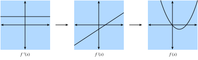
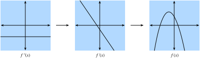
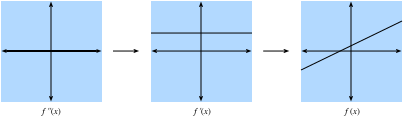

# Giải tích một biến
<a id="sec_single_variable_calculus"></a>

Trong [sec_calculus](#sec_calculus), chúng ta đã thấy các thành phần cơ bản của giải tích vi phân. Phần này đi sâu hơn vào nền tảng của giải tích và cách ta có thể hiểu, áp dụng nó trong bối cảnh học máy.

## Giải tích vi phân
Giải tích vi phân về cơ bản là nghiên cứu cách các hàm ứng xử dưới những thay đổi nhỏ. Để thấy tại sao điều này cốt lõi với học sâu, hãy xét một ví dụ.

Giả sử ta có một mạng nơ-ron sâu trong đó, để tiện, các trọng số được nối lại thành một vector duy nhất $\mathbf{w} = (w_1, \ldots, w_n)$. Với một bộ dữ liệu huấn luyện, ta xét mất mát của mạng nơ-ron trên bộ dữ liệu này, ký hiệu là $\mathcal{L}(\mathbf{w})$.

Hàm này cực kỳ phức tạp, mã hóa hiệu năng của mọi mô hình có thể có thuộc kiến trúc đã cho trên bộ dữ liệu này, nên gần như không thể nói tập trọng số $\mathbf{w}$ nào sẽ cực tiểu hóa mất mát. Vì vậy, trong thực tế, ta thường bắt đầu bằng cách khởi tạo trọng số *ngẫu nhiên*, rồi lặp đi lặp lại các bước nhỏ theo hướng làm mất mát giảm nhanh nhất có thể.

Câu hỏi khi đó trở thành một điều bề ngoài cũng không dễ hơn: làm thế nào để tìm hướng khiến trọng số làm mất mát giảm nhanh nhất? Để đi sâu vào điều này, trước hết hãy xét trường hợp chỉ có một trọng số duy nhất: $L(\mathbf{w}) = L(x)$ với một giá trị thực duy nhất $x$.

Hãy lấy $x$ và cố hiểu điều gì xảy ra khi ta thay đổi nó một lượng nhỏ thành $x + \epsilon$. Nếu muốn cụ thể, hãy nghĩ tới một số như $\epsilon = 0.0000001$. Để giúp trực quan hóa điều xảy ra, hãy vẽ một hàm ví dụ, $f(x) = \sin(x^x)$, trên khoảng $[0, 3]$.

```python
#@tab mxnet
%matplotlib inline
from d2l import mxnet as d2l
from IPython import display
from mxnet import np, npx
npx.set_np()

# Plot a function in a normal range
x_big = np.arange(0.01, 3.01, 0.01)
ys = np.sin(x_big**x_big)
d2l.plot(x_big, ys, 'x', 'f(x)')
```

```python
#@tab pytorch
%matplotlib inline
from d2l import torch as d2l
from IPython import display
import torch
torch.pi = torch.acos(torch.zeros(1)).item() * 2  # Define pi in torch

# Plot a function in a normal range
x_big = torch.arange(0.01, 3.01, 0.01)
ys = torch.sin(x_big**x_big)
d2l.plot(x_big, ys, 'x', 'f(x)')
```

```python
#@tab tensorflow
%matplotlib inline
from d2l import tensorflow as d2l
from IPython import display
import tensorflow as tf
tf.pi = tf.acos(tf.zeros(1)).numpy() * 2  # Define pi in TensorFlow

# Plot a function in a normal range
x_big = tf.range(0.01, 3.01, 0.01)
ys = tf.sin(x_big**x_big)
d2l.plot(x_big, ys, 'x', 'f(x)')
```

Ở thang đo lớn này, hành vi của hàm không đơn giản. Tuy nhiên, nếu thu hẹp khoảng xuống một đoạn nhỏ hơn như $[1.75,2.25]$, ta thấy đồ thị trở nên đơn giản hơn nhiều.

```python
#@tab mxnet
# Plot a the same function in a tiny range
x_med = np.arange(1.75, 2.25, 0.001)
ys = np.sin(x_med**x_med)
d2l.plot(x_med, ys, 'x', 'f(x)')
```

```python
#@tab pytorch
# Plot a the same function in a tiny range
x_med = torch.arange(1.75, 2.25, 0.001)
ys = torch.sin(x_med**x_med)
d2l.plot(x_med, ys, 'x', 'f(x)')
```

```python
#@tab tensorflow
# Plot a the same function in a tiny range
x_med = tf.range(1.75, 2.25, 0.001)
ys = tf.sin(x_med**x_med)
d2l.plot(x_med, ys, 'x', 'f(x)')
```

Đẩy điều này tới cực hạn, nếu ta phóng to vào một đoạn rất nhỏ, hành vi trở nên đơn giản hơn nhiều: nó chỉ là một đường thẳng.

```python
#@tab mxnet
# Plot a the same function in a tiny range
x_small = np.arange(2.0, 2.01, 0.0001)
ys = np.sin(x_small**x_small)
d2l.plot(x_small, ys, 'x', 'f(x)')
```

```python
#@tab pytorch
# Plot a the same function in a tiny range
x_small = torch.arange(2.0, 2.01, 0.0001)
ys = torch.sin(x_small**x_small)
d2l.plot(x_small, ys, 'x', 'f(x)')
```

```python
#@tab tensorflow
# Plot a the same function in a tiny range
x_small = tf.range(2.0, 2.01, 0.0001)
ys = tf.sin(x_small**x_small)
d2l.plot(x_small, ys, 'x', 'f(x)')
```

Đây là quan sát then chốt của giải tích một biến: hành vi của các hàm quen thuộc có thể được mô hình hóa bằng một đường thẳng trên một khoảng đủ nhỏ. Điều này có nghĩa là với hầu hết các hàm, hợp lý để kỳ vọng rằng khi ta dịch giá trị $x$ của hàm đi một chút, đầu ra $f(x)$ cũng sẽ dịch đi một chút. Câu hỏi duy nhất cần trả lời là: "Mức thay đổi của đầu ra lớn bao nhiêu so với thay đổi của đầu vào? Bằng một nửa? Gấp đôi?"

Vì vậy, ta có thể xét tỷ số giữa thay đổi trong đầu ra của một hàm và một thay đổi nhỏ trong đầu vào của hàm. Ta có thể viết điều này một cách hình thức là

$$
\frac{L(x+\epsilon) - L(x)}{(x+\epsilon) - x} = \frac{L(x+\epsilon) - L(x)}{\epsilon}.
$$

Điều này đã đủ để bắt đầu thử nghiệm trong mã. Chẳng hạn, giả sử ta biết $L(x) = x^{2} + 1701(x-4)^3$, khi đó ta có thể xem giá trị này lớn bao nhiêu tại điểm $x = 4$ như sau.

```python
#@tab all
# Define our function
def L(x):
    return x**2 + 1701*(x-4)**3

# Print the difference divided by epsilon for several epsilon
for epsilon in [0.1, 0.001, 0.0001, 0.00001]:
    print(f'epsilon = {epsilon:.5f} -> {(L(4+epsilon) - L(4)) / epsilon:.5f}')
```

Bây giờ, nếu quan sát kỹ, ta sẽ nhận thấy đầu ra của con số này gần một cách đáng ngờ với $8$. Thật vậy, nếu giảm $\epsilon$, ta sẽ thấy giá trị tiến dần tới $8$. Do đó, ta có thể kết luận, một cách đúng đắn, rằng giá trị ta tìm kiếm (mức độ mà thay đổi trong đầu vào làm thay đổi đầu ra) nên là $8$ tại điểm $x=4$. Cách nhà toán học mã hóa sự thật này là

$$
\lim_{\epsilon \rightarrow 0}\frac{L(4+\epsilon) - L(4)}{\epsilon} = 8.
$$

Như một đoạn lạc đề lịch sử: trong vài thập kỷ đầu của nghiên cứu mạng nơ-ron, các nhà khoa học dùng thuật toán này (*phương pháp sai phân hữu hạn*) để đánh giá một hàm mất mát thay đổi như thế nào dưới nhiễu nhỏ: chỉ cần thay đổi trọng số và xem mất mát thay đổi ra sao. Cách này kém hiệu quả về tính toán, vì cần hai lần đánh giá hàm mất mát để xem một thay đổi duy nhất của một biến ảnh hưởng thế nào đến mất mát. Nếu cố làm điều này với chỉ vài nghìn tham số ít ỏi, ta sẽ cần vài nghìn lần đánh giá mạng trên toàn bộ bộ dữ liệu! Vấn đề chỉ được giải quyết vào năm 1986 khi *thuật toán lan truyền ngược* được giới thiệu trong Rumelhart.Hinton.Williams.ea.1988, cung cấp một cách tính xem *bất kỳ* thay đổi nào của toàn bộ trọng số sẽ làm mất mát thay đổi ra sao với cùng thời gian tính toán như một lần dự đoán của mạng trên bộ dữ liệu.

Quay lại ví dụ của ta, giá trị $8$ này khác nhau với các giá trị khác nhau của $x$, nên hợp lý khi định nghĩa nó như một hàm của $x$. Hình thức hơn, tốc độ thay đổi phụ thuộc giá trị này được gọi là *đạo hàm*, được viết là

$$\frac{df}{dx}(x) = \lim_{\epsilon \rightarrow 0}\frac{f(x+\epsilon) - f(x)}{\epsilon}.$$

Các tài liệu khác nhau sẽ dùng các ký hiệu khác nhau cho đạo hàm. Chẳng hạn, tất cả các ký hiệu dưới đây đều chỉ cùng một điều:

$$
\frac{df}{dx} = \frac{d}{dx}f = f' = \nabla_xf = D_xf = f_x.
$$

Hầu hết tác giả sẽ chọn một ký hiệu và dùng nhất quán, tuy nhiên điều đó cũng không được đảm bảo. Tốt nhất là quen thuộc với tất cả các ký hiệu này. Trong toàn bộ văn bản này, chúng ta sẽ dùng ký hiệu $\frac{df}{dx}$, trừ khi muốn lấy đạo hàm của một biểu thức phức tạp, khi đó ta sẽ dùng $\frac{d}{dx}f$ để viết các biểu thức như
$$
\frac{d}{dx}\left[x^4+\cos\left(\frac{x^2+1}{2x-1}\right)\right].
$$

Thông thường, sẽ hữu ích về mặt trực giác nếu mở lại định nghĩa đạo hàm :eqref:`eq_der_def` để thấy một hàm thay đổi như thế nào khi ta tạo một thay đổi nhỏ ở $x$:

$$\begin{aligned} \frac{df}{dx}(x) = \lim_{\epsilon \rightarrow 0}\frac{f(x+\epsilon) - f(x)}{\epsilon} & \implies \frac{df}{dx}(x) \approx \frac{f(x+\epsilon) - f(x)}{\epsilon} \\ & \implies \epsilon \frac{df}{dx}(x) \approx f(x+\epsilon) - f(x) \\ & \implies f(x+\epsilon) \approx f(x) + \epsilon \frac{df}{dx}(x). \end{aligned}$$

Phương trình cuối cùng đáng được nhấn mạnh rõ. Nó cho ta biết rằng nếu lấy bất kỳ hàm nào và thay đổi đầu vào một lượng nhỏ, đầu ra sẽ thay đổi bằng lượng nhỏ đó nhân với đạo hàm.

Theo cách này, ta có thể hiểu đạo hàm như hệ số tỷ lệ cho biết ta nhận được thay đổi lớn bao nhiêu ở đầu ra từ một thay đổi ở đầu vào.

## Các quy tắc giải tích
<a id="sec_derivative_table"></a>

Bây giờ ta chuyển sang nhiệm vụ hiểu cách tính đạo hàm của một hàm tường minh. Một trình bày hình thức đầy đủ về giải tích sẽ suy ra mọi thứ từ các nguyên lý đầu tiên. Ở đây chúng ta sẽ không đi theo cám dỗ đó, mà cung cấp cách hiểu về các quy tắc phổ biến thường gặp.

### Các đạo hàm phổ biến
Như đã thấy trong [sec_calculus](#sec_calculus), khi tính đạo hàm, ta thường có thể dùng một chuỗi quy tắc để rút gọn phép tính về một vài hàm cốt lõi. Ta lặp lại chúng ở đây để tiện tham khảo.

* **Đạo hàm của hằng số.** $\frac{d}{dx}c = 0$.
* **Đạo hàm của hàm tuyến tính.** $\frac{d}{dx}(ax) = a$.
* **Quy tắc lũy thừa.** $\frac{d}{dx}x^n = nx^{n-1}$.
* **Đạo hàm của hàm mũ.** $\frac{d}{dx}e^x = e^x$.
* **Đạo hàm của logarit.** $\frac{d}{dx}\log(x) = \frac{1}{x}$.

### Quy tắc đạo hàm
Nếu mọi đạo hàm cần được tính và lưu riêng trong một bảng, giải tích vi phân sẽ gần như bất khả thi. Toán học ban cho ta khả năng tổng quát hóa các đạo hàm trên và tính các đạo hàm phức tạp hơn, như tìm đạo hàm của $f(x) = \log\left(1+(x-1)^{10}\right)$. Như đã đề cập trong [sec_calculus](#sec_calculus), chìa khóa để làm điều đó là mã hóa điều gì xảy ra khi ta lấy các hàm và kết hợp chúng theo nhiều cách, quan trọng nhất là: tổng, tích và hợp thành.

* **Quy tắc tổng.** $\frac{d}{dx}\left(g(x) + h(x)\right) = \frac{dg}{dx}(x) + \frac{dh}{dx}(x)$.
* **Quy tắc tích.** $\frac{d}{dx}\left(g(x)\cdot h(x)\right) = g(x)\frac{dh}{dx}(x) + \frac{dg}{dx}(x)h(x)$.
* **Quy tắc dây chuyền.** $\frac{d}{dx}g(h(x)) = \frac{dg}{dh}(h(x))\cdot \frac{dh}{dx}(x)$.

Hãy xem cách ta có thể dùng :eqref:`eq_small_change` để hiểu các quy tắc này. Với quy tắc tổng, xét chuỗi lập luận sau:

$$
\begin{aligned}
f(x+\epsilon) & = g(x+\epsilon) + h(x+\epsilon) \\
& \approx g(x) + \epsilon \frac{dg}{dx}(x) + h(x) + \epsilon \frac{dh}{dx}(x) \\
& = g(x) + h(x) + \epsilon\left(\frac{dg}{dx}(x) + \frac{dh}{dx}(x)\right) \\
& = f(x) + \epsilon\left(\frac{dg}{dx}(x) + \frac{dh}{dx}(x)\right).
\end{aligned}
$$

Bằng cách so sánh kết quả này với sự thật rằng $f(x+\epsilon) \approx f(x) + \epsilon \frac{df}{dx}(x)$, ta thấy $\frac{df}{dx}(x) = \frac{dg}{dx}(x) + \frac{dh}{dx}(x)$ như mong muốn. Trực giác ở đây là: khi ta thay đổi đầu vào $x$, $g$ và $h$ cùng đóng góp vào thay đổi của đầu ra lần lượt bằng $\frac{dg}{dx}(x)$ và $\frac{dh}{dx}(x)$.


Tích thì tinh tế hơn, và sẽ cần một quan sát mới về cách làm việc với các biểu thức này. Ta sẽ bắt đầu như trước bằng :eqref:`eq_small_change`:

$$
\begin{aligned}
f(x+\epsilon) & = g(x+\epsilon)\cdot h(x+\epsilon) \\
& \approx \left(g(x) + \epsilon \frac{dg}{dx}(x)\right)\cdot\left(h(x) + \epsilon \frac{dh}{dx}(x)\right) \\
& = g(x)\cdot h(x) + \epsilon\left(g(x)\frac{dh}{dx}(x) + \frac{dg}{dx}(x)h(x)\right) + \epsilon^2\frac{dg}{dx}(x)\frac{dh}{dx}(x) \\
& = f(x) + \epsilon\left(g(x)\frac{dh}{dx}(x) + \frac{dg}{dx}(x)h(x)\right) + \epsilon^2\frac{dg}{dx}(x)\frac{dh}{dx}(x). \\
\end{aligned}
$$


Điều này giống phép tính ở trên, và thật vậy ta thấy đáp án ($\frac{df}{dx}(x) = g(x)\frac{dh}{dx}(x) + \frac{dg}{dx}(x)h(x)$) nằm cạnh $\epsilon$, nhưng có vấn đề là hạng kích thước $\epsilon^{2}$. Ta sẽ gọi đây là một *hạng bậc cao*, vì lũy thừa $\epsilon^2$ cao hơn lũy thừa $\epsilon^1$. Trong một phần sau, ta sẽ thấy đôi khi muốn theo dõi các hạng này, tuy nhiên hiện tại hãy quan sát rằng nếu $\epsilon = 0.0000001$, thì $\epsilon^{2}= 0.0000000000001$, nhỏ hơn rất nhiều. Khi cho $\epsilon \rightarrow 0$, ta có thể bỏ qua an toàn các hạng bậc cao. Như một quy ước chung trong phụ lục này, ta sẽ dùng "$\approx$" để biểu thị rằng hai hạng bằng nhau tới các hạng bậc cao. Tuy nhiên, nếu muốn hình thức hơn, ta có thể xét thương sai phân

$$
\frac{f(x+\epsilon) - f(x)}{\epsilon} = g(x)\frac{dh}{dx}(x) + \frac{dg}{dx}(x)h(x) + \epsilon \frac{dg}{dx}(x)\frac{dh}{dx}(x),
$$

và thấy rằng khi cho $\epsilon \rightarrow 0$, hạng bên phải cũng tiến tới không.

Cuối cùng, với quy tắc dây chuyền, ta lại có thể tiến hành như trước bằng :eqref:`eq_small_change` và thấy rằng

$$
\begin{aligned}
f(x+\epsilon) & = g(h(x+\epsilon)) \\
& \approx g\left(h(x) + \epsilon \frac{dh}{dx}(x)\right) \\
& \approx g(h(x)) + \epsilon \frac{dh}{dx}(x) \frac{dg}{dh}(h(x))\\
& = f(x) + \epsilon \frac{dg}{dh}(h(x))\frac{dh}{dx}(x),
\end{aligned}
$$

trong đó ở dòng thứ hai ta xem hàm $g$ như có đầu vào ($h(x)$) bị dịch bởi lượng rất nhỏ $\epsilon \frac{dh}{dx}(x)$.

Các quy tắc này cung cấp cho ta một bộ công cụ linh hoạt để tính về cơ bản bất kỳ biểu thức nào mong muốn. Chẳng hạn,

$$
\begin{aligned}
\frac{d}{dx}\left[\log\left(1+(x-1)^{10}\right)\right] & = \left(1+(x-1)^{10}\right)^{-1}\frac{d}{dx}\left[1+(x-1)^{10}\right]\\
& = \left(1+(x-1)^{10}\right)^{-1}\left(\frac{d}{dx}[1] + \frac{d}{dx}[(x-1)^{10}]\right) \\
& = \left(1+(x-1)^{10}\right)^{-1}\left(0 + 10(x-1)^9\frac{d}{dx}[x-1]\right) \\
& = 10\left(1+(x-1)^{10}\right)^{-1}(x-1)^9 \\
& = \frac{10(x-1)^9}{1+(x-1)^{10}}.
\end{aligned}
$$

Trong đó mỗi dòng đã dùng các quy tắc sau:

1. Quy tắc dây chuyền và đạo hàm của logarit.
2. Quy tắc tổng.
3. Đạo hàm của hằng số, quy tắc dây chuyền và quy tắc lũy thừa.
4. Quy tắc tổng, đạo hàm của hàm tuyến tính, đạo hàm của hằng số.

Sau khi làm ví dụ này, hai điều nên rõ ràng:

1. Bất kỳ hàm nào ta có thể viết bằng tổng, tích, hằng số, lũy thừa, hàm mũ và logarit đều có thể được tính đạo hàm một cách cơ học bằng cách theo các quy tắc này.
2. Bắt con người theo các quy tắc này có thể tẻ nhạt và dễ lỗi!

May mắn thay, hai sự thật này cùng gợi ý một con đường phía trước: đây là ứng viên hoàn hảo để cơ giới hóa! Thật vậy, lan truyền ngược, mà ta sẽ quay lại sau trong phần này, chính là điều đó.

### Xấp xỉ tuyến tính
Khi làm việc với đạo hàm, thường hữu ích nếu diễn giải hình học phép xấp xỉ đã dùng ở trên. Cụ thể, lưu ý rằng phương trình

$$
f(x+\epsilon) \approx f(x) + \epsilon \frac{df}{dx}(x),
$$

xấp xỉ giá trị của $f$ bằng một đường thẳng đi qua điểm $(x, f(x))$ và có độ dốc $\frac{df}{dx}(x)$. Theo cách này, ta nói rằng đạo hàm cho một xấp xỉ tuyến tính của hàm $f$, như minh họa dưới đây:

```python
#@tab mxnet
# Compute sin
xs = np.arange(-np.pi, np.pi, 0.01)
plots = [np.sin(xs)]

# Compute some linear approximations. Use d(sin(x)) / dx = cos(x)
for x0 in [-1.5, 0, 2]:
    plots.append(np.sin(x0) + (xs - x0) * np.cos(x0))

d2l.plot(xs, plots, 'x', 'f(x)', ylim=[-1.5, 1.5])
```

```python
#@tab pytorch
# Compute sin
xs = torch.arange(-torch.pi, torch.pi, 0.01)
plots = [torch.sin(xs)]

# Compute some linear approximations. Use d(sin(x))/dx = cos(x)
for x0 in [-1.5, 0.0, 2.0]:
    plots.append(torch.sin(torch.tensor(x0)) + (xs - x0) *
                 torch.cos(torch.tensor(x0)))

d2l.plot(xs, plots, 'x', 'f(x)', ylim=[-1.5, 1.5])
```

```python
#@tab tensorflow
# Compute sin
xs = tf.range(-tf.pi, tf.pi, 0.01)
plots = [tf.sin(xs)]

# Compute some linear approximations. Use d(sin(x))/dx = cos(x)
for x0 in [-1.5, 0.0, 2.0]:
    plots.append(tf.sin(tf.constant(x0)) + (xs - x0) *
                 tf.cos(tf.constant(x0)))

d2l.plot(xs, plots, 'x', 'f(x)', ylim=[-1.5, 1.5])
```

### Đạo hàm bậc cao

Bây giờ hãy làm một điều bề ngoài có vẻ kỳ lạ. Lấy một hàm $f$ và tính đạo hàm $\frac{df}{dx}$. Điều này cho ta tốc độ thay đổi của $f$ tại mọi điểm.

Tuy nhiên, đạo hàm $\frac{df}{dx}$ có thể được xem như một hàm, nên không có gì ngăn ta tính đạo hàm của $\frac{df}{dx}$ để thu được $\frac{d^2f}{dx^2} = \frac{df}{dx}\left(\frac{df}{dx}\right)$. Ta sẽ gọi đây là đạo hàm bậc hai của $f$. Hàm này là tốc độ thay đổi của tốc độ thay đổi của $f$, hay nói cách khác, tốc độ thay đổi đang thay đổi như thế nào. Ta có thể áp dụng đạo hàm bao nhiêu lần tùy ý để thu được thứ gọi là đạo hàm bậc $n$. Để ký hiệu gọn, ta sẽ ký hiệu đạo hàm bậc $n$ là

$$
f^{(n)}(x) = \frac{d^{n}f}{dx^{n}} = \left(\frac{d}{dx}\right)^{n} f.
$$

Hãy cố hiểu *tại sao* đây là một khái niệm hữu ích. Dưới đây, ta trực quan hóa $f^{(2)}(x)$, $f^{(1)}(x)$ và $f(x)$.

Trước hết, xét trường hợp đạo hàm bậc hai $f^{(2)}(x)$ là một hằng số dương. Điều này có nghĩa là độ dốc của đạo hàm bậc nhất là dương. Kết quả là đạo hàm bậc nhất $f^{(1)}(x)$ có thể bắt đầu âm, trở thành không tại một điểm, rồi cuối cùng trở thành dương. Điều này cho ta biết độ dốc của hàm gốc $f$, và vì vậy chính hàm $f$ giảm, phẳng ra, rồi tăng. Nói cách khác, hàm $f$ cong lên và có một cực tiểu duy nhất như trong [fig_positive-second](#fig_positive-second).


<a id="fig_positive-second"></a>


Thứ hai, nếu đạo hàm bậc hai là một hằng số âm, điều đó nghĩa là đạo hàm bậc nhất đang giảm. Điều này ngụ ý đạo hàm bậc nhất có thể bắt đầu dương, trở thành không tại một điểm, rồi trở thành âm. Do đó, chính hàm $f$ tăng, phẳng ra, rồi giảm. Nói cách khác, hàm $f$ cong xuống và có một cực đại duy nhất như trong [fig_negative-second](#fig_negative-second).


<a id="fig_negative-second"></a>


Thứ ba, nếu đạo hàm bậc hai luôn bằng không, thì đạo hàm bậc nhất sẽ không bao giờ thay đổi, nó là hằng số! Điều này có nghĩa là $f$ tăng (hoặc giảm) với một tốc độ cố định, và bản thân $f$ là một đường thẳng như trong [fig_zero-second](#fig_zero-second).


<a id="fig_zero-second"></a>

Tóm lại, đạo hàm bậc hai có thể được diễn giải là mô tả cách hàm $f$ cong. Đạo hàm bậc hai dương dẫn đến đường cong hướng lên, trong khi đạo hàm bậc hai âm nghĩa là $f$ cong xuống, còn đạo hàm bậc hai bằng không nghĩa là $f$ hoàn toàn không cong.

Hãy tiến thêm một bước. Xét hàm $g(x) = ax^{2}+ bx + c$. Khi đó ta có thể tính

$$
\begin{aligned}
\frac{dg}{dx}(x) & = 2ax + b \\
\frac{d^2g}{dx^2}(x) & = 2a.
\end{aligned}
$$

Nếu ta có một hàm gốc $f(x)$ nào đó trong đầu, ta có thể tính hai đạo hàm đầu tiên và tìm các giá trị $a, b$ và $c$ khiến chúng khớp với phép tính này. Tương tự phần trước, nơi ta thấy đạo hàm bậc nhất cho xấp xỉ tốt nhất bằng đường thẳng, cấu trúc này cung cấp xấp xỉ tốt nhất bằng một hàm bậc hai. Hãy trực quan hóa điều này với $f(x) = \sin(x)$.

```python
#@tab mxnet
# Compute sin
xs = np.arange(-np.pi, np.pi, 0.01)
plots = [np.sin(xs)]

# Compute some quadratic approximations. Use d(sin(x)) / dx = cos(x)
for x0 in [-1.5, 0, 2]:
    plots.append(np.sin(x0) + (xs - x0) * np.cos(x0) -
                              (xs - x0)**2 * np.sin(x0) / 2)

d2l.plot(xs, plots, 'x', 'f(x)', ylim=[-1.5, 1.5])
```

```python
#@tab pytorch
# Compute sin
xs = torch.arange(-torch.pi, torch.pi, 0.01)
plots = [torch.sin(xs)]

# Compute some quadratic approximations. Use d(sin(x)) / dx = cos(x)
for x0 in [-1.5, 0.0, 2.0]:
    plots.append(torch.sin(torch.tensor(x0)) + (xs - x0) *
                 torch.cos(torch.tensor(x0)) - (xs - x0)**2 *
                 torch.sin(torch.tensor(x0)) / 2)

d2l.plot(xs, plots, 'x', 'f(x)', ylim=[-1.5, 1.5])
```

```python
#@tab tensorflow
# Compute sin
xs = tf.range(-tf.pi, tf.pi, 0.01)
plots = [tf.sin(xs)]

# Compute some quadratic approximations. Use d(sin(x)) / dx = cos(x)
for x0 in [-1.5, 0.0, 2.0]:
    plots.append(tf.sin(tf.constant(x0)) + (xs - x0) *
                 tf.cos(tf.constant(x0)) - (xs - x0)**2 *
                 tf.sin(tf.constant(x0)) / 2)

d2l.plot(xs, plots, 'x', 'f(x)', ylim=[-1.5, 1.5])
```

Chúng ta sẽ mở rộng ý tưởng này sang khái niệm *chuỗi Taylor* trong phần tiếp theo.

### Chuỗi Taylor


*Chuỗi Taylor* cung cấp một phương pháp xấp xỉ hàm $f(x)$ nếu ta biết giá trị của $n$ đạo hàm đầu tiên tại một điểm $x_0$, tức $\left\{ f(x_0), f^{(1)}(x_0), f^{(2)}(x_0), \ldots, f^{(n)}(x_0) \right\}$. Ý tưởng là tìm một đa thức bậc $n$ khớp với tất cả các đạo hàm đã cho tại $x_0$.

Ta đã thấy trường hợp $n=2$ ở phần trước, và một chút đại số cho thấy nó là

$$
f(x) \approx \frac{1}{2}\frac{d^2f}{dx^2}(x_0)(x-x_0)^{2}+ \frac{df}{dx}(x_0)(x-x_0) + f(x_0).
$$

Như có thể thấy ở trên, mẫu số $2$ ở đó để triệt tiêu số $2$ ta nhận được khi lấy hai đạo hàm của $x^2$, trong khi các hạng khác đều bằng không. Logic tương tự áp dụng cho đạo hàm bậc nhất và chính giá trị hàm.

Nếu đẩy logic xa hơn tới $n=3$, ta sẽ kết luận rằng

$$
f(x) \approx \frac{\frac{d^3f}{dx^3}(x_0)}{6}(x-x_0)^3 + \frac{\frac{d^2f}{dx^2}(x_0)}{2}(x-x_0)^{2}+ \frac{df}{dx}(x_0)(x-x_0) + f(x_0).
$$

trong đó $6 = 3 \times 2 = 3!$ đến từ hằng số phía trước nếu ta lấy ba đạo hàm của $x^3$.


Hơn nữa, ta có thể thu được một đa thức bậc $n$ bằng

$$
P_n(x) = \sum_{i = 0}^{n} \frac{f^{(i)}(x_0)}{i!}(x-x_0)^{i}.
$$

trong đó ký hiệu

$$
f^{(n)}(x) = \frac{d^{n}f}{dx^{n}} = \left(\frac{d}{dx}\right)^{n} f.
$$


Thật vậy, $P_n(x)$ có thể được xem là xấp xỉ đa thức bậc $n$ tốt nhất cho hàm $f(x)$ của ta.

Dù chúng ta sẽ không đi sâu hoàn toàn vào sai số của các xấp xỉ trên, việc nhắc đến giới hạn vô hạn là đáng giá. Trong trường hợp này, với các hàm cư xử tốt (gọi là các hàm giải tích thực) như $\cos(x)$ hoặc $e^{x}$, ta có thể viết ra vô hạn số hạng và xấp xỉ đúng chính hàm đó

$$
f(x) = \sum_{n = 0}^\infty \frac{f^{(n)}(x_0)}{n!}(x-x_0)^{n}.
$$

Lấy $f(x) = e^{x}$ làm ví dụ. Vì $e^{x}$ là đạo hàm của chính nó, ta biết rằng $f^{(n)}(x) = e^{x}$. Do đó, $e^{x}$ có thể được tái dựng bằng cách lấy chuỗi Taylor tại $x_0 = 0$, tức là

$$
e^{x} = \sum_{n = 0}^\infty \frac{x^{n}}{n!} = 1 + x + \frac{x^2}{2} + \frac{x^3}{6} + \cdots.
$$

Hãy xem điều này hoạt động trong mã như thế nào và quan sát việc tăng bậc của xấp xỉ Taylor đưa ta lại gần hàm mong muốn $e^x$ ra sao.

```python
#@tab mxnet
# Compute the exponential function
xs = np.arange(0, 3, 0.01)
ys = np.exp(xs)

# Compute a few Taylor series approximations
P1 = 1 + xs
P2 = 1 + xs + xs**2 / 2
P5 = 1 + xs + xs**2 / 2 + xs**3 / 6 + xs**4 / 24 + xs**5 / 120

d2l.plot(xs, [ys, P1, P2, P5], 'x', 'f(x)', legend=[
    "Exponential", "Degree 1 Taylor Series", "Degree 2 Taylor Series",
    "Degree 5 Taylor Series"])
```

```python
#@tab pytorch
# Compute the exponential function
xs = torch.arange(0, 3, 0.01)
ys = torch.exp(xs)

# Compute a few Taylor series approximations
P1 = 1 + xs
P2 = 1 + xs + xs**2 / 2
P5 = 1 + xs + xs**2 / 2 + xs**3 / 6 + xs**4 / 24 + xs**5 / 120

d2l.plot(xs, [ys, P1, P2, P5], 'x', 'f(x)', legend=[
    "Exponential", "Degree 1 Taylor Series", "Degree 2 Taylor Series",
    "Degree 5 Taylor Series"])
```

```python
#@tab tensorflow
# Compute the exponential function
xs = tf.range(0, 3, 0.01)
ys = tf.exp(xs)

# Compute a few Taylor series approximations
P1 = 1 + xs
P2 = 1 + xs + xs**2 / 2
P5 = 1 + xs + xs**2 / 2 + xs**3 / 6 + xs**4 / 24 + xs**5 / 120

d2l.plot(xs, [ys, P1, P2, P5], 'x', 'f(x)', legend=[
    "Exponential", "Degree 1 Taylor Series", "Degree 2 Taylor Series",
    "Degree 5 Taylor Series"])
```

Chuỗi Taylor có hai ứng dụng chính:

1. *Ứng dụng lý thuyết*: Thường khi cố hiểu một hàm quá phức tạp, dùng chuỗi Taylor cho phép ta biến nó thành một đa thức mà ta có thể làm việc trực tiếp.

2. *Ứng dụng số*: Một số hàm như $e^{x}$ hoặc $\cos(x)$ khó để máy tính tính toán. Chúng có thể lưu các bảng giá trị ở một độ chính xác cố định (và điều này thường được làm), nhưng vẫn để ngỏ các câu hỏi như "Chữ số thứ 1000 của $\cos(1)$ là gì?" Chuỗi Taylor thường hữu ích để trả lời những câu hỏi như vậy.


## Tóm tắt

* Đạo hàm có thể được dùng để biểu diễn cách hàm thay đổi khi ta thay đổi đầu vào một lượng nhỏ.
* Các đạo hàm sơ cấp có thể được kết hợp bằng các quy tắc đạo hàm để tạo ra các đạo hàm phức tạp tùy ý.
* Đạo hàm có thể được lặp để thu được đạo hàm bậc hai hoặc bậc cao hơn. Mỗi lần tăng bậc cung cấp thông tin tinh hơn về hành vi của hàm.
* Dùng thông tin trong các đạo hàm tại một ví dụ dữ liệu duy nhất, ta có thể xấp xỉ các hàm cư xử tốt bằng các đa thức thu được từ chuỗi Taylor.


## Bài tập

1. Đạo hàm của $x^3-4x+1$ là gì?
2. Đạo hàm của $\log(\frac{1}{x})$ là gì?
3. Đúng hay sai: Nếu $f'(x) = 0$ thì $f$ có cực đại hoặc cực tiểu tại $x$?
4. Cực tiểu của $f(x) = x\log(x)$ với $x\ge0$ nằm ở đâu (trong đó ta giả sử $f$ nhận giá trị giới hạn $0$ tại $f(0)$)?


[Thảo luận](https://discuss.d2l.ai/t/1088)
