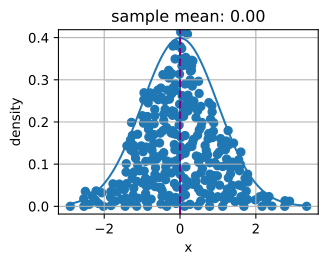

# Thống Kê
<a id="sec_statistics"></a>

Không nghi ngờ gì, để trở thành một người thực hành deep learning hàng đầu, khả năng huấn luyện các mô hình hiện đại và có độ chính xác cao là rất quan trọng. Tuy nhiên, thường không rõ khi nào các cải thiện là có ý nghĩa, hay chỉ là kết quả của những dao động ngẫu nhiên trong quá trình huấn luyện. Để có thể thảo luận về độ bất định trong các giá trị ước lượng, ta phải học một số thống kê.


Tham chiếu sớm nhất về *thống kê* có thể truy ngược về học giả Ả Rập Al-Kindi vào thế kỷ thứ $9^{\textrm{th}}$, người đã đưa ra mô tả chi tiết về cách dùng thống kê và phân tích tần suất để giải mã các thông điệp được mã hóa. Sau 800 năm, thống kê hiện đại xuất hiện từ Đức vào những năm 1700, khi các nhà nghiên cứu tập trung vào việc thu thập và phân tích dữ liệu nhân khẩu học và kinh tế. Ngày nay, thống kê là ngành khoa học liên quan đến việc thu thập, xử lý, phân tích, diễn giải và trực quan hóa dữ liệu. Hơn nữa, lý thuyết cốt lõi của thống kê đã được sử dụng rộng rãi trong nghiên cứu ở học thuật, công nghiệp và chính phủ.


Cụ thể hơn, thống kê có thể được chia thành *thống kê mô tả* và *suy luận thống kê*. Loại thứ nhất tập trung vào việc tóm tắt và minh họa các đặc điểm của một tập dữ liệu quan sát được, gọi là *mẫu*. Mẫu được rút ra từ một *tổng thể*, chỉ toàn bộ tập các cá thể, đối tượng hoặc sự kiện tương tự mà thí nghiệm của ta quan tâm. Trái với thống kê mô tả, *suy luận thống kê* tiếp tục suy ra các đặc trưng của một tổng thể từ các *mẫu* đã cho, dựa trên các giả định rằng phân phối mẫu có thể tái tạo phân phối tổng thể ở một mức độ nào đó.


Bạn có thể tự hỏi: "Sự khác biệt cốt yếu giữa machine learning và thống kê là gì?" Về cơ bản, thống kê tập trung vào bài toán suy luận. Loại bài toán này bao gồm mô hình hóa quan hệ giữa các biến, chẳng hạn suy luận nhân quả, và kiểm định ý nghĩa thống kê của các tham số mô hình, chẳng hạn kiểm thử A/B. Ngược lại, machine learning nhấn mạnh việc đưa ra dự đoán chính xác, mà không lập trình tường minh và hiểu chức năng của từng tham số.


Trong phần này, chúng ta sẽ giới thiệu ba loại phương pháp suy luận thống kê: đánh giá và so sánh các bộ ước lượng, thực hiện kiểm định giả thuyết, và xây dựng khoảng tin cậy. Các phương pháp này có thể giúp ta suy ra các đặc trưng của một tổng thể cho trước, tức tham số thật $\theta$. Để ngắn gọn, ta giả định rằng tham số thật $\theta$ của một tổng thể cho trước là một giá trị vô hướng. Việc mở rộng sang trường hợp $\theta$ là một vector hoặc tensor là trực tiếp, nên ta bỏ qua trong thảo luận.


## Đánh Giá Và So Sánh Các Bộ Ước Lượng

Trong thống kê, một *bộ ước lượng* là một hàm của các mẫu đã cho, dùng để ước lượng tham số thật $\theta$. Ta sẽ viết $\hat{\theta}_n = \hat{f}(x_1, \ldots, x_n)$ cho ước lượng của $\theta$ sau khi quan sát các mẫu {$x_1, x_2, \ldots, x_n$}.

Ta đã thấy các ví dụ đơn giản về bộ ước lượng trước đây trong phần [sec_maximum_likelihood](#sec_maximum_likelihood). Nếu bạn có một số mẫu từ một biến ngẫu nhiên Bernoulli, thì ước lượng hợp lý cực đại cho xác suất biến ngẫu nhiên bằng một có thể thu được bằng cách đếm số lượng giá trị một quan sát được và chia cho tổng số mẫu. Tương tự, một bài tập đã yêu cầu bạn chỉ ra rằng ước lượng hợp lý cực đại của trung bình Gaussian khi biết một số mẫu được cho bởi giá trị trung bình của tất cả các mẫu. Các bộ ước lượng này hầu như sẽ không bao giờ cho giá trị thật của tham số, nhưng lý tưởng là với số lượng mẫu lớn, ước lượng sẽ gần đúng.

Làm ví dụ, bên dưới ta hiển thị mật độ thật của một biến ngẫu nhiên Gaussian có trung bình không và phương sai một, cùng với một tập mẫu từ Gaussian đó. Ta dựng tọa độ $y$ sao cho mọi điểm đều nhìn thấy được và quan hệ với mật độ gốc rõ ràng hơn.

```python
#@tab mxnet
from d2l import mxnet as d2l
from mxnet import np, npx
import random
npx.set_np()

# Sample datapoints and create y coordinate
epsilon = 0.1
random.seed(8675309)
xs = np.random.normal(loc=0, scale=1, size=(300,))

ys = [np.sum(np.exp(-(xs[:i] - xs[i])**2 / (2 * epsilon**2))
             / np.sqrt(2*np.pi*epsilon**2)) / len(xs) for i in range(len(xs))]

# Compute true density
xd = np.arange(np.min(xs), np.max(xs), 0.01)
yd = np.exp(-xd**2/2) / np.sqrt(2 * np.pi)

# Plot the results
d2l.plot(xd, yd, 'x', 'density')
d2l.plt.scatter(xs, ys)
d2l.plt.axvline(x=0)
d2l.plt.axvline(x=np.mean(xs), linestyle='--', color='purple')
d2l.plt.title(f'sample mean: {float(np.mean(xs)):.2f}')
d2l.plt.show()
```




```python
#@tab pytorch
from d2l import torch as d2l
import torch

torch.pi = torch.acos(torch.zeros(1)) * 2  #define pi in torch

# Sample datapoints and create y coordinate
epsilon = 0.1
torch.manual_seed(8675309)
xs = torch.randn(size=(300,))

ys = torch.tensor(
    [torch.sum(torch.exp(-(xs[:i] - xs[i])**2 / (2 * epsilon**2))\
               / torch.sqrt(2*torch.pi*epsilon**2)) / len(xs)\
     for i in range(len(xs))])

# Compute true density
xd = torch.arange(torch.min(xs), torch.max(xs), 0.01)
yd = torch.exp(-xd**2/2) / torch.sqrt(2 * torch.pi)

# Plot the results
d2l.plot(xd, yd, 'x', 'density')
d2l.plt.scatter(xs, ys)
d2l.plt.axvline(x=0)
d2l.plt.axvline(x=torch.mean(xs), linestyle='--', color='purple')
d2l.plt.title(f'sample mean: {float(torch.mean(xs).item()):.2f}')
d2l.plt.show()
```

```python
#@tab tensorflow
from d2l import tensorflow as d2l
import tensorflow as tf

tf.pi = tf.acos(tf.zeros(1)) * 2  # define pi in TensorFlow

# Sample datapoints and create y coordinate
epsilon = 0.1
xs = tf.random.normal((300,))

ys = tf.constant(
    [(tf.reduce_sum(tf.exp(-(xs[:i] - xs[i])**2 / (2 * epsilon**2)) \
               / tf.sqrt(2*tf.pi*epsilon**2)) / tf.cast(
        tf.size(xs), dtype=tf.float32)).numpy() \
     for i in range(tf.size(xs))])

# Compute true density
xd = tf.range(tf.reduce_min(xs), tf.reduce_max(xs), 0.01)
yd = tf.exp(-xd**2/2) / tf.sqrt(2 * tf.pi)

# Plot the results
d2l.plot(xd, yd, 'x', 'density')
d2l.plt.scatter(xs, ys)
d2l.plt.axvline(x=0)
d2l.plt.axvline(x=tf.reduce_mean(xs), linestyle='--', color='purple')
d2l.plt.title(f'sample mean: {float(tf.reduce_mean(xs).numpy()):.2f}')
d2l.plt.show()
```

Có thể có nhiều cách để tính một bộ ước lượng tham số $\hat{\theta}_n$. Trong phần này, ta giới thiệu ba phương pháp phổ biến để đánh giá và so sánh các bộ ước lượng: sai số bình phương trung bình, độ lệch chuẩn và độ chệch thống kê.

### Sai Số Bình Phương Trung Bình

Có lẽ metric đơn giản nhất dùng để đánh giá bộ ước lượng là bộ ước lượng *sai số bình phương trung bình (MSE)* (hoặc mất mát $l_2$), được định nghĩa là

$$\textrm{MSE} (\hat{\theta}_n, \theta) = E[(\hat{\theta}_n - \theta)^2].$$

Điều này cho phép ta định lượng độ lệch bình phương trung bình so với giá trị thật. MSE luôn không âm. Nếu bạn đã đọc [sec_linear_regression](#sec_linear_regression), bạn sẽ nhận ra nó là hàm mất mát hồi quy được dùng phổ biến nhất. Với vai trò là một thước đo để đánh giá bộ ước lượng, giá trị càng gần không thì bộ ước lượng càng gần tham số thật $\theta$.


### Độ Chệch Thống Kê

MSE cung cấp một metric tự nhiên, nhưng ta dễ dàng hình dung nhiều hiện tượng khác nhau có thể làm nó lớn. Hai hiện tượng quan trọng về cơ bản là dao động trong bộ ước lượng do tính ngẫu nhiên của tập dữ liệu, và sai số có hệ thống trong bộ ước lượng do thủ tục ước lượng.


Trước hết, hãy đo sai số có hệ thống. Với một bộ ước lượng $\hat{\theta}_n$, minh họa toán học của *độ chệch thống kê* có thể được định nghĩa là

$$\textrm{bias}(\hat{\theta}_n) = E(\hat{\theta}_n - \theta) = E(\hat{\theta}_n) - \theta.$$

Lưu ý rằng khi $\textrm{bias}(\hat{\theta}_n) = 0$, kỳ vọng của bộ ước lượng $\hat{\theta}_n$ bằng giá trị thật của tham số. Trong trường hợp này, ta nói $\hat{\theta}_n$ là một bộ ước lượng không chệch. Nhìn chung, một bộ ước lượng không chệch tốt hơn một bộ ước lượng chệch vì kỳ vọng của nó giống tham số thật.


Tuy nhiên, đáng lưu ý rằng các bộ ước lượng chệch thường xuyên được dùng trong thực tế. Có những trường hợp bộ ước lượng không chệch không tồn tại nếu không có thêm giả định, hoặc không khả thi để tính. Điều này có thể có vẻ như một khiếm khuyết đáng kể của bộ ước lượng, tuy nhiên phần lớn các bộ ước lượng gặp trong thực tế ít nhất là không chệch tiệm cận, theo nghĩa độ chệch tiến về không khi số lượng mẫu sẵn có tiến đến vô hạn: $\lim_{n \rightarrow \infty} \textrm{bias}(\hat{\theta}_n) = 0$.


### Phương Sai Và Độ Lệch Chuẩn

Thứ hai, hãy đo tính ngẫu nhiên trong bộ ước lượng. Nhắc lại từ [sec_random_variables](#sec_random_variables), *độ lệch chuẩn* (hoặc *sai số chuẩn*) được định nghĩa là căn bậc hai của phương sai. Ta có thể đo mức độ dao động của một bộ ước lượng bằng cách đo độ lệch chuẩn hoặc phương sai của bộ ước lượng đó.

$$\sigma_{\hat{\theta}_n} = \sqrt{\textrm{Var} (\hat{\theta}_n )} = \sqrt{E[(\hat{\theta}_n - E(\hat{\theta}_n))^2]}.$$

Điều quan trọng là so sánh :eqref:`eq_var_est` với :eqref:`eq_mse_est`. Trong phương trình này, ta không so sánh với giá trị tổng thể thật $\theta$, mà so sánh với $E(\hat{\theta}_n)$, trung bình mẫu kỳ vọng. Do đó, ta không đo bộ ước lượng có xu hướng cách giá trị thật bao xa, mà đang đo dao động của chính bộ ước lượng.


### Đánh Đổi Độ Chệch-Phương Sai

Về mặt trực giác, rõ ràng hai thành phần chính này đóng góp vào sai số bình phương trung bình. Điều hơi đáng ngạc nhiên là ta có thể chứng minh rằng đây thực sự là một *phân rã* của sai số bình phương trung bình thành hai đóng góp này cộng với một đóng góp thứ ba. Nói cách khác, ta có thể viết sai số bình phương trung bình như tổng của bình phương độ chệch, phương sai và sai số bất khả quy.

$$
\begin{aligned}
\textrm{MSE} (\hat{\theta}_n, \theta) &= E[(\hat{\theta}_n - \theta)^2] \\
 &= E[(\hat{\theta}_n)^2] + E[\theta^2] - 2E[\hat{\theta}_n\theta] \\
 &= \textrm{Var} [\hat{\theta}_n] + E[\hat{\theta}_n]^2 + \textrm{Var} [\theta] + E[\theta]^2 - 2E[\hat{\theta}_n]E[\theta] \\
 &= (E[\hat{\theta}_n] - E[\theta])^2 + \textrm{Var} [\hat{\theta}_n] + \textrm{Var} [\theta] \\
 &= (E[\hat{\theta}_n - \theta])^2 + \textrm{Var} [\hat{\theta}_n] + \textrm{Var} [\theta] \\
 &= (\textrm{bias} [\hat{\theta}_n])^2 + \textrm{Var} (\hat{\theta}_n) + \textrm{Var} [\theta].\\
\end{aligned}
$$

Ta gọi công thức trên là *đánh đổi độ chệch-phương sai*. Sai số bình phương trung bình có thể được chia thành ba nguồn sai số: sai số từ độ chệch cao, sai số từ phương sai cao và sai số bất khả quy. Sai số độ chệch thường thấy ở một mô hình đơn giản (như mô hình hồi quy tuyến tính), vốn không thể trích xuất các quan hệ nhiều chiều giữa các đặc trưng và đầu ra. Nếu một mô hình chịu sai số độ chệch cao, ta thường nói nó bị *dưới khớp* hoặc thiếu *tính linh hoạt* như đã giới thiệu trong ([sec_generalization_basics](#sec_generalization_basics)). Phương sai cao thường là kết quả của một mô hình quá phức tạp, quá khớp dữ liệu huấn luyện. Do đó, một mô hình *quá khớp* nhạy với các dao động nhỏ trong dữ liệu. Nếu một mô hình chịu phương sai cao, ta thường nói nó bị *quá khớp* và thiếu *khả năng tổng quát hóa* như đã giới thiệu trong ([sec_generalization_basics](#sec_generalization_basics)). Sai số bất khả quy là kết quả của nhiễu trong chính $\theta$.


### Đánh Giá Bộ Ước Lượng Trong Code

Vì độ lệch chuẩn của một bộ ước lượng đã được cài đặt bằng cách gọi đơn giản `a.std()` cho một tensor `a`, ta sẽ bỏ qua nó nhưng cài đặt độ chệch thống kê và sai số bình phương trung bình.

```python
#@tab mxnet
# Statistical bias
def stat_bias(true_theta, est_theta):
    return(np.mean(est_theta) - true_theta)

# Mean squared error
def mse(data, true_theta):
    return(np.mean(np.square(data - true_theta)))
```

```python
#@tab pytorch
# Statistical bias
def stat_bias(true_theta, est_theta):
    return(torch.mean(est_theta) - true_theta)

# Mean squared error
def mse(data, true_theta):
    return(torch.mean(torch.square(data - true_theta)))
```

```python
#@tab tensorflow
# Statistical bias
def stat_bias(true_theta, est_theta):
    return(tf.reduce_mean(est_theta) - true_theta)

# Mean squared error
def mse(data, true_theta):
    return(tf.reduce_mean(tf.square(data - true_theta)))
```

Để minh họa phương trình đánh đổi độ chệch-phương sai, hãy mô phỏng phân phối chuẩn $\mathcal{N}(\theta, \sigma^2)$ với $10,000$ mẫu. Ở đây, ta dùng $\theta = 1$ và $\sigma = 4$. Vì bộ ước lượng là một hàm của các mẫu đã cho, ở đây ta dùng trung bình của các mẫu làm bộ ước lượng cho $\theta$ thật trong phân phối chuẩn $\mathcal{N}(\theta, \sigma^2)$ này.

```python
#@tab mxnet
theta_true = 1
sigma = 4
sample_len = 10000
samples = np.random.normal(theta_true, sigma, sample_len)
theta_est = np.mean(samples)
theta_est
```

```python
#@tab pytorch
theta_true = 1
sigma = 4
sample_len = 10000
samples = torch.normal(theta_true, sigma, size=(sample_len, 1))
theta_est = torch.mean(samples)
theta_est
```

```python
#@tab tensorflow
theta_true = 1
sigma = 4
sample_len = 10000
samples = tf.random.normal((sample_len, 1), theta_true, sigma)
theta_est = tf.reduce_mean(samples)
theta_est
```

Hãy xác thực phương trình đánh đổi bằng cách tính tổng của bình phương độ chệch và phương sai của bộ ước lượng. Trước hết, tính MSE của bộ ước lượng.

```python
#@tab all
mse(samples, theta_true)
```

Tiếp theo, ta tính $\textrm{Var} (\hat{\theta}_n) + [\textrm{bias} (\hat{\theta}_n)]^2$ như bên dưới. Như bạn có thể thấy, hai giá trị khớp đến độ chính xác số học.

```python
#@tab mxnet
bias = stat_bias(theta_true, theta_est)
np.square(samples.std()) + np.square(bias)
```

```python
#@tab pytorch
bias = stat_bias(theta_true, theta_est)
torch.square(samples.std(unbiased=False)) + torch.square(bias)
```

```python
#@tab tensorflow
bias = stat_bias(theta_true, theta_est)
tf.square(tf.math.reduce_std(samples)) + tf.square(bias)
```

## Thực Hiện Kiểm Định Giả Thuyết


Chủ đề thường gặp nhất trong suy luận thống kê là kiểm định giả thuyết. Dù kiểm định giả thuyết được phổ biến vào đầu thế kỷ $20^{th}$, lần sử dụng đầu tiên có thể truy ngược về John Arbuthnot vào những năm 1700. John theo dõi hồ sơ sinh trong 80 năm ở London và kết luận rằng mỗi năm nam giới được sinh ra nhiều hơn nữ giới. Tiếp theo đó, kiểm định ý nghĩa hiện đại là di sản trí tuệ của Karl Pearson, người phát minh ra $p$-value và kiểm định chi bình phương Pearson; William Gosset, cha đẻ của phân phối t Student; và Ronald Fisher, người khởi xướng giả thuyết không và kiểm định ý nghĩa.

Một *kiểm định giả thuyết* là một cách đánh giá một số bằng chứng chống lại phát biểu mặc định về một tổng thể. Ta gọi phát biểu mặc định là *giả thuyết không* $H_0$, thứ ta cố gắng bác bỏ bằng dữ liệu quan sát được. Ở đây, ta dùng $H_0$ làm điểm khởi đầu cho kiểm định ý nghĩa thống kê. *Giả thuyết đối* $H_A$ (hoặc $H_1$) là một phát biểu trái với giả thuyết không. Một giả thuyết không thường được nêu ở dạng khẳng định, đặt ra một quan hệ giữa các biến. Nó nên phản ánh ý tưởng một cách ngắn gọn và tường minh nhất có thể, và có thể kiểm định bằng lý thuyết thống kê.

Hãy tưởng tượng bạn là một nhà hóa học. Sau khi dành hàng nghìn giờ trong phòng thí nghiệm, bạn phát triển một loại thuốc mới có thể cải thiện đáng kể khả năng hiểu toán của con người. Để cho thấy sức mạnh kỳ diệu của nó, bạn cần kiểm tra nó. Tự nhiên, bạn có thể cần một số tình nguyện viên dùng thuốc và xem liệu nó có giúp họ học toán tốt hơn không. Bạn bắt đầu như thế nào?

Trước hết, bạn sẽ cần chọn ngẫu nhiên cẩn thận hai nhóm tình nguyện viên, sao cho không có khác biệt giữa khả năng hiểu toán của họ khi đo bằng một số metric. Hai nhóm này thường được gọi là nhóm kiểm tra và nhóm đối chứng. *Nhóm kiểm tra* (hoặc *nhóm điều trị*) là nhóm cá nhân sẽ trải nghiệm thuốc, trong khi *nhóm đối chứng* biểu diễn nhóm người dùng được đặt riêng làm mốc chuẩn, tức các thiết lập môi trường giống hệt ngoại trừ việc dùng thuốc này. Bằng cách này, ảnh hưởng của tất cả các biến được giảm thiểu, ngoại trừ tác động của biến độc lập trong điều trị.

Thứ hai, sau một khoảng thời gian dùng thuốc, bạn sẽ cần đo khả năng hiểu toán của hai nhóm bằng cùng các metric, chẳng hạn cho các tình nguyện viên làm cùng các bài kiểm tra sau khi học một công thức toán mới. Sau đó, bạn có thể thu thập kết quả của họ và so sánh. Trong trường hợp này, giả thuyết không của ta sẽ là không có khác biệt giữa hai nhóm, và giả thuyết đối sẽ là có khác biệt.

Điều này vẫn chưa hoàn toàn hình thức. Có nhiều chi tiết bạn phải suy nghĩ cẩn thận. Ví dụ, metric phù hợp để kiểm tra khả năng hiểu toán của họ là gì? Cần bao nhiêu tình nguyện viên cho kiểm tra để bạn có thể tự tin tuyên bố hiệu quả của thuốc? Bạn nên chạy kiểm tra trong bao lâu? Làm thế nào để quyết định liệu có khác biệt giữa hai nhóm? Bạn chỉ quan tâm đến hiệu năng trung bình, hay cả khoảng biến thiên của điểm số? Và còn nhiều điều khác.

Bằng cách này, kiểm định giả thuyết cung cấp một khuôn khổ cho thiết kế thí nghiệm và lập luận về độ chắc chắn trong các kết quả quan sát được. Nếu bây giờ ta có thể chỉ ra rằng giả thuyết không rất ít khả năng đúng, ta có thể tự tin bác bỏ nó.

Để hoàn thiện câu chuyện về cách làm việc với kiểm định giả thuyết, giờ ta cần giới thiệu một số thuật ngữ bổ sung và hình thức hóa một số khái niệm ở trên.


### Ý Nghĩa Thống Kê

*Ý nghĩa thống kê* đo xác suất bác bỏ nhầm giả thuyết không, $H_0$, khi nó không nên bị bác bỏ, tức là

$$ \textrm{statistical significance }= 1 - \alpha = 1 - P(\textrm{reject } H_0 \mid H_0 \textrm{ is true} ).$$

Điều này cũng được gọi là *lỗi loại I* hoặc *dương tính giả*. $\alpha$ được gọi là *mức ý nghĩa*, và giá trị thường dùng của nó là $5\%$, tức $1-\alpha = 95\%$. Mức ý nghĩa có thể được giải thích là mức rủi ro mà ta sẵn sàng chấp nhận khi bác bỏ một giả thuyết không đúng.

[fig_statistical_significance](#fig_statistical_significance) hiển thị các giá trị quan sát và xác suất của một phân phối chuẩn cho trước trong một kiểm định giả thuyết hai mẫu. Nếu ví dụ dữ liệu quan sát nằm ngoài ngưỡng $95\%$, nó sẽ là một quan sát rất ít khả năng xảy ra dưới giả định giả thuyết không. Do đó, có thể có điều gì đó sai với giả thuyết không và ta sẽ bác bỏ nó.


<a id="fig_statistical_significance"></a>


### Công Suất Thống Kê

*Công suất thống kê* (hoặc *độ nhạy*) đo xác suất bác bỏ giả thuyết không, $H_0$, khi nó nên bị bác bỏ, tức là

$$ \textrm{statistical power }= 1 - \beta = 1 - P(\textrm{ fail to reject } H_0  \mid H_0 \textrm{ is false} ).$$

Nhắc lại rằng *lỗi loại I* là lỗi gây ra bởi việc bác bỏ giả thuyết không khi nó đúng, trong khi *lỗi loại II* là kết quả của việc không bác bỏ giả thuyết không khi nó sai. Lỗi loại II thường được ký hiệu là $\beta$, và do đó công suất thống kê tương ứng là $1-\beta$.


Về trực giác, công suất thống kê có thể được diễn giải là khả năng kiểm định của ta phát hiện một khác biệt thực có độ lớn tối thiểu nào đó tại mức ý nghĩa thống kê mong muốn. $80\%$ là một ngưỡng công suất thống kê thường dùng. Công suất thống kê càng cao, ta càng có khả năng phát hiện các khác biệt thật.

Một trong những ứng dụng phổ biến nhất của công suất thống kê là xác định số mẫu cần thiết. Xác suất bạn bác bỏ giả thuyết không khi nó sai phụ thuộc vào mức độ sai của nó (được gọi là *kích thước hiệu ứng*) và số mẫu bạn có. Như bạn có thể kỳ vọng, kích thước hiệu ứng nhỏ sẽ yêu cầu số lượng mẫu rất lớn để có thể được phát hiện với xác suất cao. Dù việc suy ra chi tiết nằm ngoài phạm vi phụ lục ngắn này, làm ví dụ, nếu muốn có thể bác bỏ giả thuyết không rằng mẫu của ta đến từ một Gaussian trung bình không phương sai một, và ta tin rằng trung bình mẫu của mình thực ra gần một, ta có thể làm điều đó với tỷ lệ lỗi chấp nhận được chỉ với cỡ mẫu $8$. Tuy nhiên, nếu ta nghĩ trung bình thật của tổng thể mẫu gần $0.01$, thì ta cần cỡ mẫu gần $80000$ để phát hiện khác biệt.

Ta có thể hình dung công suất như một bộ lọc nước. Trong phép tương tự này, một kiểm định giả thuyết có công suất cao giống như một hệ thống lọc nước chất lượng cao, sẽ giảm các chất có hại trong nước nhiều nhất có thể. Mặt khác, một khác biệt nhỏ hơn giống như một bộ lọc nước chất lượng thấp, nơi một số chất tương đối nhỏ có thể dễ dàng thoát qua các khe hở. Tương tự, nếu công suất thống kê không đủ cao, thì kiểm định có thể không bắt được khác biệt nhỏ hơn.


### Thống Kê Kiểm Định

Một *thống kê kiểm định* $T(x)$ là một vô hướng tóm tắt một đặc trưng nào đó của dữ liệu mẫu. Mục tiêu của việc định nghĩa một thống kê như vậy là nó nên cho phép ta phân biệt giữa các phân phối khác nhau và thực hiện kiểm định giả thuyết. Nhìn lại ví dụ nhà hóa học của ta, nếu muốn chỉ ra rằng một tổng thể hoạt động tốt hơn tổng thể kia, việc lấy trung bình làm thống kê kiểm định có thể là hợp lý. Các lựa chọn thống kê kiểm định khác nhau có thể dẫn đến các kiểm định thống kê có công suất thống kê khác nhau đáng kể.

Thường thì $T(X)$ (phân phối của thống kê kiểm định dưới giả thuyết không của ta) sẽ tuân theo, ít nhất xấp xỉ, một phân phối xác suất phổ biến như phân phối chuẩn khi xét dưới giả thuyết không. Nếu ta có thể suy ra tường minh một phân phối như vậy, rồi đo thống kê kiểm định trên tập dữ liệu của mình, ta có thể bác bỏ giả thuyết không một cách an toàn nếu thống kê của ta nằm xa ngoài khoảng mà ta kỳ vọng. Việc định lượng điều này dẫn ta đến khái niệm $p$-value.


### $p$-value

$p$-value (hoặc *giá trị xác suất*) là xác suất để $T(X)$ cực đoan ít nhất như thống kê kiểm định quan sát được $T(x)$, với giả định rằng giả thuyết không là *đúng*, tức là

$$ p\textrm{-value} = P_{H_0}(T(X) \geq T(x)).$$

Nếu $p$-value nhỏ hơn hoặc bằng một mức ý nghĩa thống kê $\alpha$ được định trước và cố định, ta có thể bác bỏ giả thuyết không. Ngược lại, ta sẽ kết luận rằng ta thiếu bằng chứng để bác bỏ giả thuyết không. Với một phân phối tổng thể cho trước, *vùng bác bỏ* sẽ là khoảng chứa tất cả các điểm có $p$-value nhỏ hơn mức ý nghĩa thống kê $\alpha$.


### Kiểm Định Một Phía Và Kiểm Định Hai Phía

Thông thường có hai loại kiểm định ý nghĩa: kiểm định một phía và kiểm định hai phía. *Kiểm định một phía* (hoặc *kiểm định một đuôi*) áp dụng khi giả thuyết không và giả thuyết đối chỉ có một hướng. Ví dụ, giả thuyết không có thể phát biểu rằng tham số thật $\theta$ nhỏ hơn hoặc bằng một giá trị $c$. Giả thuyết đối sẽ là $\theta$ lớn hơn $c$. Tức là vùng bác bỏ chỉ nằm ở một phía của phân phối lấy mẫu. Trái với kiểm định một phía, *kiểm định hai phía* (hoặc *kiểm định hai đuôi*) áp dụng khi vùng bác bỏ nằm ở cả hai phía của phân phối lấy mẫu. Một ví dụ trong trường hợp này có thể có giả thuyết không phát biểu rằng tham số thật $\theta$ bằng một giá trị $c$. Giả thuyết đối sẽ là $\theta$ không bằng $c$.


### Các Bước Chung Của Kiểm Định Giả Thuyết

Sau khi đã quen với các khái niệm trên, hãy đi qua các bước chung của kiểm định giả thuyết.

1. Nêu câu hỏi và thiết lập giả thuyết không $H_0$.
2. Đặt mức ý nghĩa thống kê $\alpha$ và công suất thống kê ($1 - \beta$).
3. Thu thập mẫu thông qua thí nghiệm. Số mẫu cần thiết sẽ phụ thuộc vào công suất thống kê và kích thước hiệu ứng kỳ vọng.
4. Tính thống kê kiểm định và $p$-value.
5. Đưa ra quyết định giữ hay bác bỏ giả thuyết không dựa trên $p$-value và mức ý nghĩa thống kê $\alpha$.

Để thực hiện một kiểm định giả thuyết, ta bắt đầu bằng cách định nghĩa một giả thuyết không và một mức rủi ro mà ta sẵn sàng chấp nhận. Sau đó ta tính thống kê kiểm định của mẫu, xem một giá trị cực đoan của thống kê kiểm định là bằng chứng chống lại giả thuyết không. Nếu thống kê kiểm định rơi vào vùng bác bỏ, ta có thể bác bỏ giả thuyết không để ủng hộ giả thuyết đối.

Kiểm định giả thuyết có thể áp dụng trong nhiều kịch bản như thử nghiệm lâm sàng và kiểm thử A/B.


## Xây Dựng Khoảng Tin Cậy


Khi ước lượng giá trị của một tham số $\theta$, các bộ ước lượng điểm như $\hat \theta$ có ích hạn chế vì chúng không chứa khái niệm về độ bất định. Thay vào đó, sẽ tốt hơn nhiều nếu ta có thể tạo ra một khoảng chứa tham số thật $\theta$ với xác suất cao. Nếu bạn quan tâm đến những ý tưởng như vậy một thế kỷ trước, bạn hẳn sẽ hào hứng đọc "Outline of a Theory of Statistical Estimation Based on the Classical Theory of Probability" của Jerzy Neyman [Neyman.1937], người lần đầu giới thiệu khái niệm khoảng tin cậy vào năm 1937.

Để hữu ích, một khoảng tin cậy nên nhỏ nhất có thể với một mức chắc chắn cho trước. Hãy xem cách suy ra nó.


### Định Nghĩa

Về mặt toán học, một *khoảng tin cậy* cho tham số thật $\theta$ là một khoảng $C_n$ được tính từ dữ liệu mẫu sao cho

$$P_{\theta} (C_n \ni \theta) \geq 1 - \alpha, \forall \theta.$$

Ở đây $\alpha \in (0, 1)$, và $1 - \alpha$ được gọi là *mức tin cậy* hoặc *độ phủ* của khoảng. Đây là cùng $\alpha$ với mức ý nghĩa như ta đã thảo luận ở trên.

Lưu ý rằng :eqref:`eq_confidence` nói về biến $C_n$, không phải về $\theta$ cố định. Để nhấn mạnh điều này, ta viết $P_{\theta} (C_n \ni \theta)$ thay vì $P_{\theta} (\theta \in C_n)$.

### Diễn Giải

Rất dễ bị cám dỗ diễn giải một khoảng tin cậy $95\%$ là một khoảng mà bạn có thể chắc chắn $95\%$ rằng tham số thật nằm trong đó, tuy nhiên điều này đáng tiếc là không đúng. Tham số thật là cố định, còn khoảng mới là ngẫu nhiên. Vì vậy, một diễn giải tốt hơn là nói rằng nếu bạn tạo ra một số lượng lớn các khoảng tin cậy bằng thủ tục này, $95\%$ các khoảng được tạo ra sẽ chứa tham số thật.

Điều này có thể có vẻ câu nệ, nhưng nó có thể có hệ quả thực sự đối với việc diễn giải kết quả. Cụ thể, ta có thể thỏa mãn :eqref:`eq_confidence` bằng cách xây dựng các khoảng mà ta *gần như chắc chắn* không chứa giá trị thật, miễn là ta chỉ làm điều đó đủ hiếm. Ta kết thúc phần này bằng cách đưa ra ba phát biểu hấp dẫn nhưng sai. Một thảo luận sâu hơn về các điểm này có thể tìm thấy trong Morey.Hoekstra.Rouder.ea.2016.

* **Ngụy biện 1**. Khoảng tin cậy hẹp có nghĩa là ta có thể ước lượng tham số một cách chính xác.
* **Ngụy biện 2**. Các giá trị bên trong khoảng tin cậy có nhiều khả năng là giá trị thật hơn các giá trị bên ngoài khoảng.
* **Ngụy biện 3**. Xác suất để một khoảng tin cậy $95\%$ quan sát cụ thể chứa giá trị thật là $95\%$.

Có thể nói ngắn gọn rằng khoảng tin cậy là các đối tượng tinh tế. Tuy nhiên, nếu bạn giữ cách diễn giải rõ ràng, chúng có thể là công cụ mạnh mẽ.

### Một Ví Dụ Gaussian

Hãy thảo luận ví dụ cổ điển nhất, khoảng tin cậy cho trung bình của một Gaussian có trung bình và phương sai chưa biết. Giả sử ta thu thập $n$ mẫu $\{x_i\}_{i=1}^n$ từ Gaussian $\mathcal{N}(\mu, \sigma^2)$ của mình. Ta có thể tính các bộ ước lượng cho trung bình và phương sai bằng cách lấy

$$\hat\mu_n = \frac{1}{n}\sum_{i=1}^n x_i \;\textrm{and}\; \hat\sigma^2_n = \frac{1}{n-1}\sum_{i=1}^n (x_i - \hat\mu)^2.$$

Nếu bây giờ ta xét biến ngẫu nhiên

$$
T = \frac{\hat\mu_n - \mu}{\hat\sigma_n/\sqrt{n}},
$$

ta thu được một biến ngẫu nhiên tuân theo một phân phối nổi tiếng gọi là *phân phối t Student với* $n-1$ *bậc tự do*.

Phân phối này được nghiên cứu rất kỹ, và người ta biết, chẳng hạn, rằng khi $n\rightarrow \infty$, nó xấp xỉ một Gaussian chuẩn, và do đó bằng cách tra các giá trị của c.d.f. Gaussian trong bảng, ta có thể kết luận rằng giá trị của $T$ nằm trong khoảng $[-1.96, 1.96]$ ít nhất $95\%$ thời gian. Với các giá trị hữu hạn của $n$, khoảng cần lớn hơn đôi chút, nhưng các giá trị này đã được biết rõ và tính sẵn trong bảng.

Do đó, ta có thể kết luận rằng với $n$ lớn,

$$
P\left(\frac{\hat\mu_n - \mu}{\hat\sigma_n/\sqrt{n}} \in [-1.96, 1.96]\right) \ge 0.95.
$$

Sắp xếp lại điều này bằng cách nhân cả hai phía với $\hat\sigma_n/\sqrt{n}$ rồi cộng $\hat\mu_n$, ta thu được

$$
P\left(\mu \in \left[\hat\mu_n - 1.96\frac{\hat\sigma_n}{\sqrt{n}}, \hat\mu_n + 1.96\frac{\hat\sigma_n}{\sqrt{n}}\right]\right) \ge 0.95.
$$

Vì vậy ta biết rằng mình đã tìm được khoảng tin cậy $95\%$:
$$\left[\hat\mu_n - 1.96\frac{\hat\sigma_n}{\sqrt{n}}, \hat\mu_n + 1.96\frac{\hat\sigma_n}{\sqrt{n}}\right].$$

Có thể nói an toàn rằng :eqref:`eq_gauss_confidence` là một trong những công thức được dùng nhiều nhất trong thống kê. Hãy kết thúc thảo luận về thống kê bằng cách cài đặt nó. Để đơn giản, ta giả định mình đang ở chế độ tiệm cận. Các giá trị nhỏ của $N$ nên bao gồm giá trị đúng của `t_star` thu được hoặc bằng lập trình hoặc từ bảng $t$.

```python
#@tab mxnet
# Number of samples
N = 1000

# Sample dataset
samples = np.random.normal(loc=0, scale=1, size=(N,))

# Lookup Students's t-distribution c.d.f.
t_star = 1.96

# Construct interval
mu_hat = np.mean(samples)
sigma_hat = samples.std(ddof=1)
(mu_hat - t_star*sigma_hat/np.sqrt(N), mu_hat + t_star*sigma_hat/np.sqrt(N))
```

```python
#@tab pytorch
# PyTorch uses Bessel's correction by default, which means the use of ddof=1
# instead of default ddof=0 in numpy. We can use unbiased=False to imitate
# ddof=0.

# Number of samples
N = 1000

# Sample dataset
samples = torch.normal(0, 1, size=(N,))

# Lookup Students's t-distribution c.d.f.
t_star = 1.96

# Construct interval
mu_hat = torch.mean(samples)
sigma_hat = samples.std(unbiased=True)
(mu_hat - t_star*sigma_hat/torch.sqrt(torch.tensor(N, dtype=torch.float32)),\
 mu_hat + t_star*sigma_hat/torch.sqrt(torch.tensor(N, dtype=torch.float32)))
```

```python
#@tab tensorflow
# Number of samples
N = 1000

# Sample dataset
samples = tf.random.normal((N,), 0, 1)

# Lookup Students's t-distribution c.d.f.
t_star = 1.96

# Construct interval
mu_hat = tf.reduce_mean(samples)
sigma_hat = tf.math.reduce_std(samples)
(mu_hat - t_star*sigma_hat/tf.sqrt(tf.constant(N, dtype=tf.float32)), \
 mu_hat + t_star*sigma_hat/tf.sqrt(tf.constant(N, dtype=tf.float32)))
```

## Tóm Tắt

* Thống kê tập trung vào các bài toán suy luận, trong khi deep learning nhấn mạnh việc đưa ra dự đoán chính xác mà không lập trình và hiểu tường minh.
* Có ba phương pháp suy luận thống kê phổ biến: đánh giá và so sánh các bộ ước lượng, thực hiện kiểm định giả thuyết, và xây dựng khoảng tin cậy.
* Có ba bộ ước lượng phổ biến nhất: độ chệch thống kê, độ lệch chuẩn và sai số bình phương trung bình.
* Khoảng tin cậy là một khoảng ước lượng của tham số tổng thể thật mà ta có thể xây dựng từ các mẫu đã cho.
* Kiểm định giả thuyết là một cách đánh giá một số bằng chứng chống lại phát biểu mặc định về một tổng thể.


## Bài Tập

1. Cho $X_1, X_2, \ldots, X_n \overset{\textrm{iid}}{\sim} \textrm{Unif}(0, \theta)$, trong đó "iid" là viết tắt của *độc lập và phân phối giống nhau*. Xét các bộ ước lượng sau của $\theta$:
$$\hat{\theta} = \max \{X_1, X_2, \ldots, X_n \};$$
$$\tilde{\theta} = 2 \bar{X_n} = \frac{2}{n} \sum_{i=1}^n X_i.$$
    * Tìm độ chệch thống kê, độ lệch chuẩn và sai số bình phương trung bình của $\hat{\theta}.$
    * Tìm độ chệch thống kê, độ lệch chuẩn và sai số bình phương trung bình của $\tilde{\theta}.$
    * Bộ ước lượng nào tốt hơn?
1. Với ví dụ nhà hóa học trong phần giới thiệu, bạn có thể suy ra 5 bước để thực hiện kiểm định giả thuyết hai phía không? Cho mức ý nghĩa thống kê $\alpha = 0.05$ và công suất thống kê $1 - \beta = 0.8$.
1. Chạy code khoảng tin cậy với $N=2$ và $\alpha = 0.5$ cho $100$ tập dữ liệu được sinh độc lập, rồi vẽ các khoảng thu được (trong trường hợp này `t_star = 1.0`). Bạn sẽ thấy một số khoảng rất ngắn nhưng lại rất xa việc chứa trung bình thật $0$. Điều này có mâu thuẫn với cách diễn giải khoảng tin cậy không? Bạn có thấy thoải mái khi dùng các khoảng ngắn để chỉ các ước lượng có độ chính xác cao không?


[Thảo luận](https://discuss.d2l.ai/t/1102)
