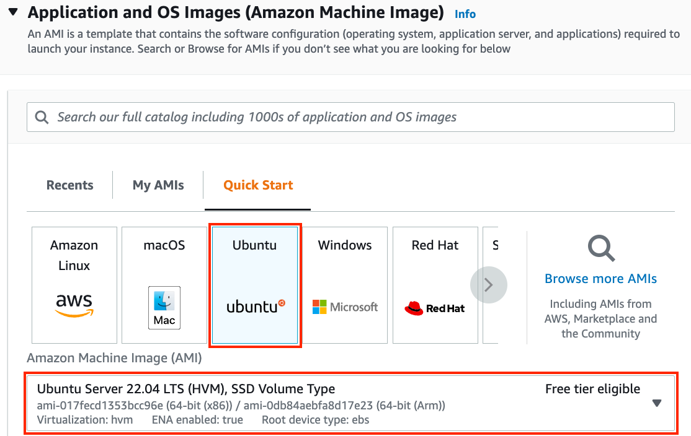
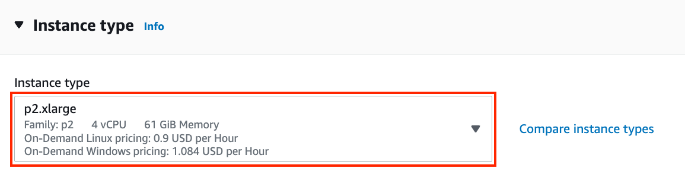
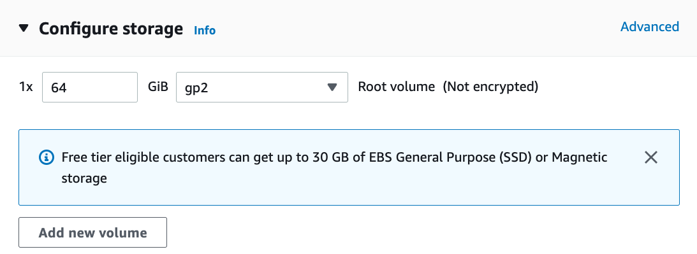
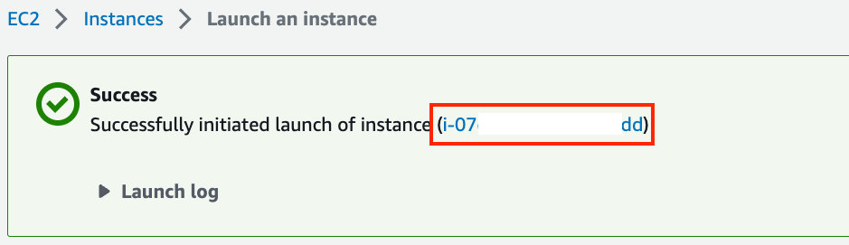
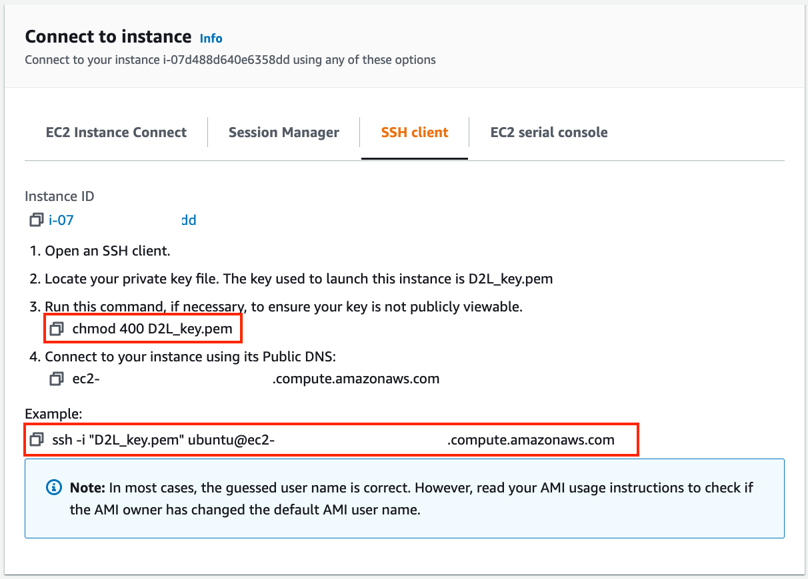
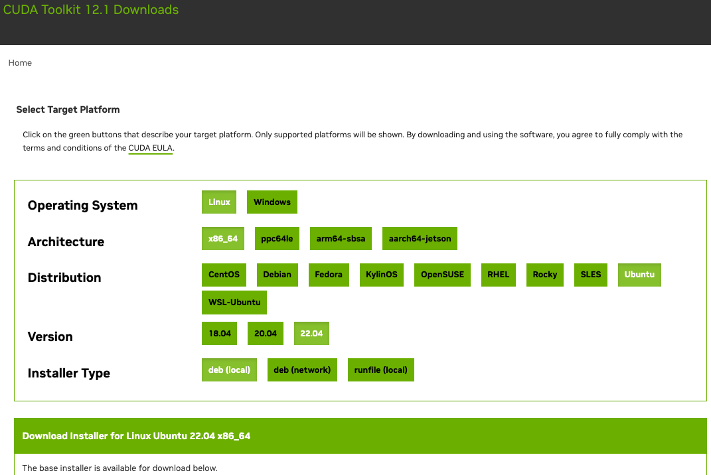
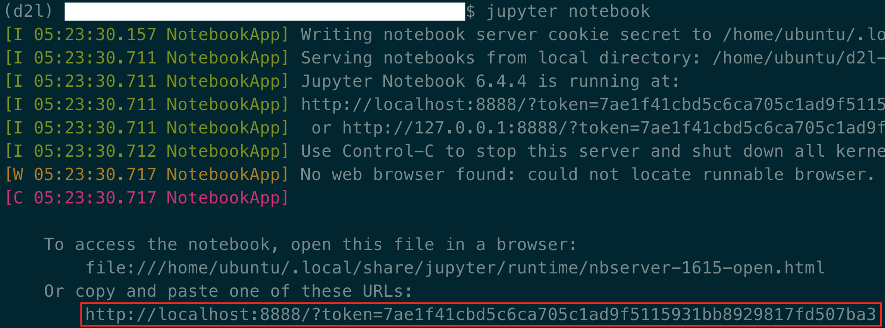

# Sử Dụng AWS EC2 Instances
<a id="sec_aws"></a>

Trong phần này, chúng tôi sẽ chỉ cho bạn cách cài đặt tất cả thư viện trên một máy Linux thô. Nhắc lại rằng trong [sec_sagemaker](#sec_sagemaker), chúng ta đã thảo luận cách sử dụng Amazon SageMaker, trong khi tự xây dựng một instance trên AWS sẽ ít tốn kém hơn. Hướng dẫn này bao gồm ba bước:

1. Yêu cầu một instance Linux có GPU từ AWS EC2.
1. Cài đặt CUDA (hoặc dùng Amazon Machine Image đã cài sẵn CUDA).
1. Cài đặt framework deep learning và các thư viện khác để chạy code của cuốn sách.

Quy trình này cũng áp dụng cho các instance khác (và các đám mây khác), dù có một số sửa đổi nhỏ. Trước khi tiếp tục, bạn cần tạo một tài khoản AWS; xem [sec_sagemaker](#sec_sagemaker) để biết thêm chi tiết.


## Tạo Và Chạy Một EC2 Instance

Sau khi đăng nhập vào tài khoản AWS, nhấp "EC2" ([fig_aws](#fig_aws)) để đi đến bảng EC2.


:width:`400px`
<a id="fig_aws"></a>

[fig_ec2](#fig_ec2) hiển thị bảng EC2.


:width:`700px`
<a id="fig_ec2"></a>

### Thiết Lập Trước Vị Trí
Chọn một trung tâm dữ liệu gần để giảm độ trễ, ví dụ "Oregon" (được đánh dấu bằng khung đỏ ở góc trên bên phải của [fig_ec2](#fig_ec2)). Nếu bạn ở Trung Quốc,
bạn có thể chọn một khu vực Châu Á Thái Bình Dương gần đó, chẳng hạn Seoul hoặc Tokyo. Xin lưu ý
rằng một số trung tâm dữ liệu có thể không có instance GPU.


### Tăng Giới Hạn

Trước khi chọn một instance, hãy kiểm tra xem có
hạn chế số lượng hay không bằng cách nhấp nhãn "Limits" trên thanh bên trái như minh họa trong
[fig_ec2](#fig_ec2).
[fig_limits](#fig_limits) hiển thị một ví dụ về
giới hạn như vậy. Tài khoản hiện không thể mở instance "p2.xlarge" theo khu vực. Nếu
bạn cần mở một hoặc nhiều instance, hãy nhấp vào liên kết "Request limit increase" để
đăng ký quota instance cao hơn.
Thông thường, cần một ngày làm việc để
xử lý một đơn đăng ký.


:width:`700px`
<a id="fig_limits"></a>


### Khởi Chạy Một Instance

Tiếp theo, nhấp nút "Launch Instance" được đánh dấu bằng khung đỏ trong [fig_ec2](#fig_ec2) để khởi chạy instance của bạn.

Ta bắt đầu bằng cách chọn một Amazon Machine Image (AMI) phù hợp. Chọn một instance Ubuntu ([fig_ubuntu](#fig_ubuntu)).



:width:`700px`
<a id="fig_ubuntu"></a>

EC2 cung cấp nhiều cấu hình instance khác nhau để lựa chọn. Điều này đôi khi có thể khiến người mới bắt đầu thấy choáng ngợp. [tab_ec2](#tab_ec2) liệt kê các máy phù hợp khác nhau.

:Các loại EC2 instance khác nhau
<a id="tab_ec2"></a>

| Name | GPU         | Notes                         |
|------|-------------|-------------------------------|
| g2   | Grid K520   | ancient                       |
| p2   | Kepler K80  | old but often cheap as spot   |
| g3   | Maxwell M60 | good trade-off                |
| p3   | Volta V100  | high performance for FP16     |
| p4   | Ampere A100 | high performance for large-scale training |
| g4   | Turing T4   | inference optimized FP16/INT8 |


Tất cả các máy chủ này có nhiều biến thể, cho biết số GPU được dùng. Ví dụ, p2.xlarge có 1 GPU còn p2.16xlarge có 16 GPU và nhiều bộ nhớ hơn. Để biết thêm chi tiết, xem [tài liệu AWS EC2](https://aws.amazon.com/ec2/instance-types/) hoặc một [trang tóm tắt](https://www.ec2instances.info). Để minh họa, p2.xlarge là đủ (được đánh dấu trong khung đỏ của [fig_p2x](#fig_p2x)).


:width:`700px`
<a id="fig_p2x"></a>

Lưu ý rằng bạn nên dùng một instance hỗ trợ GPU với driver phù hợp và framework deep learning hỗ trợ GPU. Nếu không, bạn sẽ không thấy lợi ích nào từ việc dùng GPU.

Ta tiếp tục chọn cặp khóa dùng để truy cập
instance. Nếu bạn chưa có cặp khóa, nhấp "Create new key pair" trong [fig_keypair](#fig_keypair) để tạo một cặp khóa. Sau đó,
bạn có thể chọn cặp khóa
đã tạo trước đó.
Hãy chắc chắn rằng bạn tải xuống cặp khóa và lưu nó ở một vị trí an toàn nếu bạn
tạo một cặp mới. Đây là cách duy nhất để bạn SSH vào máy chủ.


:width:`500px`
<a id="fig_keypair"></a>

Trong ví dụ này, ta sẽ giữ cấu hình mặc định cho "Network settings" (nhấp nút "Edit" để cấu hình các mục như subnet và security groups). Ta chỉ tăng kích thước ổ cứng mặc định lên 64 GB ([fig_disk](#fig_disk)). Lưu ý rằng chỉ riêng CUDA đã chiếm 4 GB.


:width:`700px`
<a id="fig_disk"></a>


Nhấp "Launch Instance" để khởi chạy
instance đã tạo. Nhấp vào
ID instance hiển thị trong [fig_launching](#fig_launching) để xem trạng thái của instance này.


:width:`700px`
<a id="fig_launching"></a>

### Kết Nối Đến Instance

Như minh họa trong [fig_connect](#fig_connect), sau khi trạng thái instance chuyển sang màu xanh, nhấp chuột phải vào instance và chọn `Connect` để xem phương thức truy cập instance.


:width:`700px`
<a id="fig_connect"></a>

Nếu đây là khóa mới, nó không được phép hiển thị công khai để SSH hoạt động. Đi đến thư mục nơi bạn lưu `D2L_key.pem` và
thực thi lệnh sau
để làm cho khóa không hiển thị công khai:

```bash
chmod 400 D2L_key.pem
```



:width:`400px`
<a id="fig_chmod"></a>


Bây giờ, sao chép lệnh SSH trong khung đỏ phía dưới của [fig_chmod](#fig_chmod) và dán vào dòng lệnh:

```bash
ssh -i "D2L_key.pem" ubuntu@ec2-xx-xxx-xxx-xxx.y.compute.amazonaws.com
```


Khi dòng lệnh hỏi "Are you sure you want to continue connecting (yes/no)", nhập "yes" và nhấn Enter để đăng nhập vào instance.

Máy chủ của bạn giờ đã sẵn sàng.


## Cài Đặt CUDA

Trước khi cài đặt CUDA, hãy chắc chắn cập nhật instance với các driver mới nhất.

```bash
sudo apt-get update && sudo apt-get install -y build-essential git libgfortran3
```


Ở đây ta tải CUDA 12.1. Truy cập [kho chính thức](https://developer.nvidia.com/cuda-toolkit-archive) của NVIDIA để tìm liên kết tải xuống như minh họa trong [fig_cuda](#fig_cuda).


:width:`500px`
<a id="fig_cuda"></a>

Sao chép hướng dẫn và dán chúng vào terminal để cài đặt CUDA 12.1.

```bash
# The link and file name are subject to changes
wget https://developer.download.nvidia.com/compute/cuda/repos/ubuntu2204/x86_64/cuda-ubuntu2204.pin
sudo mv cuda-ubuntu2204.pin /etc/apt/preferences.d/cuda-repository-pin-600
wget https://developer.download.nvidia.com/compute/cuda/12.1.0/local_installers/cuda-repo-ubuntu2204-12-1-local_12.1.0-530.30.02-1_amd64.deb
sudo dpkg -i cuda-repo-ubuntu2204-12-1-local_12.1.0-530.30.02-1_amd64.deb
sudo cp /var/cuda-repo-ubuntu2204-12-1-local/cuda-*-keyring.gpg /usr/share/keyrings/
sudo apt-get update
sudo apt-get -y install cuda
```


Sau khi cài đặt chương trình, chạy lệnh sau để xem GPU:

```bash
nvidia-smi
```


Cuối cùng, thêm CUDA vào đường dẫn thư viện để giúp các thư viện khác tìm thấy nó, chẳng hạn thêm các dòng sau vào cuối `~/.bashrc`.

```bash
export PATH="/usr/local/cuda-12.1/bin:$PATH"
export LD_LIBRARY_PATH=${LD_LIBRARY_PATH}:/usr/local/cuda-12.1/lib64
```


## Cài Đặt Thư Viện Để Chạy Code

Để chạy code của cuốn sách này,
chỉ cần làm theo các bước trong :ref:`chap_installation`
dành cho người dùng Linux trên EC2 instance
và dùng các mẹo sau
để làm việc trên một máy chủ Linux từ xa:

* Để tải script bash trên trang cài đặt Miniconda, nhấp chuột phải vào liên kết tải xuống và chọn "Copy Link Address", sau đó thực thi `wget [copied link address]`.
* Sau khi chạy `~/miniconda3/bin/conda init`, bạn có thể thực thi `source ~/.bashrc` thay vì đóng và mở lại shell hiện tại.


## Chạy Jupyter Notebook Từ Xa

Để chạy Jupyter Notebook từ xa, bạn cần dùng chuyển tiếp cổng SSH. Dù sao, máy chủ trên đám mây không có màn hình hay bàn phím. Để làm điều này, đăng nhập vào máy chủ từ desktop (hoặc laptop) của bạn như sau:

```
# This command must be run in the local command line
ssh -i "/path/to/key.pem" ubuntu@ec2-xx-xxx-xxx-xxx.y.compute.amazonaws.com -L 8889:localhost:8888
```


Tiếp theo, đi đến vị trí
của code cuốn sách đã tải xuống
trên EC2 instance,
rồi chạy:

```
conda activate d2l
jupyter notebook
```


[fig_jupyter](#fig_jupyter) hiển thị đầu ra có thể có sau khi bạn chạy Jupyter Notebook. Hàng cuối cùng là URL cho cổng 8888.


:width:`700px`
<a id="fig_jupyter"></a>

Vì bạn đã dùng chuyển tiếp cổng đến cổng 8889,
hãy sao chép hàng cuối trong khung đỏ của [fig_jupyter](#fig_jupyter),
thay "8888" bằng "8889" trong URL,
và mở nó trong trình duyệt cục bộ của bạn.


## Đóng Các Instance Không Dùng

Vì dịch vụ đám mây được tính phí theo thời gian sử dụng, bạn nên đóng các instance không được dùng. Lưu ý rằng có các lựa chọn thay thế:

* "Stopping" một instance nghĩa là bạn sẽ có thể khởi động lại nó. Điều này giống như tắt nguồn máy chủ thông thường của bạn. Tuy nhiên, các instance đã dừng vẫn sẽ bị tính một khoản nhỏ cho không gian ổ cứng được giữ lại.
* "Terminating" một instance sẽ xóa mọi dữ liệu liên quan đến nó. Điều này bao gồm ổ đĩa, nên bạn không thể khởi động lại nó. Chỉ làm điều này nếu bạn biết rằng mình sẽ không cần nó trong tương lai.

Nếu bạn muốn dùng instance làm mẫu cho nhiều instance khác,
nhấp chuột phải vào ví dụ trong [fig_connect](#fig_connect) và chọn "Image" $\rightarrow$
"Create" để tạo một image của instance. Khi việc này hoàn tất, chọn
"Instance State" $\rightarrow$ "Terminate" để terminate instance. Lần tiếp theo
bạn muốn dùng instance này, bạn có thể làm theo các bước trong phần này
để tạo một instance dựa trên
image đã lưu. Khác biệt duy nhất là trong "1. Choose AMI" hiển thị trong
[fig_ubuntu](#fig_ubuntu), bạn phải dùng tùy chọn "My AMIs" ở bên trái để chọn
image đã lưu. Instance được tạo sẽ giữ thông tin được lưu trên ổ cứng của image.
Ví dụ, bạn sẽ không phải cài đặt lại CUDA và các môi trường runtime khác.


## Tóm Tắt

* Ta có thể khởi chạy và dừng instance theo nhu cầu mà không cần mua và tự xây dựng máy tính.
* Ta cần cài đặt CUDA trước khi dùng framework deep learning hỗ trợ GPU.
* Ta có thể dùng chuyển tiếp cổng để chạy Jupyter Notebook trên máy chủ từ xa.


## Bài Tập

1. Đám mây mang lại sự tiện lợi, nhưng không rẻ. Tìm hiểu cách khởi chạy [spot instances](https://aws.amazon.com/ec2/spot/) để xem cách giảm chi phí.
1. Thử nghiệm với các máy chủ GPU khác nhau. Chúng nhanh đến mức nào?
1. Thử nghiệm với máy chủ nhiều GPU. Bạn có thể mở rộng tốt đến đâu?


[Thảo luận](https://discuss.d2l.ai/t/423)
