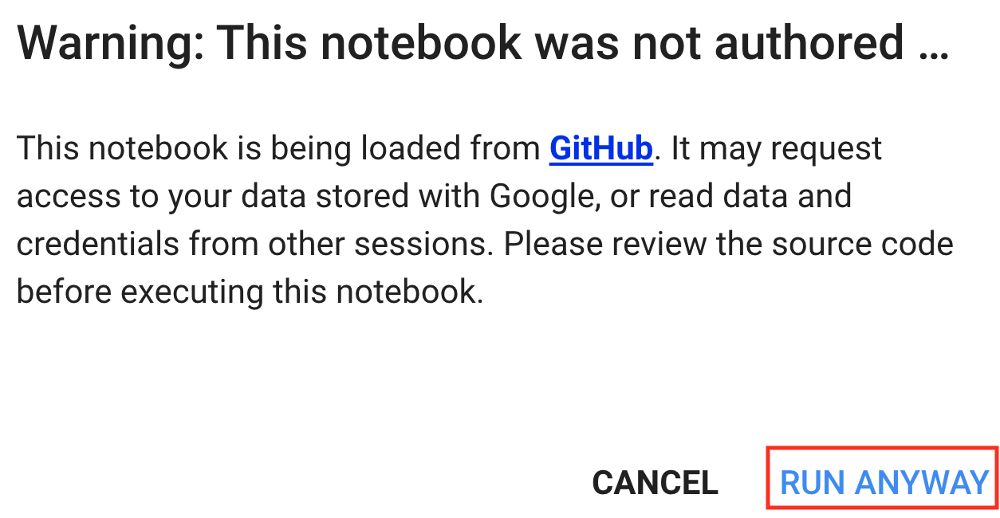

# Sử Dụng Google Colab

Chúng ta đã giới thiệu cách chạy cuốn sách này trên AWS trong [sec_sagemaker](#sec_sagemaker) và [sec_aws](#sec_aws). Một lựa chọn khác là chạy cuốn sách này trên [Google Colab](https://colab.research.google.com/)
nếu bạn có tài khoản Google.

Để chạy code của một phần trên Colab, chỉ cần nhấp vào nút `Colab` như minh họa trong [fig_colab](#fig_colab).

:width:`300px`

Nếu đây là lần đầu bạn chạy một ô code,
bạn sẽ nhận được một thông báo cảnh báo như minh họa trong [fig_colab2](#fig_colab2).
Chỉ cần nhấp "RUN ANYWAY" để bỏ qua.

:width:`300px`

Tiếp theo, Colab sẽ kết nối bạn với một instance để chạy code của phần này.
Cụ thể, nếu cần GPU,
Colab sẽ tự động được yêu cầu
kết nối đến một instance GPU.

## Tóm Tắt

* Bạn có thể dùng Google Colab để chạy code của từng phần trong cuốn sách này.
* Colab sẽ được yêu cầu kết nối đến một instance GPU nếu bất kỳ phần nào của cuốn sách này cần GPU.

## Bài Tập

1. Mở bất kỳ phần nào của cuốn sách này bằng Google Colab.
1. Chỉnh sửa và chạy bất kỳ phần nào cần GPU bằng Google Colab.

[Thảo luận](https://discuss.d2l.ai/t/424)
