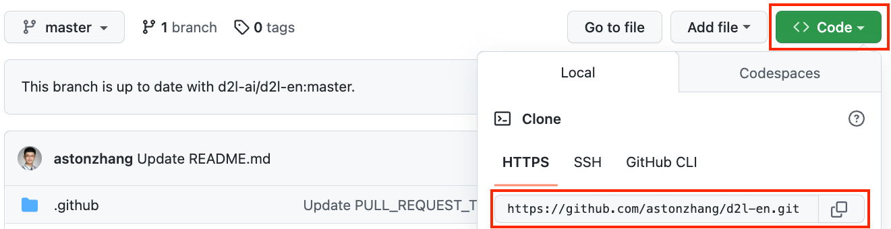
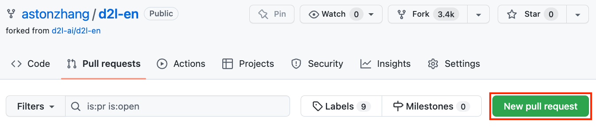
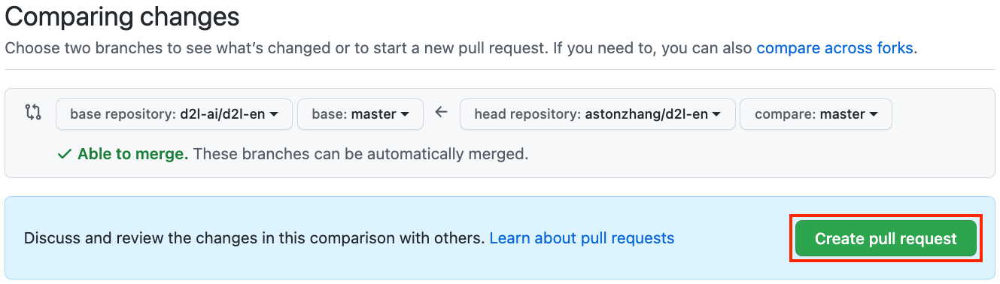

# Đóng Góp Cho Cuốn Sách Này
<a id="sec_how_to_contribute"></a>

Các đóng góp từ [độc giả](https://github.com/d2l-ai/d2l-en/graphs/contributors) giúp chúng tôi cải thiện cuốn sách này. Nếu bạn tìm thấy lỗi chính tả, một liên kết lỗi thời, điều gì đó mà bạn nghĩ chúng tôi đã bỏ sót trích dẫn, nơi code trông chưa thanh lịch hoặc nơi phần giải thích chưa rõ ràng, hãy đóng góp lại và giúp chúng tôi hỗ trợ độc giả tốt hơn. Trong khi với sách thông thường, độ trễ giữa các lần in (và do đó giữa các lần sửa lỗi chính tả) có thể được đo bằng năm, thì thường chỉ mất vài giờ đến vài ngày để tích hợp một cải thiện vào cuốn sách này. Tất cả điều này có thể thực hiện được nhờ quản lý phiên bản và kiểm thử tích hợp liên tục (CI). Để làm vậy, bạn cần gửi một [pull request](https://github.com/d2l-ai/d2l-en/pulls) đến kho GitHub. Khi pull request của bạn được các tác giả merge vào kho code, bạn sẽ trở thành một người đóng góp.

## Gửi Các Thay Đổi Nhỏ

Các đóng góp phổ biến nhất là chỉnh sửa một câu hoặc sửa lỗi chính tả. Chúng tôi khuyến nghị bạn tìm file nguồn trong [kho GitHub](https://github.com/d2l-ai/d2l-en) và chỉnh sửa file trực tiếp. Ví dụ, bạn có thể tìm file thông qua nút [Find file](https://github.com/d2l-ai/d2l-en/find/master) ([fig_edit_file](#fig_edit_file)) để định vị file nguồn (một file markdown). Sau đó bạn nhấp vào nút "Edit this file" ở góc trên bên phải để thực hiện thay đổi trong file markdown.


<a id="fig_edit_file"></a>

Sau khi hoàn tất, điền mô tả thay đổi của bạn trong bảng "Propose file change" ở cuối trang rồi nhấp nút "Propose file change". Thao tác này sẽ chuyển bạn đến một trang mới để review các thay đổi của bạn ([fig_git_createpr](#fig_git_createpr)). Nếu mọi thứ ổn, bạn có thể gửi một pull request bằng cách nhấp nút "Create pull request".

## Đề Xuất Các Thay Đổi Lớn

Nếu bạn dự định cập nhật một phần lớn văn bản hoặc code, thì bạn cần biết thêm một chút về định dạng mà cuốn sách này đang dùng. File nguồn dựa trên [định dạng markdown](https://daringfireball.net/projects/markdown/syntax) với một tập phần mở rộng thông qua gói [D2L-Book](http://book.d2l.ai/user/markdown.html), chẳng hạn như tham chiếu đến phương trình, ảnh, chương và trích dẫn. Bạn có thể dùng bất kỳ trình chỉnh sửa markdown nào để mở các file này và thực hiện thay đổi.

Nếu bạn muốn thay đổi code, chúng tôi khuyến nghị bạn dùng Jupyter Notebook để mở các file markdown này như mô tả trong [sec_jupyter](#sec_jupyter), để bạn có thể chạy và kiểm tra các thay đổi của mình. Hãy nhớ xóa tất cả đầu ra trước khi gửi thay đổi, vì hệ thống CI của chúng tôi sẽ thực thi các phần bạn đã cập nhật để sinh đầu ra.

Một số phần có thể hỗ trợ nhiều cài đặt framework.
Nếu bạn thêm một khối code mới, hãy dùng `%%tab` để đánh dấu khối này ở dòng bắt đầu. Ví dụ,
`%%tab pytorch` cho một khối code PyTorch, `%%tab tensorflow` cho một khối code TensorFlow, hoặc `%%tab all` cho một khối code dùng chung cho mọi cài đặt. Bạn có thể tham khảo gói `d2lbook` để biết thêm thông tin.

## Gửi Các Thay Đổi Lớn

Chúng tôi gợi ý bạn dùng quy trình Git tiêu chuẩn để gửi một thay đổi lớn. Tóm lại, quy trình hoạt động như mô tả trong [fig_contribute](#fig_contribute).


<a id="fig_contribute"></a>

Chúng tôi sẽ hướng dẫn bạn chi tiết từng bước. Nếu bạn đã quen với Git, bạn có thể bỏ qua phần này. Để cụ thể, ta giả định tên người dùng của người đóng góp là "astonzhang".

### Cài Đặt Git

Cuốn sách mã nguồn mở về Git mô tả [cách cài đặt Git](https://git-scm.com/book/en/v2). Việc này thường thực hiện qua `apt install git` trên Ubuntu Linux, bằng cách cài đặt công cụ phát triển Xcode trên macOS, hoặc bằng cách dùng [desktop client](https://desktop.github.com) của GitHub. Nếu bạn chưa có tài khoản GitHub, bạn cần đăng ký một tài khoản.

### Đăng Nhập GitHub

Nhập [địa chỉ](https://github.com/d2l-ai/d2l-en/) của kho code cuốn sách vào trình duyệt. Nhấp vào nút `Fork` trong khung đỏ ở góc trên bên phải của [fig_git_fork](#fig_git_fork), để tạo một bản sao của kho cuốn sách này. Đây giờ là *bản sao của bạn* và bạn có thể thay đổi nó theo bất kỳ cách nào mình muốn.


<a id="fig_git_fork"></a>


Bây giờ, kho code của cuốn sách này sẽ được fork (tức sao chép) sang tên người dùng của bạn, chẳng hạn `astonzhang/d2l-en` như hiển thị ở góc trên bên trái của [fig_git_forked](#fig_git_forked).


<a id="fig_git_forked"></a>

### Clone Kho

Để clone kho (tức tạo một bản sao cục bộ), ta cần lấy địa chỉ kho của nó. Nút màu xanh trong [fig_git_clone](#fig_git_clone) hiển thị địa chỉ này. Hãy chắc chắn rằng bản sao cục bộ của bạn được cập nhật với kho chính nếu bạn quyết định giữ fork này lâu hơn. Hiện tại, chỉ cần làm theo hướng dẫn trong :ref:`chap_installation` để bắt đầu. Khác biệt chính là bây giờ bạn đang tải xuống *fork của chính mình* của kho.


<a id="fig_git_clone"></a>

```
# Replace your_github_username with your GitHub username
git clone https://github.com/your_github_username/d2l-en.git
```


### Chỉnh Sửa Và Push

Bây giờ là lúc chỉnh sửa cuốn sách. Tốt nhất là chỉnh sửa nó trong Jupyter Notebook theo hướng dẫn trong [sec_jupyter](#sec_jupyter). Thực hiện các thay đổi và kiểm tra rằng chúng ổn. Giả sử ta đã sửa một lỗi chính tả trong file `~/d2l-en/chapter_appendix-tools-for-deep-learning/contributing.md`.
Sau đó bạn có thể kiểm tra những file nào mình đã thay đổi.

Tại thời điểm này, Git sẽ báo rằng file `chapter_appendix-tools-for-deep-learning/contributing.md` đã được sửa đổi.

```
mylaptop:d2l-en me$ git status
On branch master
Your branch is up-to-date with 'origin/master'.

Changes not staged for commit:
  (use "git add <file>..." to update what will be committed)
  (use "git checkout -- <file>..." to discard changes in working directory)

	modified:   chapter_appendix-tools-for-deep-learning/contributing.md
```


Sau khi xác nhận rằng đây là điều bạn muốn, hãy thực thi lệnh sau:

```
git add chapter_appendix-tools-for-deep-learning/contributing.md
git commit -m 'Fix a typo in git documentation'
git push
```


Code đã thay đổi khi đó sẽ nằm trong fork cá nhân của bạn của kho. Để yêu cầu thêm thay đổi của bạn, bạn phải tạo một pull request cho kho chính thức của cuốn sách.

### Gửi Pull Request

Như minh họa trong [fig_git_newpr](#fig_git_newpr), hãy vào fork của bạn của kho trên GitHub và chọn "New pull request". Thao tác này sẽ mở một màn hình hiển thị các thay đổi giữa chỉnh sửa của bạn và nội dung hiện tại trong kho chính của cuốn sách.


<a id="fig_git_newpr"></a>


Cuối cùng, gửi một pull request bằng cách nhấp nút như minh họa trong [fig_git_createpr](#fig_git_createpr). Hãy chắc chắn mô tả các thay đổi bạn đã thực hiện trong pull request.
Điều này sẽ giúp các tác giả review và merge nó vào cuốn sách dễ hơn. Tùy thuộc vào thay đổi, nó có thể được chấp nhận ngay, bị từ chối, hoặc nhiều khả năng hơn là bạn sẽ nhận được một số phản hồi về các thay đổi. Khi bạn đã tích hợp các phản hồi đó, mọi thứ đã sẵn sàng.


<a id="fig_git_createpr"></a>


## Tóm Tắt

* Bạn có thể dùng GitHub để đóng góp cho cuốn sách này.
* Bạn có thể chỉnh sửa trực tiếp file trên GitHub cho các thay đổi nhỏ.
* Với một thay đổi lớn, vui lòng fork kho, chỉnh sửa cục bộ, và chỉ đóng góp lại khi bạn đã sẵn sàng.
* Pull request là cách các đóng góp được gói lại. Cố gắng không gửi các pull request quá lớn vì điều này khiến chúng khó hiểu và khó tích hợp. Tốt hơn là gửi nhiều pull request nhỏ hơn.


## Bài Tập

1. Star và fork kho `d2l-ai/d2l-en`.
1. Nếu bạn phát hiện bất kỳ điều gì cần cải thiện (ví dụ, thiếu một tham chiếu), hãy gửi một pull request.
1. Thông thường, tạo pull request bằng một nhánh mới là thực hành tốt hơn. Học cách làm điều đó với [Git branching](https://git-scm.com/book/en/v2/Git-Branching-Branches-in-a-Nutshell).

[Thảo luận](https://discuss.d2l.ai/t/426)
