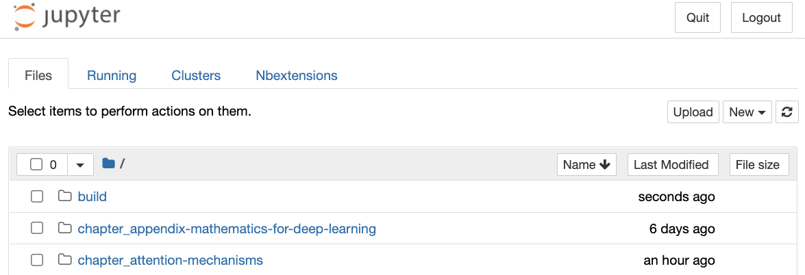
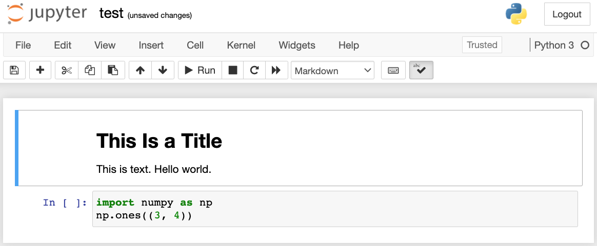
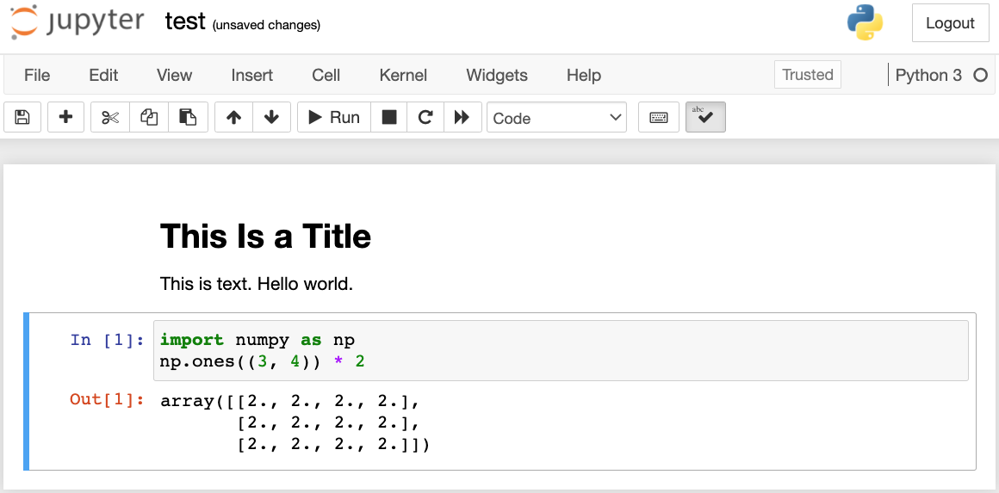

# Sử Dụng Jupyter Notebook
<a id="sec_jupyter"></a>


Phần này mô tả cách chỉnh sửa và chạy code
trong từng phần của cuốn sách này
bằng Jupyter Notebook. Hãy chắc chắn rằng bạn đã
cài đặt Jupyter và tải xuống
code như mô tả trong
:ref:`chap_installation`.
Nếu bạn muốn biết thêm về Jupyter, hãy xem hướng dẫn rất tốt trong
[tài liệu](https://jupyter.readthedocs.io/en/latest/) của họ.


## Chỉnh Sửa Và Chạy Code Cục Bộ

Giả sử đường dẫn cục bộ của code cuốn sách là `xx/yy/d2l-en/`. Dùng shell để chuyển thư mục đến đường dẫn này (`cd xx/yy/d2l-en`) và chạy lệnh `jupyter notebook`. Nếu trình duyệt của bạn không tự động làm điều này, hãy mở http://localhost:8888 và bạn sẽ thấy giao diện Jupyter cùng tất cả các thư mục chứa code của cuốn sách, như minh họa trong [fig_jupyter00](#fig_jupyter00).


<a id="fig_jupyter00"></a>


Bạn có thể truy cập các file notebook bằng cách nhấp vào thư mục hiển thị trên trang web.
Chúng thường có hậu tố ".ipynb".
Để ngắn gọn, ta tạo một file tạm thời "test.ipynb".
Nội dung hiển thị sau khi bạn nhấp vào nó được
minh họa trong [fig_jupyter01](#fig_jupyter01).
Notebook này bao gồm một ô markdown và một ô code. Nội dung trong ô markdown gồm "This Is a Title" và "This is text.".
Ô code chứa hai dòng code Python.


<a id="fig_jupyter01"></a>


Nhấp đúp vào ô markdown để vào chế độ chỉnh sửa.
Thêm một chuỗi văn bản mới "Hello world." vào cuối ô, như minh họa trong [fig_jupyter02](#fig_jupyter02).


<a id="fig_jupyter02"></a>


Như minh họa trong [fig_jupyter03](#fig_jupyter03),
nhấp "Cell" $\rightarrow$ "Run Cells" trên thanh menu để chạy ô đã chỉnh sửa.


<a id="fig_jupyter03"></a>

Sau khi chạy, ô markdown được hiển thị trong [fig_jupyter04](#fig_jupyter04).


<a id="fig_jupyter04"></a>


Tiếp theo, nhấp vào ô code. Nhân các phần tử với 2 sau dòng code cuối cùng, như minh họa trong [fig_jupyter05](#fig_jupyter05).


<a id="fig_jupyter05"></a>


Bạn cũng có thể chạy ô bằng phím tắt ("Ctrl + Enter" theo mặc định) và thu được kết quả đầu ra từ [fig_jupyter06](#fig_jupyter06).


<a id="fig_jupyter06"></a>


Khi một notebook chứa nhiều ô hơn, ta có thể nhấp "Kernel" $\rightarrow$ "Restart & Run All" trên thanh menu để chạy tất cả các ô trong toàn bộ notebook. Bằng cách nhấp "Help" $\rightarrow$ "Edit Keyboard Shortcuts" trên thanh menu, bạn có thể chỉnh sửa các phím tắt theo sở thích của mình.

## Tùy Chọn Nâng Cao

Ngoài việc chỉnh sửa cục bộ, hai điều khá quan trọng là: chỉnh sửa notebook ở định dạng markdown và chạy Jupyter từ xa.
Điều sau quan trọng khi ta muốn chạy code trên một máy chủ nhanh hơn.
Điều trước quan trọng vì định dạng ipynb gốc của Jupyter lưu rất nhiều dữ liệu phụ trợ không liên quan đến nội dung,
chủ yếu liên quan đến cách và nơi code được chạy.
Điều này gây khó hiểu cho Git, khiến việc
review các đóng góp trở nên rất khó.
May mắn là có một lựa chọn thay thế: chỉnh sửa gốc ở định dạng markdown.

### File Markdown Trong Jupyter

Nếu bạn muốn đóng góp vào nội dung của cuốn sách này, bạn cần sửa đổi
file nguồn (file md, không phải file ipynb) trên GitHub.
Bằng plugin notedown, ta
có thể chỉnh sửa notebook ở định dạng md trực tiếp trong Jupyter.


Trước hết, cài đặt plugin notedown, chạy Jupyter Notebook, và tải plugin:

```
pip install d2l-notedown  # You may need to uninstall the original notedown.
jupyter notebook --NotebookApp.contents_manager_class='notedown.NotedownContentsManager'
```


Bạn cũng có thể bật plugin notedown theo mặc định mỗi khi chạy Jupyter Notebook.
Trước hết, tạo file cấu hình Jupyter Notebook (nếu đã được tạo, bạn có thể bỏ qua bước này).

```
jupyter notebook --generate-config
```


Sau đó, thêm dòng sau vào cuối file cấu hình Jupyter Notebook (với Linux hoặc macOS, thường nằm ở đường dẫn `~/.jupyter/jupyter_notebook_config.py`):

```
c.NotebookApp.contents_manager_class = 'notedown.NotedownContentsManager'
```


Sau đó, bạn chỉ cần chạy lệnh `jupyter notebook` để bật plugin notedown theo mặc định.

### Chạy Jupyter Notebook Trên Máy Chủ Từ Xa

Đôi khi, bạn có thể muốn chạy Jupyter notebook trên một máy chủ từ xa và truy cập nó thông qua trình duyệt trên máy tính cục bộ của mình. Nếu Linux hoặc macOS được cài đặt trên máy cục bộ của bạn (Windows cũng có thể hỗ trợ chức năng này thông qua phần mềm bên thứ ba như PuTTY), bạn có thể dùng chuyển tiếp cổng:

```
ssh myserver -L 8888:localhost:8888
```


Chuỗi `myserver` ở trên là địa chỉ của máy chủ từ xa.
Sau đó ta có thể dùng http://localhost:8888 để truy cập máy chủ từ xa `myserver` đang chạy Jupyter notebook. Chúng ta sẽ trình bày chi tiết cách chạy Jupyter notebook trên các instance AWS
ở phần sau của phụ lục này.

### Đo Thời Gian

Ta có thể dùng plugin `ExecuteTime` để đo thời gian thực thi của từng ô code trong Jupyter notebook.
Dùng các lệnh sau để cài đặt plugin:

```
pip install jupyter_contrib_nbextensions
jupyter contrib nbextension install --user
jupyter nbextension enable execute_time/ExecuteTime
```


## Tóm Tắt

* Bằng công cụ Jupyter Notebook, ta có thể chỉnh sửa, chạy và đóng góp vào từng phần của cuốn sách.
* Ta có thể chạy Jupyter notebook trên máy chủ từ xa bằng chuyển tiếp cổng.


## Bài Tập

1. Chỉnh sửa và chạy code trong cuốn sách này bằng Jupyter Notebook trên máy cục bộ của bạn.
1. Chỉnh sửa và chạy code trong cuốn sách này bằng Jupyter Notebook *từ xa* thông qua chuyển tiếp cổng.
1. So sánh thời gian chạy của các phép toán $\mathbf{A}^\top \mathbf{B}$ và $\mathbf{A} \mathbf{B}$ với hai ma trận vuông trong $\mathbb{R}^{1024 \times 1024}$. Phép nào nhanh hơn?


[Thảo luận](https://discuss.d2l.ai/t/421)
