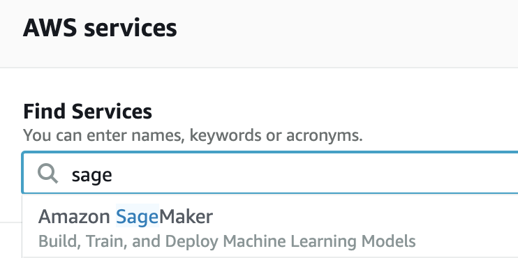

# Sử Dụng Amazon SageMaker
<a id="sec_sagemaker"></a>

Các ứng dụng deep learning
có thể đòi hỏi rất nhiều tài nguyên tính toán,
dễ dàng vượt quá
những gì máy cục bộ của bạn có thể cung cấp.
Các dịch vụ điện toán đám mây
cho phép bạn
chạy code dùng nhiều GPU của cuốn sách này
dễ dàng hơn
bằng các máy tính mạnh hơn.
Phần này sẽ giới thiệu
cách sử dụng Amazon SageMaker
để chạy code của cuốn sách này.

## Đăng Ký

Trước hết, ta cần đăng ký một tài khoản tại https://aws.amazon.com/.
Để tăng cường bảo mật,
khuyến khích sử dụng xác thực hai yếu tố.
Bạn cũng nên
thiết lập cảnh báo chi tiết về hóa đơn và chi tiêu để
tránh bất kỳ bất ngờ nào,
ví dụ,
khi quên dừng các instance đang chạy.
Sau khi đăng nhập vào tài khoản AWS,
hãy vào [console](http://console.aws.amazon.com/) của bạn và tìm "Amazon SageMaker" (xem [fig_sagemaker](#fig_sagemaker)),
rồi nhấp vào đó để mở bảng SageMaker.


:width:`300px`
<a id="fig_sagemaker"></a>

## Tạo Một Instance SageMaker

Tiếp theo, hãy tạo một notebook instance như mô tả trong [fig_sagemaker-create](#fig_sagemaker-create).


:width:`400px`
<a id="fig_sagemaker-create"></a>

SageMaker cung cấp nhiều [loại instance](https://aws.amazon.com/sagemaker/pricing/instance-types/) với sức mạnh tính toán và mức giá khác nhau.
Khi tạo một notebook instance,
ta có thể chỉ định tên và loại của nó.
Trong [fig_sagemaker-create-2](#fig_sagemaker-create-2), ta chọn `ml.p3.2xlarge`: với một GPU Tesla V100 và CPU 8 lõi, instance này đủ mạnh cho hầu hết cuốn sách.


:width:`400px`
<a id="fig_sagemaker-create-2"></a>


Toàn bộ cuốn sách ở định dạng ipynb để chạy với SageMaker có sẵn tại https://github.com/d2l-ai/d2l-pytorch-sagemaker. Ta có thể chỉ định URL kho GitHub này ([fig_sagemaker-create-3](#fig_sagemaker-create-3)) để cho phép SageMaker clone nó khi tạo instance.


:width:`400px`
<a id="fig_sagemaker-create-3"></a>

## Chạy Và Dừng Một Instance

Việc tạo một instance
có thể mất vài phút.
Khi nó đã sẵn sàng,
hãy nhấp vào liên kết "Open Jupyter" bên cạnh nó ([fig_sagemaker-open](#fig_sagemaker-open)) để bạn có thể
chỉnh sửa và chạy tất cả các Jupyter notebook
của cuốn sách này trên instance này
(tương tự các bước trong [sec_jupyter](#sec_jupyter)).


:width:`400px`
<a id="fig_sagemaker-open"></a>


Sau khi hoàn thành công việc,
đừng quên dừng instance để tránh
bị tính thêm phí ([fig_sagemaker-stop](#fig_sagemaker-stop)).


:width:`300px`
<a id="fig_sagemaker-stop"></a>

## Cập Nhật Notebook


Các notebook của cuốn sách mã nguồn mở này sẽ được cập nhật thường xuyên trong kho [d2l-ai/d2l-pytorch-sagemaker](https://github.com/d2l-ai/d2l-pytorch-sagemaker)
trên GitHub.
Để cập nhật lên phiên bản mới nhất,
bạn có thể mở một terminal trên instance SageMaker ([fig_sagemaker-terminal](#fig_sagemaker-terminal)).


:width:`300px`
<a id="fig_sagemaker-terminal"></a>

Bạn có thể muốn commit các thay đổi cục bộ trước khi kéo cập nhật từ kho từ xa.
Nếu không, chỉ cần loại bỏ mọi thay đổi cục bộ của bạn
bằng các lệnh sau trong terminal:


```bash
cd SageMaker/d2l-pytorch-sagemaker/
git reset --hard
git pull
```


## Tóm Tắt

* Ta có thể tạo một notebook instance bằng Amazon SageMaker để chạy code dùng nhiều GPU của cuốn sách này.
* Ta có thể cập nhật notebook thông qua terminal trên instance Amazon SageMaker.


## Bài Tập


1. Chỉnh sửa và chạy bất kỳ phần nào cần GPU bằng Amazon SageMaker.
1. Mở một terminal để truy cập thư mục cục bộ lưu trữ tất cả các notebook của cuốn sách này.


[Thảo luận](https://discuss.d2l.ai/t/422)
