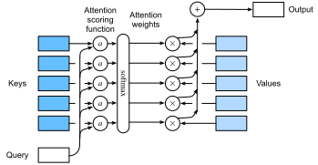

# Các Hàm Tính Điểm Attention
<a id="sec_attention-scoring-functions"></a>


Trong [sec_attention-pooling](#sec_attention-pooling),
chúng ta đã sử dụng một số kernel dựa trên khoảng cách khác nhau, bao gồm kernel Gaussian để mô hình hóa
các tương tác giữa các truy vấn và khóa. Hóa ra là các hàm khoảng cách tốn kém tính toán hơn một chút so với tích vô hướng. Do đó,
với phép toán softmax để đảm bảo các trọng số attention không âm,
phần lớn công việc đã đi vào các *hàm tính điểm attention* $a$ trong :eqref:`eq_softmax_attention` và [fig_attention_output](#fig_attention_output) đơn giản hơn để tính toán.


<a id="fig_attention_output"></a>


```python
from d2l import torch as d2l
import math
import torch
from torch import nn
```


## [**Attention Tích Vô Hướng**]


Hãy xem lại hàm attention (không có hàm mũ) từ kernel Gaussian trong một khoảnh khắc:

$$
a(\mathbf{q}, \mathbf{k}_i) = -\frac{1}{2} \|\mathbf{q} - \mathbf{k}_i\|^2  = \mathbf{q}^\top \mathbf{k}_i -\frac{1}{2} \|\mathbf{k}_i\|^2  -\frac{1}{2} \|\mathbf{q}\|^2.
$$

Đầu tiên, lưu ý rằng số hạng cuối cùng chỉ phụ thuộc vào $\mathbf{q}$. Do đó nó giống nhau cho tất cả các cặp $(\mathbf{q}, \mathbf{k}_i)$. Việc chuẩn hóa các trọng số attention về $1$, như được thực hiện trong :eqref:`eq_softmax_attention`, đảm bảo rằng số hạng này biến mất hoàn toàn. Thứ hai, lưu ý rằng cả chuẩn hóa batch và chuẩn hóa lớp (sẽ được thảo luận sau) đều dẫn đến các kích hoạt có chuẩn $\|\mathbf{k}_i\|$ được giới hạn tốt, và thường là hằng số. Đây là trường hợp, chẳng hạn, khi các khóa $\mathbf{k}_i$ được tạo ra bởi chuẩn hóa lớp. Do đó, chúng ta có thể bỏ nó khỏi định nghĩa của $a$ mà không có thay đổi lớn nào trong kết quả.

Cuối cùng, chúng ta cần giữ bậc độ lớn của các đối số trong hàm mũ dưới tầm kiểm soát. Giả sử rằng tất cả các phần tử của truy vấn $\mathbf{q} \in \mathbb{R}^d$ và khóa $\mathbf{k}_i \in \mathbb{R}^d$ là các biến ngẫu nhiên độc lập và có phân phối đồng nhất với trung bình không và phương sai đơn vị. Tích vô hướng giữa hai vector có trung bình không và phương sai $d$. Để đảm bảo rằng phương sai của tích vô hướng vẫn là $1$ bất kể độ dài vector, chúng ta sử dụng hàm tính điểm *scaled dot product attention*. Tức là, chúng ta tỷ lệ lại tích vô hướng bằng $1/\sqrt{d}$. Do đó chúng ta đến hàm attention được sử dụng phổ biến đầu tiên, ví dụ trong Transformer [Vaswani.Shazeer.Parmar.ea.2017]:

$$ a(\mathbf{q}, \mathbf{k}_i) = \mathbf{q}^\top \mathbf{k}_i / \sqrt{d}.$$

Lưu ý rằng các trọng số attention $\alpha$ vẫn cần chuẩn hóa. Chúng ta có thể đơn giản hóa thêm thông qua :eqref:`eq_softmax_attention` bằng cách sử dụng phép toán softmax:

$$\alpha(\mathbf{q}, \mathbf{k}_i) = \mathrm{softmax}(a(\mathbf{q}, \mathbf{k}_i)) = \frac{\exp(\mathbf{q}^\top \mathbf{k}_i / \sqrt{d})}{\sum_{j=1} \exp(\mathbf{q}^\top \mathbf{k}_j / \sqrt{d})}.$$

Hóa ra là tất cả các cơ chế attention phổ biến đều sử dụng softmax, do đó chúng ta sẽ giới hạn bản thân vào điều đó trong phần còn lại của chương này.

## Các Hàm Tiện Ích

Chúng ta cần một vài hàm để làm cho cơ chế attention hiệu quả khi triển khai. Điều này bao gồm các công cụ để xử lý các chuỗi có độ dài thay đổi (phổ biến cho xử lý ngôn ngữ tự nhiên) và các công cụ để đánh giá hiệu quả trên các minibatch (nhân ma trận theo lô).


### [**Phép Toán Masked Softmax**]

Một trong những ứng dụng phổ biến nhất của cơ chế attention là cho các mô hình chuỗi. Do đó chúng ta cần có khả năng xử lý các chuỗi có độ dài khác nhau. Trong một số trường hợp, các chuỗi như vậy có thể kết thúc trong cùng một minibatch, đòi hỏi phải đệm bằng các token giả cho các chuỗi ngắn hơn (xem [sec_machine_translation](#sec_machine_translation) để biết ví dụ). Các token đặc biệt này không mang ý nghĩa. Ví dụ, giả sử rằng chúng ta có ba câu sau:

```
Dive  into  Deep    Learning 
Learn to    code    <blank>
Hello world <blank> <blank>
```


Vì chúng ta không muốn các khoảng trống trong mô hình attention của mình, chúng ta chỉ cần giới hạn $\sum_{i=1}^n \alpha(\mathbf{q}, \mathbf{k}_i) \mathbf{v}_i$ thành $\sum_{i=1}^l \alpha(\mathbf{q}, \mathbf{k}_i) \mathbf{v}_i$ cho dù dài, $l \leq n$, câu thực sự là bao nhiêu. Vì đây là vấn đề phổ biến như vậy, nó có tên: *phép toán masked softmax*.

Hãy lập trình nó. Thực ra, lập trình này gian lận đôi chút bằng cách đặt các giá trị của $\mathbf{v}_i$, cho $i > l$, về không. Hơn nữa, nó đặt các trọng số attention thành một số âm rất lớn, chẳng hạn như $-10^{6}$, để làm cho đóng góp của chúng cho gradient và giá trị biến mất trong thực tế. Điều này được thực hiện vì các kernel và toán tử đại số tuyến tính được tối ưu hóa nhiều cho GPU và sẽ nhanh hơn nếu hơi lãng phí trong tính toán thay vì có mã với các câu lệnh có điều kiện (if then else).


```python
def masked_softmax(X, valid_lens):  
    """Perform softmax operation by masking elements on the last axis."""
    # X: 3D tensor, valid_lens: 1D or 2D tensor 
    def _sequence_mask(X, valid_len, value=0):
        maxlen = X.size(1)
        mask = torch.arange((maxlen), dtype=torch.float32,
                            device=X.device)[None, :] < valid_len[:, None]
        X[~mask] = value
        return X
    
    if valid_lens is None:
        return nn.functional.softmax(X, dim=-1)
    else:
        shape = X.shape
        if valid_lens.dim() == 1:
            valid_lens = torch.repeat_interleave(valid_lens, shape[1])
        else:
            valid_lens = valid_lens.reshape(-1)
        # On the last axis, replace masked elements with a very large negative
        # value, whose exponentiation outputs 0
        X = _sequence_mask(X.reshape(-1, shape[-1]), valid_lens, value=-1e6)
        return nn.functional.softmax(X.reshape(shape), dim=-1)
```


Để [**minh họa hàm này hoạt động như thế nào**],
xét một minibatch gồm hai ví dụ có kích thước $2 \times 4$,
trong đó độ dài hợp lệ của chúng lần lượt là $2$ và $3$.
Kết quả của phép toán masked softmax,
các giá trị vượt quá độ dài hợp lệ cho mỗi cặp vector đều bị che giấu bằng không.


```python
masked_softmax(torch.rand(2, 2, 4), torch.tensor([2, 3]))
```


Nếu chúng ta cần kiểm soát chi tiết hơn để chỉ định độ dài hợp lệ cho mỗi trong hai vector của mỗi ví dụ, chúng ta đơn giản sử dụng tensor hai chiều của độ dài hợp lệ. Điều này cho ra:


```python
masked_softmax(torch.rand(2, 2, 4), d2l.tensor([[1, 3], [2, 4]]))
```


### Nhân Ma Trận Theo Lô
<a id="subsec_batch_dot"></a>

Một phép toán thường được sử dụng khác là nhân các lô ma trận với nhau. Điều này hữu ích khi chúng ta có các minibatch của truy vấn, khóa và giá trị. Cụ thể hơn, giả sử rằng

$$\mathbf{Q} = [\mathbf{Q}_1, \mathbf{Q}_2, \ldots, \mathbf{Q}_n]  \in \mathbb{R}^{n \times a \times b}, \\
    \mathbf{K} = [\mathbf{K}_1, \mathbf{K}_2, \ldots, \mathbf{K}_n]  \in \mathbb{R}^{n \times b \times c}.
$$

Sau đó nhân ma trận theo lô (BMM) tính tích theo phần tử

$$\textrm{BMM}(\mathbf{Q}, \mathbf{K}) = [\mathbf{Q}_1 \mathbf{K}_1, \mathbf{Q}_2 \mathbf{K}_2, \ldots, \mathbf{Q}_n \mathbf{K}_n] \in \mathbb{R}^{n \times a \times c}.$$

Hãy xem điều này hoạt động trong một framework deep learning.


```python
Q = d2l.ones((2, 3, 4))
K = d2l.ones((2, 4, 6))
d2l.check_shape(torch.bmm(Q, K), (2, 3, 6))
```


## [**Scaled Dot Product Attention**]

Hãy quay lại attention tích vô hướng được giới thiệu trong :eqref:`eq_dot_product_attention`.
Nói chung, nó yêu cầu cả truy vấn và khóa
có cùng độ dài vector, chẳng hạn $d$, mặc dù điều này có thể được giải quyết dễ dàng bằng cách thay thế
$\mathbf{q}^\top \mathbf{k}$ bằng $\mathbf{q}^\top \mathbf{M} \mathbf{k}$ trong đó $\mathbf{M}$ là ma trận được chọn phù hợp để chuyển đổi giữa hai không gian. Hiện tại giả sử rằng các chiều khớp nhau.

Trong thực tế, chúng ta thường nghĩ về các minibatch để hiệu quả,
chẳng hạn như tính toán attention cho $n$ truy vấn và $m$ cặp khóa-giá trị,
trong đó truy vấn và khóa có độ dài $d$
và giá trị có độ dài $v$. Scaled dot product attention
của các truy vấn $\mathbf Q\in\mathbb R^{n\times d}$,
các khóa $\mathbf K\in\mathbb R^{m\times d}$,
và các giá trị $\mathbf V\in\mathbb R^{m\times v}$
do đó có thể được viết là

$$ \mathrm{softmax}\left(\frac{\mathbf Q \mathbf K^\top }{\sqrt{d}}\right) \mathbf V \in \mathbb{R}^{n\times v}.$$

Lưu ý rằng khi áp dụng điều này cho một minibatch, chúng ta cần nhân ma trận theo lô được giới thiệu trong :eqref:`eq_batch-matrix-mul`. Trong lập trình sau của scaled dot product attention,
chúng ta sử dụng dropout để chuẩn hóa mô hình.


```python
class DotProductAttention(nn.Module):  
    """Scaled dot product attention."""
    def __init__(self, dropout):
        super().__init__()
        self.dropout = nn.Dropout(dropout)

    # Shape of queries: (batch_size, no. of queries, d)
    # Shape of keys: (batch_size, no. of key-value pairs, d)
    # Shape of values: (batch_size, no. of key-value pairs, value dimension)
    # Shape of valid_lens: (batch_size,) or (batch_size, no. of queries)
    def forward(self, queries, keys, values, valid_lens=None):
        d = queries.shape[-1]
        # Swap the last two dimensions of keys with keys.transpose(1, 2)
        scores = torch.bmm(queries, keys.transpose(1, 2)) / math.sqrt(d)
        self.attention_weights = masked_softmax(scores, valid_lens)
        return torch.bmm(self.dropout(self.attention_weights), values)
```


Để [**minh họa lớp `DotProductAttention` hoạt động như thế nào**],
chúng ta sử dụng cùng các khóa, giá trị và độ dài hợp lệ từ ví dụ đồ chơi trước cho additive attention. Với mục đích của ví dụ của chúng ta, chúng ta giả sử rằng chúng ta có kích thước minibatch là $2$, tổng cộng $10$ khóa và giá trị, và chiều của các giá trị là $4$. Cuối cùng, chúng ta giả sử rằng độ dài hợp lệ mỗi quan sát lần lượt là $2$ và $6$. Với điều đó, chúng ta mong đợi đầu ra là tensor $2 \times 1 \times 4$, tức là một hàng mỗi ví dụ của minibatch.


```python
queries = d2l.normal(0, 1, (2, 1, 2))
keys = d2l.normal(0, 1, (2, 10, 2))
values = d2l.normal(0, 1, (2, 10, 4))
valid_lens = d2l.tensor([2, 6])

attention = DotProductAttention(dropout=0.5)
attention.eval()
d2l.check_shape(attention(queries, keys, values, valid_lens), (2, 1, 4))
```


Hãy kiểm tra xem các trọng số attention có thực sự biến mất cho bất cứ thứ gì vượt quá cột thứ hai và thứ sáu tương ứng không (vì đặt độ dài hợp lệ là $2$ và $6$).


## [**Additive Attention**]
<a id="subsec_additive-attention"></a>

Khi các truy vấn $\mathbf{q}$ và khóa $\mathbf{k}$ là các vector có chiều khác nhau,
chúng ta có thể sử dụng ma trận để giải quyết sự không khớp thông qua $\mathbf{q}^\top \mathbf{M} \mathbf{k}$, hoặc chúng ta có thể sử dụng additive attention
như hàm tính điểm. Một lợi ích khác là, như tên của nó cho thấy, attention là cộng tính. Điều này có thể dẫn đến một số tiết kiệm tính toán nhỏ.
Cho một truy vấn $\mathbf{q} \in \mathbb{R}^q$
và một khóa $\mathbf{k} \in \mathbb{R}^k$,
hàm tính điểm *additive attention* [Bahdanau.Cho.Bengio.2014] được cho bởi

$$a(\mathbf q, \mathbf k) = \mathbf w_v^\top \textrm{tanh}(\mathbf W_q\mathbf q + \mathbf W_k \mathbf k) \in \mathbb{R},$$

trong đó $\mathbf W_q\in\mathbb R^{h\times q}$, $\mathbf W_k\in\mathbb R^{h\times k}$,
và $\mathbf w_v\in\mathbb R^{h}$ là các tham số có thể học. Số hạng này sau đó được đưa vào softmax để đảm bảo cả tính không âm và chuẩn hóa.
Một cách diễn giải tương đương của :eqref:`eq_additive-attn` là truy vấn và khóa được nối
và đưa vào một MLP với một lớp ẩn duy nhất.
Sử dụng $\tanh$ làm hàm kích hoạt và vô hiệu hóa các số hạng hệ số chặn,
chúng ta lập trình additive attention như sau:


```python
class AdditiveAttention(nn.Module):  
    """Additive attention."""
    def __init__(self, num_hiddens, dropout, **kwargs):
        super(AdditiveAttention, self).__init__(**kwargs)
        self.W_k = nn.LazyLinear(num_hiddens, bias=False)
        self.W_q = nn.LazyLinear(num_hiddens, bias=False)
        self.w_v = nn.LazyLinear(1, bias=False)
        self.dropout = nn.Dropout(dropout)

    def forward(self, queries, keys, values, valid_lens):
        queries, keys = self.W_q(queries), self.W_k(keys)
        # After dimension expansion, shape of queries: (batch_size, no. of
        # queries, 1, num_hiddens) and shape of keys: (batch_size, 1, no. of
        # key-value pairs, num_hiddens). Sum them up with broadcasting
        features = queries.unsqueeze(2) + keys.unsqueeze(1)
        features = torch.tanh(features)
        # There is only one output of self.w_v, so we remove the last
        # one-dimensional entry from the shape. Shape of scores: (batch_size,
        # no. of queries, no. of key-value pairs)
        scores = self.w_v(features).squeeze(-1)
        self.attention_weights = masked_softmax(scores, valid_lens)
        # Shape of values: (batch_size, no. of key-value pairs, value
        # dimension)
        return torch.bmm(self.dropout(self.attention_weights), values)
```


Hãy [**xem `AdditiveAttention` hoạt động như thế nào**]. Trong ví dụ đồ chơi của chúng ta, chúng ta chọn các truy vấn, khóa và giá trị có kích thước
$(2, 1, 20)$, $(2, 10, 2)$ và $(2, 10, 4)$, tương ứng. Điều này giống hệt lựa chọn của chúng ta cho `DotProductAttention`, ngoại trừ bây giờ các truy vấn là $20$ chiều. Tương tự, chúng ta chọn $(2, 6)$ là độ dài hợp lệ cho các chuỗi trong minibatch.


```python
queries = d2l.normal(0, 1, (2, 1, 20))

attention = AdditiveAttention(num_hiddens=8, dropout=0.1)
attention.eval()
d2l.check_shape(attention(queries, keys, values, valid_lens), (2, 1, 4))
```


Khi xem lại hàm attention, chúng ta thấy hành vi định tính khá giống với `DotProductAttention`. Tức là, chỉ có các số hạng trong độ dài hợp lệ đã chọn $(2, 6)$ là khác không.


## Tóm Tắt

Trong phần này chúng ta đã giới thiệu hai hàm tính điểm attention chính: tích vô hướng và additive attention. Chúng là các công cụ hiệu quả để tổng hợp các chuỗi có độ dài thay đổi. Đặc biệt, attention tích vô hướng là trụ cột của các kiến trúc Transformer hiện đại. Khi các truy vấn và khóa là các vector có độ dài khác nhau,
chúng ta có thể sử dụng hàm tính điểm additive attention thay thế. Tối ưu hóa các lớp này là một trong những lĩnh vực tiến bộ chính trong những năm gần đây. Ví dụ, [Thư viện Transformer của NVIDIA](https://docs.nvidia.com/deeplearning/transformer-engine/user-guide/index.html) và Megatron [shoeybi2019megatron] phụ thuộc quan trọng vào các biến thể hiệu quả của cơ chế attention. Chúng ta sẽ đi sâu vào điều này chi tiết hơn khi chúng ta xem xét các Transformer trong các phần sau.

## Bài Tập

1. Lập trình attention dựa trên khoảng cách bằng cách sửa đổi mã `DotProductAttention`. Lưu ý rằng bạn chỉ cần các chuẩn bình phương của các khóa $\|\mathbf{k}_i\|^2$ để lập trình hiệu quả.
1. Sửa đổi attention tích vô hướng để cho phép các truy vấn và khóa có chiều khác nhau bằng cách sử dụng một ma trận để điều chỉnh chiều.
1. Chi phí tính toán tỷ lệ như thế nào với chiều của các khóa, truy vấn, giá trị và số lượng của chúng? Còn yêu cầu băng thông bộ nhớ thì sao?


[Thảo luận](https://discuss.d2l.ai/t/1064)
