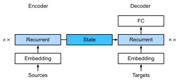

# Cơ Chế Attention Bahdanau
<a id="sec_seq2seq_attention"></a>

Khi chúng ta gặp bài toán dịch máy trong [sec_seq2seq](#sec_seq2seq),
chúng ta đã thiết kế kiến trúc mã hóa--giải mã cho học chuỗi-sang-chuỗi
dựa trên hai RNN [Sutskever.Vinyals.Le.2014].
Cụ thể, bộ mã hóa RNN chuyển đổi một chuỗi có độ dài thay đổi
thành một biến ngữ cảnh có *hình dạng cố định*.
Sau đó, bộ giải mã RNN tạo ra chuỗi đầu ra (mục tiêu) từng token một
dựa trên các token đã tạo và biến ngữ cảnh.

Hãy nhớ lại [fig_seq2seq_details](#fig_seq2seq_details) mà chúng ta lặp lại ([fig_s2s_attention_state](#fig_s2s_attention_state)) với một số chi tiết bổ sung. Theo quy ước, trong một RNN, toàn bộ thông tin liên quan về chuỗi nguồn được bộ mã hóa dịch thành một biểu diễn trạng thái *có số chiều cố định* nào đó. Chính trạng thái này được bộ giải mã sử dụng như là nguồn thông tin duy nhất và đầy đủ để tạo ra chuỗi dịch. Nói cách khác, cơ chế chuỗi-sang-chuỗi xem trạng thái trung gian như một thống kê đủ cho bất kỳ chuỗi nào có thể là đầu vào.


<a id="fig_s2s_attention_state"></a>

Mặc dù điều này khá hợp lý cho các chuỗi ngắn, nhưng rõ ràng là không khả thi cho các chuỗi dài, chẳng hạn như một chương sách hoặc thậm chí chỉ là một câu rất dài. Sau cùng, trước khi quá muộn sẽ không còn đủ "không gian" trong biểu diễn trung gian để lưu trữ tất cả những gì quan trọng trong chuỗi nguồn. Do đó bộ giải mã sẽ thất bại trong việc dịch các câu dài và phức tạp. Một trong những người đầu tiên gặp phải vấn đề này là Graves.2013, người đã cố gắng thiết kế một RNN để tạo ra chữ viết tay. Vì văn bản nguồn có độ dài tùy ý, họ đã thiết kế một mô hình attention có thể vi phân
để căn chỉnh các ký tự văn bản với dấu vết bút dài hơn nhiều,
trong đó sự căn chỉnh chỉ di chuyển theo một hướng. Điều này, đến lượt nó, dựa trên các thuật toán giải mã trong nhận dạng giọng nói, ví dụ: các mô hình Markov ẩn [rabiner1993fundamentals].

Lấy cảm hứng từ ý tưởng học cách căn chỉnh,
Bahdanau.Cho.Bengio.2014 đề xuất một mô hình attention có thể vi phân
*không* có giới hạn căn chỉnh một chiều.
Khi dự đoán một token,
nếu không phải tất cả các token đầu vào đều liên quan,
mô hình sẽ căn chỉnh (hay chú ý)
chỉ vào các phần của chuỗi đầu vào
được coi là liên quan đến dự đoán hiện tại. Sau đó điều này được sử dụng để cập nhật trạng thái hiện tại trước khi tạo token tiếp theo. Mặc dù có vẻ vô hại trong mô tả, *cơ chế attention Bahdanau* này có thể được coi là một trong những ý tưởng có ảnh hưởng nhất của thập kỷ vừa qua trong deep learning, tạo ra Transformers [Vaswani.Shazeer.Parmar.ea.2017] và nhiều kiến trúc mới liên quan.


```python
from d2l import torch as d2l
import torch
from torch import nn
```


## Mô Hình

Chúng ta tuân theo ký hiệu được giới thiệu bởi kiến trúc chuỗi-sang-chuỗi trong [sec_seq2seq](#sec_seq2seq), đặc biệt :eqref:`eq_seq2seq_s_t`.
Ý tưởng chính là thay vì giữ trạng thái,
tức là biến ngữ cảnh $\mathbf{c}$ tóm tắt câu nguồn, là cố định, chúng ta cập nhật nó động, như một hàm của cả văn bản gốc (các trạng thái ẩn của bộ mã hóa $\mathbf{h}_{t}$) và văn bản đã được tạo ra (các trạng thái ẩn của bộ giải mã $\mathbf{s}_{t'-1}$). Điều này tạo ra $\mathbf{c}_{t'}$, được cập nhật sau mỗi bước giải mã $t'$. Giả sử rằng chuỗi đầu vào có độ dài $T$. Trong trường hợp này biến ngữ cảnh là đầu ra của attention pooling:

$$\mathbf{c}_{t'} = \sum_{t=1}^{T} \alpha(\mathbf{s}_{t' - 1}, \mathbf{h}_{t}) \mathbf{h}_{t}.$$

Chúng ta đã sử dụng $\mathbf{s}_{t' - 1}$ làm query, và
$\mathbf{h}_{t}$ làm cả key và value. Lưu ý rằng $\mathbf{c}_{t'}$ sau đó được sử dụng để tạo ra trạng thái $\mathbf{s}_{t'}$ và để tạo ra một token mới: xem :eqref:`eq_seq2seq_s_t`. Cụ thể, trọng số attention $\alpha$ được tính như trong :eqref:`eq_attn-scoring-alpha`
sử dụng hàm tính điểm attention cộng
được định nghĩa bởi :eqref:`eq_additive-attn`.
Kiến trúc bộ mã hóa--bộ giải mã RNN
sử dụng attention được mô tả trong [fig_s2s_attention_details](#fig_s2s_attention_details). Lưu ý rằng sau này mô hình này đã được sửa đổi để bao gồm các token đã được tạo trong bộ giải mã như ngữ cảnh bổ sung (tức là tổng attention không dừng ở $T$ mà thay vào đó tiếp tục đến $t'-1$). Ví dụ: xem chan2015listen để biết mô tả về chiến lược này, được áp dụng cho nhận dạng giọng nói.


<a id="fig_s2s_attention_details"></a>

## Định Nghĩa Bộ Giải Mã với Attention

Để triển khai bộ mã hóa--bộ giải mã RNN với attention,
chúng ta chỉ cần định nghĩa lại bộ giải mã (bỏ qua các ký hiệu đã tạo khỏi hàm attention giúp đơn giản hóa thiết kế). Hãy bắt đầu với [**giao diện cơ sở cho các bộ giải mã với attention**] bằng cách định nghĩa lớp `AttentionDecoder` được đặt tên khá hiển nhiên.


Chúng ta cần [**triển khai bộ giải mã RNN**]
trong lớp `Seq2SeqAttentionDecoder`.
Trạng thái của bộ giải mã được khởi tạo với
(i) các trạng thái ẩn của lớp cuối cùng của bộ mã hóa tại tất cả các bước thời gian, được sử dụng làm key và value cho attention;
(ii) trạng thái ẩn của bộ mã hóa ở tất cả các lớp tại bước thời gian cuối cùng, dùng để khởi tạo trạng thái ẩn của bộ giải mã;
và (iii) độ dài hợp lệ của bộ mã hóa, để loại trừ các token đệm trong attention pooling.
Tại mỗi bước giải mã, trạng thái ẩn của lớp cuối cùng của bộ giải mã, thu được ở bước thời gian trước, được sử dụng làm query của cơ chế attention.
Cả đầu ra của cơ chế attention và embedding đầu vào đều được nối để làm đầu vào của bộ giải mã RNN.


```python
class Seq2SeqAttentionDecoder(AttentionDecoder):
    def __init__(self, vocab_size, embed_size, num_hiddens, num_layers,
                 dropout=0):
        super().__init__()
        self.attention = d2l.AdditiveAttention(num_hiddens, dropout)
        self.embedding = nn.Embedding(vocab_size, embed_size)
        self.rnn = nn.GRU(
            embed_size + num_hiddens, num_hiddens, num_layers,
            dropout=dropout)
        self.dense = nn.LazyLinear(vocab_size)
        self.apply(d2l.init_seq2seq)

    def init_state(self, enc_outputs, enc_valid_lens):
        # Shape of outputs: (num_steps, batch_size, num_hiddens).
        # Shape of hidden_state: (num_layers, batch_size, num_hiddens)
        outputs, hidden_state = enc_outputs
        return (outputs.permute(1, 0, 2), hidden_state, enc_valid_lens)

    def forward(self, X, state):
        # Shape of enc_outputs: (batch_size, num_steps, num_hiddens).
        # Shape of hidden_state: (num_layers, batch_size, num_hiddens)
        enc_outputs, hidden_state, enc_valid_lens = state
        # Shape of the output X: (num_steps, batch_size, embed_size)
        X = self.embedding(X).permute(1, 0, 2)
        outputs, self._attention_weights = [], []
        for x in X:
            # Shape of query: (batch_size, 1, num_hiddens)
            query = torch.unsqueeze(hidden_state[-1], dim=1)
            # Shape of context: (batch_size, 1, num_hiddens)
            context = self.attention(
                query, enc_outputs, enc_outputs, enc_valid_lens)
            # Concatenate on the feature dimension
            x = torch.cat((context, torch.unsqueeze(x, dim=1)), dim=-1)
            # Reshape x as (1, batch_size, embed_size + num_hiddens)
            out, hidden_state = self.rnn(x.permute(1, 0, 2), hidden_state)
            outputs.append(out)
            self._attention_weights.append(self.attention.attention_weights)
        # After fully connected layer transformation, shape of outputs:
        # (num_steps, batch_size, vocab_size)
        outputs = self.dense(torch.cat(outputs, dim=0))
        return outputs.permute(1, 0, 2), [enc_outputs, hidden_state,
                                          enc_valid_lens]

    @property
    def attention_weights(self):
        return self._attention_weights
```


Trong phần sau, chúng ta [**kiểm tra bộ giải mã đã được triển khai**] với attention
sử dụng một minibatch gồm bốn chuỗi, mỗi chuỗi dài bảy bước thời gian.

```python
vocab_size, embed_size, num_hiddens, num_layers = 10, 8, 16, 2
batch_size, num_steps = 4, 7
encoder = d2l.Seq2SeqEncoder(vocab_size, embed_size, num_hiddens, num_layers)
decoder = Seq2SeqAttentionDecoder(vocab_size, embed_size, num_hiddens,
                                  num_layers)
if tab.selected('mxnet'):
    X = d2l.zeros((batch_size, num_steps))
    state = decoder.init_state(encoder(X), None)
    output, state = decoder(X, state)
if tab.selected('pytorch'):
    X = d2l.zeros((batch_size, num_steps), dtype=torch.long)
    state = decoder.init_state(encoder(X), None)
    output, state = decoder(X, state)
if tab.selected('tensorflow'):
    X = tf.zeros((batch_size, num_steps))
    state = decoder.init_state(encoder(X, training=False), None)
    output, state = decoder(X, state, training=False)
if tab.selected('jax'):
    X = jnp.zeros((batch_size, num_steps), dtype=jnp.int32)
    state = decoder.init_state(encoder.init_with_output(d2l.get_key(),
                                                        X, training=False)[0],
                               None)
    (output, state), _ = decoder.init_with_output(d2l.get_key(), X,
                                                  state, training=False)
d2l.check_shape(output, (batch_size, num_steps, vocab_size))
d2l.check_shape(state[0], (batch_size, num_steps, num_hiddens))
d2l.check_shape(state[1][0], (batch_size, num_hiddens))
```

## [**Huấn Luyện**]

Bây giờ chúng ta đã chỉ định bộ giải mã mới, chúng ta có thể tiến hành tương tự như [sec_seq2seq_training](#sec_seq2seq_training):
chỉ định các siêu tham số, khởi tạo
một bộ mã hóa thông thường và một bộ giải mã với attention,
và huấn luyện mô hình này cho dịch máy.

```python
data = d2l.MTFraEng(batch_size=128)
embed_size, num_hiddens, num_layers, dropout = 256, 256, 2, 0.2
if tab.selected('mxnet', 'pytorch', 'jax'):
    encoder = d2l.Seq2SeqEncoder(
        len(data.src_vocab), embed_size, num_hiddens, num_layers, dropout)
    decoder = Seq2SeqAttentionDecoder(
        len(data.tgt_vocab), embed_size, num_hiddens, num_layers, dropout)
if tab.selected('mxnet', 'pytorch'):
    model = d2l.Seq2Seq(encoder, decoder, tgt_pad=data.tgt_vocab['<pad>'],
                        lr=0.005)
if tab.selected('jax'):
    model = d2l.Seq2Seq(encoder, decoder, tgt_pad=data.tgt_vocab['<pad>'],
                        lr=0.005, training=True)
if tab.selected('mxnet', 'pytorch', 'jax'):
    trainer = d2l.Trainer(max_epochs=30, gradient_clip_val=1, num_gpus=1)
if tab.selected('tensorflow'):
    with d2l.try_gpu():
        encoder = d2l.Seq2SeqEncoder(
            len(data.src_vocab), embed_size, num_hiddens, num_layers, dropout)
        decoder = Seq2SeqAttentionDecoder(
            len(data.tgt_vocab), embed_size, num_hiddens, num_layers, dropout)
        model = d2l.Seq2Seq(encoder, decoder, tgt_pad=data.tgt_vocab['<pad>'],
                            lr=0.005)
    trainer = d2l.Trainer(max_epochs=30, gradient_clip_val=1)
trainer.fit(model, data)
```

Sau khi mô hình được huấn luyện,
chúng ta sử dụng nó để [**dịch một vài câu tiếng Anh**]
sang tiếng Pháp và tính điểm BLEU của chúng.

```python
engs = ['go .', 'i lost .', 'he\'s calm .', 'i\'m home .']
fras = ['va !', 'j\'ai perdu .', 'il est calme .', 'je suis chez moi .']
if tab.selected('pytorch', 'mxnet', 'tensorflow'):
    preds, _ = model.predict_step(
        data.build(engs, fras), d2l.try_gpu(), data.num_steps)
if tab.selected('jax'):
    preds, _ = model.predict_step(
        trainer.state.params, data.build(engs, fras), data.num_steps)
for en, fr, p in zip(engs, fras, preds):
    translation = []
    for token in data.tgt_vocab.to_tokens(p):
        if token == '<eos>':
            break
        translation.append(token)
    print(f'{en} => {translation}, bleu,'
          f'{d2l.bleu(" ".join(translation), fr, k=2):.3f}')
```

Hãy [**trực quan hóa các trọng số attention**]
khi dịch câu tiếng Anh cuối cùng.
Chúng ta thấy rằng mỗi query gán các trọng số không đồng đều
cho các cặp key--value.
Điều này cho thấy tại mỗi bước giải mã,
các phần khác nhau của chuỗi đầu vào
được tổng hợp có chọn lọc trong attention pooling.

```python
if tab.selected('pytorch', 'mxnet', 'tensorflow'):
    _, dec_attention_weights = model.predict_step(
        data.build([engs[-1]], [fras[-1]]), d2l.try_gpu(), data.num_steps, True)
if tab.selected('jax'):
    _, (dec_attention_weights, _) = model.predict_step(
        trainer.state.params, data.build([engs[-1]], [fras[-1]]),
        data.num_steps, True)
attention_weights = d2l.concat(
    [step[0][0][0] for step in dec_attention_weights], 0)
attention_weights = d2l.reshape(attention_weights, (1, 1, -1, data.num_steps))
```


```python
# Plus one to include the end-of-sequence token
d2l.show_heatmaps(
    attention_weights[:, :, :, :len(engs[-1].split()) + 1].cpu(),
    xlabel='Key positions', ylabel='Query positions')
```


## Tóm Tắt

Khi dự đoán một token, nếu không phải tất cả các token đầu vào đều liên quan, bộ mã hóa--bộ giải mã RNN với cơ chế attention Bahdanau sẽ tổng hợp có chọn lọc các phần khác nhau của chuỗi đầu vào. Điều này đạt được bằng cách xem trạng thái (biến ngữ cảnh) như là đầu ra của attention pooling cộng.
Trong bộ mã hóa--bộ giải mã RNN, cơ chế attention Bahdanau xem trạng thái ẩn của bộ giải mã tại bước thời gian trước như là query, và các trạng thái ẩn của bộ mã hóa tại tất cả các bước thời gian như cả key và value.


## Bài Tập

1. Thay thế GRU bằng LSTM trong thí nghiệm.
1. Sửa đổi thí nghiệm để thay thế hàm tính điểm attention cộng bằng hàm tính điểm tích vô hướng có tỷ lệ. Điều này ảnh hưởng như thế nào đến hiệu quả huấn luyện?


[Discussions](https://discuss.d2l.ai/t/1065)
