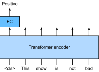
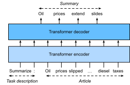
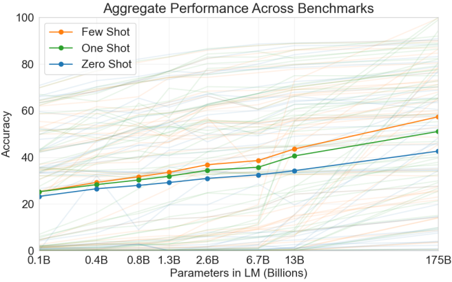

# Tiền Huấn Luyện Quy Mô Lớn với Transformer

Cho đến nay trong các thí nghiệm phân loại ảnh và dịch máy,
các mô hình đã được huấn luyện trên các tập dữ liệu với các ví dụ đầu vào--đầu ra
*từ đầu* để thực hiện các tác vụ cụ thể.
Ví dụ, một Transformer được huấn luyện
với các cặp Anh--Pháp ([sec_transformer](#sec_transformer))
để mô hình này có thể dịch văn bản tiếng Anh đầu vào sang tiếng Pháp.
Kết quả là, mỗi mô hình trở thành một *chuyên gia cụ thể*
nhạy cảm ngay cả với một sự dịch chuyển nhỏ trong phân phối dữ liệu
([sec_environment-and-distribution-shift](#sec_environment-and-distribution-shift)).
Để có các mô hình tổng quát hơn, hoặc thậm chí là các *chuyên gia tổng quát* có năng lực hơn
có thể thực hiện nhiều tác vụ có hoặc không có thích nghi,
*tiền huấn luyện* các mô hình trên dữ liệu lớn ngày càng trở nên phổ biến.

Với dữ liệu lớn hơn để tiền huấn luyện, kiến trúc Transformer
hoạt động tốt hơn với kích thước mô hình và tính toán huấn luyện tăng lên,
thể hiện hành vi *mở rộng* vượt trội.
Cụ thể, hiệu suất của các mô hình ngôn ngữ dựa trên Transformer
tỷ lệ theo quy luật lũy thừa với số lượng tham số mô hình,
token huấn luyện và tính toán huấn luyện [kaplan2020scaling].
Khả năng mở rộng của Transformer cũng được chứng minh
bởi hiệu suất được nâng cao đáng kể
từ các vision Transformer lớn hơn được huấn luyện trên dữ liệu lớn hơn
(được thảo luận trong [sec_vision-transformer](#sec_vision-transformer)).
Các câu chuyện thành công gần đây hơn bao gồm Gato, một mô hình *chuyên gia tổng quát*
có thể chơi Atari, chú thích ảnh, trò chuyện và hoạt động như robot [reed2022generalist]. Gato là một Transformer duy nhất mở rộng tốt khi được tiền huấn luyện trên các phương thức đa dạng,
bao gồm văn bản, ảnh, mô-men khớp và nhấn nút.
Đáng chú ý, tất cả dữ liệu đa phương thức như vậy được tuần tự hóa thành một chuỗi phẳng các token,
có thể được xử lý tương tự như các token văn bản ([sec_transformer](#sec_transformer))
hoặc các patch ảnh ([sec_vision-transformer](#sec_vision-transformer)) bởi Transformer.

Trước sự thành công thuyết phục của việc tiền huấn luyện Transformer cho dữ liệu đa phương thức,
Transformer đã được tiền huấn luyện rộng rãi với lượng văn bản phong phú.
Ban đầu được đề xuất cho dịch máy,
kiến trúc Transformer trong [fig_transformer](#fig_transformer)
bao gồm một bộ mã hóa để biểu diễn chuỗi đầu vào
và một bộ giải mã để tạo ra chuỗi mục tiêu.
Chủ yếu, Transformer có thể được sử dụng theo ba chế độ khác nhau:
*chỉ mã hóa*, *mã hóa--giải mã* và *chỉ giải mã*.
Để kết thúc chương này, chúng ta sẽ xem lại ba chế độ này
và giải thích khả năng mở rộng trong tiền huấn luyện Transformer.

## Chỉ Mã Hóa

Khi chỉ sử dụng bộ mã hóa Transformer,
một chuỗi token đầu vào được chuyển đổi
thành cùng số lượng biểu diễn
có thể được chiếu thêm thành đầu ra
(ví dụ: phân loại). Một bộ mã hóa Transformer
bao gồm các lớp self-attention,
trong đó tất cả các token đầu vào chú ý đến nhau.
Ví dụ, vision Transformer được mô tả trong [fig_vit](#fig_vit)
chỉ mã hóa, chuyển đổi một chuỗi các patch ảnh đầu vào thành
biểu diễn của token đặc biệt "&lt;cls&gt;".
Vì biểu diễn này phụ thuộc vào tất cả các token đầu vào,
nó được chiếu thêm thành các nhãn phân loại.
Thiết kế này được lấy cảm hứng từ Transformer chỉ mã hóa trước đó
được tiền huấn luyện trên văn bản: BERT (Biểu diễn Mã hóa Hai chiều từ Transformer) [Devlin.Chang.Lee.ea.2018].

### Tiền Huấn Luyện BERT

BERT được tiền huấn luyện trên các chuỗi văn bản sử dụng *mô hình hóa ngôn ngữ có che*:
văn bản đầu vào với các token ngẫu nhiên bị che được đưa
vào bộ mã hóa Transformer để dự đoán các token bị che.
Như được minh họa trong [fig_bert-encoder-only](#fig_bert-encoder-only),
một chuỗi văn bản gốc "I", "love", "this", "red", "car"
được đặt trước với token "&lt;cls&gt;", và token "&lt;mask&gt;"
ngẫu nhiên thay thế "love"; sau đó mất mát entropy chéo giữa token bị che "love"
và dự đoán của nó được tối thiểu hóa trong quá trình tiền huấn luyện.
Lưu ý rằng không có ràng buộc trong mẫu attention của bộ mã hóa Transformer
(bên phải của [fig_bert-encoder-only](#fig_bert-encoder-only))
vì vậy tất cả các token có thể chú ý đến nhau.
Do đó, dự đoán "love" phụ thuộc vào các token đầu vào trước và sau nó trong chuỗi.
Đây là lý do tại sao BERT là "bộ mã hóa hai chiều".
Không cần gán nhãn thủ công, dữ liệu văn bản quy mô lớn
từ sách và Wikipedia có thể được sử dụng để tiền huấn luyện BERT.

### Tinh Chỉnh BERT

BERT đã được tiền huấn luyện có thể được *tinh chỉnh* cho các tác vụ mã hóa hạ lưu liên quan đến văn bản đơn hoặc cặp văn bản. Trong quá trình tinh chỉnh, các lớp bổ sung có thể được thêm vào BERT với các tham số được khởi tạo ngẫu nhiên: các tham số này và các tham số BERT đã được tiền huấn luyện sẽ được *cập nhật* để phù hợp với dữ liệu huấn luyện của các tác vụ hạ lưu.

[fig_bert-finetune-classification](#fig_bert-finetune-classification) minh họa
tinh chỉnh BERT cho phân tích cảm xúc.
Bộ mã hóa Transformer là BERT đã được tiền huấn luyện,
nhận một chuỗi văn bản làm đầu vào
và đưa biểu diễn "&lt;cls&gt;"
(biểu diễn toàn cục của đầu vào)
vào một lớp kết nối đầy đủ bổ sung
để dự đoán cảm xúc.
Trong quá trình tinh chỉnh, mất mát entropy chéo
giữa dự đoán và nhãn
trên dữ liệu phân tích cảm xúc
được tối thiểu hóa thông qua các thuật toán dựa trên gradient,
trong đó lớp bổ sung được huấn luyện từ đầu
trong khi các tham số đã được tiền huấn luyện của BERT được cập nhật.
BERT làm được nhiều hơn chỉ phân tích cảm xúc.
Các biểu diễn ngôn ngữ tổng quát được học
bởi BERT 350 triệu tham số
từ 250 tỷ token huấn luyện
đã nâng cao tình trạng tiên tiến cho các tác vụ ngôn ngữ tự nhiên
như phân loại văn bản đơn,
phân loại hoặc hồi quy cặp văn bản,
gắn thẻ văn bản và trả lời câu hỏi.

Bạn có thể nhận thấy rằng các tác vụ hạ lưu này bao gồm hiểu cặp văn bản.
Tiền huấn luyện BERT có thêm mất mát để dự đoán
liệu một câu có ngay lập tức theo sau câu kia không.
Tuy nhiên, mất mát này sau đó được phát hiện ít hữu ích hơn khi tiền huấn luyện RoBERTa,
một biến thể BERT cùng kích thước, trên 2000 tỷ token [Liu.Ott.Goyal.ea.2019].
Các dẫn xuất khác của BERT cải thiện kiến trúc mô hình hoặc mục tiêu tiền huấn luyện,
chẳng hạn như ALBERT (thực thi chia sẻ tham số) [lan2019albert],
SpanBERT (biểu diễn và dự đoán các span văn bản) [joshi2020spanbert],
DistilBERT (nhẹ thông qua chưng cất kiến thức) [sanh2019distilbert],
và ELECTRA (phát hiện token được thay thế) [clark2019electra].
Hơn nữa, BERT đã truyền cảm hứng cho tiền huấn luyện Transformer trong thị giác máy tính,
chẳng hạn như với vision Transformer [Dosovitskiy.Beyer.Kolesnikov.ea.2021],
Swin Transformer [liu2021swin],
và MAE (bộ tự mã hóa có che) [he2022masked].

## Mã Hóa--Giải Mã

Vì bộ mã hóa Transformer chuyển đổi một chuỗi token đầu vào
thành cùng số lượng biểu diễn đầu ra,
chế độ chỉ mã hóa không thể tạo ra chuỗi có độ dài tùy ý như trong dịch máy.
Như được đề xuất ban đầu cho dịch máy,
kiến trúc Transformer có thể được trang bị thêm bộ giải mã
dự đoán tự hồi quy chuỗi mục tiêu
có độ dài tùy ý, từng token một,
có điều kiện trên cả đầu ra bộ mã hóa và đầu ra bộ giải mã:
(i) để có điều kiện trên đầu ra bộ mã hóa, attention chéo mã hóa--giải mã
(attention đa đầu của bộ giải mã trong [fig_transformer](#fig_transformer))
cho phép các token mục tiêu chú ý đến *tất cả* các token đầu vào;
(ii) có điều kiện trên đầu ra bộ giải mã đạt được
bởi mẫu attention được gọi là *nhân quả*
(tên này phổ biến trong tài liệu nhưng gây hiểu lầm
vì nó có ít liên quan đến nghiên cứu nhân quả thích hợp)
(attention đa đầu có che của bộ giải mã trong [fig_transformer](#fig_transformer)),
trong đó bất kỳ token mục tiêu nào chỉ có thể chú ý đến các token *quá khứ* và *hiện tại* trong chuỗi mục tiêu.

Để tiền huấn luyện Transformer mã hóa--giải mã vượt ra ngoài dữ liệu dịch máy được gán nhãn bởi con người,
BART [lewis2019bart] và T5 [raffel2020exploring]
là hai Transformer mã hóa--giải mã được đề xuất đồng thời
được tiền huấn luyện trên các kho ngữ liệu văn bản quy mô lớn.
Cả hai đều cố gắng tái tạo lại văn bản gốc trong các mục tiêu tiền huấn luyện của chúng,
trong khi cái trước nhấn mạnh việc nhiễu hóa đầu vào
(ví dụ: che, xóa, hoán vị và xoay)
và cái sau nêu bật sự thống nhất đa tác vụ
với các nghiên cứu loại trừ toàn diện.

### Tiền Huấn Luyện T5

Là một ví dụ về Transformer mã hóa--giải mã đã được tiền huấn luyện,
T5 (Text-to-Text Transfer Transformer - Transformer Chuyển Văn Bản sang Văn Bản)
thống nhất nhiều tác vụ như cùng một bài toán văn bản sang văn bản:
với bất kỳ tác vụ nào, đầu vào của bộ mã hóa là mô tả tác vụ
(ví dụ: "Tóm tắt", ":") theo sau là đầu vào tác vụ
(ví dụ: một chuỗi token từ một bài báo),
và bộ giải mã dự đoán đầu ra tác vụ
(ví dụ: một chuỗi token tóm tắt bài báo đầu vào).
Để thực hiện như văn bản sang văn bản, T5 được huấn luyện
để tạo ra một số văn bản mục tiêu có điều kiện trên văn bản đầu vào.

![Trái: Tiền huấn luyện T5 bằng cách dự đoán các span liên tiếp. Câu gốc là "I", "love", "this", "red", "car", trong đó "love" được thay thế bởi token đặc biệt "&lt;X&gt;", và các từ liên tiếp "red", "car" được thay thế bởi token đặc biệt "&lt;Y&gt;". Chuỗi mục tiêu kết thúc bằng token đặc biệt "&lt;Z&gt;". Phải: Mẫu attention trong Transformer mã hóa--giải mã. Trong self-attention của bộ mã hóa (hình vuông dưới), tất cả các token đầu vào chú ý đến nhau; Trong attention chéo mã hóa--giải mã (hình chữ nhật trên), mỗi token mục tiêu chú ý đến tất cả các token đầu vào; Trong self-attention của bộ giải mã (tam giác trên), mỗi token mục tiêu chỉ chú ý đến các token mục tiêu hiện tại và quá khứ (nhân quả).](../img/t5-encoder-decoder.svg)

Để lấy đầu vào và đầu ra từ bất kỳ văn bản gốc nào,
T5 được tiền huấn luyện để dự đoán các span liên tiếp.
Cụ thể, các token từ văn bản ngẫu nhiên bị thay thế
bởi các token đặc biệt trong đó mỗi span liên tiếp
được thay thế bởi cùng một token đặc biệt.
Xem xét ví dụ trong [fig_t5-encoder-decoder](#fig_t5-encoder-decoder),
trong đó văn bản gốc là "I", "love", "this", "red", "car".
Các token "love", "red", "car" ngẫu nhiên bị thay thế bởi các token đặc biệt.
Vì "red" và "car" là một span liên tiếp,
chúng được thay thế bởi cùng một token đặc biệt.
Kết quả là, chuỗi đầu vào là "I", "&lt;X&gt;", "this", "&lt;Y&gt;",
và chuỗi mục tiêu là
"&lt;X&gt;", "love", "&lt;Y&gt;", "red", "car", "&lt;Z&gt;",
trong đó "&lt;Z&gt;" là một token đặc biệt khác đánh dấu kết thúc.
Như được hiển thị trong [fig_t5-encoder-decoder](#fig_t5-encoder-decoder),
bộ giải mã có mẫu attention nhân quả để ngăn chính nó
không chú ý đến các token tương lai trong quá trình dự đoán chuỗi.

Trong T5, dự đoán span liên tiếp cũng được gọi là
tái tạo văn bản bị hỏng.
Với mục tiêu này, T5 được tiền huấn luyện
với 1000 tỷ token từ dữ liệu C4
(Colossal Clean Crawled Corpus - Kho dữ liệu Thu thập Sạch Khổng lồ),
bao gồm văn bản tiếng Anh sạch
từ web [raffel2020exploring].

### Tinh Chỉnh T5

Tương tự như BERT, T5 cần được tinh chỉnh (cập nhật tham số T5)
trên dữ liệu huấn luyện cụ thể cho tác vụ để thực hiện tác vụ này.
Các điểm khác biệt chính so với tinh chỉnh BERT bao gồm:
(i) Đầu vào T5 bao gồm mô tả tác vụ;
(ii) T5 có thể tạo ra chuỗi
có độ dài tùy ý
với bộ giải mã Transformer của nó;
(iii) Không cần các lớp bổ sung.

[fig_t5-finetune-summarization](#fig_t5-finetune-summarization)
giải thích tinh chỉnh T5
sử dụng tóm tắt văn bản làm ví dụ.
Trong tác vụ hạ lưu này,
các token mô tả tác vụ "Summarize", ":"
theo sau là các token bài báo được đưa vào bộ mã hóa.

Sau khi tinh chỉnh, T5 11 tỷ tham số (T5-11B)
đạt được kết quả tiên tiến trên nhiều benchmark mã hóa (ví dụ: phân loại)
và tạo sinh (ví dụ: tóm tắt).
Kể từ khi được phát hành, T5 đã được sử dụng rộng rãi trong các nghiên cứu sau đó.
Ví dụ, switch Transformer được thiết kế dựa trên T5
để kích hoạt một tập con các tham số
để có hiệu quả tính toán tốt hơn [fedus2022switch].
Trong một mô hình văn bản sang ảnh được gọi là Imagen,
văn bản được đưa vào bộ mã hóa T5 đông lạnh (T5-XXL)
với 4,6 tỷ tham số [saharia2022photorealistic].
Các ví dụ văn bản sang ảnh chân thực trong [fig_imagen](#fig_imagen)
gợi ý rằng bộ mã hóa T5 một mình có thể hiệu quả
biểu diễn văn bản ngay cả mà không cần tinh chỉnh.

:width:`700px`

## Chỉ Giải Mã

Chúng ta đã xem xét Transformer chỉ mã hóa và mã hóa--giải mã.
Thay vào đó, Transformer chỉ giải mã
loại bỏ toàn bộ bộ mã hóa và lớp con bộ giải mã
với attention chéo mã hóa--giải mã
từ kiến trúc mã hóa--giải mã gốc
được mô tả trong [fig_transformer](#fig_transformer).
Ngày nay, Transformer chỉ giải mã đã trở thành kiến trúc *de facto*
trong mô hình hóa ngôn ngữ quy mô lớn ([sec_language-model](#sec_language-model)),
tận dụng các kho ngữ liệu văn bản không có nhãn phong phú của thế giới thông qua học tự giám sát.

### GPT và GPT-2

Sử dụng mô hình hóa ngôn ngữ như mục tiêu huấn luyện,
mô hình GPT (Tiền huấn luyện Tạo sinh)
chọn một bộ giải mã Transformer
làm xương sống của nó [Radford.Narasimhan.Salimans.ea.2018].

Theo huấn luyện mô hình ngôn ngữ tự hồi quy
như được mô tả trong [subsec_partitioning-seqs](#subsec_partitioning-seqs),
[fig_gpt-decoder-only](#fig_gpt-decoder-only) minh họa
tiền huấn luyện GPT với bộ mã hóa Transformer,
trong đó chuỗi mục tiêu là chuỗi đầu vào dịch chuyển một token.
Lưu ý rằng mẫu attention trong bộ giải mã Transformer
thực thi rằng mỗi token chỉ có thể chú ý đến các token quá khứ của nó
(các token tương lai không thể được chú ý vì chúng chưa được chọn).

GPT có 100 triệu tham số và cần được
tinh chỉnh cho các tác vụ hạ lưu riêng lẻ.
Một mô hình ngôn ngữ bộ giải mã Transformer lớn hơn nhiều,
GPT-2, được giới thiệu một năm sau [Radford.Wu.Child.ea.2019].
So với bộ giải mã Transformer gốc trong GPT, pre-normalization
(được thảo luận trong [subsec_vit-encoder](#subsec_vit-encoder))
và việc khởi tạo và tỷ lệ trọng số được cải thiện đã được áp dụng trong GPT-2.
Được tiền huấn luyện trên 40 GB văn bản, 1,5 tỷ tham số
GPT-2 đạt được kết quả tiên tiến trên các benchmark mô hình hóa ngôn ngữ
và kết quả hứa hẹn trên nhiều tác vụ khác
*mà không cập nhật các tham số hoặc kiến trúc*.

### GPT-3 và Hơn Nữa

GPT-2 đã chứng minh tiềm năng của việc sử dụng cùng một mô hình ngôn ngữ
cho nhiều tác vụ mà không cần cập nhật mô hình.
Điều này hiệu quả hơn về mặt tính toán so với tinh chỉnh,
đòi hỏi cập nhật mô hình thông qua tính toán gradient.

Trước khi giải thích cách sử dụng các mô hình ngôn ngữ hiệu quả hơn về mặt tính toán mà không cần cập nhật tham số,
hãy nhớ lại [sec_rnn-scratch](#sec_rnn-scratch) rằng một mô hình ngôn ngữ
có thể được huấn luyện để tạo ra một chuỗi văn bản
có điều kiện trên một số chuỗi văn bản tiền tố.
Do đó, một mô hình ngôn ngữ đã được tiền huấn luyện có thể tạo ra đầu ra tác vụ
như một chuỗi *mà không cần cập nhật tham số*,
có điều kiện trên một chuỗi đầu vào với mô tả tác vụ,
các ví dụ đầu vào--đầu ra cụ thể cho tác vụ, và một prompt (đầu vào tác vụ).
Mô hình học này được gọi là *học trong ngữ cảnh* [brown2020language],
có thể được phân loại thêm thành
*zero-shot*, *one-shot* và *few-shot*,
khi không có, một và một vài ví dụ đầu vào--đầu ra cụ thể cho tác vụ ([fig_gpt-3-xshot](#fig_gpt-3-xshot)).

:width:`400px`

Ba cài đặt này đã được kiểm tra trong GPT-3 [brown2020language],
phiên bản lớn nhất sử dụng kích thước dữ liệu và mô hình
lớn hơn khoảng hai bậc độ lớn so với trong GPT-2.
GPT-3 sử dụng cùng kiến trúc bộ giải mã Transformer
như người tiền nhiệm trực tiếp GPT-2 của nó
ngoại trừ mẫu attention
(bên phải trong [fig_gpt-decoder-only](#fig_gpt-decoder-only))
thưa hơn ở các lớp xen kẽ.
Được tiền huấn luyện với 300 tỷ token,
GPT-3 hoạt động tốt hơn với kích thước mô hình lớn hơn,
trong đó hiệu suất few-shot tăng nhanh nhất ([fig_gpt3-xshot-scaling](#fig_gpt3-xshot-scaling)).

Mô hình GPT-4 tiếp theo không tiết lộ đầy đủ chi tiết kỹ thuật trong báo cáo của nó [openai2023gpt4].
Ngược lại với những người tiền nhiệm của nó, GPT-4
là một mô hình đa phương thức quy mô lớn
có thể nhận cả văn bản và ảnh làm đầu vào
và tạo ra đầu ra văn bản.

## Khả Năng Mở Rộng

[fig_gpt3-xshot-scaling](#fig_gpt3-xshot-scaling) chứng minh theo thực nghiệm khả năng mở rộng
của Transformer trong mô hình ngôn ngữ GPT-3.
Đối với mô hình hóa ngôn ngữ, các nghiên cứu thực nghiệm toàn diện hơn
về khả năng mở rộng của Transformer đã dẫn các nhà nghiên cứu thấy hứa hẹn
trong việc huấn luyện các Transformer lớn hơn với nhiều dữ liệu và tính toán hơn [kaplan2020scaling].

:width:`700px`

Như được hiển thị trong [fig_scaling-power-law3](#fig_scaling-power-law3),
*mở rộng theo quy luật lũy thừa* có thể được quan sát trong hiệu suất
với kích thước mô hình (số tham số, không tính các lớp embedding),
kích thước tập dữ liệu (số token huấn luyện),
và lượng tính toán huấn luyện (PetaFLOP/s-ngày, không tính các lớp embedding).
Nói chung, tăng tất cả ba yếu tố này cùng nhau dẫn đến hiệu suất tốt hơn.
Tuy nhiên, *làm thế nào* để tăng chúng cùng nhau
vẫn còn là vấn đề gây tranh cãi [hoffmann2022training].

:width:`700px`

Ngoài hiệu suất tăng, các mô hình lớn cũng có hiệu quả mẫu tốt hơn các mô hình nhỏ. [fig_scaling-sample-conv](#fig_scaling-sample-conv) cho thấy rằng các mô hình lớn cần ít mẫu huấn luyện hơn (token được xử lý) để đạt hiệu suất ở cùng mức mà các mô hình nhỏ đạt được, và hiệu suất được mở rộng trơn tru với tính toán.

:width:`250px`

Các hành vi mở rộng thực nghiệm trong kaplan2020scaling đã được kiểm tra trong các mô hình Transformer lớn tiếp theo. Ví dụ, GPT-3 hỗ trợ giả thuyết này với thêm hai bậc độ lớn trong [fig_scaling-gpt3](#fig_scaling-gpt3).

## Các Mô Hình Ngôn Ngữ Lớn

Khả năng mở rộng của Transformer trong dòng GPT đã truyền cảm hứng cho các mô hình ngôn ngữ lớn tiếp theo.
Bộ giải mã Transformer GPT-2 được sử dụng để huấn luyện Megatron-Turing NLG 530 tỷ tham số [smith2022using] với 270 tỷ token huấn luyện. Theo thiết kế GPT-2, Gopher 280 tỷ tham số [rae2021scaling] được tiền huấn luyện với 300 tỷ token, hoạt động cạnh tranh trên nhiều tác vụ đa dạng.
Kế thừa kiến trúc tương tự và sử dụng cùng ngân sách tính toán của Gopher, Chinchilla [hoffmann2022training] là một mô hình nhỏ hơn đáng kể (70 tỷ tham số) huấn luyện lâu hơn nhiều (1,4 nghìn tỷ token huấn luyện), vượt trội hơn Gopher trên nhiều tác vụ và nhấn mạnh hơn vào số token hơn là số tham số.
Để tiếp tục dòng mở rộng của mô hình hóa ngôn ngữ,
PaLM (Mô Hình Ngôn Ngữ Pathway) [chowdhery2022palm], bộ giải mã Transformer 540 tỷ tham số với các thiết kế sửa đổi được tiền huấn luyện trên 780 tỷ token, vượt qua hiệu suất trung bình của con người trên benchmark BIG-Bench [srivastava2022beyond]. Phiên bản sau của nó, PaLM 2 [anil2023palm], mở rộng dữ liệu và mô hình xấp xỉ 1:1 và cải thiện khả năng đa ngôn ngữ và suy luận.
Các mô hình ngôn ngữ lớn khác, chẳng hạn như Minerva [lewkowycz2022solving] huấn luyện thêm một mô hình tổng quát (PaLM) và Galactica [taylor2022galactica] không được huấn luyện trên kho ngữ liệu tổng quát, đã cho thấy khả năng suy luận định lượng và khoa học đầy hứa hẹn.

Các phát hành nguồn mở, chẳng hạn như OPT (Open Pretrained Transformers) [zhang2022opt], BLOOM [scao2022bloom], và FALCON [penedo2023refinedweb],
đã dân chủ hóa nghiên cứu và sử dụng các mô hình ngôn ngữ lớn.
Tập trung vào hiệu quả tính toán tại thời điểm suy luận,
Llama 1 nguồn mở [touvron2023llama] vượt trội hơn các mô hình lớn hơn nhiều bằng cách huấn luyện trên nhiều token hơn so với thông thường được sử dụng. Llama 2 được cập nhật [touvron2023llama2] tiếp tục tăng kho dữ liệu tiền huấn luyện thêm 40%, dẫn đến các mô hình sản phẩm có thể so sánh hiệu suất của các mô hình nguồn đóng cạnh tranh.

wei2022emergent đã thảo luận về các khả năng nổi sinh của các mô hình ngôn ngữ lớn có mặt trong các mô hình lớn hơn, nhưng không có trong các mô hình nhỏ hơn.
Tuy nhiên, chỉ đơn giản là tăng kích thước mô hình không vốn làm cho các mô hình tuân theo hướng dẫn của con người tốt hơn.
wei2021finetuned,sanh2021multitask đã phát hiện ra rằng tinh chỉnh các mô hình ngôn ngữ lớn
trên một loạt tập dữ liệu được mô tả qua *hướng dẫn*
có thể cải thiện hiệu suất zero-shot trên các tác vụ ngoài tập.
Sử dụng *học tăng cường từ phản hồi của con người*,
ouyang2022training đã tinh chỉnh GPT-3
để tuân theo một tập hợp hướng dẫn đa dạng.
Theo InstructGPT kết quả
căn chỉnh các mô hình ngôn ngữ với ý định của con người
thông qua tinh chỉnh [ouyang2022training],
[ChatGPT](https://chat.openai.com/)
có thể tạo ra các phản hồi giống con người (ví dụ: gỡ lỗi code và viết sáng tạo)
dựa trên các cuộc trò chuyện với con người
và có thể thực hiện nhiều tác vụ xử lý ngôn ngữ tự nhiên
zero-shot [qin2023chatgpt].
bai2022constitutional đã thay thế các đầu vào của con người (ví dụ: dữ liệu được gán nhãn bởi con người) bằng đầu ra mô hình
để tự động hóa một phần quá trình điều chỉnh hướng dẫn, còn được biết đến là *học tăng cường từ phản hồi AI*.

Các mô hình ngôn ngữ lớn đưa ra triển vọng thú vị
về việc xây dựng đầu vào văn bản để khuyến khích các mô hình thực hiện các tác vụ mong muốn thông qua học trong ngữ cảnh,
còn được gọi là *prompting*.
Đáng chú ý,
*chain-of-thought prompting* [wei2022chain],
một phương pháp học trong ngữ cảnh
với các minh chứng few-shot "câu hỏi, các bước suy luận trung gian, câu trả lời",
khơi dậy các khả năng suy luận phức tạp của
các mô hình ngôn ngữ lớn
để giải quyết các tác vụ suy luận toán học, thông thường và ký hiệu.
Lấy mẫu nhiều đường suy luận [wang2023self], đa dạng hóa các minh chứng few-shot [zhang2023automatic],
và giảm các vấn đề phức tạp thành các bài toán con [zhou2023least]
đều có thể cải thiện độ chính xác suy luận. Thực tế, với các prompt đơn giản như "Let's think step by step" (Hãy suy nghĩ từng bước) ngay trước mỗi câu trả lời,
các mô hình ngôn ngữ lớn thậm chí có thể thực hiện suy luận chain-of-thought *zero-shot*
với độ chính xác tốt [kojima2022large].
Ngay cả đối với đầu vào đa phương thức bao gồm cả văn bản và ảnh,
các mô hình ngôn ngữ có thể thực hiện suy luận chain-of-thought đa phương thức với độ chính xác cao hơn so với chỉ sử dụng đầu vào văn bản [zhang2023multicot].

## Tóm Tắt và Thảo Luận

Transformer đã được tiền huấn luyện như chỉ mã hóa (ví dụ: BERT), mã hóa--giải mã (ví dụ: T5) và chỉ giải mã (ví dụ: dòng GPT). Các mô hình đã được tiền huấn luyện có thể được điều chỉnh để thực hiện các tác vụ khác nhau với cập nhật mô hình (ví dụ: tinh chỉnh) hoặc không (ví dụ: few-shot). Khả năng mở rộng của Transformer gợi ý rằng hiệu suất tốt hơn được hưởng lợi từ các mô hình lớn hơn, nhiều dữ liệu huấn luyện hơn và nhiều tính toán huấn luyện hơn. Vì Transformer được thiết kế và tiền huấn luyện cho dữ liệu văn bản lần đầu tiên, phần này hơi nghiêng về xử lý ngôn ngữ tự nhiên. Tuy nhiên, những mô hình được thảo luận ở trên thường có thể được tìm thấy trong các mô hình gần đây hơn trên nhiều phương thức. Ví dụ,
(i) Chinchilla [hoffmann2022training] được mở rộng thêm thành Flamingo [alayrac2022flamingo], một mô hình ngôn ngữ thị giác cho học few-shot;
(ii) GPT-2 [Radford.Wu.Child.ea.2019] và vision Transformer mã hóa văn bản và ảnh trong CLIP (Tiền huấn luyện Ngôn ngữ-Ảnh Đối lập) [radford2021learning], các embedding ảnh và văn bản của nó sau đó được áp dụng trong hệ thống văn bản sang ảnh DALL-E 2 [ramesh2022hierarchical]. Mặc dù chưa có các nghiên cứu có hệ thống về khả năng mở rộng Transformer trong tiền huấn luyện đa phương thức, một mô hình văn bản sang ảnh all-Transformer được gọi là Parti [yu2022scaling] cho thấy tiềm năng mở rộng qua các phương thức:
một Parti lớn hơn có khả năng tạo ảnh độ trung thực cao và hiểu văn bản phong phú nội dung hơn ([fig_parti](#fig_parti)).

:width:`700px`

## Bài Tập

1. Có thể tinh chỉnh T5 sử dụng một minibatch bao gồm các tác vụ khác nhau không? Tại sao hoặc tại sao không? Còn với GPT-2 thì sao?
1. Với một mô hình ngôn ngữ mạnh, bạn có thể nghĩ đến những ứng dụng nào?
1. Giả sử bạn được yêu cầu tinh chỉnh một mô hình ngôn ngữ để thực hiện phân loại văn bản bằng cách thêm các lớp bổ sung. Bạn sẽ thêm chúng ở đâu? Tại sao?
1. Xem xét các bài toán chuỗi sang chuỗi (ví dụ: dịch máy) trong đó chuỗi đầu vào luôn có sẵn trong suốt quá trình dự đoán chuỗi mục tiêu. Những hạn chế có thể có của việc mô hình hóa với Transformer chỉ giải mã là gì? Tại sao?

[Discussions](https://discuss.d2l.ai/t/9232)
