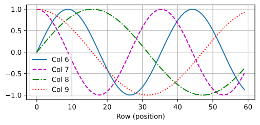
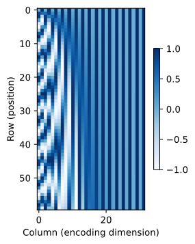
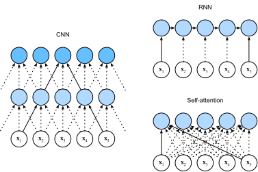

# Self-Attention và Mã Hóa Vị Trí
<a id="sec_self-attention-and-positional-encoding"></a>

Trong deep learning, chúng ta thường sử dụng CNN hoặc RNN để mã hóa các chuỗi.
Bây giờ với cơ chế attention trong đầu,
hãy tưởng tượng việc đưa một chuỗi token
vào cơ chế attention
sao cho tại mỗi bước,
mỗi token có query, key và value riêng của nó.
Ở đây, khi tính toán giá trị biểu diễn của một token tại lớp tiếp theo,
token đó có thể chú ý (thông qua vector query của nó) đến bất kỳ token nào khác
(khớp dựa trên vector key của chúng).
Sử dụng tập hợp đầy đủ các điểm tương thích query-key,
chúng ta có thể tính toán, cho mỗi token, một biểu diễn
bằng cách xây dựng tổng có trọng số phù hợp
trên các token khác.
Vì mỗi token đang chú ý đến từng token khác
(khác với trường hợp các bước giải mã chú ý đến các bước mã hóa),
các kiến trúc như vậy thường được mô tả là các mô hình *self-attention* [Lin.Feng.Santos.ea.2017, Vaswani.Shazeer.Parmar.ea.2017],
và ở nơi khác được mô tả là mô hình *intra-attention* [Cheng.Dong.Lapata.2016, Parikh.Tackstrom.Das.ea.2016, Paulus.Xiong.Socher.2017].
Trong phần này, chúng ta sẽ thảo luận về mã hóa chuỗi sử dụng self-attention,
bao gồm việc sử dụng thông tin bổ sung về thứ tự chuỗi.


```python
from d2l import torch as d2l
import math
import torch
from torch import nn
```




## [**Self-Attention**]

Cho một chuỗi token đầu vào
$\mathbf{x}_1, \ldots, \mathbf{x}_n$ trong đó bất kỳ $\mathbf{x}_i \in \mathbb{R}^d$ ($1 \leq i \leq n$),
self-attention của nó xuất ra
một chuỗi có cùng độ dài
$\mathbf{y}_1, \ldots, \mathbf{y}_n$,
trong đó

$$\mathbf{y}_i = f(\mathbf{x}_i, (\mathbf{x}_1, \mathbf{x}_1), \ldots, (\mathbf{x}_n, \mathbf{x}_n)) \in \mathbb{R}^d$$

theo định nghĩa của attention pooling trong
:eqref:`eq_attention_pooling`.
Sử dụng attention đa đầu,
đoạn code sau đây
tính toán self-attention của một tensor
có hình dạng (kích thước batch, số bước thời gian hoặc độ dài chuỗi theo token, $d$).
Tensor đầu ra có cùng hình dạng.

```python
num_hiddens, num_heads = 100, 5
attention = d2l.MultiHeadAttention(num_hiddens, num_heads, 0.5)
batch_size, num_queries, valid_lens = 2, 4, d2l.tensor([3, 2])
X = d2l.ones((batch_size, num_queries, num_hiddens))
d2l.check_shape(attention(X, X, X, valid_lens),
                (batch_size, num_queries, num_hiddens))
```




## So Sánh CNN, RNN và Self-Attention
<a id="subsec_cnn-rnn-self-attention"></a>

Hãy cùng
so sánh các kiến trúc để ánh xạ
một chuỗi $n$ token
sang một chuỗi khác có cùng độ dài,
trong đó mỗi token đầu vào hoặc đầu ra được biểu diễn bởi
một vector $d$ chiều.
Cụ thể,
chúng ta sẽ xem xét CNN, RNN và self-attention.
Chúng ta sẽ so sánh
độ phức tạp tính toán,
các phép toán tuần tự,
và độ dài đường dẫn tối đa.
Lưu ý rằng các phép toán tuần tự ngăn cản tính toán song song,
trong khi đường dẫn ngắn hơn giữa
bất kỳ tổ hợp vị trí chuỗi nào
giúp dễ học hơn các phụ thuộc tầm xa
trong chuỗi [Hochreiter.Bengio.Frasconi.ea.2001].



<a id="fig_cnn-rnn-self-attention"></a>


Hãy xem bất kỳ chuỗi văn bản nào như một "hình ảnh một chiều". Tương tự, CNN một chiều có thể xử lý các đặc trưng cục bộ như $n$-gram trong văn bản.
Cho một chuỗi có độ dài $n$,
xét một lớp tích chập có kích thước kernel là $k$,
và số kênh đầu vào và đầu ra đều là $d$.
Độ phức tạp tính toán của lớp tích chập là $\mathcal{O}(knd^2)$.
Như [fig_cnn-rnn-self-attention](#fig_cnn-rnn-self-attention) cho thấy,
CNN có tính phân cấp,
do đó có $\mathcal{O}(1)$ phép toán tuần tự
và độ dài đường dẫn tối đa là $\mathcal{O}(n/k)$.
Ví dụ, $\mathbf{x}_1$ và $\mathbf{x}_5$
nằm trong vùng tiếp nhận của CNN hai lớp
với kích thước kernel 3 trong [fig_cnn-rnn-self-attention](#fig_cnn-rnn-self-attention).

Khi cập nhật trạng thái ẩn của RNN,
phép nhân ma trận trọng số $d \times d$
với trạng thái ẩn $d$ chiều có
độ phức tạp tính toán là $\mathcal{O}(d^2)$.
Vì độ dài chuỗi là $n$,
độ phức tạp tính toán của lớp hồi tiếp
là $\mathcal{O}(nd^2)$.
Theo [fig_cnn-rnn-self-attention](#fig_cnn-rnn-self-attention),
có $\mathcal{O}(n)$ phép toán tuần tự
không thể được song song hóa
và độ dài đường dẫn tối đa cũng là $\mathcal{O}(n)$.

Trong self-attention,
các query, key và value
đều là các ma trận $n \times d$.
Xét attention tích vô hướng có tỷ lệ trong
:eqref:`eq_softmax_QK_V`,
trong đó một ma trận $n \times d$ được nhân với
một ma trận $d \times n$,
sau đó ma trận đầu ra $n \times n$ được nhân
với một ma trận $n \times d$.
Kết quả là,
self-attention có độ phức tạp tính toán $\mathcal{O}(n^2d)$.
Như chúng ta có thể thấy từ [fig_cnn-rnn-self-attention](#fig_cnn-rnn-self-attention),
mỗi token được kết nối trực tiếp
với bất kỳ token nào khác thông qua self-attention.
Do đó,
tính toán có thể được song song hóa với $\mathcal{O}(1)$ phép toán tuần tự
và độ dài đường dẫn tối đa cũng là $\mathcal{O}(1)$.

Tổng thể,
cả CNN và self-attention đều có thể tính toán song song
và self-attention có độ dài đường dẫn tối đa ngắn nhất.
Tuy nhiên, độ phức tạp tính toán bậc hai theo độ dài chuỗi
làm cho self-attention cực kỳ chậm đối với các chuỗi rất dài.


## [**Mã Hóa Vị Trí**]
<a id="subsec_positional-encoding"></a>


Không giống như RNN, xử lý
token của một chuỗi lần lượt từng cái một,
self-attention từ bỏ
các phép toán tuần tự để ưu tiên
tính toán song song.
Lưu ý rằng bản thân self-attention
không bảo tồn thứ tự của chuỗi.
Chúng ta phải làm gì nếu thực sự quan trọng
khi mô hình biết thứ tự
chuỗi đầu vào đến?

Phương pháp chiếm ưu thế để bảo tồn
thông tin về thứ tự của các token
là biểu diễn điều này cho mô hình
như một đầu vào bổ sung được liên kết
với mỗi token.
Những đầu vào này được gọi là *mã hóa vị trí*,
và chúng có thể được học hoặc cố định *a priori*.
Bây giờ chúng ta mô tả một sơ đồ đơn giản cho mã hóa vị trí cố định
dựa trên các hàm sine và cosine [Vaswani.Shazeer.Parmar.ea.2017].

Giả sử rằng biểu diễn đầu vào
$\mathbf{X} \in \mathbb{R}^{n \times d}$
chứa các embedding $d$ chiều
cho $n$ token của một chuỗi.
Mã hóa vị trí xuất ra
$\mathbf{X} + \mathbf{P}$
sử dụng một ma trận embedding vị trí
$\mathbf{P} \in \mathbb{R}^{n \times d}$ có cùng hình dạng,
có phần tử tại hàng thứ $i$
và cột thứ $(2j)$
hoặc cột thứ $(2j + 1)$ là:

$$\begin{aligned} p_{i, 2j} &= \sin\left(\frac{i}{10000^{2j/d}}\right),\\p_{i, 2j+1} &= \cos\left(\frac{i}{10000^{2j/d}}\right).\end{aligned}$$

Nhìn thoáng qua,
thiết kế hàm lượng giác này
trông có vẻ kỳ lạ.
Trước khi đưa ra giải thích về thiết kế này,
hãy triển khai nó trong lớp `PositionalEncoding` sau.


```python
class PositionalEncoding(nn.Module):  
    """Positional encoding."""
    def __init__(self, num_hiddens, dropout, max_len=1000):
        super().__init__()
        self.dropout = nn.Dropout(dropout)
        # Create a long enough P
        self.P = d2l.zeros((1, max_len, num_hiddens))
        X = d2l.arange(max_len, dtype=torch.float32).reshape(
            -1, 1) / torch.pow(10000, torch.arange(
            0, num_hiddens, 2, dtype=torch.float32) / num_hiddens)
        self.P[:, :, 0::2] = torch.sin(X)
        self.P[:, :, 1::2] = torch.cos(X)

    def forward(self, X):
        X = X + self.P[:, :X.shape[1], :].to(X.device)
        return self.dropout(X)
```


Trong ma trận embedding vị trí $\mathbf{P}$,
[**các hàng tương ứng với các vị trí trong chuỗi
và các cột đại diện cho các chiều mã hóa vị trí khác nhau**].
Trong ví dụ dưới đây,
chúng ta có thể thấy rằng
cột thứ $6$ và cột thứ $7$
của ma trận embedding vị trí
có tần số cao hơn so với
cột thứ $8$ và cột thứ $9$.
Độ lệch giữa
cột thứ $6$ và cột thứ $7$ (tương tự cho cột thứ $8$ và cột thứ $9$)
là do sự xen kẽ của các hàm sine và cosine.


```python
encoding_dim, num_steps = 32, 60
pos_encoding = PositionalEncoding(encoding_dim, 0)
X = pos_encoding(d2l.zeros((1, num_steps, encoding_dim)))
P = pos_encoding.P[:, :X.shape[1], :]
d2l.plot(d2l.arange(num_steps), P[0, :, 6:10].T, xlabel='Row (position)',
         figsize=(6, 2.5), legend=["Col %d" % d for d in d2l.arange(6, 10)])
```


### Thông Tin Vị Trí Tuyệt Đối

Để thấy cách tần số giảm đơn điệu
dọc theo chiều mã hóa liên quan đến thông tin vị trí tuyệt đối,
hãy in ra [**các biểu diễn nhị phân**] của $0, 1, \ldots, 7$.
Như chúng ta có thể thấy, bit thấp nhất, bit cao thứ hai,
và bit cao thứ ba xen kẽ ở mọi số,
mỗi hai số, và mỗi bốn số, tương ứng.

```python
for i in range(8):
    print(f'{i} in binary is {i:>03b}')
```

Trong các biểu diễn nhị phân, bit cao hơn
có tần số thấp hơn bit thấp hơn.
Tương tự, như được minh họa trong bản đồ nhiệt bên dưới,
[**mã hóa vị trí giảm tần số
dọc theo chiều mã hóa**]
bằng cách sử dụng các hàm lượng giác.
Vì các đầu ra là số thực,
các biểu diễn liên tục như vậy
tiết kiệm không gian hơn
so với các biểu diễn nhị phân.


```python
P = P[0, :, :].unsqueeze(0).unsqueeze(0)
d2l.show_heatmaps(P, xlabel='Column (encoding dimension)',
                  ylabel='Row (position)', figsize=(3.5, 4), cmap='Blues')
```


### Thông Tin Vị Trí Tương Đối

Ngoài việc nắm bắt thông tin vị trí tuyệt đối,
mã hóa vị trí ở trên
cũng cho phép
một mô hình dễ dàng học để chú ý theo vị trí tương đối.
Điều này là vì
với bất kỳ độ lệch vị trí cố định $\delta$ nào,
mã hóa vị trí tại vị trí $i + \delta$
có thể được biểu diễn bằng một phép chiếu tuyến tính
của mã hóa tại vị trí $i$.


Phép chiếu này có thể được giải thích
về mặt toán học.
Ký hiệu
$\omega_j = 1/10000^{2j/d}$,
bất kỳ cặp $(p_{i, 2j}, p_{i, 2j+1})$ nào
trong :eqref:`eq_positional-encoding-def`
có thể
được chiếu tuyến tính thành $(p_{i+\delta, 2j}, p_{i+\delta, 2j+1})$
với bất kỳ độ lệch cố định $\delta$ nào:

$$\begin{aligned}
\begin{bmatrix} \cos(\delta \omega_j) & \sin(\delta \omega_j) \\  -\sin(\delta \omega_j) & \cos(\delta \omega_j) \\ \end{bmatrix}
\begin{bmatrix} p_{i, 2j} \\  p_{i, 2j+1} \\ \end{bmatrix}
=&\begin{bmatrix} \cos(\delta \omega_j) \sin(i \omega_j) + \sin(\delta \omega_j) \cos(i \omega_j) \\  -\sin(\delta \omega_j) \sin(i \omega_j) + \cos(\delta \omega_j) \cos(i \omega_j) \\ \end{bmatrix}\\
=&\begin{bmatrix} \sin\left((i+\delta) \omega_j\right) \\  \cos\left((i+\delta) \omega_j\right) \\ \end{bmatrix}\\
=& 
\begin{bmatrix} p_{i+\delta, 2j} \\  p_{i+\delta, 2j+1} \\ \end{bmatrix},
\end{aligned}$$

trong đó ma trận chiếu $2\times 2$ không phụ thuộc vào bất kỳ chỉ số vị trí $i$ nào.

## Tóm Tắt

Trong self-attention, các query, key và value đều đến từ cùng một nơi.
Cả CNN và self-attention đều có thể tính toán song song
và self-attention có độ dài đường dẫn tối đa ngắn nhất.
Tuy nhiên, độ phức tạp tính toán bậc hai
theo độ dài chuỗi
làm cho self-attention cực kỳ chậm
đối với các chuỗi rất dài.
Để sử dụng thông tin thứ tự chuỗi,
chúng ta có thể đưa thông tin vị trí tuyệt đối hoặc tương đối vào
bằng cách thêm mã hóa vị trí vào các biểu diễn đầu vào.

## Bài Tập

1. Giả sử rằng chúng ta thiết kế một kiến trúc sâu để biểu diễn một chuỗi bằng cách xếp chồng các lớp self-attention với mã hóa vị trí. Các vấn đề có thể xảy ra là gì?
1. Bạn có thể thiết kế một phương pháp mã hóa vị trí có thể học không?
1. Chúng ta có thể gán các embedding được học khác nhau theo các độ lệch khác nhau giữa các query và key được so sánh trong self-attention không? Gợi ý: bạn có thể tham khảo các embedding vị trí tương đối [shaw2018self, huang2018music].


[Discussions](https://discuss.d2l.ai/t/1652)
