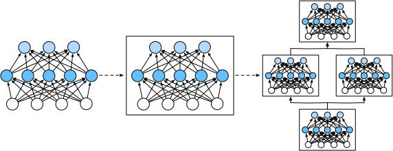

# Lớp và Mô-đun
<a id="sec_model_construction"></a>

Khi chúng ta lần đầu giới thiệu mạng nơ-ron,
chúng ta tập trung vào các mô hình tuyến tính với một đầu ra duy nhất.
Ở đây, toàn bộ mô hình chỉ bao gồm một nơ-ron duy nhất.
Lưu ý rằng một nơ-ron đơn lẻ
(i) nhận một tập hợp đầu vào;
(ii) tạo ra một đầu ra vô hướng tương ứng;
và (iii) có một tập hợp các tham số liên quan có thể được cập nhật
để tối ưu hóa một hàm mục tiêu nào đó.
Sau đó, khi chúng ta bắt đầu nghĩ về các mạng với nhiều đầu ra,
chúng ta đã tận dụng phép toán vectơ hóa
để đặc trưng hóa toàn bộ một lớp nơ-ron.
Giống như các nơ-ron riêng lẻ,
các lớp (i) nhận một tập hợp đầu vào,
(ii) tạo ra các đầu ra tương ứng,
và (iii) được mô tả bởi một tập hợp các tham số có thể điều chỉnh.
Khi chúng ta làm việc qua hồi quy softmax,
một lớp đơn lẻ chính là mô hình.
Tuy nhiên, ngay cả khi chúng ta sau đó
giới thiệu các MLP,
chúng ta vẫn có thể nghĩ về mô hình như
giữ lại cấu trúc cơ bản tương tự này.

Thú vị là, đối với các MLP,
cả mô hình toàn bộ và các lớp cấu thành
đều chia sẻ cấu trúc này.
Toàn bộ mô hình nhận đầu vào thô (các đặc trưng),
tạo ra đầu ra (các dự đoán),
và sở hữu các tham số
(các tham số kết hợp từ tất cả các lớp cấu thành).
Tương tự, mỗi lớp riêng lẻ tiêu thụ đầu vào
(được cung cấp bởi lớp trước)
tạo ra đầu ra (đầu vào cho lớp tiếp theo),
và sở hữu một tập hợp các tham số có thể điều chỉnh được cập nhật
theo tín hiệu lan truyền ngược
từ lớp tiếp theo.


Mặc dù bạn có thể nghĩ rằng nơ-ron, lớp, và mô hình
cung cấp cho chúng ta đủ các trừu tượng hóa để tiến hành công việc,
hóa ra chúng ta thường thấy thuận tiện
khi nói về các thành phần
lớn hơn một lớp riêng lẻ
nhưng nhỏ hơn toàn bộ mô hình.
Ví dụ, kiến trúc ResNet-152,
rất phổ biến trong thị giác máy tính,
sở hữu hàng trăm lớp.
Các lớp này bao gồm các mẫu lặp lại của *các nhóm lớp*. Cài đặt mạng như vậy từng lớp một có thể trở nên tẻ nhạt.
Mối lo ngại này không chỉ là giả thuyết---các
mẫu thiết kế như vậy rất phổ biến trong thực tế.
Kiến trúc ResNet được đề cập ở trên
đã giành chiến thắng cuộc thi thị giác máy tính ImageNet và COCO năm 2015
cho cả nhận dạng và phát hiện [He.Zhang.Ren.ea.2016]
và vẫn là kiến trúc được lựa chọn cho nhiều tác vụ thị giác.
Các kiến trúc tương tự trong đó các lớp được sắp xếp
trong các mẫu lặp lại khác nhau
hiện nay phổ biến ở các lĩnh vực khác,
bao gồm xử lý ngôn ngữ tự nhiên và giọng nói.

Để cài đặt các mạng phức tạp này,
chúng ta giới thiệu khái niệm *mô-đun* mạng nơ-ron.
Một mô-đun có thể mô tả một lớp đơn,
một thành phần bao gồm nhiều lớp,
hoặc toàn bộ mô hình!
Một lợi ích của việc làm việc với trừu tượng hóa mô-đun
là chúng có thể được kết hợp thành các tạo tác lớn hơn,
thường là đệ quy. Điều này được minh họa trong [fig_blocks](#fig_blocks). Bằng cách định nghĩa code để tạo ra các mô-đun
có độ phức tạp tùy ý theo yêu cầu,
chúng ta có thể viết code ngắn gọn đáng ngạc nhiên
và vẫn cài đặt các mạng nơ-ron phức tạp.


<a id="fig_blocks"></a>


Từ quan điểm lập trình, một mô-đun được đại diện bởi một *lớp (class)*.
Bất kỳ lớp con nào của nó phải định nghĩa một phương thức lan truyền xuôi
biến đổi đầu vào thành đầu ra
và phải lưu trữ bất kỳ tham số cần thiết nào.
Lưu ý rằng một số mô-đun không yêu cầu bất kỳ tham số nào.
Cuối cùng, một mô-đun phải sở hữu phương thức lan truyền ngược,
phục vụ mục đích tính toán gradient.
May mắn thay, do một số phép thuật hậu trường
được cung cấp bởi vi phân tự động
(được giới thiệu trong [sec_autograd](#sec_autograd))
khi định nghĩa mô-đun riêng của chúng ta,
chúng ta chỉ cần lo lắng về các tham số
và phương thức lan truyền xuôi.


```python
import torch
from torch import nn
from torch.nn import functional as F
```


[**Để bắt đầu, chúng ta xem lại code
mà chúng ta đã sử dụng để cài đặt MLP**]
([sec_mlp](#sec_mlp)).
Code sau tạo ra một mạng
với một lớp ẩn kết nối đầy đủ
với 256 đơn vị và kích hoạt ReLU,
theo sau bởi một lớp đầu ra kết nối đầy đủ
với mười đơn vị (không có hàm kích hoạt).


```python
net = nn.Sequential(nn.LazyLinear(256), nn.ReLU(), nn.LazyLinear(10))

X = torch.rand(2, 20)
net(X).shape
```


Trong ví dụ này, chúng ta đã xây dựng
mô hình bằng cách khởi tạo một `nn.Sequential`, với các lớp theo thứ tự
mà chúng nên được thực thi được truyền như đối số.
Tóm lại, (**`nn.Sequential` định nghĩa một loại `Module` đặc biệt**),
lớp đại diện cho một mô-đun trong PyTorch.
Nó duy trì một danh sách có thứ tự của các `Module` cấu thành.
Lưu ý rằng mỗi lớp kết nối đầy đủ là một thực thể của lớp `Linear`
bản thân nó là lớp con của `Module`.
Phương thức lan truyền xuôi (`forward`) cũng đơn giản đáng kể:
nó nối từng mô-đun trong danh sách lại với nhau,
truyền đầu ra của mỗi cái như đầu vào cho cái tiếp theo.
Lưu ý rằng cho đến bây giờ, chúng ta đã gọi mô hình của mình
thông qua cú pháp `net(X)` để lấy đầu ra của chúng.
Đây thực ra chỉ là cách viết tắt của `net.__call__(X)`.


## [**Mô-đun Tùy chỉnh**]

Có lẽ cách dễ nhất để phát triển trực giác
về cách một mô-đun hoạt động
là tự cài đặt một mô-đun.
Trước khi làm điều đó,
chúng ta tóm tắt ngắn gọn chức năng cơ bản
mà mỗi mô-đun phải cung cấp:


1. Tiêu thụ dữ liệu đầu vào như các đối số cho phương thức lan truyền xuôi của nó.
1. Tạo ra đầu ra bằng cách có phương thức lan truyền xuôi trả về một giá trị. Lưu ý rằng đầu ra có thể có hình dạng khác với đầu vào. Ví dụ, lớp kết nối đầy đủ đầu tiên trong mô hình của chúng ta ở trên tiêu thụ đầu vào có chiều tùy ý nhưng trả về đầu ra có chiều 256.
1. Tính toán gradient của đầu ra theo đầu vào của nó, có thể được truy cập thông qua phương thức lan truyền ngược của nó. Thông thường điều này xảy ra tự động.
1. Lưu trữ và cung cấp quyền truy cập vào các tham số cần thiết
   để thực thi tính toán lan truyền xuôi.
1. Khởi tạo các tham số mô hình khi cần.


Trong đoạn code sau,
chúng ta lập trình một mô-đun từ đầu
tương ứng với một MLP
với một lớp ẩn có 256 đơn vị ẩn,
và một lớp đầu ra 10 chiều.
Lưu ý rằng lớp `MLP` bên dưới kế thừa lớp đại diện cho một mô-đun.
Chúng ta sẽ phụ thuộc nhiều vào các phương thức của lớp cha,
chỉ cung cấp hàm khởi tạo riêng của chúng ta (phương thức `__init__` trong Python) và phương thức lan truyền xuôi.


```python
class MLP(nn.Module):
    def __init__(self):
        # Call the constructor of the parent class nn.Module to perform
        # the necessary initialization
        super().__init__()
        self.hidden = nn.LazyLinear(256)
        self.out = nn.LazyLinear(10)

    # Define the forward propagation of the model, that is, how to return the
    # required model output based on the input X
    def forward(self, X):
        return self.out(F.relu(self.hidden(X)))
```


Hãy tập trung vào phương thức lan truyền xuôi trước.
Lưu ý rằng nó nhận `X` như đầu vào,
tính toán biểu diễn ẩn
với hàm kích hoạt được áp dụng,
và xuất ra các logit của nó.
Trong cài đặt `MLP` này,
cả hai lớp đều là biến thực thể.
Để thấy tại sao điều này hợp lý, hãy tưởng tượng
khởi tạo hai MLP, `net1` và `net2`,
và huấn luyện chúng trên dữ liệu khác nhau.
Tự nhiên, chúng ta mong đợi chúng
đại diện cho hai mô hình đã học khác nhau.

Chúng ta [**khởi tạo các lớp của MLP**]
trong hàm khởi tạo
(**và sau đó gọi các lớp này**)
trên mỗi lần gọi phương thức lan truyền xuôi.
Lưu ý một vài chi tiết quan trọng.
Đầu tiên, phương thức `__init__` tùy chỉnh của chúng ta
gọi phương thức `__init__` của lớp cha
thông qua `super().__init__()`
giúp chúng ta tránh khỏi nỗi đau khi phải lặp lại
code mẫu áp dụng cho hầu hết các mô-đun.
Sau đó chúng ta khởi tạo hai lớp kết nối đầy đủ,
gán chúng cho `self.hidden` và `self.out`.
Lưu ý rằng trừ khi chúng ta cài đặt một lớp mới,
chúng ta không cần lo lắng về phương thức lan truyền ngược
hoặc khởi tạo tham số.
Hệ thống sẽ tự động tạo ra các phương thức này.
Hãy thử nghiệm điều này.


Một ưu điểm chính của trừu tượng hóa mô-đun là tính linh hoạt của nó.
Chúng ta có thể phân lớp con một mô-đun để tạo các lớp
(chẳng hạn như lớp kết nối đầy đủ),
toàn bộ mô hình (như lớp `MLP` ở trên),
hoặc các thành phần khác nhau có độ phức tạp trung gian.
Chúng ta khai thác tính linh hoạt này
trong suốt các chương tiếp theo,
chẳng hạn như khi giải quyết
mạng nơ-ron tích chập.


## [**Mô-đun Sequential**]
<a id="subsec_model-construction-sequential"></a>

Chúng ta có thể xem xét kỹ hơn
cách lớp `Sequential` hoạt động.
Hãy nhớ lại rằng `Sequential` được thiết kế
để nối các mô-đun khác lại với nhau.
Để xây dựng `MySequential` đơn giản hóa của riêng chúng ta,
chúng ta chỉ cần định nghĩa hai phương thức chính:

1. Một phương thức để thêm các mô-đun từng cái một vào một danh sách.
1. Một phương thức lan truyền xuôi để truyền đầu vào qua chuỗi mô-đun, theo cùng thứ tự chúng được thêm vào.

Lớp `MySequential` sau đây cung cấp cùng
chức năng của lớp `Sequential` mặc định.


```python
class MySequential(nn.Module):
    def __init__(self, *args):
        super().__init__()
        for idx, module in enumerate(args):
            self.add_module(str(idx), module)

    def forward(self, X):
        for module in self.children():            
            X = module(X)
        return X
```


Trong phương thức `__init__`, chúng ta thêm mỗi mô-đun
bằng cách gọi phương thức `add_modules`. Các mô-đun này có thể được truy cập bằng phương thức `children` sau đó.
Theo cách này hệ thống biết các mô-đun đã được thêm vào,
và nó sẽ khởi tạo đúng tham số của mỗi mô-đun.

Khi phương thức lan truyền xuôi của `MySequential` được gọi,
mỗi mô-đun được thêm vào được thực thi
theo thứ tự chúng được thêm vào.
Chúng ta bây giờ có thể tái cài đặt một MLP
bằng lớp `MySequential` của chúng ta.


```python
net = MySequential(nn.LazyLinear(256), nn.ReLU(), nn.LazyLinear(10))
net(X).shape
```


Lưu ý rằng cách sử dụng `MySequential` này
giống hệt với code chúng ta đã viết trước đó
cho lớp `Sequential`
(như mô tả trong [sec_mlp](#sec_mlp)).


## [**Thực thi Code trong Phương thức Lan truyền Xuôi**]

Lớp `Sequential` giúp xây dựng mô hình dễ dàng,
cho phép chúng ta lắp ráp các kiến trúc mới
mà không cần định nghĩa lớp riêng.
Tuy nhiên, không phải tất cả các kiến trúc đều là các chuỗi đơn giản.
Khi cần linh hoạt hơn,
chúng ta sẽ muốn định nghĩa các block của riêng mình.
Ví dụ, chúng ta có thể muốn thực thi
luồng điều khiển của Python trong phương thức lan truyền xuôi.
Hơn nữa, chúng ta có thể muốn thực hiện
các phép toán toán học tùy ý,
không chỉ dựa vào các lớp mạng nơ-ron được định nghĩa sẵn.

Bạn có thể nhận thấy rằng cho đến nay,
tất cả các phép toán trong mạng của chúng ta
đã tác động lên kích hoạt của mạng
và các tham số của nó.
Đôi khi, tuy nhiên, chúng ta có thể muốn
kết hợp các số hạng
không phải là kết quả của các lớp trước đó
cũng không phải là các tham số có thể cập nhật.
Chúng ta gọi những thứ này là *tham số hằng số*.
Ví dụ, giả sử chúng ta muốn một lớp
tính toán hàm
$f(\mathbf{x},\mathbf{w}) = c \cdot \mathbf{w}^\top \mathbf{x}$,
trong đó $\mathbf{x}$ là đầu vào, $\mathbf{w}$ là tham số của chúng ta,
và $c$ là một hằng số được chỉ định
không được cập nhật trong quá trình tối ưu hóa.
Vì vậy chúng ta cài đặt lớp `FixedHiddenMLP` như sau.


```python
class FixedHiddenMLP(nn.Module):
    def __init__(self):
        super().__init__()
        # Random weight parameters that will not compute gradients and
        # therefore keep constant during training
        self.rand_weight = torch.rand((20, 20))
        self.linear = nn.LazyLinear(20)

    def forward(self, X):
        X = self.linear(X)        
        X = F.relu(X @ self.rand_weight + 1)
        # Reuse the fully connected layer. This is equivalent to sharing
        # parameters with two fully connected layers
        X = self.linear(X)
        # Control flow
        while X.abs().sum() > 1:
            X /= 2
        return X.sum()
```


Trong mô hình này,
chúng ta cài đặt một lớp ẩn có trọng số
(`self.rand_weight`) được khởi tạo ngẫu nhiên
tại thời điểm khởi tạo và sau đó là hằng số.
Trọng số này không phải là tham số mô hình
và do đó nó không bao giờ được cập nhật bởi lan truyền ngược.
Sau đó mạng truyền đầu ra của lớp "cố định" này
qua một lớp kết nối đầy đủ.

Lưu ý rằng trước khi trả về đầu ra,
mô hình của chúng ta đã làm một điều bất thường.
Chúng ta chạy một vòng lặp while, kiểm tra
điều kiện chuẩn $\ell_1$ của nó lớn hơn $1$,
và chia vectơ đầu ra cho $2$
cho đến khi nó thỏa mãn điều kiện.
Cuối cùng, chúng ta trả về tổng các phần tử trong `X`.
Theo hiểu biết của chúng ta, không có mạng nơ-ron tiêu chuẩn nào
thực hiện phép toán này.
Lưu ý rằng thao tác cụ thể này có thể không hữu ích
trong bất kỳ tác vụ thực tế nào.
Điểm của chúng ta chỉ là để cho bạn thấy cách tích hợp
code tùy ý vào luồng của các
tính toán mạng nơ-ron của bạn.


Chúng ta có thể [**kết hợp và ghép các cách khác nhau
để lắp ráp các mô-đun lại với nhau.**]
Trong ví dụ sau, chúng ta lồng các mô-đun
theo những cách sáng tạo.


```python
class NestMLP(nn.Module):
    def __init__(self):
        super().__init__()
        self.net = nn.Sequential(nn.LazyLinear(64), nn.ReLU(),
                                 nn.LazyLinear(32), nn.ReLU())
        self.linear = nn.LazyLinear(16)

    def forward(self, X):
        return self.linear(self.net(X))

chimera = nn.Sequential(NestMLP(), nn.LazyLinear(20), FixedHiddenMLP())
chimera(X)
```


## Tóm tắt

Các lớp riêng lẻ có thể là các mô-đun.
Nhiều lớp có thể tạo thành một mô-đun.
Nhiều mô-đun có thể tạo thành một mô-đun.

Một mô-đun có thể chứa code.
Các mô-đun xử lý rất nhiều công việc dọn dẹp, bao gồm khởi tạo tham số và lan truyền ngược.
Việc nối tuần tự các lớp và mô-đun được xử lý bởi mô-đun `Sequential`.


## Bài tập

1. Những loại vấn đề gì sẽ xảy ra nếu bạn thay đổi `MySequential` để lưu trữ các mô-đun trong một danh sách Python?
1. Cài đặt một mô-đun nhận hai mô-đun làm đối số, giả sử `net1` và `net2` và trả về đầu ra nối của cả hai mạng trong lan truyền xuôi. Điều này còn được gọi là *mô-đun song song*.
1. Giả sử bạn muốn nối nhiều thực thể của cùng một mạng. Cài đặt một hàm nhà máy tạo ra nhiều thực thể của cùng một mô-đun và xây dựng một mạng lớn hơn từ nó.


[Discussions](https://discuss.d2l.ai/t/55)
