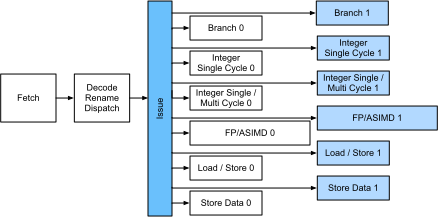
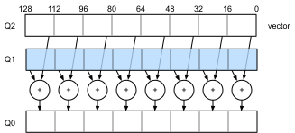
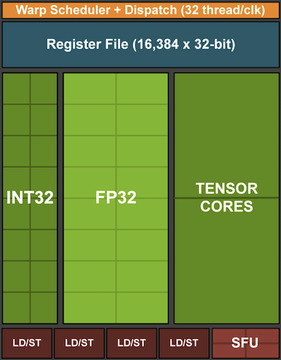

# Phần Cứng

Xây dựng các hệ thống có hiệu năng cao đòi hỏi hiểu rõ các thuật toán và mô hình để nắm bắt các khía cạnh thống kê của bài toán. Đồng thời, việc có ít nhất một chút kiến thức về phần cứng bên dưới cũng là điều không thể thiếu. Phần hiện tại không thay thế cho một khóa học đúng nghĩa về phần cứng và thiết kế hệ thống. Thay vào đó, nó có thể đóng vai trò là điểm khởi đầu để hiểu vì sao một số thuật toán hiệu quả hơn các thuật toán khác và cách đạt thông lượng tốt. Một thiết kế tốt có thể dễ dàng tạo ra khác biệt ở mức một bậc độ lớn, và đến lượt nó, điều này có thể tạo ra khác biệt giữa việc có thể huấn luyện một mạng (ví dụ trong một tuần) và hoàn toàn không thể (trong 3 tháng, do đó lỡ hạn chót).
Chúng ta sẽ bắt đầu bằng cách xem xét máy tính. Sau đó, chúng ta sẽ phóng to để xem xét kỹ hơn CPU và GPU. Cuối cùng, chúng ta thu nhỏ lại để xem cách nhiều máy tính được kết nối trong một trung tâm máy chủ hoặc trên đám mây.

Độc giả nóng vội có thể chỉ cần xem [fig_latencynumbers](#fig_latencynumbers). Hình này được lấy từ [bài viết tương tác](https://people.eecs.berkeley.edu/%7Ercs/research/interactive_latency.html) của Colin Scott, cung cấp một tổng quan tốt về tiến bộ trong thập kỷ qua. Các con số gốc đến từ [bài nói chuyện Stanford năm 2010](https://static.googleusercontent.com/media/research.google.com/en//people/jeff/Stanford-DL-Nov-2010.pdf) của Jeff Dean.
Thảo luận dưới đây giải thích một phần cơ sở của các con số này và cách chúng có thể hướng dẫn chúng ta thiết kế thuật toán. Thảo luận bên dưới ở mức rất cao và sơ lược. Nó rõ ràng *không thay thế* cho một khóa học đúng nghĩa mà chỉ nhằm cung cấp đủ thông tin để một người xây dựng mô hình thống kê đưa ra các quyết định thiết kế phù hợp. Để có tổng quan sâu về kiến trúc máy tính, chúng tôi giới thiệu độc giả đến [Hennessy.Patterson.2011] hoặc một khóa học gần đây về chủ đề này, chẳng hạn khóa của [Arste Asanovic](http://inst.eecs.berkeley.edu/%7Ecs152/sp19/).

## Máy Tính

Hầu hết các nhà nghiên cứu và người thực hành deep learning đều có quyền truy cập vào một máy tính có lượng bộ nhớ, năng lực tính toán kha khá, một dạng bộ tăng tốc như GPU, hoặc nhiều bộ tăng tốc như vậy. Một máy tính gồm các thành phần chính sau:

* Một bộ xử lý (còn gọi là CPU) có khả năng thực thi các chương trình mà chúng ta đưa cho nó (ngoài việc chạy hệ điều hành và nhiều thứ khác), thường gồm 8 lõi trở lên.
* Bộ nhớ (RAM) để lưu và truy xuất kết quả từ tính toán, chẳng hạn các vector trọng số và activation, cũng như dữ liệu huấn luyện.
* Một kết nối mạng Ethernet (đôi khi nhiều kết nối) với tốc độ từ 1 GB/s đến 100 GB/s. Trên các máy chủ cao cấp, có thể tìm thấy các liên kết nâng cao hơn.
* Một bus mở rộng tốc độ cao (PCIe) để kết nối hệ thống với một hoặc nhiều GPU. Máy chủ có tối đa 8 bộ tăng tốc, thường được kết nối theo một topology nâng cao, trong khi hệ thống desktop có 1 hoặc 2, tùy ngân sách của người dùng và kích thước bộ nguồn.
* Lưu trữ bền vững, chẳng hạn ổ đĩa cứng từ tính hoặc ổ đĩa thể rắn, trong nhiều trường hợp được kết nối bằng bus PCIe. Nó cung cấp khả năng truyền dữ liệu huấn luyện hiệu quả vào hệ thống và lưu các checkpoint trung gian khi cần.

Như [fig_mobo-symbol](#fig_mobo-symbol) chỉ ra, hầu hết các thành phần (mạng, GPU và lưu trữ) được kết nối với CPU qua bus PCIe. Bus này gồm nhiều lane được gắn trực tiếp với CPU. Chẳng hạn, Threadripper 3 của AMD có 64 lane PCIe 4.0, mỗi lane có khả năng truyền dữ liệu 16 Gbit/s theo cả hai hướng. Bộ nhớ được gắn trực tiếp với CPU với tổng băng thông lên tới 100 GB/s.

Khi chạy mã trên máy tính, chúng ta cần chuyển dữ liệu đến các bộ xử lý (CPU hoặc GPU), thực hiện tính toán, rồi chuyển kết quả ra khỏi bộ xử lý trở lại RAM và lưu trữ bền vững. Do đó, để đạt hiệu năng tốt, chúng ta cần đảm bảo rằng việc này diễn ra trơn tru mà không có hệ thống nào trở thành nút thắt lớn. Chẳng hạn, nếu không thể tải ảnh đủ nhanh, bộ xử lý sẽ không có việc để làm. Tương tự, nếu không thể chuyển ma trận đủ nhanh đến CPU (hoặc GPU), các phần tử xử lý của nó sẽ bị thiếu dữ liệu. Cuối cùng, nếu muốn đồng bộ nhiều máy tính qua mạng, mạng không nên làm chậm tính toán. Một lựa chọn là xen kẽ giao tiếp và tính toán. Hãy xem xét chi tiết hơn các thành phần khác nhau.

## Bộ Nhớ

Ở mức cơ bản nhất, bộ nhớ được dùng để lưu dữ liệu cần truy cập sẵn. Hiện nay RAM CPU thường thuộc loại [DDR4](https://en.wikipedia.org/wiki/DDR4_SDRAM), cung cấp băng thông 20--25 GB/s cho mỗi module. Mỗi module có bus rộng 64 bit. Thông thường các cặp module bộ nhớ được dùng để cho phép nhiều kênh. CPU có từ 2 đến 4 kênh bộ nhớ, tức là có băng thông bộ nhớ đỉnh từ 40 GB/s đến 100 GB/s. Thường có hai bank trên mỗi kênh. Chẳng hạn Zen 3 Threadripper của AMD có 8 khe.

Mặc dù những con số này ấn tượng, chúng thực ra chỉ kể một phần câu chuyện. Khi muốn đọc một phần từ bộ nhớ, trước tiên chúng ta cần cho module bộ nhớ biết thông tin nằm ở đâu. Tức là, trước hết chúng ta cần gửi *địa chỉ* đến RAM. Khi việc này hoàn tất, chúng ta có thể chọn đọc chỉ một bản ghi 64 bit hoặc một chuỗi bản ghi dài. Trường hợp sau được gọi là *đọc burst*. Tóm lại, gửi địa chỉ đến bộ nhớ và thiết lập truyền dữ liệu mất khoảng 100 ns (chi tiết phụ thuộc vào các hệ số thời gian cụ thể của chip nhớ được dùng), mỗi lần truyền tiếp theo chỉ mất 0.2 ns. Nói ngắn gọn, lần đọc đầu tiên đắt gấp 500 lần các lần sau! Lưu ý rằng chúng ta có thể thực hiện tới 10,000,000 lần đọc ngẫu nhiên mỗi giây. Điều này gợi ý rằng nên tránh truy cập bộ nhớ ngẫu nhiên hết mức có thể và dùng đọc (và ghi) burst thay vào đó.

Vấn đề phức tạp hơn một chút khi tính đến việc chúng ta có nhiều *bank*. Mỗi bank có thể đọc bộ nhớ phần lớn độc lập. Điều này có hai ý nghĩa.
Một mặt, số lần đọc ngẫu nhiên hiệu dụng có thể cao hơn tới 4 lần, miễn là chúng được phân bố đều trên bộ nhớ. Nó cũng có nghĩa rằng thực hiện đọc ngẫu nhiên vẫn là ý tưởng tệ vì đọc burst cũng nhanh hơn 4 lần. Mặt khác, do căn chỉnh bộ nhớ theo ranh giới 64 bit, nên căn chỉnh mọi cấu trúc dữ liệu theo cùng các ranh giới là một ý tưởng tốt. Trình biên dịch làm việc này gần như [tự động](https://en.wikipedia.org/wiki/Data_structure_alignment) khi đặt các cờ phù hợp. Độc giả tò mò được khuyến khích xem một bài giảng về DRAM, chẳng hạn bài của [Zeshan Chishti](http://web.cecs.pdx.edu/%7Ezeshan/ece585_lec5.pdf).

Bộ nhớ GPU chịu yêu cầu băng thông còn cao hơn vì chúng có nhiều phần tử xử lý hơn CPU. Nhìn chung có hai lựa chọn để đáp ứng chúng. Thứ nhất là làm bus bộ nhớ rộng hơn đáng kể. Chẳng hạn, RTX 2080 Ti của NVIDIA có bus rộng 352 bit. Điều này cho phép truyền nhiều thông tin hơn cùng lúc. Thứ hai, GPU dùng bộ nhớ hiệu năng cao chuyên biệt. Các thiết bị phổ thông, chẳng hạn dòng RTX và Titan của NVIDIA, thường dùng chip [GDDR6](https://en.wikipedia.org/wiki/GDDR6_SDRAM) với băng thông tổng hợp trên 500 GB/s. Một lựa chọn khác là dùng các module HBM (high bandwidth memory). Chúng dùng giao diện rất khác và kết nối trực tiếp với GPU trên một wafer silicon chuyên dụng. Điều này khiến chúng rất đắt và việc dùng chúng thường giới hạn ở các chip máy chủ cao cấp, chẳng hạn dòng bộ tăng tốc NVIDIA Volta V100. Không có gì ngạc nhiên khi bộ nhớ GPU nói chung *nhỏ hơn nhiều* so với bộ nhớ CPU do chi phí cao hơn của loại trước. Với mục đích của chúng ta, nhìn chung đặc tính hiệu năng của chúng tương tự, chỉ nhanh hơn rất nhiều. Chúng ta có thể an toàn bỏ qua chi tiết cho mục đích của cuốn sách này. Chúng chỉ quan trọng khi tinh chỉnh kernel GPU để đạt thông lượng cao.

## Lưu Trữ

Chúng ta đã thấy rằng một số đặc tính chính của RAM là *băng thông* và *độ trễ*. Điều tương tự cũng đúng với các thiết bị lưu trữ, chỉ là khác biệt có thể còn cực đoan hơn.

### Ổ Đĩa Cứng

*Ổ đĩa cứng* (HDD) đã được dùng hơn nửa thế kỷ. Tóm lại, chúng chứa một số đĩa quay với các đầu đọc có thể được định vị để đọc hoặc ghi tại bất kỳ track nào. Các đĩa cao cấp chứa tới 16 TB trên 9 platter. Một trong những lợi ích chính của HDD là chúng tương đối rẻ. Một trong nhiều nhược điểm của chúng là các chế độ hỏng hóc thường rất nghiêm trọng và độ trễ đọc tương đối cao.

Để hiểu điều sau, hãy xét sự kiện rằng HDD quay ở khoảng 7,200 RPM (vòng mỗi phút). Nếu quay nhanh hơn nhiều, chúng sẽ vỡ do lực ly tâm tác dụng lên platter. Điều này có một nhược điểm lớn khi truy cập một sector cụ thể trên đĩa: chúng ta cần đợi cho đến khi platter quay đến vị trí (chúng ta có thể di chuyển đầu đọc nhưng không thể tăng tốc các đĩa thực sự). Do đó có thể mất hơn 8 ms cho đến khi dữ liệu được yêu cầu sẵn sàng. Một cách phổ biến để diễn đạt điều này là nói rằng HDD có thể hoạt động ở khoảng 100 IOPs (thao tác vào/ra mỗi giây). Con số này về cơ bản không thay đổi trong hai thập kỷ qua. Tệ hơn nữa, việc tăng băng thông cũng khó không kém (ở mức khoảng 100--200 MB/s). Sau cùng, mỗi đầu đọc một track bit, nên tốc độ bit chỉ tăng theo căn bậc hai của mật độ thông tin. Kết quả là HDD nhanh chóng bị đẩy về vai trò lưu trữ lưu trữ lâu dài và lưu trữ cấp thấp cho các tập dữ liệu rất lớn.

### Ổ Đĩa Thể Rắn

Ổ đĩa thể rắn (SSD) dùng bộ nhớ flash để lưu thông tin bền vững. Điều này cho phép truy cập các bản ghi đã lưu *nhanh hơn nhiều*. SSD hiện đại có thể hoạt động ở 100,000 đến 500,000 IOPs, tức là nhanh hơn HDD tới 3 bậc độ lớn. Hơn nữa, băng thông của chúng có thể đạt 1--3GB/s, tức là nhanh hơn HDD một bậc độ lớn. Những cải thiện này nghe gần như quá tốt để là thật. Thực vậy, chúng đi kèm các lưu ý sau do cách SSD được thiết kế.

* SSD lưu thông tin theo block (256 KB hoặc lớn hơn). Chúng chỉ có thể được ghi nguyên block, việc này mất thời gian đáng kể. Do đó, ghi ngẫu nhiên theo bit trên SSD có hiệu năng rất kém. Tương tự, ghi dữ liệu nói chung mất thời gian đáng kể vì block phải được đọc, xóa rồi ghi lại với thông tin mới. Đến nay, bộ điều khiển và firmware SSD đã phát triển các thuật toán để giảm nhẹ điều này. Tuy vậy, ghi có thể chậm hơn nhiều, đặc biệt với SSD QLC (quad level cell). Chìa khóa để cải thiện hiệu năng là duy trì một *hàng đợi* thao tác, ưu tiên đọc và ghi theo block lớn nếu có thể.
* Các ô nhớ trong SSD hao mòn tương đối nhanh (thường chỉ sau vài nghìn lần ghi). Các thuật toán bảo vệ cân bằng hao mòn có thể phân tán sự suy giảm trên nhiều ô. Dù vậy, không nên dùng SSD cho file swap hoặc cho các tập hợp file log lớn.
* Cuối cùng, mức tăng băng thông rất lớn đã buộc các nhà thiết kế máy tính gắn SSD trực tiếp vào bus PCIe. Các ổ có khả năng xử lý điều này, gọi là NVMe (Non Volatile Memory enhanced), có thể dùng tới 4 lane PCIe. Điều này tương ứng tới 8GB/s trên PCIe 4.0.

### Lưu Trữ Đám Mây

Lưu trữ đám mây cung cấp một dải hiệu năng có thể cấu hình. Tức là, việc gán lưu trữ cho máy ảo là động, cả về số lượng lẫn tốc độ, theo lựa chọn của người dùng. Chúng tôi khuyến nghị người dùng tăng số IOPs được cấp phát bất cứ khi nào độ trễ quá cao, ví dụ trong quá trình huấn luyện với nhiều bản ghi nhỏ.

## CPU

Bộ xử lý trung tâm (CPU) là trung tâm của mọi máy tính. Chúng gồm một số thành phần chính: *lõi xử lý* có khả năng thực thi mã máy, một *bus* kết nối chúng (topology cụ thể khác biệt đáng kể giữa các mẫu, thế hệ và nhà cung cấp bộ xử lý), và *bộ nhớ đệm* để cho phép truy cập bộ nhớ với băng thông cao hơn và độ trễ thấp hơn so với đọc từ bộ nhớ chính. Cuối cùng, gần như tất cả CPU hiện đại đều chứa *đơn vị xử lý vector* để hỗ trợ đại số tuyến tính và tích chập hiệu năng cao, vốn phổ biến trong xử lý phương tiện và machine learning.

[fig_skylake](#fig_skylake) mô tả một CPU Intel Skylake bốn lõi cấp phổ thông. Nó có GPU tích hợp, bộ nhớ đệm và ringbus kết nối bốn lõi. Các thiết bị ngoại vi, chẳng hạn Ethernet, WiFi, Bluetooth, bộ điều khiển SSD và USB, hoặc là một phần của chipset hoặc được gắn trực tiếp (PCIe) vào CPU.

### Vi Kiến Trúc

Mỗi lõi xử lý gồm một tập thành phần khá tinh vi. Mặc dù chi tiết khác nhau giữa các thế hệ và nhà cung cấp, chức năng cơ bản gần như chuẩn. Front-end tải lệnh và cố dự đoán đường đi nào sẽ được chọn (ví dụ với luồng điều khiển). Sau đó, các lệnh được giải mã từ mã assembly thành vi lệnh. Mã assembly thường không phải là mã cấp thấp nhất mà bộ xử lý thực thi. Thay vào đó, các lệnh phức tạp có thể được giải mã thành một tập các thao tác cấp thấp hơn. Các thao tác này sau đó được xử lý bởi lõi thực thi thực sự. Thường thì lõi này có khả năng thực hiện nhiều thao tác đồng thời. Chẳng hạn, lõi ARM Cortex A77 trong [fig_cortexa77](#fig_cortexa77) có thể thực hiện tới 8 thao tác đồng thời.

Điều này có nghĩa là các chương trình hiệu quả có thể thực hiện hơn một lệnh trên mỗi chu kỳ xung nhịp, miễn là chúng có thể được thực hiện độc lập. Không phải mọi đơn vị đều giống nhau. Một số chuyên về lệnh số nguyên trong khi những đơn vị khác được tối ưu cho hiệu năng dấu phẩy động. Để tăng thông lượng, bộ xử lý cũng có thể theo nhiều đường mã đồng thời trong một lệnh rẽ nhánh rồi loại bỏ kết quả của các nhánh không được chọn. Đây là lý do các đơn vị dự đoán nhánh quan trọng (ở front-end), để chỉ các đường hứa hẹn nhất được theo đuổi.

### Vector Hóa

Deep learning cực kỳ đói tính toán. Vì vậy, để CPU phù hợp với machine learning, cần thực hiện nhiều phép toán trong một chu kỳ xung nhịp. Điều này đạt được thông qua các đơn vị vector. Chúng có các tên khác nhau: trên ARM chúng được gọi là NEON, trên x86 chúng (một thế hệ gần đây) được gọi là các đơn vị [AVX2](https://en.wikipedia.org/wiki/Advanced_Vector_Extensions). Một điểm chung là chúng có thể thực hiện các phép toán SIMD (single instruction multiple data). [fig_neon128](#fig_neon128) cho thấy cách 8 số nguyên ngắn có thể được cộng trong một chu kỳ xung nhịp trên ARM.

Tùy lựa chọn kiến trúc, các thanh ghi như vậy dài tới 512 bit, cho phép kết hợp tới 64 cặp số. Chẳng hạn, chúng ta có thể nhân hai số và cộng chúng vào số thứ ba, điều này còn được gọi là fused multiply-add. [OpenVino](https://01.org/openvinotoolkit) của Intel dùng chúng để đạt thông lượng đáng nể cho deep learning trên CPU cấp máy chủ. Tuy nhiên, lưu ý rằng con số này hoàn toàn bị lu mờ bởi những gì GPU có thể đạt được. Chẳng hạn, RTX 2080 Ti của NVIDIA có 4,352 lõi CUDA, mỗi lõi có khả năng xử lý một thao tác như vậy tại bất kỳ thời điểm nào.

### Bộ Nhớ Đệm

Xét tình huống sau: chúng ta có một lõi CPU khiêm tốn với 4 lõi như mô tả trong [fig_skylake](#fig_skylake) ở trên, chạy ở tần số 2 GHz.
Hơn nữa, giả sử chúng ta có số IPC (instructions per clock) là 1 và các đơn vị có AVX2 với độ rộng 256 bit được bật. Hãy giả sử thêm rằng ít nhất một trong các thanh ghi dùng cho thao tác AVX2 cần được lấy từ bộ nhớ. Điều này có nghĩa CPU tiêu thụ $4 \times 256 \textrm{ bit} = 128 \textrm{ bytes}$ dữ liệu mỗi chu kỳ xung nhịp. Trừ khi chúng ta có thể truyền $2 \times 10^9 \times 128 = 256 \times 10^9$ byte đến bộ xử lý mỗi giây, các phần tử xử lý sẽ bị thiếu dữ liệu. Đáng tiếc là giao diện bộ nhớ của một chip như vậy chỉ hỗ trợ truyền dữ liệu 20--40 GB/s, tức là thấp hơn một bậc độ lớn. Cách sửa là tránh tải dữ liệu *mới* từ bộ nhớ càng nhiều càng tốt và thay vào đó lưu đệm cục bộ trên CPU. Đây là lúc bộ nhớ đệm trở nên hữu ích. Thường các tên hoặc khái niệm sau được dùng:

* **Thanh ghi** nói nghiêm ngặt không phải là một phần của bộ nhớ đệm. Chúng giúp dàn dựng lệnh. Dù vậy, thanh ghi CPU là các vị trí bộ nhớ mà CPU có thể truy cập ở tốc độ xung nhịp mà không chịu phạt độ trễ. CPU có hàng chục thanh ghi. Việc dùng thanh ghi hiệu quả phụ thuộc vào trình biên dịch (hoặc lập trình viên). Chẳng hạn ngôn ngữ lập trình C có từ khóa `register`.
* **Bộ nhớ đệm L1** là tuyến phòng thủ đầu tiên chống lại yêu cầu băng thông bộ nhớ cao. Bộ nhớ đệm L1 rất nhỏ (kích thước điển hình có thể là 32--64 KB) và thường tách thành cache dữ liệu và cache lệnh. Khi dữ liệu được tìm thấy trong L1 cache, truy cập rất nhanh. Nếu không tìm thấy ở đó, quá trình tìm kiếm tiếp tục xuống hệ phân cấp cache.
* **Bộ nhớ đệm L2** là điểm dừng tiếp theo. Tùy thiết kế kiến trúc và kích thước bộ xử lý, chúng có thể là độc quyền. Chúng có thể chỉ truy cập được bởi một lõi nhất định hoặc được chia sẻ giữa nhiều lõi. Bộ nhớ đệm L2 lớn hơn (thường 256--512 KB mỗi lõi) và chậm hơn L1. Hơn nữa, để truy cập thứ gì đó trong L2, trước hết chúng ta cần kiểm tra để nhận ra rằng dữ liệu không nằm trong L1, điều này thêm một lượng độ trễ nhỏ.
* **Bộ nhớ đệm L3** được chia sẻ giữa nhiều lõi và có thể khá lớn. CPU máy chủ Epyc 3 của AMD có tới 256 MB cache trải trên nhiều chiplet. Các con số điển hình hơn nằm trong khoảng 4--8 MB.

Dự đoán phần tử bộ nhớ nào sẽ cần tiếp theo là một trong những tham số tối ưu hóa chính trong thiết kế chip. Chẳng hạn, nên duyệt bộ nhớ theo hướng *tiến* vì hầu hết thuật toán cache sẽ cố *đọc trước* theo hướng tiến thay vì lùi. Tương tự, giữ các mẫu truy cập bộ nhớ cục bộ là một cách tốt để cải thiện hiệu năng.

Thêm bộ nhớ đệm là con dao hai lưỡi. Một mặt, chúng đảm bảo các lõi xử lý không bị thiếu dữ liệu. Đồng thời, chúng làm tăng kích thước chip, dùng diện tích mà lẽ ra có thể dành cho việc tăng năng lực xử lý. Hơn nữa, *cache miss* có thể tốn kém. Xét trường hợp xấu nhất, *false sharing*, như mô tả trong [fig_falsesharing](#fig_falsesharing). Một vị trí bộ nhớ được cache trên bộ xử lý 0 khi một luồng trên bộ xử lý 1 yêu cầu dữ liệu. Để lấy nó, bộ xử lý 0 cần dừng việc đang làm, ghi thông tin trở lại bộ nhớ chính rồi cho phép bộ xử lý 1 đọc nó từ bộ nhớ. Trong thao tác này, cả hai bộ xử lý đều chờ. Rất có thể mã như vậy chạy *chậm hơn* trên nhiều bộ xử lý so với một cài đặt một bộ xử lý hiệu quả. Đây là một lý do nữa vì sao có giới hạn thực tế cho kích thước cache (bên cạnh kích thước vật lý của chúng).

## GPU và Các Bộ Tăng Tốc Khác

Không quá lời khi nói rằng deep learning sẽ không thành công nếu không có GPU. Tương tự, hoàn toàn hợp lý khi lập luận rằng vận may của các nhà sản xuất GPU đã tăng đáng kể nhờ deep learning. Sự đồng tiến hóa này của phần cứng và thuật toán đã dẫn đến tình huống mà dù tốt hay xấu, deep learning là mô hình thống kê được ưu tiên. Do đó, việc hiểu các lợi ích cụ thể mà GPU và các bộ tăng tốc liên quan như TPU [Jouppi.Young.Patil.ea.2017] mang lại là đáng giá.

Đáng chú ý là một phân biệt thường được đưa ra trong thực tế: bộ tăng tốc được tối ưu hoặc cho huấn luyện hoặc cho inference. Với inference, chúng ta chỉ cần tính lan truyền tiến trong mạng. Không cần lưu dữ liệu trung gian cho lan truyền ngược. Hơn nữa, chúng ta có thể không cần tính toán rất chính xác (FP16 hoặc INT8 thường đủ). Mặt khác, trong quá trình huấn luyện, tất cả kết quả trung gian cần được lưu để tính gradient. Hơn nữa, tích lũy gradient đòi hỏi độ chính xác cao hơn để tránh tràn dưới (hoặc tràn trên) số học. Điều này có nghĩa FP16 (hoặc mixed precision với FP32) là yêu cầu tối thiểu. Tất cả những điều này đòi hỏi bộ nhớ nhanh hơn và lớn hơn (HBM2 so với GDDR6) cùng nhiều năng lực xử lý hơn. Chẳng hạn, GPU [Turing](https://devblogs.nvidia.com/nvidia-turing-architecture-in-depth/) T4 của NVIDIA được tối ưu cho inference trong khi GPU V100 phù hợp hơn cho huấn luyện.

Nhớ lại vector hóa như minh họa trong [fig_neon128](#fig_neon128). Thêm các đơn vị vector vào lõi xử lý cho phép chúng ta tăng thông lượng đáng kể. Ví dụ, trong [fig_neon128](#fig_neon128), chúng ta có thể thực hiện 16 phép toán đồng thời.
Thứ nhất,
nếu chúng ta thêm các thao tác tối ưu không chỉ cho phép toán giữa các vector mà còn giữa các ma trận thì sao? Chiến lược này dẫn đến tensor core (sẽ được đề cập ngay sau đây).
Thứ hai, nếu chúng ta thêm nhiều lõi hơn nữa thì sao? Tóm lại, hai chiến lược này tóm tắt các quyết định thiết kế trong GPU. [fig_turing_processing_block](#fig_turing_processing_block) cung cấp tổng quan về một khối xử lý cơ bản. Nó chứa 16 đơn vị số nguyên và 16 đơn vị dấu phẩy động. Ngoài ra, hai tensor core tăng tốc một tập con hẹp các thao tác bổ sung liên quan đến deep learning. Mỗi streaming multiprocessor gồm bốn khối như vậy.

Tiếp theo, 12 streaming multiprocessor được nhóm thành các cụm xử lý đồ họa, tạo nên các bộ xử lý TU102 cao cấp. Nhiều kênh bộ nhớ và một cache L2 bổ sung cho thiết lập này. [fig_turing](#fig_turing) có các chi tiết liên quan. Một trong những lý do thiết kế một thiết bị như vậy là các khối riêng lẻ có thể được thêm hoặc loại bỏ khi cần để cho phép chip gọn hơn và xử lý vấn đề yield (các module lỗi có thể không được kích hoạt). May mắn là việc lập trình các thiết bị như vậy được che giấu khá tốt khỏi nhà nghiên cứu deep learning thông thường bên dưới các lớp CUDA và mã framework. Cụ thể, nhiều hơn một chương trình hoàn toàn có thể được thực thi đồng thời trên GPU, miễn là có tài nguyên sẵn. Dù vậy, nên nhận thức các giới hạn của thiết bị để tránh chọn các mô hình không vừa với bộ nhớ thiết bị.

Một khía cạnh cuối cùng đáng đề cập chi tiết hơn là *tensor core*. Chúng là một ví dụ của xu hướng gần đây: thêm các mạch tối ưu hơn đặc biệt hiệu quả cho deep learning. Chẳng hạn, TPU thêm một systolic array [Kung.1988] để nhân ma trận nhanh. Ở đó, thiết kế nhằm hỗ trợ một số rất nhỏ (một trong thế hệ TPU đầu tiên) các thao tác lớn. Tensor core nằm ở đầu kia. Chúng được tối ưu cho các thao tác nhỏ liên quan đến ma trận từ $4 \times 4$ đến $16 \times 16$, tùy độ chính xác số. [fig_tensorcore](#fig_tensorcore) cung cấp tổng quan về các tối ưu hóa.

Rõ ràng khi tối ưu cho tính toán, chúng ta phải thực hiện một số thỏa hiệp. Một trong số đó là GPU không giỏi xử lý ngắt và dữ liệu thưa. Mặc dù có các ngoại lệ đáng chú ý, chẳng hạn [Gunrock](https://github.com/gunrock/gunrock) [Wang.Davidson.Pan.ea.2016], mẫu truy cập của ma trận và vector thưa không phù hợp với các thao tác đọc burst băng thông cao nơi GPU vượt trội. Kết hợp cả hai mục tiêu là một lĩnh vực nghiên cứu đang hoạt động. Xem ví dụ [DGL](http://dgl.ai), một thư viện được tinh chỉnh cho deep learning trên đồ thị.

## Mạng và Bus

Bất cứ khi nào một thiết bị đơn lẻ không đủ cho tối ưu hóa, chúng ta cần truyền dữ liệu đến và từ nó để đồng bộ xử lý. Đây là lúc mạng và bus trở nên hữu ích. Chúng ta có một số tham số thiết kế: băng thông, chi phí, khoảng cách và tính linh hoạt.
Ở một đầu, chúng ta có WiFi với phạm vi khá tốt, rất dễ dùng (dù sao cũng không có dây), rẻ nhưng cung cấp băng thông và độ trễ tương đối tầm thường. Không nhà nghiên cứu machine learning tỉnh táo nào sẽ dùng nó để xây dựng một cụm máy chủ. Trong phần sau, chúng ta tập trung vào các kết nối phù hợp cho deep learning.

* **PCIe** là một bus chuyên dụng cho các kết nối điểm-điểm băng thông rất cao (tới 32 GB/s trên PCIe 4.0 trong một khe 16 lane) trên mỗi lane. Độ trễ ở mức vài micro giây một chữ số (5 μs). Các liên kết PCIe rất quý. Bộ xử lý chỉ có số lượng giới hạn: EPYC 3 của AMD có 128 lane, Xeon của Intel có tới 48 lane mỗi chip; trên CPU cấp desktop, các con số tương ứng là 20 (Ryzen 9) và 16 (Core i9). Vì GPU thường có 16 lane, điều này giới hạn số GPU có thể kết nối với CPU ở băng thông đầy đủ. Sau cùng, chúng cần chia sẻ các liên kết với thiết bị ngoại vi băng thông cao khác như lưu trữ và Ethernet. Giống như truy cập RAM, truyền khối lớn được ưu tiên do giảm chi phí phụ của gói.
* **Ethernet** là cách phổ biến nhất để kết nối máy tính. Mặc dù chậm hơn đáng kể so với PCIe, nó rất rẻ, bền khi lắp đặt và bao phủ khoảng cách dài hơn nhiều. Băng thông điển hình cho máy chủ cấp thấp là 1 GBit/s. Thiết bị cao cấp hơn (ví dụ các [instance C5](https://aws.amazon.com/ec2/instance-types/c5/) trên đám mây) cung cấp băng thông từ 10 đến 100 GBit/s. Như trong mọi trường hợp trước, truyền dữ liệu có chi phí phụ đáng kể. Lưu ý rằng chúng ta gần như không bao giờ dùng Ethernet thô trực tiếp mà dùng một giao thức được thực thi trên kết nối vật lý (chẳng hạn UDP hoặc TCP/IP). Điều này thêm chi phí phụ. Giống PCIe, Ethernet được thiết kế để kết nối hai thiết bị, ví dụ một máy tính và một switch.
* **Switch** cho phép chúng ta kết nối nhiều thiết bị theo cách mà bất kỳ cặp nào cũng có thể thực hiện kết nối điểm-điểm (thường là băng thông đầy đủ) đồng thời. Chẳng hạn, các switch Ethernet có thể kết nối 40 máy chủ ở băng thông mặt cắt ngang cao. Lưu ý rằng switch không chỉ có trong mạng máy tính truyền thống. Ngay cả các lane PCIe cũng có thể được [switch](https://www.broadcom.com/products/pcie-switches-bridges/pcie-switches). Điều này xảy ra, ví dụ để kết nối số lượng lớn GPU với một bộ xử lý chủ, như trường hợp các [instance P2](https://aws.amazon.com/ec2/instance-types/p2/).
* **NVLink** là một lựa chọn thay cho PCIe khi nói đến các kết nối băng thông rất cao. Nó cung cấp tốc độ truyền dữ liệu tới 300 Gbit/s mỗi liên kết. GPU máy chủ (Volta V100) có sáu liên kết trong khi GPU cấp phổ thông (RTX 2080 Ti) chỉ có một liên kết, hoạt động ở tốc độ giảm còn 100 Gbit/s. Chúng tôi khuyến nghị dùng [NCCL](https://github.com/NVIDIA/nccl) để đạt truyền dữ liệu cao giữa các GPU.

## Thêm Các Con Số Độ Trễ

Tóm tắt trong [table_latency_numbers](#table_latency_numbers) và [table_latency_numbers_tesla](#table_latency_numbers_tesla) lấy từ [Eliot Eshelman](https://gist.github.com/eshelman), người duy trì phiên bản cập nhật của các con số dưới dạng một [GitHub gist](https://gist.github.com/eshelman/343a1c46cb3fba142c1afdcdeec17646).

:Các con số độ trễ phổ biến.

| Hành động | Thời gian | Ghi chú |
| :----------------------------------------- | -----: | :---------------------------------------------- |
| Tham chiếu/trúng L1 cache                  | 1.5 ns | 4 chu kỳ                                        |
| Cộng/nhân/FMA dấu phẩy động                | 1.5 ns | 4 chu kỳ                                        |
| Tham chiếu/trúng L2 cache                  |   5 ns | 12 ~ 17 chu kỳ                                  |
| Dự đoán sai nhánh                          |   6 ns | 15 ~ 20 chu kỳ                                  |
| Trúng L3 cache (cache không chia sẻ)       |  16 ns | 42 chu kỳ                                       |
| Trúng L3 cache (chia sẻ ở lõi khác)        |  25 ns | 65 chu kỳ                                       |
| Khóa/mở khóa mutex                         |  25 ns |                                                 |
| Trúng L3 cache (đã sửa ở lõi khác)         |  29 ns | 75 chu kỳ                                       |
| Trúng L3 cache (trên socket CPU từ xa)     |  40 ns | 100 ~ 300 chu kỳ (40 ~ 116 ns)                  |
| QPI hop đến CPU khác (mỗi hop)             |  40 ns |                                                 |
| Tham chiếu bộ nhớ 64MB (CPU cục bộ)        |  46 ns | TinyMemBench trên Broadwell E5-2690v4           |
| Tham chiếu bộ nhớ 64MB (CPU từ xa)         |  70 ns | TinyMemBench trên Broadwell E5-2690v4           |
| Tham chiếu bộ nhớ 256MB (CPU cục bộ)       |  75 ns | TinyMemBench trên Broadwell E5-2690v4           |
| Ghi ngẫu nhiên Intel Optane                |  94 ns | UCSD Non-Volatile Systems Lab                   |
| Tham chiếu bộ nhớ 256MB (CPU từ xa)        | 120 ns | TinyMemBench trên Broadwell E5-2690v4           |
| Đọc ngẫu nhiên Intel Optane                | 305 ns | UCSD Non-Volatile Systems Lab                   |
| Gửi 4KB qua fabric HPC 100 Gbps            |   1 μs | MVAPICH2 qua Intel Omni-Path                    |
| Nén 1KB bằng Google Snappy                 |   3 μs |                                                 |
| Gửi 4KB qua ethernet 10 Gbps               |  10 μs |                                                 |
| Ghi ngẫu nhiên 4KB vào NVMe SSD            |  30 μs | DC P3608 NVMe SSD (QOS 99% là 500μs)            |
| Truyền 1MB đến/từ GPU NVLink               |  30 μs | ~33GB/s trên NVIDIA 40GB NVLink                 |
| Truyền 1MB đến/từ GPU PCI-E                |  80 μs | ~12GB/s trên liên kết PCIe 3.0 x16              |
| Đọc ngẫu nhiên 4KB từ NVMe SSD             | 120 μs | DC P3608 NVMe SSD (QOS 99%)                     |
| Đọc tuần tự 1MB từ NVMe SSD                | 208 μs | ~4.8GB/s DC P3608 NVMe SSD                      |
| Ghi ngẫu nhiên 4KB vào SATA SSD            | 500 μs | DC S3510 SATA SSD (QOS 99.9%)                   |
| Đọc ngẫu nhiên 4KB từ SATA SSD             | 500 μs | DC S3510 SATA SSD (QOS 99.9%)                   |
| Khứ hồi trong cùng trung tâm dữ liệu       | 500 μs | Ping một chiều là ~250μs                        |
| Đọc tuần tự 1MB từ SATA SSD                |   2 ms | ~550MB/s DC S3510 SATA SSD                      |
| Đọc tuần tự 1MB từ đĩa                     |   5 ms | ~200MB/s HDD máy chủ                            |
| Truy cập đĩa ngẫu nhiên (seek+rotation)    |  10 ms |                                                 |
| Gửi gói CA->Hà Lan->CA                     | 150 ms |                                                 |

:Các con số độ trễ cho GPU NVIDIA Tesla.

| Hành động | Thời gian | Ghi chú |
| :------------------------------ | -----: | :---------------------------------------- |
| Truy cập bộ nhớ chia sẻ GPU     |  30 ns | 30~90 chu kỳ (xung đột bank thêm độ trễ)  |
| Truy cập bộ nhớ toàn cục GPU    | 200 ns | 200~800 chu kỳ                            |
| Khởi chạy kernel CUDA trên GPU  |  10 μs | CPU chủ ra lệnh cho GPU bắt đầu kernel    |
| Truyền 1MB đến/từ GPU NVLink    |  30 μs | ~33GB/s trên NVIDIA 40GB NVLink           |
| Truyền 1MB đến/từ GPU PCI-E     |  80 μs | ~12GB/s trên liên kết PCI-Express x16     |

## Tóm Tắt

* Thiết bị có chi phí phụ cho các thao tác. Do đó, điều quan trọng là nhắm đến số lượng nhỏ các lần truyền lớn thay vì nhiều lần truyền nhỏ. Điều này áp dụng cho RAM, SSD, mạng và GPU.
* Vector hóa là chìa khóa cho hiệu năng. Hãy đảm bảo bạn biết các khả năng cụ thể của bộ tăng tốc của mình. Ví dụ, một số CPU Intel Xeon đặc biệt tốt cho các thao tác INT8, GPU NVIDIA Volta vượt trội ở các thao tác ma trận-ma trận FP16, và NVIDIA Turing tỏa sáng ở FP16, INT8 và INT4.
* Tràn số do kiểu dữ liệu nhỏ có thể là vấn đề trong quá trình huấn luyện (và ở mức độ ít hơn trong inference).
* Aliasing có thể làm suy giảm hiệu năng đáng kể. Chẳng hạn, căn chỉnh bộ nhớ trên CPU 64 bit nên được thực hiện theo các ranh giới 64 bit. Trên GPU, nên giữ kích thước tích chập được căn chỉnh, ví dụ theo tensor core.
* Hãy khớp thuật toán với phần cứng (ví dụ footprint bộ nhớ và băng thông). Có thể đạt tăng tốc lớn (nhiều bậc độ lớn) khi các tham số vừa trong cache.
* Chúng tôi khuyến nghị bạn phác thảo hiệu năng của một thuật toán mới trên giấy trước khi xác minh kết quả thí nghiệm. Chênh lệch ở mức một bậc độ lớn hoặc hơn là lý do đáng lo.
* Dùng profiler để gỡ lỗi các nút thắt hiệu năng.
* Phần cứng huấn luyện và inference có các điểm tối ưu khác nhau về giá và hiệu năng.

## Bài Tập

1. Viết mã C để kiểm tra liệu có khác biệt tốc độ nào giữa truy cập bộ nhớ được căn chỉnh hoặc không căn chỉnh so với giao diện bộ nhớ ngoài hay không. Gợi ý: hãy cẩn thận với hiệu ứng cache.
1. Kiểm tra khác biệt tốc độ giữa truy cập bộ nhớ theo tuần tự hoặc với một stride cho trước.
1. Làm thế nào bạn có thể đo kích thước cache trên CPU?
1. Bạn sẽ bố trí dữ liệu trên nhiều kênh bộ nhớ như thế nào để đạt băng thông tối đa? Bạn sẽ bố trí thế nào nếu có nhiều luồng nhỏ?
1. Một HDD cấp doanh nghiệp quay ở 10,000 rpm. Thời gian tối thiểu tuyệt đối mà một HDD cần bỏ ra trong trường hợp xấu nhất trước khi có thể đọc dữ liệu là bao nhiêu (bạn có thể giả sử đầu đọc di chuyển gần như tức thời)? Vì sao HDD 2.5" đang trở nên phổ biến cho máy chủ thương mại (so với ổ 3.5" và 5.25")?
1. Giả sử một nhà sản xuất HDD tăng mật độ lưu trữ từ 1 Tbit trên inch vuông lên 5 Tbit trên inch vuông. Bạn có thể lưu bao nhiêu thông tin trên một vòng của HDD 2.5"? Có khác biệt giữa các track trong và ngoài không?
1. Chuyển từ kiểu dữ liệu 8 bit sang 16 bit làm lượng silicon tăng xấp xỉ bốn lần. Vì sao? Vì sao NVIDIA có thể đã thêm thao tác INT4 vào GPU Turing của họ?
1. Đọc tiến qua bộ nhớ nhanh hơn bao nhiêu so với đọc lùi? Con số này có khác nhau giữa các máy tính và nhà cung cấp CPU khác nhau không? Vì sao? Hãy viết mã C và thí nghiệm với nó.
1. Bạn có thể đo kích thước cache của đĩa không? Với một HDD điển hình thì nó là bao nhiêu? SSD có cần cache không?
1. Đo chi phí phụ của gói khi gửi thông điệp qua Ethernet. Tra cứu khác biệt giữa kết nối UDP và TCP/IP.
1. Truy cập bộ nhớ trực tiếp cho phép các thiết bị ngoài CPU ghi (và đọc) trực tiếp vào (từ) bộ nhớ. Vì sao đây là một ý tưởng tốt?
1. Xem các con số hiệu năng của GPU Turing T4. Vì sao hiệu năng "chỉ" tăng gấp đôi khi chuyển từ FP16 sang INT8 và INT4?
1. Thời gian ngắn nhất mà một gói tin nên mất cho chuyến khứ hồi giữa San Francisco và Amsterdam là bao nhiêu? Gợi ý: bạn có thể giả sử khoảng cách là 10,000 km.

[Discussions](https://discuss.d2l.ai/t/363)
