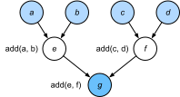

# Trình Biên Dịch và Trình Thông Dịch
<a id="sec_hybridize"></a>

Cho đến nay, cuốn sách này tập trung vào lập trình mệnh lệnh, vốn dùng các câu lệnh như `print`, `+` và `if` để thay đổi trạng thái của chương trình. Hãy xét ví dụ sau về một chương trình mệnh lệnh đơn giản.

```python
#@tab all
def add(a, b):
    return a + b

def fancy_func(a, b, c, d):
    e = add(a, b)
    f = add(c, d)
    g = add(e, f)
    return g

print(fancy_func(1, 2, 3, 4))
```

Python là một *ngôn ngữ thông dịch*. Khi đánh giá hàm `fancy_func` ở trên, nó thực hiện các thao tác tạo nên thân hàm *theo trình tự*. Tức là, nó sẽ đánh giá `e = add(a, b)` và lưu kết quả dưới dạng biến `e`, qua đó thay đổi trạng thái của chương trình. Hai câu lệnh tiếp theo `f = add(c, d)` và `g = add(e, f)` sẽ được thực thi tương tự, thực hiện phép cộng và lưu kết quả dưới dạng biến. [fig_compute_graph](#fig_compute_graph) minh họa luồng dữ liệu.


<a id="fig_compute_graph"></a>

Mặc dù lập trình mệnh lệnh tiện lợi, nó có thể kém hiệu quả. Một mặt, ngay cả khi hàm `add` được gọi lặp lại trong `fancy_func`, Python sẽ thực thi ba lời gọi hàm riêng lẻ. Nếu các lời gọi này được thực thi, chẳng hạn trên GPU (hoặc thậm chí trên nhiều GPU), chi phí phụ phát sinh từ trình thông dịch Python có thể trở nên áp đảo. Hơn nữa, nó sẽ cần lưu giá trị biến của `e` và `f` cho đến khi tất cả các câu lệnh trong `fancy_func` đã được thực thi. Lý do là chúng ta không biết liệu các biến `e` và `f` có được các phần khác của chương trình sử dụng sau khi các câu lệnh `e = add(a, b)` và `f = add(c, d)` được thực thi hay không.

## Lập Trình Ký Hiệu

Hãy xét lựa chọn thay thế, *lập trình ký hiệu*, trong đó tính toán thường chỉ được thực hiện sau khi quy trình đã được định nghĩa đầy đủ. Chiến lược này được nhiều framework deep learning dùng, bao gồm Theano và TensorFlow (framework sau đã có các phần mở rộng mệnh lệnh). Nó thường bao gồm các bước sau:

1. Định nghĩa các thao tác cần thực thi.
1. Biên dịch các thao tác thành một chương trình có thể thực thi.
1. Cung cấp các đầu vào cần thiết và gọi chương trình đã biên dịch để thực thi.

Điều này cho phép tối ưu hóa đáng kể. Thứ nhất, trong nhiều trường hợp chúng ta có thể bỏ qua trình thông dịch Python, từ đó loại bỏ một nút thắt hiệu năng có thể trở nên đáng kể trên nhiều GPU nhanh đi kèm một luồng Python đơn trên CPU.
Thứ hai, một trình biên dịch có thể tối ưu và viết lại mã ở trên thành `print((1 + 2) + (3 + 4))` hoặc thậm chí `print(10)`. Điều này khả thi vì trình biên dịch nhìn thấy toàn bộ mã trước khi chuyển nó thành lệnh máy. Chẳng hạn, nó có thể giải phóng bộ nhớ (hoặc không bao giờ cấp phát) bất cứ khi nào một biến không còn cần thiết. Hoặc nó có thể biến đổi toàn bộ mã thành một đoạn tương đương.
Để có ý tưởng tốt hơn, hãy xét mô phỏng lập trình mệnh lệnh sau (dù sao đây vẫn là Python).

```python
#@tab all
def add_():
    return '''
def add(a, b):
    return a + b
'''

def fancy_func_():
    return '''
def fancy_func(a, b, c, d):
    e = add(a, b)
    f = add(c, d)
    g = add(e, f)
    return g
'''

def evoke_():
    return add_() + fancy_func_() + 'print(fancy_func(1, 2, 3, 4))'

prog = evoke_()
print(prog)
y = compile(prog, '', 'exec')
exec(y)
```

Các khác biệt giữa lập trình mệnh lệnh (thông dịch) và lập trình ký hiệu như sau:

* Lập trình mệnh lệnh dễ hơn. Khi dùng lập trình mệnh lệnh trong Python, phần lớn mã là trực tiếp và dễ viết. Mã lập trình mệnh lệnh cũng dễ gỡ lỗi hơn. Lý do là dễ lấy và in mọi giá trị biến trung gian liên quan, hoặc dùng các công cụ gỡ lỗi tích hợp của Python.
* Lập trình ký hiệu hiệu quả hơn và dễ chuyển sang môi trường khác hơn. Lập trình ký hiệu giúp tối ưu mã trong quá trình biên dịch dễ hơn, đồng thời có khả năng chuyển chương trình sang một định dạng độc lập với Python. Điều này cho phép chương trình chạy trong môi trường không phải Python, nhờ đó tránh mọi vấn đề hiệu năng tiềm tàng liên quan đến trình thông dịch Python.


## Lập Trình Lai

Trong lịch sử, hầu hết các framework deep learning chọn giữa cách tiếp cận mệnh lệnh hoặc ký hiệu. Ví dụ, Theano, TensorFlow (lấy cảm hứng từ Theano), Keras và CNTK biểu diễn mô hình theo ký hiệu. Ngược lại, Chainer và PyTorch chọn cách tiếp cận mệnh lệnh. Chế độ mệnh lệnh đã được thêm vào TensorFlow 2.0 và Keras trong các phiên bản sau.


Như đã đề cập ở trên, PyTorch dựa trên lập trình mệnh lệnh và dùng đồ thị tính toán động. Trong nỗ lực tận dụng tính di động và hiệu quả của lập trình ký hiệu, các nhà phát triển cân nhắc liệu có thể kết hợp lợi ích của cả hai mô thức lập trình hay không. Điều này dẫn đến torchscript, cho phép người dùng phát triển và gỡ lỗi bằng lập trình mệnh lệnh thuần túy, đồng thời có khả năng chuyển đổi phần lớn chương trình thành chương trình ký hiệu để chạy khi cần hiệu năng tính toán và triển khai cấp sản phẩm.


## Hybrid Hóa Lớp `Sequential`

Cách dễ nhất để cảm nhận cách hybrid hóa hoạt động là xét các mạng sâu có nhiều lớp. Theo thông lệ, trình thông dịch Python sẽ cần thực thi mã cho tất cả các lớp để sinh một lệnh, sau đó lệnh này có thể được chuyển tiếp đến CPU hoặc GPU. Với một thiết bị tính toán (nhanh) đơn lẻ, điều này không gây vấn đề lớn. Mặt khác, nếu chúng ta dùng một máy chủ 8 GPU nâng cao như instance AWS P3dn.24xlarge, Python sẽ gặp khó khăn trong việc giữ tất cả GPU luôn bận. Trình thông dịch Python đơn luồng trở thành nút thắt ở đây. Hãy xem cách xử lý điều này cho các phần đáng kể của mã bằng cách thay `Sequential` bằng `HybridSequential`. Chúng ta bắt đầu bằng cách định nghĩa một MLP đơn giản.

```python
#@tab mxnet
from d2l import mxnet as d2l
from mxnet import np, npx
from mxnet.gluon import nn
npx.set_np()

# Factory for networks
def get_net():
    net = nn.HybridSequential()  
    net.add(nn.Dense(256, activation='relu'),
            nn.Dense(128, activation='relu'),
            nn.Dense(2))
    net.initialize()
    return net

x = np.random.normal(size=(1, 512))
net = get_net()
net(x)
```

```python
#@tab pytorch
from d2l import torch as d2l
import torch
from torch import nn

# Factory for networks
def get_net():
    net = nn.Sequential(nn.Linear(512, 256),
            nn.ReLU(),
            nn.Linear(256, 128),
            nn.ReLU(),
            nn.Linear(128, 2))
    return net

x = torch.randn(size=(1, 512))
net = get_net()
net(x)
```

```python
#@tab tensorflow
from d2l import tensorflow as d2l
import tensorflow as tf
from tensorflow.keras.layers import Dense

# Factory for networks
def get_net():
    net = tf.keras.Sequential()
    net.add(Dense(256, input_shape = (512,), activation = "relu"))
    net.add(Dense(128, activation = "relu"))
    net.add(Dense(2, activation = "linear"))
    return net

x = tf.random.normal([1,512])
net = get_net()
net(x)
```


Bằng cách chuyển đổi mô hình bằng hàm `torch.jit.script`, chúng ta có thể biên dịch và tối ưu tính toán trong MLP. Kết quả tính toán của mô hình vẫn không đổi.


```python
#@tab mxnet
net.hybridize()
net(x)
```

```python
#@tab pytorch
net = torch.jit.script(net)
net(x)
```

```python
#@tab tensorflow
net = tf.function(net)
net(x)
```


Điều này có vẻ gần như quá tốt để là thật: viết cùng mã như trước và đơn giản chuyển đổi mô hình bằng `torch.jit.script`. Khi điều này xảy ra, mạng được tối ưu (chúng ta sẽ benchmark hiệu năng bên dưới).


### Tăng Tốc Bằng Hybrid Hóa

Để chứng minh cải thiện hiệu năng thu được nhờ biên dịch, chúng ta so sánh thời gian cần để đánh giá `net(x)` trước và sau hybrid hóa. Trước hết hãy định nghĩa một lớp để đo thời gian này. Nó sẽ hữu ích xuyên suốt chương khi chúng ta đo (và cải thiện) hiệu năng.

```python
#@tab all
class Benchmark:
    """For measuring running time."""
    def __init__(self, description='Done'):
        self.description = description

    def __enter__(self):
        self.timer = d2l.Timer()
        return self

    def __exit__(self, *args):
        print(f'{self.description}: {self.timer.stop():.4f} sec')
```


Bây giờ chúng ta có thể gọi mạng hai lần, một lần không có torchscript và một lần có torchscript.


```python
#@tab mxnet
net = get_net()
with Benchmark('Without hybridization'):
    for i in range(1000): net(x)
    npx.waitall()

net.hybridize()
with Benchmark('With hybridization'):
    for i in range(1000): net(x)
    npx.waitall()
```

```python
#@tab pytorch
net = get_net()
with Benchmark('Without torchscript'):
    for i in range(1000): net(x)

net = torch.jit.script(net)
with Benchmark('With torchscript'):
    for i in range(1000): net(x)
```

```python
#@tab tensorflow
net = get_net()
with Benchmark('Eager Mode'):
    for i in range(1000): net(x)

net = tf.function(net)
with Benchmark('Graph Mode'):
    for i in range(1000): net(x)
```


Như được quan sát trong các kết quả ở trên, sau khi một thể hiện `nn.Sequential` được script hóa bằng hàm `torch.jit.script`, hiệu năng tính toán được cải thiện thông qua việc dùng lập trình ký hiệu.


### Tuần Tự Hóa


Một trong những lợi ích của việc biên dịch mô hình là chúng ta có thể tuần tự hóa (lưu) mô hình và các tham số của nó ra đĩa. Điều này cho phép chúng ta lưu mô hình theo cách độc lập với ngôn ngữ front-end được chọn. Điều này cho phép chúng ta triển khai các mô hình đã huấn luyện sang thiết bị khác và dễ dàng dùng các ngôn ngữ lập trình front-end khác. Đồng thời mã thường nhanh hơn so với những gì có thể đạt được trong lập trình mệnh lệnh. Hãy xem hàm `save` hoạt động.


```python
#@tab mxnet
net.export('my_mlp')
!ls -lh my_mlp*
```

```python
#@tab pytorch
net.save('my_mlp')
!ls -lh my_mlp*
```

```python
#@tab tensorflow
net = get_net()
tf.saved_model.save(net, 'my_mlp')
!ls -lh my_mlp*
```


```python
#@tab mxnet
!head my_mlp-symbol.json
```


```python
#@tab mxnet
class HybridNet(nn.HybridBlock):
    def __init__(self, **kwargs):
        super(HybridNet, self).__init__(**kwargs)
        self.hidden = nn.Dense(4)
        self.output = nn.Dense(2)

    def hybrid_forward(self, F, x):
        print('module F: ', F)
        print('value  x: ', x)
        x = F.npx.relu(self.hidden(x))
        print('result  : ', x)
        return self.output(x)
```


```python
#@tab mxnet
net = HybridNet()
net.initialize()
x = np.random.normal(size=(1, 3))
net(x)
```


```python
#@tab mxnet
net.hybridize()
net(x)
```


```python
#@tab mxnet
net(x)
```


## Tóm Tắt


* Lập trình mệnh lệnh giúp dễ thiết kế mô hình mới vì có thể viết mã với luồng điều khiển và khả năng dùng một lượng lớn hệ sinh thái phần mềm Python.
* Lập trình ký hiệu đòi hỏi chúng ta chỉ định chương trình và biên dịch nó trước khi thực thi. Lợi ích là hiệu năng được cải thiện.


## Bài Tập


[Discussions](https://discuss.d2l.ai/t/2490)
