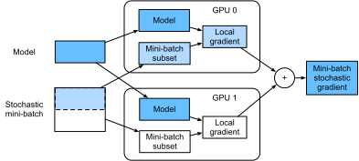

# Huấn Luyện Trên Nhiều GPU
<a id="sec_multi_gpu"></a>

Cho đến nay, chúng ta đã thảo luận cách huấn luyện mô hình hiệu quả trên CPU và GPU. Chúng ta thậm chí đã chỉ ra trong [sec_auto_para](#sec_auto_para) cách các framework deep learning cho phép tự động song song hóa tính toán và giao tiếp giữa chúng. Chúng ta cũng đã chỉ ra trong [sec_use_gpu](#sec_use_gpu) cách liệt kê tất cả GPU có sẵn trên một máy tính bằng lệnh `nvidia-smi`.
Điều chúng ta *chưa* thảo luận là cách thực sự song song hóa huấn luyện deep learning.
Thay vào đó, chúng ta chỉ ngầm nói thoáng qua rằng người ta bằng cách nào đó sẽ chia dữ liệu trên nhiều thiết bị và làm cho nó hoạt động. Phần hiện tại điền các chi tiết đó và chỉ ra cách huấn luyện một mạng song song khi bắt đầu từ đầu. Chi tiết về cách tận dụng chức năng trong các API cấp cao được chuyển sang [sec_multi_gpu_concise](#sec_multi_gpu_concise).
Chúng tôi giả định rằng bạn đã quen với các thuật toán minibatch stochastic gradient descent như những thuật toán được mô tả trong [sec_minibatch_sgd](#sec_minibatch_sgd).


## Chia Nhỏ Bài Toán

Hãy bắt đầu với một bài toán thị giác máy tính đơn giản và một mạng hơi cổ, ví dụ với nhiều lớp tích chập, gộp và có thể vài lớp kết nối đầy đủ ở cuối.
Tức là, hãy bắt đầu với một mạng trông khá giống LeNet [LeCun.Bottou.Bengio.ea.1998] hoặc AlexNet [Krizhevsky.Sutskever.Hinton.2012].
Với nhiều GPU (2 nếu là máy chủ desktop, 4 trên một instance AWS g4dn.12xlarge, 8 trên p3.16xlarge, hoặc 16 trên p2.16xlarge), chúng ta muốn phân vùng huấn luyện sao cho đạt tăng tốc tốt đồng thời hưởng lợi từ các lựa chọn thiết kế đơn giản và tái lập được. Sau cùng, nhiều GPU làm tăng cả khả năng *bộ nhớ* và *tính toán*. Tóm lại, với một minibatch dữ liệu huấn luyện cần phân loại, chúng ta có các lựa chọn sau.

Thứ nhất, chúng ta có thể phân vùng mạng trên nhiều GPU. Tức là, mỗi GPU nhận làm đầu vào dữ liệu chảy vào một lớp cụ thể, xử lý dữ liệu qua một số lớp tiếp theo rồi gửi dữ liệu đến GPU kế tiếp.
Điều này cho phép chúng ta xử lý dữ liệu với các mạng lớn hơn so với những gì một GPU đơn có thể xử lý.
Bên cạnh đó,
footprint bộ nhớ trên mỗi GPU có thể được kiểm soát tốt (nó là một phần của tổng footprint mạng).

Tuy nhiên, giao diện giữa các lớp (và do đó giữa các GPU) đòi hỏi đồng bộ hóa chặt chẽ. Điều này có thể khó, đặc biệt nếu workload tính toán không được khớp đúng giữa các lớp. Vấn đề trở nên trầm trọng hơn khi số GPU lớn.
Giao diện giữa các lớp cũng
đòi hỏi truyền lượng dữ liệu lớn,
chẳng hạn activation và gradient.
Điều này có thể làm quá tải băng thông của các bus GPU.
Hơn nữa, các thao tác tốn nhiều tính toán nhưng tuần tự là không dễ phân vùng. Xem ví dụ Mirhoseini.Pham.Le.ea.2017 cho một nỗ lực tốt nhất theo hướng này. Đây vẫn là một bài toán khó và chưa rõ liệu có thể đạt scaling tốt (tuyến tính) trên các bài toán không tầm thường hay không. Chúng tôi không khuyến nghị cách này trừ khi có hỗ trợ framework hoặc hệ điều hành xuất sắc để nối chuỗi nhiều GPU với nhau.


Thứ hai, chúng ta có thể chia công việc theo từng lớp. Chẳng hạn, thay vì tính 64 kênh trên một GPU đơn, chúng ta có thể chia bài toán trên 4 GPU, mỗi GPU sinh dữ liệu cho 16 kênh.
Tương tự, với một lớp kết nối đầy đủ, chúng ta có thể chia số lượng đơn vị đầu ra. [fig_alexnet_original](#fig_alexnet_original) (lấy từ Krizhevsky.Sutskever.Hinton.2012)
minh họa thiết kế này, trong đó chiến lược này được dùng để xử lý các GPU có footprint bộ nhớ rất nhỏ (2 GB vào thời điểm đó).
Điều này cho phép scaling tốt về mặt tính toán, miễn là số kênh (hoặc đơn vị) không quá nhỏ.
Bên cạnh đó,
nhiều GPU có thể xử lý các mạng ngày càng lớn vì bộ nhớ sẵn có tăng tuyến tính.


<a id="fig_alexnet_original"></a>

Tuy nhiên,
chúng ta cần một số lượng *rất lớn* các thao tác đồng bộ hóa hoặc rào chắn vì mỗi lớp phụ thuộc vào kết quả từ tất cả các lớp khác.
Hơn nữa, lượng dữ liệu cần truyền có khả năng còn lớn hơn so với khi phân phối các lớp trên GPU. Do đó, chúng tôi không khuyến nghị cách tiếp cận này vì chi phí băng thông và độ phức tạp của nó.

Cuối cùng, chúng ta có thể phân vùng dữ liệu trên nhiều GPU. Theo cách này, tất cả GPU thực hiện cùng loại công việc, dù trên các quan sát khác nhau. Gradient được tổng hợp trên các GPU sau mỗi minibatch dữ liệu huấn luyện.
Đây là cách tiếp cận đơn giản nhất và có thể áp dụng trong mọi tình huống.
Chúng ta chỉ cần đồng bộ hóa sau mỗi minibatch. Dù vậy, rất nên bắt đầu trao đổi các tham số gradient trong khi các tham số khác vẫn đang được tính.
Hơn nữa, số GPU lớn hơn dẫn đến kích thước minibatch lớn hơn, qua đó tăng hiệu quả huấn luyện.
Tuy nhiên, thêm GPU không cho phép chúng ta huấn luyện các mô hình lớn hơn.


<a id="fig_splitting"></a>


So sánh các cách song song hóa khác nhau trên nhiều GPU được mô tả trong [fig_splitting](#fig_splitting).
Nhìn chung, song song dữ liệu là cách thuận tiện nhất để tiến hành, miễn là chúng ta có quyền truy cập các GPU có bộ nhớ đủ lớn. Xem thêm [Li.Andersen.Park.ea.2014] để biết mô tả chi tiết về phân vùng cho huấn luyện phân tán. Bộ nhớ GPU từng là một vấn đề trong những ngày đầu của deep learning. Đến nay, vấn đề này đã được giải quyết ngoại trừ các trường hợp bất thường nhất. Trong phần tiếp theo, chúng ta tập trung vào song song dữ liệu.

## Song Song Dữ Liệu

Giả sử có $k$ GPU trên một máy. Với mô hình cần huấn luyện, mỗi GPU sẽ duy trì một bộ tham số mô hình đầy đủ độc lập, dù giá trị tham số trên các GPU là giống hệt và được đồng bộ.
Lấy ví dụ,
[fig_data_parallel](#fig_data_parallel) minh họa
huấn luyện với
song song dữ liệu khi $k=2$.



<a id="fig_data_parallel"></a>

Nói chung, quá trình huấn luyện diễn ra như sau:

* Trong bất kỳ vòng lặp huấn luyện nào, với một minibatch ngẫu nhiên, chúng ta chia các ví dụ trong batch thành $k$ phần và phân phối đều chúng trên các GPU.
* Mỗi GPU tính mất mát và gradient của các tham số mô hình dựa trên tập con minibatch được gán cho nó.
* Các gradient cục bộ của từng GPU trong số $k$ GPU được tổng hợp để thu được minibatch stochastic gradient hiện tại.
* Gradient tổng hợp được phân phối lại đến từng GPU.
* Mỗi GPU dùng minibatch stochastic gradient này để cập nhật bộ tham số mô hình đầy đủ mà nó duy trì.


Lưu ý rằng trong thực tế, chúng ta *tăng* kích thước minibatch lên $k$ lần khi huấn luyện trên $k$ GPU, sao cho mỗi GPU có cùng lượng công việc như khi chỉ huấn luyện trên một GPU đơn. Trên một máy chủ 16 GPU, điều này có thể làm kích thước minibatch tăng đáng kể và chúng ta có thể phải tăng tốc độ học tương ứng.
Cũng lưu ý rằng batch normalization trong [sec_batch_norm](#sec_batch_norm) cần được điều chỉnh, ví dụ bằng cách giữ một hệ số batch normalization riêng trên mỗi GPU.
Trong phần tiếp theo, chúng ta sẽ dùng một mạng đồ chơi để minh họa huấn luyện đa GPU.

```python
#@tab mxnet
%matplotlib inline
from d2l import mxnet as d2l
from mxnet import autograd, gluon, np, npx
npx.set_np()
```

```python
#@tab pytorch
%matplotlib inline
from d2l import torch as d2l
import torch
from torch import nn
from torch.nn import functional as F
```

## [**Một Mạng Đồ Chơi**]

Chúng ta dùng LeNet như được giới thiệu trong [sec_lenet](#sec_lenet) (với vài sửa đổi nhỏ). Chúng ta định nghĩa nó từ đầu để minh họa chi tiết việc trao đổi và đồng bộ hóa tham số.

```python
#@tab mxnet
# Initialize model parameters
scale = 0.01
W1 = np.random.normal(scale=scale, size=(20, 1, 3, 3))
b1 = np.zeros(20)
W2 = np.random.normal(scale=scale, size=(50, 20, 5, 5))
b2 = np.zeros(50)
W3 = np.random.normal(scale=scale, size=(800, 128))
b3 = np.zeros(128)
W4 = np.random.normal(scale=scale, size=(128, 10))
b4 = np.zeros(10)
params = [W1, b1, W2, b2, W3, b3, W4, b4]

# Define the model
def lenet(X, params):
    h1_conv = npx.convolution(data=X, weight=params[0], bias=params[1],
                              kernel=(3, 3), num_filter=20)
    h1_activation = npx.relu(h1_conv)
    h1 = npx.pooling(data=h1_activation, pool_type='avg', kernel=(2, 2),
                     stride=(2, 2))
    h2_conv = npx.convolution(data=h1, weight=params[2], bias=params[3],
                              kernel=(5, 5), num_filter=50)
    h2_activation = npx.relu(h2_conv)
    h2 = npx.pooling(data=h2_activation, pool_type='avg', kernel=(2, 2),
                     stride=(2, 2))
    h2 = h2.reshape(h2.shape[0], -1)
    h3_linear = np.dot(h2, params[4]) + params[5]
    h3 = npx.relu(h3_linear)
    y_hat = np.dot(h3, params[6]) + params[7]
    return y_hat

# Cross-entropy loss function
loss = gluon.loss.SoftmaxCrossEntropyLoss()
```

```python
#@tab pytorch
# Initialize model parameters
scale = 0.01
W1 = torch.randn(size=(20, 1, 3, 3)) * scale
b1 = torch.zeros(20)
W2 = torch.randn(size=(50, 20, 5, 5)) * scale
b2 = torch.zeros(50)
W3 = torch.randn(size=(800, 128)) * scale
b3 = torch.zeros(128)
W4 = torch.randn(size=(128, 10)) * scale
b4 = torch.zeros(10)
params = [W1, b1, W2, b2, W3, b3, W4, b4]

# Define the model
def lenet(X, params):
    h1_conv = F.conv2d(input=X, weight=params[0], bias=params[1])
    h1_activation = F.relu(h1_conv)
    h1 = F.avg_pool2d(input=h1_activation, kernel_size=(2, 2), stride=(2, 2))
    h2_conv = F.conv2d(input=h1, weight=params[2], bias=params[3])
    h2_activation = F.relu(h2_conv)
    h2 = F.avg_pool2d(input=h2_activation, kernel_size=(2, 2), stride=(2, 2))
    h2 = h2.reshape(h2.shape[0], -1)
    h3_linear = torch.mm(h2, params[4]) + params[5]
    h3 = F.relu(h3_linear)
    y_hat = torch.mm(h3, params[6]) + params[7]
    return y_hat

# Cross-entropy loss function
loss = nn.CrossEntropyLoss(reduction='none')
```

## Đồng Bộ Hóa Dữ Liệu

Để huấn luyện đa GPU hiệu quả, chúng ta cần hai thao tác cơ bản.
Thứ nhất, chúng ta cần có khả năng [**phân phối một danh sách tham số đến nhiều thiết bị**] và gắn gradient (`get_params`). Không có tham số thì không thể đánh giá mạng trên GPU.
Thứ hai, chúng ta cần khả năng cộng tham số trên nhiều thiết bị, tức là cần một hàm `allreduce`.

```python
#@tab mxnet
def get_params(params, device):
    new_params = [p.copyto(device) for p in params]
    for p in new_params:
        p.attach_grad()
    return new_params
```

```python
#@tab pytorch
def get_params(params, device):
    new_params = [p.to(device) for p in params]
    for p in new_params:
        p.requires_grad_()
    return new_params
```

Hãy thử bằng cách sao chép các tham số mô hình sang một GPU.

```python
#@tab all
new_params = get_params(params, d2l.try_gpu(0))
print('b1 weight:', new_params[1])
print('b1 grad:', new_params[1].grad)
```

Vì chúng ta chưa thực hiện tính toán nào, gradient theo tham số bias vẫn bằng không.
Bây giờ hãy giả sử chúng ta có một vector được phân phối trên nhiều GPU. Hàm [**`allreduce` sau cộng tất cả vector và phát kết quả trở lại tất cả GPU**]. Lưu ý rằng để điều này hoạt động, chúng ta cần sao chép dữ liệu đến thiết bị tích lũy kết quả.

```python
#@tab mxnet
def allreduce(data):
    for i in range(1, len(data)):
        data[0][:] += data[i].copyto(data[0].ctx)
    for i in range(1, len(data)):
        data[0].copyto(data[i])
```

```python
#@tab pytorch
def allreduce(data):
    for i in range(1, len(data)):
        data[0][:] += data[i].to(data[0].device)
    for i in range(1, len(data)):
        data[i][:] = data[0].to(data[i].device)
```

Hãy kiểm thử điều này bằng cách tạo các vector có giá trị khác nhau trên các thiết bị khác nhau và tổng hợp chúng.

```python
#@tab mxnet
data = [np.ones((1, 2), ctx=d2l.try_gpu(i)) * (i + 1) for i in range(2)]
print('before allreduce:\n', data[0], '\n', data[1])
allreduce(data)
print('after allreduce:\n', data[0], '\n', data[1])
```

```python
#@tab pytorch
data = [torch.ones((1, 2), device=d2l.try_gpu(i)) * (i + 1) for i in range(2)]
print('before allreduce:\n', data[0], '\n', data[1])
allreduce(data)
print('after allreduce:\n', data[0], '\n', data[1])
```

## Phân Phối Dữ Liệu

Chúng ta cần một hàm tiện ích đơn giản để [**phân phối đều một minibatch trên nhiều GPU**]. Chẳng hạn, trên hai GPU, chúng ta muốn một nửa dữ liệu được sao chép đến mỗi GPU.
Vì tiện lợi và ngắn gọn hơn, chúng ta dùng hàm tích hợp từ framework deep learning để thử trên một ma trận $4 \times 5$.

```python
#@tab mxnet
data = np.arange(20).reshape(4, 5)
devices = [npx.gpu(0), npx.gpu(1)]
split = gluon.utils.split_and_load(data, devices)
print('input :', data)
print('load into', devices)
print('output:', split)
```

```python
#@tab pytorch
data = torch.arange(20).reshape(4, 5)
devices = [torch.device('cuda:0'), torch.device('cuda:1')]
split = nn.parallel.scatter(data, devices)
print('input :', data)
print('load into', devices)
print('output:', split)
```

Để tái sử dụng sau này, chúng ta định nghĩa một hàm `split_batch` chia cả dữ liệu và nhãn.

```python
#@tab mxnet
def split_batch(X, y, devices):
    """Split `X` and `y` into multiple devices."""
    assert X.shape[0] == y.shape[0]
    return (gluon.utils.split_and_load(X, devices),
            gluon.utils.split_and_load(y, devices))
```

```python
#@tab pytorch
def split_batch(X, y, devices):
    """Split `X` and `y` into multiple devices."""
    assert X.shape[0] == y.shape[0]
    return (nn.parallel.scatter(X, devices),
            nn.parallel.scatter(y, devices))
```

## Huấn Luyện

Bây giờ chúng ta có thể cài đặt [**huấn luyện đa GPU trên một minibatch đơn**]. Cài đặt của nó chủ yếu dựa trên cách tiếp cận song song dữ liệu được mô tả trong phần này. Chúng ta sẽ dùng các hàm phụ trợ vừa thảo luận, `allreduce` và `split_and_load`, để đồng bộ dữ liệu giữa nhiều GPU. Lưu ý rằng chúng ta không cần viết mã cụ thể nào để đạt song song hóa. Vì đồ thị tính toán không có phụ thuộc nào giữa các thiết bị trong một minibatch, nó được thực thi song song *tự động*.

```python
#@tab mxnet
def train_batch(X, y, device_params, devices, lr):
    X_shards, y_shards = split_batch(X, y, devices)
    with autograd.record():  # Loss is calculated separately on each GPU
        ls = [loss(lenet(X_shard, device_W), y_shard)
              for X_shard, y_shard, device_W in zip(
                  X_shards, y_shards, device_params)]
    for l in ls:  # Backpropagation is performed separately on each GPU
        l.backward()
    # Sum all gradients from each GPU and broadcast them to all GPUs
    for i in range(len(device_params[0])):
        allreduce([device_params[c][i].grad for c in range(len(devices))])
    # The model parameters are updated separately on each GPU
    for param in device_params:
        d2l.sgd(param, lr, X.shape[0])  # Here, we use a full-size batch
```

```python
#@tab pytorch
def train_batch(X, y, device_params, devices, lr):
    X_shards, y_shards = split_batch(X, y, devices)
    # Loss is calculated separately on each GPU
    ls = [loss(lenet(X_shard, device_W), y_shard).sum()
          for X_shard, y_shard, device_W in zip(
              X_shards, y_shards, device_params)]
    for l in ls:  # Backpropagation is performed separately on each GPU
        l.backward()
    # Sum all gradients from each GPU and broadcast them to all GPUs
    with torch.no_grad():
        for i in range(len(device_params[0])):
            allreduce([device_params[c][i].grad for c in range(len(devices))])
    # The model parameters are updated separately on each GPU
    for param in device_params:
        d2l.sgd(param, lr, X.shape[0]) # Here, we use a full-size batch
```

Bây giờ, chúng ta có thể định nghĩa [**hàm huấn luyện**]. Nó hơi khác các hàm được dùng trong các chương trước: chúng ta cần cấp phát GPU và sao chép tất cả tham số mô hình đến mọi thiết bị.
Rõ ràng mỗi batch được xử lý bằng hàm `train_batch` để làm việc với nhiều GPU. Để thuận tiện (và để mã ngắn gọn), chúng ta tính độ chính xác trên một GPU đơn, dù điều này *kém hiệu quả* vì các GPU khác nhàn rỗi.

```python
#@tab mxnet
def train(num_gpus, batch_size, lr):
    train_iter, test_iter = d2l.load_data_fashion_mnist(batch_size)
    devices = [d2l.try_gpu(i) for i in range(num_gpus)]
    # Copy model parameters to `num_gpus` GPUs
    device_params = [get_params(params, d) for d in devices]
    num_epochs = 10
    animator = d2l.Animator('epoch', 'test acc', xlim=[1, num_epochs])
    timer = d2l.Timer()
    for epoch in range(num_epochs):
        timer.start()
        for X, y in train_iter:
            # Perform multi-GPU training for a single minibatch
            train_batch(X, y, device_params, devices, lr)
            npx.waitall()
        timer.stop()
        # Evaluate the model on GPU 0
        animator.add(epoch + 1, (d2l.evaluate_accuracy_gpu(
            lambda x: lenet(x, device_params[0]), test_iter, devices[0]),))
    print(f'test acc: {animator.Y[0][-1]:.2f}, {timer.avg():.1f} sec/epoch '
          f'on {str(devices)}')
```

```python
#@tab pytorch
def train(num_gpus, batch_size, lr):
    train_iter, test_iter = d2l.load_data_fashion_mnist(batch_size)
    devices = [d2l.try_gpu(i) for i in range(num_gpus)]
    # Copy model parameters to `num_gpus` GPUs
    device_params = [get_params(params, d) for d in devices]
    num_epochs = 10
    animator = d2l.Animator('epoch', 'test acc', xlim=[1, num_epochs])
    timer = d2l.Timer()
    for epoch in range(num_epochs):
        timer.start()
        for X, y in train_iter:
            # Perform multi-GPU training for a single minibatch
            train_batch(X, y, device_params, devices, lr)
            torch.cuda.synchronize()
        timer.stop()
        # Evaluate the model on GPU 0
        animator.add(epoch + 1, (d2l.evaluate_accuracy_gpu(
            lambda x: lenet(x, device_params[0]), test_iter, devices[0]),))
    print(f'test acc: {animator.Y[0][-1]:.2f}, {timer.avg():.1f} sec/epoch '
          f'on {str(devices)}')
```

Hãy xem điều này hoạt động tốt đến đâu [**trên một GPU đơn**].
Trước hết chúng ta dùng kích thước batch 256 và tốc độ học 0.2.

```python
#@tab all
train(num_gpus=1, batch_size=256, lr=0.2)
```

Bằng cách giữ nguyên kích thước batch và tốc độ học rồi [**tăng số GPU lên 2**], chúng ta có thể thấy rằng độ chính xác kiểm tra gần như giữ nguyên so với
thí nghiệm trước.
Xét theo các thuật toán tối ưu hóa, chúng là giống hệt nhau. Đáng tiếc là không có tăng tốc có ý nghĩa nào ở đây: mô hình đơn giản là quá nhỏ; hơn nữa chúng ta chỉ có một tập dữ liệu nhỏ, nơi cách tiếp cận hơi thiếu tinh vi của chúng ta để cài đặt huấn luyện đa GPU chịu chi phí phụ Python đáng kể. Trong tương lai, chúng ta sẽ gặp các mô hình phức tạp hơn và các cách song song hóa tinh vi hơn.
Dù vậy, hãy xem điều gì xảy ra với Fashion-MNIST.

```python
#@tab all
train(num_gpus=2, batch_size=256, lr=0.2)
```

## Tóm Tắt

* Có nhiều cách để chia huấn luyện mạng sâu trên nhiều GPU. Chúng ta có thể chia giữa các lớp, theo các lớp, hoặc theo dữ liệu. Hai cách đầu đòi hỏi truyền dữ liệu được phối hợp chặt chẽ. Song song dữ liệu là chiến lược đơn giản nhất.
* Huấn luyện song song dữ liệu khá trực tiếp. Tuy nhiên, để hiệu quả, nó làm tăng kích thước minibatch hiệu dụng.
* Trong song song dữ liệu, dữ liệu được chia trên nhiều GPU, trong đó mỗi GPU thực hiện thao tác forward và backward riêng, sau đó gradient được tổng hợp và kết quả được phát trở lại các GPU.
* Chúng ta có thể dùng tốc độ học tăng nhẹ cho các minibatch lớn hơn.

## Bài Tập

1. Khi huấn luyện trên $k$ GPU, hãy thay đổi kích thước minibatch từ $b$ thành $k \cdot b$, tức là tăng theo số GPU.
1. So sánh độ chính xác với các tốc độ học khác nhau. Nó thay đổi thế nào theo số GPU?
1. Cài đặt một hàm `allreduce` hiệu quả hơn, tổng hợp các tham số khác nhau trên các GPU khác nhau. Vì sao nó hiệu quả hơn?
1. Cài đặt tính độ chính xác kiểm tra đa GPU.


[Discussions](https://discuss.d2l.ai/t/1669)
