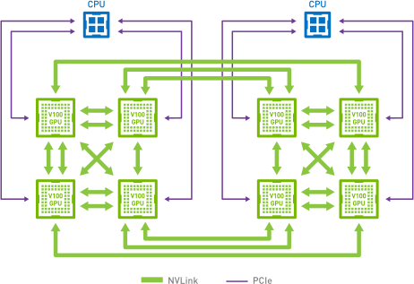
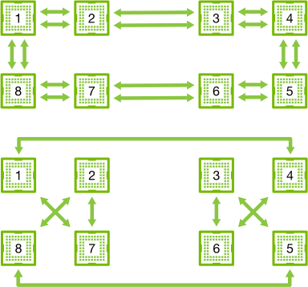
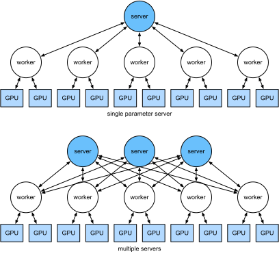

# Parameter Server

Khi chúng ta chuyển từ một GPU đơn sang nhiều GPU rồi đến nhiều máy chủ chứa nhiều GPU, có thể tất cả còn trải rộng trên nhiều rack và switch mạng,
các thuật toán huấn luyện phân tán và song song của chúng ta cần trở nên tinh vi hơn nhiều. Chi tiết rất quan trọng vì các kết nối khác nhau có băng thông rất khác nhau (ví dụ NVLink có thể cung cấp tới 100 GB/s trên 6 liên kết trong một thiết lập phù hợp, PCIe 4.0 (16 lane) cung cấp 32 GB/s, trong khi ngay cả Ethernet tốc độ cao 100GbE cũng chỉ đạt 10 GB/s). Đồng thời, thật không hợp lý khi kỳ vọng một người xây dựng mô hình thống kê là chuyên gia về mạng và hệ thống.

Ý tưởng cốt lõi của parameter server được giới thiệu trong Smola.Narayanamurthy.2010 trong bối cảnh các mô hình biến ẩn phân tán. Mô tả về ngữ nghĩa push và pull sau đó xuất hiện trong Ahmed.Aly.Gonzalez.ea.2012, và mô tả hệ thống cùng một thư viện mã nguồn mở xuất hiện trong Li.Andersen.Park.ea.2014. Trong phần sau, chúng ta sẽ tạo động lực cho các thành phần cần thiết để đạt hiệu quả.

## Huấn Luyện Song Song Dữ Liệu

Hãy xem lại cách tiếp cận huấn luyện song song dữ liệu cho huấn luyện phân tán. Chúng ta sẽ chỉ dùng cách này trong phần này vì nó đơn giản hơn đáng kể khi cài đặt trong thực tế. Hầu như không có trường hợp sử dụng nào (ngoài deep learning trên đồ thị) mà chiến lược song song khác được ưu tiên, vì GPU ngày nay có rất nhiều bộ nhớ. [fig_parameterserver](#fig_parameterserver) mô tả biến thể song song dữ liệu mà chúng ta đã cài đặt trong [sec_multi_gpu](#sec_multi_gpu). Khía cạnh chính ở đây là việc tổng hợp gradient xảy ra trên một GPU đơn (GPU 0) trước khi các tham số đã cập nhật được phát lại đến tất cả GPU.

Nhìn lại, quyết định tổng hợp trên GPU 0 có vẻ khá tùy tiện. Sau cùng, chúng ta cũng có thể tổng hợp trên CPU. Thực tế, chúng ta thậm chí có thể quyết định tổng hợp một số tham số trên một GPU và một số tham số khác trên GPU khác. Miễn là thuật toán tối ưu hóa hỗ trợ điều này, không có lý do thực sự nào khiến chúng ta không thể làm vậy. Chẳng hạn, nếu có bốn vector tham số với các gradient liên quan $\mathbf{g}_1, \ldots, \mathbf{g}_4$, chúng ta có thể tổng hợp gradient trên một GPU cho mỗi $\mathbf{g}_i$ ($i = 1, \ldots, 4$).

Lập luận này có vẻ tùy tiện và không nghiêm túc. Sau cùng, toán học là giống nhau xuyên suốt. Tuy nhiên, chúng ta đang làm việc với phần cứng vật lý thực, nơi các bus khác nhau có băng thông khác nhau như đã thảo luận trong [sec_hardware](#sec_hardware).
Xét một máy chủ GPU 4 chiều thực như mô tả trong [fig_bw_hierarchy](#fig_bw_hierarchy). Nếu được kết nối đặc biệt tốt, nó có thể có card mạng 100 GbE. Các con số điển hình hơn nằm trong khoảng 1--10 GbE với băng thông hiệu dụng từ 100 MB/s đến 1 GB/s.
Vì CPU có quá ít lane PCIe để kết nối trực tiếp với mọi GPU (ví dụ CPU Intel cấp phổ thông có 24 lane), chúng ta cần một [bộ ghép kênh](https://www.broadcom.com/products/pcie-switches-bridges/pcie-switches). Băng thông từ CPU trên một liên kết 16x Gen3 là 16 GB/s. Đây cũng là tốc độ mà *mỗi* GPU được kết nối với switch. Điều này có nghĩa là giao tiếp giữa các thiết bị hiệu quả hơn.

Để lập luận, hãy giả sử các gradient có kích thước 160 MB. Trong trường hợp này, mất 30 ms để gửi gradient từ cả 3 GPU còn lại đến GPU thứ tư (mỗi lần truyền mất 10 ms = 160 MB / 16 GB/s). Thêm 30 ms nữa để truyền các vector trọng số trở lại, chúng ta có tổng cộng 60 ms.
Nếu gửi tất cả dữ liệu đến CPU, chúng ta chịu phạt 40 ms vì *mỗi* trong bốn GPU cần gửi dữ liệu đến CPU, cho tổng cộng 80 ms. Cuối cùng, giả sử chúng ta có thể chia gradient thành 4 phần, mỗi phần 40 MB. Bây giờ chúng ta có thể tổng hợp mỗi phần trên một GPU khác nhau *đồng thời* vì switch PCIe cung cấp thao tác băng thông đầy đủ giữa mọi liên kết. Thay vì 30 ms, việc này mất 7.5 ms, cho tổng cộng 15 ms cho một thao tác đồng bộ hóa. Tóm lại, tùy vào cách đồng bộ tham số, cùng một thao tác có thể mất từ 15 ms đến 80 ms. [fig_ps_distributed](#fig_ps_distributed) mô tả các chiến lược khác nhau để trao đổi tham số.

Lưu ý rằng chúng ta còn có một công cụ khác để cải thiện hiệu năng: trong một mạng sâu, việc tính tất cả gradient từ trên xuống dưới mất một khoảng thời gian. Chúng ta có thể bắt đầu đồng bộ hóa gradient cho một số nhóm tham số ngay cả khi vẫn đang bận tính chúng cho các nhóm khác. Xem ví dụ Sergeev.Del-Balso.2018 để biết chi tiết cách làm điều này trong [Horovod](https://github.com/horovod/horovod).

## Đồng Bộ Vòng

Khi nói đến đồng bộ hóa trên phần cứng deep learning hiện đại, chúng ta thường gặp kết nối mạng được thiết kế riêng đáng kể. Chẳng hạn, các instance AWS p3.16xlarge và NVIDIA DGX-2 chia sẻ cấu trúc kết nối của [fig_nvlink](#fig_nvlink). Mỗi GPU kết nối với CPU chủ qua một liên kết PCIe, hoạt động tốt nhất ở 16 GB/s. Ngoài ra, mỗi GPU cũng có 6 kết nối NVLink, mỗi kết nối có khả năng truyền 300 Gbit/s hai chiều. Điều này tương ứng khoảng 18 GB/s trên mỗi liên kết theo mỗi hướng. Tóm lại, băng thông NVLink tổng hợp cao hơn đáng kể so với băng thông PCIe. Câu hỏi là dùng nó hiệu quả nhất như thế nào.

Hóa ra chiến lược đồng bộ hóa tối ưu là phân rã mạng thành hai vòng và dùng chúng để đồng bộ dữ liệu trực tiếp [Wang.Li.Liberty.ea.2018]. [fig_nvlink_twoloop](#fig_nvlink_twoloop) minh họa rằng mạng có thể được phân rã thành một vòng (1-2-3-4-5-6-7-8-1) với băng thông NVLink gấp đôi và một vòng (1-4-6-3-5-8-2-7-1) với băng thông thông thường. Thiết kế một giao thức đồng bộ hiệu quả trong trường hợp này không hề tầm thường.

Xét thí nghiệm tư duy sau: với một vòng gồm $n$ nút tính toán (hoặc GPU), chúng ta có thể gửi gradient từ nút thứ nhất đến nút thứ hai. Ở đó, nó được cộng với gradient cục bộ và gửi tiếp đến nút thứ ba, v.v. Sau $n-1$ bước, gradient tổng hợp có thể được tìm thấy ở nút được ghé thăm cuối cùng. Tức là, thời gian để tổng hợp gradient tăng tuyến tính theo số nút. Nhưng nếu làm như vậy, thuật toán khá kém hiệu quả. Sau cùng, tại bất kỳ thời điểm nào chỉ có một nút đang giao tiếp. Nếu chúng ta chia gradient thành $n$ mảnh và bắt đầu đồng bộ mảnh $i$ tại nút $i$ thì sao?
Vì mỗi mảnh có kích thước $1/n$, tổng thời gian bây giờ là $(n-1)/n \approx 1$. Nói cách khác, thời gian dùng để tổng hợp gradient *không tăng* khi chúng ta tăng kích thước vòng. Đây là một kết quả khá đáng kinh ngạc. [fig_ringsync](#fig_ringsync) minh họa chuỗi bước trên $n=4$ nút.

Nếu dùng cùng ví dụ đồng bộ 160 MB trên 8 GPU V100, chúng ta thu được xấp xỉ $2 \cdot 160 \textrm{MB} / (3 \cdot 18 \textrm{GB/s}) \approx 6 \textrm{ms}$. Điều này tốt hơn so với dùng bus PCIe, dù giờ chúng ta dùng 8 GPU. Lưu ý rằng trong thực tế các con số này tệ hơn một chút, vì các framework deep learning thường không gom giao tiếp thành các lần truyền burst lớn.

Lưu ý rằng có một hiểu lầm phổ biến rằng đồng bộ vòng khác cơ bản với các thuật toán đồng bộ khác. Khác biệt duy nhất là đường đồng bộ hóa phức tạp hơn phần nào so với một cây đơn giản.

## Huấn Luyện Nhiều Máy

Huấn luyện phân tán trên nhiều máy thêm một thách thức nữa: chúng ta cần giao tiếp với các máy chủ chỉ được kết nối qua một fabric có băng thông tương đối thấp hơn, có thể chậm hơn hơn một bậc độ lớn trong một số trường hợp.
Đồng bộ hóa giữa các thiết bị là khó. Sau cùng, các máy khác nhau chạy mã huấn luyện sẽ có tốc độ hơi khác nhau. Do đó, chúng ta cần *đồng bộ hóa* chúng nếu muốn dùng tối ưu hóa phân tán đồng bộ. [fig_ps_multimachine](#fig_ps_multimachine) minh họa cách huấn luyện song song phân tán diễn ra.

1. Một batch dữ liệu (khác nhau) được đọc trên mỗi máy, chia trên nhiều GPU và chuyển vào bộ nhớ GPU. Ở đó, dự đoán và gradient được tính riêng trên mỗi batch GPU.
2. Gradient từ tất cả GPU cục bộ được tổng hợp trên một GPU (hoặc các phần của nó được tổng hợp trên các GPU khác nhau).
3. Gradient được gửi đến CPU.
4. CPU gửi gradient đến một parameter server trung tâm, nơi tổng hợp tất cả gradient.
5. Gradient tổng hợp sau đó được dùng để cập nhật tham số và các tham số đã cập nhật được phát lại đến từng CPU.
6. Thông tin được gửi đến một (hoặc nhiều) GPU.
7. Các tham số đã cập nhật được phân tán trên tất cả GPU.

Mỗi thao tác này có vẻ khá trực tiếp. Và thực vậy, chúng có thể được thực hiện hiệu quả *trong* một máy đơn. Tuy nhiên, khi nhìn vào nhiều máy, chúng ta có thể thấy parameter server trung tâm trở thành nút thắt. Sau cùng, băng thông trên mỗi server là hữu hạn, do đó với $m$ worker, thời gian cần để gửi tất cả gradient đến server là $\mathcal{O}(m)$. Chúng ta có thể phá vỡ rào cản này bằng cách tăng số server lên $n$. Tại thời điểm này, mỗi server chỉ cần lưu $\mathcal{O}(1/n)$ tham số, do đó tổng thời gian cho cập nhật và tối ưu hóa trở thành $\mathcal{O}(m/n)$.
Khớp hai con số này cho scaling hằng bất kể chúng ta đang xử lý bao nhiêu worker. Trong thực tế, chúng ta dùng *cùng* các máy vừa làm worker vừa làm server. [fig_ps_multips](#fig_ps_multips) minh họa thiết kế này (xem thêm [Li.Andersen.Park.ea.2014] để biết chi tiết).
Cụ thể, đảm bảo nhiều máy hoạt động mà không có độ trễ bất hợp lý là không hề tầm thường.

## Kho Khóa--Giá Trị

Cài đặt các bước cần thiết cho huấn luyện đa GPU phân tán trong thực tế không hề tầm thường.
Đây là lý do nên dùng một trừu tượng chung, cụ thể là *kho khóa--giá trị* với ngữ nghĩa cập nhật được định nghĩa lại.

Trên nhiều worker và nhiều GPU, phép tính cho gradient $i$ có thể được định nghĩa là

$$\mathbf{g}_{i} = \sum_{k \in \textrm{workers}} \sum_{j \in \textrm{GPUs}} \mathbf{g}_{ijk},$$

trong đó $\mathbf{g}_{ijk}$ là phần của gradient $i$ được chia trên GPU $j$ của worker $k$.
Khía cạnh chính trong thao tác này là nó là một *phép rút gọn giao hoán*, tức là nó biến nhiều vector thành một vector và thứ tự áp dụng thao tác không quan trọng. Điều này rất tốt cho mục đích của chúng ta vì chúng ta không (cần) kiểm soát chi tiết gradient nào được nhận vào lúc nào. Bên cạnh đó, lưu ý rằng thao tác này độc lập giữa các $i$ khác nhau.

Điều này cho phép chúng ta định nghĩa hai thao tác sau: *push*, tích lũy gradient, và *pull*, truy xuất gradient tổng hợp. Vì chúng ta có nhiều tập gradient khác nhau (sau cùng, chúng ta có nhiều lớp), chúng ta cần lập chỉ mục gradient bằng một khóa $i$. Sự tương đồng này với các kho khóa--giá trị, chẳng hạn kho được giới thiệu trong Dynamo
[DeCandia.Hastorun.Jampani.ea.2007], không phải ngẫu nhiên. Chúng cũng thỏa nhiều đặc tính tương tự, đặc biệt khi phân phối tham số trên nhiều server.

Các thao tác push và pull cho kho khóa-giá trị được mô tả như sau:

* **push(key, value)** gửi một gradient cụ thể (giá trị) từ một worker đến một kho chung. Ở đó giá trị được tổng hợp, ví dụ bằng cách cộng lại.
* **pull(key, value)** truy xuất một giá trị tổng hợp từ kho chung, ví dụ sau khi kết hợp gradient từ tất cả worker.

Bằng cách che giấu toàn bộ độ phức tạp về đồng bộ hóa phía sau một thao tác push và pull đơn giản, chúng ta có thể tách rời mối quan tâm của những người xây dựng mô hình thống kê, những người muốn biểu đạt tối ưu hóa bằng các thuật ngữ đơn giản, khỏi các kỹ sư hệ thống, những người cần xử lý độ phức tạp vốn có trong đồng bộ hóa phân tán.

## Tóm Tắt

* Đồng bộ hóa cần thích nghi cao với hạ tầng mạng và kết nối cụ thể trong một máy chủ. Điều này có thể tạo ra khác biệt đáng kể đối với thời gian cần để đồng bộ.
* Đồng bộ vòng có thể tối ưu cho máy chủ p3 và DGX-2. Với các máy chủ khác thì có thể không đến mức đó.
* Chiến lược đồng bộ phân cấp hoạt động tốt khi thêm nhiều parameter server để tăng băng thông.

## Bài Tập

1. Bạn có thể tăng đồng bộ vòng hơn nữa không? Gợi ý: bạn có thể gửi thông điệp theo cả hai hướng.
1. Có thể cho phép giao tiếp bất đồng bộ (trong khi tính toán vẫn đang diễn ra) không? Nó ảnh hưởng thế nào đến hiệu năng?
1. Nếu chúng ta mất một server trong một tính toán chạy lâu thì sao? Làm thế nào để thiết kế một cơ chế *chịu lỗi* nhằm tránh phải khởi động lại toàn bộ tính toán?

[Discussions](https://discuss.d2l.ai/t/366)
