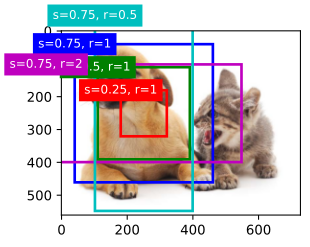
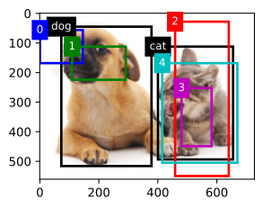
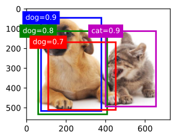
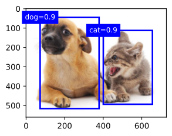
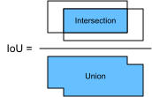
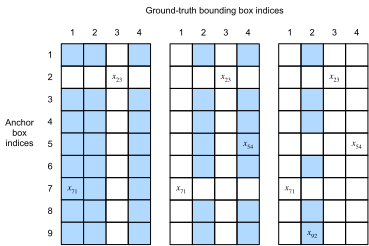

# Anchor Box
<a id="sec_anchor"></a>


Các thuật toán phát hiện đối tượng thường
lấy mẫu một lượng lớn vùng trong ảnh đầu vào, xác định xem các vùng này có chứa
đối tượng quan tâm hay không, và điều chỉnh biên
của các vùng để dự đoán
*ground-truth bounding box*
của đối tượng chính xác hơn.
Các mô hình khác nhau có thể sử dụng
các cơ chế lấy mẫu vùng khác nhau.
Ở đây chúng ta giới thiệu một phương pháp như vậy:
nó sinh nhiều bounding box với các tỉ lệ và tỉ số cạnh khác nhau, có tâm tại mỗi pixel.
Các bounding box này được gọi là *anchor box*.
Chúng ta sẽ thiết kế một mô hình phát hiện đối tượng
dựa trên anchor box trong [sec_ssd](#sec_ssd).

Trước tiên, hãy chỉnh độ chính xác khi in
để đầu ra gọn hơn.

```python
#@tab mxnet
%matplotlib inline
from d2l import mxnet as d2l
from mxnet import gluon, image, np, npx

np.set_printoptions(2)  # Simplify printing accuracy
npx.set_np()
```




```python
#@tab pytorch
%matplotlib inline
from d2l import torch as d2l
import torch

torch.set_printoptions(2)  # Simplify printing accuracy
```




## Sinh Nhiều Anchor Box

Giả sử ảnh đầu vào có chiều cao $h$ và chiều rộng $w$.
Chúng ta sinh các anchor box với hình dạng khác nhau, có tâm tại mỗi pixel của ảnh.
Gọi *tỉ lệ* là $s\in (0, 1]$ và
*tỉ số cạnh* (tỉ số giữa chiều rộng và chiều cao) là $r > 0$.
Khi đó [**chiều rộng và chiều cao của anchor box lần lượt là $ws\sqrt{r}$ và $hs/\sqrt{r}$.**]
Lưu ý rằng khi vị trí tâm đã được cho, một anchor box với chiều rộng và chiều cao đã biết sẽ được xác định.

Để sinh nhiều anchor box với hình dạng khác nhau,
hãy đặt một dãy tỉ lệ
$s_1,\ldots, s_n$ và
một dãy tỉ số cạnh $r_1,\ldots, r_m$.
Nếu dùng tất cả các tổ hợp của các tỉ lệ và tỉ số cạnh này với mỗi pixel làm tâm,
ảnh đầu vào sẽ có tổng cộng $whnm$ anchor box. Mặc dù các anchor box này có thể bao phủ tất cả
ground-truth bounding box, độ phức tạp tính toán rất dễ trở nên quá cao.
Trong thực tế,
chúng ta có thể chỉ (**xét các tổ hợp
chứa**) $s_1$ hoặc $r_1$:

(**$$(s_1, r_1), (s_1, r_2), \ldots, (s_1, r_m), (s_2, r_1), (s_3, r_1), \ldots, (s_n, r_1).$$**)

Nói cách khác, số anchor box có tâm tại cùng một pixel là $n+m-1$. Với toàn bộ ảnh đầu vào, chúng ta sẽ sinh tổng cộng $wh(n+m-1)$ anchor box.

Phương pháp sinh anchor box ở trên được hiện thực trong hàm `multibox_prior` sau. Chúng ta chỉ định ảnh đầu vào, danh sách các tỉ lệ, và danh sách các tỉ số cạnh, rồi hàm này sẽ trả về tất cả anchor box.

```python
#@tab mxnet
def multibox_prior(data, sizes, ratios):
    """Generate anchor boxes with different shapes centered on each pixel."""
    in_height, in_width = data.shape[-2:]
    device, num_sizes, num_ratios = data.ctx, len(sizes), len(ratios)
    boxes_per_pixel = (num_sizes + num_ratios - 1)
    size_tensor = d2l.tensor(sizes, ctx=device)
    ratio_tensor = d2l.tensor(ratios, ctx=device)
    # Offsets are required to move the anchor to the center of a pixel. Since
    # a pixel has height=1 and width=1, we choose to offset our centers by 0.5
    offset_h, offset_w = 0.5, 0.5
    steps_h = 1.0 / in_height  # Scaled steps in y-axis
    steps_w = 1.0 / in_width  # Scaled steps in x-axis

    # Generate all center points for the anchor boxes
    center_h = (d2l.arange(in_height, ctx=device) + offset_h) * steps_h
    center_w = (d2l.arange(in_width, ctx=device) + offset_w) * steps_w
    shift_x, shift_y = d2l.meshgrid(center_w, center_h)
    shift_x, shift_y = shift_x.reshape(-1), shift_y.reshape(-1)

    # Generate `boxes_per_pixel` number of heights and widths that are later
    # used to create anchor box corner coordinates (xmin, xmax, ymin, ymax)
    w = np.concatenate((size_tensor * np.sqrt(ratio_tensor[0]),
                        sizes[0] * np.sqrt(ratio_tensor[1:]))) \
                        * in_height / in_width  # Handle rectangular inputs
    h = np.concatenate((size_tensor / np.sqrt(ratio_tensor[0]),
                        sizes[0] / np.sqrt(ratio_tensor[1:])))
    # Divide by 2 to get half height and half width
    anchor_manipulations = np.tile(np.stack((-w, -h, w, h)).T,
                                   (in_height * in_width, 1)) / 2

    # Each center point will have `boxes_per_pixel` number of anchor boxes, so
    # generate a grid of all anchor box centers with `boxes_per_pixel` repeats
    out_grid = d2l.stack([shift_x, shift_y, shift_x, shift_y],
                         axis=1).repeat(boxes_per_pixel, axis=0)
    output = out_grid + anchor_manipulations
    return np.expand_dims(output, axis=0)
```




```python
#@tab pytorch
def multibox_prior(data, sizes, ratios):
    """Generate anchor boxes with different shapes centered on each pixel."""
    in_height, in_width = data.shape[-2:]
    device, num_sizes, num_ratios = data.device, len(sizes), len(ratios)
    boxes_per_pixel = (num_sizes + num_ratios - 1)
    size_tensor = d2l.tensor(sizes, device=device)
    ratio_tensor = d2l.tensor(ratios, device=device)
    # Offsets are required to move the anchor to the center of a pixel. Since
    # a pixel has height=1 and width=1, we choose to offset our centers by 0.5
    offset_h, offset_w = 0.5, 0.5
    steps_h = 1.0 / in_height  # Scaled steps in y axis
    steps_w = 1.0 / in_width  # Scaled steps in x axis

    # Generate all center points for the anchor boxes
    center_h = (torch.arange(in_height, device=device) + offset_h) * steps_h
    center_w = (torch.arange(in_width, device=device) + offset_w) * steps_w
    shift_y, shift_x = torch.meshgrid(center_h, center_w, indexing='ij')
    shift_y, shift_x = shift_y.reshape(-1), shift_x.reshape(-1)

    # Generate `boxes_per_pixel` number of heights and widths that are later
    # used to create anchor box corner coordinates (xmin, xmax, ymin, ymax)
    w = torch.cat((size_tensor * torch.sqrt(ratio_tensor[0]),
                   sizes[0] * torch.sqrt(ratio_tensor[1:])))\
                   * in_height / in_width  # Handle rectangular inputs
    h = torch.cat((size_tensor / torch.sqrt(ratio_tensor[0]),
                   sizes[0] / torch.sqrt(ratio_tensor[1:])))
    # Divide by 2 to get half height and half width
    anchor_manipulations = torch.stack((-w, -h, w, h)).T.repeat(
                                        in_height * in_width, 1) / 2

    # Each center point will have `boxes_per_pixel` number of anchor boxes, so
    # generate a grid of all anchor box centers with `boxes_per_pixel` repeats
    out_grid = torch.stack([shift_x, shift_y, shift_x, shift_y],
                dim=1).repeat_interleave(boxes_per_pixel, dim=0)
    output = out_grid + anchor_manipulations
    return output.unsqueeze(0)
```




Chúng ta có thể thấy rằng [**hình dạng của biến anchor box trả về `Y`**] là
(kích thước batch, số anchor box, 4).

```python
#@tab mxnet
img = image.imread('../img/catdog.jpg').asnumpy()
h, w = img.shape[:2]

print(h, w)
X = np.random.uniform(size=(1, 3, h, w))  # Construct input data
Y = multibox_prior(X, sizes=[0.75, 0.5, 0.25], ratios=[1, 2, 0.5])
Y.shape
```

```python
#@tab pytorch
img = d2l.plt.imread('../img/catdog.jpg')
h, w = img.shape[:2]

print(h, w)
X = torch.rand(size=(1, 3, h, w))  # Construct input data
Y = multibox_prior(X, sizes=[0.75, 0.5, 0.25], ratios=[1, 2, 0.5])
Y.shape
```

Sau khi đổi hình dạng của biến anchor box `Y` thành (chiều cao ảnh, chiều rộng ảnh, số anchor box có tâm tại cùng một pixel, 4),
chúng ta có thể lấy tất cả anchor box có tâm tại một vị trí pixel đã chỉ định.
Trong đoạn sau,
chúng ta [**truy cập anchor box đầu tiên có tâm tại (250, 250)**]. Nó có bốn phần tử: tọa độ theo trục $(x, y)$ ở góc trên bên trái và tọa độ theo trục $(x, y)$ ở góc dưới bên phải của anchor box.
Các giá trị tọa độ của cả hai trục
được chia lần lượt cho chiều rộng và chiều cao của ảnh.

```python
#@tab all
boxes = Y.reshape(h, w, 5, 4)
boxes[250, 250, 0, :]
```

Để [**hiển thị tất cả anchor box có tâm tại một pixel trong ảnh**],
chúng ta định nghĩa hàm `show_bboxes` sau để vẽ nhiều bounding box trên ảnh.

```python
#@tab all
def show_bboxes(axes, bboxes, labels=None, colors=None):
    """Show bounding boxes."""

    def make_list(obj, default_values=None):
        if obj is None:
            obj = default_values
        elif not isinstance(obj, (list, tuple)):
            obj = [obj]
        return obj

    labels = make_list(labels)
    colors = make_list(colors, ['b', 'g', 'r', 'm', 'c'])
    for i, bbox in enumerate(bboxes):
        color = colors[i % len(colors)]
        rect = d2l.bbox_to_rect(d2l.numpy(bbox), color)
        axes.add_patch(rect)
        if labels and len(labels) > i:
            text_color = 'k' if color == 'w' else 'w'
            axes.text(rect.xy[0], rect.xy[1], labels[i],
                      va='center', ha='center', fontsize=9, color=text_color,
                      bbox=dict(facecolor=color, lw=0))
```

Như vừa thấy, các giá trị tọa độ của trục $x$ và $y$ trong biến `boxes` đã được chia lần lượt cho chiều rộng và chiều cao của ảnh.
Khi vẽ anchor box,
chúng ta cần khôi phục các giá trị tọa độ ban đầu của chúng;
do đó, ta định nghĩa biến `bbox_scale` bên dưới.
Bây giờ, chúng ta có thể vẽ tất cả anchor box có tâm tại (250, 250) trong ảnh.
Như bạn có thể thấy, anchor box màu xanh dương với tỉ lệ 0.75 và tỉ số cạnh 1 bao quanh
con chó trong ảnh khá tốt.

```python
#@tab all
d2l.set_figsize()
bbox_scale = d2l.tensor((w, h, w, h))
fig = d2l.plt.imshow(img)
show_bboxes(fig.axes, boxes[250, 250, :, :] * bbox_scale,
            ['s=0.75, r=1', 's=0.5, r=1', 's=0.25, r=1', 's=0.75, r=2',
             's=0.75, r=0.5'])
```

## [**Intersection over Union (IoU)**]

Chúng ta vừa nói rằng một anchor box bao quanh con chó trong ảnh "khá tốt".
Nếu biết ground-truth bounding box của đối tượng, làm thế nào để lượng hóa mức "tốt" này?
Một cách trực quan, chúng ta có thể đo độ tương đồng giữa
anchor box và ground-truth bounding box.
Ta biết rằng *chỉ số Jaccard* có thể đo độ tương đồng giữa hai tập hợp. Với các tập $\mathcal{A}$ và $\mathcal{B}$, chỉ số Jaccard của chúng là kích thước phần giao chia cho kích thước phần hợp:

$$J(\mathcal{A},\mathcal{B}) = \frac{\left|\mathcal{A} \cap \mathcal{B}\right|}{\left| \mathcal{A} \cup \mathcal{B}\right|}.$$


Thực ra, chúng ta có thể xem diện tích pixel của bất kỳ bounding box nào như một tập các pixel.
Theo cách này, ta có thể đo độ tương đồng của hai bounding box bằng chỉ số Jaccard của các tập pixel tương ứng. Với hai bounding box, chúng ta thường gọi chỉ số Jaccard của chúng là *intersection over union* (*IoU*), tức tỉ số giữa diện tích giao và diện tích hợp của chúng, như minh họa trong [fig_iou](#fig_iou).
Khoảng giá trị của IoU nằm giữa 0 và 1:
0 nghĩa là hai bounding box hoàn toàn không chồng lấp,
trong khi 1 cho biết hai bounding box bằng nhau.


<a id="fig_iou"></a>

Trong phần còn lại của mục này, chúng ta sẽ dùng IoU để đo độ tương đồng giữa anchor box và ground-truth bounding box, cũng như giữa các anchor box khác nhau.
Với hai danh sách anchor box hoặc bounding box,
hàm `box_iou` sau tính IoU từng cặp
giữa hai danh sách này.

```python
#@tab mxnet
def box_iou(boxes1, boxes2):
    """Compute pairwise IoU across two lists of anchor or bounding boxes."""
    box_area = lambda boxes: ((boxes[:, 2] - boxes[:, 0]) *
                              (boxes[:, 3] - boxes[:, 1]))
    # Shape of `boxes1`, `boxes2`, `areas1`, `areas2`: (no. of boxes1, 4),
    # (no. of boxes2, 4), (no. of boxes1,), (no. of boxes2,)
    areas1 = box_area(boxes1)
    areas2 = box_area(boxes2)
    # Shape of `inter_upperlefts`, `inter_lowerrights`, `inters`: (no. of
    # boxes1, no. of boxes2, 2)
    inter_upperlefts = np.maximum(boxes1[:, None, :2], boxes2[:, :2])
    inter_lowerrights = np.minimum(boxes1[:, None, 2:], boxes2[:, 2:])
    inters = (inter_lowerrights - inter_upperlefts).clip(min=0)
    # Shape of `inter_areas` and `union_areas`: (no. of boxes1, no. of boxes2)
    inter_areas = inters[:, :, 0] * inters[:, :, 1]
    union_areas = areas1[:, None] + areas2 - inter_areas
    return inter_areas / union_areas
```

```python
#@tab pytorch
def box_iou(boxes1, boxes2):
    """Compute pairwise IoU across two lists of anchor or bounding boxes."""
    box_area = lambda boxes: ((boxes[:, 2] - boxes[:, 0]) *
                              (boxes[:, 3] - boxes[:, 1]))
    # Shape of `boxes1`, `boxes2`, `areas1`, `areas2`: (no. of boxes1, 4),
    # (no. of boxes2, 4), (no. of boxes1,), (no. of boxes2,)
    areas1 = box_area(boxes1)
    areas2 = box_area(boxes2)
    # Shape of `inter_upperlefts`, `inter_lowerrights`, `inters`: (no. of
    # boxes1, no. of boxes2, 2)
    inter_upperlefts = torch.max(boxes1[:, None, :2], boxes2[:, :2])
    inter_lowerrights = torch.min(boxes1[:, None, 2:], boxes2[:, 2:])
    inters = (inter_lowerrights - inter_upperlefts).clamp(min=0)
    # Shape of `inter_areas` and `union_areas`: (no. of boxes1, no. of boxes2)
    inter_areas = inters[:, :, 0] * inters[:, :, 1]
    union_areas = areas1[:, None] + areas2 - inter_areas
    return inter_areas / union_areas
```

## Gán Nhãn Anchor Box Trong Dữ Liệu Huấn Luyện
<a id="subsec_labeling-anchor-boxes"></a>


Trong một tập dữ liệu huấn luyện,
chúng ta xem mỗi anchor box như một ví dụ huấn luyện.
Để huấn luyện một mô hình phát hiện đối tượng,
ta cần nhãn *lớp* và nhãn *offset* cho mỗi anchor box,
trong đó nhãn thứ nhất là
lớp của đối tượng liên quan tới anchor box
và nhãn thứ hai là offset
của ground-truth bounding box so với anchor box.
Trong khi dự đoán,
với mỗi ảnh
chúng ta sinh nhiều anchor box,
dự đoán lớp và offset cho tất cả các anchor box,
điều chỉnh vị trí của chúng theo các offset dự đoán để thu được các bounding box dự đoán,
và cuối cùng chỉ xuất ra những
bounding box dự đoán thỏa mãn các tiêu chí nhất định.


Như đã biết, một tập huấn luyện phát hiện đối tượng
đi kèm các nhãn cho
vị trí của *ground-truth bounding box*
và lớp của các đối tượng được chúng bao quanh.
Để gán nhãn cho bất kỳ *anchor box* nào,
chúng ta tham chiếu tới
vị trí và lớp đã được gán nhãn của ground-truth bounding box *được gán*
gần anchor box nhất.
Sau đây,
chúng ta mô tả một thuật toán để gán
các ground-truth bounding box gần nhất cho các anchor box.

### [**Gán Ground-Truth Bounding Box Cho Anchor Box**]

Với một ảnh,
giả sử các anchor box là $A_1, A_2, \ldots, A_{n_a}$ và các ground-truth bounding box là $B_1, B_2, \ldots, B_{n_b}$, trong đó $n_a \geq n_b$.
Hãy định nghĩa ma trận $\mathbf{X} \in \mathbb{R}^{n_a \times n_b}$, với phần tử $x_{ij}$ ở hàng thứ $i$ và cột thứ $j$ là IoU của anchor box $A_i$ và ground-truth bounding box $B_j$. Thuật toán gồm các bước sau:

1. Tìm phần tử lớn nhất trong ma trận $\mathbf{X}$ và ký hiệu chỉ số hàng và cột của nó lần lượt là $i_1$ và $j_1$. Khi đó ground-truth bounding box $B_{j_1}$ được gán cho anchor box $A_{i_1}$. Điều này khá trực quan vì $A_{i_1}$ và $B_{j_1}$ là cặp gần nhất trong tất cả các cặp anchor box và ground-truth bounding box. Sau lần gán đầu tiên, loại bỏ tất cả phần tử ở hàng thứ ${i_1}$ và cột thứ ${j_1}$ trong ma trận $\mathbf{X}$.
1. Tìm phần tử lớn nhất trong các phần tử còn lại của ma trận $\mathbf{X}$ và ký hiệu chỉ số hàng và cột của nó lần lượt là $i_2$ và $j_2$. Chúng ta gán ground-truth bounding box $B_{j_2}$ cho anchor box $A_{i_2}$ và loại bỏ tất cả phần tử ở hàng thứ ${i_2}$ và cột thứ ${j_2}$ trong ma trận $\mathbf{X}$.
1. Tại thời điểm này, các phần tử trong hai hàng và hai cột của ma trận $\mathbf{X}$ đã bị loại bỏ. Ta tiếp tục cho đến khi tất cả phần tử trong $n_b$ cột của ma trận $\mathbf{X}$ bị loại bỏ. Khi đó, chúng ta đã gán một ground-truth bounding box cho mỗi anchor box trong $n_b$ anchor box.
1. Chỉ duyệt qua $n_a - n_b$ anchor box còn lại. Ví dụ, với bất kỳ anchor box $A_i$ nào, hãy tìm ground-truth bounding box $B_j$ có IoU lớn nhất với $A_i$ trên toàn bộ hàng thứ $i$ của ma trận $\mathbf{X}$, và chỉ gán $B_j$ cho $A_i$ nếu IoU này lớn hơn một ngưỡng định trước.

Hãy minh họa thuật toán trên bằng một
ví dụ cụ thể.
Như trong [fig_anchor_label](#fig_anchor_label) (bên trái), giả sử giá trị lớn nhất trong ma trận $\mathbf{X}$ là $x_{23}$, ta gán ground-truth bounding box $B_3$ cho anchor box $A_2$.
Sau đó, ta loại bỏ tất cả phần tử ở hàng 2 và cột 3 của ma trận, tìm phần tử lớn nhất $x_{71}$ trong các phần tử còn lại (vùng được tô bóng), và gán ground-truth bounding box $B_1$ cho anchor box $A_7$.
Tiếp theo, như trong [fig_anchor_label](#fig_anchor_label) (ở giữa), loại bỏ tất cả phần tử ở hàng 7 và cột 1 của ma trận, tìm phần tử lớn nhất $x_{54}$ trong các phần tử còn lại (vùng được tô bóng), và gán ground-truth bounding box $B_4$ cho anchor box $A_5$.
Cuối cùng, như trong [fig_anchor_label](#fig_anchor_label) (bên phải), loại bỏ tất cả phần tử ở hàng 5 và cột 4 của ma trận, tìm phần tử lớn nhất $x_{92}$ trong các phần tử còn lại (vùng được tô bóng), và gán ground-truth bounding box $B_2$ cho anchor box $A_9$.
Sau đó, chúng ta chỉ cần duyệt qua
các anchor box còn lại $A_1, A_3, A_4, A_6, A_8$ và xác định có gán ground-truth bounding box cho chúng hay không theo ngưỡng.


<a id="fig_anchor_label"></a>

Thuật toán này được hiện thực trong hàm `assign_anchor_to_bbox` sau.

```python
#@tab mxnet
def assign_anchor_to_bbox(ground_truth, anchors, device, iou_threshold=0.5):
    """Assign closest ground-truth bounding boxes to anchor boxes."""
    num_anchors, num_gt_boxes = anchors.shape[0], ground_truth.shape[0]
    # Element x_ij in the i-th row and j-th column is the IoU of the anchor
    # box i and the ground-truth bounding box j
    jaccard = box_iou(anchors, ground_truth)
    # Initialize the tensor to hold the assigned ground-truth bounding box for
    # each anchor
    anchors_bbox_map = np.full((num_anchors,), -1, dtype=np.int32, ctx=device)
    # Assign ground-truth bounding boxes according to the threshold
    max_ious, indices = np.max(jaccard, axis=1), np.argmax(jaccard, axis=1)
    anc_i = np.nonzero(max_ious >= iou_threshold)[0]
    box_j = indices[max_ious >= iou_threshold]
    anchors_bbox_map[anc_i] = box_j
    col_discard = np.full((num_anchors,), -1)
    row_discard = np.full((num_gt_boxes,), -1)
    for _ in range(num_gt_boxes):
        max_idx = np.argmax(jaccard)  # Find the largest IoU
        box_idx = (max_idx % num_gt_boxes).astype('int32')
        anc_idx = (max_idx / num_gt_boxes).astype('int32')
        anchors_bbox_map[anc_idx] = box_idx
        jaccard[:, box_idx] = col_discard
        jaccard[anc_idx, :] = row_discard
    return anchors_bbox_map
```

```python
#@tab pytorch
def assign_anchor_to_bbox(ground_truth, anchors, device, iou_threshold=0.5):
    """Assign closest ground-truth bounding boxes to anchor boxes."""
    num_anchors, num_gt_boxes = anchors.shape[0], ground_truth.shape[0]
    # Element x_ij in the i-th row and j-th column is the IoU of the anchor
    # box i and the ground-truth bounding box j
    jaccard = box_iou(anchors, ground_truth)
    # Initialize the tensor to hold the assigned ground-truth bounding box for
    # each anchor
    anchors_bbox_map = torch.full((num_anchors,), -1, dtype=torch.long,
                                  device=device)
    # Assign ground-truth bounding boxes according to the threshold
    max_ious, indices = torch.max(jaccard, dim=1)
    anc_i = torch.nonzero(max_ious >= iou_threshold).reshape(-1)
    box_j = indices[max_ious >= iou_threshold]
    anchors_bbox_map[anc_i] = box_j
    col_discard = torch.full((num_anchors,), -1)
    row_discard = torch.full((num_gt_boxes,), -1)
    for _ in range(num_gt_boxes):
        max_idx = torch.argmax(jaccard)  # Find the largest IoU
        box_idx = (max_idx % num_gt_boxes).long()
        anc_idx = (max_idx / num_gt_boxes).long()
        anchors_bbox_map[anc_idx] = box_idx
        jaccard[:, box_idx] = col_discard
        jaccard[anc_idx, :] = row_discard
    return anchors_bbox_map
```

### Gán Nhãn Lớp và Offset

Bây giờ chúng ta có thể gán nhãn lớp và offset cho mỗi anchor box. Giả sử một anchor box $A$ được gán
một ground-truth bounding box $B$.
Một mặt,
lớp của anchor box $A$ sẽ được
gán nhãn giống lớp của $B$.
Mặt khác,
offset của anchor box $A$
sẽ được gán nhãn theo
vị trí tương đối giữa
tọa độ tâm của $B$ và $A$
cùng với kích thước tương đối giữa
hai box này.
Vì vị trí và kích thước của các box khác nhau trong tập dữ liệu là đa dạng,
chúng ta có thể áp dụng các phép biến đổi
lên các vị trí và kích thước tương đối đó
để thu được các offset có phân bố đều hơn
và dễ khớp hơn.
Ở đây chúng ta mô tả một phép biến đổi thường dùng.
[**Cho tọa độ tâm của $A$ và $B$ lần lượt là $(x_a, y_a)$ và $(x_b, y_b)$,
chiều rộng của chúng lần lượt là $w_a$ và $w_b$,
và chiều cao của chúng lần lượt là $h_a$ và $h_b$.
Ta có thể gán nhãn offset của $A$ là

$$\left( \frac{ \frac{x_b - x_a}{w_a} - \mu_x }{\sigma_x},
\frac{ \frac{y_b - y_a}{h_a} - \mu_y }{\sigma_y},
\frac{ \log \frac{w_b}{w_a} - \mu_w }{\sigma_w},
\frac{ \log \frac{h_b}{h_a} - \mu_h }{\sigma_h}\right),$$
**]
trong đó các giá trị mặc định của hằng số là $\mu_x = \mu_y = \mu_w = \mu_h = 0, \sigma_x=\sigma_y=0.1$, và $\sigma_w=\sigma_h=0.2$.
Phép biến đổi này được hiện thực dưới đây trong hàm `offset_boxes`.

```python
#@tab all
def offset_boxes(anchors, assigned_bb, eps=1e-6):
    """Transform for anchor box offsets."""
    c_anc = d2l.box_corner_to_center(anchors)
    c_assigned_bb = d2l.box_corner_to_center(assigned_bb)
    offset_xy = 10 * (c_assigned_bb[:, :2] - c_anc[:, :2]) / c_anc[:, 2:]
    offset_wh = 5 * d2l.log(eps + c_assigned_bb[:, 2:] / c_anc[:, 2:])
    offset = d2l.concat([offset_xy, offset_wh], axis=1)
    return offset
```

Nếu một anchor box không được gán ground-truth bounding box, chúng ta chỉ gán nhãn lớp của anchor box đó là "nền".
Các anchor box có lớp là nền thường được gọi là anchor box *âm*,
và các anchor box còn lại được gọi là anchor box *dương*.
Chúng ta hiện thực hàm `multibox_target` sau
để [**gán nhãn lớp và offset cho anchor box**] (đối số `anchors`) bằng các ground-truth bounding box (đối số `labels`).
Hàm này đặt lớp nền bằng 0 và tăng chỉ số nguyên của mỗi lớp mới thêm một đơn vị.

```python
#@tab mxnet
def multibox_target(anchors, labels):
    """Label anchor boxes using ground-truth bounding boxes."""
    batch_size, anchors = labels.shape[0], anchors.squeeze(0)
    batch_offset, batch_mask, batch_class_labels = [], [], []
    device, num_anchors = anchors.ctx, anchors.shape[0]
    for i in range(batch_size):
        label = labels[i, :, :]
        anchors_bbox_map = assign_anchor_to_bbox(
            label[:, 1:], anchors, device)
        bbox_mask = np.tile((np.expand_dims((anchors_bbox_map >= 0),
                                            axis=-1)), (1, 4)).astype('int32')
        # Initialize class labels and assigned bounding box coordinates with
        # zeros
        class_labels = d2l.zeros(num_anchors, dtype=np.int32, ctx=device)
        assigned_bb = d2l.zeros((num_anchors, 4), dtype=np.float32,
                                ctx=device)
        # Label classes of anchor boxes using their assigned ground-truth
        # bounding boxes. If an anchor box is not assigned any, we label its
        # class as background (the value remains zero)
        indices_true = np.nonzero(anchors_bbox_map >= 0)[0]
        bb_idx = anchors_bbox_map[indices_true]
        class_labels[indices_true] = label[bb_idx, 0].astype('int32') + 1
        assigned_bb[indices_true] = label[bb_idx, 1:]
        # Offset transformation
        offset = offset_boxes(anchors, assigned_bb) * bbox_mask
        batch_offset.append(offset.reshape(-1))
        batch_mask.append(bbox_mask.reshape(-1))
        batch_class_labels.append(class_labels)
    bbox_offset = d2l.stack(batch_offset)
    bbox_mask = d2l.stack(batch_mask)
    class_labels = d2l.stack(batch_class_labels)
    return (bbox_offset, bbox_mask, class_labels)
```

```python
#@tab pytorch
def multibox_target(anchors, labels):
    """Label anchor boxes using ground-truth bounding boxes."""
    batch_size, anchors = labels.shape[0], anchors.squeeze(0)
    batch_offset, batch_mask, batch_class_labels = [], [], []
    device, num_anchors = anchors.device, anchors.shape[0]
    for i in range(batch_size):
        label = labels[i, :, :]
        anchors_bbox_map = assign_anchor_to_bbox(
            label[:, 1:], anchors, device)
        bbox_mask = ((anchors_bbox_map >= 0).float().unsqueeze(-1)).repeat(
            1, 4)
        # Initialize class labels and assigned bounding box coordinates with
        # zeros
        class_labels = torch.zeros(num_anchors, dtype=torch.long,
                                   device=device)
        assigned_bb = torch.zeros((num_anchors, 4), dtype=torch.float32,
                                  device=device)
        # Label classes of anchor boxes using their assigned ground-truth
        # bounding boxes. If an anchor box is not assigned any, we label its
        # class as background (the value remains zero)
        indices_true = torch.nonzero(anchors_bbox_map >= 0)
        bb_idx = anchors_bbox_map[indices_true]
        class_labels[indices_true] = label[bb_idx, 0].long() + 1
        assigned_bb[indices_true] = label[bb_idx, 1:]
        # Offset transformation
        offset = offset_boxes(anchors, assigned_bb) * bbox_mask
        batch_offset.append(offset.reshape(-1))
        batch_mask.append(bbox_mask.reshape(-1))
        batch_class_labels.append(class_labels)
    bbox_offset = torch.stack(batch_offset)
    bbox_mask = torch.stack(batch_mask)
    class_labels = torch.stack(batch_class_labels)
    return (bbox_offset, bbox_mask, class_labels)
```

### Một Ví Dụ

Hãy minh họa việc gán nhãn anchor box
bằng một ví dụ cụ thể.
Chúng ta định nghĩa các ground-truth bounding box cho chó và mèo trong ảnh đã tải,
trong đó phần tử đầu tiên là lớp (0 cho chó và 1 cho mèo), còn bốn phần tử còn lại là
tọa độ theo trục $(x, y)$
ở góc trên bên trái và góc dưới bên phải
(phạm vi nằm giữa 0 và 1).
Chúng ta cũng xây dựng năm anchor box cần được gán nhãn
bằng tọa độ của
góc trên bên trái và góc dưới bên phải:
$A_0, \ldots, A_4$ (chỉ số bắt đầu từ 0).
Sau đó, chúng ta [**vẽ các ground-truth bounding box
và anchor box này
trên ảnh.**]

```python
#@tab all
ground_truth = d2l.tensor([[0, 0.1, 0.08, 0.52, 0.92],
                         [1, 0.55, 0.2, 0.9, 0.88]])
anchors = d2l.tensor([[0, 0.1, 0.2, 0.3], [0.15, 0.2, 0.4, 0.4],
                    [0.63, 0.05, 0.88, 0.98], [0.66, 0.45, 0.8, 0.8],
                    [0.57, 0.3, 0.92, 0.9]])

fig = d2l.plt.imshow(img)
show_bboxes(fig.axes, ground_truth[:, 1:] * bbox_scale, ['dog', 'cat'], 'k')
show_bboxes(fig.axes, anchors * bbox_scale, ['0', '1', '2', '3', '4']);
```

Dùng hàm `multibox_target` đã định nghĩa ở trên,
chúng ta có thể [**gán nhãn lớp và offset
của các anchor box này dựa trên
các ground-truth bounding box**] cho chó và mèo.
Trong ví dụ này, chỉ số của
các lớp nền, chó và mèo
lần lượt là 0, 1, và 2.
Bên dưới, chúng ta thêm một chiều cho các ví dụ anchor box và ground-truth bounding box.

```python
#@tab mxnet
labels = multibox_target(np.expand_dims(anchors, axis=0),
                         np.expand_dims(ground_truth, axis=0))
```

```python
#@tab pytorch
labels = multibox_target(anchors.unsqueeze(dim=0),
                         ground_truth.unsqueeze(dim=0))
```

Có ba mục trong kết quả trả về, tất cả đều ở định dạng tensor.
Mục thứ ba chứa các lớp đã được gán nhãn của các anchor box đầu vào.

Hãy phân tích các nhãn lớp trả về bên dưới dựa trên
vị trí của anchor box và ground-truth bounding box trong ảnh.
Trước hết, trong tất cả các cặp anchor box
và ground-truth bounding box,
IoU của anchor box $A_4$ và ground-truth bounding box của mèo là lớn nhất.
Do đó, lớp của $A_4$ được gán nhãn là mèo.
Sau khi loại bỏ
các cặp chứa $A_4$ hoặc ground-truth bounding box của mèo, trong phần còn lại
cặp anchor box $A_1$ và ground-truth bounding box của chó có IoU lớn nhất.
Vì vậy lớp của $A_1$ được gán nhãn là chó.
Tiếp theo, chúng ta cần duyệt qua ba anchor box chưa được gán nhãn còn lại: $A_0$, $A_2$, và $A_3$.
Với $A_0$,
lớp của ground-truth bounding box có IoU lớn nhất là chó,
nhưng IoU thấp hơn ngưỡng định trước (0.5),
nên lớp được gán nhãn là nền;
với $A_2$,
lớp của ground-truth bounding box có IoU lớn nhất là mèo và IoU vượt ngưỡng, nên lớp được gán nhãn là mèo;
với $A_3$,
lớp của ground-truth bounding box có IoU lớn nhất là mèo, nhưng giá trị thấp hơn ngưỡng, nên lớp được gán nhãn là nền.

```python
#@tab all
labels[2]
```

Mục thứ hai được trả về là một biến mask có hình dạng (kích thước batch, bốn lần số anchor box).
Mỗi bốn phần tử trong biến mask
tương ứng với bốn giá trị offset của mỗi anchor box.
Vì chúng ta không quan tâm tới việc phát hiện nền,
offset của lớp âm này không nên ảnh hưởng tới hàm mục tiêu.
Thông qua phép nhân theo từng phần tử, các số không trong biến mask sẽ lọc bỏ offset của lớp âm trước khi tính hàm mục tiêu.

```python
#@tab all
labels[1]
```

Mục đầu tiên được trả về chứa bốn giá trị offset được gán nhãn cho mỗi anchor box.
Lưu ý rằng offset của các anchor box thuộc lớp âm được gán nhãn bằng không.

```python
#@tab all
labels[0]
```

## Dự Đoán Bounding Box Với Non-Maximum Suppression
<a id="subsec_predicting-bounding-boxes-nms"></a>

Trong khi dự đoán,
chúng ta sinh nhiều anchor box cho ảnh và dự đoán lớp cũng như offset cho từng anchor box.
Một *bounding box dự đoán*
do đó được thu được từ
một anchor box cùng với offset dự đoán của nó.
Bên dưới, chúng ta hiện thực hàm `offset_inverse`
nhận anchor box và
các dự đoán offset làm đầu vào rồi [**áp dụng phép biến đổi offset ngược để
trả về tọa độ bounding box dự đoán**].

```python
#@tab all
def offset_inverse(anchors, offset_preds):
    """Predict bounding boxes based on anchor boxes with predicted offsets."""
    anc = d2l.box_corner_to_center(anchors)
    pred_bbox_xy = (offset_preds[:, :2] * anc[:, 2:] / 10) + anc[:, :2]
    pred_bbox_wh = d2l.exp(offset_preds[:, 2:] / 5) * anc[:, 2:]
    pred_bbox = d2l.concat((pred_bbox_xy, pred_bbox_wh), axis=1)
    predicted_bbox = d2l.box_center_to_corner(pred_bbox)
    return predicted_bbox
```

Khi có nhiều anchor box,
nhiều bounding box dự đoán tương tự nhau (chồng lấp đáng kể)
có thể cùng được xuất ra để bao quanh cùng một đối tượng.
Để đơn giản hóa đầu ra,
chúng ta có thể gộp các bounding box dự đoán tương tự nhau
thuộc cùng một đối tượng
bằng cách dùng *non-maximum suppression* (NMS).

Cách non-maximum suppression hoạt động như sau.
Với một bounding box dự đoán $B$,
mô hình phát hiện đối tượng tính xác suất dự đoán
cho từng lớp.
Ký hiệu $p$ là xác suất dự đoán lớn nhất,
lớp tương ứng với xác suất này là lớp dự đoán cho $B$.
Cụ thể, chúng ta gọi $p$ là *độ tin cậy* (điểm số) của bounding box dự đoán $B$.
Trên cùng một ảnh,
tất cả các bounding box dự đoán không thuộc nền
được sắp xếp theo độ tin cậy giảm dần
để tạo ra danh sách $L$.
Sau đó, ta xử lý danh sách đã sắp xếp $L$ theo các bước sau:

1. Chọn bounding box dự đoán $B_1$ có độ tin cậy cao nhất từ $L$ làm cơ sở và loại bỏ khỏi $L$ tất cả các bounding box dự đoán không phải cơ sở có IoU với $B_1$ vượt quá ngưỡng định trước $\epsilon$. Tại thời điểm này, $L$ giữ bounding box dự đoán có độ tin cậy cao nhất nhưng bỏ các box khác quá giống nó. Nói ngắn gọn, những box có điểm tin cậy *không cực đại* sẽ bị *triệt tiêu*.
1. Chọn bounding box dự đoán $B_2$ có độ tin cậy cao thứ hai từ $L$ làm một cơ sở khác và loại bỏ tất cả bounding box dự đoán không phải cơ sở có IoU với $B_2$ vượt quá $\epsilon$ khỏi $L$.
1. Lặp lại quá trình trên cho đến khi tất cả các bounding box dự đoán trong $L$ đã được dùng làm cơ sở. Khi đó, IoU của bất kỳ cặp bounding box dự đoán nào trong $L$ cũng thấp hơn ngưỡng $\epsilon$; do đó, không có cặp nào quá giống nhau.
1. Xuất ra tất cả bounding box dự đoán trong danh sách $L$.

[**Hàm `nms` sau sắp xếp điểm tin cậy theo thứ tự giảm dần và trả về chỉ số của chúng.**]

```python
#@tab mxnet
def nms(boxes, scores, iou_threshold):
    """Sort confidence scores of predicted bounding boxes."""
    B = scores.argsort()[::-1]
    keep = []  # Indices of predicted bounding boxes that will be kept
    while B.size > 0:
        i = B[0]
        keep.append(i)
        if B.size == 1: break
        iou = box_iou(boxes[i, :].reshape(-1, 4),
                      boxes[B[1:], :].reshape(-1, 4)).reshape(-1)
        inds = np.nonzero(iou <= iou_threshold)[0]
        B = B[inds + 1]
    return np.array(keep, dtype=np.int32, ctx=boxes.ctx)
```

```python
#@tab pytorch
def nms(boxes, scores, iou_threshold):
    """Sort confidence scores of predicted bounding boxes."""
    B = torch.argsort(scores, dim=-1, descending=True)
    keep = []  # Indices of predicted bounding boxes that will be kept
    while B.numel() > 0:
        i = B[0]
        keep.append(i)
        if B.numel() == 1: break
        iou = box_iou(boxes[i, :].reshape(-1, 4),
                      boxes[B[1:], :].reshape(-1, 4)).reshape(-1)
        inds = torch.nonzero(iou <= iou_threshold).reshape(-1)
        B = B[inds + 1]
    return d2l.tensor(keep, device=boxes.device)
```

Chúng ta định nghĩa hàm `multibox_detection` sau
để [**áp dụng non-maximum suppression
cho các bounding box dự đoán**].
Đừng lo nếu bạn thấy phần hiện thực
hơi phức tạp: chúng ta sẽ chỉ ra cách nó hoạt động
bằng một ví dụ cụ thể ngay sau phần hiện thực.

```python
#@tab mxnet
def multibox_detection(cls_probs, offset_preds, anchors, nms_threshold=0.5,
                       pos_threshold=0.009999999):
    """Predict bounding boxes using non-maximum suppression."""
    device, batch_size = cls_probs.ctx, cls_probs.shape[0]
    anchors = np.squeeze(anchors, axis=0)
    num_classes, num_anchors = cls_probs.shape[1], cls_probs.shape[2]
    out = []
    for i in range(batch_size):
        cls_prob, offset_pred = cls_probs[i], offset_preds[i].reshape(-1, 4)
        conf, class_id = np.max(cls_prob[1:], 0), np.argmax(cls_prob[1:], 0)
        predicted_bb = offset_inverse(anchors, offset_pred)
        keep = nms(predicted_bb, conf, nms_threshold)
        # Find all non-`keep` indices and set the class to background
        all_idx = np.arange(num_anchors, dtype=np.int32, ctx=device)
        combined = d2l.concat((keep, all_idx))
        unique, counts = np.unique(combined, return_counts=True)
        non_keep = unique[counts == 1]
        all_id_sorted = d2l.concat((keep, non_keep))
        class_id[non_keep] = -1
        class_id = class_id[all_id_sorted].astype('float32')
        conf, predicted_bb = conf[all_id_sorted], predicted_bb[all_id_sorted]
        # Here `pos_threshold` is a threshold for positive (non-background)
        # predictions
        below_min_idx = (conf < pos_threshold)
        class_id[below_min_idx] = -1
        conf[below_min_idx] = 1 - conf[below_min_idx]
        pred_info = d2l.concat((np.expand_dims(class_id, axis=1),
                                np.expand_dims(conf, axis=1),
                                predicted_bb), axis=1)
        out.append(pred_info)
    return d2l.stack(out)
```

```python
#@tab pytorch
def multibox_detection(cls_probs, offset_preds, anchors, nms_threshold=0.5,
                       pos_threshold=0.009999999):
    """Predict bounding boxes using non-maximum suppression."""
    device, batch_size = cls_probs.device, cls_probs.shape[0]
    anchors = anchors.squeeze(0)
    num_classes, num_anchors = cls_probs.shape[1], cls_probs.shape[2]
    out = []
    for i in range(batch_size):
        cls_prob, offset_pred = cls_probs[i], offset_preds[i].reshape(-1, 4)
        conf, class_id = torch.max(cls_prob[1:], 0)
        predicted_bb = offset_inverse(anchors, offset_pred)
        keep = nms(predicted_bb, conf, nms_threshold)
        # Find all non-`keep` indices and set the class to background
        all_idx = torch.arange(num_anchors, dtype=torch.long, device=device)
        combined = torch.cat((keep, all_idx))
        uniques, counts = combined.unique(return_counts=True)
        non_keep = uniques[counts == 1]
        all_id_sorted = torch.cat((keep, non_keep))
        class_id[non_keep] = -1
        class_id = class_id[all_id_sorted]
        conf, predicted_bb = conf[all_id_sorted], predicted_bb[all_id_sorted]
        # Here `pos_threshold` is a threshold for positive (non-background)
        # predictions
        below_min_idx = (conf < pos_threshold)
        class_id[below_min_idx] = -1
        conf[below_min_idx] = 1 - conf[below_min_idx]
        pred_info = torch.cat((class_id.unsqueeze(1),
                               conf.unsqueeze(1),
                               predicted_bb), dim=1)
        out.append(pred_info)
    return d2l.stack(out)
```

Bây giờ hãy [**áp dụng các hiện thực trên
cho một ví dụ cụ thể với bốn anchor box**].
Để đơn giản, chúng ta giả sử
các offset dự đoán đều bằng không.
Điều này có nghĩa các bounding box dự đoán chính là các anchor box.
Với mỗi lớp trong số nền, chó và mèo,
chúng ta cũng định nghĩa xác suất dự đoán của nó.

```python
#@tab all
anchors = d2l.tensor([[0.1, 0.08, 0.52, 0.92], [0.08, 0.2, 0.56, 0.95],
                      [0.15, 0.3, 0.62, 0.91], [0.55, 0.2, 0.9, 0.88]])
offset_preds = d2l.tensor([0] * d2l.size(anchors))
cls_probs = d2l.tensor([[0] * 4,  # Predicted background likelihood 
                      [0.9, 0.8, 0.7, 0.1],  # Predicted dog likelihood 
                      [0.1, 0.2, 0.3, 0.9]])  # Predicted cat likelihood
```

Chúng ta có thể [**vẽ các bounding box dự đoán này cùng với độ tin cậy của chúng trên ảnh.**]

```python
#@tab all
fig = d2l.plt.imshow(img)
show_bboxes(fig.axes, anchors * bbox_scale,
            ['dog=0.9', 'dog=0.8', 'dog=0.7', 'cat=0.9'])
```

Bây giờ chúng ta có thể gọi hàm `multibox_detection`
để thực hiện non-maximum suppression,
trong đó ngưỡng được đặt là 0.5.
Lưu ý rằng chúng ta thêm
một chiều cho các ví dụ trong đầu vào tensor.

Chúng ta có thể thấy rằng [**hình dạng của kết quả trả về**] là
(kích thước batch, số anchor box, 6).
Sáu phần tử ở chiều trong cùng
cung cấp thông tin đầu ra cho cùng một bounding box dự đoán.
Phần tử đầu tiên là chỉ số lớp dự đoán, bắt đầu từ 0 (0 là chó và 1 là mèo). Giá trị -1 biểu thị nền hoặc bị loại bỏ trong non-maximum suppression.
Phần tử thứ hai là độ tin cậy của bounding box dự đoán.
Bốn phần tử còn lại là tọa độ theo trục $(x, y)$ của góc trên bên trái và
góc dưới bên phải của bounding box dự đoán, tương ứng (phạm vi nằm giữa 0 và 1).

```python
#@tab mxnet
output = multibox_detection(np.expand_dims(cls_probs, axis=0),
                            np.expand_dims(offset_preds, axis=0),
                            np.expand_dims(anchors, axis=0),
                            nms_threshold=0.5)
output
```

```python
#@tab pytorch
output = multibox_detection(cls_probs.unsqueeze(dim=0),
                            offset_preds.unsqueeze(dim=0),
                            anchors.unsqueeze(dim=0),
                            nms_threshold=0.5)
output
```

Sau khi loại bỏ các bounding box dự đoán
có lớp -1,
chúng ta có thể [**xuất bounding box dự đoán cuối cùng
được giữ lại bởi non-maximum suppression**].

```python
#@tab all
fig = d2l.plt.imshow(img)
for i in d2l.numpy(output[0]):
    if i[0] == -1:
        continue
    label = ('dog=', 'cat=')[int(i[0])] + str(i[1])
    show_bboxes(fig.axes, [d2l.tensor(i[2:]) * bbox_scale], label)
```

Trong thực tế, chúng ta có thể loại bỏ các bounding box dự đoán có độ tin cậy thấp hơn ngay cả trước khi thực hiện non-maximum suppression, nhờ đó giảm lượng tính toán trong thuật toán này.
Chúng ta cũng có thể hậu xử lý đầu ra của non-maximum suppression, chẳng hạn chỉ giữ lại
các kết quả có độ tin cậy cao hơn
trong đầu ra cuối cùng.


## Tóm Tắt

* Chúng ta sinh anchor box với các hình dạng khác nhau có tâm tại mỗi pixel của ảnh.
* Intersection over union (IoU), còn được gọi là chỉ số Jaccard, đo độ tương đồng của hai bounding box. Nó là tỉ số giữa diện tích giao và diện tích hợp của chúng.
* Trong một tập huấn luyện, chúng ta cần hai loại nhãn cho mỗi anchor box. Một là lớp của đối tượng liên quan tới anchor box và loại còn lại là offset của ground-truth bounding box so với anchor box.
* Trong khi dự đoán, chúng ta có thể dùng non-maximum suppression (NMS) để loại bỏ các bounding box dự đoán tương tự nhau, nhờ đó đơn giản hóa đầu ra.


## Bài Tập

1. Thay đổi giá trị của `sizes` và `ratios` trong hàm `multibox_prior`. Các anchor box được sinh ra thay đổi như thế nào?
1. Xây dựng và trực quan hóa hai bounding box có IoU bằng 0.5. Chúng chồng lấp với nhau như thế nào?
1. Sửa biến `anchors` trong [subsec_labeling-anchor-boxes](#subsec_labeling-anchor-boxes) và [subsec_predicting-bounding-boxes-nms](#subsec_predicting-bounding-boxes-nms). Kết quả thay đổi như thế nào?
1. Non-maximum suppression là một thuật toán tham lam triệt tiêu các bounding box dự đoán bằng cách *loại bỏ* chúng. Có khả năng một số box bị loại bỏ này thực ra vẫn hữu ích không? Có thể sửa thuật toán này như thế nào để triệt tiêu một cách *mềm*? Bạn có thể tham khảo Soft-NMS [Bodla.Singh.Chellappa.ea.2017].
1. Thay vì được thiết kế thủ công, liệu non-maximum suppression có thể được học không?


[Thảo luận](https://discuss.d2l.ai/t/1603)
