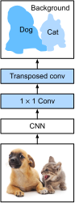

# Mạng Tích Chập Đầy Đủ
<a id="sec_fcn"></a>

Như đã thảo luận trong [sec_semantic_segmentation](#sec_semantic_segmentation),
phân đoạn ngữ nghĩa
phân loại ảnh ở mức pixel.
Một mạng tích chập đầy đủ (fully convolutional network, FCN)
dùng một mạng nơ-ron tích chập để
biến đổi các pixel ảnh thành các lớp pixel [Long.Shelhamer.Darrell.2015].
Khác với các CNN mà chúng ta đã gặp trước đây
cho phân loại ảnh
hoặc phát hiện đối tượng,
một mạng tích chập đầy đủ
biến đổi
chiều cao và chiều rộng của các feature map trung gian
trở lại bằng chiều cao và chiều rộng của ảnh đầu vào:
điều này đạt được bằng
tầng tích chập chuyển vị
đã giới thiệu trong [sec_transposed_conv](#sec_transposed_conv).
Kết quả là,
đầu ra phân loại
và ảnh đầu vào
có tương ứng một-một
ở mức pixel:
chiều kênh tại bất kỳ pixel đầu ra nào
chứa các kết quả phân loại
cho pixel đầu vào tại cùng vị trí không gian.

```python
#@tab mxnet
%matplotlib inline
from d2l import mxnet as d2l
from mxnet import gluon, image, init, np, npx
from mxnet.gluon import nn

npx.set_np()
```

```python
#@tab pytorch
%matplotlib inline
from d2l import torch as d2l
import torch
import torchvision
from torch import nn
from torch.nn import functional as F
```

## Mô Hình

Ở đây chúng ta mô tả thiết kế cơ bản của mô hình mạng tích chập đầy đủ.
Như trong [fig_fcn](#fig_fcn),
mô hình này trước tiên dùng một CNN để trích xuất đặc trưng ảnh,
sau đó biến đổi số kênh thành
số lớp
thông qua một tầng tích chập $1\times 1$,
và cuối cùng biến đổi chiều cao và chiều rộng của
các feature map
thành chiều cao và chiều rộng
của ảnh đầu vào thông qua
tích chập chuyển vị đã giới thiệu trong [sec_transposed_conv](#sec_transposed_conv).
Kết quả là,
đầu ra mô hình có cùng chiều cao và chiều rộng với ảnh đầu vào,
trong đó kênh đầu ra chứa các lớp dự đoán
cho pixel đầu vào tại cùng vị trí không gian.



<a id="fig_fcn"></a>

Bên dưới, chúng ta [**dùng một mô hình ResNet-18 đã được huấn luyện trước trên tập dữ liệu ImageNet để trích xuất đặc trưng ảnh**]
và ký hiệu thực thể mô hình là `pretrained_net`.
Một vài tầng cuối của mô hình này
bao gồm một tầng global average pooling
và một tầng kết nối đầy đủ:
chúng không cần thiết
trong mạng tích chập đầy đủ.

```python
#@tab mxnet
pretrained_net = gluon.model_zoo.vision.resnet18_v2(pretrained=True)
pretrained_net.features[-3:], pretrained_net.output
```

```python
#@tab pytorch
pretrained_net = torchvision.models.resnet18(pretrained=True)
list(pretrained_net.children())[-3:]
```

Tiếp theo, chúng ta [**tạo thực thể mạng tích chập đầy đủ `net`**].
Nó sao chép tất cả các tầng đã huấn luyện trước trong ResNet-18
ngoại trừ tầng global average pooling cuối cùng
và tầng kết nối đầy đủ gần
đầu ra nhất.

```python
#@tab mxnet
net = nn.HybridSequential()
for layer in pretrained_net.features[:-2]:
    net.add(layer)
```

```python
#@tab pytorch
net = nn.Sequential(*list(pretrained_net.children())[:-2])
```

Với một đầu vào có chiều cao và chiều rộng lần lượt là 320 và 480,
lan truyền xuôi của `net`
làm giảm chiều cao và chiều rộng đầu vào xuống 1/32 so với ban đầu, tức là 10 và 15.

```python
#@tab mxnet
X = np.random.uniform(size=(1, 3, 320, 480))
net(X).shape
```

```python
#@tab pytorch
X = torch.rand(size=(1, 3, 320, 480))
net(X).shape
```

Tiếp theo, chúng ta [**dùng một tầng tích chập $1\times 1$ để biến đổi số kênh đầu ra thành số lớp (21) của tập dữ liệu Pascal VOC2012.**]
Cuối cùng, chúng ta cần (**tăng chiều cao và chiều rộng của các feature map lên 32 lần**) để đổi chúng trở lại chiều cao và chiều rộng của ảnh đầu vào.
Nhắc lại cách tính
hình dạng đầu ra của một tầng tích chập trong [sec_padding](#sec_padding).
Vì $(320-64+16\times2+32)/32=10$ và $(480-64+16\times2+32)/32=15$, chúng ta xây dựng một tầng tích chập chuyển vị với stride bằng $32$,
đặt
chiều cao và chiều rộng của kernel
là $64$, padding là $16$.
Nhìn chung,
ta có thể thấy rằng
với stride $s$,
padding $s/2$ (giả sử $s/2$ là số nguyên),
và chiều cao cũng như chiều rộng của kernel là $2s$,
tích chập chuyển vị sẽ tăng
chiều cao và chiều rộng của đầu vào lên $s$ lần.

```python
#@tab mxnet
num_classes = 21
net.add(nn.Conv2D(num_classes, kernel_size=1),
        nn.Conv2DTranspose(
            num_classes, kernel_size=64, padding=16, strides=32))
```

```python
#@tab pytorch
num_classes = 21
net.add_module('final_conv', nn.Conv2d(512, num_classes, kernel_size=1))
net.add_module('transpose_conv', nn.ConvTranspose2d(num_classes, num_classes,
                                    kernel_size=64, padding=16, stride=32))
```

## [**Khởi Tạo Các Tầng Tích Chập Chuyển Vị**]


Chúng ta đã biết rằng
các tầng tích chập chuyển vị có thể tăng
chiều cao và chiều rộng của
feature map.
Trong xử lý ảnh, chúng ta có thể cần phóng to
một ảnh, tức là *upsampling*.
*Nội suy song tuyến tính*
là một trong những kỹ thuật upsampling thường dùng.
Nó cũng thường được dùng để khởi tạo các tầng tích chập chuyển vị.

Để giải thích nội suy song tuyến tính,
giả sử rằng
với một ảnh đầu vào,
chúng ta muốn
tính từng pixel
của ảnh đầu ra đã được upsample.
Để tính pixel của ảnh đầu ra
tại tọa độ $(x, y)$,
trước hết ánh xạ $(x, y)$ tới tọa độ $(x', y')$ trên ảnh đầu vào, chẳng hạn theo tỉ số giữa kích thước đầu vào và kích thước đầu ra.
Lưu ý rằng $x'$ và $y'$ sau ánh xạ là các số thực.
Sau đó, tìm bốn pixel gần tọa độ
$(x', y')$ nhất trên ảnh đầu vào.
Cuối cùng, pixel của ảnh đầu ra tại tọa độ $(x, y)$ được tính dựa trên bốn pixel gần nhất này
trên ảnh đầu vào và khoảng cách tương đối của chúng tới $(x', y')$.

Upsampling bằng nội suy song tuyến tính
có thể được hiện thực bằng tầng tích chập chuyển vị
với kernel được xây dựng bởi hàm `bilinear_kernel` sau.
Do không gian có hạn, bên dưới chúng ta chỉ cung cấp hiện thực của hàm `bilinear_kernel`
mà không thảo luận thiết kế thuật toán của nó.

```python
#@tab mxnet
def bilinear_kernel(in_channels, out_channels, kernel_size):
    factor = (kernel_size + 1) // 2
    if kernel_size % 2 == 1:
        center = factor - 1
    else:
        center = factor - 0.5
    og = (np.arange(kernel_size).reshape(-1, 1),
          np.arange(kernel_size).reshape(1, -1))
    filt = (1 - np.abs(og[0] - center) / factor) * \
           (1 - np.abs(og[1] - center) / factor)
    weight = np.zeros((in_channels, out_channels, kernel_size, kernel_size))
    weight[range(in_channels), range(out_channels), :, :] = filt
    return np.array(weight)
```

```python
#@tab pytorch
def bilinear_kernel(in_channels, out_channels, kernel_size):
    factor = (kernel_size + 1) // 2
    if kernel_size % 2 == 1:
        center = factor - 1
    else:
        center = factor - 0.5
    og = (torch.arange(kernel_size).reshape(-1, 1),
          torch.arange(kernel_size).reshape(1, -1))
    filt = (1 - torch.abs(og[0] - center) / factor) * \
           (1 - torch.abs(og[1] - center) / factor)
    weight = torch.zeros((in_channels, out_channels,
                          kernel_size, kernel_size))
    weight[range(in_channels), range(out_channels), :, :] = filt
    return weight
```

Hãy [**thử nghiệm upsampling bằng nội suy song tuyến tính**]
được hiện thực bởi một tầng tích chập chuyển vị.
Chúng ta xây dựng một tầng tích chập chuyển vị
làm tăng gấp đôi chiều cao và chiều rộng,
và khởi tạo kernel của nó bằng hàm `bilinear_kernel`.

```python
#@tab mxnet
conv_trans = nn.Conv2DTranspose(3, kernel_size=4, padding=1, strides=2)
conv_trans.initialize(init.Constant(bilinear_kernel(3, 3, 4)))
```

```python
#@tab pytorch
conv_trans = nn.ConvTranspose2d(3, 3, kernel_size=4, padding=1, stride=2,
                                bias=False)
conv_trans.weight.data.copy_(bilinear_kernel(3, 3, 4));
```

Đọc ảnh `X` và gán đầu ra upsampling cho `Y`. Để in ảnh, chúng ta cần điều chỉnh vị trí của chiều kênh.

```python
#@tab mxnet
img = image.imread('../img/catdog.jpg')
X = np.expand_dims(img.astype('float32').transpose(2, 0, 1), axis=0) / 255
Y = conv_trans(X)
out_img = Y[0].transpose(1, 2, 0)
```

```python
#@tab pytorch
img = torchvision.transforms.ToTensor()(d2l.Image.open('../img/catdog.jpg'))
X = img.unsqueeze(0)
Y = conv_trans(X)
out_img = Y[0].permute(1, 2, 0).detach()
```

Như có thể thấy, tầng tích chập chuyển vị làm tăng cả chiều cao và chiều rộng của ảnh lên hệ số hai.
Ngoại trừ tỉ lệ tọa độ khác nhau,
ảnh được phóng to bằng nội suy song tuyến tính và ảnh gốc được in trong [sec_bbox](#sec_bbox) trông giống nhau.

```python
#@tab mxnet
d2l.set_figsize()
print('input image shape:', img.shape)
d2l.plt.imshow(img.asnumpy());
print('output image shape:', out_img.shape)
d2l.plt.imshow(out_img.asnumpy());
```

```python
#@tab pytorch
d2l.set_figsize()
print('input image shape:', img.permute(1, 2, 0).shape)
d2l.plt.imshow(img.permute(1, 2, 0));
print('output image shape:', out_img.shape)
d2l.plt.imshow(out_img);
```

Trong một mạng tích chập đầy đủ, chúng ta [**khởi tạo tầng tích chập chuyển vị bằng upsampling của nội suy song tuyến tính. Với tầng tích chập $1\times 1$, chúng ta dùng khởi tạo Xavier.**]

```python
#@tab mxnet
W = bilinear_kernel(num_classes, num_classes, 64)
net[-1].initialize(init.Constant(W))
net[-2].initialize(init=init.Xavier())
```

```python
#@tab pytorch
W = bilinear_kernel(num_classes, num_classes, 64)
net.transpose_conv.weight.data.copy_(W);
```

## [**Đọc Tập Dữ Liệu**]

Chúng ta đọc
tập dữ liệu phân đoạn ngữ nghĩa
như đã giới thiệu trong [sec_semantic_segmentation](#sec_semantic_segmentation).
Hình dạng ảnh đầu ra của phép cắt ngẫu nhiên
được chỉ định là $320\times 480$: cả chiều cao và chiều rộng đều chia hết cho $32$.

```python
#@tab all
batch_size, crop_size = 32, (320, 480)
train_iter, test_iter = d2l.load_data_voc(batch_size, crop_size)
```

## [**Huấn Luyện**]


Bây giờ chúng ta có thể huấn luyện
mạng tích chập đầy đủ đã xây dựng.
Hàm mất mát và cách tính độ chính xác ở đây
về bản chất không khác với phân loại ảnh trong các chương trước.
Vì chúng ta dùng kênh đầu ra của
tầng tích chập chuyển vị để
dự đoán lớp cho từng pixel,
chiều kênh được chỉ định trong phép tính mất mát.
Ngoài ra, độ chính xác được tính
dựa trên tính đúng đắn
của lớp dự đoán cho tất cả pixel.

```python
#@tab mxnet
num_epochs, lr, wd, devices = 5, 0.1, 1e-3, d2l.try_all_gpus()
loss = gluon.loss.SoftmaxCrossEntropyLoss(axis=1)
net.collect_params().reset_ctx(devices)
trainer = gluon.Trainer(net.collect_params(), 'sgd',
                        {'learning_rate': lr, 'wd': wd})
d2l.train_ch13(net, train_iter, test_iter, loss, trainer, num_epochs, devices)
```

```python
#@tab pytorch
def loss(inputs, targets):
    return F.cross_entropy(inputs, targets, reduction='none').mean(1).mean(1)

num_epochs, lr, wd, devices = 5, 0.001, 1e-3, d2l.try_all_gpus()
trainer = torch.optim.SGD(net.parameters(), lr=lr, weight_decay=wd)
d2l.train_ch13(net, train_iter, test_iter, loss, trainer, num_epochs, devices)
```

## [**Dự Đoán**]


Khi dự đoán, chúng ta cần chuẩn hóa ảnh đầu vào
theo từng kênh và biến đổi ảnh thành định dạng đầu vào bốn chiều mà CNN yêu cầu.

```python
#@tab mxnet
def predict(img):
    X = test_iter._dataset.normalize_image(img)
    X = np.expand_dims(X.transpose(2, 0, 1), axis=0)
    pred = net(X.as_in_ctx(devices[0])).argmax(axis=1)
    return pred.reshape(pred.shape[1], pred.shape[2])
```

```python
#@tab pytorch
def predict(img):
    X = test_iter.dataset.normalize_image(img).unsqueeze(0)
    pred = net(X.to(devices[0])).argmax(dim=1)
    return pred.reshape(pred.shape[1], pred.shape[2])
```

Để [**trực quan hóa lớp dự đoán**] của từng pixel, chúng ta ánh xạ lớp dự đoán trở lại màu nhãn của nó trong tập dữ liệu.

```python
#@tab mxnet
def label2image(pred):
    colormap = np.array(d2l.VOC_COLORMAP, ctx=devices[0], dtype='uint8')
    X = pred.astype('int32')
    return colormap[X, :]
```

```python
#@tab pytorch
def label2image(pred):
    colormap = torch.tensor(d2l.VOC_COLORMAP, device=devices[0])
    X = pred.long()
    return colormap[X, :]
```

Các ảnh trong tập dữ liệu kiểm tra có kích thước và hình dạng khác nhau.
Vì mô hình dùng một tầng tích chập chuyển vị với stride bằng 32,
khi chiều cao hoặc chiều rộng của ảnh đầu vào không chia hết cho 32,
chiều cao hoặc chiều rộng đầu ra của
tầng tích chập chuyển vị sẽ lệch khỏi hình dạng của ảnh đầu vào.
Để xử lý vấn đề này,
chúng ta có thể cắt nhiều vùng chữ nhật có chiều cao và chiều rộng là bội nguyên của 32 trong ảnh,
và thực hiện lan truyền xuôi
trên các pixel trong các vùng này một cách riêng biệt.
Lưu ý rằng
hợp của các vùng chữ nhật này cần bao phủ hoàn toàn ảnh đầu vào.
Khi một pixel được bao phủ bởi nhiều vùng chữ nhật,
trung bình của các đầu ra tích chập chuyển vị
trong các vùng riêng biệt cho cùng pixel này
có thể được đưa vào
phép softmax
để dự đoán lớp.


Để đơn giản, chúng ta chỉ đọc một vài ảnh kiểm tra lớn hơn,
và cắt một vùng $320\times480$ để dự đoán, bắt đầu từ góc trên bên trái của ảnh.
Với các ảnh kiểm tra này, chúng ta
in các vùng đã cắt,
kết quả dự đoán,
và ground-truth theo từng hàng.

```python
#@tab mxnet
voc_dir = d2l.download_extract('voc2012', 'VOCdevkit/VOC2012')
test_images, test_labels = d2l.read_voc_images(voc_dir, False)
n, imgs = 4, []
for i in range(n):
    crop_rect = (0, 0, 480, 320)
    X = image.fixed_crop(test_images[i], *crop_rect)
    pred = label2image(predict(X))
    imgs += [X, pred, image.fixed_crop(test_labels[i], *crop_rect)]
d2l.show_images(imgs[::3] + imgs[1::3] + imgs[2::3], 3, n, scale=2);
```

```python
#@tab pytorch
voc_dir = d2l.download_extract('voc2012', 'VOCdevkit/VOC2012')
test_images, test_labels = d2l.read_voc_images(voc_dir, False)
n, imgs = 4, []
for i in range(n):
    crop_rect = (0, 0, 320, 480)
    X = torchvision.transforms.functional.crop(test_images[i], *crop_rect)
    pred = label2image(predict(X))
    imgs += [X.permute(1,2,0), pred.cpu(),
             torchvision.transforms.functional.crop(
                 test_labels[i], *crop_rect).permute(1,2,0)]
d2l.show_images(imgs[::3] + imgs[1::3] + imgs[2::3], 3, n, scale=2);
```

## Tóm Tắt

* Mạng tích chập đầy đủ trước tiên dùng một CNN để trích xuất đặc trưng ảnh, sau đó biến đổi số kênh thành số lớp thông qua một tầng tích chập $1\times 1$, và cuối cùng biến đổi chiều cao và chiều rộng của các feature map thành chiều cao và chiều rộng của ảnh đầu vào thông qua tích chập chuyển vị.
* Trong một mạng tích chập đầy đủ, chúng ta có thể dùng upsampling bằng nội suy song tuyến tính để khởi tạo tầng tích chập chuyển vị.


## Bài Tập

1. Nếu dùng khởi tạo Xavier cho tầng tích chập chuyển vị trong thí nghiệm, kết quả thay đổi như thế nào?
1. Bạn có thể cải thiện thêm độ chính xác của mô hình bằng cách tinh chỉnh các siêu tham số không?
1. Dự đoán lớp của tất cả pixel trong các ảnh kiểm tra.
1. Bài báo mạng tích chập đầy đủ gốc cũng dùng đầu ra của một số tầng CNN trung gian [Long.Shelhamer.Darrell.2015]. Hãy thử hiện thực ý tưởng này.


[Thảo luận](https://discuss.d2l.ai/t/1582)
