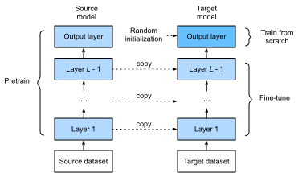

# Tinh Chỉnh
<a id="sec_fine_tuning"></a>

Trong các chương trước, chúng ta đã thảo luận cách huấn luyện mô hình trên tập huấn luyện Fashion-MNIST chỉ với 60000 ảnh. Chúng ta cũng đã mô tả ImageNet, tập dữ liệu ảnh quy mô lớn được dùng rộng rãi nhất trong học thuật, có hơn 10 triệu ảnh và 1000 đối tượng. Tuy nhiên, kích thước của tập dữ liệu mà chúng ta thường gặp nằm giữa hai tập dữ liệu này.


Giả sử chúng ta muốn nhận dạng các loại ghế khác nhau từ ảnh, rồi đề xuất liên kết mua hàng cho người dùng.
Một phương pháp khả dĩ là trước hết xác định
100 loại ghế phổ biến,
chụp 1000 ảnh từ các góc khác nhau cho mỗi ghế,
rồi huấn luyện một mô hình phân loại trên tập dữ liệu ảnh đã thu thập.
Mặc dù tập dữ liệu ghế này có thể lớn hơn tập dữ liệu Fashion-MNIST,
số ví dụ vẫn chưa bằng một phần mười
số ví dụ trong ImageNet.
Điều này có thể dẫn đến quá khớp của các mô hình phức tạp
phù hợp với ImageNet trên tập dữ liệu ghế này.
Bên cạnh đó, do lượng ví dụ huấn luyện hạn chế,
độ chính xác của mô hình đã huấn luyện
có thể không đáp ứng yêu cầu thực tế.


Để xử lý các vấn đề trên,
một giải pháp hiển nhiên là thu thập thêm dữ liệu.
Tuy nhiên, thu thập và gán nhãn dữ liệu có thể tốn nhiều thời gian và tiền bạc.
Ví dụ, để thu thập tập dữ liệu ImageNet, các nhà nghiên cứu đã tiêu tốn hàng triệu đô la từ kinh phí nghiên cứu.
Mặc dù chi phí thu thập dữ liệu hiện nay đã giảm đáng kể, chi phí này vẫn không thể bỏ qua.


Một giải pháp khác là áp dụng *transfer learning* để chuyển kiến thức đã học từ *tập dữ liệu nguồn* sang *tập dữ liệu đích*.
Ví dụ, mặc dù hầu hết ảnh trong tập dữ liệu ImageNet không liên quan gì đến ghế, mô hình được huấn luyện trên tập dữ liệu này có thể trích xuất các đặc trưng ảnh tổng quát hơn, giúp nhận dạng cạnh, kết cấu, hình dạng và bố cục đối tượng.
Những đặc trưng tương tự này
cũng có thể hiệu quả cho việc nhận dạng ghế.


## Các Bước


Trong phần này, chúng ta sẽ giới thiệu một kỹ thuật phổ biến trong transfer learning: *tinh chỉnh*. Như minh họa trong [fig_finetune](#fig_finetune), tinh chỉnh gồm bốn bước sau:


1. Huấn luyện trước một mô hình mạng nơ-ron, tức là *mô hình nguồn*, trên một tập dữ liệu nguồn (ví dụ tập dữ liệu ImageNet).
1. Tạo một mô hình mạng nơ-ron mới, tức là *mô hình đích*. Mô hình này sao chép toàn bộ thiết kế mô hình và các tham số của mô hình nguồn, ngoại trừ lớp đầu ra. Chúng ta giả định rằng các tham số mô hình này chứa kiến thức đã học từ tập dữ liệu nguồn và kiến thức này cũng sẽ áp dụng được cho tập dữ liệu đích. Chúng ta cũng giả định rằng lớp đầu ra của mô hình nguồn liên quan chặt chẽ đến nhãn của tập dữ liệu nguồn; do đó nó không được dùng trong mô hình đích.
1. Thêm một lớp đầu ra vào mô hình đích, có số đầu ra bằng số hạng mục trong tập dữ liệu đích. Sau đó khởi tạo ngẫu nhiên các tham số mô hình của lớp này.
1. Huấn luyện mô hình đích trên tập dữ liệu đích, chẳng hạn một tập dữ liệu ghế. Lớp đầu ra sẽ được huấn luyện từ đầu, trong khi tham số của tất cả các lớp còn lại được tinh chỉnh dựa trên tham số của mô hình nguồn.


<a id="fig_finetune"></a>

Khi tập dữ liệu đích nhỏ hơn nhiều so với tập dữ liệu nguồn, tinh chỉnh giúp cải thiện khả năng khái quát hóa của mô hình.


## Nhận Dạng Hot Dog

Hãy minh họa tinh chỉnh bằng một trường hợp cụ thể:
nhận dạng hot dog.
Chúng ta sẽ tinh chỉnh một mô hình ResNet trên một tập dữ liệu nhỏ,
mô hình này đã được huấn luyện trước trên tập dữ liệu ImageNet.
Tập dữ liệu nhỏ này gồm
hàng nghìn ảnh có và không có hot dog.
Chúng ta sẽ dùng mô hình đã tinh chỉnh để nhận dạng
hot dog từ ảnh.

```python
#@tab mxnet
%matplotlib inline
from d2l import mxnet as d2l
from mxnet import gluon, init, np, npx
from mxnet.gluon import nn
import os

npx.set_np()
```

```python
#@tab pytorch
%matplotlib inline
from d2l import torch as d2l
from torch import nn
import torch
import torchvision
import os
```

### Đọc Tập Dữ Liệu

[**Tập dữ liệu hot dog mà chúng ta dùng được lấy từ ảnh trực tuyến**].
Tập dữ liệu này gồm
1400 ảnh lớp dương chứa hot dog,
và cùng số lượng ảnh lớp âm chứa các món ăn khác.
1000 ảnh của cả hai lớp được dùng để huấn luyện và phần còn lại dùng để kiểm tra.


Sau khi giải nén tập dữ liệu đã tải xuống,
chúng ta thu được hai thư mục `hotdog/train` và `hotdog/test`. Cả hai thư mục đều có các thư mục con `hotdog` và `not-hotdog`, mỗi thư mục chứa ảnh của
lớp tương ứng.

```python
#@tab all
d2l.DATA_HUB['hotdog'] = (d2l.DATA_URL + 'hotdog.zip', 
                         'fba480ffa8aa7e0febbb511d181409f899b9baa5')

data_dir = d2l.download_extract('hotdog')
```

Chúng ta tạo hai thể hiện để đọc tất cả file ảnh trong tập dữ liệu huấn luyện và kiểm tra tương ứng.

```python
#@tab mxnet
train_imgs = gluon.data.vision.ImageFolderDataset(
    os.path.join(data_dir, 'train'))
test_imgs = gluon.data.vision.ImageFolderDataset(
    os.path.join(data_dir, 'test'))
```

```python
#@tab pytorch
train_imgs = torchvision.datasets.ImageFolder(os.path.join(data_dir, 'train'))
test_imgs = torchvision.datasets.ImageFolder(os.path.join(data_dir, 'test'))
```

8 ví dụ dương đầu tiên và 8 ảnh âm cuối cùng được hiển thị bên dưới. Như bạn có thể thấy, [**các ảnh khác nhau về kích thước và tỷ lệ khung hình**].

```python
#@tab all
hotdogs = [train_imgs[i][0] for i in range(8)]
not_hotdogs = [train_imgs[-i - 1][0] for i in range(8)]
d2l.show_images(hotdogs + not_hotdogs, 2, 8, scale=1.4);
```

Trong quá trình huấn luyện, trước hết chúng ta cắt một vùng ngẫu nhiên có kích thước ngẫu nhiên và tỷ lệ khung hình ngẫu nhiên từ ảnh,
rồi đổi thang vùng này
thành ảnh đầu vào $224 \times 224$.
Trong quá trình kiểm tra, chúng ta đổi thang cả chiều cao và chiều rộng của ảnh thành 256 pixel, rồi cắt một vùng trung tâm $224 \times 224$ làm đầu vào.
Ngoài ra,
với ba kênh màu RGB (đỏ, xanh lá và xanh dương),
chúng ta *chuẩn hóa* giá trị của chúng theo từng kênh.
Cụ thể,
giá trị trung bình của một kênh được trừ khỏi mỗi giá trị của kênh đó, rồi kết quả được chia cho độ lệch chuẩn của kênh đó.

[~~Tăng cường dữ liệu~~]

```python
#@tab mxnet
# Specify the means and standard deviations of the three RGB channels to
# standardize each channel
normalize = gluon.data.vision.transforms.Normalize(
    [0.485, 0.456, 0.406], [0.229, 0.224, 0.225])

train_augs = gluon.data.vision.transforms.Compose([
    gluon.data.vision.transforms.RandomResizedCrop(224),
    gluon.data.vision.transforms.RandomFlipLeftRight(),
    gluon.data.vision.transforms.ToTensor(),
    normalize])

test_augs = gluon.data.vision.transforms.Compose([
    gluon.data.vision.transforms.Resize(256),
    gluon.data.vision.transforms.CenterCrop(224),
    gluon.data.vision.transforms.ToTensor(),
    normalize])
```

```python
#@tab pytorch
# Specify the means and standard deviations of the three RGB channels to
# standardize each channel
normalize = torchvision.transforms.Normalize(
    [0.485, 0.456, 0.406], [0.229, 0.224, 0.225])

train_augs = torchvision.transforms.Compose([
    torchvision.transforms.RandomResizedCrop(224),
    torchvision.transforms.RandomHorizontalFlip(),
    torchvision.transforms.ToTensor(),
    normalize])

test_augs = torchvision.transforms.Compose([
    torchvision.transforms.Resize([256, 256]),
    torchvision.transforms.CenterCrop(224),
    torchvision.transforms.ToTensor(),
    normalize])
```

### [**Định Nghĩa và Khởi Tạo Mô Hình**]

Chúng ta dùng ResNet-18, đã được huấn luyện trước trên tập dữ liệu ImageNet, làm mô hình nguồn. Ở đây, chúng ta chỉ định `pretrained=True` để tự động tải xuống các tham số mô hình đã huấn luyện trước.
Nếu mô hình này được dùng lần đầu,
cần có kết nối Internet để tải xuống.

```python
#@tab mxnet
pretrained_net = gluon.model_zoo.vision.resnet18_v2(pretrained=True)
```

```python
#@tab pytorch
pretrained_net = torchvision.models.resnet18(pretrained=True)
```


Thể hiện mô hình nguồn đã huấn luyện trước chứa một số lớp đặc trưng và một lớp đầu ra `fc`.
Mục đích chính của phép chia này là hỗ trợ tinh chỉnh tham số mô hình của tất cả các lớp ngoại trừ lớp đầu ra. Biến thành viên `fc` của mô hình nguồn được cho bên dưới.

```python
#@tab mxnet
pretrained_net.output
```

```python
#@tab pytorch
pretrained_net.fc
```

Là một lớp kết nối đầy đủ, nó biến đổi các đầu ra global average pooling cuối cùng của ResNet thành 1000 đầu ra lớp của tập dữ liệu ImageNet.
Sau đó chúng ta xây dựng một mạng nơ-ron mới làm mô hình đích. Nó được định nghĩa giống mô hình nguồn đã huấn luyện trước, ngoại trừ
số đầu ra trong lớp cuối cùng
được đặt bằng
số lớp trong tập dữ liệu đích (thay vì 1000).

Trong đoạn mã bên dưới, các tham số mô hình trước lớp đầu ra của thể hiện mô hình đích `finetune_net` được khởi tạo bằng các tham số mô hình của các lớp tương ứng từ mô hình nguồn.
Vì các tham số mô hình này được thu được thông qua huấn luyện trước trên ImageNet,
chúng hiệu quả.
Do đó, chúng ta chỉ có thể dùng
một tốc độ học nhỏ để *tinh chỉnh* các tham số đã huấn luyện trước như vậy.
Ngược lại, các tham số mô hình trong lớp đầu ra được khởi tạo ngẫu nhiên và thường cần tốc độ học lớn hơn để được học từ đầu.
Cho tốc độ học cơ sở là $\eta$, tốc độ học $10\eta$ sẽ được dùng để lặp các tham số mô hình trong lớp đầu ra.

```python
#@tab mxnet
finetune_net = gluon.model_zoo.vision.resnet18_v2(classes=2)
finetune_net.features = pretrained_net.features
finetune_net.output.initialize(init.Xavier())
# The model parameters in the output layer will be iterated using a learning
# rate ten times greater
finetune_net.output.collect_params().setattr('lr_mult', 10)
```

```python
#@tab pytorch
finetune_net = torchvision.models.resnet18(pretrained=True)
finetune_net.fc = nn.Linear(finetune_net.fc.in_features, 2)
nn.init.xavier_uniform_(finetune_net.fc.weight);
```

### [**Tinh Chỉnh Mô Hình**]

Trước hết, chúng ta định nghĩa một hàm huấn luyện `train_fine_tuning` dùng tinh chỉnh để có thể được gọi nhiều lần.

```python
#@tab mxnet
def train_fine_tuning(net, learning_rate, batch_size=128, num_epochs=5):
    train_iter = gluon.data.DataLoader(
        train_imgs.transform_first(train_augs), batch_size, shuffle=True)
    test_iter = gluon.data.DataLoader(
        test_imgs.transform_first(test_augs), batch_size)
    devices = d2l.try_all_gpus()
    net.collect_params().reset_ctx(devices)
    net.hybridize()
    loss = gluon.loss.SoftmaxCrossEntropyLoss()
    trainer = gluon.Trainer(net.collect_params(), 'sgd', {
        'learning_rate': learning_rate, 'wd': 0.001})
    d2l.train_ch13(net, train_iter, test_iter, loss, trainer, num_epochs,
                   devices)
```

```python
#@tab pytorch
# If `param_group=True`, the model parameters in the output layer will be
# updated using a learning rate ten times greater
def train_fine_tuning(net, learning_rate, batch_size=128, num_epochs=5,
                      param_group=True):
    train_iter = torch.utils.data.DataLoader(torchvision.datasets.ImageFolder(
        os.path.join(data_dir, 'train'), transform=train_augs),
        batch_size=batch_size, shuffle=True)
    test_iter = torch.utils.data.DataLoader(torchvision.datasets.ImageFolder(
        os.path.join(data_dir, 'test'), transform=test_augs),
        batch_size=batch_size)
    devices = d2l.try_all_gpus()
    loss = nn.CrossEntropyLoss(reduction="none")
    if param_group:
        params_1x = [param for name, param in net.named_parameters()
             if name not in ["fc.weight", "fc.bias"]]
        trainer = torch.optim.SGD([{'params': params_1x},
                                   {'params': net.fc.parameters(),
                                    'lr': learning_rate * 10}],
                                lr=learning_rate, weight_decay=0.001)
    else:
        trainer = torch.optim.SGD(net.parameters(), lr=learning_rate,
                                  weight_decay=0.001)    
    d2l.train_ch13(net, train_iter, test_iter, loss, trainer, num_epochs,
                   devices)
```

Chúng ta [**đặt tốc độ học cơ sở thành một giá trị nhỏ**]
để *tinh chỉnh* các tham số mô hình thu được thông qua huấn luyện trước. Dựa trên các thiết lập trước đó, chúng ta sẽ huấn luyện các tham số lớp đầu ra của mô hình đích từ đầu bằng tốc độ học lớn hơn mười lần.

```python
#@tab mxnet
train_fine_tuning(finetune_net, 0.01)
```

```python
#@tab pytorch
train_fine_tuning(finetune_net, 5e-5)
```

[**Để so sánh,**] chúng ta định nghĩa một mô hình giống hệt, nhưng (**khởi tạo tất cả tham số mô hình của nó bằng các giá trị ngẫu nhiên**). Vì toàn bộ mô hình cần được huấn luyện từ đầu, chúng ta có thể dùng tốc độ học lớn hơn.

```python
#@tab mxnet
scratch_net = gluon.model_zoo.vision.resnet18_v2(classes=2)
scratch_net.initialize(init=init.Xavier())
train_fine_tuning(scratch_net, 0.1)
```

```python
#@tab pytorch
scratch_net = torchvision.models.resnet18()
scratch_net.fc = nn.Linear(scratch_net.fc.in_features, 2)
train_fine_tuning(scratch_net, 5e-4, param_group=False)
```

Như chúng ta có thể thấy, mô hình được tinh chỉnh thường hoạt động tốt hơn với cùng số epoch
vì các giá trị tham số ban đầu của nó hiệu quả hơn.


## Tóm Tắt

* Transfer learning chuyển kiến thức đã học từ tập dữ liệu nguồn sang tập dữ liệu đích. Tinh chỉnh là một kỹ thuật phổ biến cho transfer learning.
* Mô hình đích sao chép tất cả thiết kế mô hình cùng tham số từ mô hình nguồn, ngoại trừ lớp đầu ra, và tinh chỉnh các tham số này dựa trên tập dữ liệu đích. Ngược lại, lớp đầu ra của mô hình đích cần được huấn luyện từ đầu.
* Nói chung, tinh chỉnh tham số dùng tốc độ học nhỏ hơn, trong khi huấn luyện lớp đầu ra từ đầu có thể dùng tốc độ học lớn hơn.


## Bài Tập

1. Tiếp tục tăng tốc độ học của `finetune_net`. Độ chính xác của mô hình thay đổi như thế nào?
2. Điều chỉnh thêm siêu tham số của `finetune_net` và `scratch_net` trong thí nghiệm so sánh. Chúng vẫn khác nhau về độ chính xác không?
3. Đặt các tham số trước lớp đầu ra của `finetune_net` bằng các tham số của mô hình nguồn và *không* cập nhật chúng trong quá trình huấn luyện. Độ chính xác của mô hình thay đổi như thế nào? Bạn có thể dùng đoạn mã sau.

```python
#@tab mxnet
finetune_net.features.collect_params().setattr('grad_req', 'null')
```

```python
#@tab pytorch
for param in finetune_net.parameters():
    param.requires_grad = False
```

4. Thực ra có một lớp "hotdog" trong tập dữ liệu `ImageNet`. Tham số trọng số tương ứng của nó trong lớp đầu ra có thể được thu được bằng đoạn mã sau. Chúng ta có thể tận dụng tham số trọng số này như thế nào?

```python
#@tab mxnet
weight = pretrained_net.output.weight
hotdog_w = np.split(weight.data(), 1000, axis=0)[713]
hotdog_w.shape
```

```python
#@tab pytorch
weight = pretrained_net.fc.weight
hotdog_w = torch.split(weight.data, 1, dim=0)[934]
hotdog_w.shape
```


[Discussions](https://discuss.d2l.ai/t/1439)
