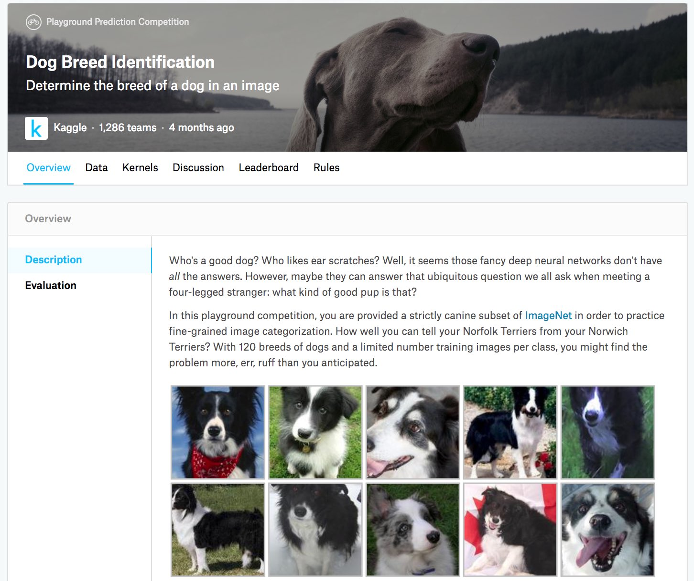

# Nhận Diện Giống Chó (ImageNet Dogs) Trên Kaggle

Trong mục này, chúng ta sẽ thực hành
bài toán nhận diện giống chó trên
Kaggle. (**Địa chỉ web của cuộc thi này là https://www.kaggle.com/c/dog-breed-identification**)

Trong cuộc thi này,
120 giống chó khác nhau sẽ được nhận dạng.
Thực ra,
tập dữ liệu cho cuộc thi này là
một tập con của tập dữ liệu ImageNet.
Khác với các ảnh trong tập dữ liệu CIFAR-10 ở [sec_kaggle_cifar10](#sec_kaggle_cifar10),
các ảnh trong tập dữ liệu ImageNet có chiều cao và chiều rộng lớn hơn, với kích thước thay đổi.
[fig_kaggle_dog](#fig_kaggle_dog) hiển thị thông tin trên trang web cuộc thi. Bạn cần một tài khoản Kaggle
để nộp kết quả.



:width:`400px`
<a id="fig_kaggle_dog"></a>

```python
#@tab mxnet
from d2l import mxnet as d2l
from mxnet import autograd, gluon, init, npx
from mxnet.gluon import nn
import os

npx.set_np()
```

```python
#@tab pytorch
from d2l import torch as d2l
import torch
import torchvision
from torch import nn
import os
```

## Lấy và Tổ Chức Tập Dữ Liệu

Tập dữ liệu cuộc thi được chia thành tập huấn luyện và tập kiểm tra, lần lượt chứa 10222 và 10357 ảnh JPEG
với ba kênh RGB (màu).
Trong tập dữ liệu huấn luyện,
có 120 giống chó
như Labrador, Poodle, Dachshund, Samoyed, Husky, Chihuahua, và Yorkshire Terrier.


### Tải Xuống Tập Dữ Liệu

Sau khi đăng nhập vào Kaggle,
bạn có thể nhấp vào thẻ "Data" trên
trang cuộc thi được hiển thị trong [fig_kaggle_dog](#fig_kaggle_dog) và tải tập dữ liệu bằng cách nhấp vào nút "Download All".
Sau khi giải nén tệp đã tải xuống trong `../data`, bạn sẽ thấy toàn bộ tập dữ liệu trong các đường dẫn sau:

* ../data/dog-breed-identification/labels.csv
* ../data/dog-breed-identification/sample_submission.csv
* ../data/dog-breed-identification/train
* ../data/dog-breed-identification/test

Bạn có thể đã nhận ra rằng cấu trúc trên
tương tự với cuộc thi CIFAR-10 trong [sec_kaggle_cifar10](#sec_kaggle_cifar10), trong đó các thư mục `train/` và `test/` lần lượt chứa ảnh chó huấn luyện và kiểm tra, còn `labels.csv` chứa
nhãn cho các ảnh huấn luyện.
Tương tự, để bắt đầu dễ hơn, [**chúng tôi cung cấp một mẫu nhỏ của tập dữ liệu**] đã đề cập ở trên: `train_valid_test_tiny.zip`.
Nếu bạn định dùng tập dữ liệu đầy đủ cho cuộc thi Kaggle, bạn cần đổi biến `demo` bên dưới thành `False`.

```python
#@tab all
d2l.DATA_HUB['dog_tiny'] = (d2l.DATA_URL + 'kaggle_dog_tiny.zip',
                            '0cb91d09b814ecdc07b50f31f8dcad3e81d6a86d')

# If you use the full dataset downloaded for the Kaggle competition, change
# the variable below to `False`
demo = True
if demo:
    data_dir = d2l.download_extract('dog_tiny')
else:
    data_dir = os.path.join('..', 'data', 'dog-breed-identification')
```

### [**Tổ Chức Tập Dữ Liệu**]

Chúng ta có thể tổ chức tập dữ liệu tương tự như đã làm trong [sec_kaggle_cifar10](#sec_kaggle_cifar10), tức là tách
một tập kiểm định ra khỏi tập huấn luyện ban đầu, và chuyển ảnh vào các thư mục con được nhóm theo nhãn.

Hàm `reorg_dog_data` bên dưới đọc
nhãn dữ liệu huấn luyện, tách tập kiểm định, và tổ chức tập huấn luyện.

```python
#@tab all
def reorg_dog_data(data_dir, valid_ratio):
    labels = d2l.read_csv_labels(os.path.join(data_dir, 'labels.csv'))
    d2l.reorg_train_valid(data_dir, labels, valid_ratio)
    d2l.reorg_test(data_dir)


batch_size = 32 if demo else 128
valid_ratio = 0.1
reorg_dog_data(data_dir, valid_ratio)
```

## [**Tăng Cường Ảnh**]

Nhắc lại rằng tập dữ liệu giống chó này
là một tập con của tập dữ liệu ImageNet,
có các ảnh
lớn hơn ảnh của tập dữ liệu CIFAR-10
trong [sec_kaggle_cifar10](#sec_kaggle_cifar10).
Sau đây
liệt kê một vài thao tác tăng cường ảnh
có thể hữu ích cho các ảnh tương đối lớn hơn.

```python
#@tab mxnet
transform_train = gluon.data.vision.transforms.Compose([
    # Randomly crop the image to obtain an image with an area of 0.08 to 1 of
    # the original area and height-to-width ratio between 3/4 and 4/3. Then,
    # scale the image to create a new 224 x 224 image
    gluon.data.vision.transforms.RandomResizedCrop(224, scale=(0.08, 1.0),
                                                   ratio=(3.0/4.0, 4.0/3.0)),
    gluon.data.vision.transforms.RandomFlipLeftRight(),
    # Randomly change the brightness, contrast, and saturation
    gluon.data.vision.transforms.RandomColorJitter(brightness=0.4,
                                                   contrast=0.4,
                                                   saturation=0.4),
    # Add random noise
    gluon.data.vision.transforms.RandomLighting(0.1),
    gluon.data.vision.transforms.ToTensor(),
    # Standardize each channel of the image
    gluon.data.vision.transforms.Normalize([0.485, 0.456, 0.406],
                                           [0.229, 0.224, 0.225])])
```

```python
#@tab pytorch
transform_train = torchvision.transforms.Compose([
    # Randomly crop the image to obtain an image with an area of 0.08 to 1 of
    # the original area and height-to-width ratio between 3/4 and 4/3. Then,
    # scale the image to create a new 224 x 224 image
    torchvision.transforms.RandomResizedCrop(224, scale=(0.08, 1.0),
                                             ratio=(3.0/4.0, 4.0/3.0)),
    torchvision.transforms.RandomHorizontalFlip(),
    # Randomly change the brightness, contrast, and saturation
    torchvision.transforms.ColorJitter(brightness=0.4,
                                       contrast=0.4,
                                       saturation=0.4),
    # Add random noise
    torchvision.transforms.ToTensor(),
    # Standardize each channel of the image
    torchvision.transforms.Normalize([0.485, 0.456, 0.406],
                                     [0.229, 0.224, 0.225])])
```

Trong khi dự đoán,
chúng ta chỉ dùng các thao tác tiền xử lý ảnh
không có tính ngẫu nhiên.

```python
#@tab mxnet
transform_test = gluon.data.vision.transforms.Compose([
    gluon.data.vision.transforms.Resize(256),
    # Crop a 224 x 224 square area from the center of the image
    gluon.data.vision.transforms.CenterCrop(224),
    gluon.data.vision.transforms.ToTensor(),
    gluon.data.vision.transforms.Normalize([0.485, 0.456, 0.406],
                                           [0.229, 0.224, 0.225])])
```

```python
#@tab pytorch
transform_test = torchvision.transforms.Compose([
    torchvision.transforms.Resize(256),
    # Crop a 224 x 224 square area from the center of the image
    torchvision.transforms.CenterCrop(224),
    torchvision.transforms.ToTensor(),
    torchvision.transforms.Normalize([0.485, 0.456, 0.406],
                                     [0.229, 0.224, 0.225])])
```

## [**Đọc Tập Dữ Liệu**]

Như trong [sec_kaggle_cifar10](#sec_kaggle_cifar10),
chúng ta có thể đọc tập dữ liệu đã được tổ chức
gồm các tệp ảnh thô.

```python
#@tab mxnet
train_ds, valid_ds, train_valid_ds, test_ds = [
    gluon.data.vision.ImageFolderDataset(
        os.path.join(data_dir, 'train_valid_test', folder))
    for folder in ('train', 'valid', 'train_valid', 'test')]
```

```python
#@tab pytorch
train_ds, train_valid_ds = [torchvision.datasets.ImageFolder(
    os.path.join(data_dir, 'train_valid_test', folder),
    transform=transform_train) for folder in ['train', 'train_valid']]

valid_ds, test_ds = [torchvision.datasets.ImageFolder(
    os.path.join(data_dir, 'train_valid_test', folder),
    transform=transform_test) for folder in ['valid', 'test']]
```

Bên dưới, chúng ta tạo các thực thể iterator dữ liệu
theo cùng cách
như trong [sec_kaggle_cifar10](#sec_kaggle_cifar10).

```python
#@tab mxnet
train_iter, train_valid_iter = [gluon.data.DataLoader(
    dataset.transform_first(transform_train), batch_size, shuffle=True,
    last_batch='discard') for dataset in (train_ds, train_valid_ds)]

valid_iter = gluon.data.DataLoader(
    valid_ds.transform_first(transform_test), batch_size, shuffle=False,
    last_batch='discard')

test_iter = gluon.data.DataLoader(
    test_ds.transform_first(transform_test), batch_size, shuffle=False,
    last_batch='keep')
```

```python
#@tab pytorch
train_iter, train_valid_iter = [torch.utils.data.DataLoader(
    dataset, batch_size, shuffle=True, drop_last=True)
    for dataset in (train_ds, train_valid_ds)]

valid_iter = torch.utils.data.DataLoader(valid_ds, batch_size, shuffle=False,
                                         drop_last=True)

test_iter = torch.utils.data.DataLoader(test_ds, batch_size, shuffle=False,
                                        drop_last=False)
```

## [**Tinh Chỉnh Một Mô Hình Đã Huấn Luyện Trước**]

Một lần nữa,
tập dữ liệu cho cuộc thi này là một tập con của tập dữ liệu ImageNet.
Do đó, chúng ta có thể dùng cách tiếp cận đã thảo luận trong
[sec_fine_tuning](#sec_fine_tuning)
để chọn một mô hình đã huấn luyện trước trên
toàn bộ tập dữ liệu ImageNet và dùng nó để trích xuất đặc trưng ảnh, rồi đưa vào một
mạng đầu ra tùy chỉnh quy mô nhỏ.
Các API cấp cao của framework deep learning
cung cấp nhiều mô hình
đã huấn luyện trước trên tập dữ liệu ImageNet.
Ở đây, chúng ta chọn
một mô hình ResNet-34 đã huấn luyện trước,
trong đó chúng ta chỉ tái sử dụng
đầu vào của tầng đầu ra của mô hình này
(tức các đặc trưng
đã trích xuất).
Sau đó, chúng ta có thể thay tầng đầu ra gốc bằng một mạng đầu ra tùy chỉnh nhỏ
có thể được huấn luyện,
chẳng hạn xếp chồng hai
tầng kết nối đầy đủ.
Khác với thí nghiệm trong
[sec_fine_tuning](#sec_fine_tuning),
phần sau không
huấn luyện lại mô hình đã huấn luyện trước được dùng để
trích xuất đặc trưng. Điều này làm giảm thời gian huấn luyện và
bộ nhớ để lưu gradient.

Nhắc lại rằng chúng ta
đã chuẩn hóa ảnh bằng
trung bình và độ lệch chuẩn của ba kênh RGB cho toàn bộ tập dữ liệu ImageNet.
Thực ra,
điều này cũng nhất quán với thao tác chuẩn hóa
của mô hình đã huấn luyện trước trên ImageNet.

```python
#@tab mxnet
def get_net(devices):
    finetune_net = gluon.model_zoo.vision.resnet34_v2(pretrained=True)
    # Define a new output network
    finetune_net.output_new = nn.HybridSequential(prefix='')
    finetune_net.output_new.add(nn.Dense(256, activation='relu'))
    # There are 120 output categories
    finetune_net.output_new.add(nn.Dense(120))
    # Initialize the output network
    finetune_net.output_new.initialize(init.Xavier(), ctx=devices)
    # Distribute the model parameters to the CPUs or GPUs used for computation
    finetune_net.collect_params().reset_ctx(devices)
    return finetune_net
```

```python
#@tab pytorch
def get_net(devices):
    finetune_net = nn.Sequential()
    finetune_net.features = torchvision.models.resnet34(pretrained=True)
    # Define a new output network (there are 120 output categories)
    finetune_net.output_new = nn.Sequential(nn.Linear(1000, 256),
                                            nn.ReLU(),
                                            nn.Linear(256, 120))
    # Move the model to devices
    finetune_net = finetune_net.to(devices[0])
    # Freeze parameters of feature layers
    for param in finetune_net.features.parameters():
        param.requires_grad = False
    return finetune_net
```

Trước khi [**tính mất mát**],
trước hết chúng ta lấy đầu vào của tầng đầu ra của mô hình đã huấn luyện trước, tức đặc trưng đã trích xuất.
Sau đó, chúng ta dùng đặc trưng này làm đầu vào cho mạng đầu ra tùy chỉnh nhỏ của mình để tính mất mát.

```python
#@tab mxnet
loss = gluon.loss.SoftmaxCrossEntropyLoss()

def evaluate_loss(data_iter, net, devices):
    l_sum, n = 0.0, 0
    for features, labels in data_iter:
        X_shards, y_shards = d2l.split_batch(features, labels, devices)
        output_features = [net.features(X_shard) for X_shard in X_shards]
        outputs = [net.output_new(feature) for feature in output_features]
        ls = [loss(output, y_shard).sum() for output, y_shard
              in zip(outputs, y_shards)]
        l_sum += sum([float(l.sum()) for l in ls])
        n += labels.size
    return l_sum / n
```

```python
#@tab pytorch
loss = nn.CrossEntropyLoss(reduction='none')

def evaluate_loss(data_iter, net, devices):
    l_sum, n = 0.0, 0
    for features, labels in data_iter:
        features, labels = features.to(devices[0]), labels.to(devices[0])
        outputs = net(features)
        l = loss(outputs, labels)
        l_sum += l.sum()
        n += labels.numel()
    return l_sum / n
```

## Định Nghĩa [**Hàm Huấn Luyện**]

Chúng ta sẽ chọn mô hình và tinh chỉnh siêu tham số theo hiệu năng của mô hình trên tập kiểm định. Hàm huấn luyện mô hình `train` chỉ
lặp qua các tham số của mạng đầu ra tùy chỉnh nhỏ.

```python
#@tab mxnet
def train(net, train_iter, valid_iter, num_epochs, lr, wd, devices, lr_period,
          lr_decay):
    # Only train the small custom output network
    trainer = gluon.Trainer(net.output_new.collect_params(), 'sgd',
                            {'learning_rate': lr, 'momentum': 0.9, 'wd': wd})
    num_batches, timer = len(train_iter), d2l.Timer()
    legend = ['train loss']
    if valid_iter is not None:
        legend.append('valid loss')
    animator = d2l.Animator(xlabel='epoch', xlim=[1, num_epochs],
                            legend=legend)
    for epoch in range(num_epochs):
        metric = d2l.Accumulator(2)
        if epoch > 0 and epoch % lr_period == 0:
            trainer.set_learning_rate(trainer.learning_rate * lr_decay)
        for i, (features, labels) in enumerate(train_iter):
            timer.start()
            X_shards, y_shards = d2l.split_batch(features, labels, devices)
            output_features = [net.features(X_shard) for X_shard in X_shards]
            with autograd.record():
                outputs = [net.output_new(feature)
                           for feature in output_features]
                ls = [loss(output, y_shard).sum() for output, y_shard
                      in zip(outputs, y_shards)]
            for l in ls:
                l.backward()
            trainer.step(batch_size)
            metric.add(sum([float(l.sum()) for l in ls]), labels.shape[0])
            timer.stop()
            if (i + 1) % (num_batches // 5) == 0 or i == num_batches - 1:
                animator.add(epoch + (i + 1) / num_batches,
                             (metric[0] / metric[1], None))
        if valid_iter is not None:
            valid_loss = evaluate_loss(valid_iter, net, devices)
            animator.add(epoch + 1, (None, valid_loss))
    measures = f'train loss {metric[0] / metric[1]:.3f}'
    if valid_iter is not None:
        measures += f', valid loss {valid_loss:.3f}'
    print(measures + f'\n{metric[1] * num_epochs / timer.sum():.1f}'
          f' examples/sec on {str(devices)}')
```

```python
#@tab pytorch
def train(net, train_iter, valid_iter, num_epochs, lr, wd, devices, lr_period,
          lr_decay):
    # Only train the small custom output network
    net = nn.DataParallel(net, device_ids=devices).to(devices[0])
    trainer = torch.optim.SGD((param for param in net.parameters()
                               if param.requires_grad), lr=lr,
                              momentum=0.9, weight_decay=wd)
    scheduler = torch.optim.lr_scheduler.StepLR(trainer, lr_period, lr_decay)
    num_batches, timer = len(train_iter), d2l.Timer()
    legend = ['train loss']
    if valid_iter is not None:
        legend.append('valid loss')
    animator = d2l.Animator(xlabel='epoch', xlim=[1, num_epochs],
                            legend=legend)
    for epoch in range(num_epochs):
        metric = d2l.Accumulator(2)
        for i, (features, labels) in enumerate(train_iter):
            timer.start()
            features, labels = features.to(devices[0]), labels.to(devices[0])
            trainer.zero_grad()
            output = net(features)
            l = loss(output, labels).sum()
            l.backward()
            trainer.step()
            metric.add(l, labels.shape[0])
            timer.stop()
            if (i + 1) % (num_batches // 5) == 0 or i == num_batches - 1:
                animator.add(epoch + (i + 1) / num_batches,
                             (metric[0] / metric[1], None))
        measures = f'train loss {metric[0] / metric[1]:.3f}'
        if valid_iter is not None:
            valid_loss = evaluate_loss(valid_iter, net, devices)
            animator.add(epoch + 1, (None, valid_loss.detach().cpu()))
        scheduler.step()
    if valid_iter is not None:
        measures += f', valid loss {valid_loss:.3f}'
    print(measures + f'\n{metric[1] * num_epochs / timer.sum():.1f}'
          f' examples/sec on {str(devices)}')
```

## [**Huấn Luyện và Kiểm Định Mô Hình**]

Bây giờ chúng ta có thể huấn luyện và kiểm định mô hình.
Các siêu tham số sau đều có thể tinh chỉnh.
Ví dụ, có thể tăng số epoch. Vì `lr_period` và `lr_decay` lần lượt được đặt là 2 và 0.9, learning rate của thuật toán tối ưu sẽ được nhân với 0.9 sau mỗi 2 epoch.

```python
#@tab mxnet
devices, num_epochs, lr, wd = d2l.try_all_gpus(), 10, 5e-3, 1e-4
lr_period, lr_decay, net = 2, 0.9, get_net(devices)
net.hybridize()
train(net, train_iter, valid_iter, num_epochs, lr, wd, devices, lr_period,
      lr_decay)
```

```python
#@tab pytorch
devices, num_epochs, lr, wd = d2l.try_all_gpus(), 10, 1e-4, 1e-4
lr_period, lr_decay, net = 2, 0.9, get_net(devices)
train(net, train_iter, valid_iter, num_epochs, lr, wd, devices, lr_period,
      lr_decay)
```

## [**Phân Loại Tập Kiểm Tra**] và Nộp Kết Quả Trên Kaggle


Tương tự bước cuối cùng trong [sec_kaggle_cifar10](#sec_kaggle_cifar10),
cuối cùng toàn bộ dữ liệu có nhãn (bao gồm tập kiểm định) được dùng để huấn luyện mô hình và phân loại tập kiểm tra.
Chúng ta sẽ dùng mạng đầu ra tùy chỉnh đã huấn luyện
để phân loại.

```python
#@tab mxnet
net = get_net(devices)
net.hybridize()
train(net, train_valid_iter, None, num_epochs, lr, wd, devices, lr_period,
      lr_decay)

preds = []
for data, label in test_iter:
    output_features = net.features(data.as_in_ctx(devices[0]))
    output = npx.softmax(net.output_new(output_features))
    preds.extend(output.asnumpy())
ids = sorted(os.listdir(
    os.path.join(data_dir, 'train_valid_test', 'test', 'unknown')))
with open('submission.csv', 'w') as f:
    f.write('id,' + ','.join(train_valid_ds.synsets) + '\n')
    for i, output in zip(ids, preds):
        f.write(i.split('.')[0] + ',' + ','.join(
            [str(num) for num in output]) + '\n')
```

```python
#@tab pytorch
net = get_net(devices)
train(net, train_valid_iter, None, num_epochs, lr, wd, devices, lr_period,
      lr_decay)

preds = []
for data, label in test_iter:
    output = torch.nn.functional.softmax(net(data.to(devices[0])), dim=1)
    preds.extend(output.cpu().detach().numpy())
ids = sorted(os.listdir(
    os.path.join(data_dir, 'train_valid_test', 'test', 'unknown')))
with open('submission.csv', 'w') as f:
    f.write('id,' + ','.join(train_valid_ds.classes) + '\n')
    for i, output in zip(ids, preds):
        f.write(i.split('.')[0] + ',' + ','.join(
            [str(num) for num in output]) + '\n')
```

Đoạn code trên
sẽ tạo một tệp `submission.csv`
để nộp
lên Kaggle theo cùng cách đã mô tả trong [sec_kaggle_house](#sec_kaggle_house).


## Tóm Tắt


* Ảnh trong tập dữ liệu ImageNet lớn hơn (với kích thước thay đổi) so với ảnh CIFAR-10. Chúng ta có thể sửa các thao tác tăng cường ảnh cho các tác vụ trên tập dữ liệu khác.
* Để phân loại một tập con của tập dữ liệu ImageNet, chúng ta có thể tận dụng các mô hình đã huấn luyện trước trên toàn bộ tập dữ liệu ImageNet để trích xuất đặc trưng và chỉ huấn luyện một mạng đầu ra tùy chỉnh quy mô nhỏ. Điều này sẽ làm giảm thời gian tính toán và chi phí bộ nhớ.


## Bài Tập

1. Khi dùng tập dữ liệu đầy đủ của cuộc thi Kaggle, bạn có thể đạt kết quả nào khi tăng `batch_size` (kích thước batch) và `num_epochs` (số epoch) trong khi đặt một số siêu tham số khác là `lr = 0.01`, `lr_period = 10`, và `lr_decay = 0.1`?
1. Bạn có đạt kết quả tốt hơn nếu dùng một mô hình đã huấn luyện trước sâu hơn không? Bạn tinh chỉnh siêu tham số như thế nào? Bạn có thể cải thiện thêm kết quả không?


[Thảo luận](https://discuss.d2l.ai/t/1481)
