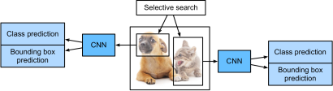

# CNN Dựa Trên Vùng (R-CNN)
<a id="sec_rcnn"></a>

Bên cạnh single shot multibox detection
đã mô tả trong [sec_ssd](#sec_ssd),
CNN dựa trên vùng hoặc vùng với đặc trưng CNN (R-CNN)
cũng nằm trong số nhiều cách tiếp cận tiên phong
để áp dụng
deep learning vào phát hiện đối tượng
[Girshick.Donahue.Darrell.ea.2014].
Trong mục này, chúng ta sẽ giới thiệu
R-CNN và chuỗi cải tiến của nó: fast R-CNN
[Girshick.2015], faster R-CNN [Ren.He.Girshick.ea.2015], và mask R-CNN
[He.Gkioxari.Dollar.ea.2017].
Do không gian có hạn, chúng ta sẽ chỉ
tập trung vào thiết kế của các mô hình này.


## R-CNN


*R-CNN* trước hết trích xuất
nhiều (ví dụ, 2000) *region proposal*
từ ảnh đầu vào
(ví dụ, anchor box cũng có thể được xem
như region proposal),
gán nhãn lớp và bounding box (ví dụ, offset) cho chúng.
[Girshick.Donahue.Darrell.ea.2014]
Sau đó, một CNN được dùng để
thực hiện lan truyền xuôi trên từng region proposal
nhằm trích xuất đặc trưng của nó.
Tiếp theo, đặc trưng của mỗi region proposal
được dùng để
dự đoán lớp và bounding box
của region proposal đó.



<a id="fig_r-cnn"></a>

[fig_r-cnn](#fig_r-cnn) minh họa mô hình R-CNN. Cụ thể hơn, R-CNN gồm bốn bước sau:

1. Thực hiện *selective search* để trích xuất nhiều region proposal chất lượng cao trên ảnh đầu vào [Uijlings.Van-De-Sande.Gevers.ea.2013]. Các vùng được đề xuất này thường được chọn ở nhiều tỉ lệ với các hình dạng và kích thước khác nhau. Mỗi region proposal sẽ được gán nhãn bằng một lớp và một ground-truth bounding box.
1. Chọn một CNN đã huấn luyện trước và cắt nó trước tầng đầu ra. Đổi kích thước mỗi region proposal về kích thước đầu vào mà mạng yêu cầu, rồi xuất ra các đặc trưng được trích xuất cho region proposal thông qua lan truyền xuôi.
1. Lấy đặc trưng đã trích xuất và lớp đã gán nhãn của mỗi region proposal làm một ví dụ. Huấn luyện nhiều máy vector hỗ trợ để phân loại đối tượng, trong đó mỗi máy vector hỗ trợ xác định riêng liệu ví dụ có chứa một lớp cụ thể hay không.
1. Lấy đặc trưng đã trích xuất và bounding box đã gán nhãn của mỗi region proposal làm một ví dụ. Huấn luyện một mô hình hồi quy tuyến tính để dự đoán ground-truth bounding box.


Mặc dù mô hình R-CNN dùng các CNN đã huấn luyện trước để trích xuất đặc trưng ảnh hiệu quả,
nó chậm.
Hãy tưởng tượng chúng ta chọn
hàng nghìn region proposal từ một ảnh đầu vào duy nhất:
điều này đòi hỏi hàng nghìn lần
lan truyền xuôi CNN để thực hiện phát hiện đối tượng.
Tải tính toán khổng lồ này
khiến việc sử dụng rộng rãi R-CNN trong các ứng dụng đời thực trở nên không khả thi.

## Fast R-CNN

Nút thắt hiệu năng chính của
một R-CNN nằm ở
việc lan truyền xuôi CNN độc lập
cho từng region proposal,
không chia sẻ tính toán.
Vì các vùng này thường
chồng lấp,
việc trích xuất đặc trưng độc lập dẫn tới
rất nhiều tính toán lặp lại.
Một trong những cải tiến lớn của
*fast R-CNN* so với
R-CNN là
lan truyền xuôi CNN
chỉ được thực hiện trên
toàn bộ ảnh [Girshick.2015].


<a id="fig_fast_r-cnn"></a>

[fig_fast_r-cnn](#fig_fast_r-cnn) mô tả mô hình fast R-CNN. Các phép tính chính của nó như sau:


1. So với R-CNN, trong fast R-CNN, đầu vào của CNN để trích xuất đặc trưng là toàn bộ ảnh, thay vì từng region proposal riêng lẻ. Hơn nữa, CNN này có thể được huấn luyện. Với một ảnh đầu vào, gọi hình dạng của đầu ra CNN là $1 \times c \times h_1  \times w_1$.
1. Giả sử selective search sinh $n$ region proposal. Các region proposal này (có hình dạng khác nhau) đánh dấu các vùng quan tâm (cũng có hình dạng khác nhau) trên đầu ra CNN. Sau đó, các vùng quan tâm này tiếp tục trích xuất các đặc trưng có cùng hình dạng (giả sử chiều cao $h_2$ và chiều rộng $w_2$ được chỉ định) để dễ nối lại. Để đạt được điều này, fast R-CNN giới thiệu tầng *region of interest (RoI) pooling*: đầu ra CNN và các region proposal được đưa vào tầng này, tạo ra các đặc trưng đã nối có hình dạng $n \times c \times h_2 \times w_2$ để được trích xuất tiếp cho tất cả region proposal.
1. Dùng một tầng kết nối đầy đủ, biến đổi các đặc trưng đã nối thành một đầu ra có hình dạng $n \times d$, trong đó $d$ phụ thuộc vào thiết kế mô hình.
1. Dự đoán lớp và bounding box cho từng region proposal trong $n$ region proposal. Cụ thể hơn, trong dự đoán lớp và bounding box, biến đổi đầu ra của tầng kết nối đầy đủ thành một đầu ra có hình dạng $n \times q$ ($q$ là số lớp) và một đầu ra có hình dạng $n \times 4$, tương ứng. Dự đoán lớp dùng hồi quy softmax.


Tầng region of interest pooling được đề xuất trong fast R-CNN khác với tầng pooling đã giới thiệu trong [sec_pooling](#sec_pooling).
Trong tầng pooling,
chúng ta điều khiển gián tiếp hình dạng đầu ra
bằng cách chỉ định kích thước của
cửa sổ pooling, padding, và stride.
Ngược lại,
chúng ta có thể chỉ định trực tiếp hình dạng đầu ra
trong tầng region of interest pooling.

Ví dụ, hãy chỉ định
chiều cao và chiều rộng đầu ra
cho mỗi vùng lần lượt là $h_2$ và $w_2$.
Với bất kỳ cửa sổ vùng quan tâm nào
có hình dạng $h \times w$,
cửa sổ này được chia thành một lưới $h_2 \times w_2$
các cửa sổ con,
trong đó hình dạng của mỗi cửa sổ con xấp xỉ
$(h/h_2) \times (w/w_2)$.
Trong thực tế,
chiều cao và chiều rộng của bất kỳ cửa sổ con nào sẽ được làm tròn lên, và phần tử lớn nhất sẽ được dùng làm đầu ra của cửa sổ con.
Do đó, tầng region of interest pooling có thể trích xuất các đặc trưng có cùng hình dạng
ngay cả khi các vùng quan tâm có hình dạng khác nhau.


Như một ví dụ minh họa,
trong [fig_roi](#fig_roi),
vùng quan tâm $3\times 3$ ở góc trên bên trái
được chọn trên một đầu vào $4 \times 4$.
Với vùng quan tâm này,
chúng ta dùng một tầng region of interest pooling $2\times 2$ để thu được
một đầu ra $2\times 2$.
Lưu ý rằng
mỗi trong bốn cửa sổ con được chia
chứa các phần tử
0, 1, 4, và 5 (5 là lớn nhất);
2 và 6 (6 là lớn nhất);
8 và 9 (9 là lớn nhất);
và 10.


<a id="fig_roi"></a>

Bên dưới, chúng ta minh họa phép tính của tầng region of interest pooling. Giả sử chiều cao và chiều rộng của các đặc trưng `X` được CNN trích xuất đều là 4, và chỉ có một kênh duy nhất.

```python
#@tab mxnet
from mxnet import np, npx

npx.set_np()

X = np.arange(16).reshape(1, 1, 4, 4)
X
```

```python
#@tab pytorch
import torch
import torchvision

X = torch.arange(16.).reshape(1, 1, 4, 4)
X
```

Hãy giả sử thêm
rằng chiều cao và chiều rộng của ảnh đầu vào đều là 40 pixel và selective search sinh hai region proposal trên ảnh này.
Mỗi region proposal
được biểu diễn bằng năm phần tử:
lớp đối tượng của nó, theo sau là tọa độ $(x, y)$ của góc trên bên trái và góc dưới bên phải.

```python
#@tab mxnet
rois = np.array([[0, 0, 0, 20, 20], [0, 0, 10, 30, 30]])
```

```python
#@tab pytorch
rois = torch.Tensor([[0, 0, 0, 20, 20], [0, 0, 10, 30, 30]])
```

Vì chiều cao và chiều rộng của `X` bằng $1/10$ chiều cao và chiều rộng của ảnh đầu vào,
tọa độ của hai region proposal
được nhân với 0.1 theo đối số `spatial_scale` đã chỉ định.
Sau đó hai vùng quan tâm được đánh dấu trên `X` lần lượt là `X[:, :, 0:3, 0:3]` và `X[:, :, 1:4, 0:4]`.
Cuối cùng, trong region of interest pooling $2\times 2`,
mỗi vùng quan tâm được chia
thành một lưới các cửa sổ con để
tiếp tục trích xuất đặc trưng có cùng hình dạng $2\times 2$.

```python
#@tab mxnet
npx.roi_pooling(X, rois, pooled_size=(2, 2), spatial_scale=0.1)
```

```python
#@tab pytorch
torchvision.ops.roi_pool(X, rois, output_size=(2, 2), spatial_scale=0.1)
```

## Faster R-CNN

Để chính xác hơn trong phát hiện đối tượng,
mô hình fast R-CNN
thường phải sinh
rất nhiều region proposal trong selective search.
Để giảm số region proposal
mà không mất độ chính xác,
*faster R-CNN*
đề xuất thay selective search bằng một *region proposal network* [Ren.He.Girshick.ea.2015].


<a id="fig_faster_r-cnn"></a>


[fig_faster_r-cnn](#fig_faster_r-cnn) minh họa mô hình faster R-CNN. So với fast R-CNN,
faster R-CNN chỉ thay đổi
phương pháp đề xuất vùng
từ selective search sang region proposal network.
Phần còn lại của mô hình
không đổi.
Region proposal network
hoạt động theo các bước sau:

1. Dùng một tầng tích chập $3\times 3$ với padding bằng 1 để biến đổi đầu ra CNN thành một đầu ra mới có $c$ kênh. Theo cách này, mỗi đơn vị theo các chiều không gian của các feature map được CNN trích xuất nhận một vector đặc trưng mới có độ dài $c$.
1. Với tâm tại mỗi pixel của các feature map, sinh nhiều anchor box có các tỉ lệ và tỉ số cạnh khác nhau rồi gán nhãn cho chúng.
1. Dùng vector đặc trưng độ dài $c$ tại tâm của mỗi anchor box, dự đoán lớp nhị phân (nền hoặc đối tượng) và bounding box cho anchor box này.
1. Xét các bounding box dự đoán có lớp dự đoán là đối tượng. Loại bỏ các kết quả chồng lấp bằng non-maximum suppression. Các bounding box dự đoán còn lại cho đối tượng là các region proposal mà tầng region of interest pooling cần.


Điều đáng chú ý là,
là một phần của mô hình faster R-CNN,
region
proposal network được huấn luyện chung
với phần còn lại của mô hình.
Nói cách khác, hàm mục tiêu của
faster R-CNN không chỉ bao gồm
dự đoán lớp và bounding box
trong phát hiện đối tượng,
mà còn cả dự đoán lớp nhị phân và bounding box
của anchor box trong region proposal network.
Nhờ huấn luyện end-to-end,
region proposal network học được
cách sinh các region proposal chất lượng cao,
để duy trì độ chính xác trong phát hiện đối tượng
với số lượng region proposal giảm đi
được học từ dữ liệu.


## Mask R-CNN

Trong tập dữ liệu huấn luyện,
nếu vị trí mức pixel của đối tượng
cũng được gán nhãn trên ảnh,
*mask R-CNN* có thể tận dụng hiệu quả
các nhãn chi tiết như vậy
để cải thiện thêm độ chính xác của phát hiện đối tượng [He.Gkioxari.Dollar.ea.2017].


<a id="fig_mask_r-cnn"></a>

Như trong [fig_mask_r-cnn](#fig_mask_r-cnn),
mask R-CNN
được sửa đổi dựa trên faster R-CNN.
Cụ thể,
mask R-CNN thay
tầng region of interest pooling bằng
tầng *region of interest (RoI) alignment*.
Tầng region of interest alignment này
dùng nội suy song tuyến tính
để bảo toàn thông tin không gian trên các feature map, điều này phù hợp hơn cho dự đoán mức pixel.
Đầu ra của tầng này
chứa các feature map có cùng hình dạng
cho tất cả vùng quan tâm.
Chúng được dùng
để dự đoán
không chỉ lớp và bounding box cho mỗi vùng quan tâm,
mà còn vị trí mức pixel của đối tượng thông qua một mạng tích chập đầy đủ bổ sung.
Chi tiết hơn về việc dùng một mạng tích chập đầy đủ để dự đoán ngữ nghĩa mức pixel của một ảnh
sẽ được trình bày
trong các mục tiếp theo của chương này.


## Tóm Tắt


* R-CNN trích xuất nhiều region proposal từ ảnh đầu vào, dùng một CNN để thực hiện lan truyền xuôi trên từng region proposal nhằm trích xuất đặc trưng của nó, sau đó dùng các đặc trưng này để dự đoán lớp và bounding box của region proposal đó.
* Một trong những cải tiến lớn của fast R-CNN so với R-CNN là lan truyền xuôi CNN chỉ được thực hiện trên toàn bộ ảnh. Nó cũng giới thiệu tầng region of interest pooling, nhờ đó các đặc trưng có cùng hình dạng có thể được trích xuất tiếp cho các vùng quan tâm có hình dạng khác nhau.
* Faster R-CNN thay selective search được dùng trong fast R-CNN bằng một region proposal network được huấn luyện chung, để mô hình trước có thể duy trì độ chính xác trong phát hiện đối tượng với số lượng region proposal giảm đi.
* Dựa trên faster R-CNN, mask R-CNN bổ sung thêm một mạng tích chập đầy đủ để tận dụng nhãn mức pixel nhằm cải thiện thêm độ chính xác của phát hiện đối tượng.


## Bài Tập

1. Chúng ta có thể mô hình hóa phát hiện đối tượng như một bài toán hồi quy đơn lẻ, chẳng hạn dự đoán bounding box và xác suất lớp, không? Bạn có thể tham khảo thiết kế của mô hình YOLO [Redmon.Divvala.Girshick.ea.2016].
1. So sánh single shot multibox detection với các phương pháp được giới thiệu trong mục này. Những khác biệt chính của chúng là gì? Bạn có thể tham khảo Hình 2 của Zhao.Zheng.Xu.ea.2019.


[Thảo luận](https://discuss.d2l.ai/t/1409)
