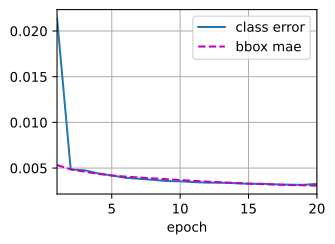
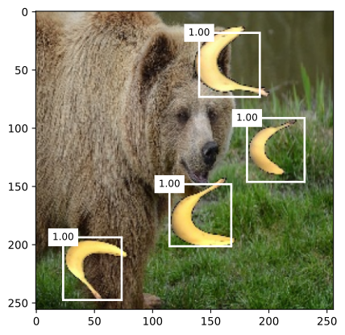
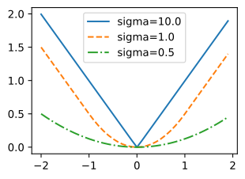
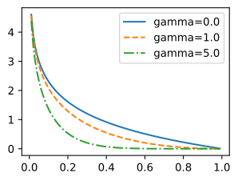

# Single Shot Multibox Detection
<a id="sec_ssd"></a>

Trong [sec_bbox](#sec_bbox)--[sec_object-detection-dataset](#sec_object-detection-dataset),
chúng ta đã giới thiệu bounding box, anchor box,
phát hiện đối tượng đa tỉ lệ, và tập dữ liệu cho phát hiện đối tượng.
Bây giờ chúng ta đã sẵn sàng dùng các kiến thức nền này
để thiết kế một mô hình phát hiện đối tượng:
single shot multibox detection
(SSD) [Liu.Anguelov.Erhan.ea.2016].
Mô hình này đơn giản, nhanh, và được dùng rộng rãi.
Mặc dù đây chỉ là một trong rất nhiều
mô hình phát hiện đối tượng,
một số nguyên lý thiết kế
và chi tiết hiện thực trong mục này
cũng áp dụng được cho các mô hình khác.


## Mô Hình

[fig_ssd](#fig_ssd) cung cấp một cái nhìn tổng quan về
thiết kế của single-shot multibox detection.
Mô hình này chủ yếu gồm
một mạng cơ sở
theo sau bởi
một số khối feature map đa tỉ lệ.
Mạng cơ sở
dùng để trích xuất đặc trưng từ ảnh đầu vào,
nên nó có thể dùng một CNN sâu.
Ví dụ,
bài báo single-shot multibox detection gốc
dùng một mạng VGG bị cắt trước
tầng phân loại [Liu.Anguelov.Erhan.ea.2016],
trong khi ResNet cũng thường được sử dụng.
Thông qua thiết kế của mình,
chúng ta có thể làm cho mạng cơ sở xuất ra
các feature map lớn hơn
để sinh nhiều anchor box hơn
cho việc phát hiện các đối tượng nhỏ hơn.
Sau đó,
mỗi khối feature map đa tỉ lệ
giảm (chẳng hạn còn một nửa)
chiều cao và chiều rộng của feature map
từ khối trước,
và cho phép mỗi đơn vị
của feature map
tăng trường tiếp nhận của nó trên ảnh đầu vào.


Nhắc lại thiết kế
của phát hiện đối tượng đa tỉ lệ
thông qua các biểu diễn theo tầng của ảnh bằng
mạng nơ-ron sâu
trong [sec_multiscale-object-detection](#sec_multiscale-object-detection).
Vì
các feature map đa tỉ lệ gần phía trên của [fig_ssd](#fig_ssd)
nhỏ hơn nhưng có trường tiếp nhận lớn hơn,
chúng phù hợp để phát hiện
ít đối tượng hơn nhưng lớn hơn.

Tóm lại,
thông qua mạng cơ sở và một số khối feature map đa tỉ lệ,
single-shot multibox detection
sinh số lượng anchor box khác nhau với các kích thước khác nhau,
và phát hiện các đối tượng có kích thước khác nhau
bằng cách dự đoán lớp và offset
của các anchor box này (và do đó là các bounding box);
vì vậy, đây là một mô hình phát hiện đối tượng đa tỉ lệ.


<a id="fig_ssd"></a>


Sau đây,
chúng ta sẽ mô tả các chi tiết hiện thực
của các khối khác nhau trong [fig_ssd](#fig_ssd). Đầu tiên, ta thảo luận cách hiện thực
dự đoán lớp và bounding box.


### [**Tầng Dự Đoán Lớp**]

Gọi số lớp đối tượng là $q$.
Khi đó các anchor box có $q+1$ lớp,
trong đó lớp 0 là nền.
Ở một tỉ lệ nào đó,
giả sử chiều cao và chiều rộng của feature map
lần lượt là $h$ và $w$.
Khi $a$ anchor box
được sinh với
mỗi vị trí không gian của các feature map này làm tâm,
tổng cộng $hwa$ anchor box cần được phân loại.
Điều này thường khiến việc phân loại bằng các tầng kết nối đầy đủ trở nên không khả thi do
chi phí tham số hóa có thể rất lớn.
Nhắc lại cách chúng ta dùng các kênh của
các tầng tích chập
để dự đoán lớp trong [sec_nin](#sec_nin).
Single-shot multibox detection dùng
cùng kỹ thuật này để giảm độ phức tạp của mô hình.

Cụ thể,
tầng dự đoán lớp dùng một tầng tích chập
không làm thay đổi chiều rộng hay chiều cao của feature map.
Theo cách này,
có thể có một tương ứng một-một
giữa đầu ra và đầu vào
tại cùng các chiều không gian (chiều rộng và chiều cao)
của feature map.
Cụ thể hơn,
các kênh của feature map đầu ra
tại bất kỳ vị trí không gian nào ($x$, $y$)
biểu diễn các dự đoán lớp
cho tất cả anchor box có tâm tại
($x$, $y$) của feature map đầu vào.
Để tạo các dự đoán hợp lệ,
cần có $a(q+1)$ kênh đầu ra,
trong đó tại cùng một vị trí không gian,
kênh đầu ra có chỉ số $i(q+1) + j$
biểu diễn dự đoán
lớp $j$ ($0 \leq j \leq q$)
cho anchor box $i$ ($0 \leq i < a$).

Bên dưới, chúng ta định nghĩa một tầng dự đoán lớp như vậy,
chỉ định $a$ và $q$ thông qua các đối số `num_anchors` và `num_classes`.
Tầng này dùng một tầng tích chập $3\times3$ với
padding bằng 1.
Chiều rộng và chiều cao của đầu vào và đầu ra của
tầng tích chập này không đổi.

```python
#@tab mxnet
%matplotlib inline
from d2l import mxnet as d2l
from mxnet import autograd, gluon, image, init, np, npx
from mxnet.gluon import nn

npx.set_np()

def cls_predictor(num_anchors, num_classes):
    return nn.Conv2D(num_anchors * (num_classes + 1), kernel_size=3,
                     padding=1)
```




```python
#@tab pytorch
%matplotlib inline
from d2l import torch as d2l
import torch
import torchvision
from torch import nn
from torch.nn import functional as F

def cls_predictor(num_inputs, num_anchors, num_classes):
    return nn.Conv2d(num_inputs, num_anchors * (num_classes + 1),
                     kernel_size=3, padding=1)
```




### (**Tầng Dự Đoán Bounding Box**)

Thiết kế của tầng dự đoán bounding box tương tự như tầng dự đoán lớp.
Khác biệt duy nhất nằm ở số lượng đầu ra cho mỗi anchor box:
ở đây chúng ta cần dự đoán bốn offset thay vì $q+1$ lớp.

```python
#@tab mxnet
def bbox_predictor(num_anchors):
    return nn.Conv2D(num_anchors * 4, kernel_size=3, padding=1)
```




```python
#@tab pytorch
def bbox_predictor(num_inputs, num_anchors):
    return nn.Conv2d(num_inputs, num_anchors * 4, kernel_size=3, padding=1)
```




### [**Nối Các Dự Đoán Cho Nhiều Tỉ Lệ**]

Như đã đề cập, single-shot multibox detection
dùng các feature map đa tỉ lệ để sinh anchor box và dự đoán lớp cũng như offset của chúng.
Ở các tỉ lệ khác nhau,
hình dạng của feature map
hoặc số anchor box có tâm tại cùng một đơn vị
có thể khác nhau.
Do đó,
hình dạng của đầu ra dự đoán
ở các tỉ lệ khác nhau có thể khác nhau.

Trong ví dụ sau,
chúng ta xây dựng các feature map ở hai tỉ lệ khác nhau,
`Y1` và `Y2`,
cho cùng một minibatch,
trong đó chiều cao và chiều rộng của `Y2`
bằng một nửa của `Y1`.
Hãy lấy dự đoán lớp làm ví dụ.
Giả sử
5 và 3 anchor box
được sinh cho mỗi đơn vị trong `Y1` và `Y2`, tương ứng.
Giả sử thêm rằng
số lớp đối tượng là 10.
Với các feature map `Y1` và `Y2`,
số kênh trong đầu ra dự đoán lớp
lần lượt là $5\times(10+1)=55$ và $3\times(10+1)=33$,
trong đó mỗi hình dạng đầu ra là
(kích thước batch, số kênh, chiều cao, chiều rộng).

```python
#@tab mxnet
def forward(x, block):
    block.initialize()
    return block(x)

Y1 = forward(np.zeros((2, 8, 20, 20)), cls_predictor(5, 10))
Y2 = forward(np.zeros((2, 16, 10, 10)), cls_predictor(3, 10))
Y1.shape, Y2.shape
```

```python
#@tab pytorch
def forward(x, block):
    return block(x)

Y1 = forward(torch.zeros((2, 8, 20, 20)), cls_predictor(8, 5, 10))
Y2 = forward(torch.zeros((2, 16, 10, 10)), cls_predictor(16, 3, 10))
Y1.shape, Y2.shape
```

Như có thể thấy, ngoại trừ chiều kích thước batch,
ba chiều còn lại đều có kích thước khác nhau.
Để nối hai đầu ra dự đoán này nhằm tính toán hiệu quả hơn,
chúng ta sẽ biến đổi các tensor này sang một định dạng nhất quán hơn.

Lưu ý rằng
chiều kênh chứa các dự đoán cho
các anchor box có cùng tâm.
Trước tiên, chúng ta chuyển chiều này vào trong cùng.
Vì kích thước batch giữ nguyên ở các tỉ lệ khác nhau,
ta có thể biến đổi đầu ra dự đoán
thành một tensor hai chiều
có hình dạng (kích thước batch, chiều cao $\times$ chiều rộng $\times$ số kênh).
Sau đó, ta có thể nối
các đầu ra như vậy ở các tỉ lệ khác nhau
theo chiều 1.

```python
#@tab mxnet
def flatten_pred(pred):
    return npx.batch_flatten(pred.transpose(0, 2, 3, 1))

def concat_preds(preds):
    return np.concatenate([flatten_pred(p) for p in preds], axis=1)
```

```python
#@tab pytorch
def flatten_pred(pred):
    return torch.flatten(pred.permute(0, 2, 3, 1), start_dim=1)

def concat_preds(preds):
    return torch.cat([flatten_pred(p) for p in preds], dim=1)
```

Theo cách này,
dù `Y1` và `Y2` có kích thước khác nhau
về kênh, chiều cao, và chiều rộng,
chúng ta vẫn có thể nối hai đầu ra dự đoán này ở hai tỉ lệ khác nhau cho cùng một minibatch.

```python
#@tab all
concat_preds([Y1, Y2]).shape
```

### [**Khối Giảm Mẫu**]

Để phát hiện đối tượng ở nhiều tỉ lệ,
chúng ta định nghĩa khối giảm mẫu `down_sample_blk` sau, có chức năng
giảm một nửa chiều cao và chiều rộng của feature map đầu vào.
Thực ra,
khối này áp dụng thiết kế của các khối VGG
trong [subsec_vgg-blocks](#subsec_vgg-blocks).
Cụ thể hơn,
mỗi khối giảm mẫu gồm
hai tầng tích chập $3\times3$ với padding bằng 1
theo sau bởi một tầng max-pooling $2\times2$ với stride bằng 2.
Như đã biết, các tầng tích chập $3\times3$ với padding bằng 1 không thay đổi hình dạng feature map.
Tuy nhiên, tầng max-pooling $2\times2$ sau đó làm giảm chiều cao và chiều rộng của feature map đầu vào còn một nửa.
Với cả feature map đầu vào và đầu ra của khối giảm mẫu này,
vì $1\times 2+(3-1)+(3-1)=6$,
mỗi đơn vị trong đầu ra
có trường tiếp nhận $6\times6$ trên đầu vào.
Do đó, khối giảm mẫu mở rộng trường tiếp nhận của mỗi đơn vị trong feature map đầu ra của nó.

```python
#@tab mxnet
def down_sample_blk(num_channels):
    blk = nn.Sequential()
    for _ in range(2):
        blk.add(nn.Conv2D(num_channels, kernel_size=3, padding=1),
                nn.BatchNorm(in_channels=num_channels),
                nn.Activation('relu'))
    blk.add(nn.MaxPool2D(2))
    return blk
```

```python
#@tab pytorch
def down_sample_blk(in_channels, out_channels):
    blk = []
    for _ in range(2):
        blk.append(nn.Conv2d(in_channels, out_channels,
                             kernel_size=3, padding=1))
        blk.append(nn.BatchNorm2d(out_channels))
        blk.append(nn.ReLU())
        in_channels = out_channels
    blk.append(nn.MaxPool2d(2))
    return nn.Sequential(*blk)
```

Trong ví dụ sau, khối giảm mẫu mà chúng ta xây dựng thay đổi số kênh đầu vào và giảm một nửa chiều cao cũng như chiều rộng của feature map đầu vào.

```python
#@tab mxnet
forward(np.zeros((2, 3, 20, 20)), down_sample_blk(10)).shape
```

```python
#@tab pytorch
forward(torch.zeros((2, 3, 20, 20)), down_sample_blk(3, 10)).shape
```

### [**Khối Mạng Cơ Sở**]

Khối mạng cơ sở được dùng để trích xuất đặc trưng từ ảnh đầu vào.
Để đơn giản,
chúng ta xây dựng một mạng cơ sở nhỏ
gồm ba khối giảm mẫu
nhân đôi số kênh ở mỗi khối.
Với một ảnh đầu vào $256\times256$,
khối mạng cơ sở này xuất ra các feature map $32 \times 32$ ($256/2^3=32$).

```python
#@tab mxnet
def base_net():
    blk = nn.Sequential()
    for num_filters in [16, 32, 64]:
        blk.add(down_sample_blk(num_filters))
    return blk

forward(np.zeros((2, 3, 256, 256)), base_net()).shape
```

```python
#@tab pytorch
def base_net():
    blk = []
    num_filters = [3, 16, 32, 64]
    for i in range(len(num_filters) - 1):
        blk.append(down_sample_blk(num_filters[i], num_filters[i+1]))
    return nn.Sequential(*blk)

forward(torch.zeros((2, 3, 256, 256)), base_net()).shape
```

### Mô Hình Hoàn Chỉnh


[**Mô hình
single shot multibox detection hoàn chỉnh
gồm năm khối.**]
Các feature map do mỗi khối tạo ra
được dùng cho cả
(i) sinh anchor box
và (ii) dự đoán lớp và offset của các anchor box này.
Trong năm khối này,
khối đầu tiên
là khối mạng cơ sở,
khối thứ hai đến thứ tư là
các khối giảm mẫu,
và khối cuối cùng
dùng global max-pooling
để giảm cả chiều cao và chiều rộng xuống 1.
Về mặt kỹ thuật,
khối thứ hai đến thứ năm
đều là
những khối feature map đa tỉ lệ
trong [fig_ssd](#fig_ssd).

```python
#@tab mxnet
def get_blk(i):
    if i == 0:
        blk = base_net()
    elif i == 4:
        blk = nn.GlobalMaxPool2D()
    else:
        blk = down_sample_blk(128)
    return blk
```

```python
#@tab pytorch
def get_blk(i):
    if i == 0:
        blk = base_net()
    elif i == 1:
        blk = down_sample_blk(64, 128)
    elif i == 4:
        blk = nn.AdaptiveMaxPool2d((1,1))
    else:
        blk = down_sample_blk(128, 128)
    return blk
```

Bây giờ chúng ta [**định nghĩa lan truyền xuôi**]
cho mỗi khối.
Khác với
các tác vụ phân loại ảnh,
đầu ra ở đây bao gồm
(i) feature map CNN `Y`,
(ii) anchor box được sinh bằng `Y` ở tỉ lệ hiện tại,
và (iii) lớp và offset được dự đoán (dựa trên `Y`)
cho các anchor box này.

```python
#@tab mxnet
def blk_forward(X, blk, size, ratio, cls_predictor, bbox_predictor):
    Y = blk(X)
    anchors = d2l.multibox_prior(Y, sizes=size, ratios=ratio)
    cls_preds = cls_predictor(Y)
    bbox_preds = bbox_predictor(Y)
    return (Y, anchors, cls_preds, bbox_preds)
```

```python
#@tab pytorch
def blk_forward(X, blk, size, ratio, cls_predictor, bbox_predictor):
    Y = blk(X)
    anchors = d2l.multibox_prior(Y, sizes=size, ratios=ratio)
    cls_preds = cls_predictor(Y)
    bbox_preds = bbox_predictor(Y)
    return (Y, anchors, cls_preds, bbox_preds)
```

Nhắc lại rằng
trong [fig_ssd](#fig_ssd),
một khối feature map đa tỉ lệ
càng gần phía trên
thì dùng để phát hiện các đối tượng càng lớn;
vì vậy, nó cần sinh các anchor box lớn hơn.
Trong lan truyền xuôi ở trên,
tại mỗi khối feature map đa tỉ lệ,
chúng ta truyền vào một danh sách gồm hai giá trị tỉ lệ
thông qua đối số `sizes`
của hàm `multibox_prior` được gọi (đã mô tả trong [sec_anchor](#sec_anchor)).
Sau đây,
khoảng giữa 0.2 và 1.05
được chia đều
thành năm đoạn để xác định
các giá trị tỉ lệ nhỏ hơn tại năm khối: 0.2, 0.37, 0.54, 0.71, và 0.88.
Sau đó, các giá trị tỉ lệ lớn hơn tương ứng
được cho bởi
$\sqrt{0.2 \times 0.37} = 0.272$, $\sqrt{0.37 \times 0.54} = 0.447$, v.v.

[~~Siêu tham số cho từng khối~~]

```python
#@tab all
sizes = [[0.2, 0.272], [0.37, 0.447], [0.54, 0.619], [0.71, 0.79],
         [0.88, 0.961]]
ratios = [[1, 2, 0.5]] * 5
num_anchors = len(sizes[0]) + len(ratios[0]) - 1
```

Bây giờ chúng ta có thể [**định nghĩa mô hình hoàn chỉnh**] `TinySSD` như sau.

```python
#@tab mxnet
class TinySSD(nn.Block):
    def __init__(self, num_classes, **kwargs):
        super(TinySSD, self).__init__(**kwargs)
        self.num_classes = num_classes
        for i in range(5):
            # Equivalent to the assignment statement `self.blk_i = get_blk(i)`
            setattr(self, f'blk_{i}', get_blk(i))
            setattr(self, f'cls_{i}', cls_predictor(num_anchors, num_classes))
            setattr(self, f'bbox_{i}', bbox_predictor(num_anchors))

    def forward(self, X):
        anchors, cls_preds, bbox_preds = [None] * 5, [None] * 5, [None] * 5
        for i in range(5):
            # Here `getattr(self, 'blk_%d' % i)` accesses `self.blk_i`
            X, anchors[i], cls_preds[i], bbox_preds[i] = blk_forward(
                X, getattr(self, f'blk_{i}'), sizes[i], ratios[i],
                getattr(self, f'cls_{i}'), getattr(self, f'bbox_{i}'))
        anchors = np.concatenate(anchors, axis=1)
        cls_preds = concat_preds(cls_preds)
        cls_preds = cls_preds.reshape(
            cls_preds.shape[0], -1, self.num_classes + 1)
        bbox_preds = concat_preds(bbox_preds)
        return anchors, cls_preds, bbox_preds
```

```python
#@tab pytorch
class TinySSD(nn.Module):
    def __init__(self, num_classes, **kwargs):
        super(TinySSD, self).__init__(**kwargs)
        self.num_classes = num_classes
        idx_to_in_channels = [64, 128, 128, 128, 128]
        for i in range(5):
            # Equivalent to the assignment statement `self.blk_i = get_blk(i)`
            setattr(self, f'blk_{i}', get_blk(i))
            setattr(self, f'cls_{i}', cls_predictor(idx_to_in_channels[i],
                                                    num_anchors, num_classes))
            setattr(self, f'bbox_{i}', bbox_predictor(idx_to_in_channels[i],
                                                      num_anchors))

    def forward(self, X):
        anchors, cls_preds, bbox_preds = [None] * 5, [None] * 5, [None] * 5
        for i in range(5):
            # Here `getattr(self, 'blk_%d' % i)` accesses `self.blk_i`
            X, anchors[i], cls_preds[i], bbox_preds[i] = blk_forward(
                X, getattr(self, f'blk_{i}'), sizes[i], ratios[i],
                getattr(self, f'cls_{i}'), getattr(self, f'bbox_{i}'))
        anchors = torch.cat(anchors, dim=1)
        cls_preds = concat_preds(cls_preds)
        cls_preds = cls_preds.reshape(
            cls_preds.shape[0], -1, self.num_classes + 1)
        bbox_preds = concat_preds(bbox_preds)
        return anchors, cls_preds, bbox_preds
```

Chúng ta [**tạo một thực thể mô hình
và dùng nó để thực hiện lan truyền xuôi**]
trên một minibatch ảnh $256 \times 256$ `X`.

Như đã chỉ ra trước đó trong mục này,
khối đầu tiên xuất ra các feature map $32 \times 32$.
Nhắc lại rằng
khối giảm mẫu thứ hai đến thứ tư
giảm một nửa chiều cao và chiều rộng,
và khối thứ năm dùng global pooling.
Vì 4 anchor box
được sinh cho mỗi đơn vị theo các chiều không gian
của feature map,
ở tất cả năm tỉ lệ,
tổng cộng $(32^2 + 16^2 + 8^2 + 4^2 + 1)\times 4 = 5444$ anchor box được sinh cho mỗi ảnh.

```python
#@tab mxnet
net = TinySSD(num_classes=1)
net.initialize()
X = np.zeros((32, 3, 256, 256))
anchors, cls_preds, bbox_preds = net(X)

print('output anchors:', anchors.shape)
print('output class preds:', cls_preds.shape)
print('output bbox preds:', bbox_preds.shape)
```

```python
#@tab pytorch
net = TinySSD(num_classes=1)
X = torch.zeros((32, 3, 256, 256))
anchors, cls_preds, bbox_preds = net(X)

print('output anchors:', anchors.shape)
print('output class preds:', cls_preds.shape)
print('output bbox preds:', bbox_preds.shape)
```

## Huấn Luyện

Bây giờ chúng ta sẽ giải thích
cách huấn luyện mô hình single shot multibox detection
cho phát hiện đối tượng.


### Đọc Tập Dữ Liệu và Khởi Tạo Mô Hình

Trước hết,
hãy [**đọc
tập dữ liệu phát hiện chuối**]
đã mô tả trong [sec_object-detection-dataset](#sec_object-detection-dataset).

```python
#@tab all
batch_size = 32
train_iter, _ = d2l.load_data_bananas(batch_size)
```

Trong tập dữ liệu phát hiện chuối chỉ có một lớp. Sau khi định nghĩa mô hình,
chúng ta cần (**khởi tạo các tham số của nó và định nghĩa
thuật toán tối ưu hóa**).

```python
#@tab mxnet
device, net = d2l.try_gpu(), TinySSD(num_classes=1)
net.initialize(init=init.Xavier(), ctx=device)
trainer = gluon.Trainer(net.collect_params(), 'sgd',
                        {'learning_rate': 0.2, 'wd': 5e-4})
```

```python
#@tab pytorch
device, net = d2l.try_gpu(), TinySSD(num_classes=1)
trainer = torch.optim.SGD(net.parameters(), lr=0.2, weight_decay=5e-4)
```

### [**Định Nghĩa Hàm Mất Mát và Hàm Đánh Giá**]

Phát hiện đối tượng có hai loại mất mát.
Mất mát thứ nhất liên quan tới lớp của anchor box:
việc tính toán của nó
có thể đơn giản tái sử dụng
hàm mất mát cross-entropy
mà chúng ta đã dùng cho phân loại ảnh.
Mất mát thứ hai
liên quan tới offset của các anchor box dương (không phải nền):
đây là một bài toán hồi quy.
Tuy nhiên, với bài toán hồi quy này,
ở đây chúng ta không dùng mất mát bình phương
đã mô tả trong [subsec_normal_distribution_and_squared_loss](#subsec_normal_distribution_and_squared_loss).
Thay vào đó,
chúng ta dùng mất mát chuẩn $\ell_1$,
tức giá trị tuyệt đối của sai khác giữa
dự đoán và ground-truth.
Biến mask `bbox_masks` lọc bỏ
các anchor box âm và các anchor box không hợp lệ (được đệm)
trong phép tính mất mát.
Cuối cùng, chúng ta cộng
mất mát lớp của anchor box
và mất mát offset của anchor box
để thu được hàm mất mát cho mô hình.

```python
#@tab mxnet
cls_loss = gluon.loss.SoftmaxCrossEntropyLoss()
bbox_loss = gluon.loss.L1Loss()

def calc_loss(cls_preds, cls_labels, bbox_preds, bbox_labels, bbox_masks):
    cls = cls_loss(cls_preds, cls_labels)
    bbox = bbox_loss(bbox_preds * bbox_masks, bbox_labels * bbox_masks)
    return cls + bbox
```

```python
#@tab pytorch
cls_loss = nn.CrossEntropyLoss(reduction='none')
bbox_loss = nn.L1Loss(reduction='none')

def calc_loss(cls_preds, cls_labels, bbox_preds, bbox_labels, bbox_masks):
    batch_size, num_classes = cls_preds.shape[0], cls_preds.shape[2]
    cls = cls_loss(cls_preds.reshape(-1, num_classes),
                   cls_labels.reshape(-1)).reshape(batch_size, -1).mean(dim=1)
    bbox = bbox_loss(bbox_preds * bbox_masks,
                     bbox_labels * bbox_masks).mean(dim=1)
    return cls + bbox
```

Chúng ta có thể dùng độ chính xác để đánh giá kết quả phân loại.
Do dùng mất mát chuẩn $\ell_1$ cho offset,
chúng ta dùng *sai số tuyệt đối trung bình* để đánh giá
các bounding box dự đoán.
Các kết quả dự đoán này được thu được
từ các anchor box đã sinh và
các offset được dự đoán cho chúng.

```python
#@tab mxnet
def cls_eval(cls_preds, cls_labels):
    # Because the class prediction results are on the final dimension,
    # `argmax` needs to specify this dimension
    return float((cls_preds.argmax(axis=-1).astype(
        cls_labels.dtype) == cls_labels).sum())

def bbox_eval(bbox_preds, bbox_labels, bbox_masks):
    return float((np.abs((bbox_labels - bbox_preds) * bbox_masks)).sum())
```

```python
#@tab pytorch
def cls_eval(cls_preds, cls_labels):
    # Because the class prediction results are on the final dimension,
    # `argmax` needs to specify this dimension
    return float((cls_preds.argmax(dim=-1).type(
        cls_labels.dtype) == cls_labels).sum())

def bbox_eval(bbox_preds, bbox_labels, bbox_masks):
    return float((torch.abs((bbox_labels - bbox_preds) * bbox_masks)).sum())
```

### [**Huấn Luyện Mô Hình**]

Khi huấn luyện mô hình,
chúng ta cần sinh các anchor box đa tỉ lệ (`anchors`)
và dự đoán lớp (`cls_preds`) cùng offset (`bbox_preds`) của chúng trong lan truyền xuôi.
Sau đó, ta gán nhãn lớp (`cls_labels`) và offset (`bbox_labels`) của các anchor box được sinh này
dựa trên thông tin nhãn `Y`.
Cuối cùng, chúng ta tính hàm mất mát
bằng các giá trị dự đoán và giá trị được gán nhãn
của lớp và offset.
Để hiện thực gọn,
việc đánh giá trên tập kiểm tra được bỏ qua ở đây.

```python
#@tab mxnet
num_epochs, timer = 20, d2l.Timer()
animator = d2l.Animator(xlabel='epoch', xlim=[1, num_epochs],
                        legend=['class error', 'bbox mae'])
for epoch in range(num_epochs):
    # Sum of training accuracy, no. of examples in sum of training accuracy,
    # Sum of absolute error, no. of examples in sum of absolute error
    metric = d2l.Accumulator(4)
    for features, target in train_iter:
        timer.start()
        X = features.as_in_ctx(device)
        Y = target.as_in_ctx(device)
        with autograd.record():
            # Generate multiscale anchor boxes and predict their classes and
            # offsets
            anchors, cls_preds, bbox_preds = net(X)
            # Label the classes and offsets of these anchor boxes
            bbox_labels, bbox_masks, cls_labels = d2l.multibox_target(anchors,
                                                                      Y)
            # Calculate the loss function using the predicted and labeled
            # values of the classes and offsets
            l = calc_loss(cls_preds, cls_labels, bbox_preds, bbox_labels,
                          bbox_masks)
        l.backward()
        trainer.step(batch_size)
        metric.add(cls_eval(cls_preds, cls_labels), cls_labels.size,
                   bbox_eval(bbox_preds, bbox_labels, bbox_masks),
                   bbox_labels.size)
    cls_err, bbox_mae = 1 - metric[0] / metric[1], metric[2] / metric[3]
    animator.add(epoch + 1, (cls_err, bbox_mae))
print(f'class err {cls_err:.2e}, bbox mae {bbox_mae:.2e}')
print(f'{len(train_iter._dataset) / timer.stop():.1f} examples/sec on '
      f'{str(device)}')
```

```python
#@tab pytorch
num_epochs, timer = 20, d2l.Timer()
animator = d2l.Animator(xlabel='epoch', xlim=[1, num_epochs],
                        legend=['class error', 'bbox mae'])
net = net.to(device)
for epoch in range(num_epochs):
    # Sum of training accuracy, no. of examples in sum of training accuracy,
    # Sum of absolute error, no. of examples in sum of absolute error
    metric = d2l.Accumulator(4)
    net.train()
    for features, target in train_iter:
        timer.start()
        trainer.zero_grad()
        X, Y = features.to(device), target.to(device)
        # Generate multiscale anchor boxes and predict their classes and
        # offsets
        anchors, cls_preds, bbox_preds = net(X)
        # Label the classes and offsets of these anchor boxes
        bbox_labels, bbox_masks, cls_labels = d2l.multibox_target(anchors, Y)
        # Calculate the loss function using the predicted and labeled values
        # of the classes and offsets
        l = calc_loss(cls_preds, cls_labels, bbox_preds, bbox_labels,
                      bbox_masks)
        l.mean().backward()
        trainer.step()
        metric.add(cls_eval(cls_preds, cls_labels), cls_labels.numel(),
                   bbox_eval(bbox_preds, bbox_labels, bbox_masks),
                   bbox_labels.numel())
    cls_err, bbox_mae = 1 - metric[0] / metric[1], metric[2] / metric[3]
    animator.add(epoch + 1, (cls_err, bbox_mae))
print(f'class err {cls_err:.2e}, bbox mae {bbox_mae:.2e}')
print(f'{len(train_iter.dataset) / timer.stop():.1f} examples/sec on '
      f'{str(device)}')
```

## [**Dự Đoán**]

Trong khi dự đoán,
mục tiêu là phát hiện tất cả các đối tượng quan tâm
trên ảnh.
Bên dưới
chúng ta đọc và thay đổi kích thước một ảnh kiểm tra,
chuyển nó thành
một tensor bốn chiều
mà các tầng tích chập yêu cầu.

```python
#@tab mxnet
img = image.imread('../img/banana.jpg')
feature = image.imresize(img, 256, 256).astype('float32')
X = np.expand_dims(feature.transpose(2, 0, 1), axis=0)
```

```python
#@tab pytorch
X = torchvision.io.read_image('../img/banana.jpg').unsqueeze(0).float()
img = X.squeeze(0).permute(1, 2, 0).long()
```

Dùng hàm `multibox_detection` bên dưới,
các bounding box dự đoán
được thu được
từ các anchor box và offset dự đoán của chúng.
Sau đó, non-maximum suppression được dùng
để loại bỏ các bounding box dự đoán tương tự nhau.

```python
#@tab mxnet
def predict(X):
    anchors, cls_preds, bbox_preds = net(X.as_in_ctx(device))
    cls_probs = npx.softmax(cls_preds).transpose(0, 2, 1)
    output = d2l.multibox_detection(cls_probs, bbox_preds, anchors)
    idx = [i for i, row in enumerate(output[0]) if row[0] != -1]
    return output[0, idx]

output = predict(X)
```

```python
#@tab pytorch
def predict(X):
    net.eval()
    anchors, cls_preds, bbox_preds = net(X.to(device))
    cls_probs = F.softmax(cls_preds, dim=2).permute(0, 2, 1)
    output = d2l.multibox_detection(cls_probs, bbox_preds, anchors)
    idx = [i for i, row in enumerate(output[0]) if row[0] != -1]
    return output[0, idx]

output = predict(X)
```

Cuối cùng, chúng ta [**hiển thị
tất cả bounding box dự đoán có
độ tin cậy từ 0.9 trở lên**]
làm đầu ra.

```python
#@tab mxnet
def display(img, output, threshold):
    d2l.set_figsize((5, 5))
    fig = d2l.plt.imshow(img.asnumpy())
    for row in output:
        score = float(row[1])
        if score < threshold:
            continue
        h, w = img.shape[:2]
        bbox = [row[2:6] * np.array((w, h, w, h), ctx=row.ctx)]
        d2l.show_bboxes(fig.axes, bbox, '%.2f' % score, 'w')

display(img, output, threshold=0.9)
```

```python
#@tab pytorch
def display(img, output, threshold):
    d2l.set_figsize((5, 5))
    fig = d2l.plt.imshow(img)
    for row in output:
        score = float(row[1])
        if score < threshold:
            continue
        h, w = img.shape[:2]
        bbox = [row[2:6] * torch.tensor((w, h, w, h), device=row.device)]
        d2l.show_bboxes(fig.axes, bbox, '%.2f' % score, 'w')

display(img, output.cpu(), threshold=0.9)
```

## Tóm Tắt

* Single shot multibox detection là một mô hình phát hiện đối tượng đa tỉ lệ. Thông qua mạng cơ sở và một số khối feature map đa tỉ lệ, single-shot multibox detection sinh số lượng anchor box khác nhau với các kích thước khác nhau, và phát hiện các đối tượng có kích thước khác nhau bằng cách dự đoán lớp và offset của các anchor box này (và do đó là các bounding box).
* Khi huấn luyện mô hình single-shot multibox detection, hàm mất mát được tính dựa trên các giá trị dự đoán và giá trị được gán nhãn của lớp và offset anchor box.


## Bài Tập

1. Bạn có thể cải thiện single-shot multibox detection bằng cách cải thiện hàm mất mát không? Ví dụ, thay mất mát chuẩn $\ell_1$ bằng mất mát chuẩn $\ell_1$ trơn cho các offset dự đoán. Hàm mất mát này dùng một hàm bình phương quanh điểm không để tạo độ trơn, được điều khiển bởi siêu tham số $\sigma$:

$$
f(x) =
    \begin{cases}
    (\sigma x)^2/2,& \textrm{if }|x| < 1/\sigma^2\\
    |x|-0.5/\sigma^2,& \textrm{otherwise}
    \end{cases}
$$

Khi $\sigma$ rất lớn, mất mát này tương tự mất mát chuẩn $\ell_1$. Khi giá trị của nó nhỏ hơn, hàm mất mát trơn hơn.

```python
#@tab mxnet
sigmas = [10, 1, 0.5]
lines = ['-', '--', '-.']
x = np.arange(-2, 2, 0.1)
d2l.set_figsize()

for l, s in zip(lines, sigmas):
    y = npx.smooth_l1(x, scalar=s)
    d2l.plt.plot(x.asnumpy(), y.asnumpy(), l, label='sigma=%.1f' % s)
d2l.plt.legend();
```

```python
#@tab pytorch
def smooth_l1(data, scalar):
    out = []
    for i in data:
        if abs(i) < 1 / (scalar ** 2):
            out.append(((scalar * i) ** 2) / 2)
        else:
            out.append(abs(i) - 0.5 / (scalar ** 2))
    return torch.tensor(out)

sigmas = [10, 1, 0.5]
lines = ['-', '--', '-.']
x = torch.arange(-2, 2, 0.1)
d2l.set_figsize()

for l, s in zip(lines, sigmas):
    y = smooth_l1(x, scalar=s)
    d2l.plt.plot(x, y, l, label='sigma=%.1f' % s)
d2l.plt.legend();
```

Bên cạnh đó, trong thí nghiệm chúng ta đã dùng mất mát cross-entropy cho dự đoán lớp:
ký hiệu $p_j$ là xác suất dự đoán cho lớp ground-truth $j$, mất mát cross-entropy là $-\log p_j$. Chúng ta cũng có thể dùng focal loss
[Lin.Goyal.Girshick.ea.2017]: với các siêu tham số $\gamma > 0$
và $\alpha > 0$, mất mát này được định nghĩa là:

$$ - \alpha (1-p_j)^{\gamma} \log p_j.$$

Như có thể thấy, việc tăng $\gamma$
có thể giảm hiệu quả mất mát tương đối
cho các ví dụ được phân loại tốt (ví dụ, $p_j > 0.5$),
để quá trình huấn luyện
có thể tập trung nhiều hơn vào các ví dụ khó bị phân loại sai.

```python
#@tab mxnet
def focal_loss(gamma, x):
    return -(1 - x) ** gamma * np.log(x)

x = np.arange(0.01, 1, 0.01)
for l, gamma in zip(lines, [0, 1, 5]):
    y = d2l.plt.plot(x.asnumpy(), focal_loss(gamma, x).asnumpy(), l,
                     label='gamma=%.1f' % gamma)
d2l.plt.legend();
```

```python
#@tab pytorch
def focal_loss(gamma, x):
    return -(1 - x) ** gamma * torch.log(x)

x = torch.arange(0.01, 1, 0.01)
for l, gamma in zip(lines, [0, 1, 5]):
    y = d2l.plt.plot(x, focal_loss(gamma, x), l, label='gamma=%.1f' % gamma)
d2l.plt.legend();
```

2. Do giới hạn không gian, chúng ta đã lược bỏ một số chi tiết hiện thực của mô hình single shot multibox detection trong mục này. Bạn có thể cải thiện thêm mô hình ở các khía cạnh sau không:
    1. Khi một đối tượng nhỏ hơn rất nhiều so với ảnh, mô hình có thể đổi kích thước ảnh đầu vào lớn hơn.
    1. Thường có một số lượng rất lớn anchor box âm. Để phân bố lớp cân bằng hơn, ta có thể downsample các anchor box âm.
    1. Trong hàm mất mát, gán các siêu tham số trọng số khác nhau cho mất mát lớp và mất mát offset.
    1. Dùng các phương pháp khác để đánh giá mô hình phát hiện đối tượng, chẳng hạn các phương pháp trong bài báo single shot multibox detection [Liu.Anguelov.Erhan.ea.2016].


[Thảo luận](https://discuss.d2l.ai/t/1604)
