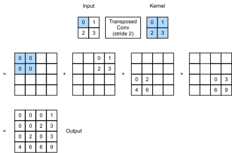

# Tích Chập Chuyển Vị
<a id="sec_transposed_conv"></a>

Các tầng CNN mà chúng ta đã thấy cho đến nay,
chẳng hạn các tầng tích chập ([sec_conv_layer](#sec_conv_layer)) và các tầng pooling ([sec_pooling](#sec_pooling)),
thường làm giảm (downsample) các chiều không gian (chiều cao và chiều rộng) của đầu vào,
hoặc giữ nguyên chúng.
Trong phân đoạn ngữ nghĩa,
nơi phân loại ở mức pixel,
sẽ thuận tiện nếu
các chiều không gian của
đầu vào và đầu ra giống nhau.
Ví dụ,
chiều kênh tại một pixel đầu ra
có thể chứa các kết quả phân loại
cho pixel đầu vào tại cùng vị trí không gian.


Để đạt được điều này, đặc biệt sau khi
các chiều không gian bị giảm bởi các tầng CNN,
chúng ta có thể dùng một loại
tầng CNN khác
có khả năng tăng (upsample) các chiều không gian
của các feature map trung gian.
Trong mục này,
chúng ta sẽ giới thiệu
*tích chập chuyển vị*, còn được gọi là *fractionally-strided convolution* [Dumoulin.Visin.2016],
để đảo ngược các phép giảm mẫu
bằng tích chập.

```python
#@tab mxnet
from mxnet import np, npx, init
from mxnet.gluon import nn
from d2l import mxnet as d2l

npx.set_np()
```

```python
#@tab pytorch
import torch
from torch import nn
from d2l import torch as d2l
```

## Phép Toán Cơ Bản

Tạm thời bỏ qua kênh,
hãy bắt đầu với
phép tích chập chuyển vị cơ bản
với stride bằng 1 và không padding.
Giả sử rằng
chúng ta có một tensor đầu vào
$n_h \times n_w$
và một kernel $k_h \times k_w$.
Trượt cửa sổ kernel với stride bằng 1
$n_w$ lần trong mỗi hàng
và $n_h$ lần trong mỗi cột
tạo ra
tổng cộng $n_h n_w$ kết quả trung gian.
Mỗi kết quả trung gian là
một tensor $(n_h + k_h - 1) \times (n_w + k_w - 1)$
được khởi tạo bằng không.
Để tính mỗi tensor trung gian,
mỗi phần tử trong tensor đầu vào
được nhân với kernel
sao cho tensor $k_h \times k_w$ thu được
thay thế một phần trong
mỗi tensor trung gian.
Lưu ý rằng
vị trí của phần được thay thế trong mỗi
tensor trung gian tương ứng với vị trí của phần tử
trong tensor đầu vào được dùng cho phép tính.
Cuối cùng, tất cả kết quả trung gian
được cộng lại để tạo ra đầu ra.

Như một ví dụ,
[fig_trans_conv](#fig_trans_conv) minh họa
cách tính tích chập chuyển vị với kernel $2\times 2$ cho một tensor đầu vào $2\times 2$.


<a id="fig_trans_conv"></a>


Chúng ta có thể (**hiện thực phép tích chập chuyển vị cơ bản này**) `trans_conv` cho ma trận đầu vào `X` và ma trận kernel `K`.

```python
#@tab all
def trans_conv(X, K):
    h, w = K.shape
    Y = d2l.zeros((X.shape[0] + h - 1, X.shape[1] + w - 1))
    for i in range(X.shape[0]):
        for j in range(X.shape[1]):
            Y[i: i + h, j: j + w] += X[i, j] * K
    return Y
```

Trái với tích chập thông thường (trong [sec_conv_layer](#sec_conv_layer)) vốn *giảm* các phần tử đầu vào
thông qua kernel,
tích chập chuyển vị
*phát tán* các phần tử đầu vào
thông qua kernel, nhờ đó
tạo ra một đầu ra
lớn hơn đầu vào.
Chúng ta có thể xây dựng tensor đầu vào `X` và tensor kernel `K` từ [fig_trans_conv](#fig_trans_conv) để [**kiểm chứng đầu ra của hiện thực ở trên**] cho phép tích chập chuyển vị hai chiều cơ bản.

```python
#@tab all
X = d2l.tensor([[0.0, 1.0], [2.0, 3.0]])
K = d2l.tensor([[0.0, 1.0], [2.0, 3.0]])
trans_conv(X, K)
```

Ngoài ra,
khi đầu vào `X` và kernel `K` đều là
tensor bốn chiều,
chúng ta có thể [**dùng API cấp cao để thu được cùng kết quả**].

```python
#@tab mxnet
X, K = X.reshape(1, 1, 2, 2), K.reshape(1, 1, 2, 2)
tconv = nn.Conv2DTranspose(1, kernel_size=2)
tconv.initialize(init.Constant(K))
tconv(X)
```

```python
#@tab pytorch
X, K = X.reshape(1, 1, 2, 2), K.reshape(1, 1, 2, 2)
tconv = nn.ConvTranspose2d(1, 1, kernel_size=2, bias=False)
tconv.weight.data = K
tconv(X)
```

## [**Padding, Stride, và Nhiều Kênh**]

Khác với tích chập thông thường
nơi padding được áp dụng cho đầu vào,
trong tích chập chuyển vị, padding được áp dụng cho đầu ra.
Ví dụ,
khi chỉ định số padding
ở mỗi phía của chiều cao và chiều rộng
là 1,
hàng và cột đầu tiên cũng như cuối cùng
sẽ bị loại khỏi đầu ra của tích chập chuyển vị.

```python
#@tab mxnet
tconv = nn.Conv2DTranspose(1, kernel_size=2, padding=1)
tconv.initialize(init.Constant(K))
tconv(X)
```

```python
#@tab pytorch
tconv = nn.ConvTranspose2d(1, 1, kernel_size=2, padding=1, bias=False)
tconv.weight.data = K
tconv(X)
```

Trong tích chập chuyển vị,
stride được chỉ định cho các kết quả trung gian (và do đó cho đầu ra), chứ không phải cho đầu vào.
Dùng cùng tensor đầu vào và kernel
từ [fig_trans_conv](#fig_trans_conv),
việc đổi stride từ 1 sang 2
làm tăng cả chiều cao và chiều rộng
của các tensor trung gian, do đó làm tăng tensor đầu ra
trong [fig_trans_conv_stride2](#fig_trans_conv_stride2).



<a id="fig_trans_conv_stride2"></a>


Đoạn code sau có thể kiểm chứng đầu ra tích chập chuyển vị với stride bằng 2 trong [fig_trans_conv_stride2](#fig_trans_conv_stride2).

```python
#@tab mxnet
tconv = nn.Conv2DTranspose(1, kernel_size=2, strides=2)
tconv.initialize(init.Constant(K))
tconv(X)
```

```python
#@tab pytorch
tconv = nn.ConvTranspose2d(1, 1, kernel_size=2, stride=2, bias=False)
tconv.weight.data = K
tconv(X)
```

Với nhiều kênh đầu vào và đầu ra,
tích chập chuyển vị
hoạt động giống như tích chập thông thường.
Giả sử rằng
đầu vào có $c_i$ kênh,
và tích chập chuyển vị
gán một tensor kernel $k_h\times k_w$
cho mỗi kênh đầu vào.
Khi nhiều kênh đầu ra
được chỉ định,
chúng ta sẽ có một kernel $c_i\times k_h\times k_w$ cho mỗi kênh đầu ra.


Nhìn chung, nếu ta đưa $\mathsf{X}$ vào một tầng tích chập $f$ để xuất ra $\mathsf{Y}=f(\mathsf{X})$ và tạo một tầng tích chập chuyển vị $g$ với cùng siêu tham số như $f$ ngoại trừ
số kênh đầu ra
bằng số kênh trong $\mathsf{X}$,
thì $g(Y)$ sẽ có cùng hình dạng với $\mathsf{X}$.
Điều này được minh họa trong ví dụ sau.

```python
#@tab mxnet
X = np.random.uniform(size=(1, 10, 16, 16))
conv = nn.Conv2D(20, kernel_size=5, padding=2, strides=3)
tconv = nn.Conv2DTranspose(10, kernel_size=5, padding=2, strides=3)
conv.initialize()
tconv.initialize()
tconv(conv(X)).shape == X.shape
```

```python
#@tab pytorch
X = torch.rand(size=(1, 10, 16, 16))
conv = nn.Conv2d(10, 20, kernel_size=5, padding=2, stride=3)
tconv = nn.ConvTranspose2d(20, 10, kernel_size=5, padding=2, stride=3)
tconv(conv(X)).shape == X.shape
```

## [**Liên Hệ Với Chuyển Vị Ma Trận**]
<a id="subsec-connection-to-mat-transposition"></a>

Tích chập chuyển vị được đặt tên theo
phép chuyển vị ma trận.
Để giải thích,
trước hết hãy
xem cách hiện thực tích chập
bằng phép nhân ma trận.
Trong ví dụ bên dưới, chúng ta định nghĩa một đầu vào `X` kích thước $3\times 3$ và một kernel tích chập `K` kích thước $2\times 2$, sau đó dùng hàm `corr2d` để tính đầu ra tích chập `Y`.

```python
#@tab all
X = d2l.arange(9.0).reshape(3, 3)
K = d2l.tensor([[1.0, 2.0], [3.0, 4.0]])
Y = d2l.corr2d(X, K)
Y
```

Tiếp theo, chúng ta viết lại kernel tích chập `K` thành
một ma trận trọng số thưa `W`
chứa rất nhiều số không.
Hình dạng của ma trận trọng số là ($4$, $9$),
trong đó các phần tử khác không đến từ
kernel tích chập `K`.

```python
#@tab all
def kernel2matrix(K):
    k, W = d2l.zeros(5), d2l.zeros((4, 9))
    k[:2], k[3:5] = K[0, :], K[1, :]
    W[0, :5], W[1, 1:6], W[2, 3:8], W[3, 4:] = k, k, k, k
    return W

W = kernel2matrix(K)
W
```

Nối đầu vào `X` theo từng hàng để thu được một vector độ dài 9. Khi đó phép nhân ma trận giữa `W` và `X` đã vector hóa cho ra một vector độ dài 4.
Sau khi reshape nó, ta có thể thu được cùng kết quả `Y`
từ phép tích chập ban đầu ở trên:
chúng ta vừa hiện thực tích chập bằng phép nhân ma trận.

```python
#@tab all
Y == d2l.matmul(W, d2l.reshape(X, -1)).reshape(2, 2)
```

Tương tự, chúng ta có thể hiện thực tích chập chuyển vị bằng
phép nhân ma trận.
Trong ví dụ sau,
chúng ta lấy đầu ra `Y` kích thước $2 \times 2$ từ
phép tích chập thông thường ở trên
làm đầu vào cho tích chập chuyển vị.
Để hiện thực phép toán này bằng nhân ma trận,
chúng ta chỉ cần chuyển vị ma trận trọng số `W`
với hình dạng mới $(9, 4)$.

```python
#@tab all
Z = trans_conv(Y, K)
Z == d2l.matmul(W.T, d2l.reshape(Y, -1)).reshape(3, 3)
```

Hãy xét việc hiện thực tích chập
bằng phép nhân ma trận.
Với một vector đầu vào $\mathbf{x}$
và một ma trận trọng số $\mathbf{W}$,
hàm lan truyền xuôi của tích chập
có thể được hiện thực
bằng cách nhân đầu vào của nó với ma trận trọng số
và xuất ra một vector
$\mathbf{y}=\mathbf{W}\mathbf{x}$.
Vì lan truyền ngược
tuân theo quy tắc dây chuyền
và $\nabla_{\mathbf{x}}\mathbf{y}=\mathbf{W}^\top$,
hàm lan truyền ngược của tích chập
có thể được hiện thực
bằng cách nhân đầu vào của nó với
ma trận trọng số chuyển vị $\mathbf{W}^\top$.
Do đó,
tầng tích chập chuyển vị
có thể chỉ cần hoán đổi hàm lan truyền xuôi
và hàm lan truyền ngược của tầng tích chập:
các hàm lan truyền xuôi
và lan truyền ngược của nó
nhân vector đầu vào của chúng lần lượt với
$\mathbf{W}^\top$ và $\mathbf{W}$.


## Tóm Tắt

* Trái với tích chập thông thường vốn giảm các phần tử đầu vào thông qua kernel, tích chập chuyển vị phát tán các phần tử đầu vào thông qua kernel, nhờ đó tạo ra một đầu ra lớn hơn đầu vào.
* Nếu ta đưa $\mathsf{X}$ vào một tầng tích chập $f$ để xuất ra $\mathsf{Y}=f(\mathsf{X})$ và tạo một tầng tích chập chuyển vị $g$ với cùng siêu tham số như $f$ ngoại trừ số kênh đầu ra bằng số kênh trong $\mathsf{X}$, thì $g(Y)$ sẽ có cùng hình dạng với $\mathsf{X}$.
* Chúng ta có thể hiện thực tích chập bằng phép nhân ma trận. Tầng tích chập chuyển vị có thể chỉ cần hoán đổi hàm lan truyền xuôi và hàm lan truyền ngược của tầng tích chập.


## Bài Tập

1. Trong [subsec-connection-to-mat-transposition](#subsec-connection-to-mat-transposition), đầu vào tích chập `X` và đầu ra tích chập chuyển vị `Z` có cùng hình dạng. Chúng có cùng giá trị không? Vì sao?
1. Dùng phép nhân ma trận để hiện thực tích chập có hiệu quả không? Vì sao?


[Thảo luận](https://discuss.d2l.ai/t/1450)
