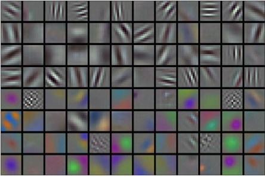

# Mạng Nơ-ron Tích chập Sâu (AlexNet)
<a id="sec_alexnet"></a>


Mặc dù CNN nổi tiếng
trong cộng đồng thị giác máy tính và machine learning
sau khi LeNet được giới thiệu [LeCun.Jackel.Bottou.ea.1995],
chúng không ngay lập tức thống trị lĩnh vực.
Mặc dù LeNet đạt được kết quả tốt trên các bộ dữ liệu nhỏ ban đầu,
hiệu suất và tính khả thi của việc huấn luyện CNN
trên các bộ dữ liệu lớn hơn, thực tế hơn vẫn chưa được thiết lập.
Trên thực tế, trong phần lớn thời gian khoảng giữa đầu những năm 1990
và kết quả đột phá của năm 2012 [Krizhevsky.Sutskever.Hinton.2012],
mạng nơ-ron thường bị vượt qua bởi các phương pháp machine learning khác,
chẳng hạn như các phương pháp kernel [Scholkopf.Smola.2002], các phương pháp tập hợp [Freund.Schapire.ea.1996],
và ước lượng có cấu trúc [Taskar.Guestrin.Koller.2004].

Đối với thị giác máy tính, sự so sánh này có thể không hoàn toàn chính xác.
Đó là, mặc dù đầu vào của các mạng tích chập
bao gồm các giá trị điểm ảnh thô hoặc được xử lý nhẹ (ví dụ: bằng cách căn giữa), các nhà thực hành sẽ không bao giờ đưa các điểm ảnh thô vào các mô hình truyền thống.
Thay vào đó, các đường ống thị giác máy tính điển hình
bao gồm việc kỹ thuật thủ công các đường ống trích xuất đặc trưng, chẳng hạn như SIFT [Lowe.2004], SURF [Bay.Tuytelaars.Van-Gool.2006], và túi từ thị giác [Sivic.Zisserman.2003].
Thay vì *học* các đặc trưng, các đặc trưng được *tạo thủ công*.
Hầu hết tiến bộ đến từ việc có nhiều ý tưởng thông minh hơn cho việc trích xuất đặc trưng một mặt và hiểu biết sâu về hình học [Hartley.Zisserman.2000] mặt khác. Thuật toán học thường được coi là một suy nghĩ bổ sung.

Mặc dù một số bộ tăng tốc mạng nơ-ron đã có sẵn trong những năm 1990,
chúng chưa đủ mạnh để tạo ra
các CNN đa kênh, đa lớp sâu
với số lượng tham số lớn. Ví dụ, GeForce 256 của NVIDIA từ năm 1999
chỉ có thể xử lý tối đa 480 triệu phép toán dấu phẩy động, chẳng hạn như phép cộng và nhân, mỗi giây (MFLOPS), mà không có bất kỳ framework lập trình có ý nghĩa nào cho các phép toán ngoài trò chơi. Các bộ tăng tốc ngày nay có thể thực hiện hơn 1000 TFLOPs trên mỗi thiết bị.
Hơn nữa, các bộ dữ liệu vẫn còn tương đối nhỏ: OCR trên 60.000 hình ảnh độ phân giải thấp $28 \times 28$ điểm ảnh được coi là một tác vụ khó khăn cao.
Thêm vào những trở ngại này, các thủ thuật quan trọng để huấn luyện mạng nơ-ron
bao gồm các phương pháp heuristic khởi tạo tham số [Glorot.Bengio.2010],
các biến thể thông minh của gradient descent ngẫu nhiên [Kingma.Ba.2014],
các hàm kích hoạt không bóp méo [Nair.Hinton.2010],
và các kỹ thuật chuẩn hóa hiệu quả [Srivastava.Hinton.Krizhevsky.ea.2014] vẫn còn thiếu.

Vì vậy, thay vì huấn luyện các hệ thống *đầu cuối đến đầu cuối* (điểm ảnh đến phân loại),
các đường ống cổ điển trông giống như sau:

1. Lấy một bộ dữ liệu thú vị. Trong những ngày đầu, các bộ dữ liệu này yêu cầu các cảm biến đắt tiền. Ví dụ, [Apple QuickTake 100](https://en.wikipedia.org/wiki/Apple_QuickTake) năm 1994 có độ phân giải 0.3 megapixel (VGA) đáng kể, có khả năng lưu trữ lên đến 8 hình ảnh, với giá \$1000.
1. Tiền xử lý bộ dữ liệu với các đặc trưng được tạo thủ công dựa trên một số kiến thức về quang học, hình học, các công cụ phân tích khác, và đôi khi là các khám phá tình cờ của các nghiên cứu sinh may mắn.
1. Đưa dữ liệu qua một tập hợp tiêu chuẩn các bộ trích xuất đặc trưng như SIFT (biến đổi đặc trưng bất biến tỷ lệ) [Lowe.2004], SURF (đặc trưng mạnh mẽ được tăng tốc) [Bay.Tuytelaars.Van-Gool.2006], hoặc bất kỳ số lượng đường ống được điều chỉnh thủ công nào khác. OpenCV vẫn cung cấp bộ trích xuất SIFT cho đến ngày nay!
1. Đổ các biểu diễn kết quả vào bộ phân loại yêu thích của bạn, có thể là mô hình tuyến tính hoặc phương pháp kernel, để huấn luyện bộ phân loại.

Nếu bạn nói chuyện với các nhà nghiên cứu machine learning,
họ sẽ trả lời rằng machine learning vừa quan trọng vừa đẹp đẽ.
Các lý thuyết thanh lịch đã chứng minh các tính chất của các bộ phân loại khác nhau [boucheron2005theory] và tối ưu hóa lồi
[Boyd.Vandenberghe.2004] đã trở thành nền tảng để có được chúng.
Lĩnh vực machine learning đang phát triển mạnh, nghiêm ngặt, và cực kỳ hữu ích. Tuy nhiên,
nếu bạn nói chuyện với một nhà nghiên cứu thị giác máy tính,
bạn sẽ nghe một câu chuyện rất khác.
Sự thật bẩn thỉu của nhận dạng hình ảnh, họ sẽ nói với bạn,
là các đặc trưng, hình học [Hartley.Zisserman.2000, hartley2009global], và kỹ thuật,
thay vì các thuật toán học mới lạ, thúc đẩy tiến bộ.
Các nhà nghiên cứu thị giác máy tính có lý khi tin rằng
một bộ dữ liệu lớn hơn hoặc sạch hơn một chút
hoặc một đường ống trích xuất đặc trưng được cải thiện một chút
quan trọng hơn nhiều đối với độ chính xác cuối cùng hơn bất kỳ thuật toán học nào.


```python
from d2l import torch as d2l
import torch
from torch import nn
```


## Học Biểu diễn

Một cách khác để nhìn nhận tình trạng hiện tại là
phần quan trọng nhất của đường ống là biểu diễn.
Và cho đến năm 2012, biểu diễn được tính toán chủ yếu bằng cơ học.
Trên thực tế, kỹ thuật một tập hợp hàm đặc trưng mới, cải thiện kết quả, và viết lên phương pháp
đều nổi bật trong các bài báo.
SIFT [Lowe.2004],
SURF [Bay.Tuytelaars.Van-Gool.2006],
HOG (histogram của gradient định hướng) [Dalal.Triggs.2005],
túi từ thị giác [Sivic.Zisserman.2003],
và các bộ trích xuất đặc trưng tương tự thống trị.

Một nhóm nhà nghiên cứu khác,
bao gồm Yann LeCun, Geoff Hinton, Yoshua Bengio,
Andrew Ng, Shun-ichi Amari, và Juergen Schmidhuber,
có kế hoạch khác.
Họ tin rằng các đặc trưng bản thân phải được học.
Hơn nữa, họ tin rằng để có độ phức tạp hợp lý,
các đặc trưng phải được tổ hợp theo phân cấp
với nhiều lớp được học chung, mỗi lớp với các tham số có thể học được.
Trong trường hợp của hình ảnh, các lớp thấp nhất có thể học
để phát hiện cạnh, màu sắc, và kết cấu, theo phép tương tự với cách hệ thống thị giác ở động vật
xử lý đầu vào của nó. Đặc biệt, thiết kế tự động của các đặc trưng thị giác như những đặc trưng thu được
bởi mã hóa thưa [olshausen1996emergence] vẫn là một thách thức mở cho đến khi có CNN hiện đại.
Phải đến Dean.Corrado.Monga.ea.2012,le2013building thì ý tưởng tạo đặc trưng
từ dữ liệu hình ảnh tự động mới có được sức kéo đáng kể.

CNN hiện đại đầu tiên [Krizhevsky.Sutskever.Hinton.2012], được đặt tên
*AlexNet* theo một trong những nhà phát minh của nó, Alex Krizhevsky, phần lớn là cải tiến tiến hóa
so với LeNet. Nó đạt được hiệu suất xuất sắc trong thách thức ImageNet năm 2012.


:width:`400px`
<a id="fig_filters"></a>

Thú vị là, ở các lớp thấp nhất của mạng,
mô hình đã học các bộ trích xuất đặc trưng giống với một số bộ lọc truyền thống.
[fig_filters](#fig_filters)
hiển thị các bộ mô tả hình ảnh cấp thấp hơn.
Các lớp cao hơn trong mạng có thể xây dựng trên những biểu diễn này
để biểu diễn các cấu trúc lớn hơn, như mắt, mũi, ngọn cỏ, v.v.
Các lớp thậm chí cao hơn có thể biểu diễn toàn bộ đối tượng
như người, máy bay, chó, hoặc đĩa frisbee.
Cuối cùng, trạng thái ẩn cuối cùng học một biểu diễn nhỏ gọn
của hình ảnh tóm tắt nội dung của nó
để dữ liệu thuộc các danh mục khác nhau có thể dễ dàng phân tách.

AlexNet (2012) và người tiền nhiệm LeNet (1995) chia sẻ nhiều yếu tố kiến trúc. Điều này đặt ra câu hỏi: tại sao mất nhiều thời gian như vậy?
Sự khác biệt chính là, trong hai thập kỷ trước, lượng dữ liệu và sức mạnh tính toán có sẵn đã tăng lên đáng kể. Do đó AlexNet lớn hơn nhiều: nó được huấn luyện trên nhiều dữ liệu hơn, và trên các GPU nhanh hơn nhiều so với các CPU có sẵn vào năm 1995.

### Thành phần Thiếu: Dữ liệu

Các mô hình sâu với nhiều lớp yêu cầu lượng lớn dữ liệu
để đi vào chế độ
mà chúng vượt qua đáng kể các phương pháp truyền thống
dựa trên các tối ưu hóa lồi (ví dụ: các phương pháp tuyến tính và kernel).
Tuy nhiên, với dung lượng lưu trữ hạn chế của máy tính,
chi phí tương đối của các cảm biến (hình ảnh),
và ngân sách nghiên cứu tương đối chặt chẽ hơn trong những năm 1990,
hầu hết nghiên cứu dựa vào các bộ dữ liệu nhỏ.
Nhiều bài báo dựa vào bộ sưu tập bộ dữ liệu UCI,
nhiều trong số đó chỉ chứa hàng trăm hoặc (vài) nghìn hình ảnh
được chụp ở độ phân giải thấp và thường với nền nhân tạo sạch sẽ.

Năm 2009, bộ dữ liệu ImageNet được phát hành [Deng.Dong.Socher.ea.2009],
thách thức các nhà nghiên cứu học các mô hình từ 1 triệu mẫu,
1000 mỗi từ 1000 danh mục đối tượng riêng biệt. Các danh mục bản thân
dựa trên các nút danh từ phổ biến nhất trong WordNet [Miller.1995].
Nhóm ImageNet đã sử dụng Google Image Search để tiền lọc các tập ứng viên lớn
cho mỗi danh mục và sử dụng
đường ống crowdsourcing Amazon Mechanical Turk
để xác nhận cho mỗi hình ảnh xem nó có thuộc danh mục liên quan không.
Quy mô này chưa từng có, vượt quá các quy mô khác hơn một bậc độ lớn
(ví dụ: CIFAR-100 có 60.000 hình ảnh). Một khía cạnh khác là các hình ảnh ở
độ phân giải tương đối cao $224 \times 224$ điểm ảnh, không giống như bộ dữ liệu
TinyImages 80 triệu ảnh [Torralba.Fergus.Freeman.2008], bao gồm các hình thu nhỏ $32 \times 32$ điểm ảnh.
Điều này cho phép hình thành các đặc trưng cấp cao hơn.
Cuộc thi liên quan, được đặt tên là ImageNet Large Scale Visual Recognition
Challenge [russakovsky2015imagenet],
đã thúc đẩy nghiên cứu thị giác máy tính và machine learning tiến lên,
thách thức các nhà nghiên cứu xác định mô hình nào hoạt động tốt nhất
ở quy mô lớn hơn so với những gì học thuật đã xét trước đây. Các bộ dữ liệu thị giác lớn nhất, chẳng hạn như LAION-5B
[schuhmann2022laion] chứa hàng tỷ hình ảnh với siêu dữ liệu bổ sung.

### Thành phần Thiếu: Phần cứng

Các mô hình deep learning là người tiêu thụ háu ăn của các chu kỳ tính toán.
Huấn luyện có thể mất hàng trăm epoch, và mỗi lần lặp
yêu cầu truyền dữ liệu qua nhiều lớp của các phép toán đại số tuyến tính tốn kém.
Đây là một trong những lý do chính tại sao trong những năm 1990 và đầu 2000,
các thuật toán đơn giản dựa trên các mục tiêu lồi được tối ưu hóa hiệu quả hơn
được ưu tiên.

*Đơn vị xử lý đồ họa* (GPU) đã chứng minh là yếu tố thay đổi cuộc chơi
trong việc làm cho deep learning khả thi.
Các chip này đã được phát triển trước đó để tăng tốc
xử lý đồ họa để phục vụ các trò chơi máy tính.
Đặc biệt, chúng được tối ưu hóa cho các phép toán ma trận-vectơ $4 \times 4$ thông lượng cao,
cần thiết cho nhiều tác vụ đồ họa máy tính.
May mắn thay, toán học rất giống nhau
với những gì cần thiết để tính toán các lớp tích chập.
Vào thời điểm đó, NVIDIA và ATI đã bắt đầu tối ưu hóa GPU
cho các phép toán tính toán chung [Fernando.2004],
đi xa đến mức tiếp thị chúng là *GPU đa mục đích* (GPGPU).

Để cung cấp một số trực giác, hãy xem xét các lõi của bộ vi xử lý hiện đại
(CPU).
Mỗi lõi khá mạnh mẽ chạy ở tần số đồng hồ cao
và có bộ nhớ cache lớn (lên đến vài megabyte L3).
Mỗi lõi phù hợp để thực thi một loạt các lệnh,
với bộ dự đoán nhánh, đường ống sâu, đơn vị thực thi chuyên biệt,
thực thi suy đoán,
và nhiều tính năng khác
cho phép nó chạy nhiều loại chương trình với luồng điều khiển phức tạp.
Sức mạnh biểu kiến này, tuy nhiên, cũng là gót chân Achilles của nó:
các lõi đa mục đích rất đắt để xây dựng. Chúng xuất sắc trong
code đa mục đích với nhiều luồng điều khiển.
Điều này yêu cầu nhiều diện tích chip, không chỉ cho
ALU thực tế (đơn vị logic số học) nơi tính toán xảy ra, mà còn cho
tất cả các tính năng nói trên, cộng với
các giao diện bộ nhớ, logic cache giữa các lõi,
kết nối tốc độ cao, v.v. CPU
tương đối tệ ở bất kỳ tác vụ đơn lẻ nào khi so sánh với phần cứng chuyên dụng.
Laptop hiện đại có 4--8 lõi,
và ngay cả máy chủ cao cấp hiếm khi vượt quá 64 lõi mỗi socket,
đơn giản vì không hiệu quả về chi phí.

So sánh, GPU có thể bao gồm hàng nghìn phần tử xử lý nhỏ (chip Ampere mới nhất của NVIDIA có lên đến 6912 lõi CUDA), thường được nhóm thành các nhóm lớn hơn (NVIDIA gọi chúng là warp).
Chi tiết hơi khác nhau giữa NVIDIA, AMD, ARM và các nhà cung cấp chip khác. Trong khi mỗi lõi tương đối yếu,
chạy ở tần số đồng hồ khoảng 1GHz,
chính tổng số lõi như vậy làm cho GPU nhanh hơn CPU nhiều bậc độ lớn.
Ví dụ, GPU Ampere A100 gần đây của NVIDIA cung cấp hơn 300 TFLOPs trên mỗi chip cho các phép nhân ma trận-ma trận độ chính xác 16-bit chuyên biệt (BFLOAT16), và lên đến 20 TFLOPs cho các phép toán dấu phẩy động đa mục đích hơn (FP32).
Đồng thời, hiệu suất dấu phẩy động của CPU hiếm khi vượt quá 1 TFLOPs. Ví dụ, Graviton 3 của Amazon đạt hiệu suất đỉnh 2 TFLOPs cho các phép toán độ chính xác 16-bit, một con số tương tự với hiệu suất GPU của bộ xử lý M1 của Apple.

Có nhiều lý do tại sao GPU nhanh hơn nhiều so với CPU về FLOPs.
Thứ nhất, mức tiêu thụ điện năng có xu hướng tăng *bậc hai* với tần số đồng hồ.
Do đó, với ngân sách năng lượng của một lõi CPU chạy nhanh gấp bốn lần (một con số điển hình),
bạn có thể sử dụng 16 lõi GPU ở $\frac{1}{4}$ tốc độ,
mang lại hiệu suất $16 \times \frac{1}{4} = 4$ lần.
Thứ hai, lõi GPU đơn giản hơn nhiều
(trên thực tế, trong một thời gian dài chúng thậm chí không *thể*
thực thi code đa mục đích),
điều này làm cho chúng hiệu quả hơn về năng lượng. Ví dụ, (i) chúng có xu hướng không hỗ trợ đánh giá suy đoán, (ii) thường không thể lập trình từng phần tử xử lý riêng lẻ, và (iii) bộ nhớ cache trên mỗi lõi có xu hướng nhỏ hơn nhiều.
Cuối cùng, nhiều phép toán trong deep learning yêu cầu băng thông bộ nhớ cao.
Một lần nữa, GPU tỏa sáng ở đây với các bus rộng ít nhất 10 lần so với nhiều CPU.

Quay lại năm 2012. Một bước đột phá lớn đến
khi Alex Krizhevsky và Ilya Sutskever
triển khai một CNN sâu
có thể chạy trên GPU.
Họ nhận ra rằng các nút cổ chai tính toán trong CNN,
tích chập và phép nhân ma trận,
là tất cả các phép toán có thể được song song hóa trong phần cứng.
Sử dụng hai NVIDIA GTX 580 với bộ nhớ 3GB, mỗi cái có khả năng 1.5 TFLOPs (vẫn là thách thức cho hầu hết CPU một thập kỷ sau),
họ đã triển khai các phép tích chập nhanh.
Code [cuda-convnet](https://code.google.com/archive/p/cuda-convnet/)
đủ tốt đến mức trong vài năm
nó là tiêu chuẩn công nghiệp và cung cấp điện
cho vài năm đầu của sự bùng nổ deep learning.

## AlexNet

AlexNet, sử dụng CNN 8 lớp,
đã giành chiến thắng trong ImageNet Large Scale Visual Recognition Challenge năm 2012
với biên độ lớn [Russakovsky.Deng.Huang.ea.2013].
Mạng này cho thấy, lần đầu tiên,
rằng các đặc trưng thu được bằng cách học có thể vượt qua các đặc trưng được thiết kế thủ công, phá vỡ mô hình trước đó trong thị giác máy tính.

Các kiến trúc của AlexNet và LeNet tương tự đáng kể,
như [fig_alexnet](#fig_alexnet) minh họa.
Lưu ý rằng chúng ta cung cấp một phiên bản được đơn giản hóa một chút của AlexNet
loại bỏ một số tính năng thiết kế cần thiết vào năm 2012
để làm cho mô hình vừa với hai GPU nhỏ.


<a id="fig_alexnet"></a>

Cũng có sự khác biệt đáng kể giữa AlexNet và LeNet.
Đầu tiên, AlexNet sâu hơn nhiều so với LeNet-5 tương đối nhỏ.
AlexNet bao gồm tám lớp: năm lớp tích chập,
hai lớp ẩn kết nối đầy đủ, và một lớp đầu ra kết nối đầy đủ.
Thứ hai, AlexNet sử dụng ReLU thay vì sigmoid
làm hàm kích hoạt. Hãy đi sâu vào các chi tiết dưới đây.

### Kiến trúc

Trong lớp đầu tiên của AlexNet, hình dạng cửa sổ tích chập là $11\times11$.
Vì các hình ảnh trong ImageNet cao hơn và rộng hơn tám lần
so với các hình ảnh MNIST,
các đối tượng trong dữ liệu ImageNet có xu hướng chiếm nhiều điểm ảnh hơn với nhiều chi tiết thị giác hơn.
Do đó, cần một cửa sổ tích chập lớn hơn để nắm bắt đối tượng.
Hình dạng cửa sổ tích chập trong lớp thứ hai
giảm xuống còn $5\times5$, theo sau là $3\times3$.
Ngoài ra, sau lớp tích chập thứ nhất, thứ hai và thứ năm,
mạng thêm các lớp gộp tối đa
với hình dạng cửa sổ là $3\times3$ và sải bước là 2.
Hơn nữa, AlexNet có số kênh tích chập nhiều gấp mười lần so với LeNet.

Sau lớp tích chập cuối cùng, có hai lớp kết nối đầy đủ khổng lồ
với 4096 đầu ra.
Các lớp này yêu cầu gần 1GB tham số mô hình.
Do bộ nhớ hạn chế trong các GPU đầu tiên,
AlexNet gốc đã sử dụng thiết kế luồng dữ liệu kép,
để mỗi trong hai GPU của chúng có thể chịu trách nhiệm
lưu trữ và tính toán chỉ một nửa mô hình của nó.
May mắn thay, bộ nhớ GPU hiện nay tương đối dồi dào,
vì vậy chúng ta hiếm khi cần chia mô hình trên các GPU ngày nay
(phiên bản AlexNet của chúng ta khác với
bài báo gốc ở khía cạnh này).

### Hàm Kích hoạt

Hơn nữa, AlexNet đã thay đổi hàm kích hoạt sigmoid thành hàm kích hoạt ReLU đơn giản hơn. Một mặt, tính toán của hàm kích hoạt ReLU đơn giản hơn. Ví dụ, nó không có phép toán lũy thừa tìm thấy trong hàm kích hoạt sigmoid.
Mặt khác, hàm kích hoạt ReLU làm cho việc huấn luyện mô hình dễ dàng hơn khi sử dụng các phương pháp khởi tạo tham số khác nhau. Điều này là vì, khi đầu ra của hàm kích hoạt sigmoid rất gần với 0 hoặc 1, gradient của các vùng này gần như là 0, để lan truyền ngược không thể tiếp tục cập nhật một số tham số mô hình. Ngược lại, gradient của hàm kích hoạt ReLU trong khoảng dương luôn là 1 ([subsec_activation-functions](#subsec_activation-functions)). Do đó, nếu các tham số mô hình không được khởi tạo đúng, hàm sigmoid có thể thu được gradient gần bằng 0 trong khoảng dương, có nghĩa là mô hình không thể được huấn luyện hiệu quả.

### Kiểm soát Khả năng và Tiền xử lý

AlexNet kiểm soát độ phức tạp mô hình của lớp kết nối đầy đủ
bằng dropout ([sec_dropout](#sec_dropout)),
trong khi LeNet chỉ sử dụng suy giảm trọng số.
Để tăng cường dữ liệu hơn nữa, vòng lặp huấn luyện của AlexNet
đã thêm rất nhiều tăng cường hình ảnh,
chẳng hạn như lật, cắt, và thay đổi màu sắc.
Điều này làm cho mô hình mạnh mẽ hơn và kích thước mẫu lớn hơn giảm thiểu quá khớp hiệu quả.
Xem Buslaev.Iglovikov.Khvedchenya.ea.2020 để có đánh giá chuyên sâu về các bước tiền xử lý như vậy.


Chúng ta [**xây dựng một ví dụ dữ liệu một kênh**] với cả chiều cao và chiều rộng là 224 (**để quan sát hình dạng đầu ra của mỗi lớp**). Nó khớp với kiến trúc AlexNet trong [fig_alexnet](#fig_alexnet).


## Huấn luyện

Mặc dù AlexNet được huấn luyện trên ImageNet trong Krizhevsky.Sutskever.Hinton.2012,
chúng ta sử dụng Fashion-MNIST ở đây
vì việc huấn luyện mô hình ImageNet đến hội tụ có thể mất nhiều giờ hoặc nhiều ngày
ngay cả trên GPU hiện đại.
Một trong những vấn đề khi áp dụng AlexNet trực tiếp trên [**Fashion-MNIST**]
là (**hình ảnh của nó có độ phân giải thấp hơn**) ($28 \times 28$ điểm ảnh)
(**so với hình ảnh ImageNet.**)
Để làm cho mọi thứ hoạt động, (**chúng ta nâng mẫu lên $224 \times 224$**).
Đây thường không phải là thực hành thông minh, vì nó chỉ tăng độ phức tạp tính toán
mà không thêm thông tin. Tuy nhiên, chúng ta làm điều này ở đây để trung thành với kiến trúc AlexNet.
Chúng ta thực hiện việc thay đổi kích thước này với đối số `resize` trong hàm tạo `d2l.FashionMNIST`.

Bây giờ, chúng ta có thể [**bắt đầu huấn luyện AlexNet.**]
So với LeNet trong [sec_lenet](#sec_lenet),
thay đổi chính ở đây là việc sử dụng tốc độ học nhỏ hơn
và huấn luyện chậm hơn nhiều do mạng sâu hơn và rộng hơn,
độ phân giải hình ảnh cao hơn, và các phép tích chập tốn kém hơn.


## Thảo luận

Cấu trúc của AlexNet có sự giống nhau đáng kể với LeNet, với một số cải tiến quan trọng, cả về độ chính xác (dropout) và về dễ dàng huấn luyện (ReLU). Điều cũng đáng chú ý là lượng tiến bộ đã được thực hiện về mặt công cụ deep learning. Những gì là công việc nhiều tháng vào năm 2012 giờ có thể được thực hiện trong vài chục dòng code bằng cất bất kỳ framework hiện đại nào.

Xem xét kiến trúc, chúng ta thấy rằng AlexNet có gót chân Achilles khi nói đến hiệu quả: hai lớp ẩn cuối cùng yêu cầu ma trận kích thước $6400 \times 4096$ và $4096 \times 4096$, tương ứng. Điều này tương ứng với 164 MB bộ nhớ và 81 MFLOPs tính toán, cả hai đều là khoản chi tiêu không nhỏ, đặc biệt trên các thiết bị nhỏ hơn, chẳng hạn như điện thoại di động. Đây là một trong những lý do tại sao AlexNet đã bị vượt qua bởi các kiến trúc hiệu quả hơn nhiều mà chúng ta sẽ đề cập trong các phần tiếp theo. Tuy nhiên, đây là bước quan trọng từ các mạng nông sang các mạng sâu được sử dụng ngày nay. Lưu ý rằng mặc dù số lượng tham số vượt xa lượng dữ liệu huấn luyện trong các thử nghiệm của chúng ta (hai lớp cuối cùng có hơn 40 triệu tham số, được huấn luyện trên bộ dữ liệu 60 nghìn hình ảnh), hầu như không có quá khớp: mất mát huấn luyện và kiểm định gần như giống hệt nhau trong suốt quá trình huấn luyện. Điều này là do chuẩn hóa được cải thiện, chẳng hạn như dropout, vốn có trong các thiết kế mạng sâu hiện đại.

Mặc dù có vẻ như chỉ có thêm một vài dòng trong triển khai AlexNet so với LeNet, cộng đồng học thuật đã mất nhiều năm để chấp nhận sự thay đổi khái niệm này và tận dụng các kết quả thực nghiệm xuất sắc của nó. Điều này cũng do thiếu các công cụ tính toán hiệu quả. Vào thời điểm đó không có DistBelief [Dean.Corrado.Monga.ea.2012] hay Caffe [Jia.Shelhamer.Donahue.ea.2014], và Theano [Bergstra.Breuleux.Bastien.ea.2010] vẫn thiếu nhiều tính năng phân biệt. Chính sự có sẵn của TensorFlow [Abadi.Barham.Chen.ea.2016] đã thay đổi tình hình đáng kể.

## Bài tập

1. Tiếp theo thảo luận trên, phân tích các tính chất tính toán của AlexNet.
    1. Tính dấu chân bộ nhớ cho các phép tích chập và các lớp kết nối đầy đủ, tương ứng. Cái nào thống trị?
    1. Tính chi phí tính toán cho các phép tích chập và các lớp kết nối đầy đủ.
    1. Bộ nhớ (băng thông đọc và ghi, độ trễ, kích thước) ảnh hưởng đến tính toán như thế nào? Có sự khác biệt nào trong hiệu ứng của nó đối với huấn luyện và suy luận không?
1. Bạn là nhà thiết kế chip và cần đánh đổi giữa tính toán và băng thông bộ nhớ. Ví dụ, chip nhanh hơn cần nhiều năng lượng hơn và có thể diện tích chip lớn hơn. Băng thông bộ nhớ nhiều hơn yêu cầu nhiều chân hơn và logic điều khiển, do đó cũng nhiều diện tích hơn. Bạn tối ưu hóa như thế nào?
1. Tại sao các kỹ sư không còn báo cáo các benchmark hiệu suất trên AlexNet nữa?
1. Thử tăng số epoch khi huấn luyện AlexNet. So với LeNet, kết quả khác nhau như thế nào? Tại sao?
1. AlexNet có thể quá phức tạp cho bộ dữ liệu Fashion-MNIST, đặc biệt do độ phân giải thấp của các hình ảnh ban đầu.
    1. Thử đơn giản hóa mô hình để làm cho huấn luyện nhanh hơn, trong khi đảm bảo độ chính xác không giảm đáng kể.
    1. Thiết kế một mô hình tốt hơn hoạt động trực tiếp trên hình ảnh $28 \times 28$.
1. Sửa đổi kích thước batch và quan sát các thay đổi trong thông lượng (hình ảnh/giây), độ chính xác, và bộ nhớ GPU.
1. Áp dụng dropout và ReLU cho LeNet-5. Nó có cải thiện không? Bạn có thể cải thiện thêm bằng cách tiền xử lý để tận dụng các bất biến vốn có trong hình ảnh không?
1. Bạn có thể làm cho AlexNet bị quá khớp không? Bạn cần loại bỏ hoặc thay đổi tính năng nào để phá vỡ quá trình huấn luyện?


[Discussions](https://discuss.d2l.ai/t/76)
