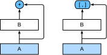
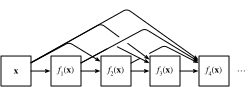

# Mạng Kết nối Dày đặc (DenseNet)
<a id="sec_densenet"></a>

ResNet đã thay đổi đáng kể quan điểm về cách tham số hóa các hàm trong mạng sâu. *DenseNet* (mạng tích chập dày đặc) là ở một mức độ nào đó sự mở rộng logic của điều này [Huang.Liu.Van-Der-Maaten.ea.2017].
DenseNet được đặc trưng bởi cả mẫu kết nối mà
mỗi lớp kết nối với tất cả các lớp trước đó
và phép toán nối (thay vì phép toán cộng trong ResNet) để bảo tồn và tái sử dụng các đặc trưng
từ các lớp trước.
Để hiểu cách đến được đó, hãy thực hiện một chuyến vòng nhỏ qua toán học.


```python
from d2l import torch as d2l
import torch
from torch import nn
```


## Từ ResNet đến DenseNet

Nhớ lại khai triển Taylor cho hàm số. Tại điểm $x = 0$ nó có thể được viết là

$$f(x) = f(0) + x \cdot \left[f'(0) + x \cdot \left[\frac{f''(0)}{2!}  + x \cdot \left[\frac{f'''(0)}{3!}  + \cdots \right]\right]\right].$$


Điểm mấu chốt là nó phân tách một hàm thành các số hạng có bậc ngày càng cao hơn. Theo cách tương tự, ResNet phân tách các hàm thành

$$f(\mathbf{x}) = \mathbf{x} + g(\mathbf{x}).$$

Tức là, ResNet phân tách $f$ thành một số hạng tuyến tính đơn giản và một số hạng
phi tuyến phức tạp hơn.
Điều gì nếu chúng ta muốn nắm bắt (không nhất thiết phải cộng) thông tin vượt quá hai số hạng?
Một giải pháp như vậy là DenseNet [Huang.Liu.Van-Der-Maaten.ea.2017].


<a id="fig_densenet_block"></a>

Như được thể hiện trong [fig_densenet_block](#fig_densenet_block), sự khác biệt chính giữa ResNet và DenseNet là trong trường hợp sau, các đầu ra được *nối* (ký hiệu bởi $[,]$) thay vì được cộng.
Kết quả là, chúng ta thực hiện một ánh xạ từ $\mathbf{x}$ đến các giá trị của nó sau khi áp dụng một chuỗi hàm ngày càng phức tạp:

$$\mathbf{x} \to \left[
\mathbf{x},
f_1(\mathbf{x}),
f_2\left(\left[\mathbf{x}, f_1\left(\mathbf{x}\right)\right]\right), f_3\left(\left[\mathbf{x}, f_1\left(\mathbf{x}\right), f_2\left(\left[\mathbf{x}, f_1\left(\mathbf{x}\right)\right]\right)\right]\right), \ldots\right].$$

Cuối cùng, tất cả các hàm này được kết hợp trong MLP để giảm số lượng đặc trưng lại. Về mặt triển khai, điều này khá đơn giản:
thay vì cộng các số hạng, chúng ta nối chúng. Tên DenseNet xuất phát từ thực tế là đồ thị phụ thuộc giữa các biến trở nên khá dày đặc. Lớp cuối của một chuỗi như vậy được kết nối dày đặc với tất cả các lớp trước đó. Các kết nối dày đặc được thể hiện trong [fig_densenet](#fig_densenet).


<a id="fig_densenet"></a>

Các thành phần chính tạo nên DenseNet là *các khối dày đặc* và *các lớp chuyển tiếp*. Cái trước định nghĩa cách các đầu vào và đầu ra được nối, trong khi cái sau kiểm soát số kênh để không quá lớn,
vì sự mở rộng $\mathbf{x} \to \left[\mathbf{x}, f_1(\mathbf{x}),
f_2\left(\left[\mathbf{x}, f_1\left(\mathbf{x}\right)\right]\right), \ldots \right]$ có thể có số chiều khá cao.


## [**Các Khối Dày đặc**]

DenseNet sử dụng cấu trúc "chuẩn hóa batch, kích hoạt và tích chập" đã được sửa đổi
của ResNet (xem bài tập trong [sec_resnet](#sec_resnet)).
Đầu tiên, chúng ta triển khai cấu trúc khối tích chập này.


```python
def conv_block(num_channels):
    return nn.Sequential(
        nn.LazyBatchNorm2d(), nn.ReLU(),
        nn.LazyConv2d(num_channels, kernel_size=3, padding=1))
```


Một *khối dày đặc* bao gồm nhiều khối tích chập, mỗi khối sử dụng cùng số kênh đầu ra. Trong lan truyền tiến, tuy nhiên, chúng ta nối đầu vào và đầu ra của mỗi khối tích chập trên chiều kênh. Đánh giá lười biếng cho phép chúng ta điều chỉnh số chiều tự động.


```python
class DenseBlock(nn.Module):
    def __init__(self, num_convs, num_channels):
        super(DenseBlock, self).__init__()
        layer = []
        for i in range(num_convs):
            layer.append(conv_block(num_channels))
        self.net = nn.Sequential(*layer)

    def forward(self, X):
        for blk in self.net:
            Y = blk(X)
            # Concatenate input and output of each block along the channels
            X = torch.cat((X, Y), dim=1)
        return X
```


Trong ví dụ sau,
chúng ta [**định nghĩa một thể hiện `DenseBlock`**] với hai khối tích chập có 10 kênh đầu ra.
Khi sử dụng đầu vào với ba kênh, chúng ta sẽ nhận được đầu ra với $3 + 10 + 10=23$ kênh. Số kênh khối tích chập kiểm soát sự tăng trưởng về số kênh đầu ra so với số kênh đầu vào. Điều này cũng được gọi là *tốc độ tăng trưởng*.


## [**Các Lớp Chuyển tiếp**]

Vì mỗi khối dày đặc sẽ tăng số kênh, việc thêm quá nhiều sẽ dẫn đến một mô hình quá phức tạp. *Lớp chuyển tiếp* được sử dụng để kiểm soát độ phức tạp của mô hình. Nó giảm số kênh bằng cách sử dụng tích chập $1\times 1$. Hơn nữa, nó giảm một nửa chiều cao và chiều rộng thông qua gộp trung bình với sải bước là 2.


```python
def transition_block(num_channels):
    return nn.Sequential(
        nn.LazyBatchNorm2d(), nn.ReLU(),
        nn.LazyConv2d(num_channels, kernel_size=1),
        nn.AvgPool2d(kernel_size=2, stride=2))
```


[**Áp dụng một lớp chuyển tiếp**] với 10 kênh cho đầu ra của khối dày đặc trong ví dụ trước. Điều này giảm số kênh đầu ra xuống 10 và giảm một nửa chiều cao và chiều rộng.


```python
blk = transition_block(10)
blk(Y).shape
```


## [**Mô hình DenseNet**]

Tiếp theo, chúng ta sẽ xây dựng một mô hình DenseNet. DenseNet trước tiên sử dụng cùng lớp tích chập đơn và lớp max-pooling như trong ResNet.


Sau đó, tương tự như bốn module được tạo thành từ các khối dư mà ResNet sử dụng,
DenseNet sử dụng bốn khối dày đặc.
Như với ResNet, chúng ta có thể đặt số lớp tích chập được sử dụng trong mỗi khối dày đặc. Ở đây, chúng ta đặt nó là 4, nhất quán với mô hình ResNet-18 trong [sec_resnet](#sec_resnet). Hơn nữa, chúng ta đặt số kênh (tức là tốc độ tăng trưởng) cho các lớp tích chập trong khối dày đặc là 32, vì vậy 128 kênh sẽ được thêm vào mỗi khối dày đặc.

Trong ResNet, chiều cao và chiều rộng được giảm giữa mỗi module bằng một khối dư với sải bước là 2. Ở đây, chúng ta sử dụng lớp chuyển tiếp để giảm một nửa chiều cao và chiều rộng và giảm một nửa số kênh. Tương tự như ResNet, một lớp gộp toàn cục và một lớp kết nối đầy đủ được kết nối ở cuối để tạo ra đầu ra.


## [**Huấn luyện**]

Vì chúng ta đang sử dụng mạng sâu hơn ở đây, trong phần này, chúng ta sẽ giảm chiều cao và chiều rộng đầu vào từ 224 xuống 96 để đơn giản hóa tính toán.


## Tóm tắt và Thảo luận

Các thành phần chính tạo nên DenseNet là các khối dày đặc và các lớp chuyển tiếp. Đối với cái sau, chúng ta cần giữ số chiều dưới tầm kiểm soát khi lắp ráp mạng bằng cách thêm các lớp chuyển tiếp thu hẹp số kênh lại.
Về các kết nối xuyên lớp, trái ngược với ResNet nơi đầu vào và đầu ra được cộng lại với nhau, DenseNet nối đầu vào và đầu ra trên chiều kênh.
Mặc dù các phép toán nối này
tái sử dụng các đặc trưng để đạt hiệu quả tính toán,
thật không may chúng dẫn đến tiêu thụ bộ nhớ GPU cao.
Kết quả là,
việc áp dụng DenseNet có thể đòi hỏi các triển khai tiết kiệm bộ nhớ hơn có thể tăng thời gian huấn luyện [pleiss2017memory].


## Bài tập

1. Tại sao chúng ta sử dụng gộp trung bình thay vì max-pooling trong lớp chuyển tiếp?
1. Một trong những ưu điểm được đề cập trong bài báo DenseNet là các tham số mô hình của nó nhỏ hơn của ResNet. Tại sao lại như vậy?
1. Một vấn đề mà DenseNet bị chỉ trích là tiêu thụ bộ nhớ cao.
    1. Điều này có thực sự là trường hợp không? Hãy thử thay đổi hình dạng đầu vào thành $224\times 224$ để so sánh mức tiêu thụ bộ nhớ GPU thực tế theo kinh nghiệm.
    1. Bạn có thể nghĩ đến phương tiện thay thế nào để giảm tiêu thụ bộ nhớ không? Bạn sẽ cần thay đổi framework như thế nào?
1. Triển khai các phiên bản DenseNet khác nhau được trình bày trong Bảng 1 của bài báo DenseNet [Huang.Liu.Van-Der-Maaten.ea.2017].
1. Thiết kế một mô hình dựa trên MLP bằng cách áp dụng ý tưởng DenseNet. Áp dụng nó cho bài toán dự đoán giá nhà trong [sec_kaggle_house](#sec_kaggle_house).


[Thảo luận](https://discuss.d2l.ai/t/88)
