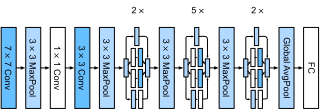

# Mạng Đa Nhánh (GoogLeNet)
<a id="sec_googlenet"></a>

Năm 2014, *GoogLeNet*
đã chiến thắng ImageNet Challenge [Szegedy.Liu.Jia.ea.2015], sử dụng một cấu trúc
kết hợp các điểm mạnh của NiN [Lin.Chen.Yan.2013], các khối lặp lại [Simonyan.Zisserman.2014],
và một hỗn hợp các nhân tích chập. Có thể nói đây cũng là mạng đầu tiên thể hiện sự phân biệt rõ ràng giữa thân (nhận dữ liệu), thân chính (xử lý dữ liệu), và đầu (dự đoán) trong một CNN. Mẫu thiết kế này đã tồn tại từ đó đến nay trong thiết kế mạng sâu: *thân* được tạo thành từ hai hoặc ba tích chập đầu tiên xử lý ảnh. Chúng trích xuất các đặc trưng cấp thấp từ ảnh gốc. Tiếp theo là *thân chính* gồm các khối tích chập. Cuối cùng, *đầu* ánh xạ các đặc trưng thu được đến bài toán phân loại, phân đoạn, phát hiện hoặc theo dõi cần giải quyết.

Đóng góp chính trong GoogLeNet là thiết kế thân mạng. Nó giải quyết vấn đề lựa chọn
nhân tích chập theo một cách khéo léo. Trong khi các công trình khác cố gắng xác định tích chập nào, từ $1 \times 1$ đến $11 \times 11$ sẽ là tốt nhất, nó đơn giản là *nối* các tích chập đa nhánh.
Sau đây chúng ta giới thiệu một phiên bản đơn giản hóa của GoogLeNet: thiết kế gốc bao gồm một số thủ thuật để ổn định quá trình huấn luyện thông qua các hàm mất mát trung gian, áp dụng cho nhiều lớp của mạng.
Chúng không còn cần thiết do sự có mặt của các thuật toán huấn luyện được cải thiện.


```python
from d2l import torch as d2l
import torch
from torch import nn
from torch.nn import functional as F
```


## (**Các Khối Inception**)

Khối tích chập cơ bản trong GoogLeNet được gọi là *khối Inception*,
xuất phát từ meme "we need to go deeper" (chúng ta cần đi sâu hơn) từ bộ phim *Inception*.


<a id="fig_inception"></a>

Như được mô tả trong [fig_inception](#fig_inception),
khối inception bao gồm bốn nhánh song song.
Ba nhánh đầu sử dụng các lớp tích chập
với kích thước cửa sổ $1\times 1$, $3\times 3$ và $5\times 5$
để trích xuất thông tin từ các kích thước không gian khác nhau.
Hai nhánh giữa cũng thêm một tích chập $1\times 1$ của đầu vào
để giảm số kênh, giảm độ phức tạp của mô hình.
Nhánh thứ tư sử dụng một lớp max-pooling $3\times 3$,
theo sau bởi một lớp tích chập $1\times 1$
để thay đổi số kênh.
Cả bốn nhánh đều sử dụng đệm phù hợp để cho đầu vào và đầu ra có cùng chiều cao và chiều rộng.
Cuối cùng, các đầu ra dọc theo mỗi nhánh được nối
dọc theo chiều kênh và tạo thành đầu ra của khối.
Các siêu tham số thường được điều chỉnh của khối Inception
là số kênh đầu ra trên mỗi lớp, tức là cách phân bổ dung lượng giữa các tích chập có kích thước khác nhau.


```python
class Inception(nn.Module):
    # c1--c4 are the number of output channels for each branch
    def __init__(self, c1, c2, c3, c4, **kwargs):
        super(Inception, self).__init__(**kwargs)
        # Branch 1
        self.b1_1 = nn.LazyConv2d(c1, kernel_size=1)
        # Branch 2
        self.b2_1 = nn.LazyConv2d(c2[0], kernel_size=1)
        self.b2_2 = nn.LazyConv2d(c2[1], kernel_size=3, padding=1)
        # Branch 3
        self.b3_1 = nn.LazyConv2d(c3[0], kernel_size=1)
        self.b3_2 = nn.LazyConv2d(c3[1], kernel_size=5, padding=2)
        # Branch 4
        self.b4_1 = nn.MaxPool2d(kernel_size=3, stride=1, padding=1)
        self.b4_2 = nn.LazyConv2d(c4, kernel_size=1)

    def forward(self, x):
        b1 = F.relu(self.b1_1(x))
        b2 = F.relu(self.b2_2(F.relu(self.b2_1(x))))
        b3 = F.relu(self.b3_2(F.relu(self.b3_1(x))))
        b4 = F.relu(self.b4_2(self.b4_1(x)))
        return torch.cat((b1, b2, b3, b4), dim=1)
```


Để có trực giác tại sao mạng này hoạt động tốt như vậy,
hãy xem xét sự kết hợp của các bộ lọc.
Chúng khám phá ảnh với nhiều kích thước bộ lọc khác nhau.
Điều này có nghĩa là các chi tiết ở các phạm vi khác nhau
có thể được nhận dạng hiệu quả bởi các bộ lọc có kích thước khác nhau.
Đồng thời, chúng ta có thể phân bổ lượng tham số khác nhau
cho các bộ lọc khác nhau.


## [**Mô hình GoogLeNet**]

Như được thể hiện trong [fig_inception_full](#fig_inception_full), GoogLeNet sử dụng một ngăn xếp tổng cộng 9 khối inception, được sắp xếp thành ba nhóm với max-pooling ở giữa,
và gộp trung bình toàn cục trong đầu để tạo ra các ước lượng.
Max-pooling giữa các khối inception giảm số chiều.
Ở thân ban đầu, module đầu tiên tương tự như AlexNet và LeNet.


<a id="fig_inception_full"></a>

Bây giờ chúng ta có thể triển khai GoogLeNet từng phần. Hãy bắt đầu với thân.
Module đầu tiên sử dụng một lớp tích chập $7\times 7$ 64 kênh.


Module thứ hai sử dụng hai lớp tích chập:
đầu tiên, một lớp tích chập $1\times 1$ 64 kênh,
theo sau là một lớp tích chập $3\times 3$ nhân ba số kênh. Điều này tương ứng với nhánh thứ hai trong khối Inception và kết thúc thiết kế của thân. Tại đây chúng ta có 192 kênh.

```python
@d2l.add_to_class(GoogleNet)
def b2(self):
    if tab.selected('mxnet'):
        net = nn.Sequential()
        net.add(nn.Conv2D(64, kernel_size=1, activation='relu'),
               nn.Conv2D(192, kernel_size=3, padding=1, activation='relu'),
               nn.MaxPool2D(pool_size=3, strides=2, padding=1))
        return net
    if tab.selected('pytorch'):
        return nn.Sequential(
            nn.LazyConv2d(64, kernel_size=1), nn.ReLU(),
            nn.LazyConv2d(192, kernel_size=3, padding=1), nn.ReLU(),
            nn.MaxPool2d(kernel_size=3, stride=2, padding=1))
    if tab.selected('tensorflow'):
        return tf.keras.Sequential([
            tf.keras.layers.Conv2D(64, 1, activation='relu'),
            tf.keras.layers.Conv2D(192, 3, padding='same', activation='relu'),
            tf.keras.layers.MaxPool2D(pool_size=3, strides=2, padding='same')])
    if tab.selected('jax'):
        return nn.Sequential([nn.Conv(64, kernel_size=(1, 1)),
                              nn.relu,
                              nn.Conv(192, kernel_size=(3, 3), padding='same'),
                              nn.relu,
                              lambda x: nn.max_pool(x, window_shape=(3, 3),
                                                    strides=(2, 2),
                                                    padding='same')])
```

Module thứ ba kết nối hai khối Inception hoàn chỉnh nối tiếp nhau.
Số kênh đầu ra của khối Inception đầu tiên là
$64+128+32+32=256$. Điều này tương đương với
tỷ lệ số kênh đầu ra
giữa bốn nhánh là $2:4:1:1$. Để đạt được điều này, chúng ta trước tiên giảm các chiều đầu vào xuống $\frac{1}{2}$ và $\frac{1}{12}$ ở nhánh thứ hai và thứ ba tương ứng
để đạt được $96 = 192/2$ và $16 = 192/12$ kênh tương ứng.

Số kênh đầu ra của khối Inception thứ hai
được tăng lên $128+192+96+64=480$, tạo ra tỷ lệ $128:192:96:64 = 4:6:3:2$. Như trước,
chúng ta cần giảm số chiều trung gian ở kênh thứ hai và thứ ba. Tỷ lệ
$\frac{1}{2}$ và $\frac{1}{8}$ tương ứng là đủ, tạo ra $128$ và $32$ kênh
tương ứng. Điều này được thể hiện bằng các đối số của các hàm tạo khối `Inception` sau đây.

```python
@d2l.add_to_class(GoogleNet)
def b3(self):
    if tab.selected('mxnet'):
        net = nn.Sequential()
        net.add(Inception(64, (96, 128), (16, 32), 32),
               Inception(128, (128, 192), (32, 96), 64),
               nn.MaxPool2D(pool_size=3, strides=2, padding=1))
        return net
    if tab.selected('pytorch'):
        return nn.Sequential(Inception(64, (96, 128), (16, 32), 32),
                             Inception(128, (128, 192), (32, 96), 64),
                             nn.MaxPool2d(kernel_size=3, stride=2, padding=1))
    if tab.selected('tensorflow'):
        return tf.keras.models.Sequential([
            Inception(64, (96, 128), (16, 32), 32),
            Inception(128, (128, 192), (32, 96), 64),
            tf.keras.layers.MaxPool2D(pool_size=3, strides=2, padding='same')])
    if tab.selected('jax'):
        return nn.Sequential([Inception(64, (96, 128), (16, 32), 32),
                              Inception(128, (128, 192), (32, 96), 64),
                              lambda x: nn.max_pool(x, window_shape=(3, 3),
                                                    strides=(2, 2),
                                                    padding='same')])
```

Module thứ tư phức tạp hơn.
Nó kết nối năm khối Inception nối tiếp nhau,
và chúng có $192+208+48+64=512$, $160+224+64+64=512$,
$128+256+64+64=512$, $112+288+64+64=528$,
và $256+320+128+128=832$ kênh đầu ra tương ứng.
Số kênh được gán cho các nhánh này tương tự
như trong module thứ ba:
nhánh thứ hai với lớp tích chập $3\times 3$
có số lượng kênh đầu ra lớn nhất,
theo sau là nhánh đầu tiên chỉ có lớp tích chập $1\times 1$,
nhánh thứ ba với lớp tích chập $5\times 5$,
và nhánh thứ tư với lớp max-pooling $3\times 3$.
Nhánh thứ hai và thứ ba sẽ trước tiên giảm
số kênh theo tỷ lệ.
Các tỷ lệ này hơi khác nhau trong các khối Inception khác nhau.

```python
@d2l.add_to_class(GoogleNet)
def b4(self):
    if tab.selected('mxnet'):
        net = nn.Sequential()
        net.add(Inception(192, (96, 208), (16, 48), 64),
                Inception(160, (112, 224), (24, 64), 64),
                Inception(128, (128, 256), (24, 64), 64),
                Inception(112, (144, 288), (32, 64), 64),
                Inception(256, (160, 320), (32, 128), 128),
                nn.MaxPool2D(pool_size=3, strides=2, padding=1))
        return net
    if tab.selected('pytorch'):
        return nn.Sequential(Inception(192, (96, 208), (16, 48), 64),
                             Inception(160, (112, 224), (24, 64), 64),
                             Inception(128, (128, 256), (24, 64), 64),
                             Inception(112, (144, 288), (32, 64), 64),
                             Inception(256, (160, 320), (32, 128), 128),
                             nn.MaxPool2d(kernel_size=3, stride=2, padding=1))
    if tab.selected('tensorflow'):
        return tf.keras.Sequential([
            Inception(192, (96, 208), (16, 48), 64),
            Inception(160, (112, 224), (24, 64), 64),
            Inception(128, (128, 256), (24, 64), 64),
            Inception(112, (144, 288), (32, 64), 64),
            Inception(256, (160, 320), (32, 128), 128),
            tf.keras.layers.MaxPool2D(pool_size=3, strides=2, padding='same')])
    if tab.selected('jax'):
        return nn.Sequential([Inception(192, (96, 208), (16, 48), 64),
                              Inception(160, (112, 224), (24, 64), 64),
                              Inception(128, (128, 256), (24, 64), 64),
                              Inception(112, (144, 288), (32, 64), 64),
                              Inception(256, (160, 320), (32, 128), 128),
                              lambda x: nn.max_pool(x, window_shape=(3, 3),
                                                    strides=(2, 2),
                                                    padding='same')])
```

Module thứ năm có hai khối Inception với $256+320+128+128=832$
và $384+384+128+128=1024$ kênh đầu ra.
Số kênh được gán cho mỗi nhánh
giống như trong module thứ ba và thứ tư,
nhưng khác về các giá trị cụ thể.
Cần lưu ý rằng khối thứ năm được theo sau bởi lớp đầu ra.
Khối này sử dụng lớp gộp trung bình toàn cục
để thay đổi chiều cao và chiều rộng của mỗi kênh thành 1, giống như trong NiN.
Cuối cùng, chúng ta chuyển đầu ra thành một mảng hai chiều
theo sau là một lớp kết nối đầy đủ
có số đầu ra bằng số lớp nhãn.

```python
@d2l.add_to_class(GoogleNet)
def b5(self):
    if tab.selected('mxnet'):
        net = nn.Sequential()
        net.add(Inception(256, (160, 320), (32, 128), 128),
                Inception(384, (192, 384), (48, 128), 128),
                nn.GlobalAvgPool2D())
        return net
    if tab.selected('pytorch'):
        return nn.Sequential(Inception(256, (160, 320), (32, 128), 128),
                             Inception(384, (192, 384), (48, 128), 128),
                             nn.AdaptiveAvgPool2d((1,1)), nn.Flatten())
    if tab.selected('tensorflow'):
        return tf.keras.Sequential([
            Inception(256, (160, 320), (32, 128), 128),
            Inception(384, (192, 384), (48, 128), 128),
            tf.keras.layers.GlobalAvgPool2D(),
            tf.keras.layers.Flatten()])
    if tab.selected('jax'):
        return nn.Sequential([Inception(256, (160, 320), (32, 128), 128),
                              Inception(384, (192, 384), (48, 128), 128),
                              # Flax does not provide a GlobalAvgPool2D layer
                              lambda x: nn.avg_pool(x,
                                                    window_shape=x.shape[1:3],
                                                    strides=x.shape[1:3],
                                                    padding='valid'),
                              lambda x: x.reshape((x.shape[0], -1))])
```

Bây giờ chúng ta đã định nghĩa tất cả các khối `b1` đến `b5`, chỉ cần lắp ráp chúng lại thành một mạng hoàn chỉnh.


Mô hình GoogLeNet tính toán khá phức tạp. Lưu ý số lượng lớn các siêu tham số tương đối tùy ý về số kênh được chọn, số khối trước khi giảm số chiều, phân vùng tương đối của dung lượng giữa các kênh, v.v. Phần lớn là do thực tế rằng vào thời điểm GoogLeNet được giới thiệu, các công cụ tự động để định nghĩa mạng hoặc khám phá thiết kế chưa có sẵn. Ví dụ, bây giờ chúng ta coi việc một framework deep learning có năng lực suy ra tự động các chiều của tensor đầu vào là điều hiển nhiên. Vào thời điểm đó, nhiều cấu hình như vậy phải được xác định rõ ràng bởi người thử nghiệm, thường làm chậm quá trình thử nghiệm tích cực. Hơn nữa, các công cụ cần thiết để khám phá tự động vẫn đang phát triển và các thử nghiệm ban đầu phần lớn tương đương với việc khám phá brute-force tốn kém, thuật toán di truyền và các chiến lược tương tự.

Hiện tại sự điều chỉnh duy nhất chúng ta sẽ thực hiện là
[**giảm chiều cao và chiều rộng đầu vào từ 224 xuống 96
để có thời gian huấn luyện hợp lý trên Fashion-MNIST.**]
Điều này đơn giản hóa tính toán. Hãy xem
sự thay đổi về hình dạng đầu ra giữa các module khác nhau.


## [**Huấn luyện**]

Như trước, chúng ta huấn luyện mô hình sử dụng tập dữ liệu Fashion-MNIST.
Chúng ta chuyển đổi nó sang độ phân giải $96 \times 96$ pixel
trước khi gọi thủ tục huấn luyện.


## Thảo luận

Một tính năng quan trọng của GoogLeNet là nó thực sự *rẻ hơn* để tính toán so với các tiền nhiệm
trong khi đồng thời cải thiện độ chính xác. Đây là sự khởi đầu của một thiết kế mạng có chủ ý hơn nhiều,
đánh đổi chi phí đánh giá mạng với việc giảm lỗi. Nó cũng đánh dấu sự khởi đầu của thử nghiệm ở cấp độ khối với các siêu tham số thiết kế mạng, mặc dù vẫn hoàn toàn thủ công vào thời điểm đó. Chúng ta sẽ xem xét lại chủ đề này trong [sec_cnn-design](#sec_cnn-design) khi thảo luận về các chiến lược khám phá cấu trúc mạng.

Trong các phần tiếp theo chúng ta sẽ gặp một số lựa chọn thiết kế (ví dụ: chuẩn hóa batch, kết nối dư, và nhóm kênh) cho phép chúng ta cải thiện mạng đáng kể. Hiện tại, bạn có thể tự hào khi đã triển khai được thứ có thể được coi là CNN hiện đại thực sự đầu tiên.

## Bài tập

1. GoogLeNet thành công đến mức nó trải qua một số lần lặp, dần dần cải thiện tốc độ và độ chính xác. Hãy thử triển khai và chạy một số trong số chúng. Chúng bao gồm:
    1. Thêm một lớp chuẩn hóa batch [Ioffe.Szegedy.2015], như được mô tả sau trong [sec_batch_norm](#sec_batch_norm).
    1. Thực hiện điều chỉnh cho khối Inception (chiều rộng, lựa chọn và thứ tự tích chập), như được mô tả trong Szegedy.Vanhoucke.Ioffe.ea.2016.
    1. Sử dụng làm mượt nhãn để chuẩn hóa mô hình, như được mô tả trong Szegedy.Vanhoucke.Ioffe.ea.2016.
    1. Thực hiện thêm điều chỉnh cho khối Inception bằng cách thêm kết nối dư [Szegedy.Ioffe.Vanhoucke.ea.2017], như được mô tả sau trong [sec_resnet](#sec_resnet).
1. Kích thước ảnh tối thiểu cần thiết để GoogLeNet hoạt động là bao nhiêu?
1. Bạn có thể thiết kế một biến thể của GoogLeNet hoạt động trên độ phân giải gốc $28 \times 28$ pixel của Fashion-MNIST không? Bạn sẽ cần thay đổi gì trong thân, thân chính và đầu của mạng, nếu có?
1. So sánh kích thước tham số mô hình của AlexNet, VGG, NiN và GoogLeNet. Làm thế nào hai kiến trúc mạng sau giảm đáng kể kích thước tham số mô hình?
1. So sánh lượng tính toán cần thiết trong GoogLeNet và AlexNet. Điều này ảnh hưởng đến thiết kế chip máy gia tốc như thế nào, ví dụ về kích thước bộ nhớ, băng thông bộ nhớ, kích thước bộ nhớ cache, lượng tính toán và lợi ích của các phép toán chuyên biệt?


[Thảo luận](https://discuss.d2l.ai/t/82)
