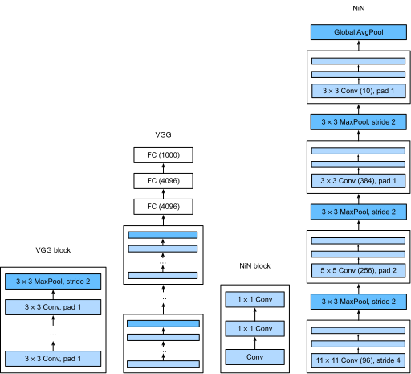

# Mạng trong Mạng (NiN)
<a id="sec_nin"></a>

LeNet, AlexNet và VGG đều chia sẻ một mẫu thiết kế chung:
trích xuất đặc trưng khai thác cấu trúc *không gian*
thông qua một chuỗi các lớp tích chập và gộp
và hậu xử lý các biểu diễn thông qua các lớp kết nối đầy đủ.
Những cải tiến của AlexNet và VGG so với LeNet chủ yếu nằm ở
cách các mạng sau này mở rộng và làm sâu thêm hai module này.

Thiết kế này đặt ra hai thách thức lớn.
Thứ nhất, các lớp kết nối đầy đủ ở cuối
kiến trúc tiêu thụ số lượng tham số khổng lồ. Chẳng hạn, ngay cả một
mô hình đơn giản như VGG-11 cũng cần một ma trận khổng lồ, chiếm gần
400MB RAM ở độ chính xác đơn (FP32). Đây là một trở ngại đáng kể cho tính toán, đặc biệt trên
các thiết bị di động và nhúng. Dù sao, ngay cả điện thoại di động cao cấp cũng không có nhiều hơn 8GB RAM. Vào thời điểm VGG được phát minh, con số này còn ít hơn một bậc độ lớn (iPhone 4S có 512MB). Vì vậy, sẽ rất khó để biện hộ cho việc dành phần lớn bộ nhớ cho một bộ phân loại ảnh.

Thứ hai, việc thêm các lớp kết nối đầy đủ
trước đó trong mạng để tăng mức độ phi tuyến cũng không khả thi: làm như vậy sẽ phá hủy
cấu trúc không gian và đòi hỏi thậm chí nhiều bộ nhớ hơn.

Các khối *mạng trong mạng* (*NiN*) [Lin.Chen.Yan.2013] cung cấp một giải pháp thay thế,
có khả năng giải quyết cả hai vấn đề trong một chiến lược đơn giản.
Chúng được đề xuất dựa trên một nhận thức rất đơn giản: (i) sử dụng các tích chập $1 \times 1$ để thêm
phi tuyến cục bộ trên các kích hoạt kênh và (ii) sử dụng gộp trung bình toàn cục để tích hợp
trên tất cả các vị trí trong lớp biểu diễn cuối cùng. Lưu ý rằng gộp trung bình toàn cục sẽ không
hiệu quả nếu không có các phi tuyến được thêm vào. Hãy cùng đi sâu vào chi tiết này.


```python
from d2l import torch as d2l
import torch
from torch import nn
```


## (**Các Khối NiN**)

Nhớ lại [subsec_1x1](#subsec_1x1). Trong đó chúng ta đã nói rằng đầu vào và đầu ra của các lớp tích chập
bao gồm các tensor bốn chiều với các trục
tương ứng với mẫu, kênh, chiều cao và chiều rộng.
Cũng nhớ lại rằng đầu vào và đầu ra của các lớp kết nối đầy đủ
thường là các tensor hai chiều tương ứng với mẫu và đặc trưng.
Ý tưởng đằng sau NiN là áp dụng một lớp kết nối đầy đủ
tại mỗi vị trí pixel (cho mỗi chiều cao và chiều rộng).
Tích chập $1 \times 1$ kết quả có thể được coi là
một lớp kết nối đầy đủ hoạt động độc lập trên mỗi vị trí pixel.

[fig_nin](#fig_nin) minh họa sự khác biệt cấu trúc chính
giữa VGG và NiN, và các khối của chúng.
Lưu ý cả sự khác biệt trong các khối NiN (tích chập ban đầu được theo sau bởi các tích chập $1 \times 1$, trong khi VGG giữ lại các tích chập $3 \times 3$) và ở cuối nơi chúng ta không còn cần một lớp kết nối đầy đủ khổng lồ.


<a id="fig_nin"></a>


```python
def nin_block(out_channels, kernel_size, strides, padding):
    return nn.Sequential(
        nn.LazyConv2d(out_channels, kernel_size, strides, padding), nn.ReLU(),
        nn.LazyConv2d(out_channels, kernel_size=1), nn.ReLU(),
        nn.LazyConv2d(out_channels, kernel_size=1), nn.ReLU())
```


## [**Mô hình NiN**]

NiN sử dụng cùng kích thước tích chập ban đầu như AlexNet (nó được đề xuất ngay sau đó).
Kích thước nhân lần lượt là $11\times 11$, $5\times 5$ và $3\times 3$,
và số kênh đầu ra khớp với AlexNet. Mỗi khối NiN được theo sau bởi một lớp max-pooling
với sải bước là 2 và hình dạng cửa sổ là $3\times 3$.

Sự khác biệt đáng kể thứ hai giữa NiN và cả AlexNet lẫn VGG
là NiN hoàn toàn tránh các lớp kết nối đầy đủ.
Thay vào đó, NiN sử dụng một khối NiN với số kênh đầu ra bằng số lớp nhãn, theo sau bởi một lớp gộp trung bình *toàn cục*,
tạo ra một vector logit.
Thiết kế này làm giảm đáng kể số lượng tham số mô hình cần thiết, mặc dù có thể tăng thời gian huấn luyện.


Chúng ta tạo một mẫu dữ liệu để xem [**hình dạng đầu ra của mỗi khối**].


## [**Huấn luyện**]

Như trước, chúng ta sử dụng Fashion-MNIST để huấn luyện mô hình sử dụng cùng
bộ tối ưu hóa mà chúng ta đã dùng cho AlexNet và VGG.


## Tóm tắt

NiN có ít tham số hơn đáng kể so với AlexNet và VGG. Điều này xuất phát chủ yếu từ thực tế là nó không cần các lớp kết nối đầy đủ khổng lồ. Thay vào đó, nó sử dụng gộp trung bình toàn cục để tổng hợp trên tất cả các vị trí ảnh sau giai đoạn cuối cùng của thân mạng. Điều này loại bỏ nhu cầu về các phép toán giảm chiều tốn kém (được học) và thay thế chúng bằng một phép trung bình đơn giản. Điều làm các nhà nghiên cứu ngạc nhiên vào thời điểm đó là thao tác lấy trung bình này không làm giảm độ chính xác. Lưu ý rằng việc lấy trung bình trên một biểu diễn độ phân giải thấp (với nhiều kênh) cũng tăng thêm lượng bất biến dịch chuyển mà mạng có thể xử lý.

Chọn ít tích chập hơn với nhân rộng và thay thế chúng bằng các tích chập $1 \times 1$ giúp tìm kiếm ít tham số hơn. Nó có thể đáp ứng một lượng đáng kể phi tuyến trên các kênh trong bất kỳ vị trí nào. Cả tích chập $1 \times 1$ và gộp trung bình toàn cục đều ảnh hưởng đáng kể đến các thiết kế CNN tiếp theo.

## Bài tập

1. Tại sao có hai lớp tích chập $1\times 1$ cho mỗi khối NiN? Tăng số lượng lên ba. Giảm số lượng xuống một. Điều gì thay đổi?
1. Điều gì thay đổi nếu bạn thay thế các tích chập $1 \times 1$ bằng tích chập $3 \times 3$?
1. Điều gì xảy ra nếu bạn thay thế gộp trung bình toàn cục bằng một lớp kết nối đầy đủ (tốc độ, độ chính xác, số lượng tham số)?
1. Tính toán mức sử dụng tài nguyên cho NiN.
    1. Số lượng tham số là bao nhiêu?
    1. Lượng tính toán là bao nhiêu?
    1. Lượng bộ nhớ cần thiết trong quá trình huấn luyện là bao nhiêu?
    1. Lượng bộ nhớ cần thiết trong quá trình dự đoán là bao nhiêu?
1. Những vấn đề tiềm ẩn khi giảm biểu diễn $384 \times 5 \times 5$ xuống biểu diễn $10 \times 5 \times 5$ trong một bước là gì?
1. Sử dụng các quyết định thiết kế cấu trúc trong VGG dẫn đến VGG-11, VGG-16 và VGG-19 để thiết kế một họ mạng tương tự NiN.


[Thảo luận](https://discuss.d2l.ai/t/80)
