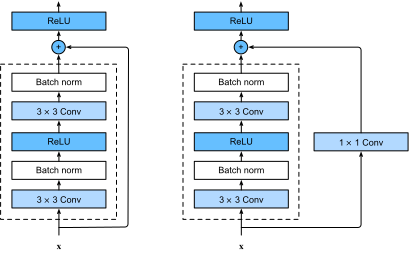
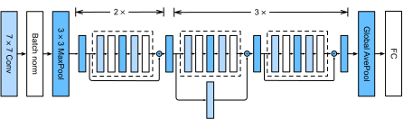
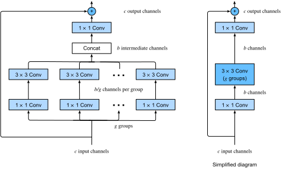

# Mạng Dư (ResNet) và ResNeXt
<a id="sec_resnet"></a>

Khi chúng ta thiết kế các mạng ngày càng sâu hơn, điều tối quan trọng là phải hiểu cách thêm các lớp có thể tăng độ phức tạp và tính biểu đạt của mạng.
Quan trọng hơn nữa là khả năng thiết kế các mạng mà việc thêm lớp làm cho mạng có tính biểu đạt *nghiêm ngặt hơn* thay vì chỉ khác biệt.
Để đạt được một số tiến bộ, chúng ta cần một chút toán học.


```python
from d2l import torch as d2l
import torch
from torch import nn
from torch.nn import functional as F
```


## Các Lớp Hàm

Xem xét $\mathcal{F}$, lớp hàm mà một kiến trúc mạng cụ thể (cùng với tốc độ học và các cài đặt siêu tham số khác) có thể đạt được.
Tức là, đối với tất cả $f \in \mathcal{F}$, tồn tại một số tập tham số (ví dụ: trọng số và hệ số chặn) có thể thu được thông qua huấn luyện trên một tập dữ liệu phù hợp.
Giả sử rằng $f^*$ là hàm "sự thật" mà chúng ta thực sự muốn tìm.
Nếu nó nằm trong $\mathcal{F}$, chúng ta ở vị trí tốt nhưng thường chúng ta sẽ không may mắn như vậy.
Thay vào đó, chúng ta sẽ cố gắng tìm $f^*_\mathcal{F}$ là lựa chọn tốt nhất của chúng ta trong $\mathcal{F}$.
Ví dụ,
cho một tập dữ liệu với các đặc trưng $\mathbf{X}$
và nhãn $\mathbf{y}$,
chúng ta có thể cố gắng tìm nó bằng cách giải bài toán tối ưu hóa sau:

$$f^*_\mathcal{F} \stackrel{\textrm{def}}{=} \mathop{\mathrm{argmin}}_f L(\mathbf{X}, \mathbf{y}, f) \textrm{ với điều kiện } f \in \mathcal{F}.$$

Chúng ta biết rằng chuẩn hóa [tikhonov1977solutions, morozov2012methods] có thể kiểm soát độ phức tạp của $\mathcal{F}$
và đạt được tính nhất quán, vì vậy kích thước dữ liệu huấn luyện lớn hơn
thường dẫn đến $f^*_\mathcal{F}$ tốt hơn.
Chỉ hợp lý khi giả định rằng nếu chúng ta thiết kế một kiến trúc khác và mạnh mẽ hơn $\mathcal{F}'$ thì chúng ta sẽ đạt được kết quả tốt hơn. Nói cách khác, chúng ta kỳ vọng rằng $f^*_{\mathcal{F}'}$ "tốt hơn" $f^*_{\mathcal{F}}$. Tuy nhiên, nếu $\mathcal{F} \not\subseteq \mathcal{F}'$ thì không có gì đảm bảo điều này sẽ xảy ra. Trên thực tế, $f^*_{\mathcal{F}'}$ hoàn toàn có thể tệ hơn.
Như được minh họa trong [fig_functionclasses](#fig_functionclasses),
đối với các lớp hàm không lồng nhau, một lớp hàm lớn hơn không phải lúc nào cũng di chuyển gần hơn đến hàm "sự thật" $f^*$. Ví dụ,
ở bên trái của [fig_functionclasses](#fig_functionclasses),
mặc dù $\mathcal{F}_3$ gần $f^*$ hơn $\mathcal{F}_1$, $\mathcal{F}_6$ lại di chuyển ra xa hơn và không có gì đảm bảo rằng việc tiếp tục tăng độ phức tạp có thể giảm khoảng cách từ $f^*$.
Với các lớp hàm lồng nhau
nơi $\mathcal{F}_1 \subseteq \cdots \subseteq \mathcal{F}_6$
ở bên phải của [fig_functionclasses](#fig_functionclasses),
chúng ta có thể tránh được vấn đề đã đề cập từ các lớp hàm không lồng nhau.


<a id="fig_functionclasses"></a>

Do đó,
chỉ khi các lớp hàm lớn hơn chứa các lớp nhỏ hơn, chúng ta mới được đảm bảo rằng việc tăng chúng sẽ làm tăng nghiêm ngặt tính biểu đạt của mạng.
Đối với mạng nơ-ron sâu,
nếu chúng ta có thể
huấn luyện lớp mới được thêm vào thành hàm đồng nhất $f(\mathbf{x}) = \mathbf{x}$, mô hình mới sẽ hiệu quả như mô hình ban đầu. Vì mô hình mới có thể tìm được giải pháp tốt hơn để phù hợp với tập dữ liệu huấn luyện, lớp được thêm vào có thể giúp giảm lỗi huấn luyện dễ hơn.

Đây là câu hỏi mà He.Zhang.Ren.ea.2016 đã xem xét khi làm việc với các mô hình thị giác máy tính rất sâu.
Trái tim của *mạng dư* (*ResNet*) do họ đề xuất là ý tưởng rằng mỗi lớp bổ sung nên
dễ dàng hơn
chứa hàm đồng nhất như một trong các phần tử của nó.
Những xem xét này khá sâu sắc nhưng đã dẫn đến một
giải pháp đơn giản đến ngạc nhiên, một *khối dư*.
Với nó, ResNet đã giành chiến thắng trong ImageNet Large Scale Visual Recognition Challenge năm 2015. Thiết kế đã có ảnh hưởng sâu sắc đến cách
xây dựng mạng nơ-ron sâu. Ví dụ, các khối dư đã được thêm vào mạng hồi quy [prakash2016neural, kim2017residual]. Tương tự, Transformer [Vaswani.Shazeer.Parmar.ea.2017] sử dụng chúng để xếp chồng nhiều lớp mạng một cách hiệu quả. Nó cũng được sử dụng trong mạng nơ-ron đồ thị [Kipf.Welling.2016] và, như một khái niệm cơ bản, nó đã được sử dụng rộng rãi trong thị giác máy tính [Redmon.Farhadi.2018, Ren.He.Girshick.ea.2015].
Lưu ý rằng mạng dư có trước mạng highway [srivastava2015highway] chia sẻ một số động cơ, mặc dù không có tham số hóa thanh lịch xung quanh hàm đồng nhất.


## (**Các Khối Dư**)
<a id="subsec_residual-blks"></a>

Hãy tập trung vào một phần cục bộ của mạng nơ-ron, như được mô tả trong [fig_residual_block](#fig_residual_block). Ký hiệu đầu vào là $\mathbf{x}$.
Chúng ta giả định rằng $f(\mathbf{x})$, ánh xạ cơ bản mong muốn mà chúng ta muốn thu được qua học, được dùng làm đầu vào cho hàm kích hoạt ở trên.
Ở bên trái,
phần trong hộp có đường đứt nét
phải trực tiếp học $f(\mathbf{x})$.
Ở bên phải,
phần trong hộp có đường đứt nét
cần học *ánh xạ dư* $g(\mathbf{x}) = f(\mathbf{x}) - \mathbf{x}$,
đây là cách khối dư có tên gọi của nó.
Nếu ánh xạ đồng nhất $f(\mathbf{x}) = \mathbf{x}$ là ánh xạ cơ bản mong muốn,
ánh xạ dư tương đương $g(\mathbf{x}) = 0$ và do đó dễ học hơn:
chúng ta chỉ cần đẩy các trọng số và hệ số chặn
của
lớp trọng số trên (ví dụ: lớp kết nối đầy đủ và lớp tích chập)
trong hộp có đường đứt nét
về không.
Hình bên phải minh họa *khối dư* của ResNet,
trong đó đường liền nét mang đầu vào lớp
$\mathbf{x}$ đến toán tử cộng
được gọi là *kết nối dư* (hoặc *kết nối tắt*).
Với các khối dư, đầu vào có thể
truyền tiến nhanh hơn qua các kết nối dư trên các lớp.
Trên thực tế,
khối dư
có thể được coi là
một trường hợp đặc biệt của khối Inception đa nhánh:
nó có hai nhánh
một trong số đó là ánh xạ đồng nhất.


<a id="fig_residual_block"></a>


ResNet có thiết kế lớp tích chập $3\times 3$ đầy đủ của VGG. Khối dư có hai lớp tích chập $3\times 3$ với cùng số kênh đầu ra. Mỗi lớp tích chập được theo sau bởi một lớp chuẩn hóa batch và hàm kích hoạt ReLU. Sau đó, chúng ta bỏ qua hai phép tích chập này và thêm đầu vào trực tiếp trước hàm kích hoạt ReLU cuối cùng.
Loại thiết kế này yêu cầu đầu ra của hai lớp tích chập phải có cùng hình dạng với đầu vào, để chúng có thể được cộng lại. Nếu muốn thay đổi số kênh, chúng ta cần giới thiệu một lớp tích chập $1\times 1$ bổ sung để biến đổi đầu vào thành hình dạng mong muốn cho phép cộng. Hãy xem mã bên dưới.


```python
class Residual(nn.Module):  
    """The Residual block of ResNet models."""
    def __init__(self, num_channels, use_1x1conv=False, strides=1):
        super().__init__()
        self.conv1 = nn.LazyConv2d(num_channels, kernel_size=3, padding=1,
                                   stride=strides)
        self.conv2 = nn.LazyConv2d(num_channels, kernel_size=3, padding=1)
        if use_1x1conv:
            self.conv3 = nn.LazyConv2d(num_channels, kernel_size=1,
                                       stride=strides)
        else:
            self.conv3 = None
        self.bn1 = nn.LazyBatchNorm2d()
        self.bn2 = nn.LazyBatchNorm2d()

    def forward(self, X):
        Y = F.relu(self.bn1(self.conv1(X)))
        Y = self.bn2(self.conv2(Y))
        if self.conv3:
            X = self.conv3(X)
        Y += X
        return F.relu(Y)
```


Mã này tạo ra hai loại mạng: một loại mà chúng ta thêm đầu vào vào đầu ra trước khi áp dụng phi tuyến ReLU bất cứ khi nào `use_1x1conv=False`; và một loại mà chúng ta điều chỉnh các kênh và độ phân giải bằng phương tiện tích chập $1 \times 1$ trước khi cộng. [fig_resnet_block](#fig_resnet_block) minh họa điều này.


<a id="fig_resnet_block"></a>

Bây giờ hãy xem [**một tình huống mà đầu vào và đầu ra có cùng hình dạng**], nơi tích chập $1 \times 1$ không cần thiết.


Chúng ta cũng có tùy chọn [**giảm một nửa chiều cao và chiều rộng đầu ra trong khi tăng số kênh đầu ra**].
Trong trường hợp này chúng ta sử dụng tích chập $1 \times 1$ qua `use_1x1conv=True`. Điều này hữu ích ở đầu mỗi khối ResNet để giảm chiều không gian qua `strides=2`.


## [**Mô hình ResNet**]

Hai lớp đầu tiên của ResNet giống với GoogLeNet mà chúng ta mô tả trước đó: lớp tích chập $7\times 7$ với 64 kênh đầu ra và sải bước là 2 được theo sau bởi lớp max-pooling $3\times 3$ với sải bước là 2. Sự khác biệt là lớp chuẩn hóa batch được thêm sau mỗi lớp tích chập trong ResNet.


GoogLeNet sử dụng bốn module được tạo thành từ các khối Inception.
Tuy nhiên, ResNet sử dụng bốn module được tạo thành từ các khối dư, mỗi module sử dụng một số khối dư với cùng số kênh đầu ra.
Số kênh trong module đầu tiên giống với số kênh đầu vào. Vì một lớp max-pooling với sải bước là 2 đã được sử dụng, không cần thiết phải giảm chiều cao và chiều rộng. Trong khối dư đầu tiên cho mỗi module tiếp theo, số kênh tăng gấp đôi so với module trước đó, và chiều cao và chiều rộng được giảm một nửa.


```python
@d2l.add_to_class(ResNet)
def block(self, num_residuals, num_channels, first_block=False):
    blk = []
    for i in range(num_residuals):
        if i == 0 and not first_block:
            blk.append(Residual(num_channels, use_1x1conv=True, strides=2))
        else:
            blk.append(Residual(num_channels))
    return nn.Sequential(*blk)
```


Sau đó, chúng ta thêm tất cả các module vào ResNet. Ở đây, hai khối dư được sử dụng cho mỗi module. Cuối cùng, giống như GoogLeNet, chúng ta thêm một lớp gộp trung bình toàn cục, theo sau là đầu ra lớp kết nối đầy đủ.


```python
# %%tab jax
@d2l.add_to_class(ResNet)
def create_net(self):
    net = nn.Sequential([self.b1()])
    for i, b in enumerate(self.arch):
        net.layers.extend([self.block(*b, first_block=(i==0))])
    net.layers.extend([nn.Sequential([
        # Flax does not provide a GlobalAvg2D layer
        lambda x: nn.avg_pool(x, window_shape=x.shape[1:3],
                              strides=x.shape[1:3], padding='valid'),
        lambda x: x.reshape((x.shape[0], -1)),
        nn.Dense(self.num_classes)])])
    return net
```

Có bốn lớp tích chập trong mỗi module (không kể lớp tích chập $1\times 1$). Cùng với lớp tích chập $7\times 7$ đầu tiên và lớp kết nối đầy đủ cuối cùng, có tổng cộng 18 lớp. Do đó, mô hình này thường được gọi là ResNet-18.
Bằng cách cấu hình số kênh và khối dư khác nhau trong module, chúng ta có thể tạo ra các mô hình ResNet khác nhau, chẳng hạn như ResNet-152 sâu hơn với 152 lớp. Mặc dù kiến trúc chính của ResNet tương tự như GoogLeNet, cấu trúc của ResNet đơn giản hơn và dễ sửa đổi hơn. Tất cả những yếu tố này đã dẫn đến việc sử dụng ResNet nhanh chóng và rộng rãi. [fig_resnet18](#fig_resnet18) mô tả toàn bộ ResNet-18.


<a id="fig_resnet18"></a>

Trước khi huấn luyện ResNet, hãy [**quan sát cách hình dạng đầu vào thay đổi qua các module khác nhau trong ResNet**]. Như trong tất cả các kiến trúc trước đó, độ phân giải giảm trong khi số kênh tăng cho đến khi một lớp gộp trung bình toàn cục tổng hợp tất cả các đặc trưng.


## [**Huấn luyện**]

Chúng ta huấn luyện ResNet trên tập dữ liệu Fashion-MNIST, giống như trước đây. ResNet là một kiến trúc khá mạnh mẽ và linh hoạt. Đồ thị ghi lại tổn thất huấn luyện và kiểm định cho thấy khoảng cách đáng kể giữa cả hai đồ thị, với tổn thất huấn luyện thấp hơn đáng kể. Đối với mạng có tính linh hoạt này, nhiều dữ liệu huấn luyện hơn sẽ mang lại lợi ích rõ rệt trong việc thu hẹp khoảng cách và cải thiện độ chính xác.


## ResNeXt
<a id="subsec_resnext"></a>

Một trong những thách thức gặp phải trong thiết kế ResNet là sự đánh đổi giữa phi tuyến và số chiều trong một khối nhất định. Tức là, chúng ta có thể thêm phi tuyến bằng cách tăng số lớp, hoặc bằng cách tăng chiều rộng của tích chập. Một chiến lược thay thế là tăng số kênh có thể mang thông tin giữa các khối. Thật không may, cái sau đi kèm với chi phí bình phương vì chi phí tính toán để nhận $c_\textrm{i}$ kênh và phát ra $c_\textrm{o}$ kênh tỷ lệ thuận với $\mathcal{O}(c_\textrm{i} \cdot c_\textrm{o})$ (xem thảo luận của chúng ta trong [sec_channels](#sec_channels)).

Chúng ta có thể lấy một số cảm hứng từ khối Inception của [fig_inception](#fig_inception) có luồng thông tin qua khối trong các nhóm riêng biệt. Áp dụng ý tưởng của nhiều nhóm độc lập cho khối ResNet của [fig_resnet_block](#fig_resnet_block) đã dẫn đến thiết kế ResNeXt [Xie.Girshick.Dollar.ea.2017].
Khác với sự hỗn hợp các phép biến đổi trong Inception,
ResNeXt áp dụng *cùng* phép biến đổi trong tất cả các nhánh,
do đó giảm thiểu nhu cầu điều chỉnh thủ công từng nhánh.


<a id="fig_resnext_block"></a>

Việc chia một tích chập từ $c_\textrm{i}$ sang $c_\textrm{o}$ kênh thành một trong số $g$ nhóm có kích thước $c_\textrm{i}/g$ tạo ra $g$ đầu ra có kích thước $c_\textrm{o}/g$ được gọi, khá phù hợp, là *tích chập theo nhóm*. Chi phí tính toán (theo tỷ lệ) được giảm từ $\mathcal{O}(c_\textrm{i} \cdot c_\textrm{o})$ xuống $\mathcal{O}(g \cdot (c_\textrm{i}/g) \cdot (c_\textrm{o}/g)) = \mathcal{O}(c_\textrm{i} \cdot c_\textrm{o} / g)$, tức là nhanh hơn $g$ lần. Còn tốt hơn, số tham số cần thiết để tạo ra đầu ra cũng được giảm từ một ma trận $c_\textrm{i} \times c_\textrm{o}$ thành $g$ ma trận nhỏ hơn có kích thước $(c_\textrm{i}/g) \times (c_\textrm{o}/g)$, cũng là giảm $g$ lần. Tiếp theo chúng ta giả định rằng cả $c_\textrm{i}$ và $c_\textrm{o}$ đều chia hết cho $g$.

Thách thức duy nhất trong thiết kế này là không có thông tin nào được trao đổi giữa $g$ nhóm. Khối ResNeXt của
[fig_resnext_block](#fig_resnext_block) sửa điều này theo hai cách: tích chập theo nhóm với nhân $3 \times 3$ được kẹp giữa hai tích chập $1 \times 1$. Cái thứ hai phục vụ kép trong việc thay đổi số kênh trở lại. Lợi ích là chúng ta chỉ trả chi phí $\mathcal{O}(c \cdot b)$ cho nhân $1 \times 1$ và có thể dùng chi phí $\mathcal{O}(b^2 / g)$ cho nhân $3 \times 3$. Tương tự như triển khai khối dư trong
[subsec_residual-blks](#subsec_residual-blks), kết nối dư được thay thế (do đó tổng quát hóa) bằng tích chập $1 \times 1$.

Hình bên phải trong [fig_resnext_block](#fig_resnext_block) cung cấp tóm tắt ngắn gọn hơn nhiều về khối mạng kết quả. Nó cũng sẽ đóng vai trò quan trọng trong thiết kế CNN hiện đại chung trong [sec_cnn-design](#sec_cnn-design). Lưu ý rằng ý tưởng về tích chập theo nhóm có từ triển khai AlexNet [Krizhevsky.Sutskever.Hinton.2012]. Khi phân phối mạng trên hai GPU với bộ nhớ hạn chế, việc triển khai coi mỗi GPU như kênh riêng của nó mà không có tác dụng xấu.

Triển khai sau của lớp `ResNeXtBlock` nhận đối số `groups` ($g$), với
`bot_channels` ($b$) kênh trung gian (nút cổ chai). Cuối cùng, khi chúng ta cần giảm chiều cao và chiều rộng của biểu diễn, chúng ta thêm sải bước là $2$ bằng cách đặt `use_1x1conv=True, strides=2`.


```python
class ResNeXtBlock(nn.Module):  
    """The ResNeXt block."""
    def __init__(self, num_channels, groups, bot_mul, use_1x1conv=False,
                 strides=1):
        super().__init__()
        bot_channels = int(round(num_channels * bot_mul))
        self.conv1 = nn.LazyConv2d(bot_channels, kernel_size=1, stride=1)
        self.conv2 = nn.LazyConv2d(bot_channels, kernel_size=3,
                                   stride=strides, padding=1,
                                   groups=bot_channels//groups)
        self.conv3 = nn.LazyConv2d(num_channels, kernel_size=1, stride=1)
        self.bn1 = nn.LazyBatchNorm2d()
        self.bn2 = nn.LazyBatchNorm2d()
        self.bn3 = nn.LazyBatchNorm2d()
        if use_1x1conv:
            self.conv4 = nn.LazyConv2d(num_channels, kernel_size=1, 
                                       stride=strides)
            self.bn4 = nn.LazyBatchNorm2d()
        else:
            self.conv4 = None

    def forward(self, X):
        Y = F.relu(self.bn1(self.conv1(X)))
        Y = F.relu(self.bn2(self.conv2(Y)))
        Y = self.bn3(self.conv3(Y))
        if self.conv4:
            X = self.bn4(self.conv4(X))
        return F.relu(Y + X)
```


Cách sử dụng nó hoàn toàn tương tự như `ResNetBlock` đã thảo luận trước đó. Ví dụ, khi sử dụng (`use_1x1conv=False, strides=1`), đầu vào và đầu ra có cùng hình dạng. Thay thế, đặt `use_1x1conv=True, strides=2` giảm một nửa chiều cao và chiều rộng đầu ra.


## Tóm tắt và Thảo luận

Các lớp hàm lồng nhau là mong muốn vì chúng cho phép chúng ta thu được các lớp hàm *mạnh mẽ hơn nghiêm ngặt* thay vì cũng tinh tế *khác biệt* khi thêm dung lượng. Một cách để thực hiện điều này là cho phép các lớp bổ sung đơn giản truyền đầu vào đến đầu ra. Các kết nối dư cho phép điều này. Kết quả là, điều này thay đổi thiên kiến quy nạp từ các hàm đơn giản có dạng $f(\mathbf{x}) = 0$ sang các hàm đơn giản trông như $f(\mathbf{x}) = \mathbf{x}$.


Ánh xạ dư có thể học hàm đồng nhất dễ dàng hơn, chẳng hạn như đẩy các tham số trong lớp trọng số về không. Chúng ta có thể huấn luyện một mạng nơ-ron *sâu* hiệu quả bằng cách có các khối dư. Đầu vào có thể truyền tiến nhanh hơn qua các kết nối dư trên các lớp. Kết quả là, chúng ta có thể huấn luyện các mạng sâu hơn nhiều. Ví dụ, bài báo ResNet gốc [He.Zhang.Ren.ea.2016] cho phép lên đến 152 lớp. Một lợi ích khác của mạng dư là nó cho phép chúng ta thêm các lớp, được khởi tạo như hàm đồng nhất, *trong quá trình* huấn luyện. Dù sao, hành vi mặc định của một lớp là cho dữ liệu đi qua không thay đổi. Điều này có thể tăng tốc quá trình huấn luyện của các mạng rất lớn trong một số trường hợp.

Trước các kết nối dư,
các đường bypass với các đơn vị cổng đã được giới thiệu
để huấn luyện hiệu quả các mạng highway với hơn 100 lớp
[srivastava2015highway].
Sử dụng các hàm đồng nhất như các đường bypass,
ResNet đã hoạt động tốt đáng kể
trên nhiều nhiệm vụ thị giác máy tính.
Các kết nối dư đã có ảnh hưởng lớn đến thiết kế của các mạng nơ-ron sâu tiếp theo, dù là tích chập hay tuần tự.
Như chúng ta sẽ giới thiệu sau,
kiến trúc Transformer [Vaswani.Shazeer.Parmar.ea.2017]
áp dụng các kết nối dư (cùng với các lựa chọn thiết kế khác) và phổ biến
trong các lĩnh vực đa dạng như
ngôn ngữ, thị giác, giọng nói, và học tăng cường.

ResNeXt là ví dụ về cách thiết kế mạng nơ-ron tích chập đã phát triển theo thời gian: bằng cách tiết kiệm hơn với tính toán và đánh đổi nó với kích thước của các kích hoạt (số kênh), nó cho phép các mạng nhanh hơn và chính xác hơn với chi phí thấp hơn. Một cách khác để nhìn nhận tích chập theo nhóm là nghĩ về một ma trận đường chéo theo khối cho các trọng số tích chập. Lưu ý rằng có khá nhiều "thủ thuật" như vậy dẫn đến các mạng hiệu quả hơn. Ví dụ, ShiftNet [wu2018shift] bắt chước tác dụng của tích chập $3 \times 3$, đơn giản bằng cách thêm các kích hoạt dịch chuyển vào các kênh, cung cấp độ phức tạp hàm tăng lên, lần này mà không có bất kỳ chi phí tính toán nào.

Một đặc điểm chung của các thiết kế chúng ta đã thảo luận cho đến nay là thiết kế mạng khá thủ công, chủ yếu dựa vào sự khéo léo của nhà thiết kế để tìm ra các siêu tham số mạng "đúng". Mặc dù rõ ràng là khả thi, nhưng nó cũng rất tốn kém về thời gian của con người và không có đảm bảo rằng kết quả là tối ưu theo bất kỳ nghĩa nào. Trong [sec_cnn-design](#sec_cnn-design) chúng ta sẽ thảo luận về một số chiến lược để thu được các mạng chất lượng cao theo cách tự động hơn. Đặc biệt, chúng ta sẽ xem xét khái niệm *không gian thiết kế mạng* dẫn đến các mô hình RegNetX/Y
[Radosavovic.Kosaraju.Girshick.ea.2020].

## Bài tập

1. Sự khác biệt chính giữa khối Inception trong [fig_inception](#fig_inception) và khối dư là gì? Chúng so sánh như thế nào về tính toán, độ chính xác, và các lớp hàm có thể mô tả?
1. Tham khảo Bảng 1 trong bài báo ResNet [He.Zhang.Ren.ea.2016] để triển khai các biến thể khác nhau của mạng.
1. Đối với các mạng sâu hơn, ResNet giới thiệu kiến trúc "nút cổ chai" để giảm độ phức tạp mô hình. Hãy thử triển khai nó.
1. Trong các phiên bản tiếp theo của ResNet, tác giả đã thay đổi cấu trúc "tích chập, chuẩn hóa batch và kích hoạt" thành cấu trúc "chuẩn hóa batch, kích hoạt và tích chập". Tự thực hiện cải tiến này. Xem Hình 1 trong He.Zhang.Ren.ea.2016*1 để biết chi tiết.
1. Tại sao chúng ta không thể chỉ tăng độ phức tạp của hàm vô hạn, ngay cả khi các lớp hàm được lồng nhau?


[Thảo luận](https://discuss.d2l.ai/t/86)
