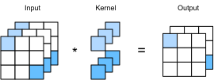

# Nhiều Kênh Đầu vào và Đầu ra
<a id="sec_channels"></a>

Trong khi chúng ta đã mô tả nhiều kênh
bao gồm mỗi hình ảnh (ví dụ: hình ảnh màu có các kênh RGB tiêu chuẩn
để chỉ ra lượng đỏ, xanh lá và xanh lam) và các lớp tích chập cho nhiều kênh trong [subsec_why-conv-channels](#subsec_why-conv-channels),
cho đến nay, chúng ta đã đơn giản hóa tất cả các ví dụ số
bằng cách làm việc chỉ với một kênh đầu vào duy nhất và một kênh đầu ra duy nhất.
Điều này cho phép chúng ta nghĩ về đầu vào, nhân tích chập,
và đầu ra của chúng ta mỗi cái là tensor hai chiều.

Khi chúng ta thêm kênh vào hỗn hợp,
đầu vào và biểu diễn ẩn của chúng ta
đều trở thành tensor ba chiều.
Ví dụ, mỗi hình ảnh RGB đầu vào có hình dạng $3\times h\times w$.
Chúng ta gọi trục này, với kích thước là 3, là chiều *kênh*. Khái niệm
kênh cũ như bản thân CNN: chẳng hạn LeNet-5 [LeCun.Jackel.Bottou.ea.1995] sử dụng chúng.
Trong phần này, chúng ta sẽ xem xét sâu hơn
các nhân tích chập với nhiều kênh đầu vào và nhiều kênh đầu ra.


```python
from d2l import torch as d2l
import torch
```


## Nhiều Kênh Đầu vào

Khi dữ liệu đầu vào chứa nhiều kênh,
chúng ta cần xây dựng một nhân tích chập
với cùng số kênh đầu vào như dữ liệu đầu vào,
để nó có thể thực hiện tương quan chéo với dữ liệu đầu vào.
Giả sử số kênh của dữ liệu đầu vào là $c_\textrm{i}$,
số kênh đầu vào của nhân tích chập cũng cần là $c_\textrm{i}$. Nếu hình dạng cửa sổ nhân tích chập của chúng ta là $k_\textrm{h}\times k_\textrm{w}$,
thì, khi $c_\textrm{i}=1$, chúng ta có thể nghĩ về nhân tích chập của mình
chỉ là một tensor hai chiều có hình dạng $k_\textrm{h}\times k_\textrm{w}$.

Tuy nhiên, khi $c_\textrm{i}>1$, chúng ta cần một nhân
chứa một tensor có hình dạng $k_\textrm{h}\times k_\textrm{w}$ cho *mỗi* kênh đầu vào. Nối các $c_\textrm{i}$ tensor này lại với nhau
tạo ra một nhân tích chập có hình dạng $c_\textrm{i}\times k_\textrm{h}\times k_\textrm{w}$.
Vì đầu vào và nhân tích chập mỗi cái đều có $c_\textrm{i}$ kênh,
chúng ta có thể thực hiện phép tương quan chéo
trên tensor hai chiều của đầu vào
và tensor hai chiều của nhân tích chập
cho mỗi kênh, cộng $c_\textrm{i}$ kết quả lại với nhau
(tổng hợp qua các kênh)
để tạo ra một tensor hai chiều.
Đây là kết quả của tương quan chéo hai chiều
giữa đầu vào đa kênh và
nhân tích chập đa kênh đầu vào.

[fig_conv_multi_in](#fig_conv_multi_in) cung cấp ví dụ
về tương quan chéo hai chiều với hai kênh đầu vào.
Các phần tô bóng là phần tử đầu ra đầu tiên
cũng như các phần tử tensor đầu vào và nhân được sử dụng để tính toán đầu ra:
$(1\times1+2\times2+4\times3+5\times4)+(0\times0+1\times1+3\times2+4\times3)=56$.


<a id="fig_conv_multi_in"></a>


Để đảm bảo chúng ta thực sự hiểu những gì đang xảy ra ở đây,
chúng ta có thể (**tự triển khai các phép tương quan chéo với nhiều kênh đầu vào**).
Lưu ý rằng tất cả những gì chúng ta làm là thực hiện phép tương quan chéo
trên mỗi kênh và sau đó cộng kết quả lại.


Chúng ta có thể xây dựng tensor đầu vào `X` và tensor nhân `K`
tương ứng với các giá trị trong [fig_conv_multi_in](#fig_conv_multi_in)
để (**xác thực đầu ra**) của phép tương quan chéo.

```python
X = d2l.tensor([[[0.0, 1.0, 2.0], [3.0, 4.0, 5.0], [6.0, 7.0, 8.0]],
               [[1.0, 2.0, 3.0], [4.0, 5.0, 6.0], [7.0, 8.0, 9.0]]])
K = d2l.tensor([[[0.0, 1.0], [2.0, 3.0]], [[1.0, 2.0], [3.0, 4.0]]])

corr2d_multi_in(X, K)
```

## Nhiều Kênh Đầu ra
<a id="subsec_multi-output-channels"></a>

Bất kể số kênh đầu vào,
cho đến nay chúng ta luôn kết thúc với một kênh đầu ra.
Tuy nhiên, như chúng ta đã thảo luận trong [subsec_why-conv-channels](#subsec_why-conv-channels),
hóa ra là điều cần thiết phải có nhiều kênh ở mỗi lớp.
Trong các kiến trúc mạng nơ-ron phổ biến nhất,
chúng ta thực sự tăng chiều kênh
khi đi sâu hơn trong mạng nơ-ron,
thường lấy mẫu thấp hơn để đánh đổi độ phân giải không gian
với *độ sâu kênh* lớn hơn.
Một cách trực quan, bạn có thể nghĩ về mỗi kênh
như phản ứng với một tập hợp đặc trưng khác nhau.
Thực tế phức tạp hơn một chút so với điều này. Một cách hiểu ngây thơ sẽ gợi ý
rằng các biểu diễn được học độc lập trên mỗi điểm ảnh hoặc mỗi kênh.
Thay vào đó, các kênh được tối ưu hóa để cùng nhau hữu ích.
Điều này có nghĩa là thay vì ánh xạ một kênh duy nhất cho bộ phát hiện cạnh, nó có thể chỉ đơn giản có nghĩa là
một số hướng trong không gian kênh tương ứng với việc phát hiện cạnh.

Ký hiệu $c_\textrm{i}$ và $c_\textrm{o}$ là số
kênh đầu vào và đầu ra tương ứng,
và $k_\textrm{h}$ và $k_\textrm{w}$ là chiều cao và chiều rộng của nhân.
Để có đầu ra với nhiều kênh,
chúng ta có thể tạo một tensor nhân
có hình dạng $c_\textrm{i}\times k_\textrm{h}\times k_\textrm{w}$
cho *mỗi* kênh đầu ra.
Chúng ta nối chúng trên chiều kênh đầu ra,
để hình dạng của nhân tích chập
là $c_\textrm{o}\times c_\textrm{i}\times k_\textrm{h}\times k_\textrm{w}$.
Trong các phép tương quan chéo,
kết quả trên mỗi kênh đầu ra được tính toán
từ nhân tích chập tương ứng với kênh đầu ra đó
và lấy đầu vào từ tất cả các kênh trong tensor đầu vào.

Chúng ta triển khai hàm tương quan chéo
để [**tính đầu ra của nhiều kênh**] như dưới đây.

```python
def corr2d_multi_in_out(X, K):
    # Iterate through the 0th dimension of K, and each time, perform
    # cross-correlation operations with input X. All of the results are
    # stacked together
    return d2l.stack([corr2d_multi_in(X, k) for k in K], 0)
```

Chúng ta xây dựng một nhân tích chập tầm thường với ba kênh đầu ra
bằng cách nối tensor nhân cho `K` với `K+1` và `K+2`.

```python
K = d2l.stack((K, K + 1, K + 2), 0)
K.shape
```

Dưới đây, chúng ta thực hiện các phép tương quan chéo
trên tensor đầu vào `X` với tensor nhân `K`.
Bây giờ đầu ra chứa ba kênh.
Kết quả của kênh đầu tiên nhất quán
với kết quả của tensor đầu vào `X` trước đó
và nhân kênh đầu vào đa, kênh đầu ra đơn.

```python
corr2d_multi_in_out(X, K)
```

## Lớp Tích chập $1\times 1$
<a id="subsec_1x1"></a>

Lúc đầu, một [**tích chập $1 \times 1$**], tức là $k_\textrm{h} = k_\textrm{w} = 1$,
dường như không có nhiều ý nghĩa.
Xét cho cùng, một phép tích chập tương quan các điểm ảnh lân cận.
Một tích chập $1 \times 1$ rõ ràng không làm điều đó.
Tuy nhiên, chúng là các phép toán phổ biến đôi khi được bao gồm
trong các thiết kế của các mạng sâu phức tạp [Lin.Chen.Yan.2013, Szegedy.Ioffe.Vanhoucke.ea.2017].
Hãy xem chi tiết nó thực sự làm gì.

Vì cửa sổ tối thiểu được sử dụng,
tích chập $1\times 1$ mất đi khả năng
của các lớp tích chập lớn hơn
để nhận dạng các mẫu bao gồm các tương tác
giữa các phần tử lân cận trong các chiều chiều cao và chiều rộng.
Tính toán duy nhất của tích chập $1\times 1$ xảy ra
trên chiều kênh.

[fig_conv_1x1](#fig_conv_1x1) hiển thị tính toán tương quan chéo
sử dụng nhân tích chập $1\times 1$
với 3 kênh đầu vào và 2 kênh đầu ra.
Lưu ý rằng đầu vào và đầu ra có cùng chiều cao và chiều rộng.
Mỗi phần tử trong đầu ra được rút ra
từ tổ hợp tuyến tính của các phần tử *tại cùng vị trí*
trong hình ảnh đầu vào.
Bạn có thể nghĩ về lớp tích chập $1\times 1$
như một lớp kết nối đầy đủ được áp dụng tại mỗi vị trí điểm ảnh duy nhất
để chuyển đổi $c_\textrm{i}$ giá trị đầu vào tương ứng thành $c_\textrm{o}$ giá trị đầu ra.
Vì đây vẫn là một lớp tích chập,
các trọng số được ràng buộc qua vị trí điểm ảnh.
Do đó lớp tích chập $1\times 1$ yêu cầu $c_\textrm{o}\times c_\textrm{i}$ trọng số
(cộng với hệ số chặn). Cũng lưu ý rằng các lớp tích chập thường được theo sau
bởi các phi tuyến tính. Điều này đảm bảo rằng các tích chập $1 \times 1$ không thể đơn giản được
gộp vào các tích chập khác.


<a id="fig_conv_1x1"></a>

Hãy kiểm tra xem điều này có hoạt động trong thực tế không:
chúng ta triển khai một tích chập $1 \times 1$
bằng cách sử dụng một lớp kết nối đầy đủ.
Điều duy nhất là chúng ta cần thực hiện một số điều chỉnh
với hình dạng dữ liệu trước và sau phép nhân ma trận.

```python
def corr2d_multi_in_out_1x1(X, K):
    c_i, h, w = X.shape
    c_o = K.shape[0]
    X = d2l.reshape(X, (c_i, h * w))
    K = d2l.reshape(K, (c_o, c_i))
    # Matrix multiplication in the fully connected layer
    Y = d2l.matmul(K, X)
    return d2l.reshape(Y, (c_o, h, w))
```

Khi thực hiện các tích chập $1\times 1$,
hàm trên tương đương với hàm tương quan chéo được triển khai trước đó `corr2d_multi_in_out`.
Hãy kiểm tra điều này với một số dữ liệu mẫu.


## Thảo luận

Các kênh cho phép chúng ta kết hợp những điều tốt nhất của cả hai thế giới: MLP cho phép các phi tuyến tính đáng kể và phép tích chập cho phép phân tích *cục bộ* của các đặc trưng. Đặc biệt, các kênh cho phép CNN lý luận với nhiều đặc trưng, chẳng hạn như bộ phát hiện cạnh và hình dạng cùng một lúc. Chúng cũng cung cấp sự đánh đổi thực tế giữa việc giảm mạnh tham số phát sinh từ bất biến dịch chuyển và cục bộ, và nhu cầu về các mô hình biểu đạt và đa dạng trong thị giác máy tính.

Tuy nhiên, lưu ý rằng sự linh hoạt này đi kèm với một cái giá. Cho một hình ảnh kích thước $(h \times w)$, chi phí để tính toán một tích chập $k \times k$ là $\mathcal{O}(h \cdot w \cdot k^2)$. Với $c_\textrm{i}$ và $c_\textrm{o}$ kênh đầu vào và đầu ra tương ứng, điều này tăng lên $\mathcal{O}(h \cdot w \cdot k^2 \cdot c_\textrm{i} \cdot c_\textrm{o})$. Với hình ảnh $256 \times 256$ điểm ảnh với nhân $5 \times 5$ và $128$ kênh đầu vào và đầu ra tương ứng, điều này lên đến hơn 53 tỷ phép toán (chúng ta đếm phép nhân và phép cộng riêng biệt). Sau này chúng ta sẽ gặp các chiến lược hiệu quả để cắt giảm chi phí, ví dụ: bằng cách yêu cầu các phép toán theo kênh là đường chéo khối, dẫn đến các kiến trúc như ResNeXt [Xie.Girshick.Dollar.ea.2017].

## Bài tập

1. Giả sử chúng ta có hai nhân tích chập kích thước $k_1$ và $k_2$ tương ứng
   (không có phi tuyến tính ở giữa).
    1. Chứng minh rằng kết quả của phép toán có thể được biểu đạt bằng một phép tích chập duy nhất.
    1. Chiều của phép tích chập đơn tương đương là bao nhiêu?
    1. Ngược lại có đúng không, tức là bạn có thể luôn phân tách một phép tích chập thành hai cái nhỏ hơn không?
1. Giả sử đầu vào có hình dạng $c_\textrm{i}\times h\times w$ và một nhân tích chập có hình dạng
   $c_\textrm{o}\times c_\textrm{i}\times k_\textrm{h}\times k_\textrm{w}$, đệm là $(p_\textrm{h}, p_\textrm{w})$, và sải bước là $(s_\textrm{h}, s_\textrm{w})$.
    1. Chi phí tính toán (phép nhân và phép cộng) cho lan truyền xuôi là bao nhiêu?
    1. Dấu chân bộ nhớ là bao nhiêu?
    1. Dấu chân bộ nhớ cho tính toán ngược là bao nhiêu?
    1. Chi phí tính toán cho lan truyền ngược là bao nhiêu?
1. Số lượng phép tính tăng theo hệ số nào nếu chúng ta tăng gấp đôi cả số kênh đầu vào
   $c_\textrm{i}$ và số kênh đầu ra $c_\textrm{o}$? Điều gì xảy ra nếu chúng ta tăng gấp đôi đệm?
1. Các biến `Y1` và `Y2` trong ví dụ cuối cùng của phần này có giống hệt nhau không? Tại sao?
1. Biểu diễn các phép tích chập như một phép nhân ma trận, ngay cả khi cửa sổ tích chập không phải là $1 \times 1$.
1. Nhiệm vụ của bạn là triển khai các phép tích chập nhanh với nhân $k \times k$. Một trong các ứng viên thuật toán
   là quét theo chiều ngang qua nguồn, đọc một dải rộng $k$ và tính dải đầu ra rộng $1$
   một giá trị tại một thời điểm. Phương án thay thế là đọc một dải rộng $k + \Delta$ và tính dải đầu ra rộng $\Delta$.
   Tại sao phương án sau lại được ưu tiên? Có giới hạn nào về $\Delta$ nên chọn không?
1. Giả sử chúng ta có một ma trận $c \times c$.
    1. Phép nhân với ma trận đường chéo khối nhanh hơn bao nhiêu nếu ma trận được chia thành $b$ khối?
    1. Nhược điểm của việc có $b$ khối là gì? Bạn có thể sửa điều đó như thế nào, ít nhất là một phần?


[Discussions](https://discuss.d2l.ai/t/70)
