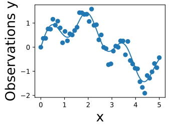
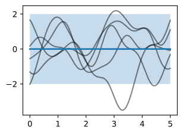
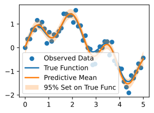
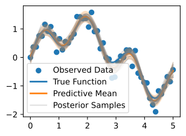
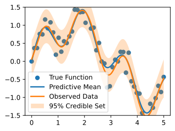

# Suy luận với Gaussian Process

Trong phần này, chúng ta sẽ trình bày cách thực hiện posterior inference và dự đoán bằng các GP prior đã giới thiệu ở phần trước. Chúng ta sẽ bắt đầu với hồi quy, nơi có thể thực hiện suy luận ở _dạng đóng_. Đây là phần "GPs in a nutshell" để nhanh chóng bắt đầu dùng Gaussian process trong thực tế. Chúng ta sẽ bắt đầu lập trình mọi phép toán cơ bản từ đầu, rồi giới thiệu [GPyTorch](https://gpytorch.ai/), công cụ giúp làm việc với các Gaussian process tiên tiến và tích hợp với mạng nơ-ron sâu thuận tiện hơn nhiều. Chúng ta sẽ xét sâu hơn các chủ đề nâng cao này ở phần tiếp theo. Trong phần đó, chúng ta cũng sẽ xét các thiết lập cần suy luận xấp xỉ, như phân loại, point process, hoặc bất kỳ likelihood phi Gaussian nào.

## Posterior inference cho hồi quy

Một mô hình _quan sát_ liên hệ hàm mà chúng ta muốn học, $f(x)$, với các quan sát $y(x)$, cả hai đều được đánh chỉ mục bởi một đầu vào $x$ nào đó. Trong phân loại, $x$ có thể là các điểm ảnh của một ảnh, còn $y$ có thể là nhãn lớp tương ứng. Trong hồi quy, $y$ thường biểu diễn một đầu ra liên tục, chẳng hạn nhiệt độ bề mặt đất, mực nước biển, nồng độ $CO_2$, v.v.

Trong hồi quy, chúng ta thường giả định các đầu ra được cho bởi một hàm ẩn không nhiễu $f(x)$ cộng với nhiễu Gaussian i.i.d. $\epsilon(x)$:

$$y(x) = f(x) + \epsilon(x),$$

với $\epsilon(x) \sim \mathcal{N}(0,\sigma^2)$. Gọi $\mathbf{y} = y(X) = (y(x_1),\dots,y(x_n))^{\top}$ là vector các quan sát huấn luyện, và $\textbf{f} = (f(x_1),\dots,f(x_n))^{\top}$ là vector các giá trị hàm ẩn không nhiễu, được truy vấn tại các đầu vào huấn luyện $X = {x_1, \dots, x_n}$.

Chúng ta sẽ giả định $f(x) \sim \mathcal{GP}(m,k)$, nghĩa là bất kỳ tập giá trị hàm nào $\textbf{f}$ cũng có phân phối Gaussian đa biến chung, với vector trung bình $\mu_i = m(x_i)$ và ma trận hiệp phương sai $K_{ij} = k(x_i,x_j)$. RBF kernel $k(x_i,x_j) = a^2 \exp\left(-\frac{1}{2\ell^2}||x_i-x_j||^2\right)$ sẽ là một lựa chọn chuẩn cho hàm hiệp phương sai. Để ký hiệu đơn giản, chúng ta sẽ giả định hàm trung bình $m(x)=0$; các suy luận của ta có thể dễ dàng được tổng quát hóa sau.

Giả sử chúng ta muốn dự đoán tại một tập đầu vào $$X_* = x_{*1},x_{*2},\dots,x_{*m}.$$ Khi đó chúng ta muốn tìm $x^2$ và $p(\mathbf{f}_* | \mathbf{y}, X)$. Trong thiết lập hồi quy, ta có thể tìm phân phối này một cách thuận tiện bằng cách dùng các đồng nhất thức Gaussian, sau khi tìm phân phối chung trên $\mathbf{f}_* = f(X_*)$ và $\mathbf{y}$.

Nếu đánh giá phương trình :eqref:`eq_gp-regression` tại các đầu vào huấn luyện $X$, ta có $\mathbf{y} = \mathbf{f} + \mathbf{\epsilon}$. Theo định nghĩa của Gaussian process (xem phần trước), $\mathbf{f} \sim \mathcal{N}(0,K(X,X))$, trong đó $K(X,X)$ là ma trận $n \times n$ được tạo bằng cách đánh giá hàm hiệp phương sai (còn gọi là _kernel_) tại mọi cặp đầu vào khả dĩ $x_i, x_j \in X$. $\mathbf{\epsilon}$ đơn giản là một vector gồm các mẫu iid từ $\mathcal{N}(0,\sigma^2)$ và do đó có phân phối $\mathcal{N}(0,\sigma^2I)$. Vì vậy $\mathbf{y}$ là tổng của hai biến Gaussian đa biến độc lập, và do đó có phân phối $\mathcal{N}(0, K(X,X) + \sigma^2I)$. Cũng có thể chứng minh rằng $\textrm{cov}(\mathbf{f}_*, \mathbf{y}) = \textrm{cov}(\mathbf{y},\mathbf{f}_*)^{\top} = K(X_*,X)$, trong đó $K(X_*,X)$ là ma trận $m \times n$ được tạo bằng cách đánh giá kernel tại mọi cặp đầu vào kiểm tra và huấn luyện.

$$
\begin{bmatrix}
\mathbf{y} \\
\mathbf{f}_*
\end{bmatrix}
\sim
\mathcal{N}\left(0, 
\mathbf{A} = \begin{bmatrix}
K(X,X)+\sigma^2I & K(X,X_*) \\
K(X_*,X) & K(X_*,X_*)
\end{bmatrix}
\right)
$$

Sau đó, chúng ta có thể dùng các đồng nhất thức Gaussian chuẩn để tìm phân phối có điều kiện từ phân phối chung (xem, ví dụ, Bishop Chương 2),
$\mathbf{f}_* | \mathbf{y}, X, X_* \sim \mathcal{N}(m_*,S_*)$, trong đó $m_* = K(X_*,X)[K(X,X)+\sigma^2I]^{-1}\textbf{y}$, và $S = K(X_*,X_*) - K(X_*,X)[K(X,X)+\sigma^2I]^{-1}K(X,X_*)$.

Thông thường, chúng ta không cần dùng toàn bộ ma trận hiệp phương sai dự đoán $S$, mà thay vào đó dùng đường chéo của $S$ cho độ bất định của từng dự đoán. Vì lý do này, ta thường viết phân phối dự đoán cho một điểm kiểm tra đơn lẻ $x_*$, thay vì một tập các điểm kiểm tra.

Ma trận kernel có các tham số $\theta$ mà chúng ta cũng muốn ước lượng, chẳng hạn biên độ $a$ và lengthscale $\ell$ của RBF kernel ở trên. Cho mục đích này, chúng ta dùng _marginal likelihood_, $p(\textbf{y} | \theta, X)$, mà chúng ta đã suy ra khi tính các phân phối biên để tìm phân phối chung trên $\textbf{y},\textbf{f}_*$. Như sẽ thấy, marginal likelihood tách thành các hạng tử độ khớp mô hình và độ phức tạp mô hình, đồng thời tự động mã hóa một khái niệm Occam's razor để học siêu tham số. Để thảo luận đầy đủ, xem MacKay Ch. 28 [mackay2003information], và Rasmussen và Williams Ch. 5 [rasmussen2006gaussian].

```python
from d2l import torch as d2l
import numpy as np
from scipy.spatial import distance_matrix
from scipy import optimize
import matplotlib.pyplot as plt
import math
import torch
import gpytorch
import os

d2l.set_figsize()
```




## Các phương trình để dự đoán và học siêu tham số kernel trong hồi quy GP

Ở đây chúng ta liệt kê các phương trình bạn sẽ dùng để học siêu tham số và dự đoán trong hồi quy Gaussian process. Một lần nữa, ta giả định một vector các mục tiêu hồi quy $\textbf{y}$, được đánh chỉ mục bởi các đầu vào $X = \{x_1,\dots,x_n\}$, và ta muốn dự đoán tại một đầu vào kiểm tra $x_*$. Chúng ta giả định nhiễu Gaussian cộng i.i.d. có trung bình không và phương sai $\sigma^2$. Ta dùng một Gaussian process prior $f(x) \sim \mathcal{GP}(m,k)$ cho hàm ẩn không nhiễu, với hàm trung bình $m$ và hàm kernel $k$. Bản thân kernel có các tham số $\theta$ mà chúng ta muốn học. Ví dụ, nếu dùng RBF kernel, $k(x_i,x_j) = a^2\exp\left(-\frac{1}{2\ell^2}||x-x'||^2\right)$, ta muốn học $\theta = \{a^2, \ell^2\}$. Gọi $K(X,X)$ là ma trận $n \times n$ tương ứng với việc đánh giá kernel cho mọi cặp khả dĩ của $n$ đầu vào huấn luyện. Gọi $K(x_*,X)$ là vector $1 \times n$ được tạo bằng cách đánh giá $k(x_*, x_i)$, $i=1,\dots,n$. Gọi $\mu$ là vector trung bình được tạo bằng cách đánh giá hàm trung bình $m(x)$ tại mọi điểm huấn luyện $x$.

Thông thường khi làm việc với Gaussian process, chúng ta theo một quy trình hai bước.
1. Học siêu tham số kernel $\hat{\theta}$ bằng cách tối đa hóa marginal likelihood theo các siêu tham số này.
2. Dùng trung bình dự đoán làm bộ dự đoán điểm, và 2 lần độ lệch chuẩn dự đoán để tạo tập tin cậy 95\%, điều kiện hóa trên các siêu tham số đã học $\hat{\theta}$.

Log marginal likelihood đơn giản là log mật độ Gaussian, có dạng:
$$\log p(\textbf{y} | \theta, X) = -\frac{1}{2}\textbf{y}^{\top}[K_{\theta}(X,X) + \sigma^2I]^{-1}\textbf{y} - \frac{1}{2}\log|K_{\theta}(X,X)| + c$$

Phân phối dự đoán có dạng:
$$p(y_* | x_*, \textbf{y}, \theta) = \mathcal{N}(a_*,v_*)$$
$$a_* = k_{\theta}(x_*,X)[K_{\theta}(X,X)+\sigma^2I]^{-1}(\textbf{y}-\mu) + \mu$$
$$v_* = k_{\theta}(x_*,x_*) - K_{\theta}(x_*,X)[K_{\theta}(X,X)+\sigma^2I]^{-1}k_{\theta}(X,x_*)$$

## Diễn giải các phương trình học và dự đoán

Có một số điểm then chốt cần lưu ý về các phân phối dự đoán cho Gaussian process:

* Dù lớp mô hình rất linh hoạt, có thể thực hiện suy luận Bayes _chính xác_ cho hồi quy GP ở _dạng đóng_. Ngoài việc học các siêu tham số kernel, không có _huấn luyện_. Chúng ta có thể viết chính xác các phương trình muốn dùng để dự đoán. Gaussian process tương đối đặc biệt ở khía cạnh này, và điều đó đã góp phần lớn vào sự tiện lợi, đa năng và mức độ phổ biến bền bỉ của chúng.

* Trung bình dự đoán $a_*$ là một tổ hợp tuyến tính của các mục tiêu huấn luyện $\textbf{y}$, được trọng số bởi kernel $k_{\theta}(x_*,X)[K_{\theta}(X,X)+\sigma^2I]^{-1}$. Như sẽ thấy, kernel (và các siêu tham số của nó) do đó đóng vai trò then chốt trong các tính chất khái quát hóa của mô hình.

* Trung bình dự đoán phụ thuộc tường minh vào các giá trị mục tiêu $\textbf{y}$, nhưng phương sai dự đoán thì không. Thay vào đó, độ bất định dự đoán tăng khi đầu vào kiểm tra $x_*$ di chuyển xa khỏi các vị trí mục tiêu $X$, như được chi phối bởi hàm kernel. Tuy nhiên, độ bất định sẽ phụ thuộc ngầm vào các giá trị mục tiêu $\textbf{y}$ thông qua các siêu tham số kernel $\theta$, vốn được học từ dữ liệu.

* Marginal likelihood tách thành các hạng tử độ khớp mô hình và độ phức tạp mô hình (log determinant). Marginal likelihood có xu hướng chọn các siêu tham số cung cấp những khớp đơn giản nhất mà vẫn nhất quán với dữ liệu.

* Các điểm nghẽn tính toán chính đến từ việc giải một hệ tuyến tính và tính log determinant trên một ma trận đối xứng xác định dương $n \times n$ $K(X,X)$ cho $n$ điểm huấn luyện. Theo cách ngây thơ, mỗi phép toán này tốn $\mathcal{O}(n^3)$ phép tính, cũng như $\mathcal{O}(n^2)$ bộ nhớ cho từng phần tử của ma trận kernel (hiệp phương sai), thường bắt đầu bằng phân rã Cholesky. Về mặt lịch sử, các điểm nghẽn này đã giới hạn GP ở các bài toán có dưới khoảng 10.000 điểm huấn luyện, và tạo cho GP tiếng là "chậm", điều đã không còn chính xác trong gần một thập kỷ nay. Trong các chủ đề nâng cao, chúng ta sẽ thảo luận cách mở rộng GP cho các bài toán với hàng triệu điểm.

* Với các lựa chọn hàm kernel phổ biến, $K(X,X)$ thường gần suy biến, điều này có thể gây vấn đề số học khi thực hiện phân rã Cholesky hoặc các phép toán khác nhằm giải hệ tuyến tính. May mắn là trong hồi quy, chúng ta thường làm việc với $K_{\theta}(X,X)+\sigma^2I$, sao cho phương sai nhiễu $\sigma^2$ được cộng vào đường chéo của $K(X,X)$, cải thiện đáng kể điều kiện của nó. Nếu phương sai nhiễu nhỏ, hoặc ta đang làm hồi quy không nhiễu, thông lệ phổ biến là thêm một lượng nhỏ "jitter" vào đường chéo, cỡ $10^{-6}$, để cải thiện điều kiện.


## Ví dụ làm từ đầu

Hãy tạo một số dữ liệu hồi quy, rồi khớp dữ liệu bằng một GP, triển khai mọi bước từ đầu.
Chúng ta sẽ lấy mẫu dữ liệu từ
$$y(x) = \sin(x) + \frac{1}{2}\sin(4x) + \epsilon,$$ với $\epsilon \sim \mathcal{N}(0,\sigma^2)$. Hàm không nhiễu mà chúng ta muốn tìm là $f(x) = \sin(x) + \frac{1}{2}\sin(4x)$. Chúng ta sẽ bắt đầu bằng cách dùng độ lệch chuẩn nhiễu $\sigma = 0.25$.

```python
def data_maker1(x, sig):
    return np.sin(x) + 0.5 * np.sin(4 * x) + np.random.randn(x.shape[0]) * sig

sig = 0.25
train_x, test_x = np.linspace(0, 5, 50), np.linspace(0, 5, 500)
train_y, test_y = data_maker1(train_x, sig=sig), data_maker1(test_x, sig=0.)

d2l.plt.scatter(train_x, train_y)
d2l.plt.plot(test_x, test_y)
d2l.plt.xlabel("x", fontsize=20)
d2l.plt.ylabel("Observations y", fontsize=20)
d2l.plt.show()
```




Ở đây ta thấy các quan sát nhiễu dưới dạng các vòng tròn, và hàm không nhiễu màu xanh mà chúng ta muốn tìm.

Bây giờ, hãy chỉ định một GP prior trên hàm ẩn không nhiễu, $f(x)\sim \mathcal{GP}(m,k)$. Chúng ta sẽ dùng hàm trung bình $m(x) = 0$, và một hàm hiệp phương sai (kernel) RBF
$$k(x_i,x_j) = a^2\exp\left(-\frac{1}{2\ell^2}||x-x'||^2\right).$$

```python
mean = np.zeros(test_x.shape[0])
cov = d2l.rbfkernel(test_x, test_x, ls=0.2)
```




Chúng ta đã bắt đầu với length-scale bằng 0.2. Trước khi khớp dữ liệu, điều quan trọng là xem liệu ta đã chỉ định một prior hợp lý chưa. Hãy trực quan hóa một số hàm mẫu từ prior này, cũng như tập tin cậy 95\% (ta tin có 95\% khả năng hàm thật nằm trong vùng này).

```python
prior_samples = np.random.multivariate_normal(mean=mean, cov=cov, size=5)
d2l.plt.plot(test_x, prior_samples.T, color='black', alpha=0.5)
d2l.plt.plot(test_x, mean, linewidth=2.)
d2l.plt.fill_between(test_x, mean - 2 * np.diag(cov), mean + 2 * np.diag(cov), 
                 alpha=0.25)
d2l.plt.show()
```




Các mẫu này trông có hợp lý không? Các tính chất cấp cao của hàm có phù hợp với loại dữ liệu mà chúng ta đang cố mô hình hóa không?

Bây giờ hãy lập trung bình và phương sai của phân phối dự đoán posterior tại bất kỳ điểm kiểm tra tùy ý $x_*$ nào.

$$
\bar{f}_{*} = K(x, x_*)^T (K(x, x) + \sigma^2 I)^{-1}y
$$

$$
V(f_{*}) = K(x_*, x_*) - K(x, x_*)^T (K(x, x) + \sigma^2 I)^{-1}K(x, x_*)
$$

Trước khi dự đoán, chúng ta nên học các siêu tham số kernel $\theta$ và phương sai nhiễu $\sigma^2$. Hãy khởi tạo length-scale tại 0.75, vì các hàm prior của chúng ta trông biến thiên quá nhanh so với dữ liệu đang khớp. Chúng ta cũng đoán độ lệch chuẩn nhiễu $\sigma$ là 0.75.

Để học các tham số này, chúng ta sẽ tối đa hóa marginal likelihood theo các tham số đó.

$$
\log p(y | X) = \log \int p(y | f, X)p(f | X)df
$$
$$
\log p(y | X) = -\frac{1}{2}y^T(K(x, x) + \sigma^2 I)^{-1}y - \frac{1}{2}\log |K(x, x) + \sigma^2 I| - \frac{n}{2}\log 2\pi
$$


Có lẽ các hàm prior của chúng ta biến thiên quá nhanh. Hãy đoán length-scale là 0.4. Chúng ta cũng đoán độ lệch chuẩn nhiễu là 0.75. Đây chỉ là các khởi tạo siêu tham số; chúng ta sẽ học các tham số này từ marginal likelihood.

```python
ell_est = 0.4
post_sig_est = 0.5

def neg_MLL(pars):
    K = d2l.rbfkernel(train_x, train_x, ls=pars[0])
    kernel_term = -0.5 * train_y @ \
        np.linalg.inv(K + pars[1] ** 2 * np.eye(train_x.shape[0])) @ train_y
    logdet = -0.5 * np.log(np.linalg.det(K + pars[1] ** 2 * \
                                         np.eye(train_x.shape[0])))
    const = -train_x.shape[0] / 2. * np.log(2 * np.pi)
    
    return -(kernel_term + logdet + const)


learned_hypers = optimize.minimize(neg_MLL, x0=np.array([ell_est,post_sig_est]), 
                                   bounds=((0.01, 10.), (0.01, 10.)))
ell = learned_hypers.x[0]
post_sig_est = learned_hypers.x[1]
```




Trong trường hợp này, chúng ta học được length-scale là 0.299 và độ lệch chuẩn nhiễu là 0.24. Lưu ý rằng nhiễu đã học cực kỳ gần với nhiễu thật, điều này giúp chỉ ra rằng GP của chúng ta được đặc tả rất tốt cho bài toán này.

Nói chung, việc suy nghĩ cẩn thận khi chọn kernel và khởi tạo siêu tham số là rất quan trọng. Dù tối ưu hóa marginal likelihood có thể tương đối mạnh trước khởi tạo, nó không miễn nhiễm với các khởi tạo kém. Hãy thử chạy script trên với nhiều khởi tạo khác nhau và xem bạn tìm được kết quả gì.

Bây giờ, hãy dự đoán với các siêu tham số đã học này.

```python
K_x_xstar = d2l.rbfkernel(train_x, test_x, ls=ell)
K_x_x = d2l.rbfkernel(train_x, train_x, ls=ell)
K_xstar_xstar = d2l.rbfkernel(test_x, test_x, ls=ell)

post_mean = K_x_xstar.T @ np.linalg.inv((K_x_x + \
                post_sig_est ** 2 * np.eye(train_x.shape[0]))) @ train_y
post_cov = K_xstar_xstar - K_x_xstar.T @ np.linalg.inv((K_x_x + \
                post_sig_est ** 2 * np.eye(train_x.shape[0]))) @ K_x_xstar

lw_bd = post_mean - 2 * np.sqrt(np.diag(post_cov))
up_bd = post_mean + 2 * np.sqrt(np.diag(post_cov))

d2l.plt.scatter(train_x, train_y)
d2l.plt.plot(test_x, test_y, linewidth=2.)
d2l.plt.plot(test_x, post_mean, linewidth=2.)
d2l.plt.fill_between(test_x, lw_bd, up_bd, alpha=0.25)
d2l.plt.legend(['Observed Data', 'True Function', 'Predictive Mean', '95% Set on True Func'])
d2l.plt.show()
```

Ta thấy trung bình posterior màu cam gần như khớp hoàn hảo với hàm không nhiễu thật! Lưu ý rằng tập tin cậy 95\% mà chúng ta hiển thị là cho hàm ẩn _không nhiễu_ (thật), chứ không phải các điểm dữ liệu. Ta thấy tập tin cậy này chứa toàn bộ hàm thật, và dường như không quá rộng cũng không quá hẹp. Chúng ta không muốn và cũng không kỳ vọng nó chứa các điểm dữ liệu. Nếu muốn có một tập tin cậy cho các quan sát, chúng ta nên tính

```python
lw_bd_observed = post_mean - 2 * np.sqrt(np.diag(post_cov) + post_sig_est ** 2)
up_bd_observed = post_mean + 2 * np.sqrt(np.diag(post_cov) + post_sig_est ** 2)
```

Có hai nguồn độ bất định: _epistemic_ uncertainty, biểu diễn độ bất định _có thể giảm_, và _aleatoric_ hay _irreducible_ uncertainty. _Epistemic_ uncertainty ở đây biểu diễn độ bất định về các giá trị thật của hàm không nhiễu. Độ bất định này nên tăng khi ta đi xa khỏi các điểm dữ liệu, vì ở xa dữ liệu có nhiều giá trị hàm hơn nhất quán với dữ liệu của chúng ta. Khi quan sát ngày càng nhiều dữ liệu, niềm tin của ta về hàm thật trở nên chắc chắn hơn, và epistemic uncertainty biến mất. _Aleatoric_ uncertainty trong trường hợp này là nhiễu quan sát, vì dữ liệu được đưa cho ta với nhiễu này và nó không thể giảm.

_Epistemic_ uncertainty trong dữ liệu được nắm bắt bởi phương sai của hàm ẩn không nhiễu np.diag(post\_cov). _Aleatoric_ uncertainty được nắm bắt bởi phương sai nhiễu post_sig_est**2.

Đáng tiếc là mọi người thường bất cẩn trong cách biểu diễn độ bất định, với nhiều bài báo hiển thị thanh lỗi hoàn toàn không được định nghĩa, không rõ ta đang trực quan hóa epistemic hay aleatoric uncertainty hay cả hai, và nhầm lẫn phương sai nhiễu với độ lệch chuẩn nhiễu, độ lệch chuẩn với sai số chuẩn, khoảng tin cậy tần suất với tập tin cậy Bayes, v.v. Nếu không chính xác về điều độ bất định biểu diễn, nó về cơ bản là vô nghĩa.

Theo tinh thần chú ý kỹ đến điều độ bất định của chúng ta biểu diễn, điều then chốt cần lưu ý là chúng ta lấy _hai lần_ _căn bậc hai_ của ước lượng phương sai cho hàm không nhiễu. Vì phân phối dự đoán của chúng ta là Gaussian, đại lượng này cho phép tạo một tập tin cậy 95\%, biểu diễn niềm tin của chúng ta về khoảng có 95\% khả năng chứa hàm ground truth. _Phương sai_ nhiễu nằm trên một thang hoàn toàn khác và khó diễn giải hơn nhiều.

Cuối cùng, hãy xem 20 mẫu posterior. Các mẫu này cho chúng ta biết những loại hàm nào mà ta tin có thể khớp với dữ liệu, theo posterior.

```python
post_samples = np.random.multivariate_normal(post_mean, post_cov, size=20)
d2l.plt.scatter(train_x, train_y)
d2l.plt.plot(test_x, test_y, linewidth=2.)
d2l.plt.plot(test_x, post_mean, linewidth=2.)
d2l.plt.plot(test_x, post_samples.T, color='gray', alpha=0.25)
d2l.plt.fill_between(test_x, lw_bd, up_bd, alpha=0.25)
plt.legend(['Observed Data', 'True Function', 'Predictive Mean', 'Posterior Samples'])
d2l.plt.show()
```

Trong các ứng dụng hồi quy cơ bản, phổ biến nhất là dùng trung bình dự đoán posterior và độ lệch chuẩn làm bộ dự đoán điểm và thước đo độ bất định tương ứng. Trong các ứng dụng nâng cao hơn, chẳng hạn Bayesian optimization với hàm acquisition Monte Carlo, hoặc Gaussian process cho model-based RL, thường cần lấy mẫu posterior. Tuy nhiên, ngay cả khi không thật sự bắt buộc trong các ứng dụng cơ bản, các mẫu này cho chúng ta nhiều trực giác hơn về khớp mà ta có cho dữ liệu, và thường hữu ích khi đưa vào trực quan hóa.

## Làm mọi thứ dễ dàng với GPyTorch

Như đã thấy, thật ra khá dễ để triển khai hồi quy Gaussian process cơ bản hoàn toàn từ đầu. Tuy nhiên, ngay khi muốn khám phá nhiều lựa chọn kernel, xét suy luận xấp xỉ (cần thiết ngay cả cho phân loại), kết hợp GP với mạng nơ-ron, hoặc thậm chí có một bộ dữ liệu lớn hơn khoảng 10.000 điểm, thì triển khai từ đầu trở nên khó quản lý và cồng kềnh. Một số phương pháp hiệu quả nhất cho suy luận GP có khả năng mở rộng, chẳng hạn SKI (còn gọi là KISS-GP), có thể cần hàng trăm dòng code triển khai các routine đại số tuyến tính số nâng cao.

Trong các trường hợp này, thư viện _GPyTorch_ sẽ làm cuộc sống của chúng ta dễ dàng hơn nhiều. Chúng ta sẽ thảo luận thêm về GPyTorch trong các notebook tương lai về tính toán số cho Gaussian process và các phương pháp nâng cao. Thư viện GPyTorch chứa [nhiều ví dụ](https://github.com/cornellius-gp/gpytorch/tree/master/examples). Để có cảm nhận về package này, chúng ta sẽ đi qua [ví dụ hồi quy đơn giản](https://github.com/cornellius-gp/gpytorch/blob/master/examples/01_Exact_GPs/Simple_GP_Regression.ipynb), trình bày cách nó có thể được điều chỉnh để tái tạo kết quả ở trên bằng GPyTorch. Điều này có thể trông như khá nhiều code chỉ để tái tạo hồi quy cơ bản ở trên, và theo một nghĩa nào đó, đúng là vậy. Nhưng chúng ta có thể ngay lập tức dùng nhiều kernel, kỹ thuật suy luận có khả năng mở rộng, và suy luận xấp xỉ, chỉ bằng cách thay đổi vài dòng code bên dưới, thay vì viết có thể hàng nghìn dòng code mới.

```python
# First let's convert our data into tensors for use with PyTorch
train_x = torch.tensor(train_x)
train_y = torch.tensor(train_y)
test_y = torch.tensor(test_y)

# We are using exact GP inference with a zero mean and RBF kernel
class ExactGPModel(gpytorch.models.ExactGP):
    def __init__(self, train_x, train_y, likelihood):
        super(ExactGPModel, self).__init__(train_x, train_y, likelihood)
        self.mean_module = gpytorch.means.ZeroMean()
        self.covar_module = gpytorch.kernels.ScaleKernel(
            gpytorch.kernels.RBFKernel())
    
    def forward(self, x):
        mean_x = self.mean_module(x)
        covar_x = self.covar_module(x)
        return gpytorch.distributions.MultivariateNormal(mean_x, covar_x)
```

Khối code này đưa dữ liệu vào đúng định dạng cho GPyTorch, và chỉ định rằng chúng ta đang dùng suy luận chính xác, cũng như
hàm trung bình (zero) và hàm kernel (RBF) mà ta muốn dùng. Chúng ta có thể dùng bất kỳ kernel nào khác rất dễ dàng, bằng cách
gọi, chẳng hạn, gpytorch.kernels.matern_kernel(), hoặc gpyotrch.kernels.spectral_mixture_kernel(). Cho đến đây, chúng ta
chỉ thảo luận suy luận chính xác, trong đó có thể suy ra phân phối dự đoán mà không cần xấp xỉ.
Với Gaussian process, chúng ta chỉ có thể thực hiện suy luận chính xác khi có Gaussian likelihood; cụ thể hơn, khi ta
giả định các quan sát được sinh ra như một hàm không nhiễu được biểu diễn bởi Gaussian process, cộng với nhiễu Gaussian.
Trong các notebook tương lai, chúng ta sẽ xét các thiết lập khác, chẳng hạn phân loại, nơi không thể đưa ra các giả định này.

```python
# Initialize Gaussian likelihood
likelihood = gpytorch.likelihoods.GaussianLikelihood()
model = ExactGPModel(train_x, train_y, likelihood)
training_iter = 50
# Find optimal model hyperparameters
model.train()
likelihood.train()
# Use the adam optimizer, includes GaussianLikelihood parameters
optimizer = torch.optim.Adam(model.parameters(), lr=0.1)  
# Set our loss as the negative log GP marginal likelihood
mll = gpytorch.mlls.ExactMarginalLogLikelihood(likelihood, model)
```

Ở đây, chúng ta chỉ định tường minh likelihood muốn dùng (Gaussian), mục tiêu sẽ dùng để huấn luyện siêu tham số kernel (ở đây là marginal likelihood), và quy trình muốn dùng để tối ưu hóa mục tiêu đó (trong trường hợp này là Adam). Lưu ý rằng dù chúng ta dùng Adam, một optimizer "ngẫu nhiên", trong trường hợp này nó là full-batch Adam. Vì marginal likelihood không phân rã theo từng mẫu dữ liệu, chúng ta không thể dùng một optimizer trên "mini-batch" dữ liệu mà vẫn được đảm bảo hội tụ. Các optimizer khác, chẳng hạn L-BFGS, cũng được GPyTorch hỗ trợ. Khác với học sâu tiêu chuẩn, tối ưu hóa tốt marginal likelihood tương ứng mạnh với khả năng khái quát hóa tốt, điều thường khiến chúng ta nghiêng về các optimizer mạnh như L-BFGS, giả sử chúng không quá đắt.

```python
for i in range(training_iter):
    # Zero gradients from previous iteration
    optimizer.zero_grad()
    # Output from model
    output = model(train_x)
    # Calc loss and backprop gradients
    loss = -mll(output, train_y)
    loss.backward()
    if i % 10 == 0:
        print(f'Iter {i+1:d}/{training_iter:d} - Loss: {loss.item():.3f} '
              f'squared lengthscale: '
              f'{model.covar_module.base_kernel.lengthscale.item():.3f} '
              f'noise variance: {model.likelihood.noise.item():.3f}')
    optimizer.step()
```

Ở đây chúng ta thực sự chạy quy trình tối ưu hóa, xuất giá trị loss sau mỗi 10 lần lặp.

```python
# Get into evaluation (predictive posterior) mode
test_x = torch.tensor(test_x)
model.eval()
likelihood.eval()
observed_pred = likelihood(model(test_x)) 
```

Khối code trên cho phép chúng ta dự đoán trên các đầu vào kiểm tra.

```python
with torch.no_grad():
    # Initialize plot
    f, ax = d2l.plt.subplots(1, 1, figsize=(4, 3))
    # Get upper and lower bounds for 95\% credible set (in this case, in
    # observation space)
    lower, upper = observed_pred.confidence_region()
    ax.scatter(train_x.numpy(), train_y.numpy())
    ax.plot(test_x.numpy(), test_y.numpy(), linewidth=2.)
    ax.plot(test_x.numpy(), observed_pred.mean.numpy(), linewidth=2.)
    ax.fill_between(test_x.numpy(), lower.numpy(), upper.numpy(), alpha=0.25)
    ax.set_ylim([-1.5, 1.5])
    ax.legend(['True Function', 'Predictive Mean', 'Observed Data',
               '95% Credible Set'])
```

Cuối cùng, chúng ta vẽ kết quả khớp.

Ta thấy các khớp hầu như giống hệt nhau. Một vài điều cần lưu ý: GPyTorch làm việc với length-scale và nhiễu quan sát _bình phương_. Ví dụ, độ lệch chuẩn nhiễu đã học trong code từ đầu của chúng ta khoảng 0.283. Phương sai nhiễu mà GPyTorch tìm được là $0.81 \approx 0.283^2$. Trong đồ thị GPyTorch, chúng ta cũng hiển thị tập tin cậy trong _không gian quan sát_ thay vì không gian hàm ẩn, để chứng minh rằng chúng thật sự bao phủ các điểm dữ liệu quan sát.

## Tóm tắt

Chúng ta có thể kết hợp một Gaussian process prior với dữ liệu để tạo thành posterior, dùng để dự đoán. Chúng ta cũng có thể lập marginal likelihood, hữu ích cho việc tự động học các siêu tham số kernel, vốn kiểm soát các tính chất như tốc độ biến thiên của Gaussian process. Cơ chế tạo posterior và học siêu tham số kernel cho hồi quy là đơn giản, gồm khoảng một tá dòng code. Notebook này là tài liệu tham khảo tốt cho bất kỳ độc giả nào muốn nhanh chóng bắt đầu với Gaussian process. Chúng ta cũng đã giới thiệu thư viện GPyTorch. Mặc dù code GPyTorch cho hồi quy cơ bản tương đối dài, nó có thể được sửa rất dễ cho các hàm kernel khác, hoặc chức năng nâng cao hơn mà chúng ta sẽ thảo luận trong các notebook tương lai, chẳng hạn suy luận có khả năng mở rộng hoặc likelihood phi Gaussian cho phân loại.


## Bài tập

1. Chúng ta đã nhấn mạnh tầm quan trọng của việc _học_ siêu tham số kernel, và tác động của siêu tham số và kernel lên các tính chất khái quát hóa của Gaussian process. Hãy thử bỏ qua bước học siêu tham số, thay vào đó đoán nhiều length-scale và phương sai nhiễu khác nhau, rồi kiểm tra tác động của chúng lên dự đoán. Điều gì xảy ra khi bạn dùng length-scale lớn? Length-scale nhỏ? Phương sai nhiễu lớn? Phương sai nhiễu nhỏ?
2. Chúng ta đã nói rằng marginal likelihood không phải là một mục tiêu lồi, nhưng các siêu tham số như length-scale và phương sai nhiễu có thể được ước lượng đáng tin cậy trong hồi quy GP. Điều này nhìn chung là đúng; thật ra, marginal likelihood học các siêu tham số length-scale _tốt hơn nhiều_ so với các cách tiếp cận truyền thống trong thống kê không gian, vốn liên quan đến khớp các hàm tự tương quan thực nghiệm ("covariograms"). Có thể nói, đóng góp lớn nhất từ học máy cho nghiên cứu Gaussian process, ít nhất trước các công trình gần đây về suy luận có khả năng mở rộng, là việc đưa marginal likelihood vào để học siêu tham số.

*Tuy nhiên*, các ghép cặp khác nhau của ngay cả những tham số này cũng cung cấp các lời giải thích khả dĩ khác nhau và có thể diễn giải cho nhiều bộ dữ liệu, dẫn đến các cực tiểu cục bộ trong mục tiêu của chúng ta. Nếu dùng length-scale lớn, thì ta giả định hàm thật bên dưới biến thiên chậm. Nếu dữ liệu quan sát _có_ biến thiên đáng kể, thì cách duy nhất để ta có thể hợp lý hóa length-scale lớn là với phương sai nhiễu lớn. Ngược lại, nếu dùng length-scale nhỏ, khớp của chúng ta sẽ rất nhạy với các biến thiên trong dữ liệu, để lại ít chỗ để giải thích các biến thiên bằng nhiễu (aleatoric uncertainty).

Hãy thử xem liệu bạn có thể tìm các cực tiểu cục bộ này không: khởi tạo với length-scale rất lớn kèm nhiễu lớn, và length-scale nhỏ kèm nhiễu nhỏ. Bạn có hội tụ đến các nghiệm khác nhau không?
  
3. Chúng ta đã nói rằng một lợi thế nền tảng của các phương pháp Bayes là biểu diễn tự nhiên _epistemic_ uncertainty. Trong ví dụ trên, chúng ta không thể thấy đầy đủ tác động của epistemic uncertainty. Thay vào đó, hãy thử dự đoán với `test_x = np.linspace(0, 10, 1000)`. Điều gì xảy ra với tập tin cậy 95\% khi các dự đoán đi ra ngoài dữ liệu? Nó có bao phủ hàm thật trong khoảng đó không? Điều gì xảy ra nếu bạn chỉ trực quan hóa aleatoric uncertainty trong vùng đó?

4. Thử chạy ví dụ trên, nhưng với 10.000, 20.000 và 40.000 điểm huấn luyện, rồi đo thời gian chạy. Thời gian huấn luyện co giãn như thế nào? Hoặc, thời gian chạy co giãn thế nào theo số điểm kiểm tra? Điều này có khác nhau giữa trung bình dự đoán và phương sai dự đoán không? Hãy trả lời câu hỏi này bằng cả cách suy ra lý thuyết độ phức tạp thời gian huấn luyện và kiểm tra, lẫn bằng cách chạy code ở trên với số điểm khác nhau.

5. Thử chạy ví dụ GPyTorch với các hàm hiệp phương sai khác, chẳng hạn Matern kernel. Kết quả thay đổi thế nào? Còn spectral mixture kernel có trong thư viện GPyTorch thì sao? Có kernel nào dễ huấn luyện marginal likelihood hơn các kernel khác không? Có kernel nào giá trị hơn cho dự đoán tầm xa so với tầm ngắn không?

6. Trong ví dụ GPyTorch, chúng ta vẽ phân phối dự đoán bao gồm nhiễu quan sát, trong khi ở ví dụ "from scratch", chúng ta chỉ bao gồm epistemic uncertainty. Làm lại ví dụ GPyTorch, nhưng lần này chỉ vẽ epistemic uncertainty, và so sánh với kết quả from-scratch. Các phân phối dự đoán bây giờ có giống nhau không? (Chúng nên giống nhau.)

[Thảo luận](https://discuss.d2l.ai/t/12117)
