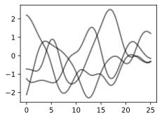
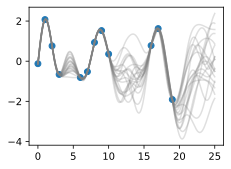
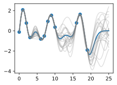
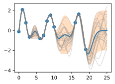
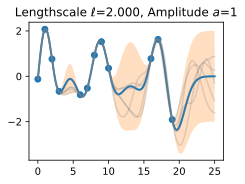
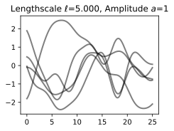
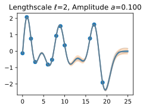
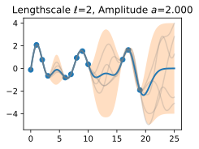

# Giới thiệu về Gaussian Process

Trong nhiều trường hợp, học máy tương đương với việc ước lượng tham số từ dữ liệu. Các tham số này thường rất nhiều và tương đối khó diễn giải, chẳng hạn như trọng số của một mạng nơ-ron. Ngược lại, Gaussian process cung cấp một cơ chế để suy luận trực tiếp về các tính chất cấp cao của những hàm có thể khớp với dữ liệu của chúng ta. Ví dụ, ta có thể có cảm nhận liệu các hàm này biến thiên nhanh, có tính chu kỳ, có các độc lập có điều kiện, hay bất biến tịnh tiến. Gaussian process cho phép chúng ta dễ dàng đưa các tính chất này vào mô hình bằng cách trực tiếp chỉ định một phân phối Gaussian trên các giá trị hàm có thể khớp với dữ liệu.

Hãy cảm nhận cách Gaussian process hoạt động bằng cách bắt đầu với một số ví dụ.

Giả sử chúng ta quan sát bộ dữ liệu sau, gồm các mục tiêu hồi quy (đầu ra) $y$, được đánh chỉ mục bởi các đầu vào $x$. Ví dụ, các mục tiêu có thể là thay đổi nồng độ carbon dioxide, còn các đầu vào có thể là các thời điểm mà những mục tiêu này được ghi nhận. Dữ liệu có những đặc điểm nào? Nó dường như biến thiên nhanh đến mức nào? Chúng ta có các điểm dữ liệu được thu thập theo khoảng đều nhau, hay có các đầu vào bị thiếu? Bạn sẽ hình dung việc điền vào các vùng bị thiếu, hoặc dự báo đến $x=25$, như thế nào?

Để khớp dữ liệu bằng một Gaussian process, chúng ta bắt đầu bằng cách chỉ định một phân phối prior trên những loại hàm mà ta có thể tin là hợp lý. Ở đây chúng ta hiển thị một vài hàm mẫu từ một Gaussian process. Prior này có hợp lý không? Lưu ý rằng ở đây chúng ta không tìm các hàm khớp với bộ dữ liệu, mà thay vào đó chỉ định các tính chất cấp cao hợp lý của nghiệm, chẳng hạn chúng biến thiên nhanh đến mức nào theo đầu vào. Lưu ý rằng chúng ta sẽ thấy code để tái tạo tất cả các đồ thị trong notebook này, ở các notebook tiếp theo về prior và inference.

Khi đã điều kiện hóa trên dữ liệu, chúng ta có thể dùng prior này để suy ra một phân phối posterior trên các hàm có thể khớp với dữ liệu. Ở đây chúng ta hiển thị các hàm posterior mẫu.

Ta thấy rằng mỗi hàm này hoàn toàn nhất quán với dữ liệu, đi qua hoàn hảo từng quan sát. Để dùng các mẫu posterior này cho dự đoán, chúng ta có thể lấy trung bình giá trị của mọi hàm mẫu khả dĩ từ posterior, tạo ra đường cong bên dưới, màu xanh đậm. Lưu ý rằng trên thực tế chúng ta không cần lấy vô hạn mẫu để tính kỳ vọng này; như sẽ thấy sau, chúng ta có thể tính kỳ vọng ở dạng đóng.

Chúng ta cũng có thể muốn một biểu diễn về độ bất định, để biết mình nên tự tin đến mức nào vào các dự đoán. Về trực giác, ta nên có độ bất định lớn hơn ở nơi có nhiều biến thiên hơn trong các hàm posterior mẫu, vì điều này cho biết có nhiều giá trị khả dĩ hơn mà hàm thật có thể nhận. Loại độ bất định này được gọi là _epistemic uncertainty_, tức _độ bất định có thể giảm_ gắn với thiếu thông tin. Khi thu thập thêm dữ liệu, loại độ bất định này biến mất, vì sẽ ngày càng có ít nghiệm nhất quán với những gì ta quan sát. Giống như trung bình posterior, chúng ta có thể tính phương sai posterior (độ biến thiên của các hàm này trong posterior) ở dạng đóng. Bằng vùng tô bóng, chúng ta hiển thị hai lần độ lệch chuẩn posterior ở hai phía của trung bình, tạo thành một _khoảng tin cậy Bayes_ có xác suất 95% chứa giá trị thật của hàm tại bất kỳ đầu vào $x$ nào.

Đồ thị trông gọn hơn nếu chúng ta bỏ các mẫu posterior, chỉ trực quan hóa dữ liệu, trung bình posterior và tập tin cậy 95%. Hãy chú ý cách độ bất định tăng lên khi rời xa dữ liệu, một tính chất của epistemic uncertainty.

Các tính chất của Gaussian process mà chúng ta dùng để khớp dữ liệu được kiểm soát mạnh bởi một thứ gọi là _hàm hiệp phương sai_, còn gọi là _kernel_. Hàm hiệp phương sai mà chúng ta dùng được gọi là _RBF (Radial Basis Function) kernel_, có dạng
$$ k_{\textrm{RBF}}(x,x') = \textrm{Cov}(f(x),f(x')) = a^2 \exp\left(-\frac{1}{2\ell^2}||x-x'||^2\right) $$

Các _siêu tham số_ của kernel này có thể diễn giải được. Tham số _biên độ_ $a$ kiểm soát thang dọc mà hàm biến thiên trên đó, và tham số _length-scale_
$\ell$
kiểm soát tốc độ biến thiên (độ ngoằn ngoèo) của hàm. $a$ lớn hơn nghĩa là giá trị hàm lớn hơn, và
$\ell$
lớn hơn nghĩa là các hàm biến thiên chậm hơn. Hãy xem điều gì xảy ra với các hàm prior và posterior mẫu khi chúng ta thay đổi $a$ và
$\ell$.

_Length-scale_ có ảnh hưởng đặc biệt rõ rệt đến các dự đoán và độ bất định của GP. Tại
$||x-x'|| = \ell$
, hiệp phương sai giữa một cặp giá trị hàm là $a^2\exp(-0.5)$. Ở các khoảng cách lớn hơn
$\ell$
, các giá trị hàm trở nên gần như không tương quan. Điều này có nghĩa là nếu ta muốn dự đoán tại một điểm $x_*$, thì các giá trị hàm với đầu vào $x$ sao cho
$||x-x'||>\ell$
sẽ không có ảnh hưởng mạnh đến dự đoán của chúng ta.

Hãy xem việc thay đổi lengthscale ảnh hưởng thế nào đến các hàm prior và posterior mẫu, cũng như các tập tin cậy. Các khớp ở trên dùng length-scale bằng $2$. Bây giờ hãy xét
$\ell = 0.1, 0.5, 2, 5, 10$
. Length-scale bằng $0.1$ là rất nhỏ so với phạm vi miền đầu vào mà chúng ta đang xét, $25$. Ví dụ, giá trị của hàm tại $x=5$ và $x=10$ về cơ bản sẽ không có tương quan ở một length-scale như vậy. Ngược lại, với length-scale bằng $10$, các giá trị hàm tại những đầu vào này sẽ tương quan cao. Lưu ý rằng thang dọc thay đổi trong các hình sau.

Hãy chú ý rằng khi length-scale tăng, độ "ngoằn ngoèo" của các hàm giảm và độ bất định của chúng ta cũng giảm. Nếu length-scale nhỏ, độ bất định sẽ nhanh chóng tăng lên khi ta đi xa khỏi dữ liệu, vì các điểm dữ liệu trở nên ít thông tin hơn về các giá trị hàm.

Bây giờ, hãy thay đổi tham số biên độ, giữ length-scale cố định ở $2$. Lưu ý rằng thang dọc được giữ cố định cho các mẫu prior và thay đổi cho các mẫu posterior, để bạn có thể thấy rõ cả thang tăng của hàm lẫn các khớp với dữ liệu.

Ta thấy tham số biên độ ảnh hưởng đến thang của hàm, nhưng không ảnh hưởng đến tốc độ biến thiên. Đến đây, chúng ta cũng có cảm nhận rằng hiệu năng khái quát hóa của quy trình sẽ phụ thuộc vào việc có các giá trị hợp lý cho những siêu tham số này. Các giá trị $\ell=2$ và $a=1$ dường như cho các khớp hợp lý, trong khi một số giá trị khác thì không. May mắn là có một cách mạnh mẽ và tự động để chỉ định các siêu tham số này, dùng thứ gọi là _marginal likelihood_, mà chúng ta sẽ quay lại trong notebook về inference.

Vậy GP thật sự là gì? Như đã bắt đầu, một GP đơn giản nói rằng bất kỳ tập hợp giá trị hàm nào
$f(x_1),\dots,f(x_n)$,
được đánh chỉ mục bởi bất kỳ tập hợp đầu vào nào
$x_1,\dots,x_n$
đều có một phân phối Gaussian đa biến chung. Vector trung bình $\mu$ của phân phối này được cho bởi một _hàm trung bình_, thường được lấy là hằng số hoặc bằng không. Ma trận hiệp phương sai của phân phối này được cho bởi _kernel_ được đánh giá tại mọi cặp đầu vào $x$.

$$\begin{bmatrix}f(x) \\f(x_1) \\ \vdots \\ f(x_n) \end{bmatrix}\sim \mathcal{N}\left(\mu, \begin{bmatrix}k(x,x) & k(x, x_1) & \dots & k(x,x_n) \\ k(x_1,x) & k(x_1,x_1) & \dots & k(x_1,x_n) \\ \vdots & \vdots & \ddots & \vdots \\ k(x_n, x) & k(x_n, x_1) & \dots & k(x_n,x_n) \end{bmatrix}\right)$$

Phương trình :eqref:`eq_gp_prior` chỉ định một GP prior. Chúng ta có thể tính phân phối có điều kiện của $f(x)$ cho bất kỳ $x$ nào khi biết $f(x_1), \dots, f(x_n)$, các giá trị hàm mà chúng ta đã quan sát. Phân phối có điều kiện này được gọi là _posterior_, và đó là thứ chúng ta dùng để dự đoán.

Cụ thể,

$$f(x) | f(x_1), \dots, f(x_n) \sim \mathcal{N}(m,s^2)$$

trong đó

$$m = k(x,x_{1:n}) k(x_{1:n},x_{1:n})^{-1} f(x_{1:n})$$

$$s^2 = k(x,x) - k(x,x_{1:n})k(x_{1:n},x_{1:n})^{-1}k(x,x_{1:n})$$

trong đó $k(x,x_{1:n})$ là một vector $1 \times n$ được tạo bằng cách đánh giá $k(x,x_{i})$ với $i=1,\dots,n$ và $k(x_{1:n},x_{1:n})$ là một ma trận $n \times n$ được tạo bằng cách đánh giá $k(x_i,x_j)$ với $i,j = 1,\dots,n$. $m$ là thứ chúng ta có thể dùng làm bộ dự đoán điểm cho bất kỳ $x$ nào, và $s^2$ là thứ chúng ta dùng cho độ bất định: nếu muốn tạo một khoảng có xác suất 95% rằng $f(x)$ nằm trong khoảng, ta sẽ dùng $m \pm 2s$. Các trung bình dự đoán và độ bất định cho tất cả các hình ở trên được tạo bằng các phương trình này. Các điểm dữ liệu quan sát được cho bởi
$f(x_1), \dots, f(x_n)$
và ta chọn một tập điểm $x$ mịn để dự đoán.

Giả sử chúng ta quan sát một điểm dữ liệu duy nhất, $f(x_1)$, và muốn xác định giá trị của $f(x)$ tại một $x$ nào đó. Vì $f(x)$ được mô tả bởi một Gaussian process, ta biết phân phối chung trên
$(f(x), f(x_1))$
là Gaussian:

$$
\begin{bmatrix}
f(x) \\ 
f(x_1) \\
\end{bmatrix}
\sim
\mathcal{N}\left(\mu, 
\begin{bmatrix}
k(x,x) & k(x, x_1) \\
k(x_1,x) & k(x_1,x_1)
\end{bmatrix}
\right)
$$

Biểu thức ngoài đường chéo $k(x,x_1) = k(x_1,x)$
cho biết các giá trị hàm sẽ tương quan như thế nào, tức $f(x)$
sẽ được xác định mạnh đến mức nào từ $f(x_1)$.
Chúng ta đã thấy rằng nếu dùng length-scale lớn so với khoảng cách giữa $x$ và $x_1$,
$||x-x_1||$, thì các giá trị hàm sẽ tương quan cao. Chúng ta có thể trực quan hóa quá trình xác định $f(x)$ từ $f(x_1)$ cả trong không gian hàm lẫn trong phân phối chung trên $f(x_1), f(x)$. Ban đầu hãy xét một $x$ sao cho $k(x,x_1) = 0.9$ và $k(x,x)=1$, nghĩa là giá trị của $f(x)$ tương quan vừa phải với giá trị của $f(x_1)$. Trong phân phối chung, các đường đồng mức xác suất không đổi sẽ là các ellipse tương đối hẹp.

Giả sử chúng ta quan sát $f(x_1) = 1.2$.
Để điều kiện hóa trên giá trị này của $f(x_1)$,
chúng ta có thể vẽ một đường ngang tại $1.2$ trên đồ thị mật độ và thấy rằng giá trị của $f(x)$
chủ yếu bị ràng buộc trong $[0.64,1.52]$. Chúng ta cũng vẽ đồ thị này trong không gian hàm, hiển thị
điểm quan sát $f(x_1)$ bằng màu cam, và 1 độ lệch chuẩn của phân phối dự đoán Gaussian process cho $f(x)$
bằng màu xanh, quanh giá trị trung bình $1.08$.

Bây giờ giả sử chúng ta có tương quan mạnh hơn, $k(x,x_1) = 0.95$.
Lúc này các ellipse hẹp hơn nữa, và giá trị của $f(x)$
được xác định mạnh hơn nữa bởi $f(x_1)$. Vẽ một đường ngang tại $1.2$, chúng ta thấy các đường đồng mức cho $f(x)$
hỗ trợ các giá trị chủ yếu trong $[0.83, 1.45]$. Một lần nữa, chúng ta cũng hiển thị đồ thị trong không gian hàm, với một độ lệch chuẩn
quanh giá trị trung bình dự đoán $1.14$.

Ta thấy bộ dự đoán trung bình posterior của Gaussian process gần $1.2$ hơn, vì bây giờ có tương quan mạnh hơn. Ta cũng thấy độ bất định (các thanh lỗi) đã giảm phần nào. Dù có tương quan mạnh giữa các giá trị hàm này, độ bất định của chúng ta vẫn đúng là khá lớn, vì chúng ta mới chỉ quan sát một điểm dữ liệu!

Quy trình này có thể cho chúng ta một posterior trên $f(x)$ cho bất kỳ $x$ nào, với bất kỳ số điểm nào đã quan sát. Giả sử chúng ta quan sát $f(x_1), f(x_2)$. Bây giờ chúng ta trực quan hóa posterior cho $f(x)$ tại một $x=x'$ cụ thể trong không gian hàm. Phân phối chính xác cho $f(x)$ được cho bởi các phương trình ở trên. $f(x)$ có phân phối Gaussian, với trung bình

$$m = k(x,x_{1:3}) k(x_{1:3},x_{1:3})^{-1} f(x_{1:3})$$

và phương sai

$$s^2 = k(x,x) - k(x,x_{1:3})k(x_{1:3},x_{1:3})^{-1}k(x,x_{1:3})$$

Trong notebook nhập môn này, chúng ta đã xét các quan sát _không nhiễu_. Như sẽ thấy, việc đưa nhiễu quan sát vào là dễ dàng. Nếu giả định dữ liệu được sinh từ một hàm ẩn không nhiễu $f(x)$ cộng với nhiễu Gaussian iid
$\epsilon(x) \sim \mathcal{N}(0,\sigma^2)$
với phương sai $\sigma^2$, thì hàm hiệp phương sai của chúng ta đơn giản trở thành
$k(x_i,x_j) \to k(x_i,x_j) + \delta_{ij}\sigma^2$,
trong đó $\delta_{ij} = 1$ nếu $i=j$ và bằng $0$ nếu ngược lại.

Chúng ta đã bắt đầu có trực giác về cách dùng Gaussian process để chỉ định prior và posterior trên các nghiệm, cũng như cách hàm kernel ảnh hưởng đến tính chất của các nghiệm này. Trong các notebook sau, chúng ta sẽ trình bày chính xác cách chỉ định một Gaussian process prior, giới thiệu và suy ra nhiều hàm kernel khác nhau, rồi đi qua cơ chế tự động học các siêu tham số kernel và tạo một Gaussian process posterior để dự đoán. Dù cần thời gian và luyện tập để quen với các khái niệm như "phân phối trên các hàm", cơ chế thực tế để tìm các phương trình dự đoán GP thật ra khá đơn giản, giúp dễ luyện tập để hình thành hiểu biết trực giác về các khái niệm này.

## Tóm tắt

Trong học máy điển hình, chúng ta chỉ định một hàm với một số tham số tự do (chẳng hạn mạng nơ-ron và trọng số của nó), rồi tập trung ước lượng các tham số đó, vốn có thể không diễn giải được. Với Gaussian process, thay vào đó chúng ta suy luận trực tiếp về các phân phối trên hàm, cho phép suy luận về các tính chất cấp cao của nghiệm. Các tính chất này được kiểm soát bởi một hàm hiệp phương sai (kernel), thường có một vài siêu tham số rất dễ diễn giải. Các siêu tham số này gồm _length-scale_, kiểm soát tốc độ biến thiên (độ ngoằn ngoèo) của các hàm. Một siêu tham số khác là biên độ, kiểm soát thang dọc mà các hàm của chúng ta biến thiên trên đó.
Biểu diễn nhiều hàm khác nhau có thể khớp với dữ liệu, rồi kết hợp tất cả chúng thành một phân phối dự đoán, là một đặc trưng riêng biệt của các phương pháp Bayes. Vì có lượng biến thiên lớn hơn giữa các nghiệm khả dĩ ở xa dữ liệu, độ bất định của chúng ta trực giác sẽ tăng lên khi di chuyển khỏi dữ liệu.

Một Gaussian process biểu diễn một phân phối trên các hàm bằng cách chỉ định một phân phối chuẩn đa biến (Gaussian) trên tất cả các giá trị hàm khả dĩ. Có thể dễ dàng thao tác với các phân phối Gaussian để tìm phân phối của một giá trị hàm dựa trên giá trị của bất kỳ tập giá trị nào khác. Nói cách khác, nếu chúng ta quan sát một tập điểm, thì có thể điều kiện hóa trên các điểm này và suy ra một phân phối về giá trị của hàm có thể trông như thế nào tại bất kỳ đầu vào nào khác. Cách chúng ta mô hình hóa tương quan giữa các điểm này được xác định bởi hàm hiệp phương sai và chính là thứ định nghĩa các tính chất khái quát hóa của Gaussian process. Dù cần thời gian để quen với Gaussian process, chúng dễ làm việc, có nhiều ứng dụng, và giúp chúng ta hiểu cũng như phát triển các lớp mô hình khác, như mạng nơ-ron.

## Bài tập

1. Khác biệt giữa epistemic uncertainty và observation uncertainty là gì?
2. Ngoài tốc độ biến thiên và biên độ, chúng ta có thể muốn xét những tính chất nào khác của hàm, và ví dụ thực tế nào về các hàm có những tính chất đó?
3. Hàm hiệp phương sai RBF mà chúng ta đã xét nói rằng hiệp phương sai (và tương quan) giữa các quan sát giảm theo khoảng cách của chúng trong không gian đầu vào (thời điểm, vị trí không gian, v.v.). Đây có phải một giả định hợp lý không? Vì sao hoặc vì sao không?
4. Tổng của hai biến Gaussian có phải Gaussian không? Tích của hai biến Gaussian có phải Gaussian không? Nếu (a,b) có phân phối Gaussian chung, thì a|b (a khi biết b) có phải Gaussian không? a có phải Gaussian không?
5. Lặp lại bài tập trong đó chúng ta quan sát một điểm dữ liệu tại $f(x_1) = 1.2$, nhưng bây giờ giả sử chúng ta quan sát thêm $f(x_2) = 1.4$. Cho $k(x,x_1) = 0.9$ và $k(x,x_2) = 0.8$. Chúng ta sẽ chắc chắn hơn hay kém chắc chắn hơn về giá trị của $f(x)$ so với khi chỉ quan sát $f(x_1)$? Trung bình và tập tin cậy 95\% cho giá trị $f(x)$ của chúng ta bây giờ là gì?
6. Bạn nghĩ việc tăng ước lượng của chúng ta về nhiễu quan sát sẽ làm tăng hay giảm ước lượng length-scale của hàm ground truth?
7. Khi chúng ta di chuyển xa khỏi dữ liệu, giả sử độ bất định trong phân phối dự đoán của chúng ta tăng đến một điểm rồi ngừng tăng. Vì sao điều đó có thể xảy ra?

[Thảo luận](https://discuss.d2l.ai/t/12115)
