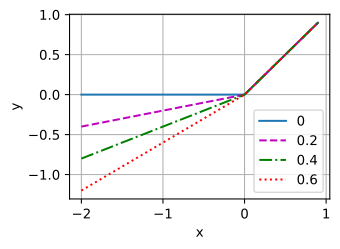
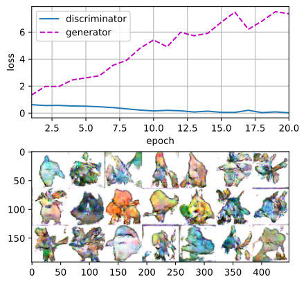

# Mạng sinh đối kháng tích chập sâu
<a id="sec_dcgan"></a>

Trong [sec_basic_gan](#sec_basic_gan), chúng ta đã giới thiệu các ý tưởng cơ bản đằng sau cách GAN hoạt động. Chúng ta đã cho thấy chúng có thể rút mẫu từ một phân phối đơn giản, dễ lấy mẫu, như phân phối đều hoặc chuẩn, rồi biến đổi chúng thành các mẫu có vẻ khớp với phân phối của một bộ dữ liệu nào đó. Và dù ví dụ khớp một phân phối Gaussian 2D đã truyền tải được ý chính, nó không thật sự thú vị.

Trong phần này, chúng ta sẽ minh họa cách dùng GAN để sinh ảnh chân thực. Chúng ta sẽ xây dựng mô hình dựa trên deep convolutional GANs (DCGAN) được giới thiệu trong Radford.Metz.Chintala.2015. Chúng ta sẽ mượn kiến trúc tích chập đã chứng tỏ rất thành công cho các bài toán thị giác máy tính phân biệt và chỉ ra cách thông qua GAN, chúng có thể được tận dụng để sinh ảnh chân thực.

```python
#@tab mxnet
from mxnet import gluon, init, np, npx
from mxnet.gluon import nn
from d2l import mxnet as d2l

npx.set_np()
```


```python
#@tab pytorch
from d2l import torch as d2l
import torch
import torchvision
from torch import nn
import warnings
```




```python
#@tab tensorflow
from d2l import tensorflow as d2l
import tensorflow as tf
```




## Bộ dữ liệu Pokemon

Bộ dữ liệu chúng ta sẽ dùng là một tập các sprite Pokemon lấy từ [pokemondb](https://pokemondb.net/sprites). Trước tiên, tải xuống, giải nén và nạp bộ dữ liệu này.

```python
#@tab mxnet
d2l.DATA_HUB['pokemon'] = (d2l.DATA_URL + 'pokemon.zip',
                           'c065c0e2593b8b161a2d7873e42418bf6a21106c')

data_dir = d2l.download_extract('pokemon')
pokemon = gluon.data.vision.datasets.ImageFolderDataset(data_dir)
```

```python
#@tab pytorch
d2l.DATA_HUB['pokemon'] = (d2l.DATA_URL + 'pokemon.zip',
                           'c065c0e2593b8b161a2d7873e42418bf6a21106c')

data_dir = d2l.download_extract('pokemon')
pokemon = torchvision.datasets.ImageFolder(data_dir)
```

```python
#@tab tensorflow
d2l.DATA_HUB['pokemon'] = (d2l.DATA_URL + 'pokemon.zip',
                           'c065c0e2593b8b161a2d7873e42418bf6a21106c')

data_dir = d2l.download_extract('pokemon')
batch_size = 256
pokemon = tf.keras.preprocessing.image_dataset_from_directory(
    data_dir, batch_size=batch_size, image_size=(64, 64))
```

Chúng ta đổi kích thước mỗi ảnh thành $64\times 64$. Phép biến đổi `ToTensor` sẽ chiếu giá trị pixel vào $[0, 1]$, trong khi bộ sinh sẽ dùng hàm tanh để thu được đầu ra trong $[-1, 1]$. Do đó, chúng ta chuẩn hóa dữ liệu với trung bình $0.5$ và độ lệch chuẩn $0.5$ để khớp miền giá trị.

```python
#@tab mxnet
batch_size = 256
transformer = gluon.data.vision.transforms.Compose([
    gluon.data.vision.transforms.Resize(64),
    gluon.data.vision.transforms.ToTensor(),
    gluon.data.vision.transforms.Normalize(0.5, 0.5)
])
data_iter = gluon.data.DataLoader(
    pokemon.transform_first(transformer), batch_size=batch_size,
    shuffle=True, num_workers=d2l.get_dataloader_workers())
```

```python
#@tab pytorch
batch_size = 256
transformer = torchvision.transforms.Compose([
    torchvision.transforms.Resize((64, 64)),
    torchvision.transforms.ToTensor(),
    torchvision.transforms.Normalize(0.5, 0.5)
])
pokemon.transform = transformer
data_iter = torch.utils.data.DataLoader(
    pokemon, batch_size=batch_size,
    shuffle=True, num_workers=d2l.get_dataloader_workers())
```

```python
#@tab tensorflow
def transform_func(X):
    X = X / 255.
    X = (X - 0.5) / (0.5)
    return X

# For TF>=2.4 use `num_parallel_calls = tf.data.AUTOTUNE`
data_iter = pokemon.map(lambda x, y: (transform_func(x), y),
                        num_parallel_calls=tf.data.experimental.AUTOTUNE)
data_iter = data_iter.cache().shuffle(buffer_size=1000).prefetch(
    buffer_size=tf.data.experimental.AUTOTUNE)
```

Hãy trực quan hóa 20 ảnh đầu tiên.

```python
#@tab mxnet
d2l.set_figsize((4, 4))
for X, y in data_iter:
    imgs = X[:20,:,:,:].transpose(0, 2, 3, 1)/2+0.5
    d2l.show_images(imgs, num_rows=4, num_cols=5)
    break
```

```python
#@tab pytorch
warnings.filterwarnings('ignore')
d2l.set_figsize((4, 4))
for X, y in data_iter:
    imgs = X[:20,:,:,:].permute(0, 2, 3, 1)/2+0.5
    d2l.show_images(imgs, num_rows=4, num_cols=5)
    break
```

```python
#@tab tensorflow
d2l.set_figsize(figsize=(4, 4))
for X, y in data_iter.take(1):
    imgs = X[:20, :, :, :] / 2 + 0.5
    d2l.show_images(imgs, num_rows=4, num_cols=5)
```

## Bộ sinh

Bộ sinh cần ánh xạ biến nhiễu $\mathbf z\in\mathbb R^d$, một vector độ dài $d$, thành một ảnh RGB có chiều rộng và chiều cao là $64\times 64$. Trong [sec_fcn](#sec_fcn), chúng ta đã giới thiệu fully convolutional network dùng tầng tích chập chuyển vị (tham khảo [sec_transposed_conv](#sec_transposed_conv)) để phóng to kích thước đầu vào. Khối cơ bản của bộ sinh chứa một tầng tích chập chuyển vị, theo sau là batch normalization và kích hoạt ReLU.

```python
#@tab mxnet
class G_block(nn.Block):
    def __init__(self, channels, kernel_size=4,
                 strides=2, padding=1, **kwargs):
        super(G_block, self).__init__(**kwargs)
        self.conv2d_trans = nn.Conv2DTranspose(
            channels, kernel_size, strides, padding, use_bias=False)
        self.batch_norm = nn.BatchNorm()
        self.activation = nn.Activation('relu')

    def forward(self, X):
        return self.activation(self.batch_norm(self.conv2d_trans(X)))
```

```python
#@tab pytorch
class G_block(nn.Module):
    def __init__(self, out_channels, in_channels=3, kernel_size=4, strides=2,
                 padding=1, **kwargs):
        super(G_block, self).__init__(**kwargs)
        self.conv2d_trans = nn.ConvTranspose2d(in_channels, out_channels,
                                kernel_size, strides, padding, bias=False)
        self.batch_norm = nn.BatchNorm2d(out_channels)
        self.activation = nn.ReLU()

    def forward(self, X):
        return self.activation(self.batch_norm(self.conv2d_trans(X)))
```

```python
#@tab tensorflow
class G_block(tf.keras.layers.Layer):
    def __init__(self, out_channels, kernel_size=4, strides=2, padding="same",
                 **kwargs):
        super().__init__(**kwargs)
        self.conv2d_trans = tf.keras.layers.Conv2DTranspose(
            out_channels, kernel_size, strides, padding, use_bias=False)
        self.batch_norm = tf.keras.layers.BatchNormalization()
        self.activation = tf.keras.layers.ReLU()

    def call(self, X):
        return self.activation(self.batch_norm(self.conv2d_trans(X)))
```

Theo mặc định, tầng tích chập chuyển vị dùng kernel $k_h = k_w = 4$, stride $s_h = s_w = 2$, và padding $p_h = p_w = 1$. Với hình dạng đầu vào $n_h^{'} \times n_w^{'} = 16 \times 16$, khối bộ sinh sẽ nhân đôi chiều rộng và chiều cao của đầu vào.

$$
\begin{aligned}
n_h^{'} \times n_w^{'} &= [(n_h k_h - (n_h-1)(k_h-s_h)- 2p_h] \times [(n_w k_w - (n_w-1)(k_w-s_w)- 2p_w]\\
  &= [(k_h + s_h (n_h-1)- 2p_h] \times [(k_w + s_w (n_w-1)- 2p_w]\\
  &= [(4 + 2 \times (16-1)- 2 \times 1] \times [(4 + 2 \times (16-1)- 2 \times 1]\\
  &= 32 \times 32 .\\
\end{aligned}
$$

```python
#@tab mxnet
x = np.zeros((2, 3, 16, 16))
g_blk = G_block(20)
g_blk.initialize()
g_blk(x).shape
```

```python
#@tab pytorch
x = torch.zeros((2, 3, 16, 16))
g_blk = G_block(20)
g_blk(x).shape
```

```python
#@tab tensorflow
x = tf.zeros((2, 16, 16, 3))  # Channel last convention
g_blk = G_block(20)
g_blk(x).shape
```

Nếu đổi tầng tích chập chuyển vị thành kernel $4\times 4$, stride $1\times 1$ và không padding. Với kích thước đầu vào $1 \times 1$, đầu ra sẽ có chiều rộng và chiều cao lần lượt tăng thêm 3.

```python
#@tab mxnet
x = np.zeros((2, 3, 1, 1))
g_blk = G_block(20, strides=1, padding=0)
g_blk.initialize()
g_blk(x).shape
```

```python
#@tab pytorch
x = torch.zeros((2, 3, 1, 1))
g_blk = G_block(20, strides=1, padding=0)
g_blk(x).shape
```

```python
#@tab tensorflow
x = tf.zeros((2, 1, 1, 3))
# `padding="valid"` corresponds to no padding
g_blk = G_block(20, strides=1, padding="valid")
g_blk(x).shape
```

Bộ sinh gồm bốn khối cơ bản làm tăng cả chiều rộng và chiều cao của đầu vào từ 1 lên 32. Đồng thời, trước tiên nó chiếu biến tiềm ẩn thành $64\times 8$ kênh, rồi giảm một nửa số kênh sau mỗi lần. Cuối cùng, một tầng tích chập chuyển vị được dùng để sinh đầu ra. Nó tiếp tục nhân đôi chiều rộng và chiều cao để khớp hình dạng mong muốn $64\times 64$, và giảm số kênh xuống $3$. Hàm kích hoạt tanh được áp dụng để chiếu các giá trị đầu ra vào khoảng $(-1, 1)$.

```python
#@tab mxnet
n_G = 64
net_G = nn.Sequential()
net_G.add(G_block(n_G*8, strides=1, padding=0),  # Output: (64 * 8, 4, 4)
          G_block(n_G*4),  # Output: (64 * 4, 8, 8)
          G_block(n_G*2),  # Output: (64 * 2, 16, 16)
          G_block(n_G),    # Output: (64, 32, 32)
          nn.Conv2DTranspose(
              3, kernel_size=4, strides=2, padding=1, use_bias=False,
              activation='tanh'))  # Output: (3, 64, 64)
```

```python
#@tab pytorch
n_G = 64
net_G = nn.Sequential(
    G_block(in_channels=100, out_channels=n_G*8,
            strides=1, padding=0),                  # Output: (64 * 8, 4, 4)
    G_block(in_channels=n_G*8, out_channels=n_G*4), # Output: (64 * 4, 8, 8)
    G_block(in_channels=n_G*4, out_channels=n_G*2), # Output: (64 * 2, 16, 16)
    G_block(in_channels=n_G*2, out_channels=n_G),   # Output: (64, 32, 32)
    nn.ConvTranspose2d(in_channels=n_G, out_channels=3,
                       kernel_size=4, stride=2, padding=1, bias=False),
    nn.Tanh())  # Output: (3, 64, 64)
```

```python
#@tab tensorflow
n_G = 64
net_G = tf.keras.Sequential([
    # Output: (4, 4, 64 * 8)
    G_block(out_channels=n_G*8, strides=1, padding="valid"),
    G_block(out_channels=n_G*4), # Output: (8, 8, 64 * 4)
    G_block(out_channels=n_G*2), # Output: (16, 16, 64 * 2)
    G_block(out_channels=n_G), # Output: (32, 32, 64)
    # Output: (64, 64, 3)
    tf.keras.layers.Conv2DTranspose(
        3, kernel_size=4, strides=2, padding="same", use_bias=False,
        activation="tanh")
])
```

Sinh một biến tiềm ẩn 100 chiều để kiểm tra hình dạng đầu ra của bộ sinh.

```python
#@tab mxnet
x = np.zeros((1, 100, 1, 1))
net_G.initialize()
net_G(x).shape
```

```python
#@tab pytorch
x = torch.zeros((1, 100, 1, 1))
net_G(x).shape
```

```python
#@tab tensorflow
x = tf.zeros((1, 1, 1, 100))
net_G(x).shape
```

## Bộ phân biệt

Bộ phân biệt là một mạng tích chập thông thường, ngoại trừ việc nó dùng leaky ReLU làm hàm kích hoạt. Với $\alpha \in[0, 1]$, định nghĩa của nó là

$$\textrm{leaky ReLU}(x) = \begin{cases}x & \textrm{if}\ x > 0\\ \alpha x &\textrm{otherwise}\end{cases}.$$

Như có thể thấy, nó là ReLU bình thường nếu $\alpha=0$, và là hàm đồng nhất nếu $\alpha=1$. Với $\alpha \in (0, 1)$, leaky ReLU là một hàm phi tuyến cho đầu ra khác không với đầu vào âm. Nó nhằm khắc phục vấn đề "dying ReLU", khi một nơ-ron có thể luôn xuất giá trị âm và do đó không thể tiến triển vì gradient của ReLU bằng 0.

```python
#@tab mxnet,pytorch
alphas = [0, .2, .4, .6, .8, 1]
x = d2l.arange(-2, 1, 0.1)
Y = [d2l.numpy(nn.LeakyReLU(alpha)(x)) for alpha in alphas]
d2l.plot(d2l.numpy(x), Y, 'x', 'y', alphas)
```

```python
#@tab tensorflow
alphas = [0, .2, .4, .6, .8, 1]
x = tf.range(-2, 1, 0.1)
Y = [tf.keras.layers.LeakyReLU(alpha)(x).numpy() for alpha in alphas]
d2l.plot(x.numpy(), Y, 'x', 'y', alphas)
```

Khối cơ bản của bộ phân biệt là một tầng tích chập theo sau bởi một tầng batch normalization và một kích hoạt leaky ReLU. Các siêu tham số của tầng tích chập tương tự tầng tích chập chuyển vị trong khối bộ sinh.

```python
#@tab mxnet
class D_block(nn.Block):
    def __init__(self, channels, kernel_size=4, strides=2,
                 padding=1, alpha=0.2, **kwargs):
        super(D_block, self).__init__(**kwargs)
        self.conv2d = nn.Conv2D(
            channels, kernel_size, strides, padding, use_bias=False)
        self.batch_norm = nn.BatchNorm()
        self.activation = nn.LeakyReLU(alpha)

    def forward(self, X):
        return self.activation(self.batch_norm(self.conv2d(X)))
```

```python
#@tab pytorch
class D_block(nn.Module):
    def __init__(self, out_channels, in_channels=3, kernel_size=4, strides=2,
                padding=1, alpha=0.2, **kwargs):
        super(D_block, self).__init__(**kwargs)
        self.conv2d = nn.Conv2d(in_channels, out_channels, kernel_size,
                                strides, padding, bias=False)
        self.batch_norm = nn.BatchNorm2d(out_channels)
        self.activation = nn.LeakyReLU(alpha, inplace=True)

    def forward(self, X):
        return self.activation(self.batch_norm(self.conv2d(X)))
```

```python
#@tab tensorflow
class D_block(tf.keras.layers.Layer):
    def __init__(self, out_channels, kernel_size=4, strides=2, padding="same",
                 alpha=0.2, **kwargs):
        super().__init__(**kwargs)
        self.conv2d = tf.keras.layers.Conv2D(out_channels, kernel_size,
                                             strides, padding, use_bias=False)
        self.batch_norm = tf.keras.layers.BatchNormalization()
        self.activation = tf.keras.layers.LeakyReLU(alpha)

    def call(self, X):
        return self.activation(self.batch_norm(self.conv2d(X)))
```

Một khối cơ bản với thiết lập mặc định sẽ giảm một nửa chiều rộng và chiều cao của đầu vào, như đã minh họa trong [sec_padding](#sec_padding). Ví dụ, với hình dạng đầu vào $n_h = n_w = 16$, hình dạng kernel $k_h = k_w = 4$, hình dạng stride $s_h = s_w = 2$, và hình dạng padding $p_h = p_w = 1$, hình dạng đầu ra sẽ là:

$$
\begin{aligned}
n_h^{'} \times n_w^{'} &= \lfloor(n_h-k_h+2p_h+s_h)/s_h\rfloor \times \lfloor(n_w-k_w+2p_w+s_w)/s_w\rfloor\\
  &= \lfloor(16-4+2\times 1+2)/2\rfloor \times \lfloor(16-4+2\times 1+2)/2\rfloor\\
  &= 8 \times 8 .\\
\end{aligned}
$$

```python
#@tab mxnet
x = np.zeros((2, 3, 16, 16))
d_blk = D_block(20)
d_blk.initialize()
d_blk(x).shape
```

```python
#@tab pytorch
x = torch.zeros((2, 3, 16, 16))
d_blk = D_block(20)
d_blk(x).shape
```

```python
#@tab tensorflow
x = tf.zeros((2, 16, 16, 3))
d_blk = D_block(20)
d_blk(x).shape
```

Bộ phân biệt là ảnh gương của bộ sinh.

```python
#@tab mxnet
n_D = 64
net_D = nn.Sequential()
net_D.add(D_block(n_D),   # Output: (64, 32, 32)
          D_block(n_D*2),  # Output: (64 * 2, 16, 16)
          D_block(n_D*4),  # Output: (64 * 4, 8, 8)
          D_block(n_D*8),  # Output: (64 * 8, 4, 4)
          nn.Conv2D(1, kernel_size=4, use_bias=False))  # Output: (1, 1, 1)
```

```python
#@tab pytorch
n_D = 64
net_D = nn.Sequential(
    D_block(n_D),  # Output: (64, 32, 32)
    D_block(in_channels=n_D, out_channels=n_D*2),  # Output: (64 * 2, 16, 16)
    D_block(in_channels=n_D*2, out_channels=n_D*4),  # Output: (64 * 4, 8, 8)
    D_block(in_channels=n_D*4, out_channels=n_D*8),  # Output: (64 * 8, 4, 4)
    nn.Conv2d(in_channels=n_D*8, out_channels=1,
              kernel_size=4, bias=False))  # Output: (1, 1, 1)
```

```python
#@tab tensorflow
n_D = 64
net_D = tf.keras.Sequential([
    D_block(n_D), # Output: (32, 32, 64)
    D_block(out_channels=n_D*2), # Output: (16, 16, 64 * 2)
    D_block(out_channels=n_D*4), # Output: (8, 8, 64 * 4)
    D_block(out_channels=n_D*8), # Outupt: (4, 4, 64 * 64)
    # Output: (1, 1, 1)
    tf.keras.layers.Conv2D(1, kernel_size=4, use_bias=False)
])
```

Nó dùng một tầng tích chập với kênh đầu ra $1$ làm tầng cuối để thu được một giá trị dự đoán duy nhất.

```python
#@tab mxnet
x = np.zeros((1, 3, 64, 64))
net_D.initialize()
net_D(x).shape
```

```python
#@tab pytorch
x = torch.zeros((1, 3, 64, 64))
net_D(x).shape
```

```python
#@tab tensorflow
x = tf.zeros((1, 64, 64, 3))
net_D(x).shape
```

## Huấn luyện

So với GAN cơ bản trong [sec_basic_gan](#sec_basic_gan), chúng ta dùng cùng learning rate cho cả bộ sinh và bộ phân biệt vì chúng tương tự nhau. Ngoài ra, chúng ta đổi $\beta_1$ trong Adam ([sec_adam](#sec_adam)) từ $0.9$ thành $0.5$. Điều này làm giảm độ trơn của momentum, tức trung bình trượt trọng số mũ của các gradient quá khứ, để xử lý các gradient thay đổi nhanh vì bộ sinh và bộ phân biệt đối đầu nhau. Bên cạnh đó, nhiễu ngẫu nhiên được sinh `Z` là một tensor 4-D và chúng ta dùng GPU để tăng tốc tính toán.

```python
#@tab mxnet
def train(net_D, net_G, data_iter, num_epochs, lr, latent_dim,
          device=d2l.try_gpu()):
    loss = gluon.loss.SigmoidBCELoss()
    net_D.initialize(init=init.Normal(0.02), force_reinit=True, ctx=device)
    net_G.initialize(init=init.Normal(0.02), force_reinit=True, ctx=device)
    trainer_hp = {'learning_rate': lr, 'beta1': 0.5}
    trainer_D = gluon.Trainer(net_D.collect_params(), 'adam', trainer_hp)
    trainer_G = gluon.Trainer(net_G.collect_params(), 'adam', trainer_hp)
    animator = d2l.Animator(xlabel='epoch', ylabel='loss',
                            xlim=[1, num_epochs], nrows=2, figsize=(5, 5),
                            legend=['discriminator', 'generator'])
    animator.fig.subplots_adjust(hspace=0.3)
    for epoch in range(1, num_epochs + 1):
        # Train one epoch
        timer = d2l.Timer()
        metric = d2l.Accumulator(3)  # loss_D, loss_G, num_examples
        for X, _ in data_iter:
            batch_size = X.shape[0]
            Z = np.random.normal(0, 1, size=(batch_size, latent_dim, 1, 1))
            X, Z = X.as_in_ctx(device), Z.as_in_ctx(device),
            metric.add(d2l.update_D(X, Z, net_D, net_G, loss, trainer_D),
                       d2l.update_G(Z, net_D, net_G, loss, trainer_G),
                       batch_size)
        # Show generated examples
        Z = np.random.normal(0, 1, size=(21, latent_dim, 1, 1), ctx=device)
        # Normalize the synthetic data to N(0, 1)
        fake_x = net_G(Z).transpose(0, 2, 3, 1) / 2 + 0.5
        imgs = np.concatenate(
            [np.concatenate([fake_x[i * 7 + j] for j in range(7)], axis=1)
             for i in range(len(fake_x)//7)], axis=0)
        animator.axes[1].cla()
        animator.axes[1].imshow(imgs.asnumpy())
        # Show the losses
        loss_D, loss_G = metric[0] / metric[2], metric[1] / metric[2]
        animator.add(epoch, (loss_D, loss_G))
    print(f'loss_D {loss_D:.3f}, loss_G {loss_G:.3f}, '
          f'{metric[2] / timer.stop():.1f} examples/sec on {str(device)}')
```

```python
#@tab pytorch
def train(net_D, net_G, data_iter, num_epochs, lr, latent_dim,
          device=d2l.try_gpu()):
    loss = nn.BCEWithLogitsLoss(reduction='sum')
    for w in net_D.parameters():
        nn.init.normal_(w, 0, 0.02)
    for w in net_G.parameters():
        nn.init.normal_(w, 0, 0.02)
    net_D, net_G = net_D.to(device), net_G.to(device)
    trainer_hp = {'lr': lr, 'betas': [0.5,0.999]}
    trainer_D = torch.optim.Adam(net_D.parameters(), **trainer_hp)
    trainer_G = torch.optim.Adam(net_G.parameters(), **trainer_hp)
    animator = d2l.Animator(xlabel='epoch', ylabel='loss',
                            xlim=[1, num_epochs], nrows=2, figsize=(5, 5),
                            legend=['discriminator', 'generator'])
    animator.fig.subplots_adjust(hspace=0.3)
    for epoch in range(1, num_epochs + 1):
        # Train one epoch
        timer = d2l.Timer()
        metric = d2l.Accumulator(3)  # loss_D, loss_G, num_examples
        for X, _ in data_iter:
            batch_size = X.shape[0]
            Z = torch.normal(0, 1, size=(batch_size, latent_dim, 1, 1))
            X, Z = X.to(device), Z.to(device)
            metric.add(d2l.update_D(X, Z, net_D, net_G, loss, trainer_D),
                       d2l.update_G(Z, net_D, net_G, loss, trainer_G),
                       batch_size)
        # Show generated examples
        Z = torch.normal(0, 1, size=(21, latent_dim, 1, 1), device=device)
        # Normalize the synthetic data to N(0, 1)
        fake_x = net_G(Z).permute(0, 2, 3, 1) / 2 + 0.5
        imgs = torch.cat(
            [torch.cat([
                fake_x[i * 7 + j].cpu().detach() for j in range(7)], dim=1)
             for i in range(len(fake_x)//7)], dim=0)
        animator.axes[1].cla()
        animator.axes[1].imshow(imgs)
        # Show the losses
        loss_D, loss_G = metric[0] / metric[2], metric[1] / metric[2]
        animator.add(epoch, (loss_D, loss_G))
    print(f'loss_D {loss_D:.3f}, loss_G {loss_G:.3f}, '
          f'{metric[2] / timer.stop():.1f} examples/sec on {str(device)}')
```

```python
#@tab tensorflow
def train(net_D, net_G, data_iter, num_epochs, lr, latent_dim,
          device=d2l.try_gpu()):
    loss = tf.keras.losses.BinaryCrossentropy(
        from_logits=True, reduction=tf.keras.losses.Reduction.SUM)

    for w in net_D.trainable_variables:
        w.assign(tf.random.normal(mean=0, stddev=0.02, shape=w.shape))
    for w in net_G.trainable_variables:
        w.assign(tf.random.normal(mean=0, stddev=0.02, shape=w.shape))

    optimizer_hp = {"lr": lr, "beta_1": 0.5, "beta_2": 0.999}
    optimizer_D = tf.keras.optimizers.Adam(**optimizer_hp)
    optimizer_G = tf.keras.optimizers.Adam(**optimizer_hp)

    animator = d2l.Animator(xlabel='epoch', ylabel='loss',
                            xlim=[1, num_epochs], nrows=2, figsize=(5, 5),
                            legend=['discriminator', 'generator'])
    animator.fig.subplots_adjust(hspace=0.3)

    for epoch in range(1, num_epochs + 1):
        # Train one epoch
        timer = d2l.Timer()
        metric = d2l.Accumulator(3) # loss_D, loss_G, num_examples
        for X, _ in data_iter:
            batch_size = X.shape[0]
            Z = tf.random.normal(mean=0, stddev=1,
                                 shape=(batch_size, 1, 1, latent_dim))
            metric.add(d2l.update_D(X, Z, net_D, net_G, loss, optimizer_D),
                       d2l.update_G(Z, net_D, net_G, loss, optimizer_G),
                       batch_size)

        # Show generated examples
        Z = tf.random.normal(mean=0, stddev=1, shape=(21, 1, 1, latent_dim))
        # Normalize the synthetic data to N(0, 1)
        fake_x = net_G(Z) / 2 + 0.5
        imgs = tf.concat([tf.concat([fake_x[i * 7 + j] for j in range(7)],
                                    axis=1)
                          for i in range(len(fake_x) // 7)], axis=0)
        animator.axes[1].cla()
        animator.axes[1].imshow(imgs)
        # Show the losses
        loss_D, loss_G = metric[0] / metric[2], metric[1] / metric[2]
        animator.add(epoch, (loss_D, loss_G))
    print(f'loss_D {loss_D:.3f}, loss_G {loss_G:.3f}, '
          f'{metric[2] / timer.stop():.1f} examples/sec on {str(device._device_name)}')
```

Chúng ta huấn luyện mô hình với số epoch nhỏ chỉ để minh họa.
Để có hiệu năng tốt hơn,
biến `num_epochs` có thể được đặt thành một số lớn hơn.

```python
#@tab mxnet, pytorch
latent_dim, lr, num_epochs = 100, 0.005, 20
train(net_D, net_G, data_iter, num_epochs, lr, latent_dim)
```

```python
#@tab tensorflow
latent_dim, lr, num_epochs = 100, 0.0005, 40
train(net_D, net_G, data_iter, num_epochs, lr, latent_dim)
```

## Tóm tắt

* Kiến trúc DCGAN có bốn tầng tích chập cho bộ phân biệt và bốn tầng tích chập "fractionally-strided" cho bộ sinh.
* Bộ phân biệt là một mạng gồm 4 tầng tích chập có stride với batch normalization (trừ tầng đầu vào) và kích hoạt leaky ReLU.
* Leaky ReLU là một hàm phi tuyến cho đầu ra khác không với đầu vào âm. Nó nhằm khắc phục vấn đề “dying ReLU” và giúp gradient chảy qua kiến trúc dễ hơn.


## Bài tập

1. Điều gì sẽ xảy ra nếu chúng ta dùng kích hoạt ReLU chuẩn thay vì leaky ReLU?
1. Áp dụng DCGAN trên Fashion-MNIST và xem hạng mục nào hoạt động tốt, hạng mục nào không.


[Thảo luận](https://discuss.d2l.ai/t/1083)
