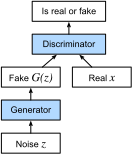

# Mạng sinh đối kháng
<a id="sec_basic_gan"></a>

Trong phần lớn cuốn sách này, chúng ta đã nói về cách đưa ra dự đoán. Dưới dạng này hay dạng khác, chúng ta dùng mạng nơ-ron sâu để học ánh xạ từ các ví dụ dữ liệu đến nhãn. Kiểu học này được gọi là học phân biệt, theo nghĩa là ta muốn có khả năng phân biệt giữa ảnh mèo và ảnh chó. Bộ phân loại và bộ hồi quy đều là ví dụ của học phân biệt. Và mạng nơ-ron được huấn luyện bằng lan truyền ngược đã đảo lộn mọi điều chúng ta từng nghĩ mình biết về học phân biệt trên các bộ dữ liệu lớn và phức tạp. Độ chính xác phân loại trên ảnh độ phân giải cao đã đi từ vô dụng đến ngang mức con người (với một số lưu ý) chỉ trong 5-6 năm. Chúng tôi sẽ không lặp lại một bài diễn thuyết nữa về tất cả các tác vụ phân biệt khác mà mạng nơ-ron sâu làm tốt một cách đáng kinh ngạc.

Nhưng học máy không chỉ là giải các tác vụ phân biệt. Ví dụ, với một bộ dữ liệu lớn không có nhãn, chúng ta có thể muốn học một mô hình nắm bắt gọn các đặc trưng của dữ liệu này. Với một mô hình như vậy, ta có thể lấy mẫu các ví dụ dữ liệu tổng hợp giống phân phối của dữ liệu huấn luyện. Chẳng hạn, với một kho ảnh khuôn mặt lớn, ta có thể muốn sinh một ảnh mới chân thực trông như có thể đã đến từ cùng bộ dữ liệu. Kiểu học này được gọi là mô hình hóa sinh.

Cho đến gần đây, chúng ta chưa có phương pháp nào có thể tổng hợp các ảnh mới chân thực. Nhưng thành công của mạng nơ-ron sâu trong học phân biệt đã mở ra các khả năng mới. Một xu hướng lớn trong ba năm gần đây là áp dụng các mạng sâu phân biệt để vượt qua thách thức trong những bài toán mà ta thường không nghĩ là bài toán học có giám sát. Các mô hình ngôn ngữ mạng nơ-ron hồi tiếp là một ví dụ về việc dùng một mạng phân biệt (được huấn luyện để dự đoán ký tự kế tiếp) mà sau khi huấn luyện có thể hoạt động như một mô hình sinh.

Năm 2014, một bài báo đột phá đã giới thiệu Generative adversarial networks (GANs) [Goodfellow.Pouget-Abadie.Mirza.ea.2014], một cách mới thông minh để tận dụng sức mạnh của các mô hình phân biệt nhằm thu được các mô hình sinh tốt. Cốt lõi của GAN dựa trên ý tưởng rằng một bộ sinh dữ liệu là tốt nếu chúng ta không thể phân biệt dữ liệu giả với dữ liệu thật. Trong thống kê, điều này được gọi là kiểm định hai mẫu, một kiểm định để trả lời câu hỏi liệu các bộ dữ liệu $X=\{x_1,\ldots, x_n\}$ và $X'=\{x'_1,\ldots, x'_n\}$ có được rút từ cùng một phân phối hay không. Khác biệt chính giữa hầu hết các bài báo thống kê và GAN là GAN dùng ý tưởng này theo cách kiến tạo. Nói cách khác, thay vì chỉ huấn luyện một mô hình để nói "này, hai bộ dữ liệu này trông không giống như đến từ cùng một phân phối", chúng dùng [kiểm định hai mẫu](https://en.wikipedia.org/wiki/Two-sample_hypothesis_testing) để cung cấp tín hiệu huấn luyện cho một mô hình sinh. Điều này cho phép chúng ta cải thiện bộ sinh dữ liệu cho đến khi nó sinh ra thứ gì đó giống dữ liệu thật. Ít nhất, nó cần đánh lừa được bộ phân loại ngay cả khi bộ phân loại của chúng ta là một mạng nơ-ron sâu tiên tiến.


<a id="fig_gan"></a>


Kiến trúc GAN được minh họa trong [fig_gan](#fig_gan).
Như bạn có thể thấy, có hai phần trong kiến trúc GAN: trước hết, chúng ta cần một thiết bị (chẳng hạn một mạng sâu, nhưng thật ra có thể là bất cứ thứ gì, ví dụ một engine dựng hình trò chơi) có khả năng tiềm tàng sinh dữ liệu trông giống dữ liệu thật. Nếu đang xử lý ảnh, nó cần sinh ảnh. Nếu đang xử lý tiếng nói, nó cần sinh chuỗi âm thanh, v.v. Chúng ta gọi đây là mạng sinh. Thành phần thứ hai là mạng phân biệt. Nó cố gắng phân biệt dữ liệu giả và dữ liệu thật. Hai mạng cạnh tranh với nhau. Mạng sinh cố gắng đánh lừa mạng phân biệt. Khi đó, mạng phân biệt thích nghi với dữ liệu giả mới. Thông tin này đến lượt nó được dùng để cải thiện mạng sinh, và cứ tiếp tục như vậy.


Bộ phân biệt là một bộ phân loại nhị phân để phân biệt đầu vào $x$ là thật (từ dữ liệu thật) hay giả (từ bộ sinh). Thông thường, bộ phân biệt xuất một dự đoán vô hướng $o\in\mathbb R$ cho đầu vào $\mathbf x$, chẳng hạn dùng một tầng kết nối đầy đủ với kích thước ẩn 1, rồi áp dụng hàm sigmoid để thu được xác suất dự đoán $D(\mathbf x) = 1/(1+e^{-o})$. Giả sử nhãn $y$ cho dữ liệu thật là $1$ và cho dữ liệu giả là $0$. Chúng ta huấn luyện bộ phân biệt để tối thiểu hóa cross-entropy loss, *tức là*,

$$ \min_D \{ - y \log D(\mathbf x) - (1-y)\log(1-D(\mathbf x)) \},$$

Với bộ sinh, trước tiên nó rút một tham số $\mathbf z\in\mathbb R^d$ từ một nguồn ngẫu nhiên, *ví dụ*, một phân phối chuẩn $\mathbf z \sim \mathcal{N} (0, 1)$. Chúng ta thường gọi $\mathbf z$ là biến tiềm ẩn.
Sau đó nó áp dụng một hàm để sinh $\mathbf x'=G(\mathbf z)$. Mục tiêu của bộ sinh là đánh lừa bộ phân biệt để phân loại $\mathbf x'=G(\mathbf z)$ là dữ liệu thật, *tức là* ta muốn $D( G(\mathbf z)) \approx 1$.
Nói cách khác, với một bộ phân biệt $D$ cho trước, chúng ta cập nhật tham số của bộ sinh $G$ để tối đa hóa cross-entropy loss khi $y=0$, *tức là*,

$$ \max_G \{ - (1-y) \log(1-D(G(\mathbf z))) \} = \max_G \{ - \log(1-D(G(\mathbf z))) \}.$$

Nếu bộ sinh làm hoàn hảo, thì $D(\mathbf x')\approx 1$, nên loss trên gần 0, dẫn đến các gradient quá nhỏ để bộ phân biệt tiến triển tốt. Vì vậy thông thường, chúng ta tối thiểu hóa loss sau:

$$ \min_G \{ - y \log(D(G(\mathbf z))) \} = \min_G \{ - \log(D(G(\mathbf z))) \}, $$

tức là chỉ đưa $\mathbf x'=G(\mathbf z)$ vào bộ phân biệt nhưng gán nhãn $y=1$.


Tóm lại, $D$ và $G$ đang chơi một trò chơi "minimax" với hàm mục tiêu tổng hợp:

$$\min_D \max_G \{ -E_{x \sim \textrm{Data}} \log D(\mathbf x) - E_{z \sim \textrm{Noise}} \log(1 - D(G(\mathbf z))) \}.$$


Nhiều ứng dụng GAN nằm trong bối cảnh ảnh. Với mục đích minh họa, trước tiên chúng ta sẽ hài lòng với việc khớp một phân phối đơn giản hơn nhiều. Chúng ta sẽ minh họa điều xảy ra nếu dùng GAN để xây dựng bộ ước lượng tham số kém hiệu quả nhất thế giới cho một Gaussian. Hãy bắt đầu.

```python
#@tab mxnet
%matplotlib inline
from d2l import mxnet as d2l
from mxnet import autograd, gluon, init, np, npx
from mxnet.gluon import nn
npx.set_np()
```

```python
#@tab pytorch
%matplotlib inline
from d2l import torch as d2l
import torch
from torch import nn
```

```python
#@tab tensorflow
from d2l import tensorflow as d2l
import tensorflow as tf
```

## Sinh một số dữ liệu "thật"

Vì đây sẽ là ví dụ tẻ nhạt nhất thế giới, chúng ta chỉ đơn giản sinh dữ liệu được rút từ một Gaussian.

```python
#@tab mxnet, pytorch
X = d2l.normal(0.0, 1, (1000, 2))
A = d2l.tensor([[1, 2], [-0.1, 0.5]])
b = d2l.tensor([1, 2])
data = d2l.matmul(X, A) + b
```

```python
#@tab tensorflow
X = d2l.normal((1000, 2), 0.0, 1)
A = d2l.tensor([[1, 2], [-0.1, 0.5]])
b = d2l.tensor([1, 2], tf.float32)
data = d2l.matmul(X, A) + b
```

Hãy xem chúng ta nhận được gì. Đây nên là một Gaussian được dịch chuyển theo cách khá tùy ý với trung bình $b$ và ma trận hiệp phương sai $A^TA$.

```python
#@tab mxnet, pytorch
d2l.set_figsize()
d2l.plt.scatter(d2l.numpy(data[:100, 0]), d2l.numpy(data[:100, 1]));
print(f'The covariance matrix is\n{d2l.matmul(A.T, A)}')
```

```python
#@tab tensorflow
d2l.set_figsize()
d2l.plt.scatter(d2l.numpy(data[:100, 0]), d2l.numpy(data[:100, 1]));
print(f'The covariance matrix is\n{tf.matmul(A, A, transpose_a=True)}')
```

```python
#@tab all
batch_size = 8
data_iter = d2l.load_array((data,), batch_size)
```

## Bộ sinh

Mạng sinh của chúng ta sẽ là mạng đơn giản nhất có thể: một mô hình tuyến tính một tầng. Lý do là chúng ta sẽ điều khiển mạng tuyến tính đó bằng một bộ sinh dữ liệu Gaussian. Vì vậy, về nghĩa đen, nó chỉ cần học các tham số để giả mạo dữ liệu một cách hoàn hảo.

```python
#@tab mxnet
net_G = nn.Sequential()
net_G.add(nn.Dense(2))
```

```python
#@tab pytorch
net_G = nn.Sequential(nn.Linear(2, 2))
```

```python
#@tab tensorflow
net_G = tf.keras.layers.Dense(2)
```

## Bộ phân biệt

Với bộ phân biệt, chúng ta sẽ cầu kỳ hơn một chút: chúng ta sẽ dùng một MLP với 3 tầng để làm mọi thứ thú vị hơn.

```python
#@tab mxnet
net_D = nn.Sequential()
net_D.add(nn.Dense(5, activation='tanh'),
          nn.Dense(3, activation='tanh'),
          nn.Dense(1))
```

```python
#@tab pytorch
net_D = nn.Sequential(
    nn.Linear(2, 5), nn.Tanh(),
    nn.Linear(5, 3), nn.Tanh(),
    nn.Linear(3, 1))
```

```python
#@tab tensorflow
net_D = tf.keras.models.Sequential([
    tf.keras.layers.Dense(5, activation="tanh", input_shape=(2,)),
    tf.keras.layers.Dense(3, activation="tanh"),
    tf.keras.layers.Dense(1)
])
```

## Huấn luyện

Trước tiên, chúng ta định nghĩa một hàm để cập nhật bộ phân biệt.

```python
#@tab mxnet
def update_D(X, Z, net_D, net_G, loss, trainer_D):
    """Update discriminator."""
    batch_size = X.shape[0]
    ones = np.ones((batch_size,), ctx=X.ctx)
    zeros = np.zeros((batch_size,), ctx=X.ctx)
    with autograd.record():
        real_Y = net_D(X)
        fake_X = net_G(Z)
        # Do not need to compute gradient for `net_G`, detach it from
        # computing gradients.
        fake_Y = net_D(fake_X.detach())
        loss_D = (loss(real_Y, ones) + loss(fake_Y, zeros)) / 2
    loss_D.backward()
    trainer_D.step(batch_size)
    return float(loss_D.sum())
```

```python
#@tab pytorch
def update_D(X, Z, net_D, net_G, loss, trainer_D):
    """Update discriminator."""
    batch_size = X.shape[0]
    ones = torch.ones((batch_size,), device=X.device)
    zeros = torch.zeros((batch_size,), device=X.device)
    trainer_D.zero_grad()
    real_Y = net_D(X)
    fake_X = net_G(Z)
    # Do not need to compute gradient for `net_G`, detach it from
    # computing gradients.
    fake_Y = net_D(fake_X.detach())
    loss_D = (loss(real_Y, ones.reshape(real_Y.shape)) +
              loss(fake_Y, zeros.reshape(fake_Y.shape))) / 2
    loss_D.backward()
    trainer_D.step()
    return loss_D
```

```python
#@tab tensorflow
def update_D(X, Z, net_D, net_G, loss, optimizer_D):
    """Update discriminator."""
    batch_size = X.shape[0]
    ones = tf.ones((batch_size,)) # Labels corresponding to real data
    zeros = tf.zeros((batch_size,)) # Labels corresponding to fake data
    # Do not need to compute gradient for `net_G`, so it is outside GradientTape
    fake_X = net_G(Z)
    with tf.GradientTape() as tape:
        real_Y = net_D(X)
        fake_Y = net_D(fake_X)
        # We multiply the loss by batch_size to match PyTorch's BCEWithLogitsLoss
        loss_D = (loss(ones, tf.squeeze(real_Y)) + loss(
            zeros, tf.squeeze(fake_Y))) * batch_size / 2
    grads_D = tape.gradient(loss_D, net_D.trainable_variables)
    optimizer_D.apply_gradients(zip(grads_D, net_D.trainable_variables))
    return loss_D
```

Bộ sinh được cập nhật tương tự. Ở đây chúng ta tái sử dụng cross-entropy loss nhưng đổi nhãn của dữ liệu giả từ $0$ thành $1$.

```python
#@tab mxnet
def update_G(Z, net_D, net_G, loss, trainer_G):
    """Update generator."""
    batch_size = Z.shape[0]
    ones = np.ones((batch_size,), ctx=Z.ctx)
    with autograd.record():
        # We could reuse `fake_X` from `update_D` to save computation
        fake_X = net_G(Z)
        # Recomputing `fake_Y` is needed since `net_D` is changed
        fake_Y = net_D(fake_X)
        loss_G = loss(fake_Y, ones)
    loss_G.backward()
    trainer_G.step(batch_size)
    return float(loss_G.sum())
```

```python
#@tab pytorch
def update_G(Z, net_D, net_G, loss, trainer_G):
    """Update generator."""
    batch_size = Z.shape[0]
    ones = torch.ones((batch_size,), device=Z.device)
    trainer_G.zero_grad()
    # We could reuse `fake_X` from `update_D` to save computation
    fake_X = net_G(Z)
    # Recomputing `fake_Y` is needed since `net_D` is changed
    fake_Y = net_D(fake_X)
    loss_G = loss(fake_Y, ones.reshape(fake_Y.shape))
    loss_G.backward()
    trainer_G.step()
    return loss_G
```

```python
#@tab tensorflow
def update_G(Z, net_D, net_G, loss, optimizer_G):
    """Update generator."""
    batch_size = Z.shape[0]
    ones = tf.ones((batch_size,))
    with tf.GradientTape() as tape:
        # We could reuse `fake_X` from `update_D` to save computation
        fake_X = net_G(Z)
        # Recomputing `fake_Y` is needed since `net_D` is changed
        fake_Y = net_D(fake_X)
        # We multiply the loss by batch_size to match PyTorch's BCEWithLogits loss
        loss_G = loss(ones, tf.squeeze(fake_Y)) * batch_size
    grads_G = tape.gradient(loss_G, net_G.trainable_variables)
    optimizer_G.apply_gradients(zip(grads_G, net_G.trainable_variables))
    return loss_G
```

Cả bộ phân biệt và bộ sinh đều thực hiện hồi quy logistic nhị phân với cross-entropy loss. Chúng ta dùng Adam để làm trơn quá trình huấn luyện. Trong mỗi lần lặp, trước tiên chúng ta cập nhật bộ phân biệt rồi đến bộ sinh. Chúng ta trực quan hóa cả hai loss và các ví dụ được sinh.

```python
#@tab mxnet
def train(net_D, net_G, data_iter, num_epochs, lr_D, lr_G, latent_dim, data):
    loss = gluon.loss.SigmoidBCELoss()
    net_D.initialize(init=init.Normal(0.02), force_reinit=True)
    net_G.initialize(init=init.Normal(0.02), force_reinit=True)
    trainer_D = gluon.Trainer(net_D.collect_params(),
                              'adam', {'learning_rate': lr_D})
    trainer_G = gluon.Trainer(net_G.collect_params(),
                              'adam', {'learning_rate': lr_G})
    animator = d2l.Animator(xlabel='epoch', ylabel='loss',
                            xlim=[1, num_epochs], nrows=2, figsize=(5, 5),
                            legend=['discriminator', 'generator'])
    animator.fig.subplots_adjust(hspace=0.3)
    for epoch in range(num_epochs):
        # Train one epoch
        timer = d2l.Timer()
        metric = d2l.Accumulator(3)  # loss_D, loss_G, num_examples
        for X in data_iter:
            batch_size = X.shape[0]
            Z = np.random.normal(0, 1, size=(batch_size, latent_dim))
            metric.add(update_D(X, Z, net_D, net_G, loss, trainer_D),
                       update_G(Z, net_D, net_G, loss, trainer_G),
                       batch_size)
        # Visualize generated examples
        Z = np.random.normal(0, 1, size=(100, latent_dim))
        fake_X = net_G(Z).asnumpy()
        animator.axes[1].cla()
        animator.axes[1].scatter(data[:, 0], data[:, 1])
        animator.axes[1].scatter(fake_X[:, 0], fake_X[:, 1])
        animator.axes[1].legend(['real', 'generated'])
        # Show the losses
        loss_D, loss_G = metric[0]/metric[2], metric[1]/metric[2]
        animator.add(epoch + 1, (loss_D, loss_G))
    print(f'loss_D {loss_D:.3f}, loss_G {loss_G:.3f}, '
          f'{metric[2] / timer.stop():.1f} examples/sec')
```

```python
#@tab pytorch
def train(net_D, net_G, data_iter, num_epochs, lr_D, lr_G, latent_dim, data):
    loss = nn.BCEWithLogitsLoss(reduction='sum')
    for w in net_D.parameters():
        nn.init.normal_(w, 0, 0.02)
    for w in net_G.parameters():
        nn.init.normal_(w, 0, 0.02)
    trainer_D = torch.optim.Adam(net_D.parameters(), lr=lr_D)
    trainer_G = torch.optim.Adam(net_G.parameters(), lr=lr_G)
    animator = d2l.Animator(xlabel='epoch', ylabel='loss',
                            xlim=[1, num_epochs], nrows=2, figsize=(5, 5),
                            legend=['discriminator', 'generator'])
    animator.fig.subplots_adjust(hspace=0.3)
    for epoch in range(num_epochs):
        # Train one epoch
        timer = d2l.Timer()
        metric = d2l.Accumulator(3)  # loss_D, loss_G, num_examples
        for (X,) in data_iter:
            batch_size = X.shape[0]
            Z = torch.normal(0, 1, size=(batch_size, latent_dim))
            metric.add(update_D(X, Z, net_D, net_G, loss, trainer_D),
                       update_G(Z, net_D, net_G, loss, trainer_G),
                       batch_size)
        # Visualize generated examples
        Z = torch.normal(0, 1, size=(100, latent_dim))
        fake_X = net_G(Z).detach().numpy()
        animator.axes[1].cla()
        animator.axes[1].scatter(data[:, 0], data[:, 1])
        animator.axes[1].scatter(fake_X[:, 0], fake_X[:, 1])
        animator.axes[1].legend(['real', 'generated'])
        # Show the losses
        loss_D, loss_G = metric[0]/metric[2], metric[1]/metric[2]
        animator.add(epoch + 1, (loss_D, loss_G))
    print(f'loss_D {loss_D:.3f}, loss_G {loss_G:.3f}, '
          f'{metric[2] / timer.stop():.1f} examples/sec')
```

```python
#@tab tensorflow
def train(net_D, net_G, data_iter, num_epochs, lr_D, lr_G, latent_dim, data):
    loss = tf.keras.losses.BinaryCrossentropy(
        from_logits=True, reduction=tf.keras.losses.Reduction.SUM)
    for w in net_D.trainable_variables:
        w.assign(tf.random.normal(mean=0, stddev=0.02, shape=w.shape))
    for w in net_G.trainable_variables:
        w.assign(tf.random.normal(mean=0, stddev=0.02, shape=w.shape))
    optimizer_D = tf.keras.optimizers.Adam(learning_rate=lr_D)
    optimizer_G = tf.keras.optimizers.Adam(learning_rate=lr_G)
    animator = d2l.Animator(
        xlabel="epoch", ylabel="loss", xlim=[1, num_epochs], nrows=2,
        figsize=(5, 5), legend=["discriminator", "generator"])
    animator.fig.subplots_adjust(hspace=0.3)
    for epoch in range(num_epochs):
        # Train one epoch
        timer = d2l.Timer()
        metric = d2l.Accumulator(3)  # loss_D, loss_G, num_examples
        for (X,) in data_iter:
            batch_size = X.shape[0]
            Z = tf.random.normal(
                mean=0, stddev=1, shape=(batch_size, latent_dim))
            metric.add(update_D(X, Z, net_D, net_G, loss, optimizer_D),
                       update_G(Z, net_D, net_G, loss, optimizer_G),
                       batch_size)
        # Visualize generated examples
        Z = tf.random.normal(mean=0, stddev=1, shape=(100, latent_dim))
        fake_X = net_G(Z)
        animator.axes[1].cla()
        animator.axes[1].scatter(data[:, 0], data[:, 1])
        animator.axes[1].scatter(fake_X[:, 0], fake_X[:, 1])
        animator.axes[1].legend(["real", "generated"])

        # Show the losses
        loss_D, loss_G = metric[0] / metric[2], metric[1] / metric[2]
        animator.add(epoch + 1, (loss_D, loss_G))

    print(f'loss_D {loss_D:.3f}, loss_G {loss_G:.3f}, '
          f'{metric[2] / timer.stop():.1f} examples/sec')
```

Bây giờ chúng ta chỉ định các siêu tham số để khớp phân phối Gaussian.

```python
#@tab all
lr_D, lr_G, latent_dim, num_epochs = 0.05, 0.005, 2, 20
train(net_D, net_G, data_iter, num_epochs, lr_D, lr_G,
      latent_dim, d2l.numpy(data[:100]))
```

## Tóm tắt

* Generative adversarial networks (GANs) gồm hai mạng sâu, bộ sinh và bộ phân biệt.
* Bộ sinh tạo ảnh càng gần ảnh thật càng tốt để đánh lừa bộ phân biệt, thông qua việc tối đa hóa cross-entropy loss, *tức là* $\max \log(D(\mathbf{x'}))$.
* Bộ phân biệt cố gắng phân biệt ảnh được sinh với ảnh thật, thông qua việc tối thiểu hóa cross-entropy loss, *tức là* $\min - y \log D(\mathbf{x}) - (1-y)\log(1-D(\mathbf{x}))$.

## Bài tập

* Có tồn tại một cân bằng trong đó bộ sinh thắng, *tức là* bộ phân biệt cuối cùng không thể phân biệt hai phân phối trên các mẫu hữu hạn không?


[Thảo luận](https://discuss.d2l.ai/t/1082)
