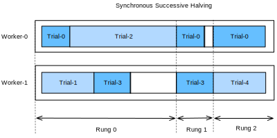
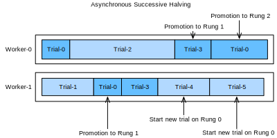

# Successive Halving bất đồng bộ

<a id="sec_sh_async"></a>

Như đã thấy trong [sec_rs_async](#sec_rs_async), chúng ta có thể tăng tốc HPO bằng cách
phân tán việc đánh giá các cấu hình siêu tham số trên nhiều instance
hoặc nhiều CPU / GPU trên một instance. Tuy nhiên,
so với random search, việc chạy successive halving (SH) bất đồng bộ
trong một thiết lập phân tán không đơn giản. Trước khi có thể
quyết định cấu hình nào chạy tiếp theo, trước tiên chúng ta phải thu thập tất cả
quan sát tại mức rung hiện tại. Điều này yêu cầu
đồng bộ hóa các worker tại mỗi mức rung. Ví dụ, với mức rung thấp nhất
$r_{\mathrm{min}}$, trước tiên chúng ta phải đánh giá tất cả $N = \eta^K$ cấu hình, trước khi
có thể promote $\frac{1}{\eta}$ trong số đó lên mức rung tiếp theo.

Trong bất kỳ hệ phân tán nào, đồng bộ hóa thường hàm ý thời gian nhàn rỗi của worker.
Thứ nhất, chúng ta thường quan sát biến thiên lớn về thời gian huấn luyện giữa các cấu hình
siêu tham số. Ví dụ, giả sử số bộ lọc trên mỗi tầng là một
siêu tham số, thì các mạng có ít bộ lọc hơn sẽ huấn luyện xong nhanh hơn
các mạng có nhiều bộ lọc hơn, kéo theo thời gian worker nhàn rỗi do straggler.
Hơn nữa, số slot trong một mức rung không phải lúc nào cũng là bội số của số
worker, trong trường hợp đó một số worker thậm chí có thể ngồi nhàn rỗi cả một batch.

Hình [synchronous_sh](#synchronous_sh) cho thấy lịch của SH đồng bộ với $\eta=2$
cho bốn trial khác nhau với hai worker. Chúng ta bắt đầu bằng cách đánh giá Trial-0 và
Trial-1 trong một epoch và ngay lập tức tiếp tục với hai trial tiếp theo khi chúng
kết thúc. Trước tiên chúng ta phải chờ đến khi Trial-2 kết thúc, mất
nhiều thời gian hơn đáng kể so với các trial khác, trước khi có thể promote hai
trial tốt nhất, tức Trial-0 và Trial-3, lên mức rung tiếp theo. Điều này gây thời gian nhàn rỗi cho
Worker-1. Sau đó, chúng ta tiếp tục với Rung 1. Ở đây Trial-3 cũng mất nhiều thời gian hơn Trial-0,
dẫn đến thêm thời gian nhàn rỗi của Worker-0. Khi đạt Rung-2, chỉ còn
trial tốt nhất, Trial-0, chiếm đúng một worker. Để tránh
Worker-1 nhàn rỗi trong thời gian đó, hầu hết các triển khai SH đã tiếp tục
với vòng tiếp theo và bắt đầu đánh giá các trial mới (ví dụ Trial-4) trên rung đầu tiên.


<a id="synchronous_sh"></a>

Asynchronous successive halving (ASHA) [li-arxiv18] điều chỉnh SH cho kịch bản song song
bất đồng bộ. Ý tưởng chính của ASHA là promote cấu hình lên mức rung tiếp theo
ngay khi chúng ta thu thập được ít nhất $\eta$ quan sát trên mức rung hiện tại.
Quy tắc quyết định này có thể dẫn đến các promotion dưới mức tối ưu: cấu hình có thể được promote lên
mức rung tiếp theo, nhưng nhìn lại thì không so sánh thuận lợi với hầu hết cấu hình khác
ở cùng mức rung. Mặt khác, bằng cách này chúng ta loại bỏ tất cả các điểm đồng bộ hóa.
Trong thực tế, các promotion ban đầu dưới mức tối ưu như vậy chỉ có tác động khiêm tốn đến
hiệu năng, không chỉ vì thứ hạng các cấu hình siêu tham số thường
khá nhất quán giữa các mức rung, mà còn vì các rung lớn dần theo thời gian và
ngày càng phản ánh tốt hơn phân phối các giá trị metric ở mức đó. Nếu một
worker rảnh nhưng không có cấu hình nào có thể được promote, chúng ta bắt đầu một cấu hình mới
với $r = r_{\mathrm{min}}$, tức mức rung đầu tiên.

[asha](#asha) cho thấy lịch của cùng các cấu hình với ASHA. Khi Trial-1
kết thúc, chúng ta thu thập kết quả của hai trial (tức Trial-0 và Trial-1) và
ngay lập tức promote trial tốt hơn trong số đó (Trial-0) lên mức rung tiếp theo. Sau khi Trial-0
kết thúc ở rung 1, ở đó có quá ít trial để hỗ trợ một lần
promotion tiếp theo. Do đó, chúng ta tiếp tục với rung 0 và đánh giá Trial-3. Khi Trial-3 kết thúc,
Trial-2 vẫn đang chờ. Tại thời điểm này, chúng ta có 3 trial đã đánh giá trên rung 0 và một
trial đã đánh giá trên rung 1. Vì Trial-3 hoạt động kém hơn Trial-0 ở rung 0,
và $\eta=2$, chúng ta chưa thể promote trial mới nào, và Worker-1 bắt đầu Trial-4 từ
đầu. Tuy nhiên, khi Trial-2 kết thúc và
cho điểm kém hơn Trial-3, Trial-3 được promote lên rung 1. Sau đó, chúng ta
thu thập được 2 đánh giá trên rung 1, nghĩa là bây giờ có thể promote Trial-0 lên
rung 2. Đồng thời, Worker-1 tiếp tục đánh giá các trial mới (tức
Trial-5) trên rung 0.



<a id="asha"></a>

```python
from d2l import torch as d2l
import logging
logging.basicConfig(level=logging.INFO)
import matplotlib.pyplot as plt
from syne_tune.config_space import loguniform, randint
from syne_tune.backend.python_backend import PythonBackend
from syne_tune.optimizer.baselines import ASHA
from syne_tune import Tuner, StoppingCriterion
from syne_tune.experiments import load_experiment
```

## Hàm mục tiêu

Chúng ta sẽ dùng *Syne Tune* với cùng hàm mục tiêu như trong
[sec_rs_async](#sec_rs_async).

```python
def hpo_objective_lenet_synetune(learning_rate, batch_size, max_epochs):
    from d2l import torch as d2l
    from syne_tune import Reporter

    model = d2l.LeNet(lr=learning_rate, num_classes=10)
    trainer = d2l.HPOTrainer(max_epochs=1, num_gpus=1)
    data = d2l.FashionMNIST(batch_size=batch_size)
    model.apply_init([next(iter(data.get_dataloader(True)))[0]], d2l.init_cnn)
    report = Reporter()
    for epoch in range(1, max_epochs + 1):
        if epoch == 1:
            # Initialize the state of Trainer
            trainer.fit(model=model, data=data)
        else:
            trainer.fit_epoch()
        validation_error = d2l.numpy(trainer.validation_error().cpu())
        report(epoch=epoch, validation_error=float(validation_error))
```

Chúng ta cũng sẽ dùng cùng không gian cấu hình như trước:

```python
min_number_of_epochs = 2
max_number_of_epochs = 10
eta = 2

config_space = {
    "learning_rate": loguniform(1e-2, 1),
    "batch_size": randint(32, 256),
    "max_epochs": max_number_of_epochs,
}
initial_config = {
    "learning_rate": 0.1,
    "batch_size": 128,
}
```

## Scheduler bất đồng bộ

Trước tiên, chúng ta định nghĩa số worker đánh giá các trial đồng thời. Chúng ta
cũng cần chỉ định muốn chạy random search trong bao lâu, bằng cách định nghĩa
một giới hạn trên cho tổng thời gian wall-clock.

```python
n_workers = 2  # Needs to be <= the number of available GPUs
max_wallclock_time = 12 * 60  # 12 minutes
```

Code để chạy ASHA là một biến thể đơn giản của những gì chúng ta đã làm cho random search
bất đồng bộ.

```python
mode = "min"
metric = "validation_error"
resource_attr = "epoch"

scheduler = ASHA(
    config_space,
    metric=metric,
    mode=mode,
    points_to_evaluate=[initial_config],
    max_resource_attr="max_epochs",
    resource_attr=resource_attr,
    grace_period=min_number_of_epochs,
    reduction_factor=eta,
)
```

Ở đây, `metric` và `resource_attr` chỉ định các tên khóa dùng với callback `report`,
và `max_resource_attr` cho biết đầu vào nào của hàm mục tiêu
tương ứng với $r_{\mathrm{max}}$. Hơn nữa, `grace_period` cung cấp $r_{\mathrm{min}}$, và
`reduction_factor` là $\eta$. Chúng ta có thể chạy Syne Tune như trước (việc này sẽ
mất khoảng 12 phút):

```python
trial_backend = PythonBackend(
    tune_function=hpo_objective_lenet_synetune,
    config_space=config_space,
)

stop_criterion = StoppingCriterion(max_wallclock_time=max_wallclock_time)
tuner = Tuner(
    trial_backend=trial_backend,
    scheduler=scheduler,
    stop_criterion=stop_criterion,
    n_workers=n_workers,
    print_update_interval=int(max_wallclock_time * 0.6),
)
tuner.run()
```

Lưu ý rằng chúng ta đang chạy một biến thể của ASHA, trong đó các trial hoạt động kém
bị dừng sớm. Điều này khác với triển khai của chúng ta trong
[sec_mf_hpo_sh](#sec_mf_hpo_sh), nơi mỗi job huấn luyện được bắt đầu với một
`max_epochs` cố định. Trong trường hợp sau, một trial hoạt động tốt đạt đến
đầy đủ 10 epoch trước tiên cần huấn luyện 1, rồi 2, rồi 4, rồi 8 epoch, mỗi
lần bắt đầu lại từ đầu. Kiểu lập lịch tạm dừng-và-tiếp tục này có thể được
triển khai hiệu quả bằng cách checkpoint trạng thái huấn luyện sau mỗi epoch,
nhưng chúng ta tránh phần phức tạp thêm này ở đây. Sau khi thí nghiệm kết thúc,
chúng ta có thể truy xuất và vẽ kết quả.

```python
d2l.set_figsize()
e = load_experiment(tuner.name)
e.plot()
```

## Trực quan hóa quá trình tối ưu hóa

Một lần nữa, chúng ta trực quan hóa learning curve của từng trial (mỗi màu trong đồ thị biểu diễn một trial). So sánh điều này với
random search bất đồng bộ trong [sec_rs_async](#sec_rs_async). Như đã thấy với
successive halving trong [sec_mf_hpo](#sec_mf_hpo), hầu hết các trial bị dừng
ở 1 hoặc 2 epoch ($r_{\mathrm{min}}$ hoặc $\eta * r_{\mathrm{min}}$). Tuy nhiên, các trial không dừng
tại cùng một thời điểm, vì chúng cần lượng thời gian khác nhau cho mỗi epoch. Nếu
chúng ta chạy successive halving chuẩn thay vì ASHA, ta sẽ cần đồng bộ hóa
các worker trước khi có thể promote cấu hình lên mức rung tiếp theo.

```python
d2l.set_figsize([6, 2.5])
results = e.results
for trial_id in results.trial_id.unique():
    df = results[results["trial_id"] == trial_id]
    d2l.plt.plot(
        df["st_tuner_time"],
        df["validation_error"],
        marker="o"
    )
d2l.plt.xlabel("wall-clock time")
d2l.plt.ylabel("objective function")
```

## Tóm tắt

So với random search, successive halving không hoàn toàn tầm thường để chạy trong
một thiết lập phân tán bất đồng bộ. Để tránh các điểm đồng bộ hóa, chúng ta promote
cấu hình lên mức rung tiếp theo nhanh nhất có thể, ngay cả khi điều này đồng nghĩa
promote một số cấu hình sai. Trong thực tế, điều này thường không gây hại nhiều, và
lợi ích của lập lịch bất đồng bộ so với đồng bộ thường lớn hơn nhiều
so với tổn thất từ việc ra quyết định dưới mức tối ưu.


[Thảo luận](https://discuss.d2l.ai/t/12101)
