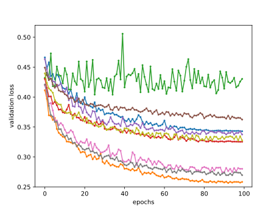
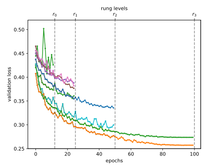

# Tối ưu hóa siêu tham số multi-fidelity
<a id="sec_mf_hpo"></a>

Huấn luyện mạng nơ-ron có thể tốn kém ngay cả trên các bộ dữ liệu kích thước vừa phải.
Tùy vào không gian cấu hình ([sec_intro_config_spaces](#sec_intro_config_spaces)),
tối ưu hóa siêu tham số cần hàng chục đến hàng trăm lần đánh giá hàm
để tìm một cấu hình siêu tham số hoạt động tốt. Như đã thấy trong
[sec_rs_async](#sec_rs_async), chúng ta có thể tăng tốc đáng kể tổng thời gian wall-clock
của HPO bằng cách khai thác tài nguyên song song, nhưng điều này không làm giảm tổng
lượng tính toán cần thiết.

Trong phần này, chúng ta sẽ trình bày cách tăng tốc việc đánh giá các cấu hình siêu tham số.
Các phương pháp như random search cấp cùng một lượng
tài nguyên (ví dụ, số epoch, số điểm dữ liệu huấn luyện) cho mỗi lần đánh giá
siêu tham số. [img_samples_lc](#img_samples_lc) mô tả learning curve của một tập mạng nơ-ron
được huấn luyện với các cấu hình siêu tham số khác nhau. Sau vài epoch, chúng ta
đã có thể phân biệt trực quan giữa các cấu hình hoạt động tốt và dưới mức tối ưu.
Tuy nhiên, các learning curve có nhiễu, và chúng ta vẫn có thể cần
đầy đủ 100 epoch để xác định cấu hình hoạt động tốt nhất.


<a id="img_samples_lc"></a>

Tối ưu hóa siêu tham số multi-fidelity cấp nhiều tài nguyên hơn
cho các cấu hình hứa hẹn và dừng sớm việc đánh giá các cấu hình hoạt động kém.
Điều này tăng tốc quá trình tối ưu hóa, vì chúng ta có thể thử nhiều
cấu hình hơn với cùng tổng lượng tài nguyên.

Chính thức hơn, chúng ta mở rộng định nghĩa trong [sec_definition_hpo](#sec_definition_hpo),
sao cho hàm mục tiêu $f(\mathbf{x}, r)$ nhận thêm một đầu vào
$r \in [r_{\mathrm{min}}, r_{max}]$, chỉ định lượng tài nguyên mà chúng ta
sẵn sàng chi cho việc đánh giá cấu hình $\mathbf{x}$. Chúng ta giả định rằng
lỗi $f(\mathbf{x}, r)$ giảm theo $r$, trong khi chi phí tính toán
$c(\mathbf{x}, r)$ tăng. Thông thường, $r$ biểu diễn số
epoch để huấn luyện mạng nơ-ron, nhưng nó cũng có thể là kích thước
tập con huấn luyện hoặc số fold cross-validation.

```python
from d2l import torch as d2l
import numpy as np
from scipy import stats
from collections import defaultdict
d2l.set_figsize()
```

## Successive Halving
<a id="sec_mf_hpo_sh"></a>

Một trong những cách đơn giản nhất để thích ứng random search với thiết lập multi-fidelity là
*successive halving* [jamieson-aistats16, karnin-icml13]. Ý tưởng
cơ bản là bắt đầu với $N$ cấu hình, chẳng hạn được lấy mẫu ngẫu nhiên từ
không gian cấu hình, và chỉ huấn luyện mỗi cấu hình trong $r_{\mathrm{min}}$ epoch. Sau đó chúng ta
loại bỏ một phần các trial hoạt động kém nhất và huấn luyện các trial còn lại
lâu hơn. Lặp lại quá trình này, ít trial hơn chạy lâu hơn, cho đến khi ít nhất
một trial đạt $r_{max}$ epoch.

Chính thức hơn, xét một ngân sách tối thiểu $r_{\mathrm{min}}$ (ví dụ 1 epoch), một ngân sách tối đa
$r_{max}$, ví dụ `max_epochs` trong ví dụ trước, và một hằng số halving
$\eta\in\{2, 3, \dots\}$. Để đơn giản, giả định rằng
$r_{max} = r_{\mathrm{min}} \eta^K$, với $K \in \mathbb{I}$. Khi đó số cấu hình ban đầu
là $N = \eta^K$. Hãy định nghĩa tập các rung
$\mathcal{R} = \{ r_{\mathrm{min}}, r_{\mathrm{min}}\eta, r_{\mathrm{min}}\eta^2, \dots, r_{max} \}$.

Một vòng successive halving diễn ra như sau. Chúng ta bắt đầu bằng cách chạy $N$
trial đến rung đầu tiên $r_{\mathrm{min}}$. Sắp xếp các lỗi validation, chúng ta giữ
phần $1 / \eta$ tốt nhất (tương ứng $\eta^{K-1}$ cấu hình) và
loại bỏ tất cả phần còn lại. Các trial sống sót được huấn luyện đến rung tiếp theo
($r_{\mathrm{min}}\eta$ epoch), và quá trình được lặp lại. Tại mỗi rung, một
phần $1 / \eta$ trial sống sót và việc huấn luyện của chúng tiếp tục với
ngân sách lớn hơn $\eta$ lần. Với lựa chọn $N$ cụ thể này, chỉ một
trial duy nhất sẽ được huấn luyện đến ngân sách đầy đủ $r_{max}$. Khi một vòng
successive halving như vậy hoàn tất, chúng ta bắt đầu vòng tiếp theo với một tập
cấu hình ban đầu mới, lặp lại cho đến khi tiêu hết tổng ngân sách.



Chúng ta subclass lớp cơ sở `HPOScheduler` từ [sec_api_hpo](#sec_api_hpo) để
triển khai successive halving, cho phép một đối tượng `HPOSearcher` tổng quát
lấy mẫu các cấu hình (trong ví dụ bên dưới, đó sẽ là `RandomSearcher`).
Ngoài ra, người dùng phải truyền tài nguyên tối thiểu $r_{\mathrm{min}}$, tài nguyên tối đa
$r_{max}$ và $\eta$ làm đầu vào. Bên trong scheduler, chúng ta duy trì một
hàng đợi các cấu hình vẫn cần được đánh giá cho rung hiện tại
$r_i$. Chúng ta cập nhật hàng đợi mỗi khi nhảy sang rung tiếp theo.

```python
class SuccessiveHalvingScheduler(d2l.HPOScheduler):  
    def __init__(self, searcher, eta, r_min, r_max, prefact=1):
        self.save_hyperparameters()
        # Compute K, which is later used to determine the number of configurations
        self.K = int(np.log(r_max / r_min) / np.log(eta))
        # Define the rungs
        self.rung_levels = [r_min * eta ** k for k in range(self.K + 1)]
        if r_max not in self.rung_levels:
            # The final rung should be r_max
            self.rung_levels.append(r_max)
            self.K += 1
        # Bookkeeping
        self.observed_error_at_rungs = defaultdict(list)
        self.all_observed_error_at_rungs = defaultdict(list)
        # Our processing queue
        self.queue = []
```

Ban đầu hàng đợi của chúng ta rỗng, và chúng ta điền vào đó
$n = \textrm{prefact} \cdot \eta^{K}$ cấu hình, được đánh giá trước tiên trên
rung nhỏ nhất $r_{\mathrm{min}}$. Ở đây, $\textrm{prefact}$ cho phép chúng ta tái sử dụng
code trong một ngữ cảnh khác. Với mục đích của phần này, chúng ta cố định
$\textrm{prefact} = 1$. Mỗi khi tài nguyên sẵn sàng và đối tượng `HPOTuner`
truy vấn hàm `suggest`, chúng ta trả về một phần tử từ hàng đợi. Khi
hoàn tất một vòng successive halving, nghĩa là chúng ta đã đánh giá tất cả
cấu hình sống sót ở mức tài nguyên cao nhất $r_{max}$ và hàng đợi
rỗng, chúng ta bắt đầu lại toàn bộ quá trình với một tập cấu hình mới
được lấy mẫu ngẫu nhiên.

```python
@d2l.add_to_class(SuccessiveHalvingScheduler)  
def suggest(self):
    if len(self.queue) == 0:
        # Start a new round of successive halving
        # Number of configurations for the first rung:
        n0 = int(self.prefact * self.eta ** self.K)
        for _ in range(n0):
            config = self.searcher.sample_configuration()
            config["max_epochs"] = self.r_min  # Set r = r_min
            self.queue.append(config)
    # Return an element from the queue
    return self.queue.pop()
```

Khi thu thập một điểm dữ liệu mới, trước tiên chúng ta cập nhật module searcher.
Sau đó, chúng ta kiểm tra liệu đã thu thập tất cả điểm dữ liệu trên rung hiện tại chưa.
Nếu có, chúng ta sắp xếp mọi cấu hình và đẩy phần $\frac{1}{\eta}$
cấu hình tốt nhất vào hàng đợi.

```python
@d2l.add_to_class(SuccessiveHalvingScheduler)  
def update(self, config: dict, error: float, info=None):
    ri = int(config["max_epochs"])  # Rung r_i
    # Update our searcher, e.g if we use Bayesian optimization later
    self.searcher.update(config, error, additional_info=info)
    self.all_observed_error_at_rungs[ri].append((config, error))
    if ri < self.r_max:
        # Bookkeeping
        self.observed_error_at_rungs[ri].append((config, error))
        # Determine how many configurations should be evaluated on this rung
        ki = self.K - self.rung_levels.index(ri)
        ni = int(self.prefact * self.eta ** ki)
        # If we observed all configuration on this rung r_i, we estimate the
        # top 1 / eta configuration, add them to queue and promote them for
        # the next rung r_{i+1}
        if len(self.observed_error_at_rungs[ri]) >= ni:
            kiplus1 = ki - 1
            niplus1 = int(self.prefact * self.eta ** kiplus1)
            best_performing_configurations = self.get_top_n_configurations(
                rung_level=ri, n=niplus1
            )
            riplus1 = self.rung_levels[self.K - kiplus1]  # r_{i+1}
            # Queue may not be empty: insert new entries at the beginning
            self.queue = [
                dict(config, max_epochs=riplus1)
                for config in best_performing_configurations
            ] + self.queue
            self.observed_error_at_rungs[ri] = []  # Reset
```

Các cấu hình được sắp xếp dựa trên hiệu năng đã quan sát của chúng trên
rung hiện tại.

```python

@d2l.add_to_class(SuccessiveHalvingScheduler)  
def get_top_n_configurations(self, rung_level, n):
    rung = self.observed_error_at_rungs[rung_level]
    if not rung:
        return []
    sorted_rung = sorted(rung, key=lambda x: x[1])
    return [x[0] for x in sorted_rung[:n]]
```

Hãy xem successive halving hoạt động thế nào trên ví dụ mạng nơ-ron của chúng ta. Chúng ta
sẽ dùng $r_{\mathrm{min}} = 2$, $\eta = 2$, $r_{max} = 10$, sao cho các mức rung là
$2, 4, 8, 10$.

```python
min_number_of_epochs = 2
max_number_of_epochs = 10
eta = 2
num_gpus=1

config_space = {
    "learning_rate": stats.loguniform(1e-2, 1),
    "batch_size": stats.randint(32, 256),
}
initial_config = {
    "learning_rate": 0.1,
    "batch_size": 128,
}
```

Chúng ta chỉ thay scheduler bằng `SuccessiveHalvingScheduler` mới.

```python
searcher = d2l.RandomSearcher(config_space, initial_config=initial_config)
scheduler = SuccessiveHalvingScheduler(
    searcher=searcher,
    eta=eta,
    r_min=min_number_of_epochs,
    r_max=max_number_of_epochs,
)
tuner = d2l.HPOTuner(
    scheduler=scheduler,
    objective=d2l.hpo_objective_lenet,
)
tuner.run(number_of_trials=30)
```

Chúng ta có thể trực quan hóa learning curve của tất cả các cấu hình đã đánh giá.
Hầu hết cấu hình bị dừng sớm và chỉ các cấu hình hoạt động tốt hơn
sống sót đến $r_{max}$. So sánh điều này với random search vanilla,
vốn sẽ cấp $r_{max}$ cho mọi cấu hình.

```python
for rung_index, rung in scheduler.all_observed_error_at_rungs.items():
    errors = [xi[1] for xi in rung]
    d2l.plt.scatter([rung_index] * len(errors), errors)
d2l.plt.xlim(min_number_of_epochs - 0.5, max_number_of_epochs + 0.5)
d2l.plt.xticks(
    np.arange(min_number_of_epochs, max_number_of_epochs + 1),
    np.arange(min_number_of_epochs, max_number_of_epochs + 1)
)
d2l.plt.ylabel("validation error")
d2l.plt.xlabel("epochs")
```

Cuối cùng, lưu ý một chút phức tạp trong triển khai
`SuccessiveHalvingScheduler` của chúng ta. Giả sử một worker rảnh để chạy một job, và
`suggest` được gọi khi rung hiện tại gần như đã được lấp đầy hoàn toàn, nhưng
một worker khác vẫn đang bận với một đánh giá. Vì chúng ta thiếu giá trị metric
từ worker này, chúng ta không thể xác định phần $1 / \eta$ tốt nhất để mở
rung tiếp theo. Mặt khác, chúng ta muốn giao một job cho worker đang rảnh,
để nó không nhàn rỗi. Giải pháp của chúng ta là bắt đầu một vòng successive
halving mới và giao worker cho trial đầu tiên ở đó. Tuy nhiên, khi một rung
hoàn tất trong `update`, chúng ta đảm bảo chèn các cấu hình mới vào
đầu hàng đợi, để chúng được ưu tiên hơn các cấu hình từ
vòng tiếp theo.

## Tóm tắt

Trong phần này, chúng ta đã giới thiệu khái niệm tối ưu hóa siêu tham số multi-fidelity,
trong đó giả định rằng ta có quyền truy cập vào các xấp xỉ rẻ để đánh giá
của hàm mục tiêu, chẳng hạn lỗi validation sau một số epoch
huấn luyện nhất định làm proxy cho lỗi validation sau đầy đủ số epoch.
Tối ưu hóa siêu tham số multi-fidelity cho phép giảm tổng
tính toán của HPO thay vì chỉ giảm thời gian wall-clock.

Chúng ta đã triển khai và đánh giá successive halving, một thuật toán HPO
multi-fidelity đơn giản nhưng hiệu quả.


[Thảo luận](https://discuss.d2l.ai/t/12094)
