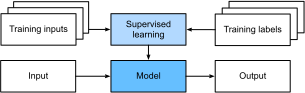

# Giới thiệu

Cho đến gần đây, hầu hết mọi chương trình máy tính
mà bạn có thể đã tương tác trong
một ngày bình thường
đều được lập trình dưới dạng một tập hợp các quy tắc cứng nhắc
xác định chính xác cách nó nên hoạt động.
Giả sử chúng ta muốn viết một ứng dụng
để quản lý một nền tảng thương mại điện tử.
Sau khi ngồi bên bảng trắng
suy nghĩ vài giờ,
chúng ta có thể đưa ra những nét chính
của một giải pháp hoạt động, ví dụ:
(i) người dùng tương tác với ứng dụng thông qua giao diện
chạy trong trình duyệt web hoặc ứng dụng di động;
(ii) ứng dụng của chúng ta tương tác với một công cụ cơ sở dữ liệu cấp thương mại
để theo dõi trạng thái của từng người dùng và duy trì hồ sơ
các giao dịch lịch sử;
và (iii) cốt lõi của ứng dụng là
*logic nghiệp vụ* (hay có thể nói là *bộ não*) của ứng dụng
đưa ra một tập hợp các quy tắc ánh xạ mọi tình huống có thể xảy ra
với hành động tương ứng mà chương trình nên thực hiện.

Để xây dựng bộ não của ứng dụng,
chúng ta có thể liệt kê tất cả các sự kiện thông thường
mà chương trình cần xử lý.
Ví dụ, bất cứ khi nào khách hàng nhấp
để thêm một mặt hàng vào giỏ hàng,
chương trình nên thêm một mục
vào bảng cơ sở dữ liệu giỏ hàng,
liên kết ID người dùng đó
với ID sản phẩm được yêu cầu.
Chúng ta có thể cố gắng xem xét
mọi trường hợp ngoại lệ có thể xảy ra,
kiểm tra tính phù hợp của các quy tắc
và thực hiện mọi sửa đổi cần thiết.
Điều gì xảy ra nếu người dùng
bắt đầu mua hàng với giỏ hàng trống?
Mặc dù ít nhà phát triển nào làm đúng
hoàn toàn ngay lần đầu tiên
(có thể cần một số lần chạy thử để giải quyết các vấn đề),
nhưng phần lớn chúng ta có thể viết các chương trình như vậy
và tự tin triển khai chúng
*trước khi* nhìn thấy một khách hàng thực sự.
Khả năng thiết kế thủ công các hệ thống tự động
điều khiển các sản phẩm và hệ thống hoạt động,
thường trong các tình huống mới,
là một kỳ tích nhận thức đáng chú ý.
Và khi bạn có thể nghĩ ra các giải pháp
hoạt động $100\%$ thời gian,
thông thường bạn không nên
lo lắng về machine learning.

May mắn thay cho cộng đồng
các nhà khoa học machine learning ngày càng phát triển,
nhiều tác vụ mà chúng ta muốn tự động hóa
không dễ dàng nhường bộ cho sự khéo léo của con người.
Hãy tưởng tượng bạn ngồi bên bảng trắng
với những người thông minh nhất bạn biết,
nhưng lần này bạn đang giải quyết
một trong những bài toán sau:

* Viết chương trình dự đoán thời tiết ngày mai dựa trên thông tin địa lý, ảnh vệ tinh và chuỗi dữ liệu thời tiết trong quá khứ.
* Viết chương trình nhận vào một câu hỏi thực tế, được diễn đạt bằng văn bản tự do, và trả lời chính xác.
* Viết chương trình, khi cho một bức ảnh, xác định mọi người được mô tả trong đó và vẽ đường viền xung quanh mỗi người.
* Viết chương trình giới thiệu cho người dùng các sản phẩm mà họ có thể thích nhưng khó có khả năng gặp trong quá trình duyệt tự nhiên.

Với những bài toán này,
ngay cả các lập trình viên xuất sắc cũng sẽ gặp khó khăn
khi viết giải pháp từ đầu.
Lý do có thể khác nhau.
Đôi khi chương trình mà chúng ta tìm kiếm
tuân theo một mẫu thay đổi theo thời gian,
vì vậy không có câu trả lời đúng cố định!
Trong những trường hợp như vậy, bất kỳ giải pháp thành công nào
cũng phải thích nghi duyên dáng với một thế giới thay đổi.
Đôi khi mối quan hệ (chẳng hạn giữa các pixel
và các danh mục trừu tượng) có thể quá phức tạp,
đòi hỏi hàng ngàn hoặc hàng triệu phép tính
và tuân theo những nguyên tắc chưa được biết đến.
Trong trường hợp nhận dạng hình ảnh,
các bước chính xác cần thiết để thực hiện tác vụ
nằm ngoài sự hiểu biết có ý thức của chúng ta,
mặc dù các quá trình nhận thức tiềm thức của chúng ta
thực hiện tác vụ một cách dễ dàng.

*Machine learning* là nghiên cứu về các thuật toán
có thể học từ kinh nghiệm.
Khi một thuật toán machine learning tích lũy nhiều kinh nghiệm hơn,
thường dưới dạng dữ liệu quan sát
hoặc tương tác với môi trường,
hiệu suất của nó cải thiện.
So sánh điều này với nền tảng thương mại điện tử xác định của chúng ta,
tuân theo cùng logic nghiệp vụ,
bất kể bao nhiêu kinh nghiệm tích lũy,
cho đến khi các nhà phát triển tự học và quyết định
rằng đã đến lúc cập nhật phần mềm.
Trong cuốn sách này, chúng tôi sẽ dạy bạn
những kiến thức cơ bản của machine learning,
đặc biệt tập trung vào *deep learning*,
một tập hợp các kỹ thuật mạnh mẽ
thúc đẩy đổi mới trong các lĩnh vực đa dạng như thị giác máy tính,
xử lý ngôn ngữ tự nhiên, chăm sóc sức khỏe và genomics.

## Một ví dụ tạo động lực

Trước khi bắt đầu viết, các tác giả của cuốn sách này,
giống như phần lớn lực lượng lao động, cần uống cà phê.
Chúng tôi lên xe và bắt đầu lái.
Dùng iPhone, Alex gọi "Hey Siri",
đánh thức hệ thống nhận dạng giọng nói của điện thoại.
Sau đó Mu ra lệnh "chỉ đường đến quán cà phê Blue Bottle".
Điện thoại nhanh chóng hiển thị bản ghi lệnh của anh ấy.
Nó cũng nhận ra rằng chúng tôi đang hỏi đường
và khởi chạy ứng dụng Maps
để thực hiện yêu cầu của chúng tôi.
Sau khi khởi chạy, ứng dụng Maps xác định một số tuyến đường.
Bên cạnh mỗi tuyến đường, điện thoại hiển thị thời gian di chuyển ước tính.
Mặc dù câu chuyện này được tạo ra cho mục đích sư phạm,
nó minh họa rằng chỉ trong vài giây,
các tương tác hàng ngày của chúng ta với điện thoại thông minh
có thể liên quan đến một số mô hình machine learning.

Hãy tưởng tượng chỉ cần viết một chương trình để phản hồi với *từ đánh thức*
như "Alexa", "OK Google" và "Hey Siri".
Hãy thử lập trình trong một căn phòng chỉ với
máy tính và trình soạn thảo code,
như minh họa trong [fig_wake_word](#fig_wake_word).
Làm thế nào bạn sẽ viết chương trình như vậy từ các nguyên tắc đầu tiên?
Hãy suy nghĩ... bài toán này rất khó.
Mỗi giây, microphone sẽ thu thập khoảng
44.000 mẫu.
Mỗi mẫu là một phép đo biên độ của sóng âm.
Quy tắc nào có thể ánh xạ đáng tin cậy từ một đoạn âm thanh thô đến các dự đoán chắc chắn
$\{\textrm{có}, \textrm{không}\}$
về việc đoạn có chứa từ đánh thức không?
Nếu bạn bị tắc, đừng lo lắng.
Chúng tôi cũng không biết cách viết chương trình như vậy từ đầu.
Đó là lý do tại sao chúng tôi sử dụng machine learning.

Đây là thủ thuật.
Thường thì, ngay cả khi chúng ta không biết cách hướng dẫn máy tính
một cách rõ ràng cách ánh xạ từ đầu vào sang đầu ra,
chúng ta vẫn có khả năng tự thực hiện kỳ tích nhận thức đó.
Nói cách khác, ngay cả khi bạn không biết
cách lập trình máy tính để nhận ra từ "Alexa",
bản thân bạn có thể nhận ra nó.
Với khả năng này, chúng ta có thể thu thập một *tập dữ liệu* khổng lồ
chứa các ví dụ về đoạn âm thanh và nhãn liên quan,
cho biết đoạn nào chứa từ đánh thức.
Trong phương pháp thống trị hiện nay của machine learning,
chúng ta không cố gắng thiết kế một hệ thống
*một cách rõ ràng* để nhận dạng từ đánh thức.
Thay vào đó, chúng ta định nghĩa một chương trình linh hoạt
có hành vi được xác định bởi một số *tham số*.
Sau đó chúng ta sử dụng tập dữ liệu để xác định các giá trị tham số tốt nhất có thể,
tức là những giá trị cải thiện hiệu suất của chương trình
liên quan đến một thước đo hiệu suất được chọn.

Bạn có thể nghĩ các tham số như các núm vặn mà chúng ta có thể xoay,
thao túng hành vi của chương trình.
Khi các tham số được cố định, chúng ta gọi chương trình là một *mô hình*.
Tập hợp tất cả các chương trình khác nhau (ánh xạ đầu vào--đầu ra)
mà chúng ta có thể tạo ra chỉ bằng cách thao túng các tham số
được gọi là một *họ* mô hình.
Và "meta-chương trình" sử dụng tập dữ liệu của chúng ta
để chọn các tham số được gọi là một *thuật toán học*.

Trước khi có thể tiến hành và sử dụng thuật toán học,
chúng ta phải xác định bài toán một cách chính xác,
xác định chính xác bản chất của đầu vào và đầu ra,
và chọn một họ mô hình phù hợp.
Trong trường hợp này,
mô hình của chúng ta nhận một đoạn âm thanh làm *đầu vào*,
và mô hình
tạo ra một lựa chọn trong số
$\{\textrm{có}, \textrm{không}\}$ làm *đầu ra*.
Nếu mọi thứ diễn ra theo kế hoạch,
các dự đoán của mô hình thường sẽ
đúng về việc đoạn có chứa từ đánh thức không.

Nếu chúng ta chọn đúng họ mô hình,
sẽ tồn tại một cài đặt của các núm vặn
sao cho mô hình kích hoạt "có" mỗi khi nghe từ "Alexa".
Vì sự lựa chọn chính xác của từ đánh thức là tùy ý,
chúng ta có thể cần một họ mô hình đủ phong phú để
thông qua cài đặt khác của các núm vặn, nó có thể kích hoạt "có"
chỉ khi nghe từ "Apricot".
Chúng ta kỳ vọng rằng cùng một họ mô hình sẽ phù hợp
cho nhận dạng "Alexa" và nhận dạng "Apricot"
vì chúng có vẻ, theo trực giác, là các tác vụ tương tự.
Tuy nhiên, chúng ta có thể cần một họ mô hình hoàn toàn khác
nếu muốn xử lý các đầu vào hoặc đầu ra về cơ bản khác nhau,
chẳng hạn nếu chúng ta muốn ánh xạ từ hình ảnh đến chú thích,
hoặc từ câu tiếng Anh đến câu tiếng Trung.

Như bạn có thể đoán, nếu chúng ta chỉ cài đặt tất cả các núm vặn ngẫu nhiên,
mô hình của chúng ta khó có thể nhận ra "Alexa",
"Apricot", hay bất kỳ từ tiếng Anh nào khác.
Trong machine learning,
*việc học* là quá trình
qua đó chúng ta khám phá cài đặt đúng của các núm vặn
để ép buộc hành vi mong muốn từ mô hình.
Nói cách khác,
chúng ta *huấn luyện* mô hình với dữ liệu.
Như thể hiện trong [fig_ml_loop](#fig_ml_loop), quá trình huấn luyện thường trông như sau:

1. Bắt đầu với một mô hình được khởi tạo ngẫu nhiên không thể làm bất cứ điều gì hữu ích.
1. Lấy một số dữ liệu (ví dụ: đoạn âm thanh và nhãn $\{\textrm{có}, \textrm{không}\}$ tương ứng).
1. Chỉnh các núm vặn để mô hình hoạt động tốt hơn được đánh giá trên các ví dụ đó.
1. Lặp lại Bước 2 và 3 cho đến khi mô hình tuyệt vời.

Tóm lại, thay vì lập trình một bộ nhận dạng từ đánh thức,
chúng ta lập trình một chương trình có thể *học* để nhận dạng từ đánh thức,
nếu được trình bày với một tập dữ liệu có nhãn lớn.
Bạn có thể nghĩ hành động xác định hành vi của chương trình
bằng cách trình bày cho nó một tập dữ liệu là *lập trình với dữ liệu*.
Tức là, chúng ta có thể "lập trình" bộ phát hiện mèo
bằng cách cung cấp cho hệ thống machine learning
nhiều ví dụ về mèo và chó.
Bằng cách này, bộ phát hiện cuối cùng sẽ học cách phát ra
một số dương rất lớn nếu đó là mèo,
một số âm rất lớn nếu đó là chó,
và điều gì đó gần bằng không nếu không chắc.
Điều này chỉ là bề mặt của những gì machine learning có thể làm.
Deep learning, mà chúng tôi sẽ giải thích chi tiết hơn sau,
chỉ là một trong nhiều phương pháp phổ biến
để giải quyết các bài toán machine learning.

## Các thành phần chính

Trong ví dụ từ đánh thức, chúng ta mô tả một tập dữ liệu
gồm các đoạn âm thanh và nhãn nhị phân,
và chúng ta đưa ra ý tưởng mờ nhạt về cách chúng ta có thể huấn luyện
một mô hình để xấp xỉ ánh xạ từ đoạn đến phân loại.
Loại bài toán này,
nơi chúng ta cố gắng dự đoán một nhãn chưa biết được chỉ định
dựa trên các đầu vào đã biết
với một tập dữ liệu gồm các ví dụ
mà nhãn đã biết,
được gọi là *học có giám sát*.
Đây chỉ là một trong nhiều loại bài toán machine learning.
Trước khi khám phá các loại khác,
chúng tôi muốn làm sáng tỏ hơn
về một số thành phần cốt lõi sẽ theo chúng ta,
bất kể loại bài toán machine learning nào chúng ta giải quyết:

1. *Dữ liệu* mà chúng ta có thể học từ đó.
1. Một *mô hình* về cách biến đổi dữ liệu.
1. Một *hàm mục tiêu* định lượng mức độ tốt (hoặc xấu) của mô hình.
1. Một *thuật toán* để điều chỉnh các tham số của mô hình nhằm tối ưu hóa hàm mục tiêu.

### Dữ liệu

Có thể không cần nói rằng bạn không thể làm khoa học dữ liệu mà không có dữ liệu.
Chúng ta có thể dành hàng trăm trang để suy ngẫm về chính xác dữ liệu *là* gì,
nhưng bây giờ, chúng ta sẽ tập trung vào các thuộc tính chính
của các tập dữ liệu mà chúng ta sẽ quan tâm.
Thông thường, chúng ta quan tâm đến một tập hợp các ví dụ.
Để làm việc với dữ liệu một cách hữu ích, thông thường
chúng ta cần đưa ra một biểu diễn số phù hợp.
Mỗi *ví dụ* (hay *điểm dữ liệu*, *thực thể dữ liệu*, *mẫu*)
thường bao gồm một tập hợp các thuộc tính
được gọi là *đặc trưng* (đôi khi gọi là *biến hiệp phương sai* hay *đầu vào*),
dựa trên đó mô hình phải đưa ra dự đoán.
Trong các bài toán học có giám sát,
mục tiêu của chúng ta là dự đoán giá trị của một thuộc tính đặc biệt,
được gọi là *nhãn* (hay *mục tiêu*),
không phải là một phần đầu vào của mô hình.

Nếu làm việc với dữ liệu hình ảnh,
mỗi ví dụ có thể bao gồm một
bức ảnh riêng lẻ (các đặc trưng)
và một số cho biết danh mục
mà bức ảnh thuộc về (nhãn).
Bức ảnh sẽ được biểu diễn bằng số
dưới dạng ba lưới giá trị số biểu diễn
độ sáng của ánh sáng đỏ, xanh lá và xanh lam
tại mỗi vị trí pixel.
Ví dụ, một bức ảnh màu $200\times 200$ pixel
sẽ bao gồm $200\times200\times3=120000$ giá trị số.

Ngoài ra, chúng ta có thể làm việc với dữ liệu hồ sơ sức khỏe điện tử
và giải quyết bài toán dự đoán khả năng
một bệnh nhân nhất định sẽ sống sót trong 30 ngày tiếp theo.
Ở đây, các đặc trưng của chúng ta có thể bao gồm một tập hợp
các thuộc tính có sẵn
và các phép đo được ghi lại thường xuyên,
bao gồm tuổi, dấu hiệu sinh tồn, bệnh đồng mắc,
thuốc hiện tại và thủ thuật gần đây.
Nhãn có sẵn để huấn luyện sẽ là một giá trị nhị phân
cho biết liệu mỗi bệnh nhân trong dữ liệu lịch sử
có sống sót trong khoảng thời gian 30 ngày không.

Trong những trường hợp như vậy, khi mỗi ví dụ được đặc trưng
bởi cùng một số lượng đặc trưng số,
chúng ta nói rằng đầu vào là các vector độ dài cố định
và chúng ta gọi (hằng số) độ dài của vector
là *số chiều* của dữ liệu.
Như bạn có thể tưởng tượng, đầu vào độ dài cố định có thể thuận tiện,
cho chúng ta ít phức tạp hơn để lo lắng.
Tuy nhiên, không phải tất cả dữ liệu đều có thể dễ dàng
được biểu diễn dưới dạng vector *độ dài cố định*.
Trong khi chúng ta có thể kỳ vọng ảnh kính hiển vi
đến từ thiết bị tiêu chuẩn,
chúng ta không thể kỳ vọng hình ảnh được khai thác từ Internet
đều có cùng độ phân giải hay hình dạng.
Với hình ảnh, chúng ta có thể xem xét
cắt chúng về kích thước tiêu chuẩn,
nhưng chiến lược đó chỉ đưa chúng ta đến một mức nhất định.
Chúng ta có nguy cơ mất thông tin trong các phần bị cắt.
Hơn nữa, dữ liệu văn bản còn kháng cự các biểu diễn
độ dài cố định hơn nữa.
Hãy xem xét các đánh giá của khách hàng để lại
trên các trang thương mại điện tử như Amazon, IMDb và TripAdvisor.
Một số rất ngắn: "thật tệ!".
Những cái khác lan man hàng trang.
Một lợi thế lớn của deep learning so với các phương pháp truyền thống
là sự khéo léo tương đối với đó các mô hình hiện đại
có thể xử lý dữ liệu *có độ dài thay đổi*.

Nói chung, chúng ta càng có nhiều dữ liệu, công việc càng dễ dàng.
Khi có nhiều dữ liệu hơn, chúng ta có thể huấn luyện các mô hình mạnh mẽ hơn
và ít phụ thuộc vào các giả định được quan niệm trước hơn.
Sự thay đổi chế độ từ dữ liệu (tương đối) nhỏ đến lớn
là một đóng góp lớn vào sự thành công của deep learning hiện đại.
Để nhấn mạnh điều này, nhiều
mô hình thú vị nhất trong deep learning
không hoạt động nếu không có tập dữ liệu lớn.
Một số mô hình khác có thể hoạt động trong chế độ dữ liệu nhỏ,
nhưng không tốt hơn các phương pháp truyền thống.

Cuối cùng, không đủ chỉ có nhiều dữ liệu
và xử lý nó một cách thông minh.
Chúng ta cần dữ liệu *đúng*.
Nếu dữ liệu đầy lỗi,
hoặc nếu các đặc trưng được chọn không dự đoán được
đại lượng mục tiêu quan tâm,
việc học sẽ thất bại.
Tình huống được tóm tắt tốt bởi cụm từ:
*rác vào, rác ra*.
Hơn nữa, hiệu suất dự đoán kém
không phải là hậu quả tiềm năng duy nhất.
Trong các ứng dụng nhạy cảm của machine learning,
như cảnh sát dự đoán, sàng lọc hồ sơ,
và các mô hình rủi ro được sử dụng cho vay mượn,
chúng ta phải đặc biệt cảnh giác
với hậu quả của dữ liệu rác.
Một chế độ thất bại thường gặp liên quan đến các tập dữ liệu
nơi một số nhóm người không được đại diện
trong dữ liệu huấn luyện.
Hãy tưởng tượng áp dụng hệ thống nhận dạng ung thư da
chưa từng thấy da đen trước đây.
Thất bại cũng có thể xảy ra khi dữ liệu
không chỉ thiếu đại diện một số nhóm
mà còn phản ánh định kiến xã hội.
Ví dụ, nếu các quyết định tuyển dụng trong quá khứ
được sử dụng để huấn luyện mô hình dự đoán
sẽ được sử dụng để sàng lọc hồ sơ
thì các mô hình machine learning có thể vô tình
nắm bắt và tự động hóa các bất công lịch sử.
Lưu ý rằng tất cả điều này có thể xảy ra mà không cần nhà khoa học dữ liệu
chủ động âm mưu, hoặc thậm chí biết.

### Mô hình

Hầu hết machine learning liên quan đến việc biến đổi dữ liệu theo một nghĩa nào đó.
Chúng ta có thể muốn xây dựng một hệ thống nhận ảnh và dự đoán mức độ tươi cười.
Ngoài ra,
chúng ta có thể muốn nhận một tập hợp các chỉ số cảm biến
và dự đoán mức độ bình thường hay bất thường của các chỉ số đó.
Bằng *mô hình*, chúng ta biểu thị cơ chế tính toán để nhận dữ liệu
thuộc một loại,
và đưa ra dự đoán thuộc loại có thể khác.
Đặc biệt, chúng ta quan tâm đến *các mô hình thống kê*
có thể được ước lượng từ dữ liệu.
Trong khi các mô hình đơn giản hoàn toàn có khả năng giải quyết
các bài toán đơn giản phù hợp,
các bài toán mà chúng ta tập trung trong cuốn sách này vượt quá giới hạn của các phương pháp cổ điển.
Deep learning được phân biệt với các phương pháp cổ điển
chủ yếu bởi tập hợp các mô hình mạnh mẽ mà nó tập trung vào.
Các mô hình này bao gồm nhiều phép biến đổi liên tiếp của dữ liệu
được kết nối từ trên xuống dưới, do đó có tên *deep learning*.
Trên đường thảo luận về các mô hình sâu,
chúng tôi cũng sẽ thảo luận về một số phương pháp truyền thống hơn.

### Hàm mục tiêu

Trước đó, chúng ta giới thiệu machine learning là học từ kinh nghiệm.
Bằng *học* ở đây,
chúng ta có nghĩa là cải thiện ở một tác vụ nào đó theo thời gian.
Nhưng ai nói điều gì tạo thành sự cải thiện?
Bạn có thể tưởng tượng rằng chúng ta có thể đề xuất cập nhật mô hình,
và một số người có thể không đồng ý về việc đề xuất của chúng ta
có tạo thành sự cải thiện hay không.

Để phát triển một hệ thống toán học chính thức của các máy học,
chúng ta cần có các thước đo chính thức về mô hình của chúng ta tốt (hoặc xấu) thế nào.
Trong machine learning, và tối ưu hóa nói chung,
chúng ta gọi những thước đo này là *hàm mục tiêu*.
Theo quy ước, chúng ta thường định nghĩa hàm mục tiêu
sao cho thấp hơn thì tốt hơn.
Đây chỉ là quy ước.
Bạn có thể lấy bất kỳ hàm nào
mà cao hơn thì tốt hơn, và biến nó thành hàm mới
về chất giống nhau nhưng thấp hơn thì tốt hơn
bằng cách đảo dấu.
Vì chúng ta chọn thấp hơn thì tốt hơn, các hàm này đôi khi được gọi là
*hàm mất mát*.

Khi cố gắng dự đoán các giá trị số,
hàm mất mát phổ biến nhất là *sai số bình phương*,
tức là bình phương của hiệu giữa
dự đoán và giá trị mục tiêu thực tế.
Cho phân loại, mục tiêu phổ biến nhất
là tối thiểu hóa tỷ lệ lỗi,
tức là tỷ lệ các ví dụ mà
dự đoán của chúng ta không đồng ý với nhãn thực tế.
Một số mục tiêu (ví dụ: sai số bình phương) dễ tối ưu hóa,
trong khi các mục tiêu khác (ví dụ: tỷ lệ lỗi) khó tối ưu hóa trực tiếp,
do không thể vi phân hoặc các phức tạp khác.
Trong những trường hợp này, thay vào đó thường tối ưu hóa *mục tiêu thay thế*.

Trong quá trình tối ưu hóa, chúng ta nghĩ về mất mát
như là một hàm của các tham số của mô hình,
và coi tập dữ liệu huấn luyện như một hằng số.
Chúng ta học
các giá trị tốt nhất của các tham số mô hình
bằng cách tối thiểu hóa mất mát phát sinh trên một tập
gồm một số ví dụ được thu thập để huấn luyện.
Tuy nhiên, làm tốt trên dữ liệu huấn luyện
không đảm bảo chúng ta sẽ làm tốt trên dữ liệu chưa thấy.
Vì vậy chúng ta thường muốn chia dữ liệu có sẵn thành hai phần:
*tập dữ liệu huấn luyện* (hay *tập huấn luyện*), để học các tham số mô hình;
và *tập dữ liệu kiểm tra* (hay *tập kiểm tra*), được giữ lại để đánh giá.
Cuối cùng, chúng ta thường báo cáo
cách mô hình hoạt động trên cả hai phần.
Bạn có thể nghĩ hiệu suất huấn luyện
tương tự như điểm một học sinh đạt được
trên các bài thi luyện tập dùng để chuẩn bị cho một kỳ thi thực sự.
Ngay cả khi kết quả đáng khích lệ,
điều đó không đảm bảo thành công trên kỳ thi cuối.
Trong quá trình học, học sinh
có thể bắt đầu ghi nhớ các câu hỏi luyện tập,
có vẻ thành thạo chủ đề nhưng lại thất bại
khi đối mặt với các câu hỏi chưa thấy trước
trên kỳ thi thực sự.
Khi một mô hình hoạt động tốt trên tập huấn luyện
nhưng không tổng quát hóa được với dữ liệu chưa thấy,
chúng ta nói rằng nó đang *quá khớp* với dữ liệu huấn luyện.

### Thuật toán tối ưu hóa

Khi đã có một nguồn dữ liệu và biểu diễn,
một mô hình, và một hàm mục tiêu được xác định rõ,
chúng ta cần một thuật toán có khả năng tìm kiếm
các tham số tốt nhất có thể để tối thiểu hóa hàm mất mát.
Các thuật toán tối ưu hóa phổ biến cho deep learning
dựa trên một phương pháp gọi là *gradient descent*.
Tóm lại, ở mỗi bước, phương pháp này
kiểm tra xem, với mỗi tham số,
mất mát tập huấn luyện sẽ thay đổi thế nào
nếu bạn nhiễu loạn tham số đó chỉ một lượng nhỏ.
Sau đó nó cập nhật tham số
theo hướng giảm mất mát.

## Các loại bài toán Machine Learning

Bài toán từ đánh thức trong ví dụ tạo động lực
chỉ là một trong nhiều bài toán
mà machine learning có thể giải quyết.
Để tạo thêm động lực cho người đọc
và cung cấp cho chúng ta một số ngôn ngữ chung
sẽ theo chúng ta xuyên suốt cuốn sách,
bây giờ chúng tôi cung cấp tổng quan rộng về bức tranh
của các bài toán machine learning.

### Học có giám sát

Học có giám sát mô tả các tác vụ
nơi chúng ta được cho một tập dữ liệu
chứa cả đặc trưng và nhãn
và được yêu cầu tạo ra một mô hình dự đoán nhãn khi
cho đặc trưng đầu vào.
Mỗi cặp đặc trưng--nhãn được gọi là một ví dụ.
Đôi khi, khi ngữ cảnh rõ ràng,
chúng ta có thể sử dụng thuật ngữ *ví dụ*
để chỉ một tập hợp đầu vào,
ngay cả khi nhãn tương ứng chưa biết.
Sự giám sát xuất hiện
vì để chọn các tham số,
chúng ta (người giám sát) cung cấp cho mô hình
một tập dữ liệu gồm các ví dụ có nhãn.
Theo thuật ngữ xác suất, chúng ta thường quan tâm đến việc ước lượng
xác suất có điều kiện của một nhãn dựa trên các đặc trưng đầu vào.
Mặc dù chỉ là một trong nhiều mô hình,
học có giám sát chiếm phần lớn các ứng dụng thành công
của machine learning trong công nghiệp.
Một phần là vì nhiều tác vụ quan trọng
có thể được mô tả súc tích là ước lượng xác suất
của một điều gì đó chưa biết cho một tập dữ liệu có sẵn cụ thể:

* Dự đoán ung thư hay không phải ung thư, dựa trên ảnh chụp cắt lớp vi tính.
* Dự đoán bản dịch đúng bằng tiếng Pháp, cho một câu bằng tiếng Anh.
* Dự đoán giá cổ phiếu tháng tới dựa trên dữ liệu báo cáo tài chính tháng này.

Trong khi tất cả các bài toán học có giám sát
được nắm bắt bởi mô tả đơn giản
"dự đoán nhãn cho đặc trưng đầu vào",
học có giám sát bản thân nó có thể có các dạng đa dạng
và đòi hỏi nhiều quyết định mô hình hóa,
tùy thuộc vào (trong số các cân nhắc khác)
loại, kích thước và số lượng đầu vào và đầu ra.
Ví dụ, chúng ta sử dụng các mô hình khác nhau
để xử lý các chuỗi có độ dài tùy ý
và các biểu diễn vector độ dài cố định.
Chúng ta sẽ đi sâu vào nhiều bài toán này
trong suốt cuốn sách này.

Không chính thức, quá trình học trông như sau.
Đầu tiên, lấy một tập hợp lớn các ví dụ mà đặc trưng đã biết
và chọn từ chúng một tập con ngẫu nhiên,
thu thập nhãn thực tế cho từng ví dụ.
Đôi khi những nhãn này có thể là dữ liệu đã được thu thập
(ví dụ: bệnh nhân có chết trong năm tiếp theo không?)
và đôi khi chúng ta có thể cần thuê người chú thích để gán nhãn dữ liệu,
(ví dụ: gán hình ảnh vào các danh mục).
Cùng nhau, các đầu vào và nhãn tương ứng này tạo thành tập huấn luyện.
Chúng ta đưa tập dữ liệu huấn luyện vào thuật toán học có giám sát,
một hàm lấy đầu vào là tập dữ liệu
và đầu ra là hàm khác: mô hình đã học.
Cuối cùng, chúng ta có thể đưa các đầu vào chưa thấy vào mô hình đã học,
sử dụng đầu ra của nó làm dự đoán cho nhãn tương ứng.
Toàn bộ quá trình được vẽ trong [fig_supervised_learning](#fig_supervised_learning).

#### Hồi quy

Có lẽ tác vụ học có giám sát đơn giản nhất
để hiểu là *hồi quy*.
Xem xét, ví dụ, một tập dữ liệu được thu thập
từ cơ sở dữ liệu bán nhà.
Chúng ta có thể xây dựng một bảng,
trong đó mỗi hàng tương ứng với một ngôi nhà khác nhau,
và mỗi cột tương ứng với một thuộc tính liên quan,
như diện tích ngôi nhà,
số phòng ngủ, số phòng tắm,
và số phút (đi bộ) đến trung tâm thành phố.
Trong tập dữ liệu này, mỗi ví dụ sẽ là một ngôi nhà cụ thể,
và vector đặc trưng tương ứng sẽ là một hàng trong bảng.
Nếu bạn sống ở New York hoặc San Francisco,
và bạn không phải là CEO của Amazon, Google, Microsoft hay Facebook,
vector đặc trưng (diện tích, số phòng ngủ, số phòng tắm, khoảng cách đi bộ)
cho ngôi nhà của bạn có thể trông như sau: $[600, 1, 1, 60]$.
Tuy nhiên, nếu bạn sống ở Pittsburgh, nó có thể trông như $[3000, 4, 3, 10]$.
Các vector đặc trưng độ dài cố định như thế này là cần thiết
cho hầu hết các thuật toán machine learning cổ điển.

Điều làm cho một bài toán là hồi quy thực sự là
dạng của mục tiêu.
Giả sử bạn đang tìm kiếm một ngôi nhà mới.
Bạn có thể muốn ước tính giá trị thị trường hợp lý của ngôi nhà,
dựa trên một số đặc trưng như trên.
Dữ liệu ở đây có thể bao gồm danh sách nhà lịch sử
và nhãn có thể là giá bán được quan sát.
Khi nhãn nhận các giá trị số tùy ý
(ngay cả trong một khoảng nào đó),
chúng ta gọi đây là bài toán *hồi quy*.
Mục tiêu là tạo ra một mô hình có dự đoán
xấp xỉ chặt chẽ các giá trị nhãn thực tế.

Rất nhiều bài toán thực tế dễ dàng được mô tả là các bài toán hồi quy.
Dự đoán xếp hạng mà người dùng sẽ gán cho một bộ phim
có thể được coi là bài toán hồi quy
và nếu bạn thiết kế một thuật toán tuyệt vời
để hoàn thành điều này vào năm 2009,
bạn có thể đã giành được [giải thưởng Netflix 1 triệu đô la](https://en.wikipedia.org/wiki/Netflix_Prize).
Dự đoán thời gian nằm viện cho bệnh nhân
cũng là một bài toán hồi quy.
Quy tắc ngón tay cái tốt là bất kỳ câu hỏi *bao nhiêu?* hoặc *bao nhiêu cái?*
có khả năng là hồi quy. Ví dụ:

* Ca phẫu thuật này sẽ mất bao nhiêu giờ?
* Thành phố này sẽ có bao nhiêu lượng mưa trong sáu giờ tới?

Ngay cả khi bạn chưa bao giờ làm việc với machine learning trước đây,
bạn có thể đã giải quyết một bài toán hồi quy một cách không chính thức.
Hãy tưởng tượng, ví dụ, bạn đã sửa ống thoát nước
và nhà thầu mất 3 giờ
lấy rác ra khỏi ống cống.
Sau đó họ gửi hóa đơn 350 đô la.
Bây giờ hãy tưởng tượng người bạn của bạn thuê cùng nhà thầu đó trong 2 giờ
và nhận hóa đơn 250 đô la.
Nếu ai đó hỏi bạn mong đợi bao nhiêu
trên hóa đơn làm sạch rác sắp tới của họ
bạn có thể đưa ra một số giả định hợp lý,
chẳng hạn như làm việc nhiều giờ hơn thì tốn nhiều đô la hơn.
Bạn cũng có thể giả định rằng có một khoản phí cơ bản
và sau đó nhà thầu tính theo giờ.
Nếu những giả định này đúng, thì với hai ví dụ dữ liệu này,
bạn đã có thể xác định cấu trúc giá của nhà thầu:
100 đô la mỗi giờ cộng thêm 50 đô la để đến nhà bạn.
Nếu bạn hiểu đến đây, thì bạn đã hiểu
ý tưởng cấp cao đằng sau *hồi quy tuyến tính*.

#### Phân loại

Trong khi các mô hình hồi quy rất tốt
để trả lời các câu hỏi *bao nhiêu?*,
nhiều bài toán không phù hợp thoải mái với mẫu này.
Xem xét, ví dụ, một ngân hàng muốn
phát triển tính năng quét séc cho ứng dụng di động của họ.
Lý tưởng nhất, khách hàng chỉ cần chụp ảnh séc
và ứng dụng sẽ tự động nhận dạng văn bản từ hình ảnh.
Giả sử chúng ta có khả năng
phân đoạn các mảnh hình ảnh
tương ứng với mỗi ký tự viết tay,
thì tác vụ còn lại chủ yếu là
xác định ký tự nào trong một tập đã biết
được mô tả trong mỗi mảnh hình ảnh.
Các loại bài toán *cái nào?* này được gọi là *phân loại*
và đòi hỏi một tập hợp công cụ khác
với những công cụ được sử dụng cho hồi quy,
mặc dù nhiều kỹ thuật sẽ được chuyển giao.

Trong *phân loại*, chúng ta muốn mô hình nhìn vào đặc trưng,
ví dụ: giá trị pixel trong một hình ảnh,
và sau đó dự đoán *danh mục* nào
(đôi khi gọi là *lớp*)
trong số một tập hợp tùy chọn rời rạc,
một ví dụ thuộc về.
Đối với chữ số viết tay, chúng ta có thể có mười lớp,
tương ứng với các chữ số từ 0 đến 9.
Dạng đơn giản nhất của phân loại là khi chỉ có hai lớp,
một bài toán mà chúng ta gọi là *phân loại nhị phân*.
Ví dụ, tập dữ liệu của chúng ta có thể bao gồm hình ảnh động vật
và nhãn của chúng ta có thể là các lớp $\textrm{\{mèo, chó\}}$.
Trong khi hồi quy tìm kiếm một bộ hồi quy để xuất ra giá trị số,
trong phân loại chúng ta tìm kiếm một bộ phân loại,
có đầu ra là lớp dự đoán được gán.

Vì những lý do mà chúng ta sẽ tìm hiểu khi cuốn sách trở nên kỹ thuật hơn,
có thể khó tối ưu hóa một mô hình chỉ có thể xuất ra
một phân loại danh mục *cứng nhắc*,
ví dụ: "mèo" hoặc "chó".
Trong những trường hợp này, thường dễ hơn nhiều để diễn đạt
mô hình trong ngôn ngữ xác suất.
Cho đặc trưng của một ví dụ,
mô hình gán xác suất
cho mỗi lớp có thể.
Trở lại ví dụ phân loại động vật
nơi các lớp là $\textrm{\{mèo, chó\}}$,
bộ phân loại có thể thấy một hình ảnh và xuất ra xác suất
rằng hình ảnh là mèo là 0.9.
Chúng ta có thể diễn giải con số này bằng cách nói rằng bộ phân loại
chắc chắn 90\% rằng hình ảnh mô tả một con mèo.
Độ lớn của xác suất cho lớp dự đoán
truyền đạt một khái niệm về sự không chắc chắn.
Đây không phải là khái niệm duy nhất có sẵn
và chúng ta sẽ thảo luận về các khái niệm khác trong các chương đề cập đến chủ đề nâng cao hơn.

Khi có nhiều hơn hai lớp có thể,
chúng ta gọi bài toán là *phân loại đa lớp*.
Các ví dụ phổ biến bao gồm nhận dạng ký tự viết tay
$\textrm{\{0, 1, 2, ... 9, a, b, c, ...\}}$.
Trong khi chúng ta giải quyết các bài toán hồi quy bằng cách cố gắng
tối thiểu hóa hàm mất mát sai số bình phương,
hàm mất mát phổ biến cho các bài toán phân loại được gọi là *cross-entropy*,
tên của nó sẽ được giải thích rõ
khi chúng ta giới thiệu lý thuyết thông tin trong các chương sau.

#### Gán thẻ

Một số bài toán phân loại phù hợp gọn gàng
vào các thiết lập phân loại nhị phân hoặc đa lớp.
Ví dụ, chúng ta có thể huấn luyện một bộ phân loại nhị phân thông thường
để phân biệt mèo với chó.
Với trạng thái hiện tại của thị giác máy tính,
chúng ta có thể làm điều này dễ dàng, với các công cụ sẵn có.
Tuy nhiên, dù mô hình của chúng ta chính xác đến mức nào,
chúng ta có thể gặp rắc rối khi bộ phân loại
gặp một hình ảnh của *Nhạc sĩ Thành phố Bremen*,
một truyện cổ tích Đức nổi tiếng có bốn con vật
([fig_stackedanimals](#fig_stackedanimals)).

:width:`300px`

Như bạn có thể thấy, bức ảnh có một con mèo,
một con gà trống, một con chó và một con lừa,
với một số cây ở phía sau.
Nếu chúng ta dự kiến gặp những hình ảnh như vậy,
phân loại đa lớp có thể không phải là
công thức bài toán phù hợp.
Thay vào đó, chúng ta có thể muốn cho mô hình tùy chọn
nói rằng hình ảnh mô tả một con mèo, một con chó, một con lừa,
*và* một con gà trống.

Bài toán học dự đoán các lớp không loại trừ lẫn nhau
được gọi là *phân loại đa nhãn*.
Các bài toán tự động gán thẻ thường được mô tả tốt nhất
theo phân loại đa nhãn.
Hãy nghĩ về các thẻ mà mọi người có thể áp dụng
cho các bài đăng trên blog kỹ thuật,
ví dụ: "machine learning", "công nghệ", "tiện ích",
"ngôn ngữ lập trình", "Linux", "điện toán đám mây", "AWS".
Một bài viết điển hình có thể có 5--10 thẻ được áp dụng.

#### Tìm kiếm

Trong lĩnh vực truy xuất thông tin,
chúng ta thường áp đặt xếp hạng trên các tập hợp mục.
Lấy tìm kiếm web làm ví dụ.
Mục tiêu ít hơn là xác định *liệu*
một trang cụ thể có liên quan đến một truy vấn,
mà là cái nào, trong số một tập hợp kết quả liên quan,
nên được hiển thị nổi bật nhất
cho một người dùng cụ thể.

#### Hệ thống gợi ý

Hệ thống gợi ý là một thiết lập bài toán khác
liên quan đến tìm kiếm và xếp hạng.
Các bài toán tương tự ở chỗ mục tiêu
là hiển thị một tập hợp các mục liên quan đến người dùng.
Sự khác biệt chính là nhấn mạnh vào *cá nhân hóa*
cho người dùng cụ thể trong bối cảnh hệ thống gợi ý.

#### Học chuỗi

Cho đến nay, chúng ta đã xem xét các bài toán nơi chúng ta có
một số đầu vào cố định và tạo ra một số đầu ra cố định.
Nhưng làm thế nào chúng ta nên đối phó với các đoạn video?
Trong trường hợp này, mỗi đoạn có thể bao gồm số lượng khung hình khác nhau.
Và dự đoán của chúng ta về những gì đang xảy ra trong mỗi khung hình có thể mạnh hơn nhiều
nếu chúng ta xem xét các khung hình trước hoặc sau đó.
Điều tương tự áp dụng cho ngôn ngữ.
Ví dụ, một bài toán deep learning phổ biến là dịch máy:
tác vụ nhận câu trong ngôn ngữ nguồn
và dự đoán bản dịch của chúng sang ngôn ngữ khác.

Các câu hỏi như thế này nằm trong số những
ứng dụng thú vị nhất của machine learning
và chúng là các ví dụ của *học chuỗi*.
Chúng đòi hỏi mô hình nhận chuỗi đầu vào
hoặc phát ra chuỗi đầu ra (hoặc cả hai).
Cụ thể, *học chuỗi-sang-chuỗi* xem xét các bài toán
nơi cả đầu vào và đầu ra đều bao gồm các chuỗi có độ dài thay đổi.

### Học không giám sát và tự giám sát

Các ví dụ trước tập trung vào học có giám sát,
nơi chúng ta đưa cho mô hình một tập dữ liệu khổng lồ
chứa cả đặc trưng và giá trị nhãn tương ứng.
Bạn có thể nghĩ người học có giám sát như có
một công việc cực kỳ chuyên biệt và một ông chủ cực kỳ độc đoán.
Ông chủ đứng sau vai người học và nói cho họ biết chính xác phải làm gì
trong mọi tình huống cho đến khi họ học cách ánh xạ từ tình huống đến hành động.

Xem xét tình huống ngược lại,
có thể khó chịu khi làm việc cho một ông chủ
không biết họ muốn bạn làm gì.
Tuy nhiên, nếu bạn có kế hoạch trở thành nhà khoa học dữ liệu,
bạn tốt hơn nên làm quen với điều đó.
Ông chủ có thể chỉ đưa cho bạn một đống dữ liệu khổng lồ
và nói *hãy làm khoa học dữ liệu với nó!*
Điều này nghe có vẻ mơ hồ vì nó mơ hồ.
Chúng ta gọi lớp bài toán này là *học không giám sát*,
và loại và số lượng câu hỏi chúng ta có thể hỏi
chỉ bị giới hạn bởi sự sáng tạo của chúng ta.

Một phát triển quan trọng khác trong học không giám sát
là sự nổi lên của *học tự giám sát*,
các kỹ thuật tận dụng một số khía cạnh của dữ liệu không có nhãn
để cung cấp sự giám sát.

### Tương tác với Môi trường

Cho đến nay, chúng ta chưa thảo luận về nơi dữ liệu thực sự đến từ đâu,
hay điều gì thực sự xảy ra khi mô hình machine learning tạo ra đầu ra.
Đó là vì học có giám sát và học không giám sát
không giải quyết những vấn đề này theo cách rất tinh vi.
Trong mỗi trường hợp, chúng ta lấy một đống dữ liệu lớn trước,
rồi đặt các máy nhận dạng mẫu vào chuyển động
mà không bao giờ tương tác với môi trường nữa.
Vì tất cả việc học diễn ra
sau khi thuật toán ngắt kết nối khỏi môi trường,
đây đôi khi được gọi là *học ngoại tuyến*.

### Học tăng cường

Nếu bạn quan tâm đến việc sử dụng machine learning
để phát triển một tác nhân tương tác với môi trường
và thực hiện các hành động, thì bạn có thể sẽ tập trung vào
*học tăng cường*.
Điều này có thể bao gồm các ứng dụng robotics,
các hệ thống đối thoại,
và thậm chí phát triển trí tuệ nhân tạo (AI)
cho video game.
*Deep learning tăng cường*, áp dụng
deep learning vào các bài toán học tăng cường,
đã tăng vọt về mức độ phổ biến.

Học tăng cường đưa ra một phát biểu rất tổng quát của một bài toán
trong đó một tác nhân tương tác với môi trường trong một loạt các bước thời gian.
Ở mỗi bước thời gian, tác nhân nhận một số *quan sát*
từ môi trường và phải chọn một *hành động*
sau đó được truyền lại cho môi trường
thông qua một cơ chế nào đó (đôi khi gọi là *cơ cấu chấp hành*), khi, sau mỗi vòng lặp,
tác nhân nhận được phần thưởng từ môi trường.
Hành vi của tác nhân học tăng cường được chi phối bởi một *chính sách*.
Mục tiêu của học tăng cường là tạo ra các chính sách tốt.

## Nguồn gốc

Chúng ta vừa xem xét một tập con nhỏ của các bài toán
mà machine learning có thể giải quyết.
Mặc dù nhiều phương pháp deep learning là những phát minh gần đây,
các ý tưởng cốt lõi đằng sau việc học từ dữ liệu
đã được nghiên cứu trong nhiều thế kỷ.

## Con đường đến Deep Learning

Phần lớn điều này đã thay đổi với sự có sẵn
của lượng dữ liệu khổng lồ,
nhờ vào World Wide Web,
sự ra đời của các công ty phục vụ
hàng trăm triệu người dùng trực tuyến,
sự phổ biến của các cảm biến chất lượng cao, chi phí thấp,
lưu trữ dữ liệu giá rẻ (định luật Kryder),
và tính toán rẻ tiền (định luật Moore).
Đặc biệt, bức tranh tính toán trong deep learning
đã được cách mạng hóa bởi những tiến bộ trong GPU ban đầu được thiết kế cho trò chơi máy tính.

:Dataset vs. bộ nhớ máy tính và sức mạnh tính toán

|Thập kỷ|Tập dữ liệu|Bộ nhớ|Tính toán dấu phẩy động mỗi giây|
|:--|:-|:-|:-|
|1970|100 (Iris)|1 KB|100 KF (Intel 8080)|
|1980|1 K (giá nhà ở Boston)|100 KB|1 MF (Intel 80186)|
|1990|10 K (nhận dạng ký tự quang học)|10 MB|10 MF (Intel 80486)|
|2000|10 M (trang web)|100 MB|1 GF (Intel Core)|
|2010|10 G (quảng cáo)|1 GB|1 TF (NVIDIA C2050)|
|2020|1 T (mạng xã hội)|100 GB|1 PF (NVIDIA DGX-2)|

## Những câu chuyện thành công

Trí tuệ nhân tạo có lịch sử lâu dài cung cấp kết quả
mà sẽ khó đạt được theo cách khác.
Deep learning đã cách mạng hóa nhận dạng mẫu,
giới thiệu công nghệ hiện cung cấp sức mạnh cho nhiều ứng dụng
trong các lĩnh vực đa dạng như thị giác máy tính,
xử lý ngôn ngữ tự nhiên,
và nhận dạng giọng nói tự động.

## Bản chất của Deep Learning

Deep learning là tập con của machine learning
liên quan đến các mô hình dựa trên mạng nơ-ron nhiều lớp.
Nó *sâu* theo đúng nghĩa đen là các mô hình của nó
học nhiều *lớp* biến đổi.
Điều phân biệt deep learning với các phương pháp cổ điển là
các hoạt động được học tại mỗi lớp trong số nhiều lớp
biểu diễn được học cùng nhau từ dữ liệu.

## Tóm tắt

Machine learning nghiên cứu cách các hệ thống máy tính
có thể tận dụng kinh nghiệm (thường là dữ liệu)
để cải thiện hiệu suất ở các tác vụ cụ thể.
Nó kết hợp các ý tưởng từ thống kê, khai thác dữ liệu và tối ưu hóa.
Thường được sử dụng như một phương tiện để triển khai các giải pháp AI.
Deep learning thay thế không chỉ các mô hình nông
ở cuối các pipeline machine learning truyền thống,
mà còn quá trình kỹ thuật đặc trưng tốn nhiều công sức.
Phần lớn tiến bộ gần đây trong deep learning
đã được kích hoạt bởi sự dư thừa dữ liệu
phát sinh từ các cảm biến rẻ và các ứng dụng quy mô Internet,
và bởi tiến bộ đáng kể trong tính toán, chủ yếu thông qua GPU.

## Bài tập

1. Những phần code bạn đang viết hiện tại có thể được "học",
   tức là cải thiện bằng cách học và tự động xác định các lựa chọn thiết kế
   được thực hiện trong code của bạn?
   Code của bạn có bao gồm các lựa chọn thiết kế dựa trên kinh nghiệm không?
   Bạn có thể cần dữ liệu gì để học hành vi mong muốn?
1. Những bài toán bạn gặp phải có nhiều ví dụ về giải pháp,
   nhưng không có cách cụ thể để tự động hóa chúng?
   Đây có thể là ứng cử viên hàng đầu để sử dụng deep learning.
1. Mô tả mối quan hệ giữa thuật toán, dữ liệu và tính toán. Các đặc điểm của dữ liệu và các tài nguyên tính toán hiện có ảnh hưởng như thế nào đến sự phù hợp của các thuật toán khác nhau?
1. Đặt tên một số thiết lập nơi huấn luyện end-to-end hiện không phải là phương pháp mặc định nhưng có thể hữu ích.

[Thảo luận](https://discuss.d2l.ai/t/22)
