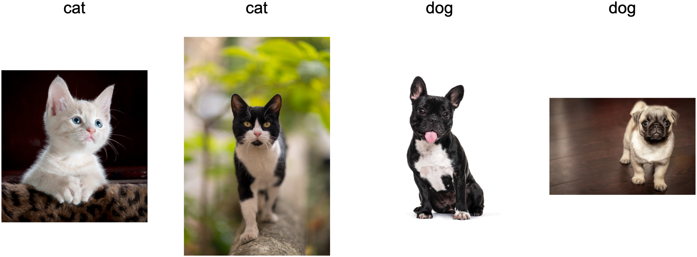

# Môi trường và Dịch chuyển Phân phối

Trong các phần trước, chúng ta đã làm việc qua
một số ứng dụng thực tế của machine learning,
khớp mô hình với nhiều loại bộ dữ liệu.
Tuy nhiên, chúng ta chưa bao giờ dừng lại để suy nghĩ
về việc dữ liệu đến từ đâu ban đầu
hay chúng ta cuối cùng định làm gì
với đầu ra từ mô hình của mình.
Quá thường xuyên, các nhà phát triển machine learning
trong tay có dữ liệu vội vã phát triển mô hình
mà không dừng lại để xem xét những vấn đề cơ bản này.

Nhiều triển khai machine learning thất bại
có thể được truy nguyên về sự thất bại này.
Đôi khi các mô hình có vẻ hoạt động tuyệt vời
được đo bằng độ chính xác tập kiểm tra
nhưng thất bại thảm hại khi triển khai
khi phân phối dữ liệu đột nhiên thay đổi.
Tinh tế hơn, đôi khi chính việc triển khai mô hình
có thể là chất xúc tác gây xáo trộn phân phối dữ liệu.
Giả sử, ví dụ, chúng ta đã huấn luyện mô hình
để dự đoán ai sẽ trả nợ thay vì vỡ nợ,
và thấy rằng lựa chọn giày dép của người nộp đơn
có liên quan đến rủi ro vỡ nợ
(giày Oxford chỉ ra trả nợ, giày thể thao chỉ ra vỡ nợ).
Chúng ta có thể có xu hướng
sau đó cấp khoản vay
cho bất kỳ người nộp đơn nào đeo giày Oxford
và từ chối tất cả người nộp đơn đeo giày thể thao.

Trong trường hợp này, bước nhảy vội vàng của chúng ta từ
nhận dạng mẫu sang ra quyết định
và sự thất bại trong việc xem xét nghiêm túc môi trường
có thể gây ra hậu quả thảm họa.
Để bắt đầu, ngay khi chúng ta bắt đầu
ra quyết định dựa trên giày dép,
khách hàng sẽ nhận ra và thay đổi hành vi của họ.
Trước lâu, tất cả người nộp đơn sẽ đeo giày Oxford,
mà không có bất kỳ cải thiện nào về mức độ tín dụng.
Hãy dành một phút để tiêu hóa điều này vì các vấn đề tương tự rất nhiều
trong nhiều ứng dụng machine learning:
bằng cách đưa ra các quyết định dựa trên mô hình cho môi trường,
chúng ta có thể phá vỡ mô hình.

Mặc dù chúng ta không thể xử lý những chủ đề này
một cách đầy đủ trong một phần,
chúng ta nhằm ở đây tiết lộ một số mối lo ngại phổ biến,
và kích thích tư duy phê phán
cần thiết để phát hiện sớm các tình huống như vậy,
giảm thiểu thiệt hại, và sử dụng machine learning có trách nhiệm.
Một số giải pháp đơn giản
(yêu cầu dữ liệu "đúng"),
một số khó về mặt kỹ thuật
(cài đặt hệ thống học tăng cường),
và một số đòi hỏi chúng ta bước ra ngoài lĩnh vực
dự đoán thống kê hoàn toàn và
vật lộn với các câu hỏi triết học khó khăn
liên quan đến ứng dụng đạo đức của thuật toán.

## Các Loại Dịch chuyển Phân phối

Để bắt đầu, chúng ta gắn bó với thiết lập dự đoán thụ động
xem xét các cách khác nhau mà phân phối dữ liệu có thể thay đổi
và những gì có thể được thực hiện để cứu vãn hiệu suất mô hình.
Trong một thiết lập cổ điển, chúng ta giả định rằng dữ liệu huấn luyện
được lấy mẫu từ phân phối $p_S(\mathbf{x},y)$ nào đó
nhưng dữ liệu kiểm tra của chúng ta sẽ bao gồm
các mẫu không có nhãn được rút từ
một phân phối khác $p_T(\mathbf{x},y)$.
Chúng ta đã phải đối mặt với thực tế đáng tỉnh táo.
Vắng mặt bất kỳ giả định nào về cách $p_S$
và $p_T$ liên quan đến nhau,
học một bộ phân loại mạnh mẽ là không thể.

Xem xét bài toán phân loại nhị phân,
khi chúng ta muốn phân biệt giữa chó và mèo.
Nếu phân phối có thể thay đổi theo cách tùy ý,
thì thiết lập của chúng ta cho phép trường hợp bệnh lý
trong đó phân phối đầu vào vẫn
không đổi: $p_S(\mathbf{x}) = p_T(\mathbf{x})$,
nhưng các nhãn đều bị lật ngược:
$p_S(y \mid \mathbf{x}) = 1 - p_T(y \mid \mathbf{x})$.
Nói cách khác, nếu Chúa có thể đột nhiên quyết định
rằng trong tương lai tất cả "mèo" bây giờ là chó
và những gì chúng ta trước đây gọi là "chó" bây giờ là mèo---mà không có
bất kỳ thay đổi nào trong phân phối đầu vào $p(\mathbf{x})$,
thì chúng ta không thể phân biệt thiết lập này
với một thiết lập mà phân phối không thay đổi chút nào.

May mắn thay, dưới một số giả định hạn chế
về cách dữ liệu của chúng ta có thể thay đổi trong tương lai,
các thuật toán có nguyên tắc có thể phát hiện dịch chuyển
và đôi khi thậm chí thích nghi ngay lập tức,
cải thiện độ chính xác của bộ phân loại ban đầu.

### Dịch chuyển Hiệp biến

Trong số các loại dịch chuyển phân phối,
dịch chuyển hiệp biến có thể được nghiên cứu rộng rãi nhất.
Ở đây, chúng ta giả định rằng trong khi phân phối đầu vào
có thể thay đổi theo thời gian, hàm gán nhãn,
tức là phân phối có điều kiện
$P(y \mid \mathbf{x})$ không thay đổi.
Các nhà thống kê gọi điều này là *dịch chuyển hiệp biến*
vì vấn đề phát sinh do
dịch chuyển trong phân phối của hiệp biến (đặc trưng).
Mặc dù đôi khi chúng ta có thể lý luận về dịch chuyển phân phối
mà không cần nhắc đến nhân quả, chúng ta lưu ý rằng dịch chuyển hiệp biến
là giả định tự nhiên để áp dụng trong các thiết lập
khi chúng ta tin rằng $\mathbf{x}$ gây ra $y$.

Hãy xem xét thách thức phân biệt mèo và chó.
Dữ liệu huấn luyện của chúng ta có thể bao gồm các ảnh như trong [fig_cat-dog-train](#fig_cat-dog-train).

Tại thời điểm kiểm tra, chúng ta được yêu cầu phân loại các ảnh trong [fig_cat-dog-test](#fig_cat-dog-test).

Tập huấn luyện bao gồm các ảnh chụp,
trong khi tập kiểm tra chỉ chứa các hoạt hình.
Huấn luyện trên bộ dữ liệu với đặc điểm khác biệt đáng kể
so với tập kiểm tra
có thể gây rắc rối nếu không có kế hoạch nhất quán
về cách thích nghi với miền mới.

### Dịch chuyển Nhãn

*Dịch chuyển nhãn* mô tả vấn đề ngược lại.
Ở đây, chúng ta giả định rằng phân phối biên nhãn $P(y)$
có thể thay đổi
nhưng phân phối có điều kiện lớp
$P(\mathbf{x} \mid y)$ vẫn cố định qua các miền.
Dịch chuyển nhãn là giả định hợp lý khi
chúng ta tin rằng $y$ gây ra $\mathbf{x}$.
Ví dụ, chúng ta có thể muốn dự đoán chẩn đoán
dựa trên triệu chứng của chúng (hoặc các biểu hiện khác),
ngay cả khi tần suất tương đối của chẩn đoán
đang thay đổi theo thời gian.
Dịch chuyển nhãn là giả định thích hợp ở đây
vì bệnh tật gây ra triệu chứng.
Trong một số trường hợp suy biến, giả định dịch chuyển nhãn
và dịch chuyển hiệp biến có thể đồng thời thỏa mãn.
Ví dụ, khi nhãn là xác định,
giả định dịch chuyển hiệp biến sẽ được thỏa mãn,
ngay cả khi $y$ gây ra $\mathbf{x}$.
Thú vị là, trong những trường hợp này,
thường có lợi khi làm việc với các phương pháp
xuất phát từ giả định dịch chuyển nhãn.
Đó là vì các phương pháp này có xu hướng
liên quan đến việc thao túng các đối tượng trông như nhãn (thường là ít chiều),
trái ngược với các đối tượng trông như đầu vào,
có xu hướng cao chiều trong deep learning.

### Dịch chuyển Khái niệm

Chúng ta cũng có thể gặp vấn đề liên quan *dịch chuyển khái niệm*,
phát sinh khi chính các định nghĩa của nhãn có thể thay đổi.
Điều này nghe có vẻ kỳ lạ---một *con mèo* là một *con mèo*, phải không?
Tuy nhiên, các danh mục khác phải chịu những thay đổi trong cách sử dụng theo thời gian.
Tiêu chí chẩn đoán bệnh tâm thần,
những gì được coi là hợp thời trang, và chức danh công việc,
đều phải chịu lượng đáng kể
dịch chuyển khái niệm.
Hóa ra nếu chúng ta đi khắp Hoa Kỳ,
dịch chuyển nguồn dữ liệu theo địa lý,
chúng ta sẽ tìm thấy dịch chuyển khái niệm đáng kể liên quan
phân phối tên gọi cho *đồ uống có ga*
như được hiển thị trong [fig_popvssoda](#fig_popvssoda).

:width:`400px`

Nếu chúng ta xây dựng hệ thống dịch máy,
phân phối $P(y \mid \mathbf{x})$ có thể khác nhau
tùy thuộc vào vị trí của chúng ta.
Vấn đề này có thể khó nhận ra.
Chúng ta có thể hy vọng khai thác kiến thức
rằng dịch chuyển chỉ diễn ra dần dần
theo nghĩa thời gian hoặc địa lý.

## Ví dụ về Dịch chuyển Phân phối

Trước khi đi vào các quy tắc chính thức và thuật toán,
chúng ta có thể thảo luận về một số tình huống cụ thể
mà dịch chuyển hiệp biến hoặc dịch chuyển khái niệm có thể không rõ ràng.

### Chẩn đoán Y tế

Hãy tưởng tượng bạn muốn thiết kế thuật toán để phát hiện ung thư.
Bạn thu thập dữ liệu từ người khỏe mạnh và bệnh nhân
và huấn luyện thuật toán của mình.
Nó hoạt động tốt, cho bạn độ chính xác cao
và bạn kết luận rằng bạn đã sẵn sàng
cho một sự nghiệp thành công trong chẩn đoán y tế.
*Không phải vậy.*

Các phân phối tạo ra dữ liệu huấn luyện
và những gì bạn sẽ gặp trong thực tế có thể khác nhau đáng kể.
Điều này xảy ra với một startup không may mắn
mà một số tác giả của chúng tôi đã làm việc cùng nhiều năm trước.
Họ đang phát triển xét nghiệm máu cho một bệnh
chủ yếu ảnh hưởng đến nam giới lớn tuổi
và hy vọng nghiên cứu nó bằng các mẫu máu
mà họ đã thu thập từ bệnh nhân.
Tuy nhiên, việc lấy mẫu máu từ nam giới khỏe mạnh
khó hơn nhiều so với bệnh nhân bệnh đã có trong hệ thống.
Để bù đắp, startup đã vận động
quyên góp máu từ sinh viên trên khuôn viên đại học
để làm đối chứng khỏe mạnh trong việc phát triển thử nghiệm của họ.
Sau đó họ hỏi liệu chúng ta có thể giúp họ
xây dựng bộ phân loại để phát hiện bệnh không.

Như chúng ta đã giải thích cho họ,
thực sự sẽ dễ dàng phân biệt
giữa nhóm khỏe mạnh và bệnh nhân
với độ chính xác gần hoàn hảo.
Tuy nhiên, đó là vì các đối tượng thử nghiệm
khác nhau về tuổi tác, mức hormone,
hoạt động thể chất, chế độ ăn uống, uống rượu,
và nhiều yếu tố khác không liên quan đến bệnh.
Điều này khó có khả năng xảy ra với bệnh nhân thực.
Do quy trình lấy mẫu của họ,
chúng ta có thể kỳ vọng gặp dịch chuyển hiệp biến cực độ.
Hơn nữa, trường hợp này khó có thể
được sửa chữa bằng các phương pháp thông thường.
Nói ngắn gọn, họ đã lãng phí một số tiền đáng kể.

### Xe Tự lái

Giả sử một công ty muốn tận dụng machine learning
để phát triển xe tự lái.
Một thành phần quan trọng ở đây là máy dò vệ đường.
Vì dữ liệu được chú thích thực sự đắt để lấy,
họ có ý tưởng (thông minh và đáng ngờ)
sử dụng dữ liệu tổng hợp từ engine kết xuất trò chơi
làm dữ liệu huấn luyện bổ sung.
Điều này hoạt động rất tốt trên "dữ liệu kiểm tra"
được rút từ engine kết xuất.
Thật không may, trong xe thực sự thì đó là thảm họa.
Hóa ra, vệ đường đã được kết xuất
với kết cấu rất đơn giản.
Quan trọng hơn, *tất cả* vệ đường đã được kết xuất
với *cùng một* kết cấu và máy dò vệ đường
đã học về "đặc trưng" này rất nhanh.

Điều tương tự cũng xảy ra với Quân đội Mỹ
khi họ lần đầu tiên cố gắng phát hiện xe tăng trong rừng.
Họ chụp ảnh hàng không của khu rừng không có xe tăng,
sau đó lái xe tăng vào rừng
và chụp một bộ ảnh khác.
Bộ phân loại có vẻ hoạt động *hoàn hảo*.
Thật không may, nó chỉ đơn giản là học
cách phân biệt cây có bóng
với cây không có bóng---bộ ảnh đầu tiên
được chụp vào buổi sáng sớm,
bộ thứ hai vào buổi trưa.

### Phân phối Không dừng

Một tình huống tinh tế hơn phát sinh
khi phân phối thay đổi chậm
(còn được gọi là *phân phối không dừng*)
và mô hình không được cập nhật đầy đủ.
Dưới đây là một số trường hợp điển hình.

* Chúng ta huấn luyện mô hình quảng cáo tính toán rồi không cập nhật nó thường xuyên (ví dụ: chúng ta quên tích hợp việc một thiết bị mới ít biết đến gọi là iPad vừa được ra mắt).
* Chúng ta xây dựng bộ lọc spam. Nó hoạt động tốt để phát hiện tất cả spam chúng ta đã thấy cho đến nay. Nhưng sau đó những kẻ spam trở nên thông minh hơn và tạo ra các tin nhắn mới trông khác hoàn toàn so với những gì chúng ta đã thấy trước đây.
* Chúng ta xây dựng hệ thống gợi ý sản phẩm. Nó hoạt động suốt mùa đông nhưng sau đó tiếp tục đề xuất mũ ông già Noel lâu sau Giáng sinh.

### Thêm Giai thoại

* Chúng ta xây dựng máy dò khuôn mặt. Nó hoạt động tốt trên tất cả benchmark. Thật không may, nó thất bại trên dữ liệu kiểm tra---các ví dụ vi phạm là ảnh cận cảnh khi khuôn mặt lấp đầy toàn bộ ảnh (không có dữ liệu như vậy trong tập huấn luyện).
* Chúng ta xây dựng công cụ tìm kiếm web cho thị trường Mỹ và muốn triển khai ở Anh.
* Chúng ta huấn luyện bộ phân loại ảnh bằng cách biên soạn bộ dữ liệu lớn trong đó mỗi lớp trong tập hợp lớn các lớp được đại diện bằng nhau trong bộ dữ liệu, chẳng hạn 1000 danh mục, mỗi danh mục được đại diện bởi 1000 ảnh. Sau đó chúng ta triển khai hệ thống trong thế giới thực, khi phân phối nhãn thực tế của ảnh rõ ràng là không đồng đều.

## Sửa chữa Dịch chuyển Phân phối

Như chúng ta đã thảo luận, có nhiều trường hợp
mà phân phối huấn luyện và kiểm tra
$P(\mathbf{x}, y)$ khác nhau.
Trong một số trường hợp, chúng ta may mắn và mô hình hoạt động
bất chấp dịch chuyển hiệp biến, nhãn, hoặc khái niệm.
Trong các trường hợp khác, chúng ta có thể làm tốt hơn bằng cách áp dụng
các chiến lược có nguyên tắc để đối phó với dịch chuyển.
Phần còn lại của phần này ngày càng kỹ thuật hơn.
Độc giả không kiên nhẫn có thể tiếp tục đến phần tiếp theo
vì tài liệu này không phải là điều kiện tiên quyết cho các khái niệm tiếp theo.

### Rủi ro Thực nghiệm và Rủi ro

Hãy đầu tiên phản ánh về chính xác
những gì đang xảy ra trong quá trình huấn luyện mô hình:
chúng ta lặp qua các đặc trưng và nhãn liên quan
của dữ liệu huấn luyện
$\{(\mathbf{x}_1, y_1), \ldots, (\mathbf{x}_n, y_n)\}$
và cập nhật tham số của mô hình $f$ sau mỗi minibatch.
Để đơn giản, chúng ta không xét chuẩn hóa,
do đó chúng ta phần lớn tối thiểu hóa mất mát trên huấn luyện:

$$\mathop{\mathrm{minimize}}_f \frac{1}{n} \sum_{i=1}^n l(f(\mathbf{x}_i), y_i),$$

trong đó $l$ là hàm mất mát
đo "mức độ tệ" của dự đoán $f(\mathbf{x}_i)$ với nhãn liên quan $y_i$.
Các nhà thống kê gọi thuật ngữ trong :eqref:`eq_empirical-risk-min` là *rủi ro thực nghiệm*.
*Rủi ro thực nghiệm* là mất mát trung bình trên dữ liệu huấn luyện
để xấp xỉ *rủi ro*,
là kỳ vọng của mất mát trên toàn bộ tổng thể dữ liệu được rút từ phân phối thực của chúng
$p(\mathbf{x},y)$:

$$E_{p(\mathbf{x}, y)} [l(f(\mathbf{x}), y)] = \int\int l(f(\mathbf{x}), y) p(\mathbf{x}, y) \;d\mathbf{x}dy.$$

Tuy nhiên, trong thực tế chúng ta thường không thể thu được toàn bộ tổng thể dữ liệu.
Do đó, *tối thiểu hóa rủi ro thực nghiệm*,
là tối thiểu hóa rủi ro thực nghiệm trong :eqref:`eq_empirical-risk-min`,
là chiến lược thực tế cho machine learning,
với hy vọng xấp xỉ
tối thiểu hóa rủi ro.

### Sửa chữa Dịch chuyển Hiệp biến

Giả sử chúng ta muốn ước tính
một số phụ thuộc $P(y \mid \mathbf{x})$
mà chúng ta có dữ liệu có nhãn $(\mathbf{x}_i, y_i)$.
Thật không may, các quan sát $\mathbf{x}_i$ được rút
từ một *phân phối nguồn* $q(\mathbf{x})$ nào đó
thay vì *phân phối mục tiêu* $p(\mathbf{x})$.
May mắn thay,
giả định phụ thuộc có nghĩa là
phân phối có điều kiện không thay đổi: $p(y \mid \mathbf{x}) = q(y \mid \mathbf{x})$.
Nếu phân phối nguồn $q(\mathbf{x})$ là "sai",
chúng ta có thể sửa chữa điều đó bằng cách sử dụng đồng nhất thức đơn giản sau trong rủi ro:

$$
\begin{aligned}
\int\int l(f(\mathbf{x}), y) p(y \mid \mathbf{x})p(\mathbf{x}) \;d\mathbf{x}dy =
\int\int l(f(\mathbf{x}), y) q(y \mid \mathbf{x})q(\mathbf{x})\frac{p(\mathbf{x})}{q(\mathbf{x})} \;d\mathbf{x}dy.
\end{aligned}
$$

Nói cách khác, chúng ta cần cân lại mỗi mẫu dữ liệu
bằng tỷ lệ của
xác suất
nó sẽ được rút từ phân phối đúng so với phân phối sai:

$$\beta_i \stackrel{\textrm{def}}{=} \frac{p(\mathbf{x}_i)}{q(\mathbf{x}_i)}.$$

Đưa trọng số $\beta_i$ vào
mỗi mẫu dữ liệu $(\mathbf{x}_i, y_i)$
chúng ta có thể huấn luyện mô hình bằng cách sử dụng
*tối thiểu hóa rủi ro thực nghiệm có trọng số*:

$$\mathop{\mathrm{minimize}}_f \frac{1}{n} \sum_{i=1}^n \beta_i l(f(\mathbf{x}_i), y_i).$$

Thật không may, chúng ta không biết tỷ lệ đó,
vì vậy trước khi chúng ta có thể làm bất cứ điều gì hữu ích chúng ta cần ước tính nó.
Nhiều phương pháp có sẵn,
bao gồm một số phương pháp lý thuyết toán tử ưa thích
cố gắng hiệu chỉnh lại toán tử kỳ vọng trực tiếp
bằng nguyên lý chuẩn tối thiểu hoặc entropy tối đa.
Lưu ý rằng với bất kỳ phương pháp nào như vậy, chúng ta cần mẫu
được rút từ cả hai phân phối---"thực" $p$, ví dụ
bằng cách truy cập dữ liệu kiểm tra, và cái được dùng
để tạo tập huấn luyện $q$ (cái sau dễ dàng có sẵn).
Lưu ý tuy nhiên rằng chúng ta chỉ cần đặc trưng $\mathbf{x} \sim p(\mathbf{x})$;
chúng ta không cần truy cập nhãn $y \sim p(y)$.

Trong trường hợp này, tồn tại một phương pháp rất hiệu quả
sẽ cho kết quả gần như tốt như bản gốc: cụ thể là hồi quy logistic,
là trường hợp đặc biệt của hồi quy softmax (xem [sec_softmax](#sec_softmax))
cho phân loại nhị phân.
Đây là tất cả những gì cần thiết để tính tỷ lệ xác suất ước tính.
Chúng ta học một bộ phân loại để phân biệt
giữa dữ liệu được rút từ $p(\mathbf{x})$
và dữ liệu được rút từ $q(\mathbf{x})$.
Nếu không thể phân biệt
giữa hai phân phối
thì điều đó có nghĩa là các mẫu liên quan
có xác suất đến từ
một trong hai phân phối đó bằng nhau.
Mặt khác, bất kỳ mẫu nào
có thể được phân biệt tốt
nên được cân nặng đáng kể
hoặc nhẹ đi tương ứng.

Để đơn giản hóa, giả sử chúng ta có
số lượng bằng nhau của các mẫu từ cả hai phân phối
$p(\mathbf{x})$
và $q(\mathbf{x})$, tương ứng.
Bây giờ ký hiệu bằng $z$ các nhãn là $1$
cho dữ liệu được rút từ $p$ và $-1$ cho dữ liệu được rút từ $q$.
Sau đó xác suất trong bộ dữ liệu hỗn hợp là:

$$P(z=1 \mid \mathbf{x}) = \frac{p(\mathbf{x})}{p(\mathbf{x})+q(\mathbf{x})} \textrm{ and hence } \frac{P(z=1 \mid \mathbf{x})}{P(z=-1 \mid \mathbf{x})} = \frac{p(\mathbf{x})}{q(\mathbf{x})}.$$

Vì vậy, nếu chúng ta sử dụng phương pháp hồi quy logistic,
khi $P(z=1 \mid \mathbf{x})=\frac{1}{1+\exp(-h(\mathbf{x}))}$ ($h$ là hàm được tham số hóa),
suy ra rằng

$$
\beta_i = \frac{1/(1 + \exp(-h(\mathbf{x}_i)))}{\exp(-h(\mathbf{x}_i))/(1 + \exp(-h(\mathbf{x}_i)))} = \exp(h(\mathbf{x}_i)).
$$

Kết quả là, chúng ta cần giải hai bài toán:
bài toán đầu tiên, phân biệt giữa
dữ liệu được rút từ cả hai phân phối,
và sau đó một bài toán tối thiểu hóa rủi ro thực nghiệm có trọng số
trong :eqref:`eq_weighted-empirical-risk-min`
khi chúng ta cân các thuật ngữ bởi $\beta_i$.

Bây giờ chúng ta đã sẵn sàng mô tả thuật toán sửa chữa.
Giả sử chúng ta có tập huấn luyện $\{(\mathbf{x}_1, y_1), \ldots, (\mathbf{x}_n, y_n)\}$ và tập kiểm tra không có nhãn $\{\mathbf{u}_1, \ldots, \mathbf{u}_m\}$.
Với dịch chuyển hiệp biến,
chúng ta giả định rằng $\mathbf{x}_i$ với mọi $1 \leq i \leq n$ được rút từ một phân phối nguồn nào đó
và $\mathbf{u}_i$ với mọi $1 \leq i \leq m$
được rút từ phân phối mục tiêu.
Đây là thuật toán điển hình
để sửa chữa dịch chuyển hiệp biến:

1. Tạo tập huấn luyện phân loại nhị phân: $\{(\mathbf{x}_1, -1), \ldots, (\mathbf{x}_n, -1), (\mathbf{u}_1, 1), \ldots, (\mathbf{u}_m, 1)\}$.
1. Huấn luyện bộ phân loại nhị phân bằng hồi quy logistic để có được hàm $h$.
1. Cân dữ liệu huấn luyện bằng $\beta_i = \exp(h(\mathbf{x}_i))$ hoặc tốt hơn $\beta_i = \min(\exp(h(\mathbf{x}_i)), c)$ với một hằng số $c$ nào đó.
1. Sử dụng trọng số $\beta_i$ để huấn luyện trên $\{(\mathbf{x}_1, y_1), \ldots, (\mathbf{x}_n, y_n)\}$ trong :eqref:`eq_weighted-empirical-risk-min`.

Lưu ý rằng thuật toán trên dựa trên một giả định quan trọng.
Để sơ đồ này hoạt động, chúng ta cần mỗi mẫu dữ liệu
trong phân phối mục tiêu (ví dụ: tại thời điểm kiểm tra)
có xác suất xảy ra khác không tại thời điểm huấn luyện.
Nếu chúng ta tìm thấy một điểm khi $p(\mathbf{x}) > 0$ nhưng $q(\mathbf{x}) = 0$,
thì trọng số tầm quan trọng tương ứng phải là vô cùng.

### Sửa chữa Dịch chuyển Nhãn

Giả sử chúng ta đang xử lý một
bài toán phân loại với $k$ danh mục.
Sử dụng cùng ký hiệu trong [subsec_covariate-shift-correction](#subsec_covariate-shift-correction),
$q$ và $p$ lần lượt là phân phối nguồn (ví dụ: tại thời điểm huấn luyện) và phân phối mục tiêu (ví dụ: tại thời điểm kiểm tra).
Giả sử phân phối nhãn thay đổi theo thời gian:
$q(y) \neq p(y)$, nhưng phân phối có điều kiện lớp
vẫn như cũ: $q(\mathbf{x} \mid y)=p(\mathbf{x} \mid y)$.
Nếu phân phối nguồn $q(y)$ là "sai",
chúng ta có thể sửa chữa điều đó
theo
đồng nhất thức sau trong rủi ro
như được định nghĩa trong
:eqref:`eq_true-risk`:

$$
\begin{aligned}
\int\int l(f(\mathbf{x}), y) p(\mathbf{x} \mid y)p(y) \;d\mathbf{x}dy =
\int\int l(f(\mathbf{x}), y) q(\mathbf{x} \mid y)q(y)\frac{p(y)}{q(y)} \;d\mathbf{x}dy.
\end{aligned}
$$

Ở đây, trọng số tầm quan trọng của chúng ta sẽ tương ứng với
tỷ lệ likelihood nhãn:

$$\beta_i \stackrel{\textrm{def}}{=} \frac{p(y_i)}{q(y_i)}.$$

Một điều tốt về dịch chuyển nhãn là
nếu chúng ta có mô hình khá tốt
trên phân phối nguồn,
thì chúng ta có thể nhận được các ước tính nhất quán của các trọng số này
mà không cần phải xử lý chiều không gian xung quanh.
Trong deep learning, đầu vào có xu hướng
là các đối tượng nhiều chiều như ảnh,
trong khi nhãn thường là các đối tượng đơn giản hơn như danh mục.

Để ước tính phân phối nhãn mục tiêu,
trước tiên chúng ta lấy bộ phân loại khá tốt có sẵn của mình
(thường được huấn luyện trên dữ liệu huấn luyện)
và tính ma trận "nhầm lẫn" của nó bằng tập kiểm định
(cũng từ phân phối huấn luyện).
*Ma trận nhầm lẫn*, $\mathbf{C}$, đơn giản là ma trận $k \times k$,
trong đó mỗi cột tương ứng với danh mục nhãn (sự thật cơ bản)
và mỗi hàng tương ứng với danh mục dự đoán của mô hình chúng ta.
Giá trị ô $c_{ij}$ là tỷ lệ tổng số dự đoán trên tập kiểm định
khi nhãn thực là $j$ và mô hình của chúng ta dự đoán $i$.

Bây giờ, chúng ta không thể tính ma trận nhầm lẫn
trực tiếp trên dữ liệu mục tiêu
vì chúng ta không thấy các nhãn cho các mẫu
mà chúng ta thấy trong thực tế,
trừ khi chúng ta đầu tư vào một pipeline chú thích thời gian thực phức tạp.
Những gì chúng ta có thể làm, tuy nhiên, là lấy trung bình tất cả dự đoán của mô hình
tại thời điểm kiểm tra với nhau, tạo ra đầu ra trung bình của mô hình $\mu(\hat{\mathbf{y}}) \in \mathbb{R}^k$,
trong đó phần tử thứ $i$ $\mu(\hat{y}_i)$
là tỷ lệ tổng số dự đoán trên tập kiểm tra
khi mô hình của chúng ta dự đoán $i$.

Hóa ra dưới một số điều kiện nhẹ---nếu
bộ phân loại của chúng ta khá chính xác ban đầu,
và nếu dữ liệu mục tiêu chỉ chứa các danh mục
mà chúng ta đã thấy trước đây,
và nếu giả định dịch chuyển nhãn thỏa mãn ban đầu
(giả định mạnh nhất ở đây)---chúng ta có thể ước tính phân phối nhãn tập kiểm tra
bằng cách giải một hệ tuyến tính đơn giản

$$\mathbf{C} p(\mathbf{y}) = \mu(\hat{\mathbf{y}}),$$

vì như một ước tính $\sum_{j=1}^k c_{ij} p(y_j) = \mu(\hat{y}_i)$ đúng với mọi $1 \leq i \leq k$,
trong đó $p(y_j)$ là phần tử thứ $j$ của vector phân phối nhãn $k$ chiều $p(\mathbf{y})$.
Nếu bộ phân loại của chúng ta đủ chính xác ban đầu,
thì ma trận nhầm lẫn $\mathbf{C}$ sẽ khả nghịch,
và chúng ta nhận được nghiệm $p(\mathbf{y}) = \mathbf{C}^{-1} \mu(\hat{\mathbf{y}})$.

Vì chúng ta quan sát các nhãn trên dữ liệu nguồn,
dễ dàng ước tính phân phối $q(y)$.
Sau đó, với bất kỳ mẫu huấn luyện $i$ nào có nhãn $y_i$,
chúng ta có thể lấy tỷ lệ của $p(y_i)/q(y_i)$ ước tính
để tính trọng số $\beta_i$,
và đưa điều này vào tối thiểu hóa rủi ro thực nghiệm có trọng số
trong :eqref:`eq_weighted-empirical-risk-min`.

### Sửa chữa Dịch chuyển Khái niệm

Dịch chuyển khái niệm khó sửa chữa hơn nhiều theo cách có nguyên tắc.
Ví dụ, trong tình huống mà đột nhiên bài toán thay đổi
từ phân biệt mèo và chó sang phân biệt
động vật trắng và đen,
sẽ không hợp lý khi giả định
rằng chúng ta có thể làm tốt hơn nhiều so với việc chỉ thu thập nhãn mới
và huấn luyện từ đầu.
May mắn thay, trong thực tế, những dịch chuyển cực đoan như vậy hiếm gặp.
Thay vào đó, những gì thường xảy ra là tác vụ tiếp tục thay đổi chậm.
Để làm rõ hơn, đây là một số ví dụ:

* Trong quảng cáo tính toán, các sản phẩm mới được ra mắt,
sản phẩm cũ trở nên kém phổ biến hơn. Điều này có nghĩa là phân phối quảng cáo và mức độ phổ biến của chúng thay đổi dần dần và bất kỳ bộ dự đoán tỷ lệ nhấp qua nào cũng cần thay đổi dần dần theo.
* Ống kính camera giao thông suy giảm dần dần do hao mòn môi trường, ảnh hưởng dần dần đến chất lượng ảnh.
* Nội dung tin tức thay đổi dần dần (tức là hầu hết tin tức vẫn không đổi nhưng xuất hiện các câu chuyện mới).

Trong những trường hợp như vậy, chúng ta có thể sử dụng cùng phương pháp mà chúng ta dùng để huấn luyện mạng để khiến chúng thích nghi với sự thay đổi trong dữ liệu. Nói cách khác, chúng ta sử dụng trọng số mạng hiện có và đơn giản thực hiện một vài bước cập nhật với dữ liệu mới thay vì huấn luyện từ đầu.

## Phân loại các Bài toán Học

Được trang bị kiến thức về cách xử lý các thay đổi trong phân phối, bây giờ chúng ta có thể xem xét một số khía cạnh khác của công thức bài toán machine learning.

### Học Batch

Trong *học batch*, chúng ta có quyền truy cập vào các đặc trưng và nhãn huấn luyện $\{(\mathbf{x}_1, y_1), \ldots, (\mathbf{x}_n, y_n)\}$, mà chúng ta sử dụng để huấn luyện mô hình $f(\mathbf{x})$. Sau đó, chúng ta triển khai mô hình này để chấm điểm dữ liệu mới $(\mathbf{x}, y)$ được rút từ cùng một phân phối. Đây là giả định mặc định cho bất kỳ bài toán nào chúng ta thảo luận ở đây. Ví dụ, chúng ta có thể huấn luyện máy dò mèo dựa trên nhiều ảnh của mèo và chó. Một khi chúng ta huấn luyện xong, chúng ta vận chuyển nó như một phần của hệ thống thị giác máy tính cửa thông minh cho mèo chỉ cho phép mèo vào. Sau đó nó được lắp đặt trong nhà của khách hàng và không bao giờ được cập nhật lại (ngoại trừ trường hợp cực đoan).

### Học Trực tuyến

Bây giờ hãy tưởng tượng rằng dữ liệu $(\mathbf{x}_i, y_i)$ đến từng mẫu một. Cụ thể hơn, giả sử chúng ta đầu tiên quan sát $\mathbf{x}_i$, sau đó chúng ta cần đưa ra ước tính $f(\mathbf{x}_i)$. Chỉ sau khi chúng ta làm điều này mới quan sát $y_i$ và nhận phần thưởng hoặc chịu mất mát, với quyết định của chúng ta.
Nhiều vấn đề thực tế thuộc danh mục này. Ví dụ, chúng ta cần dự đoán giá cổ phiếu ngày mai, cho phép chúng ta giao dịch dựa trên ước tính đó và cuối ngày chúng ta tìm hiểu xem ước tính của mình có tạo ra lợi nhuận không. Nói cách khác, trong *học trực tuyến*, chúng ta có chu kỳ sau khi chúng ta liên tục cải thiện mô hình dựa trên các quan sát mới:

$$\begin{aligned}&\textrm{model } f_t \longrightarrow \textrm{data }  \mathbf{x}_t \longrightarrow \textrm{estimate } f_t(\mathbf{x}_t) \longrightarrow\\ \textrm{obs}&\textrm{ervation } y_t \longrightarrow \textrm{loss } l(y_t, f_t(\mathbf{x}_t)) \longrightarrow \textrm{model } f_{t+1}\end{aligned}$$

### Bandits

*Bandit* là trường hợp đặc biệt của bài toán trên. Trong khi ở hầu hết các bài toán học chúng ta có hàm được tham số hóa liên tục $f$ mà chúng ta muốn học tham số của nó (ví dụ: mạng sâu), trong bài toán *bandit* chúng ta chỉ có một số hữu hạn các cánh tay mà chúng ta có thể kéo, tức là một số hữu hạn hành động mà chúng ta có thể thực hiện. Không có gì đáng ngạc nhiên khi với bài toán đơn giản hơn này, các đảm bảo lý thuyết mạnh hơn về tính tối ưu có thể được thu được. Chúng ta liệt kê nó chủ yếu vì bài toán này thường (gây nhầm lẫn) được xử lý như thể nó là một thiết lập học khác biệt.

### Điều khiển

Trong nhiều trường hợp môi trường nhớ những gì chúng ta đã làm. Không nhất thiết theo cách thù địch nhưng nó sẽ chỉ nhớ và phản ứng sẽ phụ thuộc vào những gì đã xảy ra trước đó. Ví dụ, bộ điều khiển nồi hơi cà phê sẽ quan sát các nhiệt độ khác nhau tùy thuộc vào việc nó có đang làm nóng nồi hơi trước đó không. Các thuật toán bộ điều khiển PID (tỷ lệ-tích phân-đạo hàm) là lựa chọn phổ biến ở đó.
Tương tự, hành vi của người dùng trên trang tin tức sẽ phụ thuộc vào những gì chúng ta đã hiển thị cho họ trước đó (ví dụ: họ sẽ đọc hầu hết tin tức chỉ một lần). Nhiều thuật toán như vậy tạo thành mô hình của môi trường mà chúng hành động để làm cho các quyết định của chúng ít ngẫu nhiên hơn.
Gần đây,
lý thuyết điều khiển (ví dụ: các biến thể PID) cũng đã được sử dụng
để tự động điều chỉnh siêu tham số
để đạt được chất lượng tách rời và tái tạo tốt hơn,
và cải thiện sự đa dạng của văn bản được tạo ra và chất lượng tái tạo của ảnh được tạo ra [Shao.Yao.Sun.ea.2020].

### Học Tăng cường

Trong trường hợp tổng quát hơn của môi trường có bộ nhớ, chúng ta có thể gặp các tình huống khi môi trường đang cố gắng hợp tác với chúng ta (trò chơi hợp tác, đặc biệt cho các trò chơi tổng không bằng không), hoặc những trường hợp khi môi trường sẽ cố gắng thắng. Cờ vua, cờ vây, Backgammon, hoặc StarCraft là một số trường hợp trong *học tăng cường*. Tương tự, chúng ta có thể muốn xây dựng bộ điều khiển tốt cho xe tự lái. Các xe khác có thể sẽ phản ứng với phong cách lái của xe tự lái theo những cách không tầm thường, ví dụ: cố gắng tránh nó, cố gắng gây tai nạn, hoặc cố gắng hợp tác với nó.

### Xem xét Môi trường

Một sự khác biệt quan trọng giữa các tình huống khác nhau ở trên là chiến lược có thể hoạt động xuyên suốt trong trường hợp môi trường ổn định, có thể không hoạt động xuyên suốt trong môi trường có thể thích nghi. Ví dụ, một cơ hội chênh lệch giá được phát hiện bởi một nhà giao dịch có thể biến mất ngay khi nó bị khai thác. Tốc độ và cách thức môi trường thay đổi quyết định phần lớn loại thuật toán chúng ta có thể sử dụng. Ví dụ, nếu chúng ta biết rằng mọi thứ có thể chỉ thay đổi chậm, chúng ta có thể buộc bất kỳ ước tính nào cũng chỉ thay đổi chậm. Nếu chúng ta biết rằng môi trường có thể thay đổi ngay lập tức, nhưng rất hiếm khi, chúng ta có thể tính toán cho điều đó. Những loại kiến thức này rất quan trọng cho nhà khoa học dữ liệu đầy tham vọng trong việc xử lý dịch chuyển khái niệm, tức là khi bài toán đang được giải quyết có thể thay đổi theo thời gian.

## Công bằng, Trách nhiệm và Minh bạch trong Machine Learning

Cuối cùng, điều quan trọng cần nhớ
là khi bạn triển khai các hệ thống machine learning
bạn không chỉ tối ưu hóa một mô hình dự đoán---bạn
thường cung cấp một công cụ sẽ được
sử dụng để (một phần hoặc toàn phần) tự động hóa các quyết định.
Các hệ thống kỹ thuật này có thể ảnh hưởng đến cuộc sống
của các cá nhân là đối tượng của các quyết định kết quả.
Bước nhảy từ xem xét dự đoán sang ra quyết định
không chỉ đặt ra những câu hỏi kỹ thuật mới,
mà còn một loạt câu hỏi đạo đức
phải được xem xét cẩn thận.
Nếu chúng ta đang triển khai hệ thống chẩn đoán y tế,
chúng ta cần biết cho dân số nào
nó có thể hoạt động và cho dân số nào thì không.
Bỏ qua các rủi ro có thể thấy trước đối với phúc lợi của
một dân số con có thể khiến chúng ta thực hiện chăm sóc kém chất lượng.
Hơn nữa, một khi chúng ta suy nghĩ về các hệ thống ra quyết định,
chúng ta phải lùi lại và xem xét lại cách chúng ta đánh giá công nghệ của mình.
Trong số các hậu quả khác của sự thay đổi phạm vi này,
chúng ta sẽ thấy rằng *độ chính xác* hiếm khi là thước đo đúng.
Ví dụ, khi dịch dự đoán thành hành động,
chúng ta thường muốn tính đến
độ nhạy chi phí tiềm năng của việc sai theo nhiều cách khác nhau.
Nếu một cách phân loại sai ảnh
có thể được nhận thức là một cú lách luật chủng tộc,
trong khi phân loại sai sang danh mục khác
sẽ vô hại, thì chúng ta có thể muốn điều chỉnh
ngưỡng của mình tương ứng, tính đến các giá trị xã hội
trong thiết kế giao thức ra quyết định.
Chúng ta cũng muốn cẩn thận về
cách các hệ thống dự đoán có thể dẫn đến các vòng phản hồi.
Ví dụ, hãy xem xét các hệ thống cảnh sát dự báo,
phân bổ sĩ quan tuần tra
cho các khu vực có tội phạm dự báo cao.
Dễ dàng thấy một mẫu đáng lo ngại có thể xuất hiện:

 1. Các khu dân cư có nhiều tội phạm hơn nhận được nhiều tuần tra hơn.
 1. Do đó, nhiều tội phạm hơn được phát hiện ở những khu dân cư này, đưa vào dữ liệu huấn luyện có sẵn cho các lần lặp trong tương lai.
 1. Được tiếp xúc với nhiều mẫu dương hơn, mô hình dự đoán nhiều tội phạm hơn ở những khu dân cư này.
 1. Trong lần lặp tiếp theo, mô hình cập nhật nhắm vào cùng khu dân cư nặng hơn dẫn đến nhiều tội phạm được phát hiện hơn nữa, v.v.

Thường xuyên, các cơ chế khác nhau theo đó
dự đoán của mô hình trở nên gắn kết với dữ liệu huấn luyện của nó
không được tính đến trong quá trình mô hình hóa.
Điều này có thể dẫn đến những gì các nhà nghiên cứu gọi là *vòng phản hồi bùng phát*.
Ngoài ra, chúng ta muốn cẩn thận về
việc liệu chúng ta có đang giải quyết đúng bài toán ngay từ đầu hay không.
Các thuật toán dự đoán bây giờ đóng vai trò ngoại cỡ
trong việc trung gian hóa việc phổ biến thông tin.
Liệu tin tức mà một cá nhân gặp
có nên được xác định bởi tập hợp các trang Facebook mà họ đã *Like* không?
Đây chỉ là một số ít trong số nhiều tình huống đạo đức khẩn cấp
mà bạn có thể gặp trong sự nghiệp machine learning.

## Tóm tắt

Trong nhiều trường hợp, tập huấn luyện và kiểm tra không đến từ cùng một phân phối. Điều này được gọi là dịch chuyển phân phối.
Rủi ro là kỳ vọng của mất mát trên toàn bộ tổng thể dữ liệu được rút từ phân phối thực của chúng. Tuy nhiên, toàn bộ tổng thể này thường không có sẵn. Rủi ro thực nghiệm là mất mát trung bình trên dữ liệu huấn luyện để xấp xỉ rủi ro. Trong thực tế, chúng ta thực hiện tối thiểu hóa rủi ro thực nghiệm.

Dưới các giả định tương ứng, dịch chuyển hiệp biến và nhãn có thể được phát hiện và sửa chữa tại thời điểm kiểm tra. Không tính đến sự thiên lệch này có thể trở nên có vấn đề tại thời điểm kiểm tra.
Trong một số trường hợp, môi trường có thể nhớ các hành động tự động và phản ứng theo những cách bất ngờ. Chúng ta phải tính đến khả năng này khi xây dựng mô hình và tiếp tục theo dõi các hệ thống trực tiếp, mở với khả năng rằng các mô hình và môi trường của chúng ta sẽ trở nên đan xen theo những cách không lường trước.

## Bài tập

1. Điều gì có thể xảy ra khi chúng ta thay đổi hành vi của một công cụ tìm kiếm? Người dùng có thể làm gì? Còn nhà quảng cáo thì sao?
1. Cài đặt một máy dò dịch chuyển hiệp biến. Gợi ý: xây dựng một bộ phân loại.
1. Cài đặt một bộ sửa chữa dịch chuyển hiệp biến.
1. Ngoài dịch chuyển phân phối, còn gì khác có thể ảnh hưởng đến cách rủi ro thực nghiệm xấp xỉ rủi ro?

[Discussions](https://discuss.d2l.ai/t/105)
