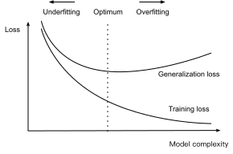

# Tổng quát hóa

Hãy xem xét hai sinh viên đại học đang ôn thi cuối kỳ một cách chăm chỉ.
Thông thường, việc ôn thi này bao gồm
luyện tập và kiểm tra khả năng của họ
bằng cách làm các đề thi từ các năm trước.
Tuy nhiên, làm tốt các bài thi cũ không đảm bảo
rằng họ sẽ xuất sắc khi đến lúc thực sự thi.
Chẳng hạn, hãy tưởng tượng một sinh viên, Ellie Phi thường,
việc ôn thi của cô hoàn toàn bao gồm
việc ghi nhớ các câu trả lời
cho các câu hỏi thi từ các năm trước.
Dù Ellie có
một trí nhớ phi thường,
và do đó có thể nhớ lại hoàn hảo câu trả lời
cho bất kỳ câu hỏi *đã thấy trước đó* nào,
cô vẫn có thể bị đóng băng
khi đối mặt với một câu hỏi mới (*chưa từng thấy trước đó*).
Để so sánh, hãy tưởng tượng một sinh viên khác,
Irene Quy nạp, có kỹ năng ghi nhớ
tương đối kém,
nhưng có năng khiếu nhận ra các mẫu.
Lưu ý rằng nếu bài thi thực sự bao gồm
các câu hỏi tái sử dụng từ năm trước,
Ellie sẽ dễ dàng vượt trội hơn Irene.
Ngay cả khi các mẫu Irene suy ra
cho độ chính xác dự đoán 90%,
chúng không bao giờ có thể cạnh tranh với
100% nhớ lại của Ellie.
Tuy nhiên, ngay cả khi bài thi bao gồm
toàn bộ các câu hỏi mới,
Irene vẫn có thể duy trì trung bình 90% của mình.

Là các nhà khoa học machine learning,
mục tiêu của ta là khám phá *các mẫu*.
Nhưng làm sao ta có thể chắc chắn rằng ta đã
thực sự khám phá một mẫu *tổng quát*
và không chỉ đơn giản là ghi nhớ dữ liệu?
Hầu hết thời gian, dự đoán của ta chỉ hữu ích
nếu mô hình khám phá được mẫu như vậy.
Ta không muốn dự đoán giá cổ phiếu hôm qua, mà là ngày mai.
Ta không cần nhận dạng
các bệnh đã được chẩn đoán
cho những bệnh nhân đã từng gặp,
mà là các bệnh chưa được chẩn đoán trước đó
ở những bệnh nhân chưa từng gặp trước đó.
Vấn đề này---làm thế nào để khám phá các mẫu có thể *tổng quát hóa*---là
bài toán cơ bản của machine learning,
và có thể nói là của toàn bộ thống kê.
Ta có thể đặt bài toán này chỉ là một phần
của một câu hỏi vĩ đại hơn
bao trùm toàn bộ khoa học:
khi nào ta được biện hộ
để thực hiện bước nhảy từ những quan sát cụ thể
đến những tuyên bố tổng quát hơn?

Trong cuộc sống thực, ta phải khớp mô hình
bằng cách sử dụng một tập dữ liệu hữu hạn.
Quy mô điển hình của dữ liệu đó
thay đổi rất nhiều giữa các lĩnh vực.
Với nhiều bài toán y tế quan trọng,
ta chỉ có thể tiếp cận vài nghìn điểm dữ liệu.
Khi nghiên cứu các bệnh hiếm gặp,
ta có thể may mắn tiếp cận được vài trăm điểm.
Ngược lại, các tập dữ liệu công khai lớn nhất
bao gồm ảnh có nhãn,
ví dụ, ImageNet [Deng.Dong.Socher.ea.2009],
chứa hàng triệu ảnh.
Và một số bộ sưu tập ảnh không có nhãn
như tập dữ liệu Flickr YFC100M
thậm chí còn lớn hơn, chứa
hơn 100 triệu ảnh [thomee2016yfcc100m].
Tuy nhiên, ngay cả ở quy mô cực đoan này,
số điểm dữ liệu có sẵn
vẫn là cực kỳ nhỏ
so với không gian của tất cả các ảnh có thể có
ở độ phân giải megapixel.
Bất cứ khi nào ta làm việc với các mẫu hữu hạn,
ta phải ghi nhớ nguy cơ
rằng ta có thể khớp dữ liệu huấn luyện,
chỉ để phát hiện ra rằng ta đã thất bại
trong việc khám phá một mẫu có thể tổng quát hóa.

Hiện tượng khớp gần với dữ liệu huấn luyện hơn
so với phân phối nền tảng được gọi là *quá khớp*,
và các kỹ thuật chống lại quá khớp
thường được gọi là các phương pháp *chuẩn hóa*.
Mặc dù đây không phải là sự thay thế cho một giới thiệu đúng đắn
về lý thuyết học thống kê (xem Vapnik98,boucheron2005theory),
ta sẽ cho bạn đủ trực giác để bắt đầu.
Ta sẽ xem lại tổng quát hóa trong nhiều chương
xuyên suốt cuốn sách,
khám phá cả những gì đã biết về
các nguyên tắc nền tảng tổng quát hóa
trong các mô hình khác nhau,
cũng như các kỹ thuật heuristic
đã được tìm thấy (theo kinh nghiệm)
mang lại tổng quát hóa tốt hơn
cho các tác vụ quan tâm thực tế.

## Sai số Huấn luyện và Sai số Tổng quát hóa

Trong thiết lập học có giám sát tiêu chuẩn,
ta giả định rằng dữ liệu huấn luyện và dữ liệu kiểm tra
được rút ra *độc lập* từ các phân phối *giống hệt*.
Điều này thường được gọi là *giả định IID*.
Mặc dù giả định này mạnh,
đáng lưu ý rằng, nếu không có giả định như vậy,
ta sẽ hoàn toàn bất lực.
Tại sao ta nên tin rằng dữ liệu huấn luyện
được lấy mẫu từ phân phối $P(X,Y)$
nên cho ta biết cách đưa ra dự đoán trên
dữ liệu kiểm tra được tạo bởi *phân phối khác* $Q(X,Y)$?
Thực hiện những bước nhảy như vậy hóa ra đòi hỏi
các giả định mạnh về cách $P$ và $Q$ liên quan.
Về sau ta sẽ thảo luận về một số giả định
cho phép phân phối dịch chuyển
nhưng trước tiên ta cần hiểu trường hợp IID,
trong đó $P(\cdot) = Q(\cdot)$.

Để bắt đầu, ta cần phân biệt giữa
*sai số huấn luyện* $R_\textrm{emp}$,
là một *thống kê*
được tính trên tập dữ liệu huấn luyện,
và *sai số tổng quát hóa* $R$,
là một *kỳ vọng*
theo phân phối nền tảng.
Ta có thể nghĩ sai số tổng quát hóa là
những gì bạn sẽ thấy nếu bạn áp dụng mô hình của mình
cho một dòng vô tận các mẫu dữ liệu bổ sung
được rút ra từ cùng phân phối dữ liệu nền tảng.
Chính thức, sai số huấn luyện được biểu diễn là một *tổng* (với ký hiệu tương tự như [sec_linear_regression](#sec_linear_regression)):

$$R_\textrm{emp}[\mathbf{X}, \mathbf{y}, f] = \frac{1}{n} \sum_{i=1}^n l(\mathbf{x}^{(i)}, y^{(i)}, f(\mathbf{x}^{(i)})),$$

trong khi sai số tổng quát hóa được biểu diễn là một tích phân:

$$R[p, f] = E_{(\mathbf{x}, y) \sim P} [l(\mathbf{x}, y, f(\mathbf{x}))] =
\int \int l(\mathbf{x}, y, f(\mathbf{x})) p(\mathbf{x}, y) \;d\mathbf{x} dy.$$

Vấn đề là ta không bao giờ có thể tính chính xác
sai số tổng quát hóa $R$.
Không ai bao giờ cho ta biết dạng chính xác
của hàm mật độ $p(\mathbf{x}, y)$.
Hơn nữa, ta không thể lấy mẫu vô tận các điểm dữ liệu.
Do đó, trong thực tế, ta phải *ước lượng* sai số tổng quát hóa
bằng cách áp dụng mô hình của ta cho một tập kiểm tra độc lập
bao gồm một lựa chọn ngẫu nhiên các mẫu
$\mathbf{X}'$ và nhãn $\mathbf{y}'$
được giữ lại khỏi tập huấn luyện của ta.
Điều này bao gồm áp dụng cùng công thức
được dùng để tính sai số huấn luyện thực nghiệm
nhưng cho tập kiểm tra $\mathbf{X}', \mathbf{y}'$.

Điều quan trọng là, khi ta đánh giá bộ phân loại trên tập kiểm tra,
ta đang làm việc với bộ phân loại *cố định*
(nó không phụ thuộc vào mẫu của tập kiểm tra),
và do đó ước lượng sai số của nó
đơn giản chỉ là bài toán ước lượng trung bình.
Tuy nhiên điều tương tự không thể nói về
tập huấn luyện.
Lưu ý rằng mô hình ta kết thúc với
phụ thuộc rõ ràng vào lựa chọn tập huấn luyện
và do đó sai số huấn luyện nói chung
sẽ là ước lượng lệch của sai số thực sự
trên quần thể nền tảng.
Câu hỏi trung tâm của tổng quát hóa
là khi nào ta nên kỳ vọng sai số huấn luyện của mình
gần với sai số quần thể
(và do đó sai số tổng quát hóa).

### Độ Phức tạp Mô hình

Trong lý thuyết cổ điển, khi ta có
các mô hình đơn giản và dữ liệu phong phú,
sai số huấn luyện và tổng quát hóa có xu hướng gần nhau.
Tuy nhiên, khi ta làm việc với
các mô hình phức tạp hơn và/hoặc ít mẫu hơn,
ta kỳ vọng sai số huấn luyện giảm xuống
nhưng khoảng cách tổng quát hóa tăng lên.
Điều này không nên gây ngạc nhiên.
Hãy tưởng tượng một lớp mô hình biểu cảm đến mức
với bất kỳ tập dữ liệu nào gồm $n$ mẫu,
ta có thể tìm thấy một tập tham số
có thể khớp hoàn hảo với các nhãn tùy ý,
ngay cả khi được gán ngẫu nhiên.
Trong trường hợp này, ngay cả khi ta khớp dữ liệu huấn luyện hoàn hảo,
làm sao ta có thể kết luận bất cứ điều gì về sai số tổng quát hóa?
Theo những gì ta biết, sai số tổng quát hóa của ta
có thể không tốt hơn đoán ngẫu nhiên.

Nói chung, nếu không có bất kỳ hạn chế nào về lớp mô hình,
ta không thể kết luận, chỉ dựa trên khớp dữ liệu huấn luyện,
rằng mô hình của ta đã khám phá bất kỳ mẫu nào có thể tổng quát hóa [vapnik1994measuring].
Mặt khác, nếu lớp mô hình của ta
không có khả năng khớp với các nhãn tùy ý,
thì nó phải đã khám phá ra một mẫu.
Các ý tưởng lý thuyết học về độ phức tạp mô hình
lấy một số cảm hứng từ ý tưởng
của Karl Popper, một nhà triết học khoa học có ảnh hưởng,
người đã chính thức hóa tiêu chí của khả năng bác bỏ.
Theo Popper, một lý thuyết
có thể giải thích bất kỳ và tất cả quan sát
hoàn toàn không phải là một lý thuyết khoa học!
Dù sao, nó đã cho ta biết gì về thế giới
nếu nó không loại trừ bất kỳ khả năng nào?
Tóm lại, điều ta muốn là một giả thuyết
*không thể* giải thích bất kỳ quan sát nào
ta có thể hình dung sẽ thực hiện
nhưng vẫn tương thích
với những quan sát ta *thực tế* thực hiện.

Bây giờ, điều gì chính xác tạo thành khái niệm phù hợp
về độ phức tạp mô hình là một vấn đề phức tạp.
Thường thì, các mô hình có nhiều tham số hơn
có thể khớp với số lượng lớn hơn
các nhãn được gán tùy ý.
Tuy nhiên, điều này không nhất thiết đúng.
Chẳng hạn, các phương pháp kernel hoạt động trong không gian
với số lượng tham số vô hạn,
nhưng độ phức tạp của chúng được kiểm soát
bằng các phương tiện khác [Scholkopf.Smola.2002].
Một khái niệm về độ phức tạp thường tỏ ra hữu ích
là phạm vi giá trị mà các tham số có thể nhận.
Ở đây, một mô hình mà các tham số được phép
nhận các giá trị tùy ý
sẽ phức tạp hơn.
Ta sẽ xem lại ý tưởng này trong phần tiếp theo,
khi ta giới thiệu *suy giảm trọng số*,
kỹ thuật chuẩn hóa thực tế đầu tiên của bạn.
Đáng chú ý, việc so sánh
độ phức tạp giữa các thành viên của các lớp mô hình khác biệt đáng kể
(chẳng hạn, cây quyết định so với mạng nơ-ron) có thể khó.

Tại thời điểm này, ta phải nhấn mạnh một điểm quan trọng khác
mà ta sẽ xem lại khi giới thiệu các mạng nơ-ron sâu.
Khi một mô hình có khả năng khớp với các nhãn tùy ý,
sai số huấn luyện thấp không nhất thiết
ngụ ý sai số tổng quát hóa thấp.
*Tuy nhiên, nó cũng không nhất thiết
ngụ ý sai số tổng quát hóa cao!*
Tất cả những gì ta có thể khẳng định chắc chắn là
sai số huấn luyện thấp một mình là không đủ
để chứng nhận sai số tổng quát hóa thấp.
Các mạng nơ-ron sâu hóa ra là những mô hình như vậy:
trong khi chúng tổng quát hóa tốt trong thực tế,
chúng quá mạnh để cho phép ta kết luận
nhiều điều chỉ dựa trên sai số huấn luyện.
Trong những trường hợp này ta phải dựa nhiều hơn
vào dữ liệu giữ lại để chứng nhận tổng quát hóa
sau thực tế.
Sai số trên dữ liệu giữ lại, tức là tập kiểm định,
được gọi là *sai số kiểm định*.

## Dưới khớp hay Quá khớp?

Khi ta so sánh sai số huấn luyện và kiểm định,
ta muốn chú ý đến hai tình huống phổ biến.
Đầu tiên, ta muốn cảnh giác với các trường hợp
khi cả sai số huấn luyện và kiểm định của ta đều đáng kể
nhưng có một khoảng cách nhỏ giữa chúng.
Nếu mô hình không thể giảm sai số huấn luyện,
điều đó có thể có nghĩa là mô hình của ta quá đơn giản
(tức là không đủ biểu cảm)
để nắm bắt mẫu ta đang cố mô hình.
Hơn nữa, vì *khoảng cách tổng quát hóa* ($R_\textrm{emp} - R$)
giữa sai số huấn luyện và tổng quát hóa của ta nhỏ,
ta có lý do để tin rằng ta có thể sử dụng một mô hình phức tạp hơn.
Hiện tượng này được gọi là *dưới khớp*.

Mặt khác, như đã thảo luận ở trên,
ta muốn cảnh giác với các trường hợp
khi sai số huấn luyện của ta thấp hơn đáng kể
so với sai số kiểm định, cho thấy *quá khớp* nghiêm trọng.
Lưu ý rằng quá khớp không phải lúc nào cũng là điều xấu.
Trong deep learning đặc biệt,
các mô hình dự đoán tốt nhất thường hoạt động
tốt hơn nhiều trên dữ liệu huấn luyện so với dữ liệu giữ lại.
Cuối cùng, ta thường quan tâm đến
việc đưa sai số tổng quát hóa xuống thấp hơn,
và chỉ quan tâm đến khoảng cách ở mức độ
nó trở thành một trở ngại cho mục tiêu đó.
Lưu ý rằng nếu sai số huấn luyện bằng không,
thì khoảng cách tổng quát hóa chính xác bằng sai số tổng quát hóa
và ta chỉ có thể tiến bộ bằng cách giảm khoảng cách.

### Khớp Đường Cong Đa thức

Để minh họa một số trực giác cổ điển
về quá khớp và độ phức tạp mô hình,
hãy xem xét điều sau:
cho dữ liệu huấn luyện bao gồm một đặc trưng duy nhất $x$
và một nhãn có giá trị thực tương ứng $y$,
ta cố gắng tìm đa thức bậc $d$

$$\hat{y}= \sum_{i=0}^d x^i w_i$$

để ước lượng nhãn $y$.
Đây chỉ là bài toán hồi quy tuyến tính
trong đó các đặc trưng của ta được cho bởi lũy thừa của $x$,
trọng số của mô hình được cho bởi $w_i$,
và hệ số chặn được cho bởi $w_0$ vì $x^0 = 1$ với mọi $x$.
Vì đây chỉ là bài toán hồi quy tuyến tính,
ta có thể dùng sai số bình phương làm hàm mất mát.

Hàm đa thức bậc cao hơn phức tạp hơn
hàm đa thức bậc thấp hơn,
vì đa thức bậc cao hơn có nhiều tham số hơn
và phạm vi lựa chọn hàm mô hình rộng hơn.
Cố định tập dữ liệu huấn luyện,
các hàm đa thức bậc cao hơn luôn phải
đạt được sai số huấn luyện thấp hơn (ở mức tệ nhất là bằng nhau)
so với các đa thức bậc thấp hơn.
Thực tế, bất cứ khi nào mỗi mẫu dữ liệu
có giá trị $x$ khác nhau,
một hàm đa thức với bậc
bằng số mẫu dữ liệu
có thể khớp hoàn hảo với tập huấn luyện.
Ta so sánh mối quan hệ giữa bậc đa thức (độ phức tạp mô hình)
và cả dưới khớp và quá khớp trong [fig_capacity_vs_error](#fig_capacity_vs_error).

### Kích thước Tập dữ liệu

Như giới hạn trên đã chỉ ra,
một xem xét quan trọng khác
cần ghi nhớ là kích thước tập dữ liệu.
Cố định mô hình, ta càng có ít mẫu
trong tập dữ liệu huấn luyện,
ta càng có nhiều khả năng (và nghiêm trọng hơn)
gặp phải quá khớp.
Khi ta tăng lượng dữ liệu huấn luyện,
sai số tổng quát hóa thường giảm.
Hơn nữa, nói chung, nhiều dữ liệu hơn không bao giờ gây hại.
Với một tác vụ và phân phối dữ liệu cố định,
độ phức tạp mô hình không nên tăng
nhanh hơn lượng dữ liệu.
Cho nhiều dữ liệu hơn, ta có thể thử
khớp một mô hình phức tạp hơn.
Khi không có đủ dữ liệu, các mô hình đơn giản hơn
có thể khó vượt qua hơn.
Với nhiều tác vụ, deep learning
chỉ vượt trội so với các mô hình tuyến tính
khi có hàng nghìn mẫu huấn luyện.
Một phần, sự thành công hiện tại của deep learning
phần lớn nhờ vào sự phong phú của các tập dữ liệu khổng lồ
phát sinh từ các công ty internet, lưu trữ rẻ,
các thiết bị kết nối, và số hóa rộng rãi của nền kinh tế.

## Lựa chọn Mô hình

Thông thường, ta chỉ chọn mô hình cuối cùng
sau khi đánh giá nhiều mô hình
khác nhau theo nhiều cách
(kiến trúc khác nhau, mục tiêu huấn luyện,
đặc trưng được chọn, tiền xử lý dữ liệu,
tốc độ học, v.v.).
Chọn trong số nhiều mô hình được gọi đúng đắn
là *lựa chọn mô hình*.

Về nguyên tắc, ta không nên chạm vào tập kiểm tra
cho đến sau khi ta đã chọn tất cả các siêu tham số.
Nếu ta dùng dữ liệu kiểm tra trong quá trình lựa chọn mô hình,
có nguy cơ ta có thể quá khớp dữ liệu kiểm tra.
Thì ta sẽ gặp rắc rối nghiêm trọng.
Nếu ta quá khớp dữ liệu huấn luyện,
luôn có đánh giá trên dữ liệu kiểm tra để giữ ta trung thực.
Nhưng nếu ta quá khớp dữ liệu kiểm tra, làm sao ta biết được?
Xem ong2005learning để xem ví dụ về cách
điều này có thể dẫn đến kết quả vô lý ngay cả với các mô hình mà độ phức tạp
có thể được kiểm soát chặt chẽ.

Do đó, ta không bao giờ nên dựa vào dữ liệu kiểm tra để lựa chọn mô hình.
Tuy nhiên ta cũng không thể chỉ dựa vào dữ liệu huấn luyện
để lựa chọn mô hình vì
ta không thể ước lượng sai số tổng quát hóa
trên chính dữ liệu ta dùng để huấn luyện mô hình.

Trong các ứng dụng thực tế, bức tranh trở nên mờ hơn.
Trong khi lý tưởng ta chỉ chạm vào dữ liệu kiểm tra một lần,
để đánh giá mô hình tốt nhất hoặc so sánh
một số ít mô hình với nhau,
dữ liệu kiểm tra thực tế hiếm khi bị loại bỏ sau chỉ một lần dùng.
Ta hiếm khi có đủ khả năng có tập kiểm tra mới cho mỗi vòng thí nghiệm.
Thực tế, việc tái sử dụng dữ liệu điểm chuẩn trong nhiều thập kỷ
có thể có tác động đáng kể đến
sự phát triển của các thuật toán,
ví dụ, cho [phân loại ảnh](https://paperswithcode.com/sota/image-classification-on-imagenet)
và [nhận dạng ký tự quang học](https://paperswithcode.com/sota/image-classification-on-mnist).

Thực hành phổ biến để giải quyết vấn đề *huấn luyện trên tập kiểm tra*
là chia dữ liệu theo ba hướng,
kết hợp *tập kiểm định*
ngoài tập dữ liệu huấn luyện và kiểm tra.
Kết quả là một tình huống mờ nhạt trong đó ranh giới
giữa dữ liệu kiểm định và kiểm tra đáng lo ngại là mơ hồ.
Trừ khi được nêu rõ khác, trong các thí nghiệm trong cuốn sách này
ta thực sự đang làm việc với những gì đúng lẽ phải được gọi là
dữ liệu huấn luyện và dữ liệu kiểm định, không có tập kiểm tra thực sự.
Do đó, độ chính xác được báo cáo trong mỗi thí nghiệm của cuốn sách thực ra là
độ chính xác kiểm định chứ không phải là độ chính xác tập kiểm tra thực sự.

### Kiểm định Chéo

Khi dữ liệu huấn luyện khan hiếm,
ta thậm chí có thể không đủ khả năng để giữ lại
đủ dữ liệu để tạo thành một tập kiểm định thích hợp.
Một giải pháp phổ biến cho vấn đề này là dùng
*kiểm định chéo $K$ phần*.
Ở đây, dữ liệu huấn luyện ban đầu được chia thành $K$ tập con không chồng lên nhau.
Sau đó huấn luyện và kiểm định mô hình được thực hiện $K$ lần,
mỗi lần huấn luyện trên $K-1$ tập con và kiểm định
trên một tập con khác (tập con không được dùng cho huấn luyện trong vòng đó).
Cuối cùng, sai số huấn luyện và kiểm định được ước lượng
bằng cách lấy trung bình các kết quả từ $K$ thí nghiệm.

## Tóm tắt

Phần này đã khám phá một số nền tảng của
tổng quát hóa trong machine learning.
Một số ý tưởng trong số này trở nên phức tạp
và phản trực giác khi ta đến các mô hình sâu hơn; ở đây, các mô hình có khả năng quá khớp dữ liệu tệ,
và các khái niệm liên quan về độ phức tạp
có thể vừa ngầm định vừa phản trực giác
(ví dụ, các kiến trúc lớn hơn với nhiều tham số hơn
tổng quát hóa tốt hơn).
Ta để lại cho bạn một vài quy tắc ngón tay cái:

1. Dùng tập kiểm định (hoặc *kiểm định chéo $K$ phần*) để lựa chọn mô hình;
1. Các mô hình phức tạp hơn thường cần nhiều dữ liệu hơn;
1. Các khái niệm liên quan về độ phức tạp bao gồm cả số lượng tham số và phạm vi giá trị mà chúng được phép nhận;
1. Giữ nguyên các yếu tố khác, nhiều dữ liệu hơn hầu như luôn dẫn đến tổng quát hóa tốt hơn;
1. Toàn bộ cuộc trò chuyện về tổng quát hóa này đều dựa trên giả định IID. Nếu ta nới lỏng giả định này, cho phép phân phối dịch chuyển giữa các giai đoạn huấn luyện và kiểm tra, thì ta không thể nói gì về tổng quát hóa nếu không có giả định thêm (có thể nhẹ hơn).

## Bài tập

1. Khi nào bạn có thể giải bài toán hồi quy đa thức một cách chính xác?
1. Cho ít nhất năm ví dụ mà các biến ngẫu nhiên phụ thuộc khiến việc coi bài toán là dữ liệu IID là không nên.
1. Bạn có thể mong đợi thấy sai số huấn luyện bằng không không? Trong hoàn cảnh nào bạn sẽ thấy sai số tổng quát hóa bằng không?
1. Tại sao kiểm định chéo $K$ phần rất tốn kém để tính toán?
1. Tại sao ước lượng sai số kiểm định chéo $K$ phần bị lệch?
1. Chiều VC được định nghĩa là số điểm tối đa có thể được phân loại với các nhãn tùy ý $\{\pm 1\}$ bởi một hàm của một lớp hàm. Tại sao điều này có thể không phải là ý tưởng hay để đo mức độ phức tạp của lớp hàm? Gợi ý: xem xét độ lớn của các hàm.
1. Người quản lý của bạn cung cấp cho bạn một tập dữ liệu khó mà thuật toán hiện tại của bạn hoạt động không tốt lắm. Bạn sẽ biện hộ với anh ấy rằng bạn cần nhiều dữ liệu hơn như thế nào? Gợi ý: bạn không thể tăng dữ liệu nhưng có thể giảm nó.

[Thảo luận](https://discuss.d2l.ai/t/97)
