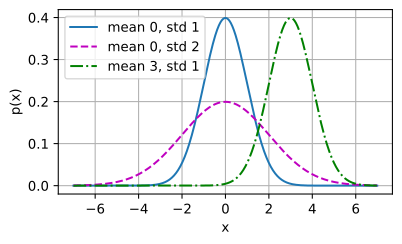
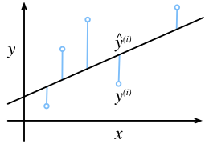
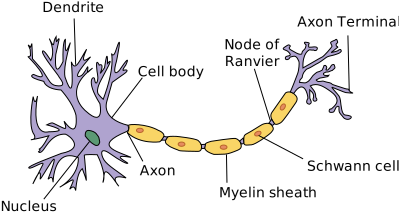

# Hồi quy Tuyến tính
<a id="sec_linear_regression"></a>

Các bài toán *hồi quy* xuất hiện bất cứ khi nào ta muốn dự đoán một giá trị số.
Các ví dụ phổ biến bao gồm dự đoán giá cả (nhà ở, cổ phiếu, v.v.),
dự đoán thời gian nằm viện (cho bệnh nhân),
dự báo nhu cầu (cho doanh số bán lẻ), và nhiều trường hợp khác.
Không phải mọi bài toán dự đoán đều là hồi quy cổ điển.
Về sau, ta sẽ giới thiệu các bài toán phân loại,
nơi mục tiêu là dự đoán tư cách thành viên trong một tập các danh mục.

Lấy một ví dụ xuyên suốt, giả sử ta muốn
ước tính giá nhà (tính bằng đô la)
dựa trên diện tích (tính bằng feet vuông) và tuổi đời (tính bằng năm).
Để xây dựng mô hình dự đoán giá nhà,
ta cần thu thập dữ liệu,
bao gồm giá bán, diện tích và tuổi đời của từng ngôi nhà.
Theo thuật ngữ của machine learning,
tập dữ liệu được gọi là *tập dữ liệu huấn luyện* hay *tập huấn luyện*,
và mỗi hàng (chứa dữ liệu tương ứng với một lần bán)
được gọi là một *mẫu* (hay *điểm dữ liệu*, *thực thể*, *quan sát*).
Thứ ta muốn dự đoán (giá)
được gọi là *nhãn* (hay *mục tiêu*).
Các biến (tuổi đời và diện tích)
dùng làm cơ sở cho dự đoán
được gọi là *đặc trưng* (hay *hiệp biến*).


```python
%matplotlib inline
from d2l import torch as d2l
import math
import torch
import numpy as np
import time
```




## Kiến thức Cơ bản

*Hồi quy tuyến tính* vừa là công cụ đơn giản nhất
vừa phổ biến nhất trong các công cụ tiêu chuẩn
để giải quyết các bài toán hồi quy.
Ra đời từ buổi đầu thế kỷ 19 [Legendre.1805, Gauss.1809],
hồi quy tuyến tính xuất phát từ một vài giả định đơn giản.
Đầu tiên, ta giả định rằng mối quan hệ
giữa các đặc trưng $\mathbf{x}$ và mục tiêu $y$
xấp xỉ tuyến tính,
tức là kỳ vọng có điều kiện $E[Y \mid X=\mathbf{x}]$
có thể được biểu diễn dưới dạng tổng có trọng số
của các đặc trưng $\mathbf{x}$.
Thiết lập này cho phép giá trị mục tiêu
vẫn có thể sai lệch so với kỳ vọng
do nhiễu quan sát.
Tiếp theo, ta có thể áp đặt giả định rằng bất kỳ nhiễu như vậy
đều có hành xử tốt, tuân theo phân phối Gauss.
Thông thường, ta dùng $n$ để ký hiệu
số lượng mẫu trong tập dữ liệu.
Ta dùng chỉ số trên để đánh số mẫu và mục tiêu,
và chỉ số dưới để đánh chỉ số tọa độ.
Cụ thể hơn,
$\mathbf{x}^{(i)}$ ký hiệu mẫu thứ $i$
và $x_j^{(i)}$ ký hiệu tọa độ thứ $j$ của nó.

### Mô hình
<a id="subsec_linear_model"></a>

Cốt lõi của mọi giải pháp là một mô hình
mô tả cách các đặc trưng có thể được biến đổi
thành ước lượng mục tiêu.
Giả định tuyến tính có nghĩa là
giá trị kỳ vọng của mục tiêu (giá) có thể được biểu diễn
dưới dạng tổng có trọng số của các đặc trưng (diện tích và tuổi đời):

$$\textrm{price} = w_{\textrm{area}} \cdot \textrm{area} + w_{\textrm{age}} \cdot \textrm{age} + b.$$

Ở đây $w_{\textrm{area}}$ và $w_{\textrm{age}}$
được gọi là *trọng số*, và $b$ được gọi là *hệ số chặn*
(hay *độ lệch* hay *hệ số tự do*).
Các trọng số xác định mức độ ảnh hưởng của mỗi đặc trưng lên dự đoán của ta.
Hệ số chặn xác định giá trị ước lượng khi tất cả các đặc trưng đều bằng không.
Mặc dù ta sẽ không bao giờ thấy ngôi nhà mới xây nào có diện tích bằng không chính xác,
ta vẫn cần hệ số chặn vì nó cho phép ta
biểu diễn tất cả các hàm tuyến tính của đặc trưng
(thay vì hạn chế ta vào các đường thẳng qua gốc tọa độ).
Nói chính xác hơn, :eqref:`eq_price-area` là một *phép biến đổi affine* của các đặc trưng đầu vào, được đặc trưng bởi một *phép biến đổi tuyến tính* của các đặc trưng thông qua tổng có trọng số, kết hợp với *phép tịnh tiến* thông qua hệ số chặn được cộng thêm.
Cho một tập dữ liệu, mục tiêu của ta là chọn
trọng số $\mathbf{w}$ và hệ số chặn $b$
sao cho trung bình dự đoán của mô hình
khớp với giá thực tế quan sát trong dữ liệu càng sát càng tốt.


Trong các lĩnh vực mà ta thường tập trung
vào các tập dữ liệu chỉ có một vài đặc trưng,
việc biểu diễn mô hình dạng dài,
như trong :eqref:`eq_price-area`, là phổ biến.
Trong machine learning, ta thường làm việc
với các tập dữ liệu nhiều chiều,
nơi sẽ thuận tiện hơn khi dùng
ký hiệu đại số tuyến tính gọn gàng.
Khi đầu vào gồm $d$ đặc trưng,
ta có thể gán cho mỗi đặc trưng một chỉ số (từ $1$ đến $d$)
và biểu diễn dự đoán $\hat{y}$
(ký hiệu "mũ" thường ký hiệu ước lượng) như sau:

$$\hat{y} = w_1  x_1 + \cdots + w_d  x_d + b.$$

Tập hợp tất cả các đặc trưng vào một vector $\mathbf{x} \in \mathbb{R}^d$
và tất cả các trọng số vào một vector $\mathbf{w} \in \mathbb{R}^d$,
ta có thể biểu diễn mô hình một cách gọn gàng thông qua tích vô hướng
giữa $\mathbf{w}$ và $\mathbf{x}$:

$$\hat{y} = \mathbf{w}^\top \mathbf{x} + b.$$

Trong :eqref:`eq_linreg-y`, vector $\mathbf{x}$
tương ứng với các đặc trưng của một mẫu đơn.
Ta thường thấy tiện lợi khi
tham chiếu đến các đặc trưng của toàn bộ tập dữ liệu $n$ mẫu
thông qua *ma trận thiết kế* $\mathbf{X} \in \mathbb{R}^{n \times d}$.
Ở đây, $\mathbf{X}$ chứa một hàng cho mỗi mẫu
và một cột cho mỗi đặc trưng.
Với một tập đặc trưng $\mathbf{X}$,
các dự đoán $\hat{\mathbf{y}} \in \mathbb{R}^n$
có thể được biểu diễn thông qua tích ma trận--vector:

$${\hat{\mathbf{y}}} = \mathbf{X} \mathbf{w} + b,$$

trong đó cơ chế phát tán ([subsec_broadcasting](#subsec_broadcasting)) được áp dụng khi tính tổng.
Cho các đặc trưng của tập dữ liệu huấn luyện $\mathbf{X}$
và các nhãn tương ứng (đã biết) $\mathbf{y}$,
mục tiêu của hồi quy tuyến tính là tìm
vector trọng số $\mathbf{w}$ và hệ số chặn $b$
sao cho, với các đặc trưng của một mẫu dữ liệu mới
được lấy từ cùng phân phối với $\mathbf{X}$,
nhãn của mẫu mới sẽ (trong kỳ vọng)
được dự đoán với sai số nhỏ nhất.

Dù ta tin rằng mô hình tốt nhất để
dự đoán $y$ cho $\mathbf{x}$ là tuyến tính,
ta cũng không kỳ vọng tìm được tập dữ liệu thực tế $n$ mẫu mà
$y^{(i)}$ hoàn toàn bằng $\mathbf{w}^\top \mathbf{x}^{(i)}+b$
với mọi $1 \leq i \leq n$.
Chẳng hạn, dù dùng công cụ nào để quan sát
đặc trưng $\mathbf{X}$ và nhãn $\mathbf{y}$, cũng có thể có một lượng nhỏ sai số đo lường.
Do đó, ngay cả khi ta tự tin
rằng mối quan hệ nền tảng là tuyến tính,
ta vẫn sẽ đưa vào một số hạng nhiễu để tính đến những sai số như vậy.

Trước khi có thể tìm kiếm *tham số* tốt nhất
(hay *tham số mô hình*) $\mathbf{w}$ và $b$,
ta cần thêm hai thứ nữa:
(i) một thước đo chất lượng của mô hình đã cho;
và (ii) một quy trình cập nhật mô hình để cải thiện chất lượng của nó.

### Hàm Mất mát
<a id="subsec_linear-regression-loss-function"></a>

Đương nhiên, để khớp mô hình với dữ liệu, ta cần
đồng ý về một thước đo *mức độ khớp*
(hay tương đương, *mức độ không khớp*).
*Hàm mất mát* định lượng khoảng cách
giữa giá trị *thực* và giá trị *dự đoán* của mục tiêu.
Hàm mất mát thường là một số không âm
trong đó giá trị nhỏ hơn thì tốt hơn
và dự đoán hoàn hảo có mất mát bằng 0.
Với các bài toán hồi quy, hàm mất mát phổ biến nhất là sai số bình phương.
Khi dự đoán của ta cho mẫu $i$ là $\hat{y}^{(i)}$
và nhãn thực tương ứng là $y^{(i)}$,
*sai số bình phương* được tính như sau:

$$l^{(i)}(\mathbf{w}, b) = \frac{1}{2} \left(\hat{y}^{(i)} - y^{(i)}\right)^2.$$

Hằng số $\frac{1}{2}$ không có sự khác biệt thực sự
nhưng tỏ ra thuận tiện về mặt ký hiệu,
vì nó triệt tiêu khi ta lấy đạo hàm của hàm mất mát.
Vì tập dữ liệu huấn luyện đã được cho trước
và do đó nằm ngoài tầm kiểm soát của ta,
sai số thực nghiệm chỉ là hàm của các tham số mô hình.
Trong [fig_fit_linreg](#fig_fit_linreg), ta trực quan hóa sự khớp của mô hình hồi quy tuyến tính
trong bài toán với đầu vào một chiều.


<a id="fig_fit_linreg"></a>

Lưu ý rằng sự khác biệt lớn giữa
ước lượng $\hat{y}^{(i)}$ và mục tiêu $y^{(i)}$
dẫn đến đóng góp thậm chí còn lớn hơn vào hàm mất mát,
do dạng bậc hai của nó
(tính bậc hai này có thể là con dao hai lưỡi; trong khi nó khuyến khích mô hình tránh sai số lớn,
nó cũng có thể dẫn đến độ nhạy quá mức với dữ liệu bất thường).
Để đo chất lượng mô hình trên toàn bộ tập dữ liệu $n$ mẫu,
ta đơn giản lấy trung bình (hay tương đương, tổng)
các mất mát trên tập huấn luyện:

$$L(\mathbf{w}, b) =\frac{1}{n}\sum_{i=1}^n l^{(i)}(\mathbf{w}, b) =\frac{1}{n} \sum_{i=1}^n \frac{1}{2}\left(\mathbf{w}^\top \mathbf{x}^{(i)} + b - y^{(i)}\right)^2.$$

Khi huấn luyện mô hình, ta tìm các tham số ($\mathbf{w}^*, b^*$)
để tối thiểu hóa tổng mất mát trên tất cả các mẫu huấn luyện:

$$\mathbf{w}^*, b^* = \operatorname*{argmin}_{\mathbf{w}, b}\  L(\mathbf{w}, b).$$

### Nghiệm Giải tích

Không giống hầu hết các mô hình ta sẽ đề cập,
hồi quy tuyến tính đặt ra cho ta
một bài toán tối ưu hóa dễ đến bất ngờ.
Cụ thể, ta có thể tìm các tham số tối ưu
(đánh giá trên dữ liệu huấn luyện)
một cách giải tích bằng cách áp dụng một công thức đơn giản như sau.
Đầu tiên, ta có thể gộp hệ số chặn $b$ vào tham số $\mathbf{w}$
bằng cách thêm một cột vào ma trận thiết kế gồm toàn số 1.
Khi đó bài toán dự đoán của ta là tối thiểu hóa $\|\mathbf{y} - \mathbf{X}\mathbf{w}\|^2$.
Miễn là ma trận thiết kế $\mathbf{X}$ có hạng đầy đủ
(không có đặc trưng nào phụ thuộc tuyến tính vào các đặc trưng khác),
thì sẽ chỉ có một điểm tới hạn trên bề mặt mất mát
và nó tương ứng với cực tiểu của hàm mất mát trên toàn miền.
Lấy đạo hàm của hàm mất mát theo $\mathbf{w}$
và đặt bằng không ta được:

$$\begin{aligned}
    \partial_{\mathbf{w}} \|\mathbf{y} - \mathbf{X}\mathbf{w}\|^2 =
    2 \mathbf{X}^\top (\mathbf{X} \mathbf{w} - \mathbf{y}) = 0
    \textrm{ và do đó }
    \mathbf{X}^\top \mathbf{y} = \mathbf{X}^\top \mathbf{X} \mathbf{w}.
\end{aligned}$$

Giải tìm $\mathbf{w}$ cho ta nghiệm tối ưu
cho bài toán tối ưu hóa.
Lưu ý rằng nghiệm này

$$\mathbf{w}^* = (\mathbf X^\top \mathbf X)^{-1}\mathbf X^\top \mathbf{y}$$

chỉ duy nhất
khi ma trận $\mathbf X^\top \mathbf X$ khả nghịch,
tức là khi các cột của ma trận thiết kế
độc lập tuyến tính [Golub.Van-Loan.1996].


Mặc dù các bài toán đơn giản như hồi quy tuyến tính
có thể có nghiệm giải tích,
bạn không nên quen với may mắn như vậy.
Mặc dù nghiệm giải tích cho phép phân tích toán học đẹp đẽ,
yêu cầu về nghiệm giải tích lại quá hạn chế
đến mức nó sẽ loại trừ hầu hết các khía cạnh thú vị của deep learning.

### Minibatch Stochastic Gradient Descent

May mắn thay, ngay cả trong trường hợp không thể giải các mô hình theo cách giải tích,
ta vẫn thường có thể huấn luyện mô hình hiệu quả trong thực tế.
Hơn nữa, với nhiều tác vụ, những mô hình khó tối ưu hóa đó
lại tỏ ra tốt hơn rất nhiều đến mức tìm cách huấn luyện chúng
thực sự xứng đáng với công sức bỏ ra.

Kỹ thuật chủ chốt để tối ưu hóa hầu hết mọi mô hình deep learning,
và sẽ được sử dụng xuyên suốt cuốn sách này,
bao gồm việc giảm dần sai số một cách lặp đi lặp lại
bằng cách cập nhật các tham số theo hướng
làm giảm dần hàm mất mát.
Thuật toán này được gọi là *gradient descent*.

Ứng dụng đơn giản nhất của gradient descent
bao gồm việc lấy đạo hàm của hàm mất mát,
là trung bình của các mất mát tính
trên mọi mẫu đơn lẻ trong tập dữ liệu.
Trong thực tế, điều này có thể cực kỳ chậm:
ta phải duyệt qua toàn bộ tập dữ liệu trước khi thực hiện một lần cập nhật,
dù các bước cập nhật có thể rất mạnh [Liu.Nocedal.1989].
Tệ hơn, nếu có nhiều dư thừa trong dữ liệu huấn luyện,
lợi ích của một lần cập nhật đầy đủ là hạn chế.

Thái cực còn lại là chỉ xét một mẫu tại một thời điểm và thực hiện
các bước cập nhật dựa trên một quan sát tại một thời điểm.
Thuật toán kết quả, *stochastic gradient descent* (SGD)
có thể là chiến lược hiệu quả [Bottou.2010], ngay cả với tập dữ liệu lớn.
Tiếc thay, SGD có những hạn chế, cả về tính toán lẫn thống kê.
Một vấn đề nảy sinh từ thực tế là bộ vi xử lý nhân và cộng số
nhanh hơn rất nhiều so với việc
chuyển dữ liệu từ bộ nhớ chính sang bộ nhớ đệm của bộ vi xử lý.
Thực hiện nhân ma trận--vector
hiệu quả hơn khoảng một bậc độ lớn
so với số lượng phép toán vector--vector tương ứng.
Điều này có nghĩa là xử lý từng mẫu một có thể mất nhiều thời gian hơn
so với một batch đầy đủ.
Vấn đề thứ hai là một số lớp,
chẳng hạn như chuẩn hóa batch (sẽ được mô tả trong [sec_batch_norm](#sec_batch_norm)),
chỉ hoạt động tốt khi ta có thể truy cập
nhiều hơn một quan sát tại một thời điểm.

Giải pháp cho cả hai vấn đề là chọn một chiến lược trung gian:
thay vì lấy một batch đầy đủ hay chỉ một mẫu tại một thời điểm,
ta lấy một *minibatch* các quan sát [Li.Zhang.Chen.ea.2014].
Lựa chọn cụ thể về kích thước minibatch phụ thuộc vào nhiều yếu tố,
chẳng hạn như lượng bộ nhớ, số lượng bộ tăng tốc,
lựa chọn các lớp, và tổng kích thước tập dữ liệu.
Dù vậy, một số từ 32 đến 256,
tốt nhất là bội số của lũy thừa lớn của $2$, là một điểm khởi đầu tốt.
Điều này dẫn ta đến *minibatch stochastic gradient descent*.

Ở dạng cơ bản nhất, trong mỗi vòng lặp $t$,
ta đầu tiên lấy mẫu ngẫu nhiên một minibatch $\mathcal{B}_t$
gồm một số cố định $|\mathcal{B}|$ mẫu huấn luyện.
Sau đó ta tính đạo hàm (gradient) của mất mát trung bình
trên minibatch theo các tham số mô hình.
Cuối cùng, ta nhân gradient
với một giá trị dương nhỏ được định sẵn $\eta$,
gọi là *tốc độ học* (learning rate),
và trừ số hạng kết quả khỏi các giá trị tham số hiện tại.
Ta có thể biểu diễn phép cập nhật như sau:

$$(\mathbf{w},b) \leftarrow (\mathbf{w},b) - \frac{\eta}{|\mathcal{B}|} \sum_{i \in \mathcal{B}_t} \partial_{(\mathbf{w},b)} l^{(i)}(\mathbf{w},b).$$

Tóm lại, minibatch SGD tiến hành như sau:
(i) khởi tạo các giá trị tham số mô hình, thường là ngẫu nhiên;
(ii) lặp đi lặp lại lấy mẫu các minibatch ngẫu nhiên từ dữ liệu,
cập nhật các tham số theo hướng gradient âm.
Với mất mát bậc hai và các phép biến đổi affine,
điều này có dạng khai triển đóng:

$$\begin{aligned} \mathbf{w} & \leftarrow \mathbf{w} - \frac{\eta}{|\mathcal{B}|} \sum_{i \in \mathcal{B}_t} \partial_{\mathbf{w}} l^{(i)}(\mathbf{w}, b) && = \mathbf{w} - \frac{\eta}{|\mathcal{B}|} \sum_{i \in \mathcal{B}_t} \mathbf{x}^{(i)} \left(\mathbf{w}^\top \mathbf{x}^{(i)} + b - y^{(i)}\right)\\ b &\leftarrow b -  \frac{\eta}{|\mathcal{B}|} \sum_{i \in \mathcal{B}_t} \partial_b l^{(i)}(\mathbf{w}, b) &&  = b - \frac{\eta}{|\mathcal{B}|} \sum_{i \in \mathcal{B}_t} \left(\mathbf{w}^\top \mathbf{x}^{(i)} + b - y^{(i)}\right). \end{aligned}$$

Vì ta chọn một minibatch $\mathcal{B}$
ta cần chuẩn hóa theo kích thước của nó $|\mathcal{B}|$.
Kích thước minibatch và tốc độ học thường do người dùng định nghĩa.
Các tham số có thể điều chỉnh như vậy mà không được cập nhật
trong vòng lặp huấn luyện được gọi là *siêu tham số*.
Chúng có thể được điều chỉnh tự động bằng nhiều kỹ thuật, chẳng hạn như tối ưu hóa Bayesian
[Frazier.2018]. Cuối cùng, chất lượng của nghiệm thường
được đánh giá trên một *tập kiểm định* (hay *validation set*) riêng.

Sau khi huấn luyện một số vòng lặp được định trước
(hoặc cho đến khi đáp ứng một tiêu chí dừng nào đó),
ta ghi lại các tham số mô hình ước lượng,
ký hiệu $\hat{\mathbf{w}}, \hat{b}$.
Lưu ý rằng ngay cả khi hàm của ta thực sự tuyến tính và không có nhiễu,
các tham số này sẽ không phải là cực tiểu chính xác của hàm mất mát, cũng không xác định.
Mặc dù thuật toán hội tụ chậm về phía các cực tiểu
nhưng thường sẽ không tìm thấy chúng chính xác trong một số hữu hạn bước.
Hơn nữa, các minibatch $\mathcal{B}$
được dùng để cập nhật các tham số được chọn ngẫu nhiên.
Điều này phá vỡ tính xác định.

Hồi quy tuyến tính tình cờ là bài toán học có
cực tiểu toàn cục
(bất cứ khi nào $\mathbf{X}$ có hạng đầy đủ, hay tương đương,
bất cứ khi nào $\mathbf{X}^\top \mathbf{X}$ khả nghịch).
Tuy nhiên, bề mặt mất mát của các mạng sâu chứa nhiều điểm yên ngựa và cực tiểu.
May mắn thay, ta thường không quan tâm đến việc tìm
một tập tham số chính xác mà chỉ cần bất kỳ tập tham số nào
dẫn đến dự đoán chính xác (và do đó mất mát thấp).
Trong thực tế, các chuyên gia deep learning
hiếm khi gặp khó khăn trong việc tìm tham số
tối thiểu hóa hàm mất mát *trên tập huấn luyện*
[Izmailov.Podoprikhin.Garipov.ea.2018, Frankle.Carlin.2018].
Nhiệm vụ khó khăn hơn là tìm các tham số
dẫn đến dự đoán chính xác trên dữ liệu chưa từng thấy,
một thách thức được gọi là *tổng quát hóa*.
Ta sẽ quay lại các chủ đề này xuyên suốt cuốn sách.

### Dự đoán

Cho mô hình $\hat{\mathbf{w}}^\top \mathbf{x} + \hat{b}$,
ta có thể đưa ra *dự đoán* cho một mẫu mới,
ví dụ, dự đoán giá bán của một ngôi nhà chưa từng thấy
cho trước diện tích $x_1$ và tuổi đời $x_2$.
Các chuyên gia deep learning đã bắt đầu gọi giai đoạn dự đoán là *suy luận* (inference)
nhưng đây là cách dùng từ hơi sai---*suy luận* đề cập rộng rãi
đến bất kỳ kết luận nào được rút ra trên cơ sở bằng chứng,
bao gồm cả giá trị của các tham số
và nhãn có khả năng xảy ra cho một thực thể chưa thấy.
Nếu có điều gì, trong tài liệu thống kê
*suy luận* thường ký hiệu suy luận tham số
và sự quá tải thuật ngữ này tạo ra sự nhầm lẫn không cần thiết
khi các chuyên gia deep learning nói chuyện với các nhà thống kê.
Trong phần sau ta sẽ giữ từ *dự đoán* bất cứ khi nào có thể.


## Vector hóa để Tăng tốc

Khi huấn luyện mô hình, ta thường muốn xử lý
toàn bộ các minibatch mẫu đồng thời.
Làm điều này một cách hiệu quả đòi hỏi (**ta**) (~~nên~~)
(**vector hóa các phép tính và tận dụng
các thư viện đại số tuyến tính nhanh
thay vì viết các vòng lặp for tốn kém trong Python.**)

Để thấy tại sao điều này quan trọng đến vậy,
hãy (**xét hai phương pháp cộng vector.**)
Để bắt đầu, ta khởi tạo hai vector 10.000 chiều
chứa toàn số 1.
Trong phương pháp đầu tiên, ta lặp qua các vector với vòng lặp for Python.
Trong phương pháp thứ hai, ta dựa vào một lần gọi duy nhất đến `+`.

```python
n = 10000
a = d2l.ones(n)
b = d2l.ones(n)
```

Bây giờ ta có thể đo hiệu suất của các công việc tính toán.
Đầu tiên, [**ta cộng chúng, từng tọa độ một,
dùng vòng lặp for.**]


(**Ngoài ra, ta dựa vào toán tử `+` được nạp chồng để tính tổng theo từng phần tử.**)

```python
t = time.time()
d = a + b
f'{time.time() - t:.5f} sec'
```

Phương pháp thứ hai nhanh hơn phương pháp đầu tiên đáng kể.
Vector hóa code thường mang lại tốc độ tăng hàng bậc độ lớn.
Hơn nữa, ta đẩy nhiều phép tính toán học hơn vào thư viện
nên không cần tự tính toán nhiều phép tính,
giảm khả năng xảy ra lỗi và tăng tính di động của code.


## Phân phối Chuẩn và Mất mát Bình phương
<a id="subsec_normal_distribution_and_squared_loss"></a>

Cho đến nay ta đã đưa ra một động cơ khá chức năng
cho hàm mục tiêu mất mát bình phương:
các tham số tối ưu trả về kỳ vọng có điều kiện $E[Y\mid X]$
bất cứ khi nào mẫu nền tảng thực sự tuyến tính,
và hàm mất mát gán các hình phạt lớn cho các điểm ngoại lệ.
Ta cũng có thể cung cấp một động cơ chính thức hơn
cho hàm mục tiêu mất mát bình phương
bằng cách đưa ra các giả định xác suất
về phân phối của nhiễu.

Hồi quy tuyến tính được phát minh vào đầu thế kỷ 19.
Trong khi đã lâu có tranh luận về việc Gauss hay Legendre
người nào đã nghĩ ra ý tưởng đầu tiên,
chính Gauss cũng đã phát hiện ra phân phối chuẩn
(còn gọi là *phân phối Gauss*).
Hóa ra là phân phối chuẩn
và hồi quy tuyến tính với mất mát bình phương
có một mối liên hệ sâu sắc hơn chỉ là nguồn gốc chung.

Để bắt đầu, hãy nhớ rằng phân phối chuẩn
với trung bình $\mu$ và phương sai $\sigma^2$ (độ lệch chuẩn $\sigma$)
được cho bởi:

$$p(x) = \frac{1}{\sqrt{2 \pi \sigma^2}} \exp\left(-\frac{1}{2 \sigma^2} (x - \mu)^2\right).$$

Dưới đây [**ta định nghĩa hàm tính phân phối chuẩn**].

```python
def normal(x, mu, sigma):
    p = 1 / math.sqrt(2 * math.pi * sigma**2)
    if tab.selected('jax'):
        return p * jnp.exp(-0.5 * (x - mu)**2 / sigma**2)
    if tab.selected('pytorch', 'mxnet', 'tensorflow'):
        return p * np.exp(-0.5 * (x - mu)**2 / sigma**2)
```

Ta có thể (**trực quan hóa các phân phối chuẩn**).


```python

%%tab pytorch, tensorflow, jax
if tab.selected('jax'):
    # Use JAX NumPy for visualization
    x = jnp.arange(-7, 7, 0.01)
if tab.selected('pytorch', 'mxnet', 'tensorflow'):
    # Use NumPy again for visualization
    x = np.arange(-7, 7, 0.01)

# Mean and standard deviation pairs
params = [(0, 1), (0, 2), (3, 1)]
d2l.plot(x, [normal(x, mu, sigma) for mu, sigma in params], xlabel='x',
         ylabel='p(x)', figsize=(4.5, 2.5),
         legend=[f'mean {mu}, std {sigma}' for mu, sigma in params])
```

Lưu ý rằng thay đổi trung bình tương ứng với
một sự dịch chuyển dọc theo trục $x$,
và tăng phương sai
làm phân phối trải rộng hơn,
hạ thấp đỉnh của nó.

Một cách để biện minh cho hồi quy tuyến tính với mất mát bình phương
là giả định rằng các quan sát phát sinh từ các phép đo có nhiễu,
trong đó nhiễu $\epsilon$ tuân theo phân phối chuẩn
$\mathcal{N}(0, \sigma^2)$:

$$y = \mathbf{w}^\top \mathbf{x} + b + \epsilon \textrm{ trong đó } \epsilon \sim \mathcal{N}(0, \sigma^2).$$

Do đó, ta có thể viết ra *hàm hợp lý*
khi nhìn thấy một $y$ cụ thể cho $\mathbf{x}$ đã cho thông qua:

$$P(y \mid \mathbf{x}) = \frac{1}{\sqrt{2 \pi \sigma^2}} \exp\left(-\frac{1}{2 \sigma^2} (y - \mathbf{w}^\top \mathbf{x} - b)^2\right).$$

Như vậy, hàm hợp lý phân tích thừa số.
Theo *nguyên lý hợp lý cực đại*,
các giá trị tốt nhất của tham số $\mathbf{w}$ và $b$ là những giá trị
tối đa hóa *hàm hợp lý* của toàn bộ tập dữ liệu:

$$P(\mathbf y \mid \mathbf X) = \prod_{i=1}^{n} p(y^{(i)} \mid \mathbf{x}^{(i)}).$$

Đẳng thức trên đúng vì tất cả các cặp $(\mathbf{x}^{(i)}, y^{(i)})$
được rút ra độc lập với nhau.
Các bộ ước lượng được chọn theo nguyên lý hợp lý cực đại
được gọi là *bộ ước lượng hợp lý cực đại*.
Trong khi tối đa hóa tích của nhiều hàm mũ
trông có vẻ khó,
ta có thể đơn giản hóa đáng kể, mà không thay đổi mục tiêu,
bằng cách tối đa hóa lôgarit của hàm hợp lý thay thế.
Vì lý do lịch sử, các tối ưu hóa thường được biểu diễn
dưới dạng tối thiểu hóa thay vì tối đa hóa.
Vì vậy, mà không thay đổi gì,
ta có thể *tối thiểu hóa* *log-hợp lý âm*,
mà ta có thể biểu diễn như sau:

$$-\log P(\mathbf y \mid \mathbf X) = \sum_{i=1}^n \frac{1}{2} \log(2 \pi \sigma^2) + \frac{1}{2 \sigma^2} \left(y^{(i)} - \mathbf{w}^\top \mathbf{x}^{(i)} - b\right)^2.$$

Nếu ta giả định $\sigma$ là cố định,
ta có thể bỏ qua số hạng đầu tiên,
vì nó không phụ thuộc vào $\mathbf{w}$ hay $b$.
Số hạng thứ hai giống hệt
hàm mất mát sai số bình phương giới thiệu trước đó,
ngoại trừ hằng số nhân $\frac{1}{\sigma^2}$.
May mắn thay, nghiệm cũng không phụ thuộc vào $\sigma$.
Từ đó suy ra rằng tối thiểu hóa sai số bình phương trung bình
tương đương với ước lượng hợp lý cực đại
của mô hình tuyến tính dưới giả định về nhiễu Gauss cộng tính.


## Hồi quy Tuyến tính như một Mạng Nơ-ron

Trong khi các mô hình tuyến tính không đủ phong phú
để biểu diễn nhiều mạng phức tạp
mà ta sẽ giới thiệu trong cuốn sách này,
các mạng nơ-ron (nhân tạo) đủ phong phú
để bao gồm các mô hình tuyến tính như các mạng
trong đó mỗi đặc trưng được biểu diễn bởi một nơ-ron đầu vào,
tất cả đều được kết nối trực tiếp với đầu ra.

[fig_single_neuron](#fig_single_neuron) mô tả
hồi quy tuyến tính như một mạng nơ-ron.
Sơ đồ làm nổi bật mẫu kết nối,
chẳng hạn như mỗi đầu vào được kết nối với đầu ra như thế nào,
nhưng không phải các giá trị cụ thể của trọng số hay hệ số chặn.


<a id="fig_single_neuron"></a>

Các đầu vào là $x_1, \ldots, x_d$.
Ta gọi $d$ là *số lượng đầu vào*
hay *chiều số đặc trưng* trong lớp đầu vào.
Đầu ra của mạng là $o_1$.
Vì ta chỉ đang cố gắng dự đoán
một giá trị số duy nhất,
ta chỉ có một nơ-ron đầu ra.
Lưu ý rằng các giá trị đầu vào đều *đã cho*.
Chỉ có một nơ-ron *được tính toán* duy nhất.
Tóm lại, ta có thể nghĩ về hồi quy tuyến tính
như một mạng nơ-ron kết nối đầy đủ một lớp.
Ta sẽ gặp các mạng
với nhiều lớp hơn nhiều
trong các chương sau.

### Sinh học

Vì hồi quy tuyến tính xuất hiện trước khoa học thần kinh tính toán,
nên có vẻ lỗi thời khi mô tả
hồi quy tuyến tính theo ngôn ngữ mạng nơ-ron.
Tuy nhiên, chúng là điểm khởi đầu tự nhiên
khi các nhà điều khiển học và sinh lý thần kinh
Warren McCulloch và Walter Pitts bắt đầu phát triển
các mô hình nơ-ron nhân tạo.
Hãy xem xét hình ảnh phác thảo
của một nơ-ron sinh học trong [fig_Neuron](#fig_Neuron),
bao gồm *sợi nhánh* (cổng đầu vào),
*nhân tế bào* (CPU), *sợi trục* (dây đầu ra),
và *đầu cuối sợi trục* (cổng đầu ra),
cho phép kết nối với các nơ-ron khác thông qua *khớp thần kinh*.


<a id="fig_Neuron"></a>

Thông tin $x_i$ đến từ các nơ-ron khác
(hoặc cảm biến môi trường) được nhận trong các sợi nhánh.
Cụ thể, thông tin đó được nhân trọng số
bởi *trọng số khớp thần kinh* $w_i$,
xác định ảnh hưởng của các đầu vào,
ví dụ như kích hoạt hay ức chế thông qua tích $x_i w_i$.
Các đầu vào có trọng số đến từ nhiều nguồn
được tổng hợp trong nhân tế bào
như tổng có trọng số $y = \sum_i x_i w_i + b$,
có thể phải chịu một số xử lý phi tuyến sau thông qua hàm $\sigma(y)$.
Thông tin này sau đó được gửi qua sợi trục đến các đầu cuối sợi trục,
nơi nó đến đích
(ví dụ như một bộ chấp hành như cơ bắp)
hoặc được đưa vào nơ-ron khác qua các sợi nhánh của nó.

Chắc chắn, ý tưởng cấp cao rằng nhiều đơn vị như vậy
có thể được kết hợp, miễn là chúng có kết nối và thuật toán học đúng đắn,
để tạo ra hành vi thú vị và phức tạp hơn nhiều
hơn bất kỳ nơ-ron đơn lẻ nào có thể biểu diễn
xuất phát từ nghiên cứu của ta về các hệ thống thần kinh sinh học thực sự.
Đồng thời, hầu hết nghiên cứu trong deep learning ngày nay
lấy cảm hứng từ nguồn rộng hơn nhiều.
Ta trích dẫn Russell.Norvig.2016
người đã chỉ ra rằng mặc dù máy bay có thể đã được *lấy cảm hứng* từ chim,
nhưng điểu cầm học không phải là động lực chính
của đổi mới hàng không trong vài thế kỷ qua.
Tương tự, cảm hứng trong deep learning ngày nay
đến bằng mức độ tương đương hoặc lớn hơn
từ toán học, ngôn ngữ học, tâm lý học,
thống kê, khoa học máy tính và nhiều lĩnh vực khác.

## Tóm tắt

Trong phần này, ta đã giới thiệu
hồi quy tuyến tính truyền thống,
trong đó các tham số của hàm tuyến tính
được chọn để tối thiểu hóa mất mát bình phương trên tập huấn luyện.
Ta cũng đã biện minh cho sự lựa chọn hàm mục tiêu này
cả thông qua một số cân nhắc thực tế
và thông qua cách diễn giải
hồi quy tuyến tính như ước lượng hợp lý cực đại
dưới giả định về tuyến tính và nhiễu Gauss.
Sau khi thảo luận về cả các cân nhắc tính toán
và các kết nối với thống kê,
ta đã cho thấy cách các mô hình tuyến tính như vậy có thể được biểu diễn
như các mạng nơ-ron đơn giản trong đó các đầu vào
được nối trực tiếp với đầu ra.
Trong khi ta sẽ sớm bỏ qua hoàn toàn các mô hình tuyến tính,
chúng đủ để giới thiệu hầu hết các thành phần
mà tất cả các mô hình của ta đều yêu cầu:
các dạng tham số, hàm mục tiêu có thể vi phân,
tối ưu hóa thông qua minibatch stochastic gradient descent,
và cuối cùng, đánh giá trên dữ liệu chưa từng thấy trước đó.


## Bài tập

1. Giả sử ta có một số dữ liệu $x_1, \ldots, x_n \in \mathbb{R}$. Mục tiêu của ta là tìm một hằng số $b$ sao cho $\sum_i (x_i - b)^2$ được tối thiểu hóa.
    1. Tìm nghiệm giải tích cho giá trị tối ưu của $b$.
    1. Bài toán này và nghiệm của nó liên quan đến phân phối chuẩn như thế nào?
    1. Nếu ta thay đổi hàm mất mát từ $\sum_i (x_i - b)^2$ thành $\sum_i |x_i-b|$? Bạn có thể tìm nghiệm tối ưu cho $b$ không?
1. Chứng minh rằng các hàm affine có thể biểu diễn bởi $\mathbf{x}^\top \mathbf{w} + b$ tương đương với các hàm tuyến tính trên $(\mathbf{x}, 1)$.
1. Giả sử bạn muốn tìm các hàm bậc hai của $\mathbf{x}$, tức là $f(\mathbf{x}) = b + \sum_i w_i x_i + \sum_{j \leq i} w_{ij} x_{i} x_{j}$. Bạn sẽ định dạng điều này trong mạng sâu như thế nào?
1. Nhớ lại rằng một trong các điều kiện để bài toán hồi quy tuyến tính có thể giải được là ma trận thiết kế $\mathbf{X}^\top \mathbf{X}$ có hạng đầy đủ.
    1. Điều gì xảy ra nếu điều này không đúng?
    1. Bạn có thể sửa nó bằng cách nào? Điều gì xảy ra nếu bạn thêm một lượng nhỏ nhiễu Gauss độc lập theo tọa độ vào tất cả các phần tử của $\mathbf{X}$?
    1. Giá trị kỳ vọng của ma trận thiết kế $\mathbf{X}^\top \mathbf{X}$ trong trường hợp này là gì?
    1. Điều gì xảy ra với stochastic gradient descent khi $\mathbf{X}^\top \mathbf{X}$ không có hạng đầy đủ?
1. Giả sử mô hình nhiễu chi phối nhiễu cộng tính $\epsilon$ là phân phối mũ. Tức là $p(\epsilon) = \frac{1}{2} \exp(-|\epsilon|)$.
    1. Viết ra log-hợp lý âm của dữ liệu dưới mô hình $-\log P(\mathbf y \mid \mathbf X)$.
    1. Bạn có thể tìm nghiệm dạng đóng không?
    1. Đề xuất thuật toán minibatch stochastic gradient descent để giải bài toán này. Điều gì có thể xảy ra sai (gợi ý: điều gì xảy ra gần điểm dừng khi ta tiếp tục cập nhật các tham số)? Bạn có thể sửa nó không?
1. Giả sử ta muốn thiết kế mạng nơ-ron hai lớp bằng cách kết hợp hai lớp tuyến tính. Tức là đầu ra của lớp đầu tiên trở thành đầu vào của lớp thứ hai. Tại sao sự kết hợp đơn giản như vậy sẽ không hoạt động?
1. Điều gì xảy ra nếu bạn muốn dùng hồi quy để ước tính giá thực tế của nhà hay giá cổ phiếu?
    1. Chứng minh rằng giả định nhiễu Gauss cộng tính là không phù hợp. Gợi ý: chúng ta có thể có giá âm không? Còn về biến động thì sao?
    1. Tại sao hồi quy theo lôgarit của giá lại tốt hơn nhiều, tức là $y = \log \textrm{price}$?
    1. Bạn cần lo lắng điều gì khi xử lý cổ phiếu giá thấp, tức là cổ phiếu có giá rất thấp? Gợi ý: bạn có thể giao dịch ở tất cả các mức giá có thể không? Tại sao đây là vấn đề lớn hơn với cổ phiếu giá rẻ? Để biết thêm thông tin, hãy xem mô hình Black--Scholes nổi tiếng về định giá quyền chọn [Black.Scholes.1973].
1. Giả sử ta muốn dùng hồi quy để ước tính *số lượng* táo được bán trong một cửa hàng tạp hóa.
    1. Các vấn đề với mô hình nhiễu Gauss cộng tính là gì? Gợi ý: bạn đang bán táo, không phải dầu.
    1. [Phân phối Poisson](https://en.wikipedia.org/wiki/Poisson_distribution) nắm bắt các phân phối trên số đếm. Nó được cho bởi $p(k \mid \lambda) = \lambda^k e^{-\lambda}/k!$. Ở đây $\lambda$ là hàm tốc độ và $k$ là số sự kiện bạn thấy. Chứng minh rằng $\lambda$ là giá trị kỳ vọng của số đếm $k$.
    1. Thiết kế hàm mất mát liên quan đến phân phối Poisson.
    1. Thiết kế hàm mất mát để ước tính $\log \lambda$ thay thế.


[Thảo luận](https://discuss.d2l.ai/t/258)
