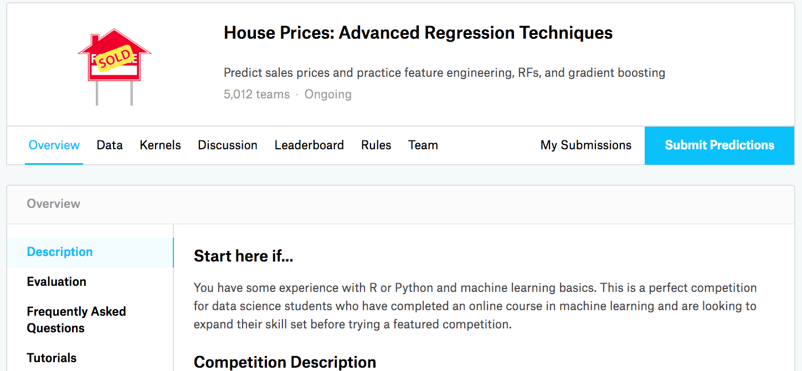

# Dự đoán Giá Nhà trên Kaggle
<a id="sec_kaggle_house"></a>

Bây giờ khi chúng ta đã giới thiệu một số công cụ cơ bản
để xây dựng và huấn luyện mạng sâu
và chuẩn hóa chúng với các kỹ thuật bao gồm
suy giảm trọng số và dropout,
chúng ta sẵn sàng đưa tất cả kiến thức này vào thực tế
bằng cách tham gia vào một cuộc thi Kaggle.
Cuộc thi dự đoán giá nhà
là một điểm khởi đầu tuyệt vời.
Dữ liệu khá chung chung và không thể hiện cấu trúc kỳ lạ
có thể đòi hỏi các mô hình chuyên biệt (như âm thanh hoặc video có thể).
Tập dữ liệu này, được thu thập bởi De-Cock.2011,
bao gồm giá nhà ở Ames, Iowa trong giai đoạn 2006--2010.
Nó lớn hơn đáng kể so với [tập dữ liệu nhà Boston](https://archive.ics.uci.edu/ml/machine-learning-databases/housing/housing.names) nổi tiếng của Harrison và Rubinfeld (1978),
với cả nhiều ví dụ hơn và nhiều đặc trưng hơn.


Trong phần này, chúng ta sẽ hướng dẫn bạn chi tiết về
tiền xử lý dữ liệu, thiết kế mô hình, và lựa chọn siêu tham số.
Chúng ta hy vọng rằng thông qua cách tiếp cận thực hành,
bạn sẽ có được một số trực giác sẽ hướng dẫn bạn
trong sự nghiệp như một nhà khoa học dữ liệu.


```python
%matplotlib inline
from d2l import torch as d2l
import torch
from torch import nn
import pandas as pd
```


## Tải xuống Dữ liệu

Trong suốt cuốn sách, chúng ta sẽ huấn luyện và kiểm tra các mô hình
trên các tập dữ liệu tải xuống khác nhau.
Ở đây, chúng ta (**cài đặt hai hàm tiện ích**)
để tải xuống và giải nén các file zip hoặc tar.
Một lần nữa, chúng ta bỏ qua chi tiết cài đặt của
các hàm tiện ích như vậy.

```python
def download(url, folder, sha1_hash=None):
    """Download a file to folder and return the local filepath."""

def extract(filename, folder):
    """Extract a zip/tar file into folder."""
```

## Kaggle

[Kaggle](https://www.kaggle.com) là một nền tảng phổ biến
tổ chức các cuộc thi machine learning.
Mỗi cuộc thi tập trung vào một tập dữ liệu và nhiều cuộc thi
được tài trợ bởi các bên liên quan cung cấp giải thưởng
cho các giải pháp thắng cuộc.
Nền tảng giúp người dùng tương tác
thông qua diễn đàn và code được chia sẻ,
thúc đẩy cả sự hợp tác và cạnh tranh.
Mặc dù việc theo đuổi bảng xếp hạng thường mất kiểm soát,
với các nhà nghiên cứu tập trung thiển cận vào các bước tiền xử lý
thay vì đặt ra các câu hỏi cơ bản,
cũng có giá trị to lớn trong tính khách quan của một nền tảng
tạo điều kiện so sánh định lượng trực tiếp
giữa các cách tiếp cận cạnh tranh cũng như chia sẻ code
để mọi người đều có thể học những gì đã và chưa hiệu quả.
Nếu bạn muốn tham gia vào một cuộc thi Kaggle,
trước tiên bạn sẽ cần đăng ký tài khoản
(xem [fig_kaggle](#fig_kaggle)).


<a id="fig_kaggle"></a>

Trên trang cuộc thi dự đoán giá nhà, như được minh họa
trong [fig_house_pricing](#fig_house_pricing),
bạn có thể tìm thấy tập dữ liệu (trong tab "Data"),
gửi dự đoán, và xem thứ hạng của mình,
URL ở đây:

> https://www.kaggle.com/c/house-prices-advanced-regression-techniques


<a id="fig_house_pricing"></a>

## Truy cập và Đọc Tập dữ liệu

Lưu ý rằng dữ liệu cuộc thi được phân chia
thành tập huấn luyện và tập kiểm tra.
Mỗi bản ghi bao gồm giá trị bất động sản của ngôi nhà
và các thuộc tính như loại đường phố, năm xây dựng,
loại mái nhà, tình trạng tầng hầm, v.v.
Các đặc trưng bao gồm nhiều loại dữ liệu khác nhau.
Ví dụ, năm xây dựng
được biểu diễn bằng số nguyên,
loại mái nhà bằng các phân loại rời rạc,
và các đặc trưng khác bằng số thực dấu phẩy động.
Và đây là nơi thực tế làm phức tạp mọi thứ:
đối với một số ví dụ, một số dữ liệu bị thiếu hoàn toàn
với giá trị bị thiếu chỉ được đánh dấu là "na".
Giá của mỗi ngôi nhà chỉ được đưa vào
tập huấn luyện
(xét cho cùng đây là một cuộc thi).
Chúng ta sẽ muốn phân vùng tập huấn luyện
để tạo một tập kiểm định,
nhưng chúng ta chỉ có thể đánh giá mô hình trên tập kiểm tra chính thức
sau khi tải dự đoán lên Kaggle.
Tab "Data" trên trang cuộc thi
trong [fig_house_pricing](#fig_house_pricing)
có các liên kết để tải xuống dữ liệu.

Để bắt đầu, chúng ta sẽ [**đọc và xử lý dữ liệu
bằng `pandas`**], được giới thiệu trong [sec_pandas](#sec_pandas).
Để thuận tiện, chúng ta có thể tải xuống và lưu vào bộ nhớ cache
tập dữ liệu nhà Kaggle.
Nếu một file tương ứng với tập dữ liệu này đã tồn tại trong thư mục cache và SHA-1 của nó khớp với `sha1_hash`, code của chúng ta sẽ sử dụng file được lưu trong cache để tránh làm tắc nghẽn Internet với các lần tải xuống dư thừa.

```python
class KaggleHouse(d2l.DataModule):
    def __init__(self, batch_size, train=None, val=None):
        super().__init__()
        self.save_hyperparameters()
        if self.train is None:
            self.raw_train = pd.read_csv(d2l.download(
                d2l.DATA_URL + 'kaggle_house_pred_train.csv', self.root,
                sha1_hash='585e9cc93e70b39160e7921475f9bcd7d31219ce'))
            self.raw_val = pd.read_csv(d2l.download(
                d2l.DATA_URL + 'kaggle_house_pred_test.csv', self.root,
                sha1_hash='fa19780a7b011d9b009e8bff8e99922a8ee2eb90'))
```

Tập dữ liệu huấn luyện bao gồm 1460 ví dụ,
80 đặc trưng, và một nhãn, trong khi dữ liệu kiểm định
chứa 1459 ví dụ và 80 đặc trưng.

```python
data = KaggleHouse(batch_size=64)
print(data.raw_train.shape)
print(data.raw_val.shape)
```

## Tiền xử lý Dữ liệu

Hãy [**xem bốn đặc trưng đầu tiên và hai đặc trưng cuối cùng
cũng như nhãn (SalePrice)**] từ bốn ví dụ đầu tiên.

```python
print(data.raw_train.iloc[:4, [0, 1, 2, 3, -3, -2, -1]])
```

Chúng ta có thể thấy rằng trong mỗi ví dụ, đặc trưng đầu tiên là định danh.
Điều này giúp mô hình xác định từng ví dụ huấn luyện.
Mặc dù điều này thuận tiện, nó không mang
bất kỳ thông tin nào cho mục đích dự đoán.
Do đó, chúng ta sẽ xóa nó khỏi tập dữ liệu
trước khi đưa dữ liệu vào mô hình.
Hơn nữa, với nhiều loại dữ liệu khác nhau,
chúng ta sẽ cần tiền xử lý dữ liệu trước khi bắt đầu mô hình hóa.


Hãy bắt đầu với các đặc trưng số.
Đầu tiên, chúng ta áp dụng một heuristic,
[**thay thế tất cả các giá trị bị thiếu
bằng giá trị trung bình của đặc trưng tương ứng.**]
Sau đó, để đặt tất cả các đặc trưng trên một thang đo chung,
chúng ta (***chuẩn hóa* dữ liệu bằng cách
tái tỉ lệ các đặc trưng về giá trị trung bình bằng không và phương sai đơn vị**):

$$x \leftarrow \frac{x - \mu}{\sigma},$$

trong đó $\mu$ và $\sigma$ lần lượt biểu thị giá trị trung bình và độ lệch chuẩn.
Để xác minh rằng điều này thực sự biến đổi
đặc trưng (biến) của chúng ta sao cho nó có giá trị trung bình bằng không và phương sai đơn vị,
lưu ý rằng $E[\frac{x-\mu}{\sigma}] = \frac{\mu - \mu}{\sigma} = 0$
và rằng $E[(x-\mu)^2] = (\sigma^2 + \mu^2) - 2\mu^2+\mu^2 = \sigma^2$.
Về trực giác, chúng ta chuẩn hóa dữ liệu
vì hai lý do.
Thứ nhất, nó chứng tỏ thuận tiện cho việc tối ưu hóa.
Thứ hai, vì chúng ta không biết *a priori*
đặc trưng nào sẽ có liên quan,
chúng ta không muốn phạt các hệ số
được gán cho một đặc trưng nhiều hơn bất kỳ đặc trưng nào khác.

[**Tiếp theo chúng ta xử lý các giá trị rời rạc.**]
Bao gồm các đặc trưng như "MSZoning".
(**Chúng ta thay thế chúng bằng mã hóa one-hot**)
theo cách tương tự như trước đây chúng ta đã biến đổi
các nhãn đa lớp thành vectơ (xem [subsec_classification-problem](#subsec_classification-problem)).
Ví dụ, "MSZoning" nhận các giá trị "RL" và "RM".
Bỏ đặc trưng "MSZoning",
hai đặc trưng chỉ báo mới
"MSZoning_RL" và "MSZoning_RM" được tạo ra với các giá trị là 0 hoặc 1.
Theo mã hóa one-hot,
nếu giá trị ban đầu của "MSZoning" là "RL",
thì "MSZoning_RL" là 1 và "MSZoning_RM" là 0.
Gói `pandas` tự động làm điều này cho chúng ta.

```python
@d2l.add_to_class(KaggleHouse)
def preprocess(self):
    # Remove the ID and label columns
    label = 'SalePrice'
    features = pd.concat(
        (self.raw_train.drop(columns=['Id', label]),
         self.raw_val.drop(columns=['Id'])))
    # Standardize numerical columns
    numeric_features = features.dtypes[features.dtypes!='object'].index
    features[numeric_features] = features[numeric_features].apply(
        lambda x: (x - x.mean()) / (x.std()))
    # Replace NAN numerical features by 0
    features[numeric_features] = features[numeric_features].fillna(0)
    # Replace discrete features by one-hot encoding
    features = pd.get_dummies(features, dummy_na=True)
    # Save preprocessed features
    self.train = features[:self.raw_train.shape[0]].copy()
    self.train[label] = self.raw_train[label]
    self.val = features[self.raw_train.shape[0]:].copy()
```

Bạn có thể thấy rằng phép chuyển đổi này làm tăng
số lượng đặc trưng từ 79 lên 331 (loại trừ các cột ID và nhãn).

```python
data.preprocess()
data.train.shape
```

## Thước đo Lỗi

Để bắt đầu chúng ta sẽ huấn luyện một mô hình tuyến tính với mất mát bình phương. Không có gì ngạc nhiên, mô hình tuyến tính của chúng ta sẽ không dẫn đến một bài nộp thắng cuộc thi nhưng nó cung cấp một kiểm tra sự tỉnh táo để xem liệu có thông tin có ý nghĩa trong dữ liệu hay không. Nếu chúng ta không thể làm tốt hơn đoán ngẫu nhiên ở đây, thì có thể có khả năng cao chúng ta có lỗi xử lý dữ liệu. Và nếu mọi thứ hoạt động, mô hình tuyến tính sẽ phục vụ như một đường cơ sở cung cấp cho chúng ta một số trực giác về mô hình đơn giản gần với các mô hình tốt nhất được báo cáo như thế nào, cho chúng ta cảm giác về mức độ lợi ích chúng ta nên mong đợi từ các mô hình phức tạp hơn.

Với giá nhà, cũng như giá cổ phiếu,
chúng ta quan tâm đến số lượng tương đối
hơn là số lượng tuyệt đối.
Do đó [**chúng ta có xu hướng quan tâm nhiều hơn đến
lỗi tương đối $\frac{y - \hat{y}}{y}$**]
hơn là lỗi tuyệt đối $y - \hat{y}$.
Ví dụ, nếu dự đoán của chúng ta sai \$100,000
khi ước tính giá của một ngôi nhà ở nông thôn Ohio,
nơi giá trị của một ngôi nhà điển hình là \$125,000,
thì chúng ta có lẽ đang làm rất tệ.
Mặt khác, nếu chúng ta sai bởi số tiền này
ở Los Altos Hills, California,
điều này có thể đại diện cho một dự đoán chính xác đáng kinh ngạc
(ở đó, giá nhà trung vị vượt quá \$4 triệu).

(**Một cách để giải quyết vấn đề này là
đo độ chênh lệch trong logarithm của các ước tính giá.**)
Thực ra, đây cũng là thước đo lỗi chính thức
được cuộc thi sử dụng để đánh giá chất lượng của các bài nộp.
Sau cùng, một giá trị nhỏ $\delta$ cho $|\log y - \log \hat{y}| \leq \delta$
dẫn đến $e^{-\delta} \leq \frac{\hat{y}}{y} \leq e^\delta$.
Điều này dẫn đến lỗi căn bậc hai trung bình bình phương sau giữa logarithm của giá dự đoán và logarithm của giá nhãn:

$$\sqrt{\frac{1}{n}\sum_{i=1}^n\left(\log y_i -\log \hat{y}_i\right)^2}.$$

```python
@d2l.add_to_class(KaggleHouse)
def get_dataloader(self, train):
    label = 'SalePrice'
    data = self.train if train else self.val
    if label not in data: return
    get_tensor = lambda x: d2l.tensor(x.values.astype(float),
                                      dtype=d2l.float32)
    # Logarithm of prices 
    tensors = (get_tensor(data.drop(columns=[label])),  # X
               d2l.reshape(d2l.log(get_tensor(data[label])), (-1, 1)))  # Y
    return self.get_tensorloader(tensors, train)
```

## Kiểm định Chéo $K$ Fold

Bạn có thể nhớ rằng chúng ta đã giới thiệu [**kiểm định chéo**]
trong [subsec_generalization-model-selection](#subsec_generalization-model-selection), nơi chúng ta thảo luận về cách xử lý
lựa chọn mô hình.
Chúng ta sẽ sử dụng tốt điều này để chọn thiết kế mô hình
và để điều chỉnh các siêu tham số.
Đầu tiên chúng ta cần một hàm trả về
nếp gấp thứ $i$ của dữ liệu
trong quy trình kiểm định chéo $K$ fold.
Nó tiến hành bằng cách cắt ra phân đoạn thứ $i$
như dữ liệu kiểm định và trả lại phần còn lại như dữ liệu huấn luyện.
Lưu ý rằng đây không phải là cách hiệu quả nhất để xử lý dữ liệu
và chúng ta chắc chắn sẽ làm điều gì đó thông minh hơn nhiều
nếu tập dữ liệu của chúng ta lớn hơn đáng kể.
Nhưng sự phức tạp thêm này có thể làm code của chúng ta mờ không cần thiết
vì vậy chúng ta có thể bỏ qua an toàn ở đây do sự đơn giản của bài toán của chúng ta.

```python
def k_fold_data(data, k):
    rets = []
    fold_size = data.train.shape[0] // k
    for j in range(k):
        idx = range(j * fold_size, (j+1) * fold_size)
        rets.append(KaggleHouse(data.batch_size, data.train.drop(index=idx),  
                                data.train.loc[idx]))    
    return rets
```

[**Lỗi kiểm định trung bình được trả về**]
khi chúng ta huấn luyện $K$ lần trong kiểm định chéo $K$ fold.

```python
def k_fold(trainer, data, k, lr):
    val_loss, models = [], []
    for i, data_fold in enumerate(k_fold_data(data, k)):
        model = d2l.LinearRegression(lr)
        model.board.yscale='log'
        if i != 0: model.board.display = False
        trainer.fit(model, data_fold)
        val_loss.append(float(model.board.data['val_loss'][-1].y))
        models.append(model)
    print(f'average validation log mse = {sum(val_loss)/len(val_loss)}')
    return models
```

## [**Lựa chọn Mô hình**]

Trong ví dụ này, chúng ta chọn một tập siêu tham số chưa được điều chỉnh
và để lại cho người đọc cải thiện mô hình.
Tìm kiếm một lựa chọn tốt có thể mất thời gian,
tùy thuộc vào số lượng biến mà người ta tối ưu hóa.
Với một tập dữ liệu đủ lớn,
và các loại siêu tham số thông thường,
kiểm định chéo $K$ fold có xu hướng
đủ đàn hồi chống lại nhiều lần kiểm tra.
Tuy nhiên, nếu chúng ta thử một số lượng lớn bất hợp lý các tùy chọn
chúng ta có thể thấy rằng hiệu suất kiểm định
của chúng ta không còn đại diện cho lỗi thực sự nữa.

```python
trainer = d2l.Trainer(max_epochs=10)
models = k_fold(trainer, data, k=5, lr=0.01)
```

Lưu ý rằng đôi khi số lỗi huấn luyện
cho một tập siêu tham số có thể rất thấp,
ngay cả khi số lỗi trên kiểm định chéo $K$ fold
tăng đáng kể hơn.
Điều này cho thấy chúng ta đang quá khớp.
Trong suốt quá trình huấn luyện bạn sẽ muốn theo dõi cả hai con số.
Ít quá khớp hơn có thể chỉ ra rằng dữ liệu của chúng ta có thể hỗ trợ một mô hình mạnh hơn.
Quá khớp khổng lồ có thể gợi ý rằng chúng ta có thể đạt được lợi ích
bằng cách kết hợp các kỹ thuật chuẩn hóa.

##  [**Nộp Dự đoán lên Kaggle**]

Bây giờ khi chúng ta biết một lựa chọn tốt về siêu tham số nên là gì,
chúng ta có thể
tính toán dự đoán trung bình
trên tập kiểm tra
bởi tất cả $K$ mô hình.
Lưu dự đoán vào một file csv
sẽ đơn giản hóa việc tải kết quả lên Kaggle.
Code sau sẽ tạo ra một file có tên `submission.csv`.

```python
if tab.selected('pytorch', 'mxnet', 'tensorflow'):
    preds = [model(d2l.tensor(data.val.values.astype(float), dtype=d2l.float32))
             for model in models]
if tab.selected('jax'):
    preds = [model.apply({'params': trainer.state.params},
             d2l.tensor(data.val.values.astype(float), dtype=d2l.float32))
             for model in models]
# Taking exponentiation of predictions in the logarithm scale
ensemble_preds = d2l.reduce_mean(d2l.exp(d2l.concat(preds, 1)), 1)
submission = pd.DataFrame({'Id':data.raw_val.Id,
                           'SalePrice':d2l.numpy(ensemble_preds)})
submission.to_csv('submission.csv', index=False)
```

Tiếp theo, như được minh họa trong [fig_kaggle_submit2](#fig_kaggle_submit2),
chúng ta có thể nộp dự đoán lên Kaggle
và xem chúng so sánh như thế nào với giá nhà thực tế (nhãn)
trên tập kiểm tra.
Các bước khá đơn giản:

* Đăng nhập vào trang web Kaggle và truy cập trang cuộc thi dự đoán giá nhà.
* Nhấp vào nút "Submit Predictions" hoặc "Late Submission".
* Nhấp vào nút "Upload Submission File" trong hộp gạch chéo ở cuối trang và chọn file dự đoán bạn muốn tải lên.
* Nhấp vào nút "Make Submission" ở cuối trang để xem kết quả của bạn.


<a id="fig_kaggle_submit2"></a>

## Tóm tắt và Thảo luận

Dữ liệu thực tế thường chứa hỗn hợp các loại dữ liệu khác nhau và cần được tiền xử lý.
Tái tỉ lệ dữ liệu có giá trị thực về giá trị trung bình bằng không và phương sai đơn vị là một mặc định tốt. Cũng như thay thế các giá trị bị thiếu bằng giá trị trung bình của chúng.
Hơn nữa, biến đổi các đặc trưng phân loại thành các đặc trưng chỉ báo cho phép chúng ta xử lý chúng như các vectơ one-hot.
Khi chúng ta có xu hướng quan tâm nhiều hơn đến
lỗi tương đối hơn là lỗi tuyệt đối,
chúng ta có thể
đo độ chênh lệch trong logarithm của dự đoán.
Để chọn mô hình và điều chỉnh các siêu tham số,
chúng ta có thể sử dụng kiểm định chéo $K$ fold.


## Bài tập

1. Nộp dự đoán của bạn cho phần này lên Kaggle. Chúng tốt đến mức nào?
1. Việc thay thế các giá trị bị thiếu bằng giá trị trung bình có luôn là ý tưởng tốt không? Gợi ý: bạn có thể xây dựng một tình huống mà các giá trị không bị thiếu ngẫu nhiên không?
1. Cải thiện điểm số bằng cách điều chỉnh siêu tham số thông qua kiểm định chéo $K$ fold.
1. Cải thiện điểm số bằng cách cải thiện mô hình (ví dụ: lớp, suy giảm trọng số, và dropout).
1. Điều gì xảy ra nếu chúng ta không chuẩn hóa các đặc trưng số liên tục như chúng ta đã làm trong phần này?


[Discussions](https://discuss.d2l.ai/t/107)
