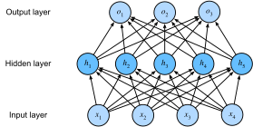

# Perceptron Đa lớp
<a id="sec_mlp"></a>

Trong [sec_softmax](#sec_softmax), chúng ta đã giới thiệu
hồi quy softmax,
cài đặt thuật toán từ đầu
([sec_softmax_scratch](#sec_softmax_scratch)) và sử dụng API cấp cao
([sec_softmax_concise](#sec_softmax_concise)). Điều này cho phép chúng ta
huấn luyện các bộ phân loại có khả năng nhận dạng
10 danh mục quần áo từ ảnh độ phân giải thấp.
Trên đường đi, chúng ta đã học cách xử lý dữ liệu,
ép các đầu ra thành phân phối xác suất hợp lệ,
áp dụng hàm mất mát thích hợp,
và tối thiểu hóa nó theo tham số mô hình của chúng ta.
Bây giờ chúng ta đã thành thạo các cơ chế này
trong ngữ cảnh các mô hình tuyến tính đơn giản,
chúng ta có thể khởi động khám phá mạng nơ-ron sâu,
lớp mô hình tương đối phong phú
mà cuốn sách này chủ yếu quan tâm.


```python
%matplotlib inline
from d2l import torch as d2l
import torch
```


## Lớp Ẩn

Chúng ta đã mô tả các phép biến đổi affine trong
[subsec_linear_model](#subsec_linear_model) như là
các phép biến đổi tuyến tính với hệ số chặn được thêm vào.
Để bắt đầu, hãy nhớ lại kiến trúc mô hình
tương ứng với ví dụ hồi quy softmax của chúng ta,
được minh họa trong [fig_softmaxreg](#fig_softmaxreg).
Mô hình này ánh xạ trực tiếp đầu vào sang đầu ra
thông qua một phép biến đổi affine duy nhất,
tiếp theo là một phép toán softmax.
Nếu nhãn của chúng ta thực sự có liên quan
đến dữ liệu đầu vào bằng một phép biến đổi affine đơn giản,
thì phương pháp này sẽ đủ.
Tuy nhiên, tuyến tính (trong các phép biến đổi affine) là một giả định *mạnh*.

### Giới hạn của Mô hình Tuyến tính

Ví dụ, tuyến tính ngụ ý giả định *yếu hơn*
về *đơn điệu*, tức là
bất kỳ sự tăng nào trong đặc trưng của chúng ta phải
luôn gây ra sự tăng trong đầu ra mô hình của chúng ta
(nếu trọng số tương ứng dương),
hoặc luôn gây ra sự giảm trong đầu ra mô hình của chúng ta
(nếu trọng số tương ứng âm).
Đôi khi điều đó có ý nghĩa.
Ví dụ, nếu chúng ta đang cố gắng dự đoán
liệu một cá nhân có trả được khoản vay hay không,
chúng ta có thể hợp lý giả định rằng tất cả mọi thứ như nhau,
một người nộp đơn có thu nhập cao hơn
sẽ luôn có nhiều khả năng trả hơn
so với người có thu nhập thấp hơn.
Mặc dù đơn điệu, mối quan hệ này có thể
không liên quan tuyến tính đến xác suất
trả nợ. Sự tăng thu nhập từ \$0 đến \$50,000
có thể tương ứng với sự tăng lớn hơn
trong khả năng trả nợ
so với sự tăng từ \$1 triệu đến \$1.05 triệu.
Một cách để xử lý điều này có thể là xử lý hậu kết quả của chúng ta
để tuyến tính trở nên hợp lý hơn,
bằng cách sử dụng ánh xạ logistic (và do đó logarit của xác suất kết quả).

Lưu ý rằng chúng ta có thể dễ dàng đưa ra ví dụ
vi phạm đơn điệu.
Giả sử ví dụ chúng ta muốn dự đoán sức khỏe như một hàm
của nhiệt độ cơ thể.
Với những cá nhân có nhiệt độ cơ thể bình thường
trên 37°C,
nhiệt độ cao hơn cho thấy rủi ro lớn hơn.
Tuy nhiên, nếu nhiệt độ cơ thể giảm
xuống dưới 37°C, nhiệt độ thấp hơn cho thấy rủi ro lớn hơn!
Một lần nữa, chúng ta có thể giải quyết vấn đề
với một số tiền xử lý thông minh, chẳng hạn như sử dụng khoảng cách từ 37°C
như một đặc trưng.


Nhưng còn phân loại ảnh của mèo và chó thì sao?
Tăng cường độ
của pixel tại vị trí (13, 17)
có luôn tăng (hoặc luôn giảm)
xác suất ảnh mô tả một con chó không?
Dựa vào mô hình tuyến tính tương ứng với giả định ngầm
rằng yêu cầu duy nhất
để phân biệt mèo và chó là đánh giá
độ sáng của từng pixel.
Cách tiếp cận này sẽ thất bại trong thế giới
khi đảo ngược ảnh vẫn bảo toàn danh mục.

Tuy nhiên, mặc dù tính vô lý rõ ràng của tuyến tính ở đây,
so với các ví dụ trước của chúng ta,
không rõ ràng rằng chúng ta có thể giải quyết vấn đề
bằng một sửa chữa tiền xử lý đơn giản.
Đó là, vì tầm quan trọng của bất kỳ pixel nào
phụ thuộc theo những cách phức tạp vào ngữ cảnh của nó
(các giá trị của các pixel xung quanh).
Trong khi có thể tồn tại một biểu diễn dữ liệu
tính đến
các tương tác liên quan giữa các đặc trưng của chúng ta,
trên đó một mô hình tuyến tính sẽ phù hợp,
chúng ta đơn giản không biết cách tính toán nó bằng tay.
Với mạng nơ-ron sâu, chúng ta đã sử dụng dữ liệu quan sát
để đồng thời học cả biểu diễn qua các lớp ẩn
và bộ dự đoán tuyến tính tác động lên biểu diễn đó.

Vấn đề phi tuyến này đã được nghiên cứu ít nhất một
thế kỷ [Fisher.1928]. Ví dụ, cây quyết định
ở dạng cơ bản nhất sử dụng chuỗi quyết định nhị phân để
quyết định thuộc lớp nào [quinlan2014c4]. Tương tự, các phương pháp
kernel đã được sử dụng trong nhiều thập kỷ để mô hình hóa phụ thuộc phi tuyến
[Aronszajn.1950]. Điều này đã tìm đường vào
các mô hình spline phi tham số [Wahba.1990] và phương pháp kernel
[Scholkopf.Smola.2002]. Đây cũng là điều mà não bộ giải quyết
khá tự nhiên. Xét cho cùng, các nơ-ron nuôi vào các nơ-ron khác mà,
lần lượt, lại nuôi vào các nơ-ron khác nữa [Cajal.Azoulay.1894].
Do đó chúng ta có một chuỗi các phép biến đổi tương đối đơn giản.

### Kết hợp Lớp Ẩn

Chúng ta có thể vượt qua giới hạn của mô hình tuyến tính
bằng cách kết hợp một hoặc nhiều lớp ẩn.
Cách dễ nhất để làm điều này là xếp chồng
nhiều lớp kết nối đầy đủ lên nhau.
Mỗi lớp nuôi vào lớp trên nó,
cho đến khi chúng ta tạo ra đầu ra.
Chúng ta có thể coi $L-1$ lớp đầu tiên
là biểu diễn của chúng ta và lớp cuối
là bộ dự đoán tuyến tính của chúng ta.
Kiến trúc này thường được gọi là
*perceptron đa lớp*,
thường được viết tắt là *MLP* ([fig_mlp](#fig_mlp)).


<a id="fig_mlp"></a>

MLP này có bốn đầu vào, ba đầu ra,
và lớp ẩn của nó chứa năm đơn vị ẩn.
Vì lớp đầu vào không liên quan đến bất kỳ phép tính nào,
tạo ra đầu ra với mạng này
đòi hỏi cài đặt các phép tính
cho cả lớp ẩn và lớp đầu ra;
do đó, số lượng lớp trong MLP này là hai.
Lưu ý rằng cả hai lớp đều kết nối đầy đủ.
Mỗi đầu vào ảnh hưởng đến mỗi nơ-ron trong lớp ẩn,
và mỗi nơ-ron trong số đó lần lượt ảnh hưởng
đến mỗi nơ-ron trong lớp đầu ra. Tiếc là, chúng ta chưa
xong.

### Từ Tuyến tính sang Phi tuyến

Như trước đây, chúng ta ký hiệu bằng ma trận $\mathbf{X} \in \mathbb{R}^{n \times d}$
một minibatch gồm $n$ mẫu khi mỗi mẫu có $d$ đầu vào (đặc trưng).
Với MLP một lớp ẩn có lớp ẩn chứa $h$ đơn vị ẩn,
chúng ta ký hiệu bằng $\mathbf{H} \in \mathbb{R}^{n \times h}$
các đầu ra của lớp ẩn, là
*biểu diễn ẩn*.
Vì lớp ẩn và lớp đầu ra đều kết nối đầy đủ,
chúng ta có trọng số lớp ẩn $\mathbf{W}^{(1)} \in \mathbb{R}^{d \times h}$ và hệ số chặn $\mathbf{b}^{(1)} \in \mathbb{R}^{1 \times h}$
và trọng số lớp đầu ra $\mathbf{W}^{(2)} \in \mathbb{R}^{h \times q}$ và hệ số chặn $\mathbf{b}^{(2)} \in \mathbb{R}^{1 \times q}$.
Điều này cho phép chúng ta tính toán đầu ra $\mathbf{O} \in \mathbb{R}^{n \times q}$
của MLP một lớp ẩn như sau:

$$
\begin{aligned}
    \mathbf{H} & = \mathbf{X} \mathbf{W}^{(1)} + \mathbf{b}^{(1)}, \\
    \mathbf{O} & = \mathbf{H}\mathbf{W}^{(2)} + \mathbf{b}^{(2)}.
\end{aligned}
$$

Lưu ý rằng sau khi thêm lớp ẩn,
mô hình của chúng ta bây giờ đòi hỏi chúng ta theo dõi và cập nhật
các tập tham số bổ sung.
Vậy chúng ta đã được gì đổi lại?
Bạn có thể ngạc nhiên khi phát hiện ra
rằng---trong mô hình được định nghĩa ở trên---*chúng ta
không được gì cả!*
Lý do rất rõ ràng.
Các đơn vị ẩn ở trên được cho bởi
một hàm affine của đầu vào,
và đầu ra (pre-softmax) chỉ là
một hàm affine của các đơn vị ẩn.
Một hàm affine của hàm affine
chính nó là một hàm affine.
Hơn nữa, mô hình tuyến tính của chúng ta đã
có khả năng biểu diễn bất kỳ hàm affine nào.

Để thấy điều này một cách hình thức, chúng ta chỉ có thể thu gọn lớp ẩn trong định nghĩa trên,
tạo ra một mô hình tương đương một lớp với tham số
$\mathbf{W} = \mathbf{W}^{(1)}\mathbf{W}^{(2)}$ và $\mathbf{b} = \mathbf{b}^{(1)} \mathbf{W}^{(2)} + \mathbf{b}^{(2)}$:

$$
\mathbf{O} = (\mathbf{X} \mathbf{W}^{(1)} + \mathbf{b}^{(1)})\mathbf{W}^{(2)} + \mathbf{b}^{(2)} = \mathbf{X} \mathbf{W}^{(1)}\mathbf{W}^{(2)} + \mathbf{b}^{(1)} \mathbf{W}^{(2)} + \mathbf{b}^{(2)} = \mathbf{X} \mathbf{W} + \mathbf{b}.
$$

Để nhận ra tiềm năng của các kiến trúc đa lớp,
chúng ta cần thêm một thành phần chính: một
*hàm kích hoạt* phi tuyến $\sigma$
được áp dụng cho mỗi đơn vị ẩn
theo sau phép biến đổi affine. Ví dụ, lựa chọn phổ biến
là hàm kích hoạt ReLU (đơn vị tuyến tính được chỉnh lưu) [Nair.Hinton.2010]
$\sigma(x) = \mathrm{max}(0, x)$ tác động lên các đối số của nó theo từng phần tử.
Đầu ra của hàm kích hoạt $\sigma(\cdot)$
được gọi là *kích hoạt*.
Nhìn chung, với các hàm kích hoạt được đặt vào,
không còn có thể thu gọn MLP của chúng ta thành một mô hình tuyến tính:

$$
\begin{aligned}
    \mathbf{H} & = \sigma(\mathbf{X} \mathbf{W}^{(1)} + \mathbf{b}^{(1)}), \\
    \mathbf{O} & = \mathbf{H}\mathbf{W}^{(2)} + \mathbf{b}^{(2)}.\\
\end{aligned}
$$

Vì mỗi hàng trong $\mathbf{X}$ tương ứng với một mẫu trong minibatch,
với một số lạm dụng ký hiệu, chúng ta định nghĩa phi tuyến
$\sigma$ được áp dụng cho đầu vào của nó theo từng hàng,
tức là một mẫu mỗi lần.
Lưu ý rằng chúng ta đã sử dụng ký hiệu tương tự cho softmax
khi chúng ta ký hiệu một phép toán theo hàng trong [subsec_softmax_vectorization](#subsec_softmax_vectorization).
Khá thường xuyên, các hàm kích hoạt chúng ta sử dụng áp dụng không chỉ theo hàng mà còn
theo từng phần tử. Điều đó có nghĩa là sau khi tính phần tuyến tính của lớp,
chúng ta có thể tính mỗi kích hoạt
mà không cần nhìn vào các giá trị được lấy bởi các đơn vị ẩn khác.

Để xây dựng MLP tổng quát hơn, chúng ta có thể tiếp tục xếp chồng
các lớp ẩn như vậy,
ví dụ: $\mathbf{H}^{(1)} = \sigma_1(\mathbf{X} \mathbf{W}^{(1)} + \mathbf{b}^{(1)})$
và $\mathbf{H}^{(2)} = \sigma_2(\mathbf{H}^{(1)} \mathbf{W}^{(2)} + \mathbf{b}^{(2)})$,
chồng lên nhau, tạo ra các mô hình ngày càng biểu đạt hơn.

### Bộ Xấp xỉ Toàn năng

Chúng ta biết rằng não bộ có khả năng phân tích thống kê rất tinh vi. Vì vậy,
đáng hỏi, *mạnh mẽ như thế nào* một mạng sâu có thể là. Câu hỏi này
đã được trả lời nhiều lần, ví dụ: trong Cybenko.1989 trong ngữ cảnh
của MLP, và trong micchelli1984interpolation trong ngữ cảnh tái tạo không gian
Hilbert kernel theo cách có thể được xem là mạng hàm cơ sở hướng tâm (RBF) với một lớp ẩn duy nhất.
Các kết quả này (và các kết quả liên quan) gợi ý rằng ngay cả với mạng một lớp ẩn,
với đủ nút (có thể vô lý nhiều),
và tập trọng số đúng,
chúng ta có thể mô hình hóa bất kỳ hàm nào.
Thực sự học hàm đó mới là phần khó, mặc dù.
Bạn có thể nghĩ mạng nơ-ron của mình
giống như ngôn ngữ lập trình C.
Ngôn ngữ này, như bất kỳ ngôn ngữ hiện đại nào khác,
có khả năng biểu đạt bất kỳ chương trình có thể tính toán được.
Nhưng thực sự tạo ra một chương trình
đáp ứng các đặc tả của bạn mới là phần khó.

Hơn nữa, chỉ vì mạng một lớp ẩn
*có thể* học bất kỳ hàm nào
không có nghĩa là bạn nên cố gắng
giải quyết tất cả vấn đề của mình
bằng một mạng như vậy. Thực tế, trong trường hợp này các phương pháp kernel
hiệu quả hơn nhiều, vì chúng có khả năng giải quyết bài toán
*chính xác* ngay cả trong không gian vô hạn chiều [Kimeldorf.Wahba.1971, Scholkopf.Herbrich.Smola.2001].
Thực ra, chúng ta có thể xấp xỉ nhiều hàm
gọn hơn nhiều bằng cách sử dụng các mạng sâu hơn (thay vì rộng hơn) [Simonyan.Zisserman.2014].
Chúng ta sẽ đề cập đến các lập luận nghiêm ngặt hơn trong các chương tiếp theo.


## Hàm Kích hoạt
<a id="subsec_activation-functions"></a>

Hàm kích hoạt quyết định liệu một nơ-ron có nên được kích hoạt hay không bằng cách
tính tổng có trọng số và thêm hệ số chặn vào nó.
Chúng là các toán tử khả vi để biến đổi tín hiệu đầu vào sang đầu ra,
trong khi hầu hết chúng thêm phi tuyến.
Vì hàm kích hoạt là nền tảng của deep learning,
(**hãy khảo sát ngắn gọn một số loại phổ biến**).

### Hàm ReLU

Lựa chọn phổ biến nhất,
nhờ cả sự đơn giản của cài đặt và
hiệu suất tốt của nó trên nhiều tác vụ dự đoán,
là *đơn vị tuyến tính được chỉnh lưu* (*ReLU*) [Nair.Hinton.2010].
[**ReLU cung cấp một phép biến đổi phi tuyến rất đơn giản**].
Cho một phần tử $x$, hàm được định nghĩa
là giá trị tối đa của phần tử đó và $0$:

$$\operatorname{ReLU}(x) = \max(x, 0).$$

Nói một cách thông thường, hàm ReLU chỉ giữ lại các
phần tử dương và loại bỏ tất cả các phần tử âm
bằng cách đặt các kích hoạt tương ứng thành 0.
Để có trực giác, chúng ta có thể vẽ hàm.
Như bạn thấy, hàm kích hoạt là tuyến tính từng đoạn.


```python
x = torch.arange(-8.0, 8.0, 0.1, requires_grad=True)
y = torch.relu(x)
d2l.plot(x.detach(), y.detach(), 'x', 'relu(x)', figsize=(5, 2.5))
```


Khi đầu vào âm,
đạo hàm của hàm ReLU là 0,
và khi đầu vào dương,
đạo hàm của hàm ReLU là 1.
Lưu ý rằng hàm ReLU không khả vi
khi đầu vào bằng chính xác 0.
Trong những trường hợp này, chúng ta mặc định về phía bên trái
đạo hàm và nói rằng đạo hàm là 0 khi đầu vào là 0.
Chúng ta có thể làm điều này vì
đầu vào có thể không bao giờ thực sự bằng không (các nhà toán học sẽ
nói rằng nó không khả vi trên một tập có đo bằng không).
Có một câu ngạn ngữ cũ rằng nếu các điều kiện biên tinh tế quan trọng,
chúng ta có thể đang làm (*thực sự*) toán học, không phải kỹ thuật.
Sự khôn ngoan thông thường đó có thể áp dụng ở đây, hoặc ít nhất, thực tế là
chúng ta không thực hiện tối ưu hóa có ràng buộc [Mangasarian.1965, Rockafellar.1970].
Chúng ta vẽ đạo hàm của hàm ReLU bên dưới.


```python
y.backward(torch.ones_like(x), retain_graph=True)
d2l.plot(x.detach(), x.grad, 'x', 'grad of relu', figsize=(5, 2.5))
```


Lý do sử dụng ReLU là
các đạo hàm của nó hoạt động đặc biệt tốt:
hoặc chúng biến mất hoặc chúng chỉ để đối số đi qua.
Điều này làm cho tối ưu hóa hoạt động tốt hơn
và nó giảm thiểu vấn đề được ghi chép rõ ràng
về gradient biến mất đã làm khó chịu
các phiên bản trước của mạng nơ-ron (sẽ nói thêm về điều này sau).

Lưu ý rằng có nhiều biến thể của hàm ReLU,
bao gồm hàm *ReLU được tham số hóa* (*pReLU*) [He.Zhang.Ren.ea.2015].
Biến thể này thêm một số hạng tuyến tính vào ReLU,
vì vậy một số thông tin vẫn được truyền qua,
ngay cả khi đối số âm:

$$\operatorname{pReLU}(x) = \max(0, x) + \alpha \min(0, x).$$

### Hàm Sigmoid

[**Hàm *sigmoid* biến đổi những đầu vào**]
có giá trị nằm trong miền $\mathbb{R}$,
(**thành đầu ra nằm trong khoảng (0, 1).**)
Vì lý do đó, sigmoid
thường được gọi là *hàm nén*:
nó nén bất kỳ đầu vào nào trong phạm vi (-inf, inf)
thành một giá trị nào đó trong phạm vi (0, 1):

$$\operatorname{sigmoid}(x) = \frac{1}{1 + \exp(-x)}.$$

Trong các mạng nơ-ron đầu tiên, các nhà khoa học
quan tâm đến việc mô hình hóa các nơ-ron sinh học
mà *kích hoạt* hoặc *không kích hoạt*.
Do đó những người tiên phong trong lĩnh vực này,
truy nguyên về tận McCulloch và Pitts,
những người phát minh ra nơ-ron nhân tạo,
tập trung vào các đơn vị ngưỡng [McCulloch.Pitts.1943].
Kích hoạt ngưỡng lấy giá trị 0
khi đầu vào dưới một số ngưỡng
và giá trị 1 khi đầu vào vượt ngưỡng.

Khi sự chú ý chuyển sang học dựa trên gradient,
hàm sigmoid là lựa chọn tự nhiên
vì nó là một xấp xỉ mịn, khả vi
cho đơn vị ngưỡng.
Sigmoid vẫn được sử dụng rộng rãi như là
hàm kích hoạt trên các đơn vị đầu ra
khi chúng ta muốn diễn giải đầu ra như xác suất
cho các bài toán phân loại nhị phân: bạn có thể nghĩ sigmoid là trường hợp đặc biệt của softmax.
Tuy nhiên, sigmoid đã phần lớn được thay thế
bởi ReLU đơn giản hơn và dễ huấn luyện hơn
cho hầu hết sử dụng trong lớp ẩn. Phần lớn điều này liên quan
đến việc sigmoid đặt ra thách thức cho tối ưu hóa
[LeCun.Bottou.Orr.ea.1998] vì gradient của nó biến mất với đối số dương *và* âm lớn.
Điều này có thể dẫn đến các bình nguyên khó thoát ra.
Tuy nhiên sigmoid vẫn quan trọng. Trong các chương sau (ví dụ: [sec_lstm](#sec_lstm)) về mạng nơ-ron hồi tiếp,
chúng ta sẽ mô tả các kiến trúc tận dụng đơn vị sigmoid
để kiểm soát luồng thông tin theo thời gian.

Bên dưới, chúng ta vẽ hàm sigmoid.
Lưu ý rằng khi đầu vào gần 0,
hàm sigmoid tiến gần đến
một phép biến đổi tuyến tính.


```python
y = torch.sigmoid(x)
d2l.plot(x.detach(), y.detach(), 'x', 'sigmoid(x)', figsize=(5, 2.5))
```


Đạo hàm của hàm sigmoid được cho bởi phương trình sau:

$$\frac{d}{dx} \operatorname{sigmoid}(x) = \frac{\exp(-x)}{(1 + \exp(-x))^2} = \operatorname{sigmoid}(x)\left(1-\operatorname{sigmoid}(x)\right).$$


Đạo hàm của hàm sigmoid được vẽ bên dưới.
Lưu ý rằng khi đầu vào là 0,
đạo hàm của hàm sigmoid
đạt giá trị tối đa là 0.25.
Khi đầu vào phân kỳ khỏi 0 theo bất kỳ hướng nào,
đạo hàm tiến gần đến 0.


```python
# Clear out previous gradients
x.grad.data.zero_()
y.backward(torch.ones_like(x),retain_graph=True)
d2l.plot(x.detach(), x.grad, 'x', 'grad of sigmoid', figsize=(5, 2.5))
```


### Hàm Tanh
<a id="subsec_tanh"></a>

Giống như hàm sigmoid, [**hàm tanh (tiếp tuyến hypebol)
cũng nén đầu vào của nó**],
biến đổi chúng thành các phần tử trong khoảng (**giữa $-1$ và $1$**):

$$\operatorname{tanh}(x) = \frac{1 - \exp(-2x)}{1 + \exp(-2x)}.$$

Chúng ta vẽ hàm tanh bên dưới. Lưu ý khi đầu vào tiến gần 0, hàm tanh tiến gần đến một phép biến đổi tuyến tính. Mặc dù hình dạng của hàm tương tự như hàm sigmoid, hàm tanh thể hiện đối xứng điểm về gốc tọa độ [Kalman.Kwasny.1992].


```python
y = torch.tanh(x)
d2l.plot(x.detach(), y.detach(), 'x', 'tanh(x)', figsize=(5, 2.5))
```


Đạo hàm của hàm tanh là:

$$\frac{d}{dx} \operatorname{tanh}(x) = 1 - \operatorname{tanh}^2(x).$$

Nó được vẽ bên dưới.
Khi đầu vào tiến gần 0,
đạo hàm của hàm tanh tiến gần đến giá trị tối đa là 1.
Và như chúng ta đã thấy với hàm sigmoid,
khi đầu vào di chuyển ra khỏi 0 theo bất kỳ hướng nào,
đạo hàm của hàm tanh tiến gần đến 0.


```python
# Clear out previous gradients
x.grad.data.zero_()
y.backward(torch.ones_like(x),retain_graph=True)
d2l.plot(x.detach(), x.grad, 'x', 'grad of tanh', figsize=(5, 2.5))
```


## Tóm tắt và Thảo luận

Bây giờ chúng ta biết cách kết hợp phi tuyến
để xây dựng các kiến trúc mạng nơ-ron đa lớp biểu đạt.
Như một ghi chú phụ, kiến thức của bạn đã
đặt bạn nắm quyền một bộ công cụ tương tự
với người thực hành vào khoảng năm 1990.
Theo một nghĩa nào đó, bạn có lợi thế
hơn bất kỳ ai làm việc thời đó,
vì bạn có thể tận dụng các framework deep learning
mã nguồn mở mạnh mẽ
để xây dựng mô hình nhanh chóng, chỉ sử dụng vài dòng code.
Trước đây, huấn luyện các mạng này
đòi hỏi các nhà nghiên cứu phải viết code các lớp và đạo hàm
một cách tường minh trong C, Fortran, hoặc thậm chí Lisp (trong trường hợp LeNet).

Một lợi ích thứ cấp là ReLU dễ tối ưu hóa hơn đáng kể
so với sigmoid hoặc hàm tanh. Người ta có thể lập luận
rằng đây là một trong những đổi mới chính đã giúp sự phục hưng
của deep learning trong thập kỷ qua. Lưu ý, tuy nhiên, rằng nghiên cứu về
hàm kích hoạt chưa dừng lại.
Ví dụ,
hàm kích hoạt GELU (đơn vị tuyến tính lỗi Gaussian)
$x \Phi(x)$ bởi Hendrycks.Gimpel.2016 ($\Phi(x)$
là hàm phân phối tích lũy Gaussian chuẩn)
và
hàm kích hoạt Swish
$\sigma(x) = x \operatorname{sigmoid}(\beta x)$ được đề xuất trong Ramachandran.Zoph.Le.2017 có thể mang lại độ chính xác tốt hơn
trong nhiều trường hợp.

## Bài tập

1. Chứng minh rằng việc thêm lớp vào mạng sâu *tuyến tính*, tức là mạng không có
   phi tuyến $\sigma$, không bao giờ có thể tăng sức mạnh biểu đạt của mạng.
   Đưa ra ví dụ khi nó chủ động giảm đi.
1. Tính đạo hàm của hàm kích hoạt pReLU.
1. Tính đạo hàm của hàm kích hoạt Swish $x \operatorname{sigmoid}(\beta x)$.
1. Chứng minh rằng MLP chỉ sử dụng ReLU (hoặc pReLU) xây dựng một
   hàm tuyến tính từng đoạn liên tục.
1. Sigmoid và tanh rất giống nhau.
    1. Chứng minh $\operatorname{tanh}(x) + 1 = 2 \operatorname{sigmoid}(2x)$.
    1. Chứng minh rằng các lớp hàm được tham số hóa bởi cả hai phi tuyến đều giống hệt nhau. Gợi ý: các lớp affine cũng có số hạng hệ số chặn.
1. Giả sử chúng ta có một phi tuyến được áp dụng cho một minibatch mỗi lần, chẳng hạn như chuẩn hóa batch [Ioffe.Szegedy.2015]. Bạn kỳ vọng điều này gây ra vấn đề gì?
1. Đưa ra ví dụ khi gradient biến mất với hàm kích hoạt sigmoid.


[Discussions](https://discuss.d2l.ai/t/91)
