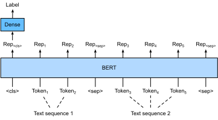

# Fine-tune BERT cho các ứng dụng cấp chuỗi và cấp token

Trong các phần trước của chương này,
chúng ta đã thiết kế những mô hình khác nhau cho các ứng dụng xử lý ngôn ngữ tự nhiên,
chẳng hạn dựa trên RNN, CNN, attention và MLP.
Những mô hình này hữu ích khi có ràng buộc về không gian hoặc thời gian,
tuy nhiên,
việc thiết kế một mô hình riêng cho từng tác vụ xử lý ngôn ngữ tự nhiên
trên thực tế là không khả thi.
Trong [sec_bert](#sec_bert),
chúng ta đã giới thiệu một mô hình tiền huấn luyện, BERT,
yêu cầu rất ít thay đổi kiến trúc
cho một phạm vi rộng các tác vụ xử lý ngôn ngữ tự nhiên.
Một mặt,
tại thời điểm được đề xuất,
BERT đã cải thiện trạng thái tốt nhất lúc bấy giờ trên nhiều tác vụ xử lý ngôn ngữ tự nhiên.
Mặt khác,
như đã lưu ý trong [sec_bert-pretraining](#sec_bert-pretraining),
hai phiên bản của mô hình BERT gốc
có 110 triệu và 340 triệu tham số.
Do đó, khi có đủ tài nguyên tính toán,
chúng ta có thể cân nhắc
fine-tune BERT cho các ứng dụng xử lý ngôn ngữ tự nhiên downstream.

Sau đây,
chúng ta khái quát hóa một tập con các ứng dụng xử lý ngôn ngữ tự nhiên
thành cấp chuỗi và cấp token.
Ở cấp chuỗi,
chúng ta giới thiệu cách biến đổi biểu diễn BERT của đầu vào văn bản
thành nhãn đầu ra
trong phân loại văn bản đơn
và phân loại hoặc hồi quy cặp văn bản.
Ở cấp token, chúng ta sẽ giới thiệu ngắn gọn các ứng dụng mới
như gán nhãn văn bản và hỏi đáp,
đồng thời làm rõ cách BERT có thể biểu diễn đầu vào của chúng và được biến đổi thành nhãn đầu ra.
Trong quá trình fine-tune,
"những thay đổi kiến trúc tối thiểu" mà BERT yêu cầu trên các ứng dụng khác nhau
là các tầng kết nối đầy đủ bổ sung.
Trong học có giám sát của một ứng dụng downstream,
tham số của các tầng bổ sung được học từ đầu trong khi
tất cả tham số trong mô hình BERT đã tiền huấn luyện được fine-tune.

## Phân loại văn bản đơn

*Phân loại văn bản đơn* nhận một chuỗi văn bản đơn lẻ làm đầu vào và xuất ra kết quả phân loại của nó.
Bên cạnh phân tích cảm xúc mà chúng ta đã nghiên cứu trong chương này,
Corpus of Linguistic Acceptability (CoLA)
cũng là một bộ dữ liệu cho phân loại văn bản đơn,
đánh giá liệu một câu cho trước có chấp nhận được về mặt ngữ pháp hay không [Warstadt.Singh.Bowman.2019].
Chẳng hạn, "I should study." là chấp nhận được nhưng "I should studying." thì không.

[sec_bert](#sec_bert) mô tả biểu diễn đầu vào của BERT.
Chuỗi đầu vào BERT biểu diễn rõ ràng cả văn bản đơn và cặp văn bản,
trong đó token phân loại đặc biệt
“&lt;cls&gt;” được dùng cho phân loại chuỗi và
token phân loại đặc biệt
“&lt;sep&gt;” đánh dấu điểm kết thúc của văn bản đơn hoặc phân tách một cặp văn bản.
Như trong [fig_bert-one-seq](#fig_bert-one-seq),
trong các ứng dụng phân loại văn bản đơn,
biểu diễn BERT của token phân loại đặc biệt
“&lt;cls&gt;” mã hóa thông tin của toàn bộ chuỗi văn bản đầu vào.
Là biểu diễn của văn bản đơn đầu vào,
nó sẽ được đưa vào một MLP nhỏ gồm các tầng kết nối đầy đủ (dense)
để xuất ra phân phối của tất cả giá trị nhãn rời rạc.

## Phân loại hoặc hồi quy cặp văn bản

Chúng ta cũng đã khảo sát suy luận ngôn ngữ tự nhiên trong chương này.
Nó thuộc về *phân loại cặp văn bản*,
một loại ứng dụng phân loại một cặp văn bản.

Nhận một cặp văn bản làm đầu vào nhưng xuất ra một giá trị liên tục,
*độ tương đồng ngữ nghĩa của văn bản* là một tác vụ *hồi quy cặp văn bản* phổ biến.
Tác vụ này đo độ tương đồng ngữ nghĩa của các câu.
Chẳng hạn, trong bộ dữ liệu Semantic Textual Similarity Benchmark,
điểm tương đồng của một cặp câu
là một thang thứ bậc từ 0 (không chồng lấp về nghĩa) đến 5 (tương đương về nghĩa) [Cer.Diab.Agirre.ea.2017].
Mục tiêu là dự đoán các điểm này.
Các ví dụ từ bộ dữ liệu Semantic Textual Similarity Benchmark gồm (câu 1, câu 2, điểm tương đồng):

* "A plane is taking off.", "An air plane is taking off.", 5.000;
* "A woman is eating something.", "A woman is eating meat.", 3.000;
* "A woman is dancing.", "A man is talking.", 0.000.

So với phân loại văn bản đơn trong [fig_bert-one-seq](#fig_bert-one-seq),
fine-tune BERT cho phân loại cặp văn bản trong [fig_bert-two-seqs](#fig_bert-two-seqs)
khác ở biểu diễn đầu vào.
Với các tác vụ hồi quy cặp văn bản như độ tương đồng ngữ nghĩa của văn bản,
có thể áp dụng những thay đổi đơn giản như xuất ra một giá trị nhãn liên tục
và dùng mean squared loss: đây là những lựa chọn phổ biến cho hồi quy.

## Gán nhãn văn bản

Bây giờ hãy xét các tác vụ cấp token, chẳng hạn như *gán nhãn văn bản*,
trong đó mỗi token được gán một nhãn.
Trong các tác vụ gán nhãn văn bản,
*gán nhãn từ loại* gán cho mỗi từ một nhãn từ loại (ví dụ, tính từ và từ hạn định)
theo vai trò của từ trong câu.
Ví dụ,
theo bộ nhãn Penn Treebank II,
câu "John Smith 's car is new"
nên được gán nhãn là
"NNP (noun, proper singular) NNP POS (possessive ending) NN (noun, singular or mass) VB (verb, base form) JJ (adjective)".

Fine-tune BERT cho các ứng dụng gán nhãn văn bản
được minh họa trong [fig_bert-tagging](#fig_bert-tagging).
So với [fig_bert-one-seq](#fig_bert-one-seq),
điểm khác biệt duy nhất nằm ở chỗ
trong gán nhãn văn bản, biểu diễn BERT của *mọi token* trong văn bản đầu vào
được đưa vào cùng các tầng kết nối đầy đủ bổ sung để xuất ra nhãn của token,
chẳng hạn như một nhãn từ loại.

## Hỏi đáp

Là một ứng dụng cấp token khác,
*hỏi đáp* phản ánh năng lực đọc hiểu.
Ví dụ,
Stanford Question Answering Dataset (SQuAD v1.1)
gồm các đoạn đọc và câu hỏi,
trong đó đáp án cho mỗi câu hỏi
chỉ là một đoạn văn bản (text span) từ đoạn đọc mà câu hỏi nói đến [Rajpurkar.Zhang.Lopyrev.ea.2016].
Để giải thích,
xét một đoạn đọc
"Some experts report that a mask's efficacy is inconclusive. However, mask makers insist that their products, such as N95 respirator masks, can guard against the virus."
và câu hỏi "Who say that N95 respirator masks can guard against the virus?".
Đáp án nên là text span "mask makers" trong đoạn đọc.
Do đó, mục tiêu trong SQuAD v1.1 là dự đoán vị trí bắt đầu và kết thúc của text span trong đoạn đọc, với một cặp câu hỏi và đoạn đọc cho trước.

Để fine-tune BERT cho hỏi đáp,
câu hỏi và đoạn đọc được đóng gói lần lượt thành
chuỗi văn bản thứ nhất và thứ hai
trong đầu vào của BERT.
Để dự đoán vị trí bắt đầu của text span,
cùng một tầng kết nối đầy đủ bổ sung sẽ biến đổi
biểu diễn BERT của bất kỳ token nào từ đoạn đọc ở vị trí $i$
thành một điểm vô hướng $s_i$.
Các điểm như vậy của tất cả token trong đoạn đọc
được biến đổi tiếp bằng phép softmax
thành một phân phối xác suất,
sao cho mỗi vị trí token $i$ trong đoạn đọc được gán
một xác suất $p_i$ là điểm bắt đầu của text span.
Dự đoán điểm kết thúc của text span
tương tự như trên, ngoại trừ việc
tham số trong tầng kết nối đầy đủ bổ sung của nó
độc lập với các tham số dùng để dự đoán điểm bắt đầu.
Khi dự đoán điểm kết thúc,
bất kỳ token nào trong đoạn đọc ở vị trí $i$
được biến đổi bởi cùng tầng kết nối đầy đủ
thành một điểm vô hướng $e_i$.
[fig_bert-qa](#fig_bert-qa)
mô tả fine-tune BERT cho hỏi đáp.

Với hỏi đáp,
mục tiêu huấn luyện của học có giám sát đơn giản là
tối đa hóa log-likelihood của các vị trí bắt đầu và kết thúc ground-truth.
Khi dự đoán span,
chúng ta có thể tính điểm $s_i + e_j$ cho một span hợp lệ
từ vị trí $i$ đến vị trí $j$ ($i \leq j$),
và xuất ra span có điểm cao nhất.

## Tóm tắt

* BERT yêu cầu rất ít thay đổi kiến trúc (các tầng kết nối đầy đủ bổ sung) cho các ứng dụng xử lý ngôn ngữ tự nhiên cấp chuỗi và cấp token, chẳng hạn như phân loại văn bản đơn (ví dụ, phân tích cảm xúc và kiểm tra tính chấp nhận được về ngôn ngữ), phân loại hoặc hồi quy cặp văn bản (ví dụ, suy luận ngôn ngữ tự nhiên và độ tương đồng ngữ nghĩa của văn bản), gán nhãn văn bản (ví dụ, gán nhãn từ loại), và hỏi đáp.
* Trong học có giám sát của một ứng dụng downstream, tham số của các tầng bổ sung được học từ đầu trong khi tất cả tham số trong mô hình BERT đã tiền huấn luyện được fine-tune.

## Bài tập

1. Hãy thiết kế một thuật toán công cụ tìm kiếm cho các bài báo tin tức. Khi hệ thống nhận một truy vấn (ví dụ, "oil industry during the coronavirus outbreak"), nó nên trả về một danh sách xếp hạng các bài báo tin tức liên quan nhất đến truy vấn. Giả sử chúng ta có một kho bài báo tin tức rất lớn và một số lượng lớn truy vấn. Để đơn giản hóa bài toán, giả sử bài báo liên quan nhất đã được gán nhãn cho mỗi truy vấn. Chúng ta có thể áp dụng negative sampling (xem [subsec_negative-sampling](#subsec_negative-sampling)) và BERT trong thiết kế thuật toán như thế nào?
1. Chúng ta có thể tận dụng BERT trong huấn luyện các mô hình ngôn ngữ như thế nào?
1. Chúng ta có thể tận dụng BERT trong dịch máy không?

[Thảo luận](https://discuss.d2l.ai/t/396)
