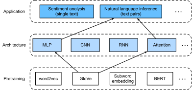

# Suy luận ngôn ngữ tự nhiên: Sử dụng attention
<a id="sec_natural-language-inference-attention"></a>

Chúng ta đã giới thiệu tác vụ suy luận ngôn ngữ tự nhiên và bộ dữ liệu SNLI trong [sec_natural-language-inference-and-dataset](#sec_natural-language-inference-and-dataset). Trước nhiều mô hình dựa trên các kiến trúc phức tạp và sâu, Parikh.Tackstrom.Das.ea.2016 đã đề xuất giải quyết suy luận ngôn ngữ tự nhiên bằng các cơ chế attention và gọi đó là một "mô hình attention có thể phân rã".
Kết quả là một mô hình không có tầng hồi tiếp hay tầng tích chập, đạt kết quả tốt nhất lúc bấy giờ trên bộ dữ liệu SNLI với số tham số ít hơn nhiều.
Trong phần này, chúng ta sẽ mô tả và triển khai phương pháp dựa trên attention này (cùng MLP) cho suy luận ngôn ngữ tự nhiên, như minh họa trong [fig_nlp-map-nli-attention](#fig_nlp-map-nli-attention).


<a id="fig_nlp-map-nli-attention"></a>


## Mô hình

Đơn giản hơn việc bảo toàn thứ tự token trong tiền đề và giả thuyết,
chúng ta có thể chỉ cần căn chỉnh các token trong một chuỗi văn bản với mọi token trong chuỗi còn lại, và ngược lại,
rồi so sánh và tổng hợp thông tin đó để dự đoán quan hệ logic
giữa tiền đề và giả thuyết.
Tương tự việc căn chỉnh token giữa câu nguồn và câu đích trong dịch máy,
việc căn chỉnh token giữa tiền đề và giả thuyết
có thể được thực hiện gọn gàng bằng các cơ chế attention.


<a id="fig_nli_attention"></a>

[fig_nli_attention](#fig_nli_attention) mô tả phương pháp suy luận ngôn ngữ tự nhiên bằng các cơ chế attention.
Ở mức khái quát, nó gồm ba bước được huấn luyện chung: attending, comparing và aggregating.
Chúng ta sẽ minh họa từng bước trong phần sau.

```python
#@tab mxnet
from d2l import mxnet as d2l
from mxnet import gluon, init, np, npx
from mxnet.gluon import nn

npx.set_np()
```

```python
#@tab pytorch
from d2l import torch as d2l
import torch
from torch import nn
from torch.nn import functional as F
```

### Attending

Bước đầu tiên là căn chỉnh các token trong một chuỗi văn bản với từng token trong chuỗi còn lại.
Giả sử tiền đề là "i do need sleep" và giả thuyết là "i am tired".
Do tương đồng ngữ nghĩa,
ta có thể muốn căn chỉnh "i" trong giả thuyết với "i" trong tiền đề,
và căn chỉnh "tired" trong giả thuyết với "sleep" trong tiền đề.
Tương tự, ta có thể muốn căn chỉnh "i" trong tiền đề với "i" trong giả thuyết,
và căn chỉnh "need" và "sleep" trong tiền đề với "tired" trong giả thuyết.
Lưu ý rằng phép căn chỉnh như vậy là *mềm* bằng cách dùng trung bình có trọng số,
trong đó lý tưởng là các trọng số lớn gắn với những token cần được căn chỉnh.
Để dễ minh họa, [fig_nli_attention](#fig_nli_attention) biểu diễn phép căn chỉnh này theo cách *cứng*.

Bây giờ chúng ta mô tả chi tiết hơn phép căn chỉnh mềm bằng các cơ chế attention.
Ký hiệu $\mathbf{A} = (\mathbf{a}_1, \ldots, \mathbf{a}_m)$
và $\mathbf{B} = (\mathbf{b}_1, \ldots, \mathbf{b}_n)$ là tiền đề và giả thuyết,
với số token lần lượt là $m$ và $n$,
trong đó $\mathbf{a}_i, \mathbf{b}_j \in \mathbb{R}^{d}$ ($i = 1, \ldots, m, j = 1, \ldots, n$) là vector từ $d$ chiều.
Với căn chỉnh mềm, chúng ta tính các trọng số attention $e_{ij} \in \mathbb{R}$ như sau

$$e_{ij} = f(\mathbf{a}_i)^\top f(\mathbf{b}_j),$$

trong đó hàm $f$ là một MLP được định nghĩa trong hàm `mlp` sau.
Chiều đầu ra của $f$ được chỉ định bởi đối số `num_hiddens` của `mlp`.

```python
#@tab mxnet
def mlp(num_hiddens, flatten):
    net = nn.Sequential()
    net.add(nn.Dropout(0.2))
    net.add(nn.Dense(num_hiddens, activation='relu', flatten=flatten))
    net.add(nn.Dropout(0.2))
    net.add(nn.Dense(num_hiddens, activation='relu', flatten=flatten))
    return net
```

```python
#@tab pytorch
def mlp(num_inputs, num_hiddens, flatten):
    net = []
    net.append(nn.Dropout(0.2))
    net.append(nn.Linear(num_inputs, num_hiddens))
    net.append(nn.ReLU())
    if flatten:
        net.append(nn.Flatten(start_dim=1))
    net.append(nn.Dropout(0.2))
    net.append(nn.Linear(num_hiddens, num_hiddens))
    net.append(nn.ReLU())
    if flatten:
        net.append(nn.Flatten(start_dim=1))
    return nn.Sequential(*net)
```

Cần nhấn mạnh rằng, trong :eqref:`eq_nli_e`,
$f$ nhận riêng các đầu vào $\mathbf{a}_i$ và $\mathbf{b}_j$ thay vì nhận một cặp của chúng làm đầu vào.
Thủ thuật *phân rã* này dẫn đến chỉ $m + n$ lần áp dụng (độ phức tạp tuyến tính) của $f$ thay vì $mn$ lần áp dụng
(độ phức tạp bậc hai).


Chuẩn hóa các trọng số attention trong :eqref:`eq_nli_e`,
chúng ta tính trung bình có trọng số của tất cả vector token trong giả thuyết
để thu được biểu diễn của giả thuyết được căn chỉnh mềm với token có chỉ số $i$ trong tiền đề:

$$
\boldsymbol{\beta}_i = \sum_{j=1}^{n}\frac{\exp(e_{ij})}{ \sum_{k=1}^{n} \exp(e_{ik})} \mathbf{b}_j.
$$

Tương tự, chúng ta tính căn chỉnh mềm của các token tiền đề cho mỗi token có chỉ số $j$ trong giả thuyết:

$$
\boldsymbol{\alpha}_j = \sum_{i=1}^{m}\frac{\exp(e_{ij})}{ \sum_{k=1}^{m} \exp(e_{kj})} \mathbf{a}_i.
$$

Dưới đây chúng ta định nghĩa lớp `Attend` để tính căn chỉnh mềm của các giả thuyết (`beta`) với các tiền đề đầu vào `A` và căn chỉnh mềm của các tiền đề (`alpha`) với các giả thuyết đầu vào `B`.

```python
#@tab mxnet
class Attend(nn.Block):
    def __init__(self, num_hiddens, **kwargs):
        super(Attend, self).__init__(**kwargs)
        self.f = mlp(num_hiddens=num_hiddens, flatten=False)

    def forward(self, A, B):
        # Shape of `A`/`B`: (b`atch_size`, no. of tokens in sequence A/B,
        # `embed_size`)
        # Shape of `f_A`/`f_B`: (`batch_size`, no. of tokens in sequence A/B,
        # `num_hiddens`)
        f_A = self.f(A)
        f_B = self.f(B)
        # Shape of `e`: (`batch_size`, no. of tokens in sequence A,
        # no. of tokens in sequence B)
        e = npx.batch_dot(f_A, f_B, transpose_b=True)
        # Shape of `beta`: (`batch_size`, no. of tokens in sequence A,
        # `embed_size`), where sequence B is softly aligned with each token
        # (axis 1 of `beta`) in sequence A
        beta = npx.batch_dot(npx.softmax(e), B)
        # Shape of `alpha`: (`batch_size`, no. of tokens in sequence B,
        # `embed_size`), where sequence A is softly aligned with each token
        # (axis 1 of `alpha`) in sequence B
        alpha = npx.batch_dot(npx.softmax(e.transpose(0, 2, 1)), A)
        return beta, alpha
```

```python
#@tab pytorch
class Attend(nn.Module):
    def __init__(self, num_inputs, num_hiddens, **kwargs):
        super(Attend, self).__init__(**kwargs)
        self.f = mlp(num_inputs, num_hiddens, flatten=False)

    def forward(self, A, B):
        # Shape of `A`/`B`: (`batch_size`, no. of tokens in sequence A/B,
        # `embed_size`)
        # Shape of `f_A`/`f_B`: (`batch_size`, no. of tokens in sequence A/B,
        # `num_hiddens`)
        f_A = self.f(A)
        f_B = self.f(B)
        # Shape of `e`: (`batch_size`, no. of tokens in sequence A,
        # no. of tokens in sequence B)
        e = torch.bmm(f_A, f_B.permute(0, 2, 1))
        # Shape of `beta`: (`batch_size`, no. of tokens in sequence A,
        # `embed_size`), where sequence B is softly aligned with each token
        # (axis 1 of `beta`) in sequence A
        beta = torch.bmm(F.softmax(e, dim=-1), B)
        # Shape of `alpha`: (`batch_size`, no. of tokens in sequence B,
        # `embed_size`), where sequence A is softly aligned with each token
        # (axis 1 of `alpha`) in sequence B
        alpha = torch.bmm(F.softmax(e.permute(0, 2, 1), dim=-1), A)
        return beta, alpha
```

### Comparing

Ở bước tiếp theo, chúng ta so sánh một token trong một chuỗi với chuỗi còn lại đã được căn chỉnh mềm với token đó.
Lưu ý rằng trong căn chỉnh mềm, tất cả token từ một chuỗi, dù có thể có các trọng số attention khác nhau, sẽ được so sánh với một token trong chuỗi còn lại.
Để dễ minh họa, [fig_nli_attention](#fig_nli_attention) ghép cặp các token với các token được căn chỉnh theo cách *cứng*.
Ví dụ, giả sử bước attending xác định rằng "need" và "sleep" trong tiền đề đều được căn chỉnh với "tired" trong giả thuyết, cặp "tired--need sleep" sẽ được so sánh.

Trong bước comparing, chúng ta đưa phép nối (toán tử $[\cdot, \cdot]$) của các token từ một chuỗi và các token được căn chỉnh từ chuỗi còn lại vào một hàm $g$ (một MLP):

$$\mathbf{v}_{A,i} = g([\mathbf{a}_i, \boldsymbol{\beta}_i]), i = 1, \ldots, m\\ \mathbf{v}_{B,j} = g([\mathbf{b}_j, \boldsymbol{\alpha}_j]), j = 1, \ldots, n.$$


Trong :eqref:`eq_nli_v_ab`, $\mathbf{v}_{A,i}$ là phép so sánh giữa token $i$ trong tiền đề và tất cả token giả thuyết được căn chỉnh mềm với token $i$;
trong khi $\mathbf{v}_{B,j}$ là phép so sánh giữa token $j$ trong giả thuyết và tất cả token tiền đề được căn chỉnh mềm với token $j$.
Lớp `Compare` sau đây định nghĩa bước comparing như vậy.

```python
#@tab mxnet
class Compare(nn.Block):
    def __init__(self, num_hiddens, **kwargs):
        super(Compare, self).__init__(**kwargs)
        self.g = mlp(num_hiddens=num_hiddens, flatten=False)

    def forward(self, A, B, beta, alpha):
        V_A = self.g(np.concatenate([A, beta], axis=2))
        V_B = self.g(np.concatenate([B, alpha], axis=2))
        return V_A, V_B
```

```python
#@tab pytorch
class Compare(nn.Module):
    def __init__(self, num_inputs, num_hiddens, **kwargs):
        super(Compare, self).__init__(**kwargs)
        self.g = mlp(num_inputs, num_hiddens, flatten=False)

    def forward(self, A, B, beta, alpha):
        V_A = self.g(torch.cat([A, beta], dim=2))
        V_B = self.g(torch.cat([B, alpha], dim=2))
        return V_A, V_B
```

### Aggregating

Với hai tập vector so sánh $\mathbf{v}_{A,i}$ ($i = 1, \ldots, m$) và $\mathbf{v}_{B,j}$ ($j = 1, \ldots, n$) đã có,
ở bước cuối cùng chúng ta sẽ tổng hợp thông tin này để suy ra quan hệ logic.
Chúng ta bắt đầu bằng cách cộng từng tập:

$$
\mathbf{v}_A = \sum_{i=1}^{m} \mathbf{v}_{A,i}, \quad \mathbf{v}_B = \sum_{j=1}^{n}\mathbf{v}_{B,j}.
$$

Tiếp theo, chúng ta đưa phép nối của cả hai kết quả tóm tắt vào hàm $h$ (một MLP) để thu được kết quả phân loại của quan hệ logic:

$$
\hat{\mathbf{y}} = h([\mathbf{v}_A, \mathbf{v}_B]).
$$

Bước aggregation được định nghĩa trong lớp `Aggregate` sau đây.

```python
#@tab mxnet
class Aggregate(nn.Block):
    def __init__(self, num_hiddens, num_outputs, **kwargs):
        super(Aggregate, self).__init__(**kwargs)
        self.h = mlp(num_hiddens=num_hiddens, flatten=True)
        self.h.add(nn.Dense(num_outputs))

    def forward(self, V_A, V_B):
        # Sum up both sets of comparison vectors
        V_A = V_A.sum(axis=1)
        V_B = V_B.sum(axis=1)
        # Feed the concatenation of both summarization results into an MLP
        Y_hat = self.h(np.concatenate([V_A, V_B], axis=1))
        return Y_hat
```

```python
#@tab pytorch
class Aggregate(nn.Module):
    def __init__(self, num_inputs, num_hiddens, num_outputs, **kwargs):
        super(Aggregate, self).__init__(**kwargs)
        self.h = mlp(num_inputs, num_hiddens, flatten=True)
        self.linear = nn.Linear(num_hiddens, num_outputs)

    def forward(self, V_A, V_B):
        # Sum up both sets of comparison vectors
        V_A = V_A.sum(dim=1)
        V_B = V_B.sum(dim=1)
        # Feed the concatenation of both summarization results into an MLP
        Y_hat = self.linear(self.h(torch.cat([V_A, V_B], dim=1)))
        return Y_hat
```

### Ghép mọi thứ lại với nhau

Bằng cách ghép các bước attending, comparing và aggregating lại với nhau,
chúng ta định nghĩa mô hình decomposable attention để huấn luyện chung ba bước này.

```python
#@tab mxnet
class DecomposableAttention(nn.Block):
    def __init__(self, vocab, embed_size, num_hiddens, **kwargs):
        super(DecomposableAttention, self).__init__(**kwargs)
        self.embedding = nn.Embedding(len(vocab), embed_size)
        self.attend = Attend(num_hiddens)
        self.compare = Compare(num_hiddens)
        # There are 3 possible outputs: entailment, contradiction, and neutral
        self.aggregate = Aggregate(num_hiddens, 3)

    def forward(self, X):
        premises, hypotheses = X
        A = self.embedding(premises)
        B = self.embedding(hypotheses)
        beta, alpha = self.attend(A, B)
        V_A, V_B = self.compare(A, B, beta, alpha)
        Y_hat = self.aggregate(V_A, V_B)
        return Y_hat
```

```python
#@tab pytorch
class DecomposableAttention(nn.Module):
    def __init__(self, vocab, embed_size, num_hiddens, num_inputs_attend=100,
                 num_inputs_compare=200, num_inputs_agg=400, **kwargs):
        super(DecomposableAttention, self).__init__(**kwargs)
        self.embedding = nn.Embedding(len(vocab), embed_size)
        self.attend = Attend(num_inputs_attend, num_hiddens)
        self.compare = Compare(num_inputs_compare, num_hiddens)
        # There are 3 possible outputs: entailment, contradiction, and neutral
        self.aggregate = Aggregate(num_inputs_agg, num_hiddens, num_outputs=3)

    def forward(self, X):
        premises, hypotheses = X
        A = self.embedding(premises)
        B = self.embedding(hypotheses)
        beta, alpha = self.attend(A, B)
        V_A, V_B = self.compare(A, B, beta, alpha)
        Y_hat = self.aggregate(V_A, V_B)
        return Y_hat
```

## Huấn luyện và đánh giá mô hình

Bây giờ chúng ta sẽ huấn luyện và đánh giá mô hình decomposable attention đã định nghĩa trên bộ dữ liệu SNLI.
Chúng ta bắt đầu bằng cách đọc bộ dữ liệu.


### Đọc bộ dữ liệu

Chúng ta tải xuống và đọc bộ dữ liệu SNLI bằng hàm đã định nghĩa trong [sec_natural-language-inference-and-dataset](#sec_natural-language-inference-and-dataset). Kích thước batch và độ dài chuỗi lần lượt được đặt là $256$ và $50$.

```python
#@tab all
batch_size, num_steps = 256, 50
train_iter, test_iter, vocab = d2l.load_data_snli(batch_size, num_steps)
```

### Tạo mô hình

Chúng ta dùng embedding GloVe 100 chiều đã tiền huấn luyện để biểu diễn các token đầu vào.
Do đó, chúng ta định trước chiều của các vector $\mathbf{a}_i$ và $\mathbf{b}_j$ trong :eqref:`eq_nli_e` là 100.
Chiều đầu ra của các hàm $f$ trong :eqref:`eq_nli_e` và $g$ trong :eqref:`eq_nli_v_ab` được đặt là 200.
Sau đó chúng ta tạo một instance mô hình, khởi tạo các tham số của nó,
và nạp embedding GloVe để khởi tạo các vector của token đầu vào.

```python
#@tab mxnet
embed_size, num_hiddens, devices = 100, 200, d2l.try_all_gpus()
net = DecomposableAttention(vocab, embed_size, num_hiddens)
net.initialize(init.Xavier(), ctx=devices)
glove_embedding = d2l.TokenEmbedding('glove.6b.100d')
embeds = glove_embedding[vocab.idx_to_token]
net.embedding.weight.set_data(embeds)
```

```python
#@tab pytorch
embed_size, num_hiddens, devices = 100, 200, d2l.try_all_gpus()
net = DecomposableAttention(vocab, embed_size, num_hiddens)
glove_embedding = d2l.TokenEmbedding('glove.6b.100d')
embeds = glove_embedding[vocab.idx_to_token]
net.embedding.weight.data.copy_(embeds);
```

### Huấn luyện và đánh giá mô hình

Trái với hàm `split_batch` trong [sec_multi_gpu](#sec_multi_gpu) nhận các đầu vào đơn lẻ như chuỗi văn bản (hoặc ảnh),
chúng ta định nghĩa hàm `split_batch_multi_inputs` để nhận nhiều đầu vào như tiền đề và giả thuyết trong các minibatch.

```python
#@tab mxnet
def split_batch_multi_inputs(X, y, devices):
    """Split multi-input `X` and `y` into multiple devices."""
    X = list(zip(*[gluon.utils.split_and_load(
        feature, devices, even_split=False) for feature in X]))
    return (X, gluon.utils.split_and_load(y, devices, even_split=False))
```

Bây giờ chúng ta có thể huấn luyện và đánh giá mô hình trên bộ dữ liệu SNLI.

```python
#@tab mxnet
lr, num_epochs = 0.001, 4
trainer = gluon.Trainer(net.collect_params(), 'adam', {'learning_rate': lr})
loss = gluon.loss.SoftmaxCrossEntropyLoss()
d2l.train_ch13(net, train_iter, test_iter, loss, trainer, num_epochs, devices,
               split_batch_multi_inputs)
```

```python
#@tab pytorch
lr, num_epochs = 0.001, 4
trainer = torch.optim.Adam(net.parameters(), lr=lr)
loss = nn.CrossEntropyLoss(reduction="none")
d2l.train_ch13(net, train_iter, test_iter, loss, trainer, num_epochs, devices)
```

### Sử dụng mô hình

Cuối cùng, định nghĩa hàm dự đoán để xuất ra quan hệ logic giữa một cặp tiền đề và giả thuyết.

```python
#@tab mxnet
def predict_snli(net, vocab, premise, hypothesis):
    """Predict the logical relationship between the premise and hypothesis."""
    premise = np.array(vocab[premise], ctx=d2l.try_gpu())
    hypothesis = np.array(vocab[hypothesis], ctx=d2l.try_gpu())
    label = np.argmax(net([premise.reshape((1, -1)),
                           hypothesis.reshape((1, -1))]), axis=1)
    return 'entailment' if label == 0 else 'contradiction' if label == 1 \
            else 'neutral'
```

```python
#@tab pytorch
def predict_snli(net, vocab, premise, hypothesis):
    """Predict the logical relationship between the premise and hypothesis."""
    net.eval()
    premise = torch.tensor(vocab[premise], device=d2l.try_gpu())
    hypothesis = torch.tensor(vocab[hypothesis], device=d2l.try_gpu())
    label = torch.argmax(net([premise.reshape((1, -1)),
                           hypothesis.reshape((1, -1))]), dim=1)
    return 'entailment' if label == 0 else 'contradiction' if label == 1 \
            else 'neutral'
```

Chúng ta có thể dùng mô hình đã huấn luyện để thu được kết quả suy luận ngôn ngữ tự nhiên cho một cặp câu mẫu.

```python
#@tab all
predict_snli(net, vocab, ['he', 'is', 'good', '.'], ['he', 'is', 'bad', '.'])
```

## Tóm tắt

* Mô hình decomposable attention gồm ba bước để dự đoán các quan hệ logic giữa tiền đề và giả thuyết: attending, comparing và aggregating.
* Với các cơ chế attention, chúng ta có thể căn chỉnh token trong một chuỗi văn bản với mọi token trong chuỗi còn lại, và ngược lại. Phép căn chỉnh như vậy là mềm bằng cách dùng trung bình có trọng số, trong đó lý tưởng là các trọng số lớn gắn với những token cần được căn chỉnh.
* Thủ thuật phân rã dẫn đến độ phức tạp tuyến tính mong muốn hơn so với độ phức tạp bậc hai khi tính các trọng số attention.
* Chúng ta có thể dùng các vector từ đã tiền huấn luyện làm biểu diễn đầu vào cho tác vụ xử lý ngôn ngữ tự nhiên downstream như suy luận ngôn ngữ tự nhiên.


## Bài tập

1. Huấn luyện mô hình với các tổ hợp siêu tham số khác. Bạn có thể đạt độ chính xác tốt hơn trên tập kiểm tra không?
1. Những nhược điểm chính của mô hình decomposable attention cho suy luận ngôn ngữ tự nhiên là gì?
1. Giả sử chúng ta muốn nhận được mức độ tương đồng ngữ nghĩa (ví dụ, một giá trị liên tục giữa 0 và 1) cho bất kỳ cặp câu nào. Chúng ta nên thu thập và gán nhãn bộ dữ liệu như thế nào? Bạn có thể thiết kế một mô hình với các cơ chế attention không?


[Thảo luận](https://discuss.d2l.ai/t/1530)
