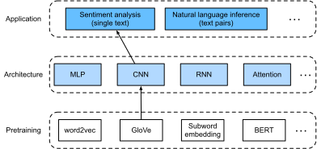
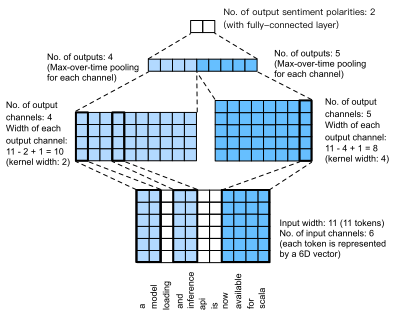

# Phân tích cảm xúc: Sử dụng mạng nơ-ron tích chập
<a id="sec_sentiment_cnn"></a> 


Trong [chap_cnn](#chap_cnn),
chúng ta đã khảo sát các cơ chế
để xử lý
dữ liệu ảnh hai chiều
bằng CNN hai chiều,
được áp dụng cho
các đặc trưng cục bộ như các điểm ảnh lân cận.
Dù ban đầu
được thiết kế cho thị giác máy tính,
CNN cũng được sử dụng rộng rãi
trong xử lý ngôn ngữ tự nhiên.
Nói đơn giản,
hãy xem bất kỳ chuỗi văn bản nào
như một ảnh một chiều.
Theo cách này,
CNN một chiều
có thể xử lý các đặc trưng cục bộ
như $n$-gram trong văn bản.

Trong phần này,
chúng ta sẽ dùng mô hình *textCNN*
để minh họa
cách thiết kế một kiến trúc CNN
cho việc biểu diễn một văn bản đơn lẻ [Kim.2014].
So với
[fig_nlp-map-sa-rnn](#fig_nlp-map-sa-rnn)
dùng kiến trúc RNN với tiền huấn luyện GloVe
cho phân tích cảm xúc,
khác biệt duy nhất trong [fig_nlp-map-sa-cnn](#fig_nlp-map-sa-cnn)
nằm ở
lựa chọn kiến trúc.



<a id="fig_nlp-map-sa-cnn"></a>

```python
#@tab mxnet
from d2l import mxnet as d2l
from mxnet import gluon, init, np, npx
from mxnet.gluon import nn
npx.set_np()

batch_size = 64
train_iter, test_iter, vocab = d2l.load_data_imdb(batch_size)
```

```python
#@tab pytorch
from d2l import torch as d2l
import torch
from torch import nn

batch_size = 64
train_iter, test_iter, vocab = d2l.load_data_imdb(batch_size)
```

## Tích chập một chiều

Trước khi giới thiệu mô hình,
hãy xem tích chập một chiều hoạt động như thế nào.
Cần nhớ rằng nó chỉ là một trường hợp đặc biệt
của tích chập hai chiều
dựa trên phép toán tương quan chéo.


<a id="fig_conv1d"></a>

Như trong [fig_conv1d](#fig_conv1d),
ở trường hợp một chiều,
cửa sổ tích chập
trượt từ trái sang phải
dọc theo tensor đầu vào.
Trong khi trượt,
tensor con đầu vào (ví dụ, $0$ và $1$ trong [fig_conv1d](#fig_conv1d)) nằm trong cửa sổ tích chập
tại một vị trí nhất định
và tensor kernel (ví dụ, $1$ và $2$ trong [fig_conv1d](#fig_conv1d)) được nhân theo từng phần tử.
Tổng của các phép nhân này
cho giá trị vô hướng duy nhất (ví dụ, $0\times1+1\times2=2$ trong [fig_conv1d](#fig_conv1d))
tại vị trí tương ứng của tensor đầu ra.

Chúng ta triển khai tương quan chéo một chiều trong hàm `corr1d` sau đây.
Với tensor đầu vào `X`
và tensor kernel `K`,
hàm trả về tensor đầu ra `Y`.

```python
#@tab all
def corr1d(X, K):
    w = K.shape[0]
    Y = d2l.zeros((X.shape[0] - w + 1))
    for i in range(Y.shape[0]):
        Y[i] = (X[i: i + w] * K).sum()
    return Y
```

Chúng ta có thể xây dựng tensor đầu vào `X` và tensor kernel `K` từ [fig_conv1d](#fig_conv1d) để kiểm chứng đầu ra của triển khai tương quan chéo một chiều ở trên.

```python
#@tab all
X, K = d2l.tensor([0, 1, 2, 3, 4, 5, 6]), d2l.tensor([1, 2])
corr1d(X, K)
```

Với bất kỳ
đầu vào một chiều nào có nhiều kênh,
kernel tích chập
cần có cùng số kênh đầu vào.
Sau đó, với mỗi kênh,
thực hiện một phép tương quan chéo trên tensor một chiều của đầu vào và tensor một chiều của kernel tích chập,
rồi cộng các kết quả trên tất cả kênh
để tạo ra tensor đầu ra một chiều.
[fig_conv1d_channel](#fig_conv1d_channel) minh họa một phép tương quan chéo một chiều với 3 kênh đầu vào.


<a id="fig_conv1d_channel"></a>


Chúng ta có thể triển khai phép tương quan chéo một chiều cho nhiều kênh đầu vào
và kiểm chứng kết quả trong [fig_conv1d_channel](#fig_conv1d_channel).

```python
#@tab all
def corr1d_multi_in(X, K):
    # First, iterate through the 0th dimension (channel dimension) of `X` and
    # `K`. Then, add them together
    return sum(corr1d(x, k) for x, k in zip(X, K))

X = d2l.tensor([[0, 1, 2, 3, 4, 5, 6],
              [1, 2, 3, 4, 5, 6, 7],
              [2, 3, 4, 5, 6, 7, 8]])
K = d2l.tensor([[1, 2], [3, 4], [-1, -3]])
corr1d_multi_in(X, K)
```

Lưu ý rằng
các phép tương quan chéo một chiều nhiều kênh đầu vào
tương đương
với
các phép tương quan chéo hai chiều
một kênh đầu vào.
Để minh họa,
một dạng tương đương của
phép tương quan chéo một chiều nhiều kênh đầu vào
trong [fig_conv1d_channel](#fig_conv1d_channel)
là
phép tương quan chéo hai chiều
một kênh đầu vào
trong [fig_conv1d_2d](#fig_conv1d_2d),
trong đó chiều cao của kernel tích chập
phải bằng chiều cao của tensor đầu vào.


<a id="fig_conv1d_2d"></a>

Cả hai đầu ra trong [fig_conv1d](#fig_conv1d) và [fig_conv1d_channel](#fig_conv1d_channel) đều chỉ có một kênh.
Tương tự các tích chập hai chiều với nhiều kênh đầu ra được mô tả trong [subsec_multi-output-channels](#subsec_multi-output-channels),
chúng ta cũng có thể chỉ định nhiều kênh đầu ra
cho tích chập một chiều.

## Max-over-time pooling

Tương tự, chúng ta có thể dùng pooling
để trích xuất giá trị cao nhất
từ các biểu diễn chuỗi
làm đặc trưng quan trọng nhất
qua các bước thời gian.
*Max-over-time pooling* được dùng trong textCNN
hoạt động giống
global max-pooling một chiều
[Collobert.Weston.Bottou.ea.2011].
Với một đầu vào nhiều kênh
trong đó mỗi kênh lưu các giá trị
tại các bước thời gian khác nhau,
đầu ra ở mỗi kênh
là giá trị lớn nhất
của kênh đó.
Lưu ý rằng
max-over-time pooling
cho phép số bước thời gian khác nhau
ở các kênh khác nhau.

## Mô hình textCNN

Sử dụng tích chập một chiều
và max-over-time pooling,
mô hình textCNN
nhận các biểu diễn token đã tiền huấn luyện riêng lẻ
làm đầu vào,
sau đó thu được và biến đổi các biểu diễn chuỗi
cho ứng dụng downstream.

Với một chuỗi văn bản đơn lẻ
có $n$ token được biểu diễn bởi
các vector $d$ chiều,
chiều rộng, chiều cao và số kênh
của tensor đầu vào
lần lượt là $n$, $1$ và $d$.
Mô hình textCNN biến đổi đầu vào
thành đầu ra như sau:

1. Định nghĩa nhiều kernel tích chập một chiều và thực hiện riêng các phép tích chập trên đầu vào. Các kernel tích chập với độ rộng khác nhau có thể bắt các đặc trưng cục bộ giữa những số lượng token lân cận khác nhau.
1. Thực hiện max-over-time pooling trên tất cả kênh đầu ra, rồi nối tất cả đầu ra pooling vô hướng thành một vector.
1. Biến đổi vector đã nối thành các hạng mục đầu ra bằng tầng kết nối đầy đủ. Có thể dùng dropout để giảm overfitting.


<a id="fig_conv1d_textcnn"></a>

[fig_conv1d_textcnn](#fig_conv1d_textcnn)
minh họa kiến trúc mô hình của textCNN
bằng một ví dụ cụ thể.
Đầu vào là một câu có 11 token,
trong đó
mỗi token được biểu diễn bởi một vector 6 chiều.
Vì vậy chúng ta có một đầu vào 6 kênh với chiều rộng 11.
Định nghĩa
hai kernel tích chập một chiều
có độ rộng 2 và 4,
với lần lượt 4 và 5 kênh đầu ra.
Chúng tạo ra
4 kênh đầu ra với chiều rộng $11-2+1=10$
và 5 kênh đầu ra với chiều rộng $11-4+1=8$.
Dù 9 kênh này có chiều rộng khác nhau,
max-over-time pooling
cho một vector 9 chiều đã nối,
cuối cùng được biến đổi
thành một vector đầu ra 2 chiều
cho dự đoán cảm xúc nhị phân.


### Định nghĩa mô hình

Chúng ta triển khai mô hình textCNN trong lớp sau.
So với mô hình RNN hai chiều trong
[sec_sentiment_rnn](#sec_sentiment_rnn),
ngoài việc
thay các tầng hồi tiếp bằng các tầng tích chập,
chúng ta cũng dùng hai tầng embedding:
một tầng với trọng số có thể huấn luyện và tầng còn lại
với trọng số cố định.

```python
#@tab mxnet
class TextCNN(nn.Block):
    def __init__(self, vocab_size, embed_size, kernel_sizes, num_channels,
                 **kwargs):
        super(TextCNN, self).__init__(**kwargs)
        self.embedding = nn.Embedding(vocab_size, embed_size)
        # The embedding layer not to be trained
        self.constant_embedding = nn.Embedding(vocab_size, embed_size)
        self.dropout = nn.Dropout(0.5)
        self.decoder = nn.Dense(2)
        # The max-over-time pooling layer has no parameters, so this instance
        # can be shared
        self.pool = nn.GlobalMaxPool1D()
        # Create multiple one-dimensional convolutional layers
        self.convs = nn.Sequential()
        for c, k in zip(num_channels, kernel_sizes):
            self.convs.add(nn.Conv1D(c, k, activation='relu'))

    def forward(self, inputs):
        # Concatenate two embedding layer outputs with shape (batch size, no.
        # of tokens, token vector dimension) along vectors
        embeddings = np.concatenate((
            self.embedding(inputs), self.constant_embedding(inputs)), axis=2)
        # Per the input format of one-dimensional convolutional layers,
        # rearrange the tensor so that the second dimension stores channels
        embeddings = embeddings.transpose(0, 2, 1)
        # For each one-dimensional convolutional layer, after max-over-time
        # pooling, a tensor of shape (batch size, no. of channels, 1) is
        # obtained. Remove the last dimension and concatenate along channels
        encoding = np.concatenate([
            np.squeeze(self.pool(conv(embeddings)), axis=-1)
            for conv in self.convs], axis=1)
        outputs = self.decoder(self.dropout(encoding))
        return outputs
```

```python
#@tab pytorch
class TextCNN(nn.Module):
    def __init__(self, vocab_size, embed_size, kernel_sizes, num_channels,
                 **kwargs):
        super(TextCNN, self).__init__(**kwargs)
        self.embedding = nn.Embedding(vocab_size, embed_size)
        # The embedding layer not to be trained
        self.constant_embedding = nn.Embedding(vocab_size, embed_size)
        self.dropout = nn.Dropout(0.5)
        self.decoder = nn.Linear(sum(num_channels), 2)
        # The max-over-time pooling layer has no parameters, so this instance
        # can be shared
        self.pool = nn.AdaptiveAvgPool1d(1)
        self.relu = nn.ReLU()
        # Create multiple one-dimensional convolutional layers
        self.convs = nn.ModuleList()
        for c, k in zip(num_channels, kernel_sizes):
            self.convs.append(nn.Conv1d(2 * embed_size, c, k))

    def forward(self, inputs):
        # Concatenate two embedding layer outputs with shape (batch size, no.
        # of tokens, token vector dimension) along vectors
        embeddings = torch.cat((
            self.embedding(inputs), self.constant_embedding(inputs)), dim=2)
        # Per the input format of one-dimensional convolutional layers,
        # rearrange the tensor so that the second dimension stores channels
        embeddings = embeddings.permute(0, 2, 1)
        # For each one-dimensional convolutional layer, after max-over-time
        # pooling, a tensor of shape (batch size, no. of channels, 1) is
        # obtained. Remove the last dimension and concatenate along channels
        encoding = torch.cat([
            torch.squeeze(self.relu(self.pool(conv(embeddings))), dim=-1)
            for conv in self.convs], dim=1)
        outputs = self.decoder(self.dropout(encoding))
        return outputs
```

Hãy tạo một instance textCNN.
Nó có 3 tầng tích chập với độ rộng kernel là 3, 4 và 5, tất cả đều có 100 kênh đầu ra.

```python
#@tab mxnet
embed_size, kernel_sizes, nums_channels = 100, [3, 4, 5], [100, 100, 100]
devices = d2l.try_all_gpus()
net = TextCNN(len(vocab), embed_size, kernel_sizes, nums_channels)
net.initialize(init.Xavier(), ctx=devices)
```

```python
#@tab pytorch
embed_size, kernel_sizes, nums_channels = 100, [3, 4, 5], [100, 100, 100]
devices = d2l.try_all_gpus()
net = TextCNN(len(vocab), embed_size, kernel_sizes, nums_channels)

def init_weights(module):
    if type(module) in (nn.Linear, nn.Conv1d):
        nn.init.xavier_uniform_(module.weight)

net.apply(init_weights);
```

### Nạp các vector từ đã tiền huấn luyện

Giống như [sec_sentiment_rnn](#sec_sentiment_rnn),
chúng ta nạp các embedding GloVe đã tiền huấn luyện 100 chiều
làm các biểu diễn token khởi tạo.
Các biểu diễn token này (trọng số embedding)
sẽ được huấn luyện trong `embedding`
và được cố định trong `constant_embedding`.

```python
#@tab mxnet
glove_embedding = d2l.TokenEmbedding('glove.6b.100d')
embeds = glove_embedding[vocab.idx_to_token]
net.embedding.weight.set_data(embeds)
net.constant_embedding.weight.set_data(embeds)
net.constant_embedding.collect_params().setattr('grad_req', 'null')
```

```python
#@tab pytorch
glove_embedding = d2l.TokenEmbedding('glove.6b.100d')
embeds = glove_embedding[vocab.idx_to_token]
net.embedding.weight.data.copy_(embeds)
net.constant_embedding.weight.data.copy_(embeds)
net.constant_embedding.weight.requires_grad = False
```

### Huấn luyện và đánh giá mô hình

Bây giờ chúng ta có thể huấn luyện mô hình textCNN cho phân tích cảm xúc.

```python
#@tab mxnet
lr, num_epochs = 0.001, 5
trainer = gluon.Trainer(net.collect_params(), 'adam', {'learning_rate': lr})
loss = gluon.loss.SoftmaxCrossEntropyLoss()
d2l.train_ch13(net, train_iter, test_iter, loss, trainer, num_epochs, devices)
```

```python
#@tab pytorch
lr, num_epochs = 0.001, 5
trainer = torch.optim.Adam(net.parameters(), lr=lr)
loss = nn.CrossEntropyLoss(reduction="none")
d2l.train_ch13(net, train_iter, test_iter, loss, trainer, num_epochs, devices)
```

Dưới đây chúng ta dùng mô hình đã huấn luyện để dự đoán cảm xúc cho hai câu đơn giản.

```python
#@tab all
d2l.predict_sentiment(net, vocab, 'this movie is so great')
```

```python
#@tab all
d2l.predict_sentiment(net, vocab, 'this movie is so bad')
```

## Tóm tắt

* CNN một chiều có thể xử lý các đặc trưng cục bộ như $n$-gram trong văn bản.
* Tương quan chéo một chiều nhiều kênh đầu vào tương đương với tương quan chéo hai chiều một kênh đầu vào.
* Max-over-time pooling cho phép số bước thời gian khác nhau ở các kênh khác nhau.
* Mô hình textCNN biến đổi các biểu diễn token riêng lẻ thành đầu ra của ứng dụng downstream bằng các tầng tích chập một chiều và các tầng max-over-time pooling.


## Bài tập

1. Điều chỉnh các siêu tham số và so sánh hai kiến trúc cho phân tích cảm xúc trong [sec_sentiment_rnn](#sec_sentiment_rnn) và trong phần này, chẳng hạn về độ chính xác phân loại và hiệu quả tính toán.
1. Bạn có thể cải thiện thêm độ chính xác phân loại của mô hình bằng các phương pháp được giới thiệu trong phần bài tập của [sec_sentiment_rnn](#sec_sentiment_rnn) không?
1. Thêm positional encoding vào các biểu diễn đầu vào. Điều này có cải thiện độ chính xác phân loại không?


[Thảo luận](https://discuss.d2l.ai/t/1425)
