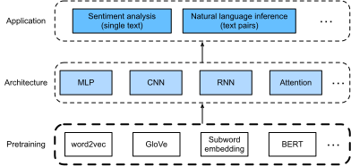

# Xử Lý Ngôn Ngữ Tự Nhiên: Tiền Huấn Luyện
<a id="chap_nlp_pretrain"></a>


Con người cần giao tiếp.
Từ nhu cầu cơ bản này của đời sống con người, một lượng văn bản khổng lồ được tạo ra hằng ngày.
Với văn bản phong phú trên mạng xã hội, ứng dụng trò chuyện, email, đánh giá sản phẩm, bài báo tin tức, bài báo nghiên cứu, và sách, việc giúp máy tính hiểu chúng để hỗ trợ hoặc đưa ra quyết định dựa trên ngôn ngữ con người trở nên rất quan trọng.

*Xử lý ngôn ngữ tự nhiên* nghiên cứu các tương tác giữa máy tính và con người bằng ngôn ngữ tự nhiên.
Trong thực tế, việc dùng các kỹ thuật xử lý ngôn ngữ tự nhiên để xử lý và phân tích dữ liệu văn bản (ngôn ngữ tự nhiên của con người) là rất phổ biến, chẳng hạn các mô hình ngôn ngữ trong [sec_language-model](#sec_language-model) và các mô hình dịch máy trong [sec_machine_translation](#sec_machine_translation).

Để hiểu văn bản, chúng ta có thể bắt đầu bằng cách học
các biểu diễn của nó.
Tận dụng các chuỗi văn bản hiện có
từ các kho ngữ liệu lớn,
*học tự giám sát*
đã được sử dụng rộng rãi
để tiền huấn luyện biểu diễn văn bản,
chẳng hạn bằng cách dự đoán một phần bị ẩn của văn bản
từ một phần khác trong văn bản xung quanh nó.
Theo cách này,
các mô hình học thông qua sự giám sát
từ dữ liệu văn bản *khổng lồ*
mà không cần nỗ lực gán nhãn *tốn kém*!


Như sẽ thấy trong chương này,
khi xem mỗi từ hoặc từ con như một token riêng lẻ,
biểu diễn của mỗi token có thể được tiền huấn luyện
bằng word2vec, GloVe, hoặc các mô hình embedding từ con
trên các kho ngữ liệu lớn.
Sau khi tiền huấn luyện, biểu diễn của mỗi token có thể là một vector,
tuy nhiên, nó vẫn giữ nguyên bất kể ngữ cảnh là gì.
Ví dụ, biểu diễn vector của "bank" là giống nhau
trong cả
"go to the bank to deposit some money"
và
"go to the bank to sit down".
Do đó, nhiều mô hình tiền huấn luyện gần đây hơn điều chỉnh biểu diễn của cùng một token
theo các ngữ cảnh khác nhau.
Trong số đó có BERT, một mô hình tự giám sát sâu hơn nhiều dựa trên encoder Transformer.
Trong chương này, chúng ta sẽ tập trung vào cách tiền huấn luyện các biểu diễn như vậy cho văn bản,
như được nhấn mạnh trong [fig_nlp-map-pretrain](#fig_nlp-map-pretrain).


<a id="fig_nlp-map-pretrain"></a>


Để thấy bức tranh tổng thể,
[fig_nlp-map-pretrain](#fig_nlp-map-pretrain) cho thấy rằng
các biểu diễn văn bản đã tiền huấn luyện có thể được đưa vào
nhiều kiến trúc deep learning khác nhau cho các ứng dụng xử lý ngôn ngữ tự nhiên downstream khác nhau.
Chúng ta sẽ trình bày chúng trong [chap_nlp_app](#chap_nlp_app).

```toc
:maxdepth: 2

word2vec
approx-training
word-embedding-dataset
word2vec-pretraining
glove
subword-embedding
similarity-analogy
bert
bert-dataset
bert-pretraining

```
